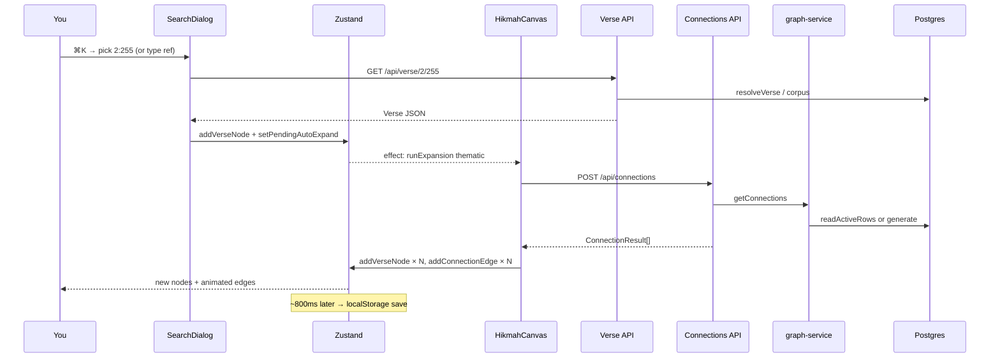

# Phase 11 — Browser ↔ Code Correlation

> **Prerequisites:** Phases [1](./phase-1-what-is-openhikmah.md)–[10](./phase-10-run-locally.md) — **app running locally** (`bun run dev`, Postgres seeded, AI keys set)  
> **Evidence tags:** **FACT** · **INFERENCE** · **UNKNOWN**

Phases 6–10 traced flows **from source code**. Phase 11 closes the loop: **perform one flow in the browser** and correlate DevTools evidence with the symbols you already know.

**This phase is read-only** — you observe runtime behavior; you do not change code. (Phase 12 is the first controlled experiment, and it requires your explicit approval.)

---

## What you will do

One end-to-end exercise: **search a verse → land on canvas → auto thematic expand → see new nodes and edges.**

That single journey touches:

- React components
- Zustand mutations
- Three API routes
- Postgres cache miss or hit
- Optional external AI call
- localStorage autosave

A shorter **bonus trace** for keyword search is at the end.

---

## DevTools setup (before you click anything)

Open [http://localhost:3000/canvas](http://localhost:3000/canvas) in Chrome or Edge.

| Panel | Setting | Why |
| --- | --- | --- |
| **Network** | ✅ Preserve log | Navigation/dialog close won't wipe requests |
| **Network** | Filter: `Fetch/XHR` | Hides static assets |
| **Network** | Optional: Disable cache | See fresh API responses while iterating |
| **Application → Local Storage** | Key `open-hikmah-canvas` | Verify canvas autosave (Phase 8) |
| **Console** | Leave open | Expansion failures log here |

**FACT:** OpenHikmah has no Zustand DevTools middleware in `store/canvas.ts` — you infer client state from **UI behavior**, **Network**, and **localStorage**, not a Redux-style time-travel panel.

**INFERENCE:** React DevTools (Components tab) helps locate `VerseNode` / `HikmahCanvas`, but the onboarding correlation path below does not require it.

Keep the **terminal running `bun run dev`** visible — server-side errors appear there when the browser only shows a toast.

---

## The traced flow (overview)



---

## Step-by-step correlation

For each step: **what you do**, **what Network shows**, **what code runs**, **what changes in the UI**.

### Step 1 — Open search

| | |
| --- | --- |
| **You** | Press **⌘K** (or click Search on empty canvas) |
| **Component** | `CanvasPageClient` keyboard handler → `SearchDialog` |
| **Network** | Usually nothing yet |
| **Code** | `app/canvas/CanvasPageClient.tsx` — `setSearchOpen(true)` |

---

### Step 2 — Select verse `2:255`

| | |
| --- | --- |
| **You** | Type `2:255` or pick a seed result (e.g. Ayat al-Kursi) |
| **Network** | `GET /api/verse/2/255` — **200** |
| **Client** | `SearchDialog.loadSeedVerse` or `selectResult` → `fetch(/api/verse/...)` |
| **Server** | `app/api/verse/[surah]/[ayah]/route.ts` |

**Inspect the response body** — should match `Verse` (`types/quran.ts`):

```json
{
  "surah": 2,
  "ayah": 255,
  "ref": "2:255",
  "arabicText": "…",
  "translation": "…",
  "surahName": "Al-Baqarah",
  "surahNameArabic": "…"
}
```

**Server path:**

```text
isValidRef("2:255")
→ getQuranEdition()     // cookie oh_edition or locale default
→ resolveVerse(ref)     // lib/quran/verse-resolver.ts
   → getVerse from Postgres verses table
   → or live alquran.cloud fallback if corpus miss
```

**Cookies to notice** (Request headers → Cookie):

| Cookie | Purpose |
| --- | --- |
| `oh_locale` | UI + connection reason locale (`getUiLocale`) |
| `oh_edition` | Translation edition for display (`getQuranEdition`) |

**FACT:** Verse route sets `dynamic = "force-dynamic"` because edition cookie varies response.

---

### Step 3 — Node appears on canvas

| | |
| --- | --- |
| **Network** | Search dialog may close; no new request |
| **Client** | `SearchDialog.mapConnections(verse)` |
| **Zustand** | `addVerseNode({ ...verse, isRoot: true }, position)` |
| **Zustand** | `setPendingAutoExpand(nodeId)` — **first node only** |
| **UI** | One verse card at center (or free slot); pulse animation |

**Code path:**

```text
store/canvas.ts → addVerseNode
  → nextId() → node-N
  → setNewlyAddedNode(id)

SearchDialog.mapConnections:
  isFirst → position {0,0}
  → setPendingAutoExpand(nodeId)
```

**React Flow:** `HikmahCanvas` re-renders with `nodes.length === 1`; toolbar appears.

---

### Step 4 — Auto thematic expand (no extra click)

| | |
| --- | --- |
| **You** | Wait ~1s — spinner on the node |
| **Network** | `POST /api/connections` — may take **several seconds** on first miss |
| **Client** | `HikmahCanvas` effect on `pendingAutoExpand` → `runExpansion(..., kind: "thematic")` |
| **UI** | `expandingNodeId` set → loader on `VerseNode` |

**Inspect POST request body:**

```json
{
  "fromRef": "2:255",
  "kind": "thematic",
  "arabicText": "…",
  "translation": "…",
  "excludeRefs": []
}
```

**FACT:** First expand sends **empty** `excludeRefs`. "Get more" sends refs of existing same-kind child edges (Phase 8).

---

### Step 5 — Server handles connections

| | |
| --- | --- |
| **Route** | `app/api/connections/route.ts` |
| **Library** | `getConnections` → `lib/ai/graph-service.ts` |

**Terminal (dev server) on cache miss:** you may see AI-related latency; on **502** you will see:

```text
Connections route: unparseable AI response: ...
```

**Response inspec — success (200):**

JSON **array** of 1–3 objects:

```json
[
  {
    "surah": 3,
    "ayah": 18,
    "ref": "3:18",
    "arabicText": "…",
    "translation": "…",
    "surahName": "…",
    "surahNameArabic": "…",
    "reason": "One sentence…",
    "kind": "thematic"
  }
]
```

**Map status → meaning:**

| Status | Body | Code branch | UI |
| --- | --- | --- | --- |
| **200** | `[...]` length ≥ 1 | Normal | New nodes stagger in |
| **200** | `[]` | Empty generation | Error toast — "no connections" |
| **429** | `{ "error": "Too many requests…" }` | `RateLimitError` | Error toast |
| **502** | `{ "error": "Connection generation failed…" }` | `ConnectionParseError` | Error toast — retry |
| **400** | `{ "error": "…" }` | Validation | Error toast |

**FACT:** Empty array **200** ≠ **502** — Phase 7 distinction. Network tab status column is the first check.

**Server miss path (correlate with terminal timing):**

```text
readActiveRows → miss
→ discoverCandidates (pgvector or morphology)
→ generateGroundedConnections (Claude/Gemini)
→ INSERT connections
→ hydrate → JSON array
```

**Server hit path (second user, or you expand same cell again after cache warm):**

```text
readActiveRows → rows found
→ hydrate → JSON array   (fast — no AI latency)
```

**INFERENCE:** First expand on a cold DB: **multi-second** POST. Repeat same `(2:255, thematic, locale)` with same empty exclude: **milliseconds**.

---

### Step 6 — Canvas updates from response

| | |
| --- | --- |
| **Network** | POST completes |
| **Client** | `HikmahCanvas.runExpansion` loop |
| **Zustand** | Per connection: `addVerseNode` + `addConnectionEdge` |
| **UI** | Up to 3 nodes fan out; colored edges; `fitView` animation |

**Per-connection client logic:**

```text
if hasNode(conn.ref) → edge only to existing node
else → radialPos + findFreeSlot → addVerseNode(conn, pos)
buildConnectionEdge(sourceId, targetId, conn)
addConnectionEdge(edge)
await 350ms between each
```

**Edge click (optional):** click edge label → `setSidebarContent({ type: "edge", reason, ... })` → `ContextSidebar`.

---

### Step 7 — Persistence (after ~800ms)

| | |
| --- | --- |
| **Network** | No request — client-only |
| **Application tab** | `localStorage["open-hikmah-canvas"]` updates |
| **Code** | `useCanvasPersistence` debounced save → `serializeCanvas` |

**Inspect saved JSON shape:**

```json
{
  "v": 1,
  "nodes": [{ "id": "node-1", "x": 0, "y": 0, "verse": { "ref": "2:255", ... } }],
  "edges": [{ "id": "edge-node-1-node-2", "source": "node-1", "target": "node-2", "kind": "thematic", "label": "…", "reason": "…" }]
}
```

**Refresh the page** — canvas restores from localStorage (unless `?share=` took precedence on mount).

---

## Manual expand (same correlation, one difference)

Instead of search auto-expand:

1. Click **+** on a node → **Theme** / **Root** / **Contrast**
2. `VerseNode.handleExpandSelect` → `setPendingExpand({ nodeId, ref, kind })`
3. Same `POST /api/connections` — but `kind` matches your menu choice

**Root vs thematic server difference** (invisible in Network — same URL):

| Kind | Discovery |
| --- | --- |
| `thematic` | `semanticCandidates` → pgvector |
| `root` | `rootCandidates` → `word_morphology` SQL |
| `contrast` | same pool as thematic; AI picks opposites |

Compare POST bodies: only `kind` and `excludeRefs` change.

---

## Bonus trace — keyword search (shorter)

| Step | Network | Code |
| --- | --- | --- |
| ⌘K → type `mercy` | `GET /api/search?q=mercy` | `app/api/search/route.ts` |
| Response | `{ results, total, page, related? }` | Parallel `keywordSearch` + `relatedByMeaning` |
| Select a hit | `GET /api/verse/{s}/{a}` | Same as Step 2 above |

**FACT:** Keyword hits come from **quran.com**; displayed Arabic/translation hydrated from **local corpus** in the route.

**FACT:** `related` array (semantic) only on **page 1**; failures are **omitted**, not errored — you may see keyword results with no "related" section if embeddings missing or rate limit hit.

---

## Correlation cheat sheet (print mentally)

| Network request | Route file | Core library |
| --- | --- | --- |
| `GET /api/verse/2/255` | `app/api/verse/[surah]/[ayah]/route.ts` | `resolveVerse`, `quran-corpus` |
| `POST /api/connections` | `app/api/connections/route.ts` | `graph-service`, `connection-discovery`, `connection-generator` |
| `GET /api/search?q=` | `app/api/search/route.ts` | quran.com + `semantic-search` |
| `GET /api/verse/2/255/similar` | `app/api/verse/.../similar/route.ts` | `similarVerses` |
| `POST /api/share` | `app/api/share/route.ts` | `shared_canvases` table |

| UI symptom | Check Network first | Then server terminal |
| --- | --- | --- |
| Spinner forever | POST stuck pending | DB down? AI hang? |
| Error toast on expand | POST status 502/429/500 | Parse error log / rate limit |
| Empty canvas after refresh | (no network) | Application → localStorage empty? |
| Share link fails | POST /api/share 413/400 | Canvas too large / invalid nodes |

---

## When runtime disagrees with the doc

**Do not assume the code is wrong first.** Work this checklist:

1. **Was Postgres seeded?** Unseeded corpus → fallback fetches; unseeded embeddings → empty semantic/legacy expand behavior.
2. **Cache hit?** Second identical expand is fast with no AI — not a bug.
3. **Cookies** — `oh_locale` changes connection reason language path on miss.
4. **Rate limit** — 429 after many expands/searches; wait or restart dev (Postgres `rate_limits` table in dev).
5. **Compare terminal + Network status** — browser toast alone is ambiguous.

**FACT:** `/api/health` returning OK does **not** prove database connectivity — always correlate with a DB-backed route like `/api/verse/2/255` or `POST /api/connections`.

---

## Optional: React DevTools spot checks

If you install React DevTools:

| Component | Prop/state to notice |
| --- | --- |
| `HikmahCanvas` / `CanvasInner` | Receives `nodes`, `edges` from Zustand selectors |
| `VerseNode` | `data.ref`, `isExpanding` when `expandingNodeId === id` |
| `SearchDialog` | Local `query`, `searchResults` — not in Zustand |

Zustand state itself lives outside React props — **Network + localStorage** remain the practical debug sources.

---

## Exercise (do this once)

With DevTools Network open (Preserve log):

1. Clear canvas (toolbar Clear → confirm).
2. ⌘K → add **2:255**.
3. Record: verse GET status, connections POST status + duration + response length.
4. Expand **Root** manually on the same node.
5. Record second POST — note `excludeRefs` in request (may be empty if first expand failed).
6. Refresh page — confirm canvas restores from localStorage.
7. Write one sentence: **which step was slowest, and which code path explains it.**

Expected honest outcomes:

| Your setup | Slowest step likely |
| --- | --- |
| Cold DB, first thematic | POST `/api/connections` — AI + pgvector + persist |
| Warm cache | POST still happens but **<100ms** — cache hit |
| Missing `GEMINI_API_KEY` / no embed | Thematic may fall back or return empty — correlate with Phase 10 matrix |

---

## MUST UNDERSTAND NOW

1. **One user action → ordered Network requests** — learn to read the waterfall, not isolated routes.
2. **`POST /api/connections` body** carries source verse text + `excludeRefs` — server does not re-fetch source from DB for the prompt.
3. **200 + `[]` vs 502** — different failure semantics; read status before reading body shape.
4. **Client state commits after JSON returns** — `addVerseNode` / `addConnectionEdge`; React Flow is a view.
5. **localStorage updates without network** — debounced after graph mutations.
6. **Terminal + Network together** — toast messages are summaries; evidence is status codes and server logs.

---

## USEFUL LATER

- Filter Network by `connections` while clicking **Get more** — watch `excludeRefs` grow.
- `POST /api/share` after building a graph — correlate with Phase 8 share flow.
- Performance tab: expansion stagger (`350ms` × N) is intentional client animation.
- Cursor browser MCP / Playwright — same correlation, automatable (CI uses `e2e/canvas.spec.ts`).

---

## IGNORE FOR NOW

- Service Worker / PWA caching — not central to this app.
- Next.js RSC payload tabs for client-heavy `/canvas` — most interesting traffic is `Fetch/XHR`.
- WebSocket — OpenHikmah canvas does not use one for expand.

---

## Phase 11 checkpoint questions

1. After selecting a search result, which two Zustand actions fire for the **first** node on an empty canvas?
2. What four fields does `POST /api/connections` send, and where does `excludeRefs` come from?
3. How do you distinguish AI parse failure from a valid empty result in DevTools?
4. Where does the canvas snapshot land after expand, and how long after the last node add?
5. Why might the second identical thematic expand be much faster than the first?

---

**Next:** [Phase 12 — One controlled experiment](./phase-12-controlled-experiment.md) — a tiny, reversible change with your approval (not theological/auth/migration territory).

Say **“continue to Phase 12”** after completing the exercise above, or paste a Network HAR / status code if something did not match this doc — we debug from evidence.
