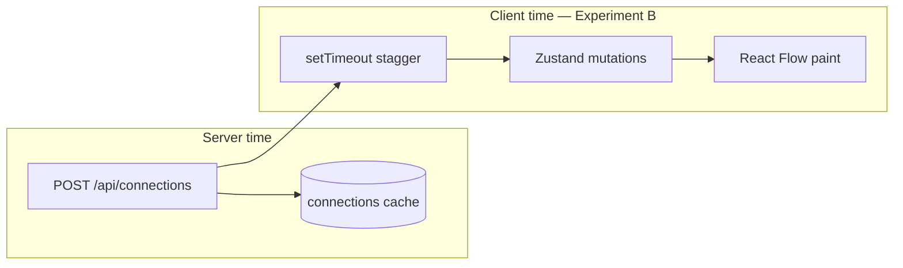

# Phase 12 — One Controlled Local Experiment

> **Prerequisites:** Phases [1](./phase-1-what-is-openhikmah.md)–[11](./phase-11-browser-code-correlation.md) — app running locally; Phase 11 exercise completed (or attempted)  
> **Evidence tags:** **FACT** · **INFERENCE** · **UNKNOWN**

Phase 11 was **observe only**. Phase 12 is your first **controlled mutation** — small, reversible, and chosen to reinforce something you already traced in code.

**Nothing in this phase runs automatically.** Experiment A needs no code change. Experiment B needs **your explicit approval** before any file is edited.

---

## Rules for Phase 12 experiments

From the original onboarding spec — still binding:

| Allowed | Not allowed (yet) |
| --- | --- |
| Harmless UI timing / presentation | Theological prompts |
| Observing runtime without code changes | Quran text or Arabic fixtures |
| One-file, few-line diffs | Validation guardrails |
| Revert after verifying | Auth / PKCE flows |
| | Database migrations |

After any code experiment: **verify → revert → confirm clean git status** unless you explicitly ask to keep the change.

---

## Experiment A — Cache miss vs hit (read-only, no approval)

**Purpose:** Prove Phase 7/11 in runtime — first expand pays AI/DB cost; second identical expand is a fast cache read.

### Hypothesis

**INFERENCE:** The first `POST /api/connections` for `(2:255, thematic, en, excludeRefs=[])` will take **seconds** on a cold cell; a second identical request (after clearing canvas but same server DB) will complete in **milliseconds**.

### Execution path

```text
Browser: SearchDialog → addVerseNode(2:255) → runExpansion(thematic)
  → POST /api/connections
Server: getConnections → readActiveRows (miss) → discoverCandidates → AI → INSERT connections
  → JSON response

Repeat (same verse, same kind, empty excludeRefs):
  → readActiveRows (hit) → hydrate → JSON response
```

### Procedure

1. DevTools → Network → Preserve log, filter Fetch/XHR.
2. Note Postgres has seeded corpus + embeddings (Phase 10).
3. Clear canvas (toolbar Clear, confirm).
4. Add **2:255** (⌘K) — wait for auto thematic expand.
5. Record **POST `/api/connections`**: status, **Time** column (ms), response array length.
6. Clear canvas again (nodes gone; **Postgres `connections` rows remain**).
7. Add **2:255** again — auto expand again.
8. Record second POST timing.

### Predicted result

| Request | Time (order of magnitude) | Server path |
| --- | --- | --- |
| First | 2–30+ seconds (AI + embed discovery) | Cache **miss** |
| Second | <500 ms typical | Cache **hit** |

### What to write down

One sentence answering: *Did the second POST lack multi-second AI latency even though the UI looked the same?*

If timings are **similar both times**, investigate before blaming the code:

- Same `(fromRef, kind, locale)` cell might not have persisted (check terminal for `gen_persist_failed`).
- First request returned `[]` or 502 — no rows cached.
- Rate limit or provider error on first call.

**No git changes.** Skip to Experiment B approval only if you want a code mutation exercise.

---

## Experiment B — Slow expansion stagger (code change, needs approval)

**Purpose:** Prove Phase 11 Step 6 — **client animation timing is local code**, not the API. Changing one `setTimeout` constant visibly slows how nodes appear after the POST already returned.

### Hypothesis

**INFERENCE:** Increasing the per-node delay in `HikmahCanvas.runExpansion` from **350ms** to **900ms** will make nodes appear ~1.6s slower **per node** after the network request completes, with **no change** to API payload or server behavior.

### Execution path

```text
POST /api/connections completes (unchanged)
  → runExpansion loop:
       for each connection:
         await setTimeout(900)   // was 350
         addVerseNode / addConnectionEdge
  → React Flow re-render
```

**Where:** `components/canvas/HikmahCanvas.tsx` — inside `runExpansion`, the loop over `connections`:

```typescript
await new Promise<void>((resolve) => setTimeout(resolve, 350));
```

### Exact change (if approved)

**One line** in `components/canvas/HikmahCanvas.tsx`:

```diff
- await new Promise<void>((resolve) => setTimeout(resolve, 350));
+ await new Promise<void>((resolve) => setTimeout(resolve, 900));
```

No other files. No commits unless you ask later.

### Predicted result

| Observation | Before (350ms) | After (900ms) |
| --- | --- | --- |
| 3 new nodes | ~1s stagger after POST | ~2.7s stagger after POST |
| Network POST duration | Unchanged | Unchanged |
| Response JSON | Unchanged | Unchanged |

You should see: **Network finishes quickly** (especially on cache hit), then nodes still drip in slowly — decoupling confirmed.

### How to verify

1. Apply diff (after approval).
2. Save file — Next.js hot reload.
3. Clear canvas.
4. Expand a verse that returns **3** connections (e.g. **2:255** thematic on seeded DB).
5. Watch: POST completes in Network tab **before** all nodes are visible.
6. Compare feel to pre-change behavior (or use screen recording / stopwatch).

### Revert

```diff
- await new Promise<void>((resolve) => setTimeout(resolve, 900));
+ await new Promise<void>((resolve) => setTimeout(resolve, 350));
```

Or:

```bash
git checkout -- components/canvas/HikmahCanvas.tsx
```

Confirm: `git status` clean (or only your unrelated work).

---

## Approval checkpoint (Experiment B)

**Do not apply Experiment B until you reply with approval.**

Reply with one of:

| Response | Meaning |
| --- | --- |
| **"Approve Experiment B"** | Agent may apply the one-line change, you re-test in browser, then revert together |
| **"Experiment A only"** | Stay read-only; move to Phase 13 |
| **"Propose a different experiment"** | Say what you want to learn (must stay in allowed territory) |

**UNKNOWN until you run it:** Whether your local cache is warm enough that POST is already fast — the stagger change is still visible either way.

---

## Optional Experiment C — Persistence debounce (alternative if B feels too subtle)

Only if you reject B — same approval rules.

| | |
| --- | --- |
| **Hypothesis** | Longer autosave debounce delays `localStorage` update after expand |
| **File** | `hooks/useCanvasPersistence.ts` — `800` → `3000` in debounce `setTimeout` |
| **Verify** | Expand → refresh within 1s → canvas may **not** restore; wait 4s → refresh → restores |
| **Risk** | Slightly higher — affects persistence UX, not just animation |
| **Revert** | Restore `800` |

Experiment B is **recommended** — clearer visual feedback, smaller blast radius.

---

## What you learn from Phase 12



| Lesson | Experiment |
| --- | --- |
| Postgres graph cache amortizes AI cost | **A** — POST timing |
| UI animation ≠ server latency | **B** — stagger constant |
| Onboarding can trust code traces when runtime matches | **A + B** |

---

## MUST UNDERSTAND NOW

1. **Experiment A** needs no approval — do it anytime the app runs.
2. **Experiment B** is one line, one file, fully reversible — but still requires your **yes**.
3. **Never** start Phase 12-style edits on prompts, verse validation, auth, or migrations — those are high-risk contribution areas (Phase 16).
4. **Revert is part of the experiment**, not optional cleanup — unless you choose to keep the change for a real PR (which would need tests and scope justification).

---

## USEFUL LATER

- Repeat Experiment A after `TRUNCATE connections` in local Postgres — restores miss-path behavior for debugging.
- Use the same protocol for your **first real contribution** — hypothesis, path, predict, diff, verify.

---

## IGNORE FOR NOW

- Committing Experiment B — not a PR-worthy change by itself.
- Adding `console.log` traces — prefer Network tab + targeted constant changes per repo code style.

---

## Phase 12 checkpoint questions

1. Why does Experiment A’s second expand stay fast even after you clear the canvas?
2. What single line would Experiment B change, and why does it not affect the API?
3. What would you check if first and second POST timings are both slow?
4. What is the revert command for Experiment B?

---

**Next:** [Phase 13 — Testing mental model](./phase-13-testing-mental-model.md) — unit vs integration vs e2e and what each proves in this repo.

**Your move:** Run **Experiment A** now and note timings, then reply **"Approve Experiment B"** if you want the one-line stagger change applied, or **"continue to Phase 13"** to stay read-only.
