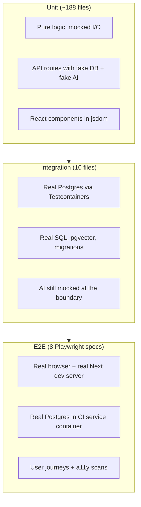
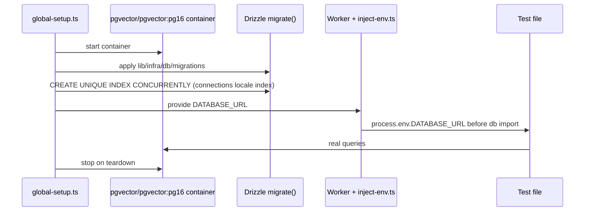

# Phase 13 — Testing Mental Model

> **Prerequisites:** Phases [1](./phase-1-what-is-openhikmah.md)–[12](./phase-12-controlled-experiment.md) — local setup (Phase 10); Phase 7/11/12 expand path understood  
> **Evidence tags:** **FACT** · **INFERENCE** · **UNKNOWN**

Phases 6–12 traced **runtime behavior**. Phase 13 explains how this repo **proves** that behavior stays correct — and why some failures here are theological, not just functional bugs.

**This phase is read-only.** You run existing tests; you do not add or change test code yet.

---

## Why testing is different here

Most web apps treat tests as regression nets for UX and business logic. Open Hikmah adds a second bar:

| Failure type | Example | Why it matters |
| --- | --- | --- |
| **Functional** | Expansion POST returns 500 | Broken feature |
| **Theological / data integrity** | AI returns `99:99` and it gets persisted | Sacred-data violation |
| **Guardrail weakening** | Loosening `isValidRef` to make a test pass | Worse than a bug — hides a trust failure |

**FACT:** `AGENTS.md` explicitly forbids loosening theological or verse-reference validation to pass tests. Fix the data or prompt instead.

**INFERENCE:** When you contribute, CI green is necessary but not sufficient — reviewers will ask whether your test change **strengthens** or **weakens** the trust model from Phase 7.

---

## Three layers — what each proves



| Layer | Command | Environment | Proves | Does **not** prove |
| --- | --- | --- | --- | --- |
| **Unit** | `bun run test` / `bun run test:ci` | jsdom (components) or node; **no Docker** | Parsing, validation, orchestration, UI state with mocks | Real SQL plans, real pgvector ranking, full browser layout |
| **Integration** | `bun run test:integration` | Node + **Docker** (Testcontainers) | Persistence, discovery SQL, cache miss/hit against real schema | End-user UI, OAuth, production AI quality |
| **E2E** | `bun run test:e2e` | Chromium + `next dev` on port **3100** | Critical paths work together; serious a11y violations blocked | Every admin edge case, every AI prompt variant |

**FACT:** Unit config **excludes** `__tests__/integration/**` and `e2e/**` (`vitest.config.ts`). Integration uses a separate config (`vitest.integration.config.ts`).

---

## Where tests live

**FACT:** Unit tests mirror source layout under `__tests__/`:

```text
lib/ai/graph-service.ts          → __tests__/lib/ai/graph-service.test.ts
app/api/connections/route.ts     → __tests__/api/connections.test.ts
components/canvas/HikmahCanvas.tsx → __tests__/components/canvas/HikmahCanvas*.test.tsx
store/canvas.ts                  → __tests__/store/canvas.test.ts
```

Integration tests are **not** mirrored per file — they cluster by **cross-cutting persistence behavior**:

| File | What it exercises |
| --- | --- |
| `graph.integration.test.ts` | `getConnections` miss → AI mock → INSERT → hit (Phase 7/12 cache story) |
| `connection-discovery.integration.test.ts` | `discoverCandidates` root ranking over real `word_morphology` |
| `semantic-search.integration.test.ts` | pgvector cosine ranking with mocked `embed()` |
| `connection-batch.integration.test.ts` | Admin batch persistence |
| `job-runner-lock.integration.test.ts` | Cross-process job lock |
| `name-content-locale.integration.test.ts` | Locale-scoped name content |
| `root-concordance.integration.test.ts` | Concordance SQL |
| `story-flags.integration.test.ts` | Story visibility flags in DB |
| `user-tz-offset.integration.test.ts` | Timezone offset persistence |
| `verse-translations.integration.test.ts` | Translation storage |

E2E specs live in `e2e/*.spec.ts` — one concern per file (`canvas`, `search`, `social`, `admin`, `stories`, `settings`, `a11y`, `mobile-nav-overlap`).

---

## Commands you should actually run

From repo root (after `bun install`):

```bash
# Interactive unit tests (watch mode) — daily driver
bun run test

# Single run — matches pre-commit hook
bun run test:ci

# Coverage + thresholds — matches CI lint-typecheck-test job
bun run test:coverage

# Integration — needs Docker running
bun run test:integration

# E2E — needs Docker for CI-style Postgres; locally reuses dev server if port 3100 is up
bun run test:e2e
```

Also in the quality bar (not “tests” but gate merge):

```bash
bun run lint
bun run typecheck
bun run format:check
bun run build   # after unit + integration pass in CI
```

**FACT:** `pre-commit` runs guards → lint-staged → typecheck → **`test:ci` (unit only)**.  
**FACT:** `pre-push` runs **`test:integration` only** — and **fails closed** if Docker is not running (`.husky/pre-push`).

**INFERENCE:** You can commit with passing unit tests but still fail on push without Docker — by design.

---

## Layer 1 — Unit tests (Vitest)

### Config highlights

**FACT** (`vitest.config.ts`):

- `environment: "jsdom"` for component tests
- `pool: "forks"` (Bun/Windows compatibility)
- `testTimeout: 20000` — heavy App Router imports need headroom
- Coverage scoped to `lib/**`, `store/**`, `app/api/**` with floors (~65% statements/lines)

**FACT** (`vitest.setup.ts`):

- `@testing-library/jest-dom`
- In-memory `localStorage` polyfill (Node ≥22 quirk)
- Dummy env vars so API modules load without `.env.local`

### Mocking patterns (learn these once)

Three recurring shapes appear across ~188 unit files:

**1. Chainable Drizzle mock** — API route tests stub `db.select()` / `db.insert()` with a Proxy that resolves like a Promise:

```text
__tests__/api/connections.test.ts  → makeDbChain([])
__tests__/lib/quran/quran-corpus.test.ts → makeDbChain(rows)
```

**2. Partial module mock** — keep real validation, stub I/O:

```text
vi.mock("@/lib/quran/quran-corpus", async (importOriginal) => ({
  ...actual,
  getVerses: vi.fn(...),
}));
// isValidRef stays REAL — tests still enforce ref bounds
```

**3. Hoisted mocks** — `vi.hoisted()` so mock fns exist before `vi.mock` factories run (required for graph-service / connection-generator tests).

### What unit tests anchor for *your* onboarding path

| Topic | Representative test | What it locks |
| --- | --- | --- |
| Expand API contract | `__tests__/api/connections.test.ts` | POST body validation, rate limit, cache miss path with mocked AI |
| Graph orchestration | `__tests__/lib/ai/graph-service.test.ts` | `getConnections` calls discovery + generator; **inspects real Drizzle `where` clauses** for `status = active` |
| AI output parsing | `__tests__/lib/ai/connection-generator.test.ts` | JSON parse, invalid refs rejected, **Tanzih text in every prompt** |
| Verse bounds | `__tests__/lib/quran/quran-corpus.test.ts` | `isValidRef("2:287")` → false; rejects zero-padding |
| Refusal detection | `__tests__/lib/ai/refusal.test.ts` | Model disclaimers vs genuine theological prose |
| Canvas stagger | `__tests__/components/canvas/HikmahCanvas.timers.test.tsx` | **350ms** uniform gap (Phase 12 Experiment B target) |
| Canvas store | `__tests__/store/canvas.test.ts` | `serializeCanvas` / `restoreCanvas` |

**FACT:** Connection-generator tests use **real Arabic** in fixtures (Al-Fatiha 1:1), not `"lorem ipsum"` — matches `AGENTS.md` sacred-data rule.

**FACT:** Tanzih is asserted via `expect(prompt).toMatch(/strict tanzih/i)` in connection-generator tests — not by snapshotting entire prompts.

---

## Layer 2 — Integration tests (Testcontainers)

### Boot sequence



**FACT** (`__tests__/integration/global-setup.ts`):

- Image: `pgvector/pgvector:pg16` (matches local Docker / CI Postgres)
- Runs full Drizzle migrations, then applies the concurrent index migration that transactional `migrate()` skips
- One shared container per run; **`fileParallelism: false`** — tests run serially to avoid cross-file DB leakage

**FACT** (`__tests__/integration/inject-env.ts`): injects container URL **before** `lib/infra/db` constructs its client.

### What integration adds over unit tests

**Example — cache miss/hit (mirrors Phase 12 Experiment A):**

`__tests__/integration/graph.integration.test.ts`:

1. `TRUNCATE` + seed verses
2. First `getConnections("1:1", "thematic", …)` → mock AI called **once**, rows in `connections`
3. Second identical call → mock AI **not** called again; rows served from DB

**Example — discovery without AI:**

`connection-discovery.integration.test.ts` seeds `word_morphology` and asserts root overlap **ranking** (`3:3` before `2:2` when sharing more roots).

**Example — semantic search without network:**

`semantic-search.integration.test.ts` inserts fixed 768-d vectors and mocked `embed()` — pgvector does real cosine ranking.

**INFERENCE:** Integration tests are the right place when your change touches **SQL, constraints, or cache persistence** — not when you only tweak JSX copy.

### Docker requirement

| Context | Docker needed? |
| --- | --- |
| `bun run test` / `test:ci` | No |
| `bun run test:integration` | **Yes** |
| `git push` (pre-push hook) | **Yes** |
| CI `integration` job | Yes (GitHub-hosted runner has daemon) |

If Docker is stopped locally, integration tests fail immediately — same as push.

---

## Layer 3 — E2E (Playwright)

### Config highlights

**FACT** (`playwright.config.ts`):

- Port **3100** (not 3000) — avoids clashing with your manual `bun run dev`
- `webServer`: `bun run dev -- -p 3100` — **must be dev mode** (production build disables dev-login bypass)
- `workers: 1` — all e2e share one `DEV_AUTH_TOKEN` identity; parallel would collide on user data
- `retries: 2` in CI only
- Loads `.env.local` via `@next/env` so fixtures see `DEV_AUTH_TOKEN`

### Auth bypass (not OAuth)

**FACT** (`e2e/fixtures/auth.ts`): tests call `window.__devLogin(token)` after hydration — requires `DEV_AUTH_TOKEN` in env (set in CI workflow; you need it locally for authenticated specs).

**INFERENCE:** E2E does **not** exercise Quran Foundation OAuth — bookmarks/oauth flows are covered by unit/API tests with mocks.

### What e2e covers

| Spec | Scope |
| --- | --- |
| `canvas.spec.ts` | Search → verse on canvas → Clear |
| `search.spec.ts` | Search page behavior |
| `social.spec.ts` | Social surfaces (authenticated) |
| `admin.spec.ts` | Admin gate (authenticated admin user) |
| `stories.spec.ts` | Stories navigation |
| `settings.spec.ts` | Settings page |
| `a11y.spec.ts` | axe-core scan — **fails on serious/critical** violations across ~15 routes |
| `mobile-nav-overlap.spec.ts` | Mobile layout regression |

**FACT:** CI e2e job starts a **Postgres service container** (`pgvector/pgvector:pg16`), runs migrations, then Playwright — closer to production DB shape than unit tests, but still placeholder AI keys.

---

## CI pipeline map

**FACT** (`.github/workflows/ci.yml` job order):

```text
secret-scan (gitleaks)
     │
     ├─ lint-typecheck-test ──► format, eslint, tsc, test:coverage
     │
     ├─ integration ──────────► test:integration (Testcontainers)
     │
     ├─ build (needs unit + integration) ──► next build, size-limit, bundle compare on PRs
     │
     ├─ docker-build ─────────► production Dockerfile smoke build
     │
     └─ e2e (needs unit job) ─► migrate + playwright (Postgres service)
```

**INFERENCE:** A PR can fail in any layer independently — a JSX typo fails lint; a broken SQL migration fails integration; a missing button label fails e2e a11y.

---

## Pre-commit guards (before tests even run)

**FACT** (`scripts/precommit-checks.mjs`):

1. Block commits directly on `main`
2. Block `.only` / `.skip` / `fdescribe` / `xit` in staged test files
3. Block `debugger` and `console.log` in staged TS (use `console.error`/`warn` or remove)
4. Secret scan via gitleaks when installed

**INFERENCE:** Leaving `it.only` in a test file will abort your commit even if the test passes.

---

## How to choose a test type for a change

Use this decision tree when you eventually contribute:

```text
Did you change pure logic with no new SQL?
  └─ YES → unit test in mirrored __tests__/ path

Did you change a Drizzle query, constraint, migration, or cache semantics?
  └─ YES → integration test (or extend an existing __tests__/integration/*.test.ts)

Did you change visible UX on a critical route or a11y?
  └─ YES → consider e2e (only if unit/integration cannot catch it)

Did you change an AI prompt or theological constraint?
  └─ YES → unit test on prompt content (Tanzih/refusal/valid refs) + describe in PR template
  └─ NEVER → weaken isValidRef or skip ref checks to go green
```

**FACT:** New logic expects new tests in the same PR (`AGENTS.md` testing bar).

---

## Hands-on exercise (do this now)

Run in order; note pass/fail and duration:

### Step 1 — Fast confidence (no Docker)

```bash
bun run test:ci
```

Pick one file you already know from Phase 7/8/11 and run it focused:

```bash
bun run test __tests__/lib/ai/graph-service.test.ts
```

**Checkpoint:** Can you name one thing this file mocks vs one thing it keeps real?

### Step 2 — Persistence layer (Docker required)

```bash
docker info   # must succeed
bun run test:integration
```

Re-read the first test in `graph.integration.test.ts` while it runs — map lines to Phase 12 Experiment A.

**Checkpoint:** After integration passes, do you believe the cache hit story without opening the browser?

### Step 3 — Optional full stack (longer)

Only if Step 1–2 passed and you have `.env.local` with at least placeholder keys:

```bash
bun run test:e2e
```

First run downloads Chromium if missing. CI uses port 3100; locally Playwright may reuse an existing dev server on 3100 (`reuseExistingServer: !CI`).

**UNKNOWN:** Exact local e2e duration depends on machine and cold browser cache — expect several minutes first run.

---

## Tests that encode Phase 7 trust boundaries

When reading code reviews later, recognize these **non-negotiable** test families:

| Guardrail | Where tested |
| --- | --- |
| Verse refs must exist in corpus | `quran-corpus.test.ts` (`isValidRef`), generator rejects bad refs |
| Grounded connections ⊆ discovered candidates | `graph-service.test.ts`, `connection-generator.test.ts` |
| Tanzih in prompts | `connection-generator.test.ts`, `names.test.ts`, `names-ai-validation.test.ts` |
| AI refusals discarded | `refusal.test.ts` + generator integration |
| Story verse refs valid | `stories.test.ts` iterates all story refs through `isValidRef` |
| No fabricated search results | `search.test.ts` comment + assertions |

**INFERENCE:** A “simple test fix” that touches these files deserves extra scrutiny — ask *what trust property broke?*

---

## MUST UNDERSTAND NOW

1. **Three commands, three layers:** `test:ci` (unit), `test:integration` (Docker Postgres), `test:e2e` (browser).
2. **Pre-push requires Docker** — integration tests, not unit tests.
3. **Integration proves Phase 7/12 cache behavior** against real SQL — unit tests prove orchestration with mocks.
4. **Never weaken `isValidRef` or Tanzih assertions** to go green.
5. **Tests mirror source** under `__tests__/` — find the test file by swapping the path prefix.
6. **E2E uses dev-login**, not OAuth — and runs **one worker** to avoid social data races.

---

## USEFUL LATER

- `bun run test:coverage` before a large `lib/` change — watch thresholds in `vitest.config.ts`.
- `HikmahCanvas.timers.test.tsx` — pattern for fake timers + fetch mock when touching expansion UX.
- `__tests__/test-utils/render-with-intl.tsx` — wrap components that need `next-intl`.
- Integration files share one DB — always `TRUNCATE` in `beforeEach` for tables you touch.

---

## IGNORE FOR NOW

- Writing new tests before your first contribution — Phase 16 maps safe entry surfaces.
- Chasing 100% coverage — floors exist to catch regressions, not to gamify metrics.
- Running full CI locally before every edit — `test:ci` + targeted file is enough for most loops.
- Mocking pgvector in unit tests when integration already covers ranking — duplicate effort.

---

## Phase 13 checkpoint questions

1. Why are integration tests excluded from `bun run test:ci` but required on `git push`?
2. What does `graph.integration.test.ts` prove that `graph-service.test.ts` cannot?
3. Why does Playwright set `workers: 1`?
4. Name two pre-commit guards unrelated to test assertions.
5. If a connection-generator test fails because the model returned `50:999`, what is the **correct** fix?

---

**Next:** [Phase 14 — Engineering culture](./phase-14-engineering-culture.md) — how PRs, reviews, and repo conventions show up in git history.

**Your move:** Run **Step 1** and **Step 2** of the hands-on exercise, then reply **"continue to Phase 14"** — or paste any failing output if something breaks.
