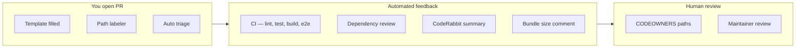

# Phase 14 — Engineering Culture

> **Prerequisites:** Phases [1](./phase-1-what-is-openhikmah.md)–[13](./phase-13-testing-mental-model.md) — especially Phase 3 (theological boundaries) and Phase 13 (testing layers)  
> **Evidence tags:** **FACT** · **INFERENCE** · **UNKNOWN**

Phase 13 explained **how correctness is enforced**. Phase 14 explains **how changes actually land** — commit style, PR shape, review expectations, and the unwritten norms visible in recent history.

**This phase is read-only.** You study conventions; you do not open a PR yet. (Phase 15 covers fork/upstream workflow; Phase 16 maps safe first contributions.)

---

## What “engineering culture” means here

Open Hikmah is a small, high-trust codebase where:

- **Sacred content and AI guardrails** get the same rigor as auth bugs
- **PRs are small and scoped** more often than sweeping refactors
- **Automation carries routine load** (CI, labeling, Dependabot, bot reviews) so human review focuses on trust boundaries
- **Mistakes get reverted quickly** when a merge was wrong — no sunk-cost attachment

**FACT:** In the last 100 merged PRs (sampled via `gh pr list`), **85** were authored by `@nazarli-shabnam` and **15** by Dependabot.

**INFERENCE:** Day-to-day velocity is maintainer-driven today; external OSS contributors are **welcomed by docs** (`CONTRIBUTING.md`) but the merge history is still thin for outsiders — your first PR will likely get careful, educational review rather than rubber-stamp approval.

**UNKNOWN:** Exact maintainer response time for a first-time external contributor — `CONTRIBUTING.md` says “within a few days” but that is not measured in-repo.

---

## Canonical docs (read these, not blog posts)

| Document | Role |
| --- | --- |
| [`AGENTS.md`](../../AGENTS.md) | Single source of truth — code style, theological standards, AI attribution, guardrails |
| [`CONTRIBUTING.md`](../../CONTRIBUTING.md) | Human-oriented fork → branch → test → PR path |
| [`.github/PULL_REQUEST_TEMPLATE.md`](../../.github/PULL_REQUEST_TEMPLATE.md) | Required PR sections, especially **AI / Theological changes** |
| [`.github/CODEOWNERS`](../../.github/CODEOWNERS) | Paths that must get maintainer eyes |
| [`SECURITY.md`](../../SECURITY.md) | Private disclosure for vulns — never public issues |

Tool-specific files (`.cursor/rules/agents.mdc`, `.github/copilot-instructions.md`, etc.) are **mirrors** of `AGENTS.md` — if they drift, `AGENTS.md` wins.

---

## Branch and commit conventions

### Branch names

**FACT** (`AGENTS.md`, `CONTRIBUTING.md`):

```text
feat/   — new behavior
fix/    — bug fix
chore/  — tooling, deps, non-user-facing cleanup
docs/   — documentation only
```

Examples from recent history: `fix/names-locale-meta`, `feat/csp-nonce-infra`, `chore/naming-consistency`.

**FACT:** One-off operational branches sometimes use `temp/` (e.g. `temp/cleanup-566-ai-content`) — treated as **short-lived**; two such PRs were reverted within hours (#600–#603).

### Commit messages

**FACT:** [Conventional Commits](https://www.conventionalcommits.org/) with optional **scope**:

```text
fix(search): match quran.com keyword search against the user's UI locale
fix(auth,connections): distinguish a timed-out publish from a failed one
feat(security): add per-request CSP nonce infra, still report-only
chore: unify naming spellings, fix a stray color token, disable X-Powered-By
```

**INFERENCE:** Scopes mirror directories or domains (`admin`, `names`, `connections`, `auth`, `i18n`, `seo`) — when in doubt, use the folder you touched.

**FACT:** Multi-area fixes sometimes use **comma scopes** in one commit when the change is one logical review unit (PR #598: auth + connections test guard).

### What commits must **not** contain

| Rule | Why |
| --- | --- |
| No `Co-Authored-By:` trailers | Repo policy — implies joint human authorship that does not apply |
| Use `Generated-By: <tool>` trailer instead | For whole new files or ~30+ AI-generated lines with minimal human edit |
| No direct commits to `main` | Blocked by `scripts/precommit-checks.mjs` |

**INFERENCE:** You may see “Generated with Claude Code” in **PR descriptions** on maintainer PRs — that is disclosure in the PR body; the **commit trailer** rule in `AGENTS.md` is the formal mechanism for large generated blocks.

---

## Pull request shape

### Template sections that matter

**FACT** (`.github/PULL_REQUEST_TEMPLATE.md`):

1. **Summary** — 1–3 bullets: what + why
2. **Type of change** — checkbox
3. **AI / Theological changes** — mandatory honesty section for prompts, divine names, connection logic
4. **Testing** — local commands checked off
5. **Checklist** — branch up to date, no secrets, `.env.example` / README if needed

The template explicitly says e2e, axe, and bundle-size run in CI — you do not need to manually re-run all of those locally if unit + integration pass.

### What good PR bodies look like

Recent maintainer PRs (#611, #598) share a pattern worth copying:

| Section | Purpose |
| --- | --- |
| **What / Fix** | Problem statement in plain language |
| **Why (per review)** | Quotes review feedback when addressing comments |
| **Theological / AI disclosure** | Even when reusing existing prompts — states what changed in the trust model |
| **Testing** | Exact commands + counts; notes manual follow-up when automation cannot cover staging backfills |

**Example — theological disclosure without new prompt wording** (PR #611, paraphrased):

> Adds a new AI-translation path for divine-name content. Reuses the already-reviewed, Tanzih-constrained `translateReason` prompt — same guardrails as verse-connection-reason translation.

That is the bar: **name the trust surface**, not just the file list.

### PR size and focus

**INFERENCE from recent merges:**

- **Prefer one concern per PR** — locale search (#610) and locale name meta (#611) landed as separate PRs even though both touch i18n
- **Follow-up review PRs exist** — `fix(names): address review feedback on locale-meta translation` as a second commit on the same branch theme
- **Test-only hardening** gets its own branch name — `test/graph-service-conflict-status-filter` (#598) shipped production fixes *and* test mock improvements together because the review demanded both

**INFERENCE:** A first contributor PR should be **small enough to review in one sitting** (~200 lines or less is a safe target; many merged fixes are smaller).

---

## Review and automation culture



### Automated layers

| Automation | Trigger | What it does |
| --- | --- | --- |
| **CI** (`.github/workflows/ci.yml`) | Every push/PR | Full quality bar — see Phase 13 |
| **PR labeler** | Path changes | Adds `API`, `db`, `UX/UI`, `tests`, etc. (`.github/labeler.yml`) |
| **Auto triage** | Issue/PR opened | Assigns author, milestone, prefix label (`feat`→`enhancement`, `fix`→`bug`) |
| **Dependabot** | Weekly | Bun + GitHub Actions bumps, labeled `dependencies` |
| **Dependency review** | PR | License/vuln scan on dependency changes |
| **CodeRabbit** | PR | Walkthrough + release notes (visible on recent PRs) |
| **Bundle size comment** | After CI on PRs | Posts size delta (fork-safe via `workflow_run`) |

**INFERENCE:** Bot comments are **advisory** except CI checks — a green CI is necessary; CodeRabbit suggestions are filtered by a human.

### Human review expectations

**FACT** (`CODEOWNERS`): these paths auto-request `@nazarli-shabnam`:

- `app/api/admin/**`, `lib/admin/**`
- `app/callback/**`, `lib/auth/**`
- `next.config.ts` (CSP / security headers)
- `.github/workflows/**`

**INFERENCE:** Touching auth, admin, or CSP is not forbidden for contributors — but expect **slower, deeper review** and explicit call-out in your PR summary.

**FACT:** PR #598 documents responding to review by **quoting the reviewer’s words** and explaining how each concern was addressed — including making a test **fail if a guard is removed**.

That pattern — *“verified locally that removing `eq(connections.status, 'active')` makes the test fail”* — is cultural signal: **tests must catch real regressions**, not just line coverage.

---

## Issue workflow

### When to open an issue first

**FACT** (`CONTRIBUTING.md`): for significant changes — new AI behaviour, new pages, PKCE flow changes — **discuss before coding**.

**INFERENCE:** Bug fixes and small UI polish usually skip the issue; architectural or theological shifts do not.

### Issue templates

| Template | Extra field that matters |
| --- | --- |
| **Bug report** | Repro steps, environment, “reproducible on openhikmah.com?” |
| **Feature request** | **Theological considerations** — required framing for Quran presentation features |

**FACT:** Open issues in-repo (sampled Sep 2026) include both product chores (`chore: add robots.txt…`) and **security findings** tracked privately as issues (`OIDC nonce check skipped…`, `Activity streak day… client-controlled tz`). Security **reporting** still goes to security@openhikmah.com per `SECURITY.md` — issues appear to be maintainer-tracked remediation work.

---

## Cultural patterns visible in git history

### 1. Revert fast, explain why

**FACT:** PRs #600–#603 — `TEMP` cleanup scripts merged, then **reverted the same day** when the approach was wrong:

```text
#600  chore(scripts): TEMP — retroactive cleanup for #566 AI-content guardrails
#601  fix(docker): TEMP — ship cleanup scripts into runner image
#602  Revert #601
#603  Revert #600
```

**INFERENCE:** `TEMP` in a title signals **experimental / operational** — not a pattern for first contributions. Reverts are normal, not shameful.

### 2. Accepted-risk documentation

**FACT:** PR #605 / issue #569 — JWT `aud` absence documented as an **accepted risk** with rationale, rather than silently ignoring the gap.

**INFERENCE:** When perfect security or perfect theology is impractical, the culture prefers **written acceptance** over undocumented debt.

### 3. Guardrails strengthened, not weakened

**FACT:** Issue #561 — `isValidRef accepts zero-padded refs` — tracks tightening validation, not loosening it.

Aligns with Phase 3/13: failing tests get fixed by **correct data or code**, not by weakening `isValidRef`.

### 4. i18n as a first-class concern

Recent merge cluster (Sep 2026): search locale (#610), names locale meta (#611), authed surfaces i18n (#607) — localization is treated as **product correctness**, not a polish pass.

### 5. Dependabot merges are routine

**FACT:** ~15% of recent merges are dependency bumps — CI must stay green; human review is often lightweight unless a major version jumps (Next.js revert #448 shows major bumps can be rolled back).

---

## Local git hooks = culture enforced on your machine

| Hook | Enforces |
| --- | --- |
| **pre-commit** | No `main` commits; no `.only`/`.skip`; no `console.log` in staged TS; gitleaks if installed; lint-staged; typecheck; **full unit suite** |
| **pre-push** | **Integration tests** — Docker required |

**INFERENCE:** The project **trusts but verifies** — hooks mirror CI so “works on my machine” means closer to “works in GitHub Actions.”

**FACT:** Skipping hooks (`--no-verify`) is explicitly discouraged in `AGENTS.md` unless a maintainer tells you otherwise.

---

## AI-assisted development norms

This repo is actively developed with AI tools (Claude Code, Cursor, Copilot configs exist). Cultural rules:

| Do | Don't |
| --- | --- |
| Disclose prompt/theological changes in PR template | Loosen verse validation to satisfy the model |
| Add `Generated-By:` on large AI-generated commits | Add `Co-Authored-By: Claude` |
| Reuse existing Tanzih-constrained helpers (`translateReason`, `tanzihDirective`) | Invent parallel prompt wording without review |
| Run full test suites before pushing | Skip integration because unit passed |

**INFERENCE:** Using AI to **write tests and boilerplate** is aligned with maintainer practice; using AI to **change theological framing** without explicit PR disclosure is not.

---

## How your first PR will likely be received

**INFERENCE** (from CONTRIBUTING + history + CODEOWNERS):

| If your PR… | Expect… |
| --- | --- |
| Fixes a filed issue with tests | Smoothest path |
| Adds docs only (`docs/onboarding/`) | Low risk; still needs format/lint if TS-adjacent |
| Touches `lib/ai/` prompts | Theological review + AI template section filled |
| Touches `lib/auth/` or admin | CODEOWNER review, security framing |
| Is large / mixed concern | Request to split before deep review |
| Weakens a guardrail test | Rejection regardless of CI green |

**FACT:** `CONTRIBUTING.md` asks you to ensure format, lint, typecheck, and `test:ci` pass **before** opening — integration runs on push via hook.

---

## Exercise — read history like a contributor

Do these read-only steps (no code changes):

### Step 1 — One merged PR end-to-end

```bash
gh pr view 611 --web   # or read on GitHub
```

Note: summary structure, theological section, test claims, labels applied.

### Step 2 — One review-driven fix

```bash
gh pr view 598
```

Note: how review comments map to commits and test hardening.

### Step 3 — One revert pair

```bash
gh pr view 600
gh pr view 603
```

Ask: what signal does `TEMP` in the title carry?

### Step 4 — Commit message sample

```bash
git log --oneline -20
```

Pick three commits and identify **type**, **scope**, and **user-visible effect**.

**Checkpoint:** Can you explain why #610 and #611 were separate PRs?

---

## MUST UNDERSTAND NOW

1. **`AGENTS.md` + PR template** are the binding culture docs — theological disclosure is not optional for AI/name/connection changes.
2. **Conventional commits** with scopes; **no `Co-Authored-By`**; `Generated-By` for large AI blocks when committing.
3. **Small, focused PRs** match recent history better than sweeping changes.
4. **CODEOWNERS paths** (auth, admin, CSP, CI) get maintainer review — call them out explicitly.
5. **Revert culture exists** — wrong merges get undone; tests should prove guards stay in place.
6. **Issues first** for big behavior; **security@** for vulns — not public bug threads.
7. **Hooks ≈ CI** — pre-commit (unit), pre-push (integration + Docker).

---

## USEFUL LATER

- Read open issues `#561`, `#563`, `#569` — examples of how security/theology debt is tracked
- Watch Dependabot PRs — learn which dependency bumps are routine vs risky
- CodeRabbit summaries on large PRs — good model for your own “Summary” section
- `address review feedback` commits — pattern for round 2 after first review

---

## IGNORE FOR NOW

- Matching maintainer velocity (multiple PRs per day) — optimize for **correct first PR**
- `temp/` branches and operational backfill scripts — not first-contribution territory
- Debates about bot review tools — CI green + human CODEOWNER approval is what merges
- Perfect PR description prose — clarity and honest theological disclosure beat polish

---

## Phase 14 checkpoint questions

1. Where do theological standards live, and what PR template section do they map to?
2. Why were PRs #600–#603 merged and then reverted?
3. Which four path prefixes trigger CODEOWNERS review?
4. What is the difference between `Co-Authored-By` and `Generated-By` in this repo?
5. Why might #610 and #611 be separate PRs even though both concern localization?

---

**Next:** [Phase 15 — OSS Git workflow](./phase-15-oss-git-workflow.md) — fork, upstream, branch hygiene, and opening your first PR the way this repo expects.

**Your move:** Complete the **Exercise** (Steps 1–4), then reply **"continue to Phase 15"** — or ask about any convention that surprised you.
