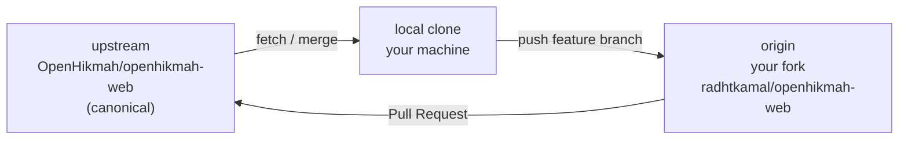

# Phase 15 — OSS Git Workflow

> **Prerequisites:** Phases [1](./phase-1-what-is-openhikmah.md)–[14](./phase-14-engineering-culture.md) — local setup (Phase 10), testing (Phase 13), PR conventions (Phase 14)  
> **Evidence tags:** **FACT** · **INFERENCE** · **UNKNOWN**

Phase 14 covered **how** changes are reviewed. Phase 15 covers **where** your commits live in git — fork, upstream, branches, push, and opening a PR into `OpenHikmah/openhikmah-web`.

**This phase is mostly read-only** — you verify your remotes and walk through the workflow on paper. Phase 16 picks your first contribution target.

---

## The three-repo mental model



| Remote | URL (your machine) | Role |
| --- | --- | --- |
| **`upstream`** | `https://github.com/OpenHikmah/openhikmah-web.git` | Canonical project — **read** updates from here; **never push** directly unless you are a maintainer |
| **`origin`** | `https://github.com/radhtkamal/openhikmah-web.git` | **Your fork** — push feature branches here |
| **local** | `/Users/eihdar/Documents/ChatGPT/openhikmah-web` | Where you branch, commit, and run hooks |

**FACT:** Inspected on your clone (Sep 2026):

```text
origin   → https://github.com/radhtkamal/openhikmah-web.git
upstream → https://github.com/OpenHikmah/openhikmah-web.git
```

**FACT:** GitHub confirms `radhtkamal/openhikmah-web` is a **fork** of `OpenHikmah/openhikmah-web`.

**FACT:** Your `main` is at commit `a472416` and matches **both** `origin/main` and `upstream/main` (0 commits behind/ahead upstream after fetch).

**INFERENCE:** GitHub Desktop already configured remotes correctly — you can skip “how to add upstream” setup and focus on the ongoing loop.

---

## Branch naming and where branches live

**FACT** (Phase 14): branches use `feat/`, `fix/`, `chore/`, or `docs/` + kebab-case description.

**Rule:** Create feature branches from **fresh `main`**, not from stale work:

```text
upstream/main  ──merge──►  local main  ──branch──►  fix/my-contribution
                                              │
                                              └── push ──► origin/fix/my-contribution
```

**INFERENCE:** Keep **`main` on your fork aligned with `upstream/main`** — use it as a sync branch, not a long-lived development branch. All work happens on named feature branches.

**FACT:** `scripts/precommit-checks.mjs` **blocks commits directly on `main`** — even locally you must use a feature branch.

---

## The contributor loop (every PR)

### 0. Before you start — sync

```bash
git checkout main
git fetch upstream
git merge upstream/main          # or: git rebase upstream/main
git push origin main             # keep fork main current
```

**Why:** Reduces merge conflicts and ensures CI runs against latest code.

**Your status now:** Already synced at `a472416` — this step would be a no-op today.

---

### 1. Create a feature branch

```bash
git checkout -b fix/short-description
```

Examples aligned with repo history:

```text
fix/search-dialog-focus-trap
docs/onboarding-typo
chore/readme-docker-note
```

Pick **`fix/`** vs **`feat/`** vs **`chore/`** honestly — auto-triage maps title prefixes to labels (`fix`→`bug`, `feat`→`enhancement`).

---

### 2. Make changes + validate

Minimum before commit (Phase 13 + 14):

```bash
bun run format:check
bun run lint
bun run typecheck
bun run test:ci
```

Before **push** (pre-push hook):

```bash
docker info                      # must succeed
# hook runs: bun run test:integration
```

**FACT:** Skipping `--no-verify` is discouraged unless a maintainer explicitly tells you otherwise.

---

### 3. Commit

Conventional commit with scope:

```bash
git add <files>
git commit -m "$(cat <<'EOF'
fix(canvas): prevent duplicate edge on rapid expand

EOF
)"
```

If a whole new file or ~30+ lines were AI-generated with minimal edit, add the trailer per `AGENTS.md`:

```text
Generated-By: Cursor
```

**No `Co-Authored-By`.**

---

### 4. Push to **your fork** (`origin`)

```bash
git push -u origin fix/short-description
```

**FACT:** First push of a branch needs `-u` so future pushes can be plain `git push`.

**INFERENCE:** You push to **`origin`**, never to **`upstream`**, as an external contributor.

---

### 5. Open PR into **OpenHikmah/main**

Target repository: **`OpenHikmah/openhikmah-web`**, base branch **`main`**, compare branch **`radhtkamal:fix/short-description`**.

**CLI** (when ready):

```bash
gh pr create \
  --repo OpenHikmah/openhikmah-web \
  --base main \
  --head radhtkamal:fix/short-description \
  --title "fix(canvas): prevent duplicate edge on rapid expand" \
  --body "$(cat <<'EOF'
## Summary

- …

## Type of change

- [x] Bug fix

## AI / Theological changes

- [x] No AI or theological changes in this PR

## Testing

- [x] `bun run test:ci` passes locally
- [x] `bun run typecheck` passes locally
- [x] `bun run lint` passes locally
- [x] `bun run format:check` passes locally
- [x] New tests added for new functionality

## Checklist

- [x] Branch is up to date with `main`
- [x] Conventional commits
- [x] No secrets or real API keys in the diff
EOF
)"
```

**GitHub UI:** Fork → “Contribute” → “Open pull request” → ensure base repo is **OpenHikmah/openhikmah-web**, not your fork.

**INFERENCE:** PRs from forks get read-only `GITHUB_TOKEN` for some bot comments — CI still runs fully; bundle-size comments use a follow-up workflow (Phase 14).

---

### 6. During review — stay current

When `upstream/main` moves while your PR is open:

```bash
git checkout fix/short-description
git fetch upstream
git merge upstream/main            # or rebase if you prefer linear history
# resolve conflicts if any
bun run test:ci                    # re-verify
git push origin fix/short-description
```

**INFERENCE:** Maintainers often prefer **merge commits or merge-upstream** over force-push for first-time contributors — ask if unsure. Avoid `git push --force` unless review explicitly requests rebase + force.

Address review in **new commits** on the same branch — pattern from PR #598: quote feedback, fix, push again.

---

### 7. After merge — clean up

```bash
git checkout main
git fetch upstream
git merge upstream/main
git push origin main

git branch -d fix/short-description
git push origin --delete fix/short-description   # optional
```

**INFERENCE:** Deleting merged branches keeps fork tidy; GitHub can auto-delete head branches if you enable it in fork settings.

---

## GitHub Desktop vs CLI

You cloned via **GitHub Desktop** — equivalent mappings:

| Intent | GitHub Desktop | CLI |
| --- | --- | --- |
| Sync from canonical | Fetch `upstream`, merge into `main` | `git fetch upstream && git merge upstream/main` |
| New branch | Branch → New branch | `git checkout -b fix/…` |
| Commit | Commit panel | `git commit` |
| Push | Push origin | `git push -u origin branch` |
| Open PR | Branch → Create pull request | `gh pr create --repo OpenHikmah/openhikmah-web …` |

**FACT:** Your `gh` CLI is authenticated as **`radhwana`** while the fork remote is **`radhtkamal`** — both can coexist if `radhwana` has push access to `radhtkamal/openhikmah-web`. If `gh pr create` fails with permission errors, use `--head radhtkamal:branch` explicitly or open the PR in the browser.

**UNKNOWN:** Whether GitHub Desktop’s “Create PR” defaults to base `OpenHikmah/main` — **always verify** the base repository before submitting.

---

## What **not** to do

| Mistake | Why it hurts |
| --- | --- |
| PR from `main` with mixed unrelated commits | Hard to review; pre-commit blocked commits on main anyway |
| PR base = your fork’s `main` only | Does not contribute upstream — must target **OpenHikmah/openhikmah-web** |
| Push to `upstream` | Permission denied (unless maintainer) |
| `--no-verify` on commit/push | Skips hooks; CI may still fail; violates repo norms |
| Force-push `main` | Never needed for normal OSS flow |
| Commit `.env.local` or API keys | gitleaks + review rejection |
| Large PR touching auth + AI + UI | CODEOWNERS + theological review — split (Phase 14) |

---

## Special case: your onboarding docs

**FACT:** `.gitignore` line 46 ignores the entire `docs/` directory:

```gitignore
docs/
```

All files under `docs/onboarding/` (Phases 1–15) are **local-only** — they do not appear in `git status` and **cannot be PR’d as-is**.

| If you want… | Approach |
| --- | --- |
| Keep docs personal | Do nothing — current setup is fine for learning |
| Contribute onboarding upstream | Open an **issue first** proposing docs in-repo; may require a `.gitignore` change or moving docs to a non-ignored path (maintainer decision) |
| First PR practice | Pick a **code** target from Phase 16 — not the ignored onboarding series |

**INFERENCE:** Treat onboarding as your private study notebook until maintainers agree on upstream documentation policy.

---

## Fork hygiene checklist

Run this verification exercise now (read-only except fetch):

```bash
# 1. Remotes
git remote -v

# 2. Sync state
git fetch upstream
git status -sb
git rev-list --count main..upstream/main    # should be 0 when current

# 3. Fork relationship
gh repo view radhtkamal/openhikmah-web --json isFork,parent

# 4. Hooks present
test -x .husky/pre-commit && test -x .husky/pre-push && echo "hooks OK"

# 5. Docker (for future push)
docker info >/dev/null && echo "docker OK" || echo "docker NOT running — fix before push"
```

**Expected on your machine today:**

| Check | Expected |
| --- | --- |
| `origin` | `radhtkamal/openhikmah-web` |
| `upstream` | `OpenHikmah/openhikmah-web` |
| Behind upstream | `0` |
| Working tree | clean |
| `docs/onboarding/` | present locally, **ignored by git** |

---

## Dry-run: branch without committing

Optional mental rehearsal — creates a branch, then deletes it:

```bash
git checkout main
git pull upstream main          # no-op if current
git checkout -b chore/phase15-dry-run
# …would edit files here…
git checkout main
git branch -D chore/phase15-dry-run
```

No push, no PR — confirms branch workflow without noise on your fork.

---

## CI runs on your fork too

**FACT:** Pushing a branch to `origin` triggers GitHub Actions on **`radhtkamal/openhikmah-web`** (same workflow file as upstream).

**INFERENCE:** You can see CI green on your fork **before** opening the upstream PR — useful for first contributions.

**INFERENCE:** Open the PR only when fork CI passes — saves maintainer time.

---

## MUST UNDERSTAND NOW

1. **`upstream`** = canonical read source; **`origin`** = your fork for pushes.
2. **PR target** = `OpenHikmah/openhikmah-web` **`main`**, head = `radhtkamal:<branch>`.
3. **Never commit on local `main`** — feature branches only (hook-enforced).
4. **Sync loop:** `fetch upstream` → update local `main` → branch → push `origin` → PR → after merge, sync again.
5. **pre-push needs Docker** — integration tests run before push succeeds.
6. **`docs/onboarding/` is gitignored** — not part of your first PR unless policy changes.
7. Your fork is **already configured and synced** — you are ready for a feature branch when Phase 16 picks a target.

---

## USEFUL LATER

- `gh pr checks` — watch CI on your PR
- `gh pr view --web` — review comments
- Enable “Automatically delete head branches” on your fork
- `git config pull.rebase false` vs `true` — pick one rebase/merge style and stay consistent

---

## IGNORE FOR NOW

- Contributing directly to `OpenHikmah` without a fork (maintainer-only)
- Git worktrees / stacked PRs — not used in this repo’s history
- Signing commits — not required unless repo settings change
- Publishing onboarding docs — separate decision from code contributions

---

## Phase 15 checkpoint questions

1. What is the difference between `origin` and `upstream` on your clone?
2. Which GitHub repo must be the **base** when opening a contribution PR?
3. Why can you not PR `docs/onboarding/phase-14-engineering-culture.md` today?
4. What runs on `git push` that does **not** run on `git commit`?
5. After your PR merges, what three commands resync your fork’s `main`?

---

**Next:** [Phase 16 — Contribution surface map & readiness](./phase-16-contribution-readiness.md) — ranked first-PR targets, risks, and an honest readiness checklist.

**Your move:** Run the **Fork hygiene checklist**, then reply **"continue to Phase 16"** — or ask if you want a walkthrough opening a dry-run PR with an empty commit (still read-only if you delete the branch before pushing).
