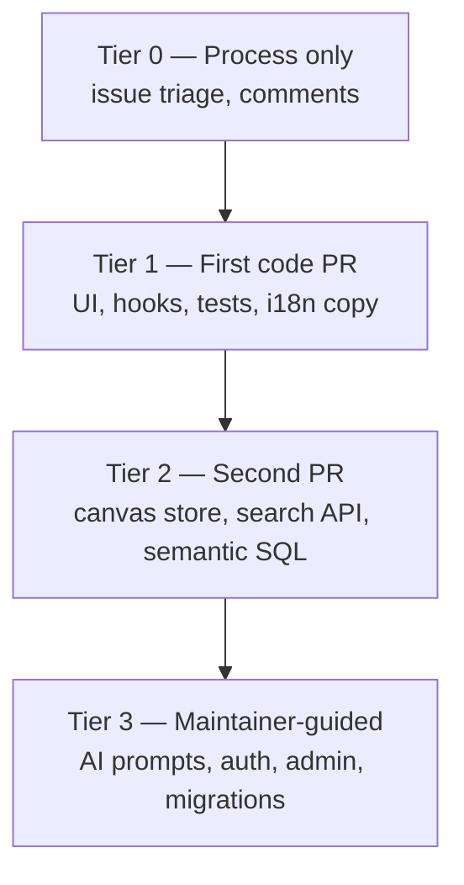

# Phase 16 — Contribution Surface Map & Readiness

> **Prerequisites:** Phases [1](./phase-1-what-is-openhikmah.md)–[15](./phase-15-oss-git-workflow.md) — complete or skimmable; local app run at least once (Phase 10) strongly recommended  
> **Evidence tags:** **FACT** · **INFERENCE** · **UNKNOWN**

This is the **final onboarding phase**. It maps where you can contribute safely, ranks realistic first PRs against **open issues and code**, and gives an honest readiness checklist — so your first upstream PR builds legitimacy, not noise.

**Still read-only until you choose a target and branch.** No PR is opened by this document.

---

## What “recurring OSS contributor” means here

**INFERENCE:** For Open Hikmah, legitimacy is not “many merged PRs.” It is:

1. **Scoped changes** that match repo culture (Phase 14)
2. **Tests** that prove behavior without weakening guardrails (Phase 13)
3. **Honest PR disclosure** when touching AI, names, or connections (Phase 3)
4. **Repeatable git hygiene** (Phase 15)

One excellent small fix beats five sloppy ones.

**FACT:** There is **no** `good first issue` or `help wanted` label in the repo today — you must judge fit from issue text, labels, and path risk yourself.

---

## Onboarding completion map

| Phase | You should be able to… |
| --- | --- |
| **1–2** | Explain the core loop and why grounding matters |
| **3** | Name Tanzih, Maturidi/Hanafi framing, and `isValidRef` — and why not to weaken tests |
| **4–5** | Navigate `app/`, `lib/`, `components/`, `__tests__/` without getting lost |
| **6–8** | Trace search → canvas → expand → Zustand → persistence |
| **7** | Describe `discoverCandidates` → `generateGroundedConnections` → cache |
| **9–10** | Run Postgres, seed, env vars, smoke-check expand |
| **11–12** | Correlate Network tab with `graph-service`; optional cache timing experiment |
| **13** | Pick unit vs integration vs e2e for a change |
| **14–15** | Write a PR body, use fork/upstream, pass hooks |

If any row is weak, **fix that gap before a Tier 1 PR** — or pick a Tier 0 issue-comment / docs-only step first.

---

## Contribution surface map (risk tiers)



### Tier 0 — No code (or comment-only)

| Action | Example | Risk |
| --- | --- | --- |
| Confirm stale issues | #561, #562, #608 — see [Stale issues](#stale-or-partially-resolved-issues) | None |
| Ask scope on #608 manifest | “PWA wanted or robots+sitemap only?” | None |
| File a **bug** with repro | Use issue template + verse ref | Low |

**INFERENCE:** Thoughtful issue comments that cite **commit/PR evidence** build maintainer trust before your first code PR.

---

### Tier 1 — Recommended first code PR

**Profile:** Bounded diff, existing patterns, tests mirror source, no theological prompts, no CODEOWNERS paths.

| Area | Paths | Typical work | Tests |
| --- | --- | --- | --- |
| **Layout / perf hygiene** | `components/layout/Header.tsx`, `ContextSidebar.tsx`, `hooks/useActivityTracker.ts` | Selector fixes, effect deps (issue #572) | Extend `__tests__/components/layout/*`, `__tests__/hooks/useActivityTracker.test.ts` |
| **Search / canvas UX** | `components/search/`, `components/canvas/` (toolbar, empty state, tour) | Focus, a11y, loading | Component tests + optional `e2e/` |
| **Canvas store** | `store/canvas.ts` | Dedup, layout edge cases | `__tests__/store/canvas.test.ts` |
| **Regression tests only** | `__tests__/` | Lock a fixed bug | Self-contained |
| **UI copy (non-theology)** | `messages/*.json` | Button labels, empty states | Snapshot/message tests if present |
| **SEO / static metadata** | `app/robots.ts`, `app/sitemap.ts`, future manifest | After issue #608 scope confirmed | `__tests__/app/sitemap.test.ts`, robots tests if added |

**FACT:** Phase 5 listed these as “safer first contributions” — still accurate.

---

### Tier 2 — After one merged PR or strong review

| Area | Paths | Requires |
| --- | --- | --- |
| Semantic search | `lib/quran/semantic-search.ts` | pgvector mental model (Phase 9); issue #105 |
| Search API | `app/api/search/route.ts` | Rate limits, dual search paths |
| Canvas persistence | `hooks/useCanvasPersistence.ts` | Share vs localStorage races (Phase 8) |
| Social / workspaces | `app/api/social/*`, `lib/social/*` | Auth + Drizzle patterns |

---

### Tier 3 — Do not solo as first contribution

| Area | Why |
| --- | --- |
| `lib/ai/connection-generator.ts`, prompts | Theological + validation (Phase 3, 7) |
| `lib/ai/theological-constraints.ts` | Sacred constraint text |
| `lib/names/divine-names/data/` | Theological content |
| `lib/auth/`, `app/callback/` | Security — **CODEOWNERS** |
| `app/api/admin/`, `lib/admin/` | Fail-closed admin |
| `lib/infra/db/migrations/` | Reversible schema + integration tests required |
| Open **security-vulnerability** issues (#556, #563, #568, …) | Need maintainer pairing; private disclosure if exploitable |

**FACT:** `CONTRIBUTING.md` — open an **issue first** for new AI behaviour, new pages, or PKCE changes.

---

## Ranked first PR candidates (evidence-based)

Ordered by **approachability × clarity × maintainer alignment**. Verify issue state before starting — labels lag fixes.

### 1. Issue #572 — Header social-store selectors (E1) ⭐ best code target

**FACT:** Issue body points to `Header.tsx:217` — destructuring whole `useSocialStore()` without selectors causes excess re-renders on canvas.

| Field | Detail |
| --- | --- |
| **Branch** | `fix/header-social-store-selectors` |
| **Scope** | One file (+ test if you add render-count or behavior assertion) |
| **Risk** | Low — perf, no theology |
| **Skills** | Zustand selectors, React re-render basics |
| **PR type** | Bug fix / refactor |

**INFERENCE:** Matches maintainer’s own sweep findings — likely welcomed if PR is small and tested.

---

### 2. Issue #572 — `useActivityTracker` effect deps (E4)

| Field | Detail |
| --- | --- |
| **Paths** | `hooks/useActivityTracker.ts` |
| **Scope** | Stop re-running flush on every drag tick |
| **Risk** | Low–medium — behavior on canvas activity tracking |
| **Tests** | `__tests__/hooks/useActivityTracker.test.ts` exists — extend |

Do **one** #572 finding per PR (Phase 14: small focused PRs).

---

### 3. Issue #572 — `ContextSidebar` hydration (E5)

| Field | Detail |
| --- | --- |
| **Paths** | `components/layout/ContextSidebar.tsx` |
| **Scope** | Fix `matchMedia` in lazy `useState` initializer pattern |
| **Risk** | Low — latent hydration mismatch |
| **Tests** | `__tests__/components/layout/ContextSidebar.test.tsx` |

---

### 4. Issue #608 — Web manifest (only after scope comment)

**FACT:** `app/robots.ts` and `app/sitemap.ts` **already exist** on `main` (PR #612). Issue #608 body is **partially outdated**.

**FACT:** No `manifest.webmanifest` (or App Router manifest route) found in repo.

| Field | Detail |
| --- | --- |
| **Blocker** | Issue asks: PWA intentional or not? |
| **Action first** | Comment on #608 citing #612; ask whether to close robots/sitemap portion and scope manifest only |
| **If approved** | `chore/seo-web-manifest` — static metadata, no AI |

---

### 5. Regression test-only PR

If you find a bug while using the app:

1. File issue with repro (template)
2. Branch `test/describe-bug` or `fix/...` with failing test → fix
3. Follow bookmark DELETE tests pattern in `__tests__/api/bookmarks.test.ts` for API routes

**INFERENCE:** Test-only PRs that **tighten** assertions (like PR #598’s Drizzle `where` inspection) match culture.

---

### 6. i18n / a11y polish

| Target | Notes |
| --- | --- |
| `messages/en.json` (+ tr/ru/az if you can) | Non-theological UI strings only |
| `e2e/a11y.spec.ts` warnings | Moderate axe violations are logged but not failing — fixing root cause is good **after** you reproduce locally |

**Avoid:** translating divine-name **meaning/description** without going through existing `translateReason` / cache paths (Phase 7, PR #611 pattern).

---

### Not recommended as first PR

| Item | Why |
| --- | --- |
| **#561** zero-padded refs | **Already fixed** on `main` (#575, #578) — see stale issues |
| **#562** bookmark DELETE | **Already fixed** — trim + dual-key delete in `app/api/bookmarks/[ref]/route.ts` with tests |
| **#568, #556, #563** security | CODEOWNERS + security expertise |
| **#567** backfill loop | Admin/Gemini quota semantics — easy to break |
| **#109–#116** features | Large product — issue discussion first |
| **`docs/onboarding/`** | **Gitignored** (`docs/` in `.gitignore`) — not committable without policy change |
| **Experiment B stagger** (Phase 12) | Learning exercise only — not merge-worthy alone |

---

## Stale or partially resolved issues

Worth a **Tier 0 comment** before coding:

| Issue | Status on `main` (Sep 2026) | Suggested action |
| --- | --- | --- |
| **#561** | `isValidRef` rejects `02:255`; tests in `quran-corpus.test.ts` | Comment linking #575/#578; ask to close |
| **#562** | DELETE trims + `inArray([ref, verseRef])`; tests at `bookmarks.test.ts:279+` | Comment with file refs; ask to close |
| **#608** | robots + sitemap shipped (#612); manifest open | Comment partial completion; clarify manifest scope |

**INFERENCE:** Closing stale issues helps maintainers and shows you read `main` — valid first interaction.

---

## Readiness self-assessment

Score each ** honestly**: ✅ confident · ~ partial · ✗ not yet

### Environment & workflow

| Check | ✅ / ~ / ✗ |
| --- | --- |
| `bun run dev` works; canvas loads | |
| Postgres seeded; expand returns connections (Phase 10) | |
| `bun run test:ci` passes locally | |
| `docker info` OK; `bun run test:integration` passes | |
| `origin` = your fork, `upstream` = OpenHikmah; `main` synced | |
| Read Phase 15 fork loop once | |

### Trust model (non-negotiable)

| Check | ✅ / ~ / ✗ |
| --- | --- |
| Can explain “data discovers; AI articulates” | |
| Know what `isValidRef` and Tanzih guard | |
| Would fix failing ref test by **data/code**, not loosening validation | |
| Know when PR template AI/Theological section is required | |

### Code navigation

| Check | ✅ / ~ / ✗ |
| --- | --- |
| Traced expand: `HikmahCanvas` → `/api/connections` → `getConnections` | |
| Know where to add a unit test for a layout change | |
| Can name one CODEOWNERS path to avoid on PR #1 | |

### Scoring

| Score | Verdict |
| --- | --- |
| **All environment ✅, ≥2 trust ✅, ≥2 navigation ✅** | **Ready for Tier 1 code PR** (pick #572 item) |
| **Environment ~, trust ✅** | Run Phase 10 + 13 exercises first |
| **Trust ~ or ✗** | Re-read Phase 3 + 7 before any `lib/ai/` or API validation change |
| **Environment ✗** | Finish local setup — code PR will waste review cycles |

**Your machine (inspected Phase 15):** remotes and sync ✅ · onboarding docs local-only ✅ · `gh` auth as `radhwana` / fork `radhtkamal` — verify PR head branch naming when using CLI.

---

## Pre-flight checklist (day you open PR #1)

```bash
# Sync
git checkout main && git fetch upstream && git merge upstream/main && git push origin main

# Branch
git checkout -b fix/header-social-store-selectors   # example

# … edit …

# Quality bar
bun run format:check && bun run lint && bun run typecheck && bun run test:ci

# Push (integration runs here)
docker info && git push -u origin fix/header-social-store-selectors

# PR → OpenHikmah/openhikmah-web main
gh pr create --repo OpenHikmah/openhikmah-web --base main \
  --head radhtkamal:fix/header-social-store-selectors \
  --fill   # or use template body from Phase 15
```

PR body minimum:

- Summary bullets (what + why)
- Link **Fixes #572** (or part of it) if applicable
- AI/Theological: **checked “No AI or theological changes”** for Tier 1 targets
- Testing checklist filled honestly

---

## 30-day path to recurring contributor

**INFERENCE:** A realistic cadence for someone with your background (~6y React/TS), doing this **part-time**:

| Week | Goal |
| --- | --- |
| **1** | Phase 10 smoke + Phase 13 tests green; Tier 0 comments on #561/#562/#608 |
| **2** | PR #1: one #572 item (~50–150 lines); respond to review within 48h |
| **3** | PR #2: test extension or second #572 item; read one merged maintainer PR (#611 or #598) |
| **4** | Optional Tier 2 exploration — read issue #105; **do not implement** until a maintainer engages |

**Legitimacy markers:**

- CI green on your fork before asking for review
- No `--no-verify`
- Review feedback addressed with **new commits** and short replies
- Issues filed for bugs you did not fix immediately

**UNKNOWN:** Maintainer merge cadence for external first PRs — plan for **one review round minimum**.

---

## After onboarding — what to keep doing

| Habit | Why |
| --- | --- |
| `git fetch upstream` before each branch | Small diffs |
| Read `AGENTS.md` when touching new areas | Policy updates land there |
| Run integration locally before push | Matches pre-push hook |
| Skim merged PRs in `OpenHikmah/openhikmah-web` | Culture stays current |
| Keep personal notes in `docs/onboarding/` locally | Gitignored — fine for study |

**Graduation:** You are **onboarding-complete** when you can (1) pick a Tier 1 target from this map, (2) pass the readiness bar, and (3) open a PR without weakening Phase 3 guardrails.

You do **not** need all 16 phases memorized — keep this file and Phase 5’s “if you need X, open Y” as desk references.

---

## MUST UNDERSTAND NOW

1. **Tier 1 first** — layout perf (#572), tests, non-theological i18n; not AI prompts or auth.
2. **No `good first issue` label** — use this map + open issue text.
3. **Several open bugs are already fixed on `main`** — verify before coding (#561, #562, partial #608).
4. **One concern per PR** — split #572 E1 / E4 / E5.
5. **Onboarding docs are gitignored** — first upstream PR should be **code**, unless maintainers agree to un-ignore `docs/`.
6. **Recurring contributor** = trusted small fixes + tests + honest disclosure — not volume.

---

## USEFUL LATER

- Watch issues labeled `bug` without `security-vulnerability`
- Pair with maintainer on `security-vulnerability` after first merge
- Propose un-ignoring `docs/onboarding/` via issue if you want upstream study guides

---

## IGNORE FOR NOW

- Shipping Phase 12 Experiment B as a PR
- Competing with Dependabot merge volume
- Large feature issues (#109–#116) as first touch
- Loosening validation “to unblock” AI outputs

---

## Phase 16 checkpoint questions

1. What is the **single best** first code PR target in this doc, and why?
2. Why should you comment on #608 before implementing a manifest?
3. Name three paths that require CODEOWNERS review.
4. What score on the readiness table means “ready for Tier 1”?
5. Why is `docs/onboarding/` not your first PR?

---

## Series complete

Phases **1–16** are a read-only engineering onboarding path for **OpenHikmah / `openhikmah-web`**.

**Suggested next actions (pick one):**

1. **Tier 0** — Comment on #561, #562, or #608 with evidence from `main`
2. **Tier 1** — Branch `fix/header-social-store-selectors` for issue #572 E1
3. **Verify** — Run Phase 13 hands-on Steps 1–2 if not done yet
4. **Ask** — “Walk me through opening PR #1 for #572 E1” and switch from read-only to implementation

There is no Phase 17 in this series — real contribution starts when you choose a target and branch.
