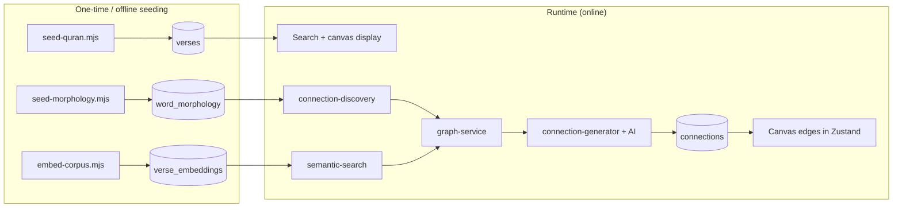
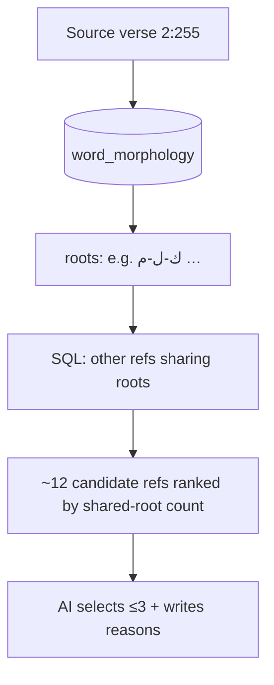
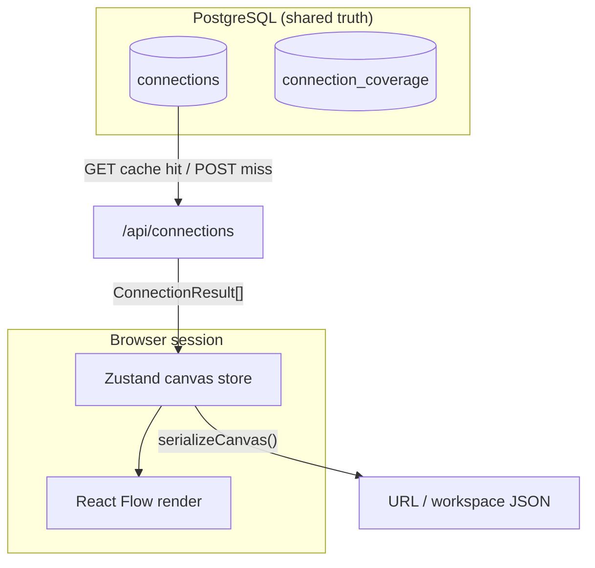
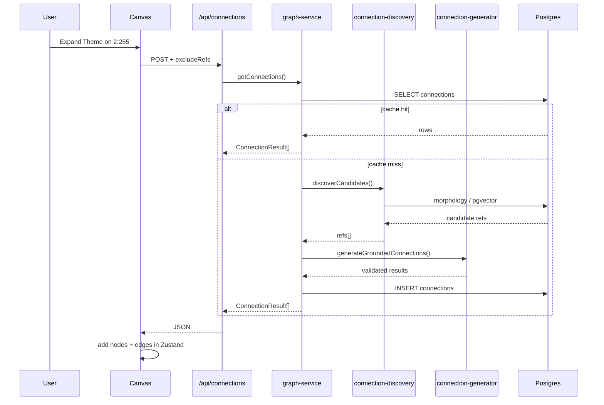

# Phase 2 — Domain Primer

> **Prerequisite:** [Phase 1 — What is OpenHikmah?](./phase-1-what-is-openhikmah.md)  
> **Evidence tags:** **FACT** · **INFERENCE** · **UNKNOWN**

Phase 2 connects Quran/AI/search concepts to **actual OpenHikmah modules**. This is not a general course on embeddings or Arabic morphology — every section ends with *where in this repo* the concept lives.

---

## Narrative frame

Before you trace canvas code, hold this pipeline in mind:



**MUST UNDERSTAND NOW:** Sacred text and grounding rails are **seeded into Postgres**. Runtime paths **read** them; the LLM enters only after candidates or corpus validation.

---

## 1. Quran data model

### Surah and ayah references

**FACT:** A verse is identified by a string ref `"surah:ayah"` — e.g. `"2:255"` (Ayat al-Kursi).

**FACT:** `isValidRef()` in `lib/quran/quran-corpus.ts` enforces:

| Rule | Example |
| --- | --- |
| Format `^\d+:\d+$` only | `"2:255"` ✓ · `"02:255"` ✗ |
| Surah 1–114 | `"115:1"` ✗ |
| Ayah within per-surah Hafs count | `"1:8"` ✗ (Al-Fatiha has 7 ayahs) |
| Canonical spelling (no leading zeros) | `"2:0255"` ✗ |

**FACT:** Surah **names** are not stored per verse row. They are derived at read time from `lib/quran/surah-names.ts` (`schema.ts` comment on `verses` table).

**INFERENCE:** Think of `ref` like a stable primary key — similar to a Firestore document ID you never let users invent, except here the ID space is constrained by Quranic structure.

### The `Verse` object (application type)

**FACT:** `types/quran.ts`:

```typescript
interface Verse {
  surah: number;
  ayah: number;
  ref: VerseRef;           // "2:255"
  arabicText: string;
  translation: string;
  surahName: string;
  surahNameArabic: string;
}
```

This is what search results, canvas nodes, and API payloads hydrate into.

### Local corpus vs. remote providers

OpenHikmah uses a **tiered** data strategy:

| Layer | Source | Role |
| --- | --- | --- |
| **Primary** | Postgres `verses` + `verse_translations` | All display text the app trusts day-to-day |
| **Seeding** | alquran.cloud whole-Quran fetch | One-time population (`scripts/seed-quran.mjs`) |
| **Fallback lookup** | alquran.cloud per-ayah API | When local row missing (`lib/quran/verse-resolver.ts`) |
| **Keyword search index** | quran.com `/api/v4/search` | Finds refs by text; results re-hydrated from **local** corpus |
| **Chapter name localization** | quran.com `/api/v4/chapters` | Widen surah-name matching only (`lib/quran/chapters.ts`) |

**FACT:** `seed-quran.mjs` pulls:

- Arabic: `quran-uthmani` edition
- Translation: `en.sahih` (Saheeh International)
- Expected total: **6236** ayahs

**FACT:** After seeding, `lib/quran/quran-corpus.ts` serves verse text from Postgres — *“Pure DB access: callers decide on any fallback.”*

**FACT:** `resolveVerse()` tries local corpus first; on failure logs and falls back to live alquran.cloud fetch. Returns **`null`** if the ref resolves nowhere — used as anti-hallucination validation.

**FACT:** Search route (`app/api/search/route.ts`) for ref-shaped queries:

```typescript
// A ref-shaped query that isn't a real verse ... is not a result —
// never fabricate a verse card (AGENTS.md: no invented references).
const verse = isValidRef(q) ? await resolveVerse(q, edition) : null;
```

Keyword hits from quran.com are also **re-hydrated** via `getVerses()` so Arabic/translation always match the local corpus, not whatever snippet quran.com returned.

### Translation editions

**FACT:** Default translation per UI locale (`lib/i18n/config.ts`):

| Locale | Edition id |
| --- | --- |
| `en` | `en.sahih` |
| `tr` | `tr.diyanet` |
| `ru` | `ru.kuliev` |
| `az` | `az.mammadaliyev` |

**FACT:** `verses.translation` column always holds `en.sahih`. Other editions live in `verse_translations` (composite PK: `ref + edition`). Missing edition row falls back to `en.sahih`.

**FACT:** `AGENTS.md` — attribute translations correctly; Saheeh International from alquran.cloud.

**FACT:** `isValidEdition()` whitelists cookie/query values — unrecognized editions fall back rather than being interpolated into URLs.

### Search modes (how the product maps to code)

| User intent | Route / function | Grounding |
| --- | --- | --- |
| Direct ref `2:255` | `GET /api/search?q=2:255` | `isValidRef` + `resolveVerse` |
| Surah name exact match | same route | `matchSurahsByQuery` → `matchedSurahs` payload |
| Keyword | same route → `keywordSearch()` | quran.com search → local hydrate |
| Related by meaning (supplementary) | same route page 1 → `relatedByMeaning()` | `searchByMeaning()` + pgvector |
| Similar to this verse | `GET /api/verse/[s]/[a]/similar` | `similarVerses()` |

**FACT:** Semantic matches on keyword search are **best-effort** and **supplementary** — failures become an empty `related` array, invisible to the user (`app/api/search/route.ts` comments).

**INFERENCE:** README “search by meaning” is realized both as the **Related by meaning** section in search and as **Similar verses** from the verse sidebar — not necessarily a separate search mode toggle.

---

## 2. Arabic linguistic grounding

### Concepts (minimal)

| Term | Meaning in this repo |
| --- | --- |
| **Surface form** | The word as it appears in the verse (with diacritics) |
| **Root** | Trilateral (or similar) Arabic root — shared morphological anchor |
| **Lemma** | Dictionary form associated with a word |
| **Position** | Word index within the ayah |

**INFERENCE:** Verses sharing a **root** often share conceptual DNA even when English translations differ. That is why “By Root” is a first-class connection mode.

### Where morphology data comes from

**FACT:** `scripts/seed-morphology.mjs`:

- Reads committed files under `data/morphology/*.jsonl`
- Generated from a **canonical Quran morphology server** (`fetch_word_morphology` — per script comment)
- Stores **root-bearing words only**
- Idempotent upsert on `(ref, position)`

**FACT:** Coverage is **partial by design** — verses without morphology rows fall back to **legacy** AI generation at request time (`seed-morphology.mjs` header).

### How root matching works (deterministic)

**FACT:** `lib/ai/connection-discovery.ts` → `rootCandidates()`:

1. Select distinct roots for source `fromRef` from `word_morphology`
2. Find other refs sharing those roots
3. Rank by **count of distinct shared roots** (descending)
4. Exclude source ref and any `excludeRefs` (for “get more”)

**FACT:** No LLM involved in this step.

**FACT:** `lib/quran/arabic-morphology.ts` provides **UI** tokenization — matching verse tokens to morphology surfaces using normalized Arabic (diacritics stripped, alef variants unified). This powers interactive root highlighting in verse text, separate from connection discovery SQL.



**MUST UNDERSTAND NOW:** Root connections are **SQL over seeded morphology**, not model memory — when data exists.

---

## 3. Semantic retrieval

### What an embedding is *here*

**FACT:** Each verse has one **768-dimensional** vector in `verse_embeddings.embedding` (`schema.ts`).

**FACT:** Vectors are produced from the verse’s **`translation` text** (English Saheeh at seed time), via Gemini `gemini-embedding-001`, reduced to 768 dims with `outputDimensionality` (`scripts/embed-corpus.mjs`, `.env.example`).

**INFERENCE:** Ranking is **English-meaning keyed** even when the UI shows Turkish/Russian/Azerbaijani translation — display language and search language intentionally differ (`semantic-search.ts` comment on `searchByMeaning`).

### pgvector and similarity

**FACT:** Table definition includes HNSW index with `vector_cosine_ops`:

```typescript
index("verse_embeddings_hnsw_idx").using("hnsw", t.embedding.op("vector_cosine_ops"))
```

**FACT:** `lib/quran/semantic-search.ts` computes:

```typescript
const similarity = sql`1 - (cosineDistance(verse_embeddings.embedding, queryVec))`;
// ordered desc — higher = closer in meaning
```

Compare to Firestore: you might index `where('tag', '==', 'patience')`. pgvector solves **nearest-neighbor in meaning space** — no shared keyword required.

### Conceptual example (grounded in code paths)

> User searches: *“patience in hardship”*

1. **FACT:** `searchByMeaning()` normalizes query → `embedQueryCached()` → Gemini embed (or Redis cache hit, 7-day TTL).
2. **FACT:** `nearest()` runs cosine distance against all `verse_embeddings` rows.
3. **FACT:** Top refs hydrate through `getVerses(refs, edition)` — user sees Arabic + their chosen translation.
4. **INFERENCE:** Results may include verses whose English translation never contains the word “patience” but is semantically nearby in embedding space.

> User expands verse `2:153` by **Theme**

1. **FACT:** `semanticCandidates("2:153")` → `similarVerses()` loads that ref’s stored vector → nearest neighbors (excluding self + `excludeRefs`).
2. **FACT:** Those refs become the AI’s allowed pick list for grounded thematic generation.

### What gets persisted vs. computed live

| Data | Persisted? | Where |
| --- | --- | --- |
| Verse text | Yes | `verses`, `verse_translations` |
| Per-verse embedding | Yes | `verse_embeddings` (offline script) |
| Query embedding | Cached optionally | Redis key `emb:q:<sha256>` |
| Similarity ranking | Computed per request | SQL over pgvector |
| Connection reasons | Yes | `connections.reason` |

**FACT:** `embed-corpus.mjs` is resumable — skips refs already embedded for current model.

---

## 4. Knowledge graph concepts

### Node

**In the persistent graph:** a **verse ref** (e.g. `"2:255"`) — not a canvas node id.

**On the canvas:** a React Flow node with:

**FACT:** `store/canvas.ts`:

- `id`: generated `node-${counter}` — **not** the verse ref (same verse can appear once per canvas position policy; duplicates link via edges instead)
- `data`: full `Verse` object
- `position`: `{ x, y }` layout coordinates

**INFERENCE:** Verse **identity** = `ref`. Canvas **node identity** = opaque `node-N` id.

### Edge / connection

**Persisted (`connections` table):**

**FACT:** `schema.ts`:

| Column | Meaning |
| --- | --- |
| `fromRef`, `toRef` | Directed verse pair |
| `kind` | `thematic` \| `root` \| `contrast` |
| `reason` | AI-generated explanation text |
| `locale` | Language of `reason` (`en` canonical) |
| `model` | LLM that wrote this row |
| `status` | `active` \| `flagged` \| `retired` |

Unique index on `(fromRef, toRef, kind, locale)` — one row per directed typed edge per locale.

**On canvas (`SavedEdge` / `CanvasEdge`):**

**FACT:** Stores `source`/`target` **node ids**, plus denormalized `kind`, `label`, `reason` for rendering — copied from API `ConnectionResult` when user expands.

### Graph vs. canvas — the split



| | Persistent graph | Canvas state |
| --- | --- | --- |
| **Scope** | Global — all users benefit from cache | Per session / share / workspace |
| **Identity** | Verse refs | Node ids + layout |
| **Edges** | Canonical connections for `(fromRef, kind)` | Visual edges between placed nodes |
| **Survives refresh** | Yes (Postgres) | Only if shared URL or saved workspace |
| **AI cost** | Paid once per cell, then free | Client re-fetches cached rows |

**FACT:** `lib/ai/graph-service.ts` — *“Reads connections from Postgres; only on a miss does it call the AI, then writes the result back so every later reader gets it for free.”*

**FACT:** Shared canvases store serialized node/edge layout in `shared_canvases.data` — the **exploration layout**, not the global connection cache (Phase 8 will go deeper).

---

## 5. AI grounding — the connection pipeline

This section is the operational detail behind Phase 1’s trust boundary. File-level deep trace → **Phase 7**.

### Step 0 — What starts a request

**FACT:** User expands a node on canvas → `HikmahCanvas.tsx` `runExpansion()` → `POST /api/connections` with:

```json
{
  "fromRef": "2:255",
  "kind": "thematic",
  "arabicText": "...",
  "translation": "...",
  "excludeRefs": ["3:18", "..."]
}
```

**FACT:** `excludeRefs` = targets already shown for this node+kind (`getExpansionRefs`) — powers **“get more”** without repeating edges.

### Step 1 — Cache read

**FACT:** `getConnections()` in `graph-service.ts` reads active `connections` rows for `(fromRef, kind, locale)`, excluding `excludeRefs`.

**FACT:** Cache hit → hydrate via `resolveVerse(toRef)` → return — **no AI call**.

### Step 2 — Candidate discovery (deterministic)

**FACT:** On miss, `discoverCandidates(fromRef, kind, limit≈12, excludeRefs)`:

| `kind` | Discovery function |
| --- | --- |
| `root` | SQL on `word_morphology` |
| `thematic` | `semanticCandidates` → pgvector neighbors |
| `contrast` | Same neighbors as thematic |

**FACT:** For contrast, discovery does **not** run a separate “opposition detector” — semantic neighbors feed the pool; the AI selects genuinely contrasting ones (`connection-discovery.ts` comment).

**FACT:** Empty candidate list means either no seeded data for this verse or pool exhausted (if `excludeRefs` non-empty).

### Step 3 — Generation path choice

**FACT:** `generateConnectionsForCell()`:

```
if candidates.length > 0
  → generateGroundedConnections(candidates)   // preferred
else if excludeRefs.length > 0
  → return []                                 // "get more" exhausted
else
  → generateConnections()                     // legacy fallback
```

**INFERENCE:** Legacy path only on **first-time** miss when grounding tables empty — not when user asks for more and pool is dry.

### Step 4 — What the LLM receives

**Grounded path — FACT:** `SELECTION_FALLBACK_TEMPLATE` in `connection-generator.ts`:

- Source verse ref, Arabic, translation
- **Numbered list of candidate refs + translations**
- Task: select up to 3, explain each
- Rule: *“Choose ONLY from the candidate references listed above”*
- Appended: `tanzihDirective()` + optional locale language directive

**Legacy path — FACT:** Model asked to find 3 verses from memory with JSON output schema — still Maturidi/Hanafi + Tanzih.

### Step 5 — Expected output schema

**FACT:** JSON array:

```json
[
  { "ref": "3:18", "reason": "One concise theological sentence." }
]
```

Parsed by `parseRawConnections()` — must find `[...]` in response, valid types, non-blank `reason`.

### Step 6 — Post-generation validation

| Check | Grounded | Legacy |
| --- | --- | --- |
| JSON parseable | throws `ConnectionParseError` | same |
| `ref !== fromRef` | ✓ | ✓ |
| `isValidRef(ref)` | ✓ (via allowed set) | ✓ explicit filter |
| Ref ∈ candidate set | **`allowed.has(ref)`** | — |
| Verse in local corpus | `getVerses()` hydrate | `getVerses()` — drops missing |
| Max 3 results | `.slice(0, 3)` | `.slice(0, 3)` |

**FACT:** Grounded filter:

```typescript
const allowed = new Set(candidates.map((v) => v.ref));
const chosen = parseRawConnections(text)
  .filter((c) => allowed.has(c.ref) && c.ref !== fromRef)
```

### Step 7 — Failure behavior

| Failure | Behavior |
| --- | --- |
| `ConnectionParseError` | **FACT:** API route returns 502 — transient generation failure, not empty pool |
| Well-formed empty `[]` | **FACT:** Valid “nothing appropriate” — API returns `[]`, client shows notice |
| Rate limit | **FACT:** `RateLimitError` → 429 |
| Missing grounding + legacy proposes invalid refs | **FACT:** Dropped at corpus hydration — may yield fewer than 3 or `[]` |
| Logging failure to `ai_generations` | **FACT:** Logged to console; generation still succeeds |

**FACT:** `ConnectionParseError` must **not** be treated as exhausted pool (`connection-generator.ts` class doc → `connection-batch.ts` relies on this).

### Step 8 — Persistence and locale

**FACT:** Successful English generation → `INSERT INTO connections ... ON CONFLICT DO NOTHING`.

**FACT:** Non-`en` locales: **translate** English `reason` strings — verse selection is **never** re-derived per locale (`graph-service.ts` header).

**FACT:** Generations audited in `ai_generations` (fromRef, kind, model, tokens, promptVersion).

### End-to-end trust diagram



---

## 6. Provenance summary — who decides what

| Question | Decider | Module |
| --- | --- | --- |
| Is `2:255` syntactically valid? | Code | `isValidRef` |
| Does Arabic text exist? | Seeded corpus (+ fallback API) | `quran-corpus`, `verse-resolver` |
| Which refs are thematic candidates? | pgvector similarity | `semantic-search` |
| Which refs are root candidates? | Morphology SQL | `connection-discovery` |
| Which 3 refs become edges? | LLM selection (grounded) or proposal (legacy) | `connection-generator` |
| Why is edge valid? | LLM `reason` (theological prompt + Tanzih) | `connection-generator` |
| Will this edge show again for others? | Postgres cache | `graph-service` |

---

## Phase 2 — What to remember

### MUST UNDERSTAND NOW

1. **Refs** are `"surah:ayah"` with strict validation — malformed refs never become results.
2. **Local corpus** is authoritative for display; external APIs are search/seed/fallback helpers.
3. **Root discovery = SQL on `word_morphology`**; **theme/contrast discovery = pgvector neighbors**.
4. **Embeddings are built from English translation text**; semantic ranking is English-keyed; UI translation is separate.
5. **Persistent graph** (`connections`) ≠ **canvas layout** (Zustand) — shared truth vs. personal view.
6. **Grounded AI** can only pick from discovered candidates; **legacy** still requires corpus hydration.

### USEFUL LATER

- `connection_coverage.exhaustedAt` admin bookkeeping for backfill
- Redis query-embedding cache economics
- Divine Names have a *parallel* grounding pattern (`name_content`, quran.com search first) — different subsystem
- HNSW index tuning, migration history

### IGNORE FOR NOW

- Social/challenge tables
- Admin prompt_versions override mechanics
- Audio `SURAH_LENGTHS` except as used by `isValidRef`

---

## Uncertainties

| Topic | Status |
| --- | --- |
| Exact morphology coverage % in `data/morphology/` | **UNKNOWN** until we inspect data dir or run coverage admin report |
| Whether UI exposes pure semantic-only search separate from keyword | **INFERENCE:** primarily “Related by meaning” + similar-verse API, not a dedicated mode flag |
| Quran Foundation API role beyond auth/bookmarks | **UNKNOWN** — Phase 9/10 |
| How often production hits legacy vs grounded path | **INFERENCE:** grounded whenever embeddings/morphology exist for verse |

---

## What comes next

**Phase 3 — Theological and sacred-data boundaries:** where Maturidi/Hanafi, Tanzih, verse verification, test fixtures, and PR disclosure requirements are encoded as software constraints — the map of *what you must never casually fix*.

Say **“continue to Phase 3”** when ready.

---

## Key files (Phase 2 reading list)

| File | Topic |
| --- | --- |
| `lib/quran/quran-corpus.ts` | Ref validation, local corpus |
| `lib/quran/verse-resolver.ts` | Corpus + live fallback |
| `app/api/search/route.ts` | Search modes |
| `lib/quran/semantic-search.ts` | Embeddings, pgvector queries |
| `lib/ai/connection-discovery.ts` | Root + semantic candidates |
| `lib/ai/connection-generator.ts` | AI prompts, parsing, validation |
| `lib/ai/graph-service.ts` | Cache, miss path, persistence |
| `lib/infra/db/schema.ts` | `verses`, `connections`, `word_morphology`, `verse_embeddings` |
| `scripts/seed-quran.mjs` | Corpus provenance |
| `scripts/seed-morphology.mjs` | Morphology provenance |
| `scripts/embed-corpus.mjs` | Embedding provenance |
| `store/canvas.ts` | Canvas vs graph types |
| `types/quran.ts` | Shared domain types |
