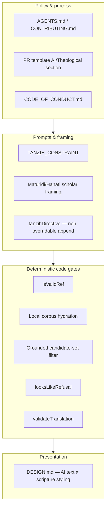

# Phase 3 — Theological and Sacred-Data Boundaries

> **Prerequisites:** [Phase 1](./phase-1-what-is-openhikmah.md) · [Phase 2](./phase-2-domain-primer.md)  
> **Evidence tags:** **FACT** · **INFERENCE** · **UNKNOWN**

Phase 3 answers the engineering question:

**Where are theological assumptions encoded as software constraints, data constraints, tests, prompts, or review requirements — and what must you never casually “fix”?**

This is not a theology course. It is a **safety map** for contributors.

---

## The three-layer guardrail model

OpenHikmah protects sacred content through overlapping layers — not one switch:



**MUST UNDERSTAND NOW:** Theology here is enforced like security — **policy + prompts + validation + UI + tests + review**. Weakening one layer because a test failed is the repo’s most dangerous contributor mistake (`AGENTS.md`: *“never fix a failing theological/verse-reference test by loosening the validation”*).

---

## 1. Theological framework the project follows

**FACT:** `AGENTS.md` Theological Standards #1:

> Stay within the **Maturidi/Hanafi tradition** — this is the theological framework of the project. Don't introduce Ash'ari-only positions without noting the difference, and don't conflate schools.

**FACT:** AI prompts consistently open with Maturidi/Hanafi framing, e.g. `connection-generator.ts`:

> *“You are a classical Islamic scholar grounded in the Maturidi/Hanafi tradition (Ahl al-Sunnah wal-Jama'ah).”*

Same pattern in:

- `app/api/names/[slug]/reflection/route.ts`
- `app/api/names/[slug]/verses/route.ts` (`buildReasons`, `fallbackAIVerses`)

**FACT:** Divine Names static data (`lib/names/divine-names/data/*.ts`) embeds Maturidi-specific descriptions — e.g. sifat entries reference *“seven essential Sifat al-Ma'ani in Maturidi theology”*, *“Maturidi tanzih par excellence”*, *“Qiyam bi-l-nafs”*.

**FACT:** Prophetic Stories (`lib/stories/data/*.ts`) follow a Quran-self-referential discipline — e.g. `muhammad.ts`: *“Where the Quran is silent, this story stays silent, per AGENTS.md's theological standards.”*

**INFERENCE:** You are not asked to adjudicate inter-school debates in PRs. You are asked to **stay inside the project’s stated school** or explicitly disclose deviations in the PR template.

**USEFUL LATER:** Ash'ari vs Maturidi nuance on specific attributes — only if you touch divine-name or prompt content with maintainer guidance.

---

## 2. Tanzih — how transcendence is enforced

### What Tanzih means here

**FACT:** `lib/ai/theological-constraints.ts`:

```typescript
export const TANZIH_CONSTRAINT =
  "strict Tanzih (divine transcendence): never describe or imply physical form, spatial location, or resemblance to created things (Tashbih)";
```

**FACT:** `AGENTS.md` binds all AI prompts that describe divine attributes to this wording.

### Where it is applied (non-exhaustive but complete for contributors)

| Surface | Mechanism | **FACT** location |
| --- | --- | --- |
| Verse connection reasons | Appended after every connection prompt via `tanzihDirective()` | `connection-generator.ts` |
| Connection prompts (legacy + grounded) | Same append — **even if admin DB override omits it** | Test: *“keeps the Tanzih constraint even when an admin's prompt override omits it entirely”* |
| Divine name reflections | Inline in `buildPrompt()` rules | `reflection/route.ts` |
| Divine name verse reasons | In `buildReasons()` | `names/.../verses/route.ts` |
| Localized reason translation | In `translateReason()` prompt | `lib/ai/translate.ts` — marked **THEOLOGICAL-REVIEW TOUCHPOINT** |
| Reflection content rules | Never equate divine attribute to human action; frame as believer’s *response* | `reflection/route.ts` rules 1–3 |

### The non-overridable append pattern

**FACT:** `connection-generator.ts` comments explain `tanzihDirective()` is **deliberately NOT** inside DB-overridable templates — it is appended after the resolved template (fallback or `prompt_versions` row), same as `languageDirective()`.

**FACT:** Test proves an admin override that drops scholar framing still receives Tanzih:

```typescript
// Simulates a DB-stored prompt_versions override that dropped the Tanzih rule
vi.mocked(getPrompt).mockResolvedValueOnce({ template: `You are a helpful assistant...`, version: 7 });
// ...
expect(prompt).toMatch(/strict tanzih/i);
```

**MUST UNDERSTAND NOW:** **Tanzih is a hard append, not an honor-system prompt suggestion.** Do not “simplify” prompts by removing transcendence language.

---

## 3. What content is theologically sensitive

Treat these as **high-touch** — code + content + review:

| Area | Why sensitive | Risk if mishandled |
| --- | --- | --- |
| **AI connection `reason` text** | Presented as scholarly explanation for verse links | Heterodox framing, Tashbih, invented links |
| **Divine Names** (`/names`) | Attributes of Allah — descriptions, reflections, paired verses | Anthropomorphism, wrong school, wrong refs |
| **Connection graph rows** | Persisted, shared by all users | Bad theology scales globally |
| **Prophetic Stories** | Narrative about prophets | Seerah/hadith detail beyond Quran, invalid refs |
| **Prompt templates** (`prompt_versions`, fallbacks) | Steers all future generations | Systemic drift |
| **Translation of reasons** | Localized theology must preserve English claims | Altered meaning in tr/ru/az |
| **Verse of the Day reflection** (admin curated) | Editorial sacred-adjacent text | Same as AI editorial |
| **Curated challenge suggestions** | May include `verseRef` | Wrong ref or framing |

**FACT:** `connections.status` supports `active` | `flagged` | `retired` — admin can soft-deactivate edges without schema migration (`schema.ts`).

**FACT:** `story_flags` table hides a story slug from production immediately when theology/facts are wrong (`schema.ts` comment).

**FACT:** Admin overview surfaces **flagged connection count** (`app/api/admin/overview/route.ts`).

**IGNORE FOR NOW:** Full admin review UI workflows — know they exist; details when you touch admin.

---

## 4. Verse reference verification

### The shared gate: `isValidRef`

**FACT:** Single function in `lib/quran/quran-corpus.ts` — syntactic + per-surah ayah bounds (see Phase 2).

**FACT:** Used at API boundaries:

- `app/api/search/route.ts` — ref queries
- `app/api/connections/route.ts` — `fromRef`, every `excludeRefs` entry
- `app/api/names/[slug]/verses/route.ts` — AI fallback filters
- `fetchVerseLive` in `verse-resolver.ts` — before live API call

### Corpus existence gate

**FACT:** `generateConnections()` — *“Hydrate from the LOCAL corpus only… a verse that isn't in the corpus can never be persisted.”*

**FACT:** Integration test (`graph.integration.test.ts`): model returns `9:999` → dropped, only real corpus row persists.

### Grounded candidate gate (stricter)

**FACT:** `generateGroundedConnections()` — `allowed.has(c.ref)` — model cannot cite a valid ref outside discovery list.

**FACT:** Test: *“rejects any ref the model returns that was not in the candidate set”*.

### Policy

**FACT:** `AGENTS.md` #3 — never fabricate references; reject if model output resolves nowhere.

**FACT:** Tests use known valid refs: `2:255`, `1:1`, `112:1` (documented in AGENTS.md).

**FACT:** `__tests__/lib/stories.test.ts` — every Prophetic Story `verseRef` must pass `isValidRef`.

### What contributors must NEVER do

| Forbidden | Why |
| --- | --- |
| Return a verse card for invalid/unresolved ref | Search route explicitly forbids fabricating cards |
| Weaken `isValidRef` to pass a test | Documented anti-pattern in AGENTS.md |
| Skip corpus hydration “for performance” | Opens hallucination persistence |
| Use fake refs in fixtures (`9:999` except to test rejection) | Sacred-data rule |

---

## 5. Translation attribution

**FACT:** `AGENTS.md` #5 — project uses **`en.sahih` (Saheeh International)** from alquran.cloud.

**FACT:** `scripts/seed-quran.mjs` — `TRANSLATION_EDITION = "en.sahih"`.

**FACT:** `lib/i18n/config.ts` whitelists edition ids; default per locale documented in Phase 2.

**FACT:** If you add a new translation source, AGENTS.md requires **clear documentation** — not silent cookie additions.

**INFERENCE:** Do not swap translation vendors in seed scripts without maintainer/theological review — displayed text is sacred-facing output.

---

## 6. Arabic and Quranic test data

**FACT:** `AGENTS.md` #4 — *“even in test fixtures and mock data, use real or plausible Arabic text. Don't use placeholder strings like ‘lorem ipsum’ for Arabic fields.”*

**FACT:** `connection-generator.test.ts` exemplifies the rule:

```typescript
// Sacred-data rule (AGENTS.md): plausible Arabic + a real translation even in fixtures.
// Al-Fatiha 1:1.
const SOURCE_AR = "بِسْمِ اللَّهِ الرَّحْمَٰنِ الرَّحِيمِ";
const SOURCE_TR = "In the name of Allah, the Entirely Merciful, the Especially Merciful.";
```

**FACT:** `CODE_OF_CONDUCT.md` — treat Quranic verses with respect in technical contexts (fixtures, mocks); no satirical or dismissive use.

**FACT:** `DESIGN.md` — AI text must never be styled as scripture; Arabic uses **Amiri**, minimum 16px.

---

## 7. AI output validation beyond refs

### Parse shape (connections)

**FACT:** `ConnectionParseError` thrown when:

- No JSON array in response (including refusals like *“Sorry, I cannot help”*)
- Malformed JSON / wrong top-level type
- All entries blank `reason`

**FACT:** Blank reasons rejected — *“every edge on the canvas links to its explanation.”*

### Refusal handling (Names subsystem)

**FACT:** `lib/ai/refusal.ts` — `looksLikeRefusal()` detects English refusal openers at **start** of text only — avoids suppressing genuine theological prose.

**FACT:** Detected refusals on reflections / name verses:

- **Not cached** as canonical
- **`markRefusal()`** skips Claude→Gemini fallback (`name-content.ts` — refusing then silently using another provider would defeat the refusal)

### Translation validation

**FACT:** `validateTranslation()` rejects:

- Label wrappers (*“Translation:”*)
- Refusals
- English echo (cross-language translate must change text)
- Wild length ratio mismatch

**FACT:** Failed translation → `""` → English reason served, retry later — **never persist junk as localized theology**.

---

## 8. Prompt changes — disclosure and review

### PR template (mandatory section)

**FACT:** `.github/PULL_REQUEST_TEMPLATE.md` — **AI / Theological changes**:

Checkboxes for:

- No AI/theological changes
- Claude prompt modified — described below
- New/updated divine name descriptions — verified against Maturidi/Hanafi sources
- Changes to theological framing
- `Generated-By:` trailer for large AI-generated blocks

**Details field:** *“Describe any changes to prompts, expected output format, or theological framing. Note any deviations from or additions to the Maturidi/Hanafi tradition.”*

### When to fill it in

| Change | Disclosure |
| --- | --- |
| Edit `LEGACY_FALLBACK_TEMPLATE` / `SELECTION_FALLBACK_TEMPLATE` | Yes |
| Admin `prompt_versions` content (if committing tooling/docs) | Yes |
| `TANZIH_CONSTRAINT` text | Yes — highest scrutiny |
| `translateReason()` prompt | Yes — explicit THEOLOGICAL-REVIEW TOUCHPOINT |
| Divine name static data (`lib/names/divine-names/data/`) | Yes |
| Prophetic story narrative / verseRefs | Yes |
| Connection kind instructions (`KIND_INSTRUCTIONS`) | Yes |
| Pure UI that displays existing reasons | Usually no |

### AI attribution (commits)

**FACT:** `AGENTS.md` AI Attribution Policy:

- **No `Co-Authored-By`**
- Large AI-generated files/blocks (~30+ lines, minimal human review) → **`Generated-By: <tool-name>`** commit trailer
- PR-level disclosure for prompts / divine names / theological framing

### Issue-first for major work

**FACT:** `CONTRIBUTING.md` — significant changes (new AI behaviour, PKCE, etc.) → **open an issue first**.

**FACT:** Feature request template asks for **theological rationale** when the feature affects Quran presentation or connections.

---

## 9. Boundary map — where constraints live

Use this as your pre-edit checklist:

| Constraint | Encoded in |
| --- | --- |
| Maturidi/Hanafi framing | Prompt templates, divine-name data, story author notes, AGENTS.md |
| Tanzih / anti-Tashbih | `TANZIH_CONSTRAINT`, `tanzihDirective()`, reflection rules, translateReason prompt |
| No fabricated refs | `isValidRef`, corpus hydration, grounded `allowed` set, search route comments |
| No persisting invalid AI JSON | `ConnectionParseError`, blank-reason filters |
| English-canonical verse selection | `graph-service.ts`, `name-content.ts`, integration tests |
| Translation preserves theology | `translateReason` + `validateTranslation` |
| AI ≠ scripture visually | `DESIGN.md`, ReflectionNote / edge reason UI components |
| Sacred test fixtures | AGENTS.md + test file conventions |
| Saheeh / edition attribution | seed script, `lib/i18n/config.ts`, AGENTS.md |
| Refusal ≠ canonical content | `refusal.ts`, names routes, `markRefusal()` |
| Admin moderation | `connections.status`, `story_flags`, admin review queues |
| Never weaken guards for tests | AGENTS.md guardrails, repeated in agent config files |
| Maintainer review on auth/admin | `.github/CODEOWNERS` (not theological, but high-risk adjacent) |

---

## 10. Subsystem-specific trust notes

### Verse connections (canvas expand)

**Preferred path:** Discovery → grounded selection → corpus → persist.  
**Legacy path:** Still requires corpus.  
**Theology risk:** **`reason` text only** — refs are gated.

### Divine Names — verses feed

**FACT:** Preferred: quran.com **search** for refs → `fetchVerseData` validates → AI writes reasons for **fixed ref list**.

**FACT:** Fallback `fallbackAIVerses()` — model proposes refs → **`isValidRef` filter** → `fetchVerseData` again.

**INFERENCE:** Names subsystem is **less strictly grounded than canvas connections** on the fallback path (model picks refs, not discovery list) — but refs still must pass `isValidRef` + resolve.

### Prophetic Stories

**FACT:** Static TypeScript data, not AI-generated at runtime.

**FACT:** Every `verseRef` validated in CI via `stories.test.ts`.

**FACT:** Admin can hide via `story_flags` without redeploy.

---

## 11. What contributors must NEVER casually “fix”

These look like “test failures” or “UX improvements” but are **guardrail regressions**:

1. **Loosen `isValidRef`** (accept zero-padded refs, out-of-range ayahs)
2. **Skip corpus hydration** or persist refs that failed `getVerses`
3. **Remove or bypass `tanzihDirective()`** append
4. **Replace `TANZIH_CONSTRAINT` with vaguer wording** to reduce model refusals
5. **Treat `ConnectionParseError` as empty success** (masks broken generations)
6. **Persist failed translations** as canonical locale rows
7. **Use lorem ipsum / fake Arabic** in tests or demos
8. **Style AI reasons like Quranic text** (violates DESIGN.md sacred rule)
9. **Re-select verses per locale** for connections or name verses (breaks canonical English selection invariant)
10. **“Fix” failing theological tests by weakening assertions** instead of fixing data/prompts
11. **Silently retry refusals with a different provider** on sensitive name content (defeats `markRefusal()` intent)
12. **Add Ash'ari-only claims** without disclosure and school distinction

**FACT:** AGENTS.md names #10 explicitly as *“the failure mode most specific to this repo: an agent under test pressure weakening a real guardrail.”*

---

## 12. How tests encode theological/evidence standards

Representative tests and what they prove:

| Test | Proves | Does NOT prove |
| --- | --- | --- |
| `connection-generator.test.ts` — drops `9:999` | Hallucinated refs don’t persist | Model always good theology |
| `connection-generator.test.ts` — grounded candidate filter | Ref outside list dropped | Discovery quality |
| `connection-generator.test.ts` — Tanzih after admin override | Constraint survives DB prompt edits | All prompts theologically perfect |
| `graph.integration.test.ts` — non-en translates, doesn’t re-select | Locale doesn’t change verse set | Translation quality in native language |
| `stories.test.ts` — all verseRefs valid | Story data refs structurally real | Narrative theological completeness |
| `refusal.test.ts` | Genuine prose not flagged as refusal | Non-English refusals detected |
| `names-ai-validation.test.ts` — Tanzih in prompts | Names prompts carry constraint | Scholarly accuracy of output |
| `search.test.ts` — no fabricated card for bad ref | Search respects ref integrity | Keyword relevance |

**INFERENCE:** Tests prove **structural integrity and guardrail presence** more often than **schological correctness** — human/maintainer review remains necessary for the latter.

---

## Phase 3 — What to remember

### MUST UNDERSTAND NOW

1. **School:** Maturidi/Hanafi — project default, prompts and divine-name data assume it.
2. **Tanzih:** Centralized in `TANZIH_CONSTRAINT`, appended non-overridably to connection prompts.
3. **Refs:** `isValidRef` + corpus (+ grounded candidate set) — layered, never optional.
4. **Sacred fixtures:** Real Arabic, valid refs, no lorem ipsum.
5. **PR disclosure:** Prompt / divine-name / framing changes → PR template + often issue-first.
6. **Never weaken validation to green tests** — fix data or prompts instead.

### USEFUL LATER

- Admin connection review queue (`reviewedAt`, flagged status)
- `prompt_versions` admin workflow
- `translateReason` length-ratio tuning for compact scripts
- CODEOWNERS on auth/admin (security, not theology)

### IGNORE FOR NOW

- Full fiqh comparison across schools
- Gemini vs Claude theological quality debates
- Admin backfill loop key rotation (operational, not theological)

---

## Uncertainties

| Topic | Status |
| --- | --- |
| Formal maintainer theological review SLA | **UNKNOWN** — CONTRIBUTING says “within a few days” for PR review generally |
| Whether all production connections are human-reviewed | **INFERENCE:** `reviewedAt` nullable; flagged queue exists — not all edges pre-reviewed |
| Automated Tanzih lint on generated output | **FACT:** No — only prompt constraint + human review; no post-hoc Tashbih classifier found |

---

## What comes next

**Phase 4 — Architecture mental model:** Next.js 16 boundaries, Zustand, API routes, Postgres, auth — full system diagram with trust-boundary arrows.

Say **“continue to Phase 4”** when ready.

---

## Key files (Phase 3 reading list)

| File | Role |
| --- | --- |
| `AGENTS.md` | Canonical theological + attribution policy |
| `CONTRIBUTING.md` | PR expectations, issue-first |
| `.github/PULL_REQUEST_TEMPLATE.md` | Disclosure checkboxes |
| `CODE_OF_CONDUCT.md` | Sacred text respect in community |
| `lib/ai/theological-constraints.ts` | `TANZIH_CONSTRAINT` source |
| `lib/ai/connection-generator.ts` | `tanzihDirective()`, scholar framing |
| `lib/ai/translate.ts` | Localized theology preservation |
| `lib/ai/refusal.ts` | Refusal detection |
| `lib/quran/quran-corpus.ts` | `isValidRef` |
| `lib/names/name-content.ts` | Refusal + fallback policy |
| `app/api/names/[slug]/reflection/route.ts` | Believer's Reflection rules |
| `app/api/names/[slug]/verses/route.ts` | Name verse grounding + fallback |
| `DESIGN.md` | AI text ≠ scripture |
| `__tests__/lib/ai/connection-generator.test.ts` | Guardrail regression tests |
| `__tests__/integration/graph.integration.test.ts` | End-to-end persistence rules |
