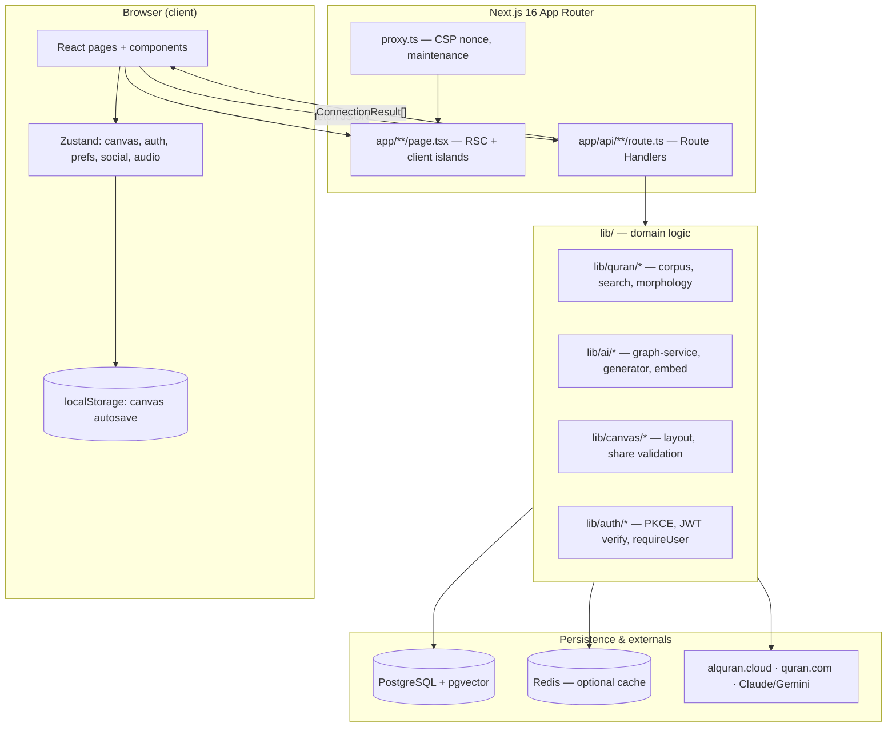
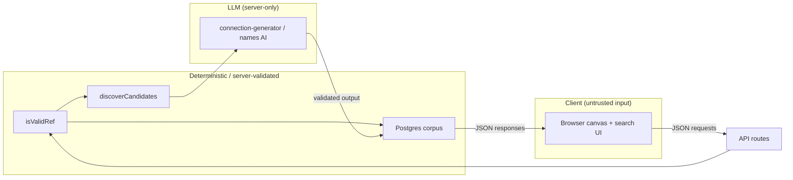

# Phase 4 — Architecture Mental Model

> **Prerequisites:** [Phase 1](./phase-1-what-is-openhikmah.md) · [Phase 2](./phase-2-domain-primer.md) · [Phase 3](./phase-3-theological-boundaries.md)  
> **Evidence tags:** **FACT** · **INFERENCE** · **UNKNOWN**

Phase 4 reconstructs **how the system is actually shaped** — not generic Next.js lore. Where this repo differs from older Next assumptions, those differences are called out.

---

## Start here: one user journey through the architecture

Imagine you search `2:255`, drop it on the canvas, expand by **Theme**, and read three connected verses.



**MUST UNDERSTAND NOW:** The browser **explores**; the server **validates, generates (on miss), and persists** shared truth. Your canvas layout is mostly yours until you share or save a workspace.

---

## Stack snapshot (verified)

**FACT:** From `README.md` and `package.json`:

| Layer | Choice |
| --- | --- |
| Framework | Next.js **16.2** App Router, React **19**, TypeScript strict |
| i18n | next-intl (`i18n/request.ts`, `messages/*.json`) |
| Canvas UI | `@xyflow/react` |
| Client state | Zustand (+ `persist` for auth bookmarks, preferences) |
| Styling | Tailwind CSS v4 |
| AI | Anthropic Claude (+ Gemini fallback); Gemini embeddings |
| DB | PostgreSQL + pgvector + Drizzle ORM |
| Optional cache | Redis (`lib/infra/redis.ts`) |
| Auth | Quran Foundation OAuth2 PKCE |
| Tests | Vitest (unit/integration), Playwright (e2e) |
| Package manager | Bun |

**FACT:** `next.config.ts` sets `typescript.ignoreBuildErrors: true` for production **build OOM** reasons — **CI still runs `bun run typecheck`** as a hard gate. Do not treat build success as type safety.

**FACT:** This repo uses **`proxy.ts`**, not `middleware.ts`, for per-request CSP nonces and maintenance mode (`proxy.ts` header comments reference Next 16 routing order).

---

## Client vs server boundary

### Server Components (default)

**FACT:** Root `app/layout.tsx` is a Server Component — loads locale via `getUiLocale()`, messages via `getMessages()`, passes them to client `Providers`.

**FACT:** Many pages are thin server wrappers + client islands, e.g. `app/canvas/page.tsx` → `CanvasPageClient` (`"use client"`).

**INFERENCE:** Server Components are used where SEO, cookies, and initial locale matter; heavy interactivity pushes to client children.

### Client-only islands

**FACT:** `HikmahCanvas` is loaded with `dynamic(..., { ssr: false })` — React Flow canvas does not SSR (`CanvasPageClient.tsx`).

**FACT:** All Zustand stores are client modules (`"use client"` in store files or consumed only from client components).

### API Route Handlers = backend

**FACT:** `app/api/**/route.ts` exports `GET`/`POST`/etc. — this is the **application backend** for the SPA. No separate Express server.

**INFERENCE:** Compare to Firebase: Route Handlers ≈ Cloud Functions HTTP endpoints; `lib/` ≈ shared function logic; Drizzle + Postgres ≈ Firestore/SQL layer (but relational + pgvector).

---

## Layer reference (responsibility map)

For each layer: **what it owns**, **who calls it**, **critical invariants**.

### 1. Pages & routing (`app/`)

| | |
| --- | --- |
| **Responsibility** | URL → UI shell; metadata; server data prefetch where cheap |
| **Inputs** | Request URL, cookies (`oh_locale`, `oh_edition`), searchParams |
| **Outputs** | HTML + client component tree |
| **State owned** | None long-lived (per-request) |
| **Calls** | `lib/quran/*`, `lib/i18n/request-prefs`, client components |
| **Called by** | Browser navigation |

**Key routes (core product):**

| Path | Role |
| --- | --- |
| `/` | Landing + Verse of the Day |
| `/canvas` | Infinite graph workspace |
| `/search` | Full search page |
| `/names`, `/names/[slug]` | 99 Divine Names |
| `/stories/[slug]` | Prophetic stories (static data) |
| `/bookmarks`, `/workspaces`, `/social` | Authenticated features |
| `/admin/*` | Operator console (env allowlist) |
| `/callback` | OAuth PKCE completion |

**Invariant:** Deep links like `/canvas?verse=2:255` or `?surah=18` hydrate client-side via API fetch (`CanvasPageClient` `VerseLoader`).

---

### 2. UI components (`components/`)

| | |
| --- | --- |
| **Responsibility** | Presentation, interaction, accessibility |
| **Inputs** | Props, Zustand selectors, fetch responses |
| **Outputs** | Events → store updates / API calls |
| **State owned** | Ephemeral UI only (dialogs open, hover) |
| **Calls** | `store/*`, `fetch('/api/...')` |
| **Called by** | `app/*` pages |

**Core clusters:**

| Folder | Role |
| --- | --- |
| `components/canvas/` | `HikmahCanvas`, `VerseNode`, `ExpandMenu`, toolbar, export |
| `components/search/` | `SearchDialog`, surah results |
| `components/layout/` | Header, sidebar, auth shell |
| `components/admin/` | Backfill, coverage, prompts (high risk) |
| `components/audio/` | Mini player for recitation |

**Invariant (`DESIGN.md`):** AI explanation UI ≠ scripture styling.

---

### 3. Client state (`store/` + `hooks/`)

| Store | Persists? | Owns |
| --- | --- | --- |
| `store/canvas.ts` | Via hook → localStorage | nodes, edges, selection, expand pending, viewport |
| `store/auth.ts` | Bookmarks in localStorage; token **memory only** | accessToken, bookmarks sync state |
| `store/preferences.ts` | localStorage + cookies | locale, edition per locale, reciter, canvas prefs |
| `store/social.ts` | Partial persist | profile, streak, pending counts |
| `store/audio.ts` | Session | playback queue, current verse |

| Hook | Role |
| --- | --- |
| `hooks/useCanvasPersistence.ts` | Restore share URL → autosave localStorage; `buildShareUrl`; guest→workspace merge |
| `hooks/useActivityTracker.ts` | Posts social activity on canvas actions |

**Canvas persistence tiers (FACT from `useCanvasPersistence.ts`):**

1. **In-memory** — Zustand (live session)
2. **localStorage** — `open-hikmah-canvas` debounced autosave
3. **Share URL** — `POST /api/share` → UUID → `/canvas?share=<uuid>` → `GET /api/share/[id]`
4. **Workspace** — authenticated `POST /api/workspace` (Postgres `saved_workspaces`)

**Invariant:** Share restore runs **before** localStorage restore; autosave waits until hydration completes (avoids wiping shared canvas).

---

### 4. API routes (`app/api/`)

Grouped by domain:

| Prefix | Responsibility | Auth |
| --- | --- | --- |
| `/api/search` | Keyword + related semantic | Public (rate-limited) |
| `/api/verse/...`, `/api/verses/...` | Verse lookup, similar, tafsir | Mostly public |
| `/api/connections` | **Graph expand** — cache + AI miss | Public (rate-limited on AI path) |
| `/api/share` | Persist canvas snapshot | Public (rate-limited) |
| `/api/workspace` | Named saved canvases | Bearer token |
| `/api/bookmarks`, `/api/notes` | User verse data | Bearer token |
| `/api/auth/*` | PKCE exchange, refresh, signout | Cookie + token |
| `/api/social/*` | Friends, challenges, streaks, mentions | Bearer token |
| `/api/names/...` | AI name content (verses, reflection, pairings) | Public (rate-limited) |
| `/api/admin/*` | Prompts, backfill, flags, audit | Admin allowlist |
| `/api/health`, `/api/metrics` | Ops | Public / internal |

**Trust boundary (FACT):** Routes call `isValidRef`, `requireUser`, `requireAdmin` **before** domain logic — see Phase 3.

---

### 5. Domain libraries (`lib/`)

#### `lib/quran/` — canonical text & retrieval

| Module | Role |
| --- | --- |
| `quran-corpus.ts` | Local `verses` reads, `isValidRef` |
| `verse-resolver.ts` | Corpus + alquran.cloud fallback |
| `semantic-search.ts` | pgvector queries, query embed cache |
| `arabic-morphology.ts` | Token highlighting helpers |
| `chapters.ts`, `surah-names.ts` | Surah metadata |
| `audio.ts` | Recitation URLs / ordering |

**Calls:** Drizzle → Postgres; Gemini embed (queries); optional Redis.  
**Called by:** API routes, `lib/ai/graph-service`, scripts.

#### `lib/ai/` — probabilistic + graph orchestration

| Module | Role |
| --- | --- |
| `graph-service.ts` | **Persistent graph** — cache read, miss generation, locale translation |
| `connection-discovery.ts` | Deterministic candidates (roots / vectors) |
| `connection-generator.ts` | **Only LLM caller for connections** |
| `ai.ts` | Provider resolution, `callAI`, `embed` |
| `translate.ts` | Localized reason translation + validation |
| `connection-batch*.ts` | Admin backfill |
| `prompt-registry.ts` | DB prompt versions with hardcoded fallback |
| `theological-constraints.ts` | Shared `TANZIH_CONSTRAINT` |

**Invariant:** English canonical verse **selection**; locales translate **reasons** only.

#### `lib/canvas/` — layout & share validation

| Module | Role |
| --- | --- |
| `canvas-layout.ts` | Collision-free node placement |
| `share-canvas.ts` | `isValidNode` for share POST |
| `canvas-export.ts` | PDF/image export |

#### `lib/auth/` — identity

| Module | Role |
| --- | --- |
| `pkce.ts` | Build QF authorize URL (client-side capable helpers) |
| `social-auth.ts` | JWT verify (JWKS), `requireUser`, token cache |
| `session-cookie.ts` | HttpOnly refresh cookie constants |

**FACT:** Access token in **memory**; refresh via HttpOnly cookie (`store/auth.ts` comment).

#### `lib/infra/` — cross-cutting

| Module | Role |
| --- | --- |
| `db.ts` + `db/schema.ts` | Drizzle client + all tables |
| `rate-limit.ts` | Postgres and/or Redis rate windows |
| `redis.ts` | Optional cache (embed queries, auth L2, rate limits) |
| `http.ts` | `clientKey` from forwarded IP |
| `metrics.ts` | Counters for ops |
| `search-log.ts` | Anonymous search analytics |

#### `lib/names/`, `lib/stories/`, `lib/social/`

- **Names:** Static divine-name data + AI content cache (`name-content.ts`)
- **Stories:** Static TS narratives (`lib/stories/data/*.ts`) — no runtime AI
- **Social:** Streak logic, friends, challenges, activity posting

#### `lib/admin/`

Feature flags, job runner, coverage reports, admin auth — **CODEOWNERS** gated.

---

### 6. PostgreSQL (via Drizzle)

**FACT:** Single `DATABASE_URL`; Drizzle schema in `lib/infra/db/schema.ts`.

**Core product tables:**

| Table | Purpose |
| --- | --- |
| `verses`, `verse_translations` | Canonical Quran text |
| `word_morphology` | Root discovery |
| `verse_embeddings` | Semantic search + thematic candidates |
| `connections` | **Shared knowledge graph edges** |
| `connection_coverage` | Admin backfill bookkeeping |
| `shared_canvases` | Share-link snapshots |
| `saved_workspaces` | User-named canvases |
| `users`, `bookmarks`, `verse_notes`, … | Auth + social |
| `ai_generations`, `prompt_versions` | Audit + prompt admin |
| `name_content`, `name_verse_reasons` | Divine Names AI cache |

**Invariant:** Graph edges are **global** — one generation serves all users (cost → 0 over time).

---

### 7. External services

| Service | Used for |
| --- | --- |
| **alquran.cloud** | Seed corpus; live verse fallback |
| **quran.com API** | Keyword search index; surah name localization; name verse search |
| **Anthropic / Gemini** | Connection reasons, name content, translations |
| **Gemini embeddings** | Semantic search (always Gemini) |
| **Quran Foundation OAuth** | Sign-in, JWT claims |
| **Google Analytics** | Usage (nonce'd script via CSP) |

---

## Request flows (architecture-level)

### Flow A — Expand verse on canvas

```
VerseNode ExpandMenu
  → HikmahCanvas.runExpansion()
  → POST /api/connections { fromRef, kind, arabicText, translation, excludeRefs }
  → getConnections() [graph-service]
       → SELECT connections (cache hit?) → return
       → discoverCandidates() → generateGroundedConnections() → INSERT connections
  → ConnectionResult[] JSON
  → canvas store addVerseNode + addConnectionEdge
  → useCanvasPersistence debounced localStorage save
```

**Trust arrow:** LLM is **downstream of** discovery + validation (Phase 2).

### Flow B — Search

```
SearchDialog → GET /api/search?q=...
  → ref path | surah name | keyword (quran.com) + optional semantic related
  → hydrate via getVerses (local corpus)
  → SearchResponse JSON
```

Keyword and semantic budgets are **separate rate limit keys** (`searchkw:` vs `search:`).

### Flow C — Share canvas

```
CanvasToolbar → serializeCanvas() → POST /api/share
  → shared_canvases row (UUID)
  → URL /canvas?share=<uuid>
Recipient opens URL → GET /api/share/[id] → restoreCanvas()
```

Layout only — **not** the global `connections` cache.

### Flow D — Sign in + bookmark sync

```
PKCE → /callback → /api/auth/exchange
  → access token (memory) + refresh cookie
  → SessionRestorer → /api/auth/refresh on load
  → loadRemoteBookmarks → merge local pending refs
  → mergeGuestWorkspace (local canvas → cloud workspace once)
```

---

## Localization architecture

**FACT:** Two parallel preference channels:

| Channel | Storage | Consumed by |
| --- | --- | --- |
| UI locale | Cookie `oh_locale` (+ localStorage mirror) | next-intl messages |
| Quran edition | Cookie `oh_edition` | Server API verse/search hydration |

**FACT:** `getUiLocale()` / `getQuranEdition()` validate against whitelists (`lib/i18n/request-prefs.ts`) — invalid cookies fall back safely.

**FACT:** Connection **reasons** served in UI locale when cached; verse **selection** stays English-canonical (Phase 2/3).

---

## Audio (peripheral but real)

**FACT:** `store/audio.ts` + `components/audio/MiniPlayer.tsx` — plays canvas verses in Qur'an order (`README` feature).

**USEFUL LATER:** Reciter preference in `store/preferences.ts` (`DEFAULT_RECITER` from `lib/quran/audio.ts`).

---

## Social / challenges (peripheral)

**FACT:** Tables: `friendships`, `challenges`, `activity_log`, `note_mentions`, etc.

**FACT:** `hooks/useActivityTracker.ts` posts activity when user adds verses/connections — feeds streaks and challenges.

**IGNORE FOR NOW:** Challenge lifecycle, leaderboard scoring — unless contributing in that area.

---

## Admin & operations

**FACT:** Admin = `ADMIN_QF_IDS` env allowlist — fail-closed (`lib/admin/admin-auth.ts`).

**FACT:** `proxy.ts` maintenance mode reads `maintenance_mode` feature flag — excludes admin/auth/health from 503.

**FACT:** Scripts (`scripts/*.mjs`, `scripts/*.ts`): seed Quran, morphology, embeddings, migrate, backfill, prewarm.

**FACT:** Pre-push hook runs integration tests (Testcontainers) — needs Docker.

---

## Testing architecture (where evidence lives)

| Layer | Location | What runs |
| --- | --- | --- |
| Unit | `__tests__/lib/`, `__tests__/api/`, `__tests__/store/` | Vitest, mocked fetch/AI |
| Integration | `__tests__/integration/` | Real Postgres via Testcontainers |
| E2E | `e2e/` | Playwright + axe |
| CI | `.github/workflows/ci.yml` | lint, typecheck, unit, integration, build, e2e |

**INFERENCE:** Unit tests prove module contracts; integration tests prove DB + graph persistence; e2e proves user flows.

---

## Mermaid — trust boundaries



The client may **suggest** refs and text in POST bodies; the server **re-validates** before AI and persistence.

---

## Five architectural facts to memorize

1. **Three persistence tiers for exploration:** in-memory canvas → localStorage → (optional) share URL / workspace — **separate from** the global `connections` graph in Postgres.

2. **`lib/ai/graph-service.ts` is the graph’s brain:** cache-first, AI on miss, write-once shared edges — canvas expand always goes through `/api/connections`.

3. **All LLM calls for verse connections live in `lib/ai/connection-generator.ts`**, invoked only from server-side graph/name pipelines — not from React components directly.

4. **Client tokens stay in memory; refresh uses HttpOnly cookies** — bookmarks persist locally for guests; signed-in users sync via `/api/bookmarks`.

5. **`proxy.ts` (not `middleware.ts`) + Route Handlers + Drizzle** define this repo’s Next 16 shape — do not assume Pages Router or client-side DB access.

---

## Next.js differences worth noting

| Older assumption | OpenHikmah reality |
| --- | --- |
| `middleware.ts` | **`proxy.ts`** with `config.matcher` |
| Build = type-safe | **`ignoreBuildErrors: true`** in prod build; CI typechecks separately |
| SSR canvas | **`ssr: false`** for React Flow |
| API in `pages/api` | **`app/api/**/route.ts`** |
| Env read anywhere | Server secrets only in Route Handlers / `lib/` — `NEXT_PUBLIC_*` baked at dev start |

**UNKNOWN for you until Phase 10:** Exact local dev bootstrap (Docker compose, migrate, seed order) — documented in CONTRIBUTING / Phase 10.

---

## Phase 4 — What to remember

### MUST UNDERSTAND NOW

- **`app/`** = routes; **`components/`** = UI; **`lib/`** = domain; **`store/`** = client session state; **`app/api/`** = backend.
- **Canvas state ≠ connection graph** — layout local/shareable; edges canonical in Postgres.
- **Expand path:** client → `/api/connections` → `graph-service` → (maybe) AI → DB → JSON → Zustand.
- **Auth:** PKCE + JWT; admin via env allowlist; high-risk paths CODEOWNERS-gated.
- **Postgres holds sacred + graph truth; Redis is optional acceleration.**

### USEFUL LATER

- Admin backfill job architecture (`connection-batch-loop.ts`)
- CSP enforcement flip from report-only
- `mergeGuestWorkspace` idempotency flag
- Social activity queue (`post-activity.ts`)

### IGNORE FOR NOW

- OG image generation routes
- CSP report endpoint tuning
- Size-limit CI job details

---

## Uncertainties

| Topic | Status |
| --- | --- |
| Multi-instance single-flight for graph misses | **FACT:** in-process only; Redis lock deferred (`graph-service.ts` comment) |
| Whether all pages use RSC vs client | **INFERENCE:** hybrid pattern; canvas/search heavily client |
| Production hosting (Coolify mentioned in next.config) | **FACT:** standalone output; full deploy topology **UNKNOWN** without ops docs |

---

## What comes next

**Phase 5 — Repository tour:** focused directory map — what belongs where, when you’d touch it, risk level for new contributors (not a full tree dump).

Say **“continue to Phase 5”** when ready.

---

## Key files (Phase 4 reading list)

| File | Why |
| --- | --- |
| `app/canvas/CanvasPageClient.tsx` | Client/server split, deep links |
| `components/canvas/HikmahCanvas.tsx` | Expand → API → store |
| `hooks/useCanvasPersistence.ts` | localStorage + share restore |
| `app/api/connections/route.ts` | Graph API boundary |
| `lib/ai/graph-service.ts` | Cache + generation orchestration |
| `lib/infra/db/schema.ts` | Table ownership |
| `store/canvas.ts` | Canvas state model |
| `store/auth.ts` | Token + bookmark model |
| `proxy.ts` | Request edge (CSP, maintenance) |
| `components/providers.tsx` | Session restore, locale sync |
| `lib/auth/social-auth.ts` | `requireUser` boundary |
| `lib/ai/ai.ts` | Provider/feature resolution |
