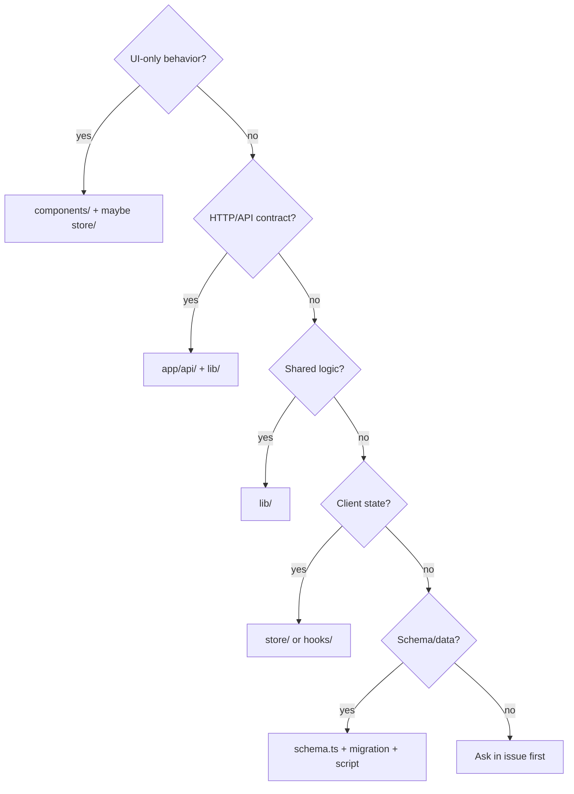

# Phase 5 — Repository Tour

> **Prerequisites:** [Phase 1](./phase-1-what-is-openhikmah.md) · [Phase 2](./phase-2-domain-primer.md) · [Phase 3](./phase-3-theological-boundaries.md) · [Phase 4](./phase-4-architecture.md)  
> **Evidence tags:** **FACT** · **INFERENCE** · **UNKNOWN**

This is a **guided map**, not a directory dump. Each area answers: what lives here, why it lives here, who consumes it, what it consumes, when you would touch it, and how risky that is for a new contributor.

---

## Repository shape (top level)

```text
openhikmah-web/
├── app/              # Next.js App Router — pages + API Route Handlers
├── components/       # React UI (feature-grouped)
├── lib/              # Domain + infra logic (no React)
├── store/            # Zustand client stores
├── hooks/            # Client React hooks
├── types/            # Shared TypeScript types (domain)
├── messages/         # next-intl locale JSON (en, tr, ru, az)
├── i18n/             # next-intl server config
├── __tests__/        # Vitest — mirrors lib/, api/, store/, components/
├── e2e/              # Playwright end-to-end tests
├── scripts/          # Offline seed, migrate, backfill, CI helpers
├── data/             # Committed seed data (morphology JSONL)
├── lib/infra/db/migrations/  # SQL migrations (Drizzle)
├── public/           # Static assets (logo, etc.)
├── docs/onboarding/  # This onboarding series
├── AGENTS.md         # Canonical agent + contributor rules
├── proxy.ts          # Request edge (CSP nonce, maintenance) — Next 16
└── next.config.ts    # Build, headers, next-intl plugin
```

**IGNORE FOR NOW:** `.agents/skills/`, `.cursor/rules/` — agent tooling mirrors of `AGENTS.md`, not runtime product code.

---

## Naming conventions (repository-evidenced)

Derived from dominant patterns across the tree — **follow these when adding files**, not personal habit from other repos.

| Category | Convention | Examples | Confidence |
| --- | --- | --- | --- |
| **Lib modules** | `kebab-case.ts` | `graph-service.ts`, `quran-corpus.ts`, `social-auth.ts` | **HIGH** |
| **React components** | `PascalCase.tsx` | `HikmahCanvas.tsx`, `SearchDialog.tsx` | **HIGH** |
| **Component folders** | `kebab-case/` or feature name | `components/canvas/`, `components/layout/` | **HIGH** |
| **App Router pages** | `page.tsx`, `layout.tsx`, `loading.tsx`, `error.tsx` | Framework-mandated | **FRAMEWORK** |
| **API handlers** | `route.ts` in folder path = URL | `app/api/connections/route.ts` | **FRAMEWORK** |
| **Zustand stores** | `kebab-case.ts`, `useXxxStore` export | `store/canvas.ts` → `useCanvasStore` | **HIGH** |
| **Hooks** | `useCamelCase.ts` | `useCanvasPersistence.ts` | **HIGH** |
| **Types file** | Domain at `types/` root | `types/quran.ts` | **HIGH** |
| **Tests** | Mirror source path + `.test.ts(x)` | `__tests__/lib/ai/graph-service.test.ts` | **HIGH** |
| **E2E** | `kebab-case.spec.ts` | `e2e/canvas.spec.ts` | **HIGH** |
| **Scripts** | `kebab-case.mjs` or `.ts` | `seed-quran.mjs`, `backfill-connections.ts` | **HIGH** |
| **Imports** | `@/` alias → repo root | `import { db } from "@/lib/infra/db"` | **HIGH** |
| **DB columns (Drizzle)** | `camelCase` in TS → `snake_case` in SQL | `fromRef` → `from_ref` | **HIGH** |
| **Edge kind literals** | lowercase string union | `"thematic" \| "root" \| "contrast"` | **EXTERNAL-CONTRACT** |
| **Verse refs** | `"surah:ayah"` string, canonical | `"2:255"` not `"02:255"` | **EXTERNAL-CONTRACT** |
| **Locale cookies** | `oh_locale`, `oh_edition` | Do not rename without migration | **EXTERNAL-CONTRACT** |

**Product terminology (use consistently):**

| Term in code/docs | Meaning |
| --- | --- |
| **Connection** | Persisted graph edge (`connections` table) or API `ConnectionResult` |
| **Canvas edge** | React Flow edge in Zustand (includes layout node ids) |
| **Verse / ref** | Canonical `"surah:ayah"` identity |
| **Kind / EdgeKind** | `thematic`, `root`, `contrast` |
| **Edition** | Translation id, e.g. `en.sahih` |
| **Locale** | UI language: `en`, `tr`, `ru`, `az` |
| **Cell** | `(fromRef, kind, locale)` unit in graph-service / backfill |

**Known stale comment (do not copy blindly):** Some older comments say `lib/quran-corpus.ts` — the real path is **`lib/quran/quran-corpus.ts`**.

---

## `app/` — routes (UI + HTTP backend)

**Why here:** Next.js App Router convention — URL structure = folder structure.

### User-facing pages (`app/<segment>/`)

| Area | Path | Responsibility | Touch when… | Risk |
| --- | --- | --- | --- | --- |
| **Canvas** | `app/canvas/` | Graph workspace shell; `CanvasPageClient` | Canvas entry, deep links `?verse=` | Medium |
| **Search** | `app/search/` | Full-page search | Search UX | Low–medium |
| **Home** | `app/page.tsx` | Landing, Verse of Day | Marketing home | Low |
| **Names** | `app/names/` | 99 Names detail pages | Name UI, not static data | Medium |
| **Stories** | `app/stories/` | Prophetic story reader | Story navigation | Low–medium |
| **Surah reader** | `app/surah/[number]/` | Full surah view | Reading UX | Low |
| **Bookmarks** | `app/bookmarks/` | Saved verses | Bookmark UI | Low |
| **Workspaces** | `app/workspaces/` | Saved canvases (auth) | Workspace list UX | Medium |
| **Social** | `app/social/` | Friends, challenges | Social features | Medium |
| **Settings** | `app/settings/` | Locale, edition, reciter | Preferences UI | Low |
| **Auth callback** | `app/callback/` | PKCE OAuth completion | **Rarely** — CODEOWNERS | **High** |
| **Admin** | `app/admin/` | Operator console UI | Admin features | **High** |

**Pattern (FACT):** Many pages = thin `page.tsx` + `*Client.tsx` with `"use client"` for interactivity.

**Consumes:** `components/*`, `store/*`, `fetch('/api/...')`.  
**Consumed by:** Browser navigation only.

### API Route Handlers (`app/api/`)

**Why here:** Server-only backend for the SPA — secrets, DB, AI, validation.

| Prefix | Role | Key consumers |
| --- | --- | --- |
| `app/api/search/` | Keyword + semantic related | `SearchDialog`, search page |
| `app/api/connections/` | Graph expand (cache + AI) | `HikmahCanvas` |
| `app/api/verse/`, `app/api/verses/` | Verse fetch, similar, tafsir, morphology | Canvas, sidebar, reader |
| `app/api/share/` | Share canvas persist/load | `useCanvasPersistence`, OG image |
| `app/api/workspace/` | Named canvas CRUD | `CanvasToolbar`, auth flows |
| `app/api/bookmarks/`, `app/api/notes/` | User verse data | Auth store, bookmarks page |
| `app/api/auth/` | Exchange, refresh, signout | `CallbackClient`, `Providers` |
| `app/api/social/` | Friends, challenges, streaks, mentions | Social pages, activity tracker |
| `app/api/names/` | AI name content APIs | Name page components |
| `app/api/admin/` | Prompts, jobs, flags, audit | Admin UI — **CODEOWNERS** |
| `app/api/health/`, `metrics/`, `csp-report/` | Ops | Monitoring |

**Invariant:** Validate at the route boundary (`isValidRef`, `requireUser`, `requireAdmin`) before calling `lib/`.

**Risk summary:** Anything under `app/api/admin/`, `app/api/auth/`, `app/callback/` → **high**. Core product APIs (`search`, `connections`, `verse`) → **medium** (theological + validation). `health` → low.

---

## `components/` — presentation layer

**Why here:** Reusable UI, grouped by **product feature**, not atomic design tier alone.

| Folder | Belongs | Consumed by | Touch when… | Risk |
| --- | --- | --- | --- | --- |
| `components/canvas/` | Nodes, edges, expand, toolbar, export | `app/canvas/` | Canvas UX, expansion UI | Medium |
| `components/search/` | Search dialog, surah list items | Header, canvas, home | Search interaction | Low–medium |
| `components/layout/` | Header, sidebar, auth shell, nav | Most pages | Global chrome, a11y | Low–medium |
| `components/home/` | Landing hero, previews | `app/page.tsx` | Home marketing | Low |
| `components/ui/` | Buttons, inputs, tooltip (design system) | Everywhere | Shared UI primitives | Low |
| `components/admin/` | Backfill, coverage, prompts UI | `app/admin/` | **Admin only** | **High** |
| `components/social/` | Friends, challenges UI | Social pages | Social UX | Medium |
| `components/audio/` | Mini player | `Providers` (global) | Audio playback | Low |
| `components/morphology/` | Interactive Arabic highlighting | Verse displays | Root word UI | Low |
| `components/today/` | Verse of Day cards | Home, today route | VOTD presentation | Low |
| `components/providers.tsx` | Session restore, i18n, locale sync | Root layout | Auth bootstrap | Medium |

**Convention:** Components **fetch** or receive data — they do not import `lib/ai/graph-service` directly (server-only paths stay in API/`lib`).

**Sacred UI rule:** `ReflectionNote`, edge reason styling — AI text visually distinct (`DESIGN.md`).

---

## `lib/` — domain and infrastructure

**Why here:** Shared logic usable from API routes, scripts, and tests — **no React**, no `"use client"`.

```text
lib/
├── quran/       # Corpus, search, morphology helpers, audio, surah metadata
├── ai/          # Graph service, connection generator, embeddings, prompts
├── canvas/      # Layout math, share validation, export
├── auth/        # PKCE, JWT verify, requireUser
├── i18n/        # Cookie readers, locale config (framework-free)
├── names/       # Divine names data + AI content cache helpers
├── stories/     # Static prophetic story content
├── social/      # Streak, friends, challenges, activity queue
├── admin/       # Admin auth, flags, jobs, coverage, audit
└── infra/       # db, redis, rate-limit, http, metrics, sleep
```

### Module guide

| Module | Responsibility | Called by | Risk |
| --- | --- | --- | --- |
| **`lib/quran/quran-corpus.ts`** | `isValidRef`, local verse reads | Almost all Quran paths | **High** (validation) |
| **`lib/quran/semantic-search.ts`** | pgvector queries, query embed cache | Search API, discovery | Medium–high |
| **`lib/quran/verse-resolver.ts`** | Corpus + live fallback | APIs, graph hydrate | Medium |
| **`lib/ai/graph-service.ts`** | Persistent graph cache + miss path | `/api/connections`, backfill | **High** |
| **`lib/ai/connection-generator.ts`** | **Only LLM caller for connections** | graph-service | **High** (prompts + theology) |
| **`lib/ai/connection-discovery.ts`** | Root/semantic candidates | graph-service | Medium |
| **`lib/ai/theological-constraints.ts`** | `TANZIH_CONSTRAINT` | All sensitive prompts | **High** |
| **`lib/ai/ai.ts`** | Provider resolution, `callAI`, `embed` | Generator, names, translate | Medium |
| **`lib/ai/prompt-registry.ts`** | DB prompt versions | connection-generator | **High** |
| **`lib/auth/social-auth.ts`** | `requireUser`, JWT/JWKS | Protected APIs | **High** (CODEOWNERS) |
| **`lib/auth/pkce.ts`** | OAuth URL builder | Sign-in flow | **High** (CODEOWNERS) |
| **`lib/infra/db/schema.ts`** | Drizzle schema — single source of tables | Everywhere | **High** |
| **`lib/infra/rate-limit.ts`** | AI/search budgets | API routes | Medium |
| **`lib/names/divine-names/`** | Static 99 Names data | Names pages/APIs | **High** (content) |
| **`lib/stories/data/`** | Static story narratives + verseRefs | Stories pages | Medium (content) |

**When to add new code:** Prefer extending an existing module over new top-level folders. One-off helpers belong inline unless reused twice.

---

## `store/` + `hooks/` — client state

| File | Owns | Persists | Risk |
| --- | --- | --- | --- |
| `store/canvas.ts` | nodes, edges, selection, expand state | via hook → localStorage | Medium |
| `store/auth.ts` | token (memory), bookmarks sync | bookmarks in localStorage | Medium |
| `store/preferences.ts` | locale, edition, reciter, canvas prefs | localStorage + cookies | Low |
| `store/social.ts` | profile, streak, pending counts | partial persist | Low |
| `store/audio.ts` | playback queue | session | Low |
| `hooks/useCanvasPersistence.ts` | restore share/localStorage, share URL, guest merge | localStorage | Medium |
| `hooks/useActivityTracker.ts` | social activity posts | queue in memory | Low |
| `hooks/useSignIn.ts` | PKCE redirect flow | — | Medium |

**Invariant:** Stores do not call AI or DB directly — only `fetch('/api/...')`.

---

## `types/` — shared TypeScript

**FACT:** Currently `types/quran.ts` holds core domain types: `Verse`, `VerseRef`, `EdgeKind`, `ConnectionResult`, `SearchResponse`, `CanvasEdge`, etc.

**Why separate:** Imported from both client and server without pulling React or Drizzle.

**When to modify:** Adding fields to API payloads or canvas serialization — update types **and** tests together.

---

## `messages/` + `i18n/`

| Path | Role |
| --- | --- |
| `messages/en.json`, `tr.json`, `ru.json`, `az.json` | UI strings (next-intl) |
| `i18n/request.ts` | Server next-intl config |
| `lib/i18n/config.ts` | Locale/edition whitelists (importable anywhere) |
| `lib/i18n/request-prefs.ts` | Server cookie readers |

**Touch when:** User-visible copy, nav labels, error strings — **not** AI-generated connection reasons (those come from API/DB).

**Risk:** Low for UI strings; medium if you accidentally put theological content in messages instead of validated AI paths.

---

## `__tests__/` — unit + API tests

**FACT:** `CONTRIBUTING.md` — structure mirrors source:

```text
__tests__/
├── lib/          # Pure logic (graph, corpus, AI parsing, …)
├── api/          # Route handlers (fetch/AI mocked)
├── store/        # Zustand behavior
├── components/   # React Testing Library
├── hooks/        # Hook behavior
├── app/          # Page-level tests
└── integration/  # Real Postgres (Testcontainers)
```

**Convention:** File name = subject + `.test.ts` or `.test.tsx`.

**When to add:** Any new logic in `lib/` or behavior change in API/store — same PR as the change (`AGENTS.md`).

---

## `e2e/` — Playwright

| Spec | Covers |
| --- | --- |
| `canvas.spec.ts` | Canvas flows |
| `search.spec.ts` | Search |
| `a11y.spec.ts` | Accessibility (axe) |
| `social.spec.ts`, `settings.spec.ts`, `stories.spec.ts`, `admin.spec.ts` | Feature smoke |
| `fixtures/auth.ts` | Auth helpers |

**Risk:** Low to run; medium to write (needs dev server + DB). CI runs automatically.

---

## `scripts/` — offline operations

| Script | Purpose | When you run it |
| --- | --- | --- |
| `seed-quran.mjs` | Populate `verses` from alquran.cloud | Fresh local DB |
| `seed-morphology.mjs` | Load `data/morphology/*.jsonl` | After clone / morphology update |
| `seed-translations.mjs` | Extra translation editions | Locale testing |
| `embed-corpus.mjs` | Gemini embeddings → `verse_embeddings` | Semantic search / grounded theme |
| `migrate.mjs` | Apply SQL migrations | Schema changes |
| `backfill-connections.ts` | Admin graph fill | Ops / coverage work |
| `prewarm-graph.mjs` | Warm popular verse cells | Ops |

**FACT:** Scripts require `DATABASE_URL`; embedding script requires `GEMINI_API_KEY`.

**Risk:** **High** for seed/migrate — affects all environments. Read script header comments before running.

---

## `data/` + migrations

| Path | Role | Risk |
| --- | --- | --- |
| `data/morphology/*.jsonl` | Committed morphology seed input | **High** (grounding data) |
| `lib/infra/db/schema.ts` | Drizzle ORM model | **High** |
| `lib/infra/db/migrations/*.sql` | Versioned schema changes | **High** — must be reversible, integration-tested |

**FACT:** Migration `0006_connection_graph.sql`, `0008_semantic_and_morphology.sql` — names hint at major product pillars.

---

## `public/` + root config

| File | Role |
| --- | --- |
| `public/logo-mark.png` | Brand assets |
| `app/globals.css` | Design tokens (`@theme`) — **no hardcoded hex in components** |
| `proxy.ts` | CSP nonce, maintenance flag |
| `next.config.ts` | Security headers, next-intl, standalone build |
| `.env.example` | Documented env vars — update if you add secrets |
| `AGENTS.md`, `CONTRIBUTING.md` | **Read before every PR** |

---

## `.github/` — CI and templates

| Path | Role |
| --- | --- |
| `.github/workflows/ci.yml` | lint, typecheck, unit, integration, build, e2e |
| `.github/PULL_REQUEST_TEMPLATE.md` | AI/theological disclosure checkboxes |
| `.github/CODEOWNERS` | Required review: `app/api/admin/`, `lib/auth/`, `app/callback/`, `next.config.ts` |
| `.github/ISSUE_TEMPLATE/` | Bug + feature (theological rationale field) |

**FACT:** Pre-push hook (`.husky/pre-push`) runs integration tests — needs Docker.

---

## “Where do I put my change?” — decision tree



Add **`__tests__/`** alongside any non-trivial `lib/` or API change.

---

## Contributor risk map (new outsider)

### Safer first surfaces (still meaningful)

| Area | Example work | Why safer |
| --- | --- | --- |
| `components/search/`, `components/layout/` | Focus, a11y, loading states | Bounded UI; no theology |
| `components/canvas/` (UX only) | Toolbar, empty state, tour | Touches core UX; avoid graph logic |
| `store/canvas.ts` + tests | Layout/dedup correctness | Testable; no prompts |
| `app/search/` + search components | Pagination, empty states | Mostly presentation |
| `__tests__/` | Regression tests for fixed bugs | High value, clear scope |
| `messages/*.json` | UI copy (non-theological) | Low code risk |

### Second / third contribution depth

| Area | Requires |
| --- | --- |
| `lib/quran/semantic-search.ts` | pgvector, embeddings mental model |
| `hooks/useCanvasPersistence.ts` | Share/localStorage race semantics |
| `app/api/search/route.ts` | Rate limits, dual search paths |
| Social / workspaces | Auth + Drizzle patterns |

### Wait until you understand more (Phase 3 applies)

| Area | Why |
| --- | --- |
| `lib/ai/connection-generator.ts`, prompts | Theological + validation |
| `lib/ai/theological-constraints.ts` | Sacred constraint text |
| `lib/names/divine-names/data/` | Theological content |
| `lib/auth/`, `app/callback/` | Security — CODEOWNERS |
| `app/api/admin/` | Fail-closed admin surface |
| `lib/infra/db/migrations/` | Irreversible without care |
| `data/morphology/` | Grounding corpus |

---

## Cross-reference: Phase 4 layers → folders

| Architectural layer (Phase 4) | Primary folders |
| --- | --- |
| Pages / routing | `app/` (non-api) |
| API backend | `app/api/` |
| Domain logic | `lib/` |
| UI | `components/` |
| Client state | `store/`, `hooks/` |
| Persistence schema | `lib/infra/db/` |
| Offline data ops | `scripts/`, `data/` |
| Evidence | `__tests__/`, `e2e/` |

---

## Phase 5 — What to remember

### MUST UNDERSTAND NOW

1. **`app/`** = URLs; **`app/api/`** = backend; **`lib/`** = shared logic; **`components/`** = UI.
2. **Tests mirror source** under `__tests__/` — add tests with behavior changes.
3. **Naming:** kebab-case lib/scripts, PascalCase components, `useX` hooks, `@/` imports.
4. **High-risk paths:** `lib/ai/*` prompts, `lib/auth/`, admin, migrations, morphology data.
5. **Components never import graph-service** — expand goes browser → API → lib.

### USEFUL LATER

- Full admin module map (`lib/admin/*`)
- `e2e/fixtures/auth.ts` for signed-in tests
- Drizzle migration numbering workflow
- `components/layout/nav-items.ts` as nav single source of truth

### IGNORE FOR NOW

- `.agents/skills/` repo-local agent copies
- `scripts/deploy.sh` (ops)
- Individual migration file history beyond “they exist”

---

## Uncertainties

| Topic | Status |
| --- | --- |
| Whether new domain areas should get top-level `lib/<area>/` vs nesting | **INFERENCE:** follow existing siblings (`lib/social/`, `lib/canvas/`) |
| Planned split of `types/quran.ts` as types grow | **UNKNOWN** — only one types file today |

---

## What comes next

**Phase 6 — Core runtime walkthroughs:** 3–5 traced flows with exact symbols and file paths (search, expand, share, auth bookmark).

Say **“continue to Phase 6”** when ready.

---

## Quick reference — “if you need X, open Y”

| I need to… | Start here |
| --- | --- |
| Change expand behavior | `components/canvas/HikmahCanvas.tsx` → `app/api/connections/route.ts` → `lib/ai/graph-service.ts` |
| Fix invalid ref slipping through | `lib/quran/quran-corpus.ts` (`isValidRef`) |
| Change connection prompt | `lib/ai/connection-generator.ts`, `lib/ai/prompt-registry.ts` |
| Change search results | `app/api/search/route.ts`, `lib/quran/semantic-search.ts` |
| Change canvas save/share | `hooks/useCanvasPersistence.ts`, `app/api/share/` |
| Change sign-in | `lib/auth/pkce.ts`, `app/callback/`, `app/api/auth/` |
| Add DB column | `lib/infra/db/schema.ts` + new migration + integration test |
| Add UI string | `messages/<locale>.json` |
| Understand tests for graph | `__tests__/integration/graph.integration.test.ts` |
