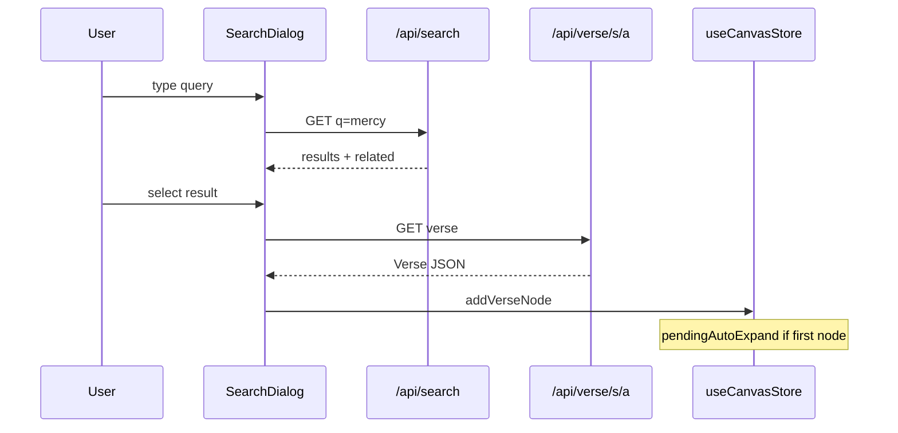
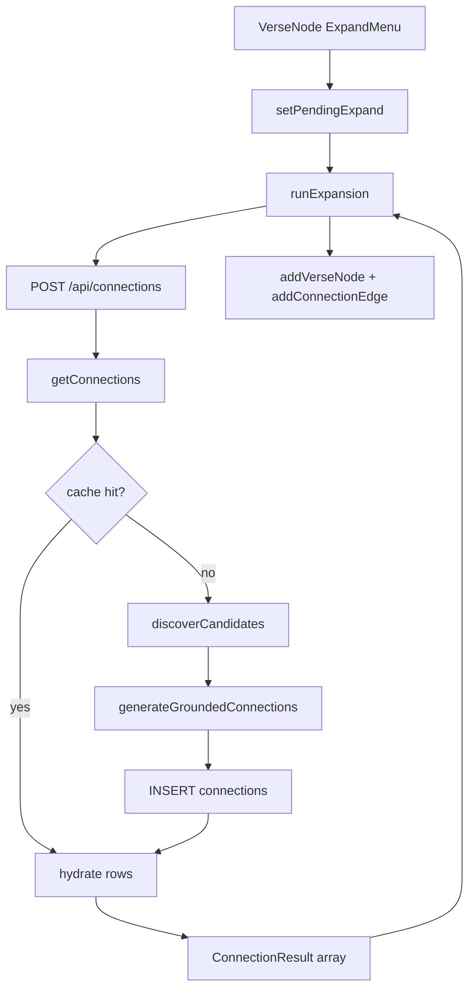

# Phase 6 — Core Runtime Walkthroughs

> **Prerequisites:** Phases [1](./phase-1-what-is-openhikmah.md)–[5](./phase-5-repository-tour.md)  
> **Evidence tags:** **FACT** · **INFERENCE** · **UNKNOWN**

Five flows that together teach most of the architecture. Each step names **exact symbols and paths**. Read one flow at a time; trace it in the repo before moving on.

**Legend for each step:**

| Field | Meaning |
| --- | --- |
| **Where** | File / function |
| **Input** | What arrives |
| **Decision** | Branch taken |
| **Output** | What changes |
| **Next** | Who runs next |

---

## Flow A — Search by reference or keyword

**User story:** Type `2:255` or `mercy` in the search dialog, pick a result, land on the canvas with a new verse node.

### A1 — Client debounces and chooses fetch mode

| | |
| --- | --- |
| **Where** | `components/search/SearchDialog.tsx` — `useEffect` on `query` (lines ~121–140) |
| **Input** | `query` string from input |
| **Decision** | If `/^\d+:\d+$/` → `fetchPreview(q)` after 250ms; else → `fetchSearch(q)` after 420ms |
| **Output** | AbortController cancels stale requests |
| **Next** | `fetchPreview` or `fetchSearch` |

**FACT:** Ref-shaped input shows inline preview; everything else runs full search.

### A2a — Reference preview path (client)

| | |
| --- | --- |
| **Where** | `SearchDialog.fetchPreview` |
| **Input** | `"2:255"` |
| **Decision** | `GET /api/verse/2/255` |
| **Output** | `previewVerse: Verse` in component state |
| **Next** | User presses Enter or clicks to select (uses same verse fetch in `selectResult`) |

### A2b — Keyword search path (client → API)

| | |
| --- | --- |
| **Where** | `SearchDialog.fetchSearch` → `GET /api/search?q=...` |
| **Input** | Free-text query |
| **Output** | `SearchResponse` → `searchResults`, `relatedResults`, `totalResults` |
| **Next** | `app/api/search/route.ts` `GET` |

### A3 — Search API routing (server)

| | |
| --- | --- |
| **Where** | `app/api/search/route.ts` `GET` |
| **Input** | `q`, cookies → `getQuranEdition()`, `getUiLocale()` |
| **Decision tree** | |

```text
1. Exact surah name match?     → return { matchedSurahs } (no ayah list)
2. q matches /^\d+:\d+$/ ?
   → isValidRef(q)?             → resolveVerse(q) or empty results
3. Else keyword path:
   → consume(`searchkw:...`)   → rate limit
   → Promise.all([
        keywordSearch(...),     → quran.com API → hydrate via getVerses
        relatedByMeaning(...)   → searchByMeaning (page 1 only)
     ])
```

| **Output** | `SearchResponse` JSON with `results`, optional `related`, optional `matchedSurahs` |
| **Next** | Client renders lists |

**FACT:** Keyword hits are found via **quran.com**; Arabic/translation displayed from **local corpus** (`hydrate()` → `getVerses`).

**FACT:** Invalid ref like `1:8` or `02:255` → **empty results**, never a fabricated card.

### A4 — User selects a result

| | |
| --- | --- |
| **Where** | `SearchDialog.selectResult` or `loadSeedVerse` |
| **Input** | `SearchResult.ref` |
| **Decision** | `GET /api/verse/${surah}/${ayah}` |
| **Output** | Full `Verse` object |
| **Next** | `mapConnections(verse)` |

### A5 — Verse API (server gate)

| | |
| --- | --- |
| **Where** | `app/api/verse/[surah]/[ayah]/route.ts` `GET` |
| **Input** | `ref = "${surah}:${ayah}"` |
| **Decision** | `isValidRef(ref)` → 400 if false |
| **Algorithm** | `resolveVerse(ref, edition)` — corpus first, alquran.cloud fallback |
| **Output** | `Verse` JSON or 404 |
| **Next** | Client `mapConnections` |

### A6 — Place node on canvas (client state)

| | |
| --- | --- |
| **Where** | `SearchDialog.mapConnections` |
| **Input** | `Verse`, current `nodes`, `viewport` |
| **Algorithm** | First node → `{x:0,y:0}` + `setPendingAutoExpand(nodeId)`; else `findFreeSlot` + `setPendingPanToNode(nodeId)` |
| **Output** | `useCanvasStore.addVerseNode({ ...verse, isRoot: isFirst }, position)` → new `node-N` id |
| **Next** | `HikmahCanvas` effects (Flow C auto-expand) + `useCanvasPersistence` autosave |



**MUST UNDERSTAND NOW:** Search **finds** refs; verse API **validates and hydrates**; canvas store **owns layout**, not the graph DB.

---

## Flow B — Search by meaning (semantic layer)

**User story:** Type a concept in English; see “Related by meaning” hits even when keywords differ.

This is **not** a separate search mode in the UI — it runs **alongside** keyword search on page 1.

### B1 — Trigger (server, inside search route)

| | |
| --- | --- |
| **Where** | `app/api/search/route.ts` → `relatedByMeaning(req, q, edition)` |
| **Input** | Same `q` as keyword search, `page === 1` only |
| **Decision** | `consume(`search:${clientKey}`)` — shares AI-generation budget prefix |
| **Decision** | 4s timeout via `AbortController` |
| **Next** | `searchByMeaning(q, limit, edition, signal)` |

**FACT:** Failure → `[]` silently; UI omits “Related by meaning” section.

### B2 — Embed query + nearest neighbors

| | |
| --- | --- |
| **Where** | `lib/quran/semantic-search.ts` |
| **Input** | Normalized query string |
| **Algorithm** | |

```text
embedQueryCached(q)
  → Redis hit? return vector
  → else embed(q) via Gemini (lib/ai/ai.ts)
  → cache 7 days

nearest(queryVec, limit)
  → SQL: 1 - cosineDistance(verse_embeddings.embedding, queryVec)
  → ORDER BY similarity DESC

hydrate(rows, edition)
  → getVerses(refs, edition)
```

| **Output** | `SemanticMatch[]` with `verse` + `similarity` |
| **Next** | Search route dedupes against keyword refs → `response.related` |

### B3 — Client display

| | |
| --- | --- |
| **Where** | `SearchDialog` — `setRelatedResults(data.related ?? [])` |
| **Input** | `SearchResult[]` in `related` |
| **Output** | Separate UI section “Related by meaning” |
| **Next** | Same `selectResult` → `/api/verse/...` → canvas as Flow A |

### Related: “Similar verses” from sidebar (different entry)

| | |
| --- | --- |
| **Where** | `GET /api/verse/[surah]/[ayah]/similar` → `similarVerses(ref, 5)` |
| **Input** | Source verse ref (must pass `isValidRef`) |
| **Algorithm** | Load source embedding from `verse_embeddings`; nearest neighbors excluding self |
| **Output** | `{ verse, similarity }[]` — empty if no embedding seeded |

**INFERENCE:** Semantic ranking is **English-keyed** (embeddings built from translation text); display uses user's **edition** cookie.

---

## Flow C — Expand a verse on the canvas

**User story:** Click **+** on a node → choose Theme / Root / Contrast → new nodes and edges appear with AI reasons.

This is the **central product loop** — read slowly.

### C1 — User selects expansion kind

| | |
| --- | --- |
| **Where** | `components/canvas/VerseNode.tsx` → `handleExpandSelect(kind)` |
| **Input** | `EdgeKind` from `ExpandMenu` |
| **Output** | `setPendingExpand({ nodeId, ref: verse.ref, kind })` |
| **Next** | `HikmahCanvas` `useEffect` on `pendingExpand` |

**FACT:** First search node auto-expands **thematic** via `setPendingAutoExpand` → same `runExpansion` path with `kind: "thematic"`.

### C2 — Expansion effect fires

| | |
| --- | --- |
| **Where** | `components/canvas/HikmahCanvas.tsx` lines ~253–261 |
| **Input** | `pendingExpand` |
| **Algorithm** | Clear pending; load source node; read `verse.arabicText`, `verse.translation`, position |
| **Output** | Calls `runExpansion(nodeId, ref, kind, arabicText, translation, sourcePos)` |
| **Next** | Network POST |

### C3 — Client collects exclude list (“get more”)

| | |
| --- | --- |
| **Where** | `runExpansion` → `getExpansionRefs(nodeId, kind)` |
| **Input** | Current canvas edges |
| **Algorithm** | Filter edges where `e.source === nodeId && e.data.kind === kind` → map target verse refs |
| **Output** | `excludeRefs: string[]` sent to API |
| **Next** | `POST /api/connections` |

### C4 — API boundary validation

| | |
| --- | --- |
| **Where** | `app/api/connections/route.ts` `POST` |
| **Input** | JSON body |
| **Decisions** | Required fields present; `kind` ∈ allowed set; `isValidRef(fromRef)`; each `excludeRefs` entry valid; text length ≤ 5000 |
| **Output** | Calls `getConnections(fromRef, kind, { arabicText, translation }, { clientKey, excludeRefs, locale })` |
| **Next** | `lib/ai/graph-service.ts` |

### C5 — Graph service: cache hit path

| | |
| --- | --- |
| **Where** | `getConnections` → `readActiveRows(fromRef, kind, locale, excludeRefs)` |
| **Input** | Cell key + locale |
| **Algorithm** | `SELECT * FROM connections WHERE from_ref, kind, locale, status='active', to_ref NOT IN excludeRefs` |
| **Decision** | If rows exist and locale completeness gate passes → `hydrate(rows, kind)` |
| **Algorithm (hydrate)** | For each row: `resolveVerse(toRef)` → build `ConnectionResult` |
| **Output** | `ConnectionResult[]` — **no AI call** |
| **Next** | JSON response to client |

### C6 — Graph service: cache miss path (summary)

| | |
| --- | --- |
| **Where** | `getConnections` miss branch |
| **Input** | Same cell |
| **Decisions** | `consume(`gen:${clientKey}`)` rate limit; `singleFlight(key, ...)` dedupe concurrent identical requests |
| **Output** | `generateConnectionsForCell(...)` or `generateLocalizedCell(...)` for non-`en` |
| **Next** | Phase 7 will trace AI in full; for Phase 6 know the chain: |

```text
discoverCandidates(fromRef, kind, undefined, excludeRefs)
  root     → rootCandidates()        SQL on word_morphology
  thematic → semanticCandidates()    pgvector neighbors
  contrast → semanticCandidates()    same pool; AI picks opposites

if candidates.length > 0
  generateGroundedConnections(..., candidateRefs)
else if excludeRefs.length > 0
  return []   // "get more" exhausted
else
  generateConnections(...)   // legacy, corpus-validated

INSERT connections ... ON CONFLICT DO NOTHING
return hydrate / map to ConnectionResult[]
```

### C7 — Client applies results to canvas

| | |
| --- | --- |
| **Where** | `HikmahCanvas.runExpansion` loop |
| **Input** | `ConnectionResult[]` |
| **Decision** | `connections.length === 0` → error notice (exhausted vs first-time fail) |
| **Per connection** | |

```text
if hasNode(conn.ref)
  → buildConnectionEdge(existingNode) → addConnectionEdge
else
  → radialPos + findFreeSlot → addVerseNode(conn)
  → buildConnectionEdge → addConnectionEdge
```

| **Output** | Updated `nodes`, `edges` in Zustand; staggered 350ms animation; `reactFlow.fitView` |
| **Next** | `useCanvasPersistence` debounced localStorage save (~800ms) |

### C8 — Edge click → sidebar

| | |
| --- | --- |
| **Where** | `HikmahCanvas.handleEdgeClick` |
| **Input** | React Flow `edge` |
| **Output** | `setSidebarContent({ type: "edge", fromVerse, toVerse, reason, kind, label })` |
| **Next** | `ContextSidebar` renders AI reason (styled as editorial, not scripture) |



**MUST UNDERSTAND NOW:** `excludeRefs` is how “expand again” avoids repeating the same targets. Empty array on first miss ≠ parse error (502 from `ConnectionParseError`).

---

## Flow D — Share a canvas

**User story:** Click Share in toolbar → URL copied → recipient opens link → sees same layout.

### D1 — Serialize and POST

| | |
| --- | --- |
| **Where** | `components/canvas/CanvasToolbar.tsx` `handleShare` |
| **Input** | `nodes`, `edges` from Zustand |
| **Algorithm** | `serializeCanvas(nodes, edges)` → `SavedCanvas { v:1, nodes, edges }` |
| **Output** | `buildShareUrl(saved)` |
| **Next** | `hooks/useCanvasPersistence.ts` |

### D2 — Persist share snapshot

| | |
| --- | --- |
| **Where** | `buildShareUrl` → `POST /api/share` |
| **Input** | JSON body |
| **Decisions** | Size ≤ 512KB; `v === 1`; every node passes `isValidNode()` (ref, surahName, translation strings) |
| **Algorithm** | `crypto.randomUUID()` → `INSERT shared_canvases { id, data }` |
| **Output** | `{ id }` → URL `/canvas?share=<uuid>` |
| **Next** | Clipboard via `useCopyFeedback.copy` |

**FACT:** Share stores **layout + verse snapshots**, not Postgres `connections` graph.

### D3 — Recipient restores

| | |
| --- | --- |
| **Where** | `useCanvasPersistence` mount effect |
| **Input** | `?share=<uuid>` in URL |
| **Algorithm** | Validate UUID regex → `GET /api/share/[id]` → parse JSON |
| **Output** | `restoreCanvas(saved)` in `store/canvas.ts` |
| **Algorithm (restore)** | `deserializeCanvas` → reset node id counter → bump `restoreToken` |
| **Side effect** | Remove `share` param from URL on success; fallback to localStorage if fetch fails |
| **Next** | React Flow renders restored graph |

### D4 — GET share API

| | |
| --- | --- |
| **Where** | `app/api/share/[id]/route.ts` `GET` |
| **Input** | UUID |
| **Decisions** | Rate limit; UUID format; row exists |
| **Output** | Parsed `SavedCanvas` JSON |

**IGNORE FOR NOW:** OG image route `app/api/share/[id]/opengraph-image.tsx` — social preview only.

---

## Flow E — Bookmark a verse (guest + signed-in)

**User story:** Toggle bookmark on a verse — works offline as guest; syncs to Postgres when signed in.

### E1 — Optimistic client toggle

| | |
| --- | --- |
| **Where** | `store/auth.ts` → `toggleBookmark(ref)` |
| **Input** | Verse ref string |
| **Algorithm** | Optimistic add/remove in `bookmarks[]`; set `bookmarkBusy[ref]` |
| **Decision** | No `accessToken` → stop (local-only persist via Zustand `persist`) |
| **Decision** | Has token → `POST /api/bookmarks` or `DELETE /api/bookmarks/[ref]` |
| **Output** | On success: update `pendingBookmarkAdds`; on failure: rollback |
| **Next** | API auth boundary |

### E2 — Bookmark API

| | |
| --- | --- |
| **Where** | `app/api/bookmarks/route.ts` |
| **Input** | Bearer token + `{ ref }` |
| **Decisions** | `requireUser(req)` → 401 if missing; `isValidRef(ref)` → 400 |
| **Algorithm** | `INSERT bookmarks ON CONFLICT DO NOTHING` |
| **Output** | `{ ok: true }` |
| **Next** | Client clears busy state |

### E3 — Session restore sync

| | |
| --- | --- |
| **Where** | `components/providers.tsx` `SessionRestorer` → `loadRemoteBookmarks()` |
| **Input** | Access token from `/api/auth/refresh` |
| **Algorithm** | `GET /api/bookmarks` → merge server refs with local; sync `pendingBookmarkAdds` via bounded concurrent POSTs |
| **Output** | Unified `bookmarks[]`; guest-only refs uploaded once |
| **Next** | Bookmarks page reads same store |

**FACT:** Bookmarks store **refs only** — not full verse text (text fetched via `/api/verse/...` when displayed).

**Contrast with workspace (Flow D variant):** `CanvasToolbar.handleSave` → `POST /api/workspace` with full `serializeCanvas` — requires auth; persists named canvas in `saved_workspaces`.

---

## Cross-flow comparison

| Flow | Touches Postgres graph? | Touches AI? | Primary client store |
| --- | --- | --- | --- |
| A Search | No | Only via B `related` | `canvas` (on select) |
| B Semantic | Reads `verse_embeddings` | Embeds query (Gemini) | — |
| C Expand | **Yes** `connections` | On cache miss | `canvas` |
| D Share | `shared_canvases` only | No | `canvas` + URL |
| E Bookmark | `bookmarks` | No | `auth` |

---

## Error behavior worth knowing

| Symptom | Likely cause | Where surfaced |
| --- | --- | --- |
| Search 429 | `searchkw:` rate limit | SearchDialog `searchError: "rateLimited"` |
| Empty search for valid-looking ref | `isValidRef` or `resolveVerse` null | Empty results, not error |
| Expand “connections failed” | API non-OK or thrown Error | `HikmahCanvas` notice |
| Expand “no more connections” | `excludeRefs` non-empty + empty array | `ExhaustedExpansionError` |
| Expand 502 | `ConnectionParseError` (bad AI JSON) | Generic failure notice; retry |
| Share fails | POST rejected / network | Toolbar share error flash |
| Bookmark rolls back | POST/DELETE failed | Ref removed from local list |

---

## Phase 6 — What to remember

### MUST UNDERSTAND NOW

1. **Search** = find refs (keyword/ref/surah name); **verse API** = validate + hydrate; **canvas** = layout.
2. **Semantic** = embed query + pgvector; supplementary to keyword on search page 1.
3. **Expand** = `pendingExpand` → `runExpansion` → `getConnections` → cache or discover+AI → `addVerseNode`/`addConnectionEdge`.
4. **Share** = serialize layout to `shared_canvases`, not the global graph.
5. **Bookmarks** = ref list in auth store; guest local, signed-in synced.

### USEFUL LATER

- `appendWorkspace` merge semantics when loading saved workspace
- `restoreToken` for activity tracker deduping bulk restore
- Admin backfill writing same `connections` rows without UI

### IGNORE FOR NOW

- Audio `playGraph` from toolbar
- Export PNG/PDF pipeline

---

## Uncertainties

| Topic | Status |
| --- | --- |
| Exact rate-limit numbers | **FACT:** in `lib/infra/rate-limit.ts` — read when debugging 429s |
| Whether share snapshot includes full Arabic on all nodes | **FACT:** `SavedNode.verse` is full `Verse` object at serialize time |

---

## What comes next

**Phase 7 — Grounded AI connections (deep dive):** full pipeline for preventing invented refs — the core trust model in step-by-step detail with its own runtime diagram.

Say **“continue to Phase 7”** when ready.

---

## Trace checklist (do this yourself)

Open these files side-by-side while re-reading one flow:

| Flow | Files to keep open |
| --- | --- |
| A | `SearchDialog.tsx`, `app/api/search/route.ts`, `app/api/verse/.../route.ts`, `store/canvas.ts` |
| B | `app/api/search/route.ts`, `lib/quran/semantic-search.ts`, `lib/ai/ai.ts` |
| C | `VerseNode.tsx`, `HikmahCanvas.tsx`, `app/api/connections/route.ts`, `lib/ai/graph-service.ts` |
| D | `CanvasToolbar.tsx`, `useCanvasPersistence.ts`, `app/api/share/route.ts`, `store/canvas.ts` |
| E | `store/auth.ts`, `app/api/bookmarks/route.ts`, `components/providers.tsx` |
