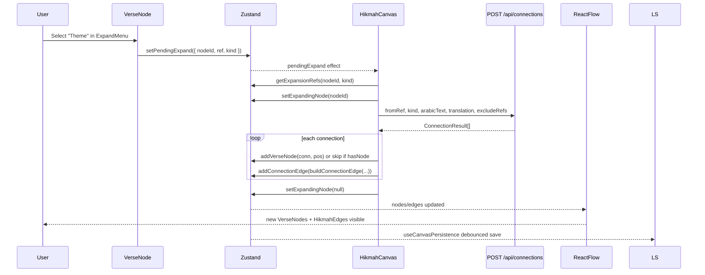

# Phase 8 — State and Canvas Model

> **Prerequisites:** Phases [1](./phase-1-what-is-openhikmah.md)–[7](./phase-7-grounded-ai-connections.md)  
> **Evidence tags:** **FACT** · **INFERENCE** · **UNKNOWN**

Phase 7 traced how AI connections are **generated and cached in Postgres**. Phase 8 answers: **what the user actually sees and manipulates on the infinite canvas** — and how that session state is stored, shared, and restored.

**Central sentence (memorize):**

> The canvas is a **session layout graph**; Postgres `connections` is the **product knowledge graph**. They overlap in meaning but not in storage.

---

## Three graphs (do not conflate)

| Graph | Where | What it stores | Survives refresh? |
| --- | --- | --- | --- |
| **Postgres `connections`** | Server DB | AI-generated edges: `(fromRef, toRef, kind, reason, locale)` | Yes — shared by all users |
| **Zustand canvas** | Browser memory | React Flow nodes/edges + UI chrome state | Until tab close unless autosaved |
| **`SavedCanvas` JSON** | localStorage / `shared_canvases` / `saved_workspaces` | Serialized layout + verse snapshots + edge reasons | Depends on channel |

**FACT:** Expanding a verse calls `POST /api/connections` (Phase 7), then **copies** the result into Zustand. The canvas does not read Postgres `connections` directly on render.

**INFERENCE:** Two users with the same source verse may see the same AI reasons (cache hit) but **different layouts** unless they share a canvas snapshot.

---

## Architecture: who owns what

```mermaid
flowchart TB
  subgraph zustand ["Zustand — useCanvasStore (store/canvas.ts)"]
    N[nodes: Node[]]
    E[edges: Edge[]]
    UI[pendingExpand, sidebarContent, viewport, ...]
    DERIV[duplicateNodeIdsByRef, expansionCountsByNode]
  end

  subgraph xyflow ["@xyflow/react — HikmahCanvas.tsx"]
    RF[ReactFlow controlled component]
    ONC[onNodesChange / onEdgesChange]
    RENDER[VerseNode + HikmahEdge rendering]
  end

  subgraph persist ["Persistence channels"]
    LS[(localStorage open-hikmah-canvas)]
    SHARE[(shared_canvases Postgres)]
    WS[(saved_workspaces Postgres)]
  end

  subgraph layout ["Layout — lib/canvas/canvas-layout.ts"]
    FFS[findFreeSlot]
    BCE[buildConnectionEdge]
    VC[viewportCenter]
  end

  N --> RF
  E --> RF
  RF --> ONC --> N
  ONC --> E
  serializeCanvas --> LS
  serializeCanvas --> SHARE
  serializeCanvas --> WS
  LS --> restoreCanvas
  SHARE --> restoreCanvas
  WS --> appendWorkspace
  FFS --> addVerseNode
  BCE --> addConnectionEdge
```

| Layer | Owns | Does NOT own |
| --- | --- | --- |
| **Zustand** | Source of truth for nodes, edges, selection, expansion queue, sidebar payload | LLM calls, Postgres graph, React Flow internal drag physics |
| **React Flow** | Pan/zoom rendering, node drag gestures, edge paths, minimap | Verse text, AI generation, persistence format |
| **`canvas-layout.ts`** | Collision-free placement, edge id construction | Store mutations (callers invoke store after computing position) |
| **`useCanvasPersistence`** | localStorage autosave, `?share=` restore, guest→workspace merge | Viewport persistence (not saved) |

---

## What is a node?

### Domain object

**FACT:** A canvas node represents one **placed instance** of a `Verse` (`types/quran.ts`):

```typescript
interface Verse {
  surah: number;
  ayah: number;
  ref: VerseRef;           // "2:255"
  arabicText: string;
  translation: string;
  surahName: string;
  surahNameArabic: string;
  isRoot?: boolean;        // first/search node styling
  isLoading?: boolean;
}
```

### React Flow wrapper

**FACT:** Stored as `@xyflow/react` `Node`:

| Field | Value |
| --- | --- |
| `id` | `node-${n}` — monotonic client counter (`nextId()` in `store/canvas.ts`) |
| `type` | `"verse"` → renders `VerseNode` |
| `position` | `{ x, y }` flow coordinates |
| `data` | Spread `Verse` fields |

### Node ID vs verse identity

| Concept | Key | Notes |
| --- | --- | --- |
| **Node ID** | `node-42` | Ephemeral per canvas session; remapped on `appendWorkspace` collision |
| **Verse identity** | `verse.ref` (`"2:255"`) | Canonical Quran reference; **same ref can appear on multiple nodes** |

**FACT:** `duplicateNodeIdsByRef` maps each `ref` → all node ids sharing it. `VerseNode` shows a duplicate indicator when another node has the same ref.

**FACT:** `hasNode(ref)` returns true if **any** node carries that ref — used to avoid stacking duplicates from URL/deep links, but expansion may **draw an edge** to an existing node instead of creating a second one.

---

## What is an edge?

### Domain object

**FACT:** `CanvasEdge` (`types/quran.ts`):

```typescript
interface CanvasEdge {
  id: string;
  source: string;   // source node id
  target: string;   // target node id
  type: "hikmah";
  data: { kind: EdgeKind; label: string; reason?: string };
}
```

| Field | Meaning |
| --- | --- |
| `kind` | `"thematic" \| "root" \| "contrast"` — drives color + expansion accounting |
| `label` | Truncated reason (≤60 chars) shown on the edge pill |
| `reason` | Full AI explanation — shown in `ContextSidebar` on edge click |

### Edge ID and deduplication

**FACT:** `buildConnectionEdge(sourceNodeId, targetNodeId, conn)` (`lib/canvas/canvas-layout.ts`):

```typescript
id: `edge-${sourceNodeId}-${targetNodeId}`
```

**FACT:** Edges are **directed** in storage (`source` → `target`) but `addConnectionEdge` treats `(A,B)` and `(B,A)` as duplicates:

| Result | Meaning |
| --- | --- |
| `"added"` | New edge inserted |
| `"duplicate-same-kind"` | Same pair + same kind already exists — silent skip |
| `"duplicate-different-kind"` | Same pair, different kind — UI notice in `runExpansion` |

**FACT:** `getExpansionRefs(nodeId, kind)` filters `e.source === nodeId && e.data.kind === kind` — only **outgoing** expansion edges count for “get more” exclude list (Phase 7).

---

## Zustand store field map

**Where:** `store/canvas.ts` → `useCanvasStore`

### Graph data

| Field | Purpose |
| --- | --- |
| `nodes`, `edges` | React Flow controlled state |
| `onNodesChange`, `onEdgesChange` | Apply drag/select/delete via `applyNodeChanges` / `applyEdgeChanges` |

### Derived indexes (recomputed on mutation)

| Field | Purpose |
| --- | --- |
| `duplicateNodeIdsByRef` | O(1) duplicate detection per ref |
| `expansionCountsByNode` | Outgoing edge counts by kind (badges on expand menu) |

### UI / async orchestration (not serialized)

| Field | Purpose |
| --- | --- |
| `selectedNodeId` | Current selection |
| `expandingNodeId` | Shows spinner on node during `runExpansion` |
| `openExpandNodeId` | Which node's expand menu is open |
| `sidebarContent` | `ContextSidebar` payload (node or edge detail) |
| `pendingExpand` | `{ nodeId, ref, kind }` — consumed by `HikmahCanvas` effect |
| `pendingAutoExpand` | First-node thematic expand after search |
| `pendingPanToNodeId` | Pan camera after search-add |
| `newlyAddedNodeId` | Pulse animation on fresh node |
| `viewport` | `{ x, y, zoom }` — updated on pan/zoom |
| `sidebarWidth` | Resizable sidebar |
| `fitRequestToken` | Cross-tree signal for `fitView()` (mobile bar) |
| `restoreToken` | Bumped on bulk restore — activity tracker distinguishes restore vs user add |

### Mutations you will touch as a contributor

| Action | Function | Typical caller |
| --- | --- | --- |
| Add one verse | `addVerseNode(verse, position?)` | Search, expansion, URL `?verse=` |
| Add full surah column | `addSurahNodes(verses[])` | URL `?surah=` |
| Add AI edge | `addConnectionEdge(edge)` | `runExpansion` |
| Wipe canvas | `reset()` | Toolbar clear (armed confirm) |
| Replace graph | `restoreCanvas(saved)` | Share link, localStorage |
| Merge graph | `appendWorkspace(saved)` | Load saved workspace |

---

## React Flow responsibilities

**Where:** `components/canvas/HikmahCanvas.tsx`

**FACT:** `HikmahCanvas` wraps `ReactFlowProvider` → `CanvasInner`.

| Registration | Component |
| --- | --- |
| `nodeTypes.verse` | `VerseNode` |
| `edgeTypes.hikmah` | `HikmahEdge` |

**FACT:** React Flow is **controlled**: `nodes={nodes}` and `edges={edges}` from Zustand; changes flow back through `onNodesChange` / `onEdgesChange`.

**FACT:** `HikmahCanvas` is dynamically imported with `ssr: false` in `CanvasPageClient.tsx` — canvas requires browser APIs and React Flow.

**FACT:** `onlyRenderVisibleElements` enabled for performance on large graphs.

### What React Flow does vs Zustand

| User gesture | React Flow | Zustand |
| --- | --- | --- |
| Drag node | Emits position change | `onNodesChange` updates `nodes` |
| Pan/zoom | Updates internal transform | `onMove` → `setViewport` |
| Click edge | `onEdgeClick` | `setSidebarContent({ type: "edge", ... })` |
| Click pane | `onPaneClick` | Closes expand menu |

**INFERENCE:** React Flow owns **ephemeral interaction physics**; Zustand owns **durable graph state** the app logic reads.

---

## Layout responsibility

**Where:** `lib/canvas/canvas-layout.ts`

| Helper | Used when |
| --- | --- |
| `findFreeSlot(existing, anchor)` | Spiral search for non-overlapping position (288×240 node + 48px gap) |
| `viewportCenter(viewport, w, h)` | Search-add anchors to visible center |
| `radialPos(source, i, total)` | Expansion fans children in an arc (`HikmahCanvas.tsx`) |
| `buildConnectionEdge(...)` | Constructs edge id + label truncation |

**FACT:** Expansion placement reads **live** source position each iteration — dragging mid-expansion moves the fan origin.

**FACT:** Edge label midpoints are treated as layout obstacles so new nodes do not cover AI reason pills.

---

## Serialization: `SavedCanvas`

**Where:** `store/canvas.ts` → `serializeCanvas` / `deserializeCanvas`

```typescript
interface SavedCanvas {
  v: 1;
  nodes: SavedNode[];  // { id, x, y, verse }
  edges: SavedEdge[];  // { id, source, target, kind, label, reason }
}
```

### What is included

| Included | Excluded |
| --- | --- |
| Node ids, positions, full `Verse` snapshots | `viewport` (pan/zoom) |
| Edge endpoints, kind, label, reason | UI state (sidebar, selection, pending queues) |
| Version `v: 1` | Postgres connection row ids |

**FACT:** Verse text in saved JSON is a **snapshot at save time** — if corpus translations update server-side, restored canvas still shows old text until nodes are re-fetched (no automatic re-hydration on restore).

**UNKNOWN:** Whether maintainers plan corpus re-sync on restore — not implemented today.

---

## Persistence channels

### 1 — localStorage (guest + signed-in)

**Where:** `hooks/useCanvasPersistence.ts`

| Detail | Value |
| --- | --- |
| Key | `open-hikmah-canvas` (`CANVAS_STORAGE_KEY`) |
| Trigger | Debounced 800ms after `nodes`/`edges` change |
| Flush | `pagehide` event — sync flush before navigate away |
| Clear | When `nodes.length === 0`, key removed |
| Auth | **Not required** |

**FACT:** `hydratedRef` gate prevents autosave from overwriting restored data during initial `?share=` fetch.

**FACT:** Mount order: `?share=<uuid>` fetch first → on failure fallback to localStorage → then enable autosave.

### 2 — Share URL (public, ephemeral)

**Flow:**

```text
CanvasToolbar.handleShare
  → serializeCanvas(nodes, edges)
  → POST /api/share  (max 512KB, validates nodes via isValidNode)
  → UUID stored in shared_canvases
  → URL: /canvas?share=<uuid>
Recipient:
  useCanvasPersistence mount
  → GET /api/share/[id]
  → restoreCanvas(saved)
  → strip ?share= from URL
```

**FACT:** Share TTL cleanup: 5% of POSTs delete rows older than 30 days (`app/api/share/route.ts`).

**FACT:** Auth **not required** to create or open a share link (rate-limited per IP).

### 3 — Saved workspaces (authenticated)

**Flow:**

```text
CanvasToolbar.handleSave (requires accessToken)
  → POST /api/workspace { name, data: SavedCanvas, nodeCount }
  → saved_workspaces row keyed by userId

Workspaces page load:
  → GET /api/workspace/[id]
  → appendWorkspace(saved)   // merge, not replace
  → router.push("/canvas")
```

**FACT:** `appendWorkspace` vs `restoreCanvas`:

| Function | Behavior |
| --- | --- |
| `restoreCanvas` | **Replace** entire canvas; reset UI queues; sync `nodeIdCounter` |
| `appendWorkspace` | **Merge** incoming graph; remap colliding ids; skip duplicate edge pairs; `findFreeSlot` for placement |

**FACT:** Guest merge on sign-in: `mergeGuestWorkspace(accessToken)` POSTs localStorage canvas once, sets `open-hikmah-guest-merged` flag (`useCanvasPersistence.ts`).

### 4 — Deep-link URL params (not full canvas state)

**Where:** `app/canvas/CanvasPageClient.tsx` → `VerseLoader`

| Param | Effect |
| --- | --- |
| `?verse=2:255` | Fetch verse API → `addVerseNode` → `setPendingAutoExpand` → clean URL |
| `?surah=2` | Fetch all ayahs → `addSurahNodes(missing)` → `requestFit` → clean URL |

**FACT:** These params add content to the **current** canvas (or skip if ref already present) — they do not encode layout.

---

## What survives refresh?

| Data | Survives browser refresh? | Mechanism |
| --- | --- | --- |
| Canvas nodes/edges | **Yes** (same browser) | localStorage autosave |
| Pan/zoom viewport | **No** | Not in `SavedCanvas`; React Flow refits on load |
| Share snapshot | **Yes** (30-day server TTL) | UUID in URL or pasted link |
| Saved workspace | **Yes** (until deleted) | Postgres + auth |
| Postgres `connections` | **Yes** (global) | Independent of canvas |
| Bookmarks | **Yes** | `store/auth.ts` persist + API sync |
| UI preferences (minimap) | **Yes** | `store/preferences.ts` → `open-hikmah-preferences` |

---

## What requires authentication?

| Feature | Guest | Signed in |
| --- | --- | --- |
| Build canvas locally | Yes | Yes |
| Expand (AI connections) | Yes* | Yes* |
| Share link | Yes | Yes |
| Save workspace | No — “Sign in to save” | Yes |
| List/load/delete workspaces | No | Yes |
| Guest canvas → cloud merge | N/A | Once on login |

\* Subject to rate limits on AI miss path — not auth-gated.

---

## Traced mutation: expand node → render

The canonical state mutation loop (connects Phase 7 to Phase 8):



### Step-by-step

| Step | Where | State change |
| --- | --- | --- |
| 1 | `VerseNode.handleExpandSelect` | `pendingExpand` set |
| 2 | `HikmahCanvas` effect | `pendingExpand` cleared; `runExpansion` starts |
| 3 | `runExpansion` | `expandingNodeId = nodeId`; `excludeRefs` from edges |
| 4 | Network | `ConnectionResult[]` returned |
| 5 | Per result | `radialPos` + `findFreeSlot` → `addVerseNode` **or** edge-only if ref exists |
| 6 | Per result | `buildConnectionEdge` → `addConnectionEdge` |
| 7 | Finally | `expandingNodeId = null`; `reactFlow.fitView` |
| 8 | Persistence | 800ms later → localStorage `serializeCanvas` |

**FACT:** `addVerseNode` also sets `newlyAddedNodeId` for pulse animation and recomputes `duplicateNodeIdsByRef`.

**FACT:** `addConnectionEdge` recomputes `expansionCountsByNode` — expand menu badges update immediately.

---

## Traced mutation: search → first node

| Step | Where | State change |
| --- | --- | --- |
| 1 | `SearchDialog.selectResult` | Fetch `/api/verse/...` |
| 2 | Position | `viewportCenter` + `findFreeSlot` if canvas non-empty |
| 3 | `addVerseNode({ ...verse, isRoot: isFirst }, position)` | New node at computed position |
| 4 | First node only | `setPendingAutoExpand(nodeId)` → thematic expand |
| 5 | Search on populated canvas | `setPendingPanToNode(nodeId)` |
| 6 | Persistence | Autosave after debounce |

---

## Sidebar and edge presentation

**FACT:** Clicking an edge → `setSidebarContent({ type: "edge", fromVerse, toVerse, reason, kind, label })` → `ContextSidebar` renders AI reason with **editorial styling** (not scripture styling — see Phase 3 / `DESIGN.md`).

**FACT:** `HikmahEdge` colors by kind: thematic / root / contrast CSS variables; label is truncated `reason`.

---

## Comparison: Firestore-minded engineer

| If you're thinking… | OpenHikmah canvas actually… |
| --- | --- |
| Document = verse | **Node instance** = verse + position; same ref can have multiple documents |
| Collection sync | **No realtime sync** — localStorage + optional manual save/share |
| Server authoritative layout | **Client authoritative** layout; server stores snapshots on share/save |
| Graph edges in DB | **Two layers** — Postgres `connections` (AI cache) vs canvas edges (session) |

---

## Key tests

| File | What it locks |
| --- | --- |
| `__tests__/store/canvas.test.ts` | serialize/deserialize, getExpansionRefs, appendWorkspace id remap, dedupe |
| `__tests__/lib/canvas/canvas-layout.test.ts` | findFreeSlot, buildConnectionEdge |
| `__tests__/hooks/useCanvasPersistence.test.ts` | Share restore, guest merge, hydration gate |
| `__tests__/components/canvas/HikmahCanvas.test.tsx` | Expansion loop, empty vs exhausted |
| `__tests__/app/canvas/CanvasPageClient.test.tsx` | `VerseLoader` URL params |

---

## Failure modes

| Symptom | Likely cause |
| --- | --- |
| Refresh loses canvas | localStorage blocked/quota; or cleared before hydration |
| Share opens empty | Invalid/expired UUID; falls back to localStorage |
| Load workspace stacks weirdly | `appendWorkspace` merges — expected; use clear first if you wanted replace |
| Duplicate nodes same ref | Allowed by design; indicator shown on node |
| Viewport jumps on reload | Viewport not persisted; `fitView` runs on first nodes |
| Save button missing | Not signed in — guest uses localStorage only |

---

## MUST UNDERSTAND NOW

1. **Canvas state lives in Zustand** — React Flow is a controlled view.
2. **Node id ≠ verse ref** — refs can repeat; ids are client-generated.
3. **`SavedCanvas` saves layout + snapshots** — not Postgres graph, not viewport, not UI queues.
4. **`restoreCanvas` replaces; `appendWorkspace` merges** — different semantics.
5. **Expansion writes to Zustand** after API returns — Phase 7 pipeline ends in `addVerseNode` / `addConnectionEdge`.
6. **localStorage works without auth** — workspaces and merge require sign-in.

---

## USEFUL LATER

- `lib/canvas/canvas-export.ts` — PNG/PDF export from toolbar (nodes only, not edges in PNG path).
- `hooks/useActivityTracker.ts` — streak/social signals; uses `restoreToken` to ignore bulk restores.
- `components/home/PersonalHome.tsx` — “continue where you left off” reads `CANVAS_STORAGE_KEY`.
- Edge retirement in Postgres admin — does not auto-remove canvas edges.

---

## IGNORE FOR NOW

- Audio graph playback order in toolbar (`playGraph`) — orthogonal to graph persistence.
- `CanvasTour` onboarding overlay — UX only.
- OG image generation for shares — social preview, not restore path.

---

## Phase 8 checkpoint questions

1. What three storage layers hold “graph-like” data, and how do they differ?
2. Why can the same `verse.ref` appear on two nodes, and what does `hasNode` check?
3. What fields are in `SavedCanvas`, and what is deliberately omitted?
4. What is the difference between `restoreCanvas` and `appendWorkspace`?
5. Trace `getExpansionRefs` — which edges count toward “get more”?

---

**Next:** [Phase 9 — Database and semantic search](./phase-9-database-and-semantic-search.md) — Postgres schema, Drizzle, pgvector, seeding, and integration tests at engineer depth.

Say **“continue to Phase 9”** when ready, or ask to zoom into any canvas/state topic.
