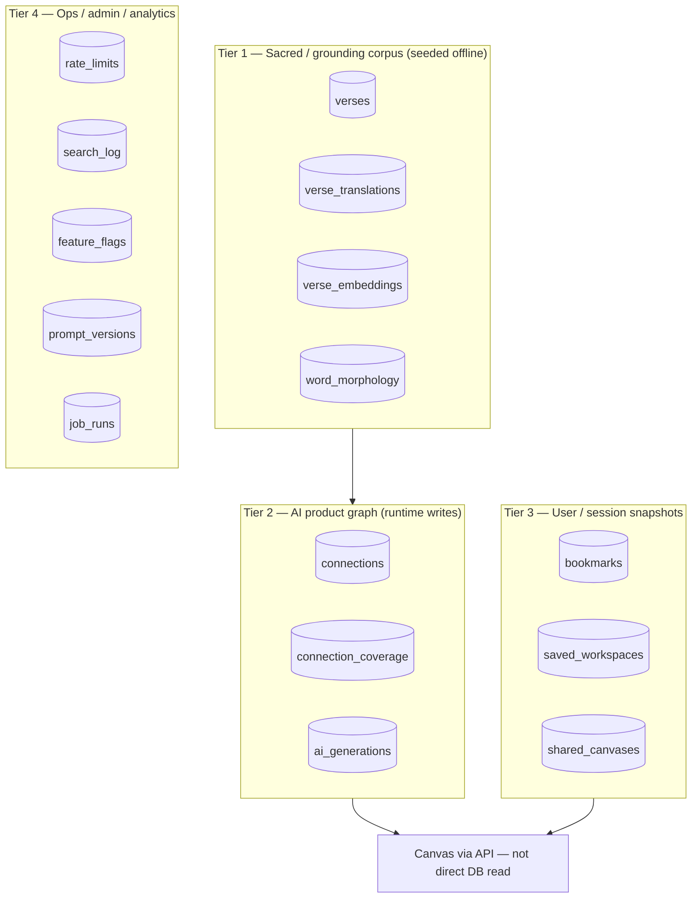
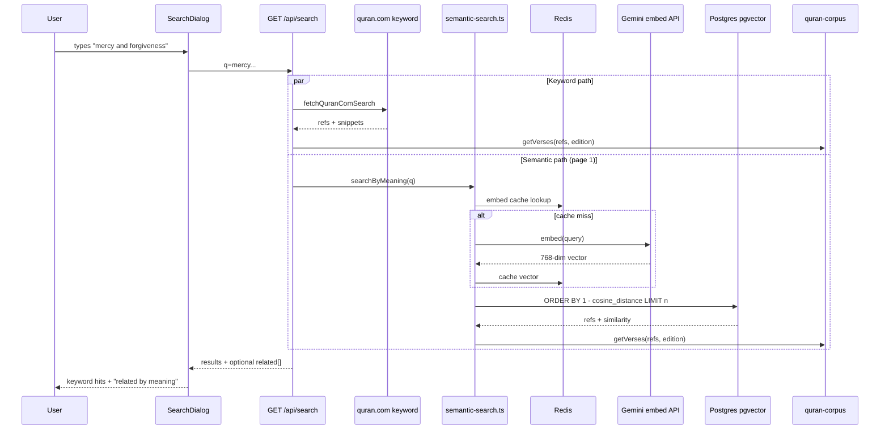

# Phase 9 — Database and Semantic Search

> **Prerequisites:** Phases [1](./phase-1-what-is-openhikmah.md)–[8](./phase-8-state-and-canvas.md)  
> **Evidence tags:** **FACT** · **INFERENCE** · **UNKNOWN**

Phase 8 covered **browser canvas state**. Phase 9 covers the **persistence and retrieval layer** underneath search, grounded discovery, and the AI connection graph — at engineer depth, not as a generic SQL tutorial.

**Central sentence (memorize):**

> Sacred Quran text and grounding vectors are **seeded once into Postgres**; runtime code **reads** them. Semantic ranking is **math on stored vectors**, not LLM memory.

---

## PostgreSQL in OpenHikmah

**FACT:** The app uses **PostgreSQL 16** with the **pgvector** extension (`docker-compose.yml` → `pgvector/pgvector:pg16`).

**FACT:** Connection via `DATABASE_URL` → `lib/infra/db.ts`:

```typescript
export const db = drizzle(client, { schema });
```

Drizzle wraps a `postgres` (postgres-js) client with `max: 10` connections.

### Table tiers (what matters for contributors)



| Tier | Examples | Who writes | Contributor risk |
| --- | --- | --- | --- |
| **1 — Corpus** | `verses`, `verse_embeddings`, `word_morphology` | Seed scripts / admin jobs | **High** — sacred data + grounding |
| **2 — Graph** | `connections`, `ai_generations` | `graph-service` on cache miss | **High** — theological AI output |
| **3 — User** | `bookmarks`, `saved_workspaces` | Auth API routes | Medium |
| **4 — Ops** | `rate_limits`, `search_log`, `feature_flags` | Infra / admin | Medium–low |

**MUST UNDERSTAND NOW:** Phases 7–8 already separated **Postgres `connections`** from **canvas edges**. Phase 9 adds: **`verse_embeddings` and `word_morphology` are the deterministic inputs** to Phase 7's `discoverCandidates`.

---

## Drizzle ORM — how this repo uses it

**FACT:** Single schema source: `lib/infra/db/schema.ts` (~660 lines, all `pgTable` definitions + exported `$inferSelect` types).

**FACT:** Drizzle Kit config (`drizzle.config.ts`):

```typescript
schema: "./lib/infra/db/schema.ts",
out: "./lib/infra/db/migrations",
dialect: "postgresql",
```

### Patterns you'll see

| Pattern | Example in this repo |
| --- | --- |
| Table definition | `export const verses = pgTable("verses", { ... })` |
| Indexes | `uniqueIndex`, `index`, partial indexes with `.where(sql`...`)` |
| pgvector column | `vector("embedding", { dimensions: 768 })` |
| HNSW index | `.using("hnsw", t.embedding.op("vector_cosine_ops"))` |
| Queries | `db.select().from(verseEmbeddings).where(...).orderBy(desc(similarity))` |
| Raw SQL when needed | `db.execute(sql`TRUNCATE ...`)` in integration tests |

**FACT:** Application code imports `db` from `@/lib/infra/db` and table objects from `@/lib/infra/db/schema`.

**INFERENCE:** Unlike Firestore's document model, OpenHikmah favors **relational tables + explicit indexes** for verse refs, graph cells, and vector ANN search.

---

## Migrations

**FACT:** SQL migrations live in `lib/infra/db/migrations/` (numbered `0000` … `0023`+).

| Command / script | Purpose |
| --- | --- |
| `node scripts/migrate.mjs` | Applies all Drizzle migrations via `drizzle-orm/postgres-js/migrator` |
| `scripts/ensure-tables.mjs` | Idempotent `CREATE TABLE IF NOT EXISTS` bootstrap — runs on container start **in addition to** migrations |
| `scripts/migrate-concurrent-indexes.mjs` | Non-transactional index swaps (e.g. connections locale index) |

**FACT:** Migration `0008_semantic_and_morphology.sql` enables pgvector and creates `verse_embeddings` + `word_morphology`:

```sql
CREATE EXTENSION IF NOT EXISTS vector;
CREATE TABLE verse_embeddings (ref text PRIMARY KEY, embedding vector(768) NOT NULL, ...);
CREATE INDEX verse_embeddings_hnsw_idx ON verse_embeddings USING hnsw (embedding vector_cosine_ops);
```

**FACT:** Integration tests spin up `pgvector/pgvector:pg16` via Testcontainers, run `migrate()`, then manually apply the concurrent index from migration 0020 (`__tests__/integration/global-setup.ts`).

**MUST UNDERSTAND NOW:** Schema changes require a **reversible migration** exercised by `bun run test:integration` (AGENTS.md). Do not hand-edit production DB without a migration file.

---

## The local Quran corpus (`verses`)

**FACT:** Primary key is canonical `"surah:ayah"` string (`ref`).

| Column | Source |
| --- | --- |
| `arabicText` | alquran.cloud `quran-uthmani` |
| `translation` | alquran.cloud `en.sahih` (Saheeh International) |
| `surah`, `ayah` | Denormalized integers for ordering |

**FACT:** Seeded by `scripts/seed-quran.mjs` — expects **6236** ayahs; upserts in batches.

**FACT:** `lib/quran/quran-corpus.ts` reads `verses` (+ optional `verse_translations` for other editions). This is the **validation hydration layer** for AI outputs and display.

**FACT:** Multi-language display uses `verse_translations` (migration `0018`) — seeded separately via `scripts/seed-translations.mjs`. Search/display can show a locale edition while embeddings stay English-keyed (below).

---

## Word morphology (`word_morphology`)

**FACT:** One row per **root-bearing word** per verse: `(ref, position, surface, root, lemma)`.

**FACT:** Seeded from committed `data/morphology/*.jsonl` via `scripts/seed-morphology.mjs`.

**FACT:** Indexes:

| Index | Purpose |
| --- | --- |
| `(ref, position)` unique | Upsert key |
| `(ref)` | Lookup words for a verse |
| `(root)` | Find verses sharing a root |

**FACT:** `discoverCandidates(..., "root")` (`lib/ai/connection-discovery.ts`):

1. Select distinct roots for source `ref`
2. Find other refs sharing those roots
3. Rank by `count(distinct root)` DESC
4. Respect `excludeRefs`

**FACT:** Verses with **no morphology rows** → empty candidate list → legacy AI path on first expand (Phase 7).

---

## Embeddings (`verse_embeddings`)

### Representation

| Property | Value |
| --- | --- |
| Dimensions | **768** (`EMBEDDING_DIMENSIONS` in `lib/ai/ai.ts`) |
| Model | `gemini-embedding-001` (override: `GEMINI_EMBEDDING_MODEL`) |
| Source text | **`verses.translation`** (English Saheeh) |
| Native model dims | 3072 — reduced via `outputDimensionality: 768` |
| Index | **HNSW** with `vector_cosine_ops` |

**FACT:** Embeddings are **always Gemini** — Anthropic has no embeddings API (`lib/ai/ai.ts` header). This is independent of `AI_PROVIDER` for connection text generation.

### Offline: seed the corpus

**Script:** `scripts/embed-corpus.mjs`

```text
SELECT verses missing embedding for current model
→ batchEmbedContents (Gemini REST, batch size 100)
→ INSERT ... ON CONFLICT (ref) DO UPDATE
→ idempotent / resumable on 429
```

**FACT:** Requires `DATABASE_URL` + `GEMINI_API_KEY`. Re-run safe — skips already-embedded refs for the current model.

### Online: embed user queries

**Where:** `lib/quran/semantic-search.ts` → `embedQueryCached`

| Step | Behavior |
| --- | --- |
| Normalize query | `toLowerCase()` |
| Redis cache | Key `emb:q:<sha256>`, TTL 7 days |
| Miss | `embed(query)` → same Gemini REST path as corpus |
| Redis disabled | Direct embed every time (`lib/infra/redis.ts` fallback) |

**FACT:** Only **user queries** hit live embed + Redis cache. Corpus vectors are **never** recomputed at request time.

**INFERENCE:** English-keyed embeddings + locale-specific `verse_translations` means a Turkish UI can show Turkish text for semantically ranked English-keyed neighbors — by design (`searchByMeaning` docstring).

---

## pgvector queries — how similarity works

**Where:** `lib/quran/semantic-search.ts` → `nearest()`

```typescript
const similarity = sql<number>`1 - (${cosineDistance(verseEmbeddings.embedding, queryVec)})`;
return db
  .select({ ref: verseEmbeddings.ref, similarity })
  .from(verseEmbeddings)
  .where(excludeRefs ? notInArray(...) : undefined)
  .orderBy(desc(similarity))
  .limit(limit);
```

| Concept | In this repo |
| --- | --- |
| Distance metric | **Cosine distance** via Drizzle's `cosineDistance` |
| Similarity score | `1 - cosineDistance` → higher = closer |
| ANN index | HNSW — approximate nearest neighbors at scale |
| Exclusions | `notInArray(verseEmbeddings.ref, excludeRefs)` |

### Firestore analogy (brief)

If Firestore excels at **exact field lookups** (`where ref == "2:255"`), pgvector solves a different problem: **"which of 6236 verses is closest in meaning to this vector?"** That is nearest-neighbor retrieval, not an indexed equality query.

---

## Semantic search API surface

Three exported functions — same `nearest()` core:

| Function | Input | Output | Used by |
| --- | --- | --- | --- |
| `searchByMeaning(query, limit, edition?)` | Free text | `SemanticMatch[]` | `GET /api/search` → `relatedByMeaning` |
| `similarVerses(ref, limit, excludeRefs?)` | Verse ref | `SemanticMatch[]` | `GET /api/verse/.../similar` |
| `semanticCandidates(ref, limit, excludeRefs?)` | Verse ref | `string[]` refs only | `discoverCandidates` thematic/contrast |

**FACT:** `similarVerses` loads the source embedding from DB; returns `[]` if none stored.

**FACT:** All three hydrate display text via `getVerses(refs, edition)` — ranking from vectors, **text from local corpus**.

### Search route: keyword vs semantic

**FACT:** `GET /api/search` runs **two parallel paths** on page 1:

| Path | Mechanism | Persistence |
| --- | --- | --- |
| **Keyword** | quran.com API (`fetchQuranComSearch`) → refs → `hydrate()` from local corpus | External index; display from Postgres |
| **Related by meaning** | `searchByMeaning` → pgvector | Embeddings in Postgres; query embed live |

**FACT:** Semantic "related" section is **best-effort** — failures return empty `related`, invisible to user (`relatedByMeaning` swallows errors).

**FACT:** Both paths rate-limited under `consume(`search:${clientKey}`)` budget.

**FACT:** `search_log` table records aggregate queries (mode `keyword` | `meaning`) when logging budget allows — no user attribution.

---

## What is persisted vs computed at runtime

| Data | Persisted? | Where computed |
| --- | --- | --- |
| Verse Arabic + default translation | **Yes** — seeded | `verses` |
| Alternate translations | **Yes** — seeded | `verse_translations` |
| Verse embedding vectors | **Yes** — seeded | `verse_embeddings` |
| Word roots | **Yes** — seeded | `word_morphology` |
| AI connection edges | **Yes** — on cache miss | `connections` |
| Query embedding | **Cached** (Redis) or ephemeral | Gemini API |
| Keyword search hits | **Not stored** | quran.com per request |
| Semantic rank order | **Computed** each query | pgvector `ORDER BY similarity` |
| Canvas layout | **Client** localStorage / share / workspace | Not in `connections` |

---

## Database initialization (local dev mental model)

Typical **first-time** setup order:

```text
1. Postgres running (docker-compose or local) with pgvector
2. node scripts/migrate.mjs          # apply Drizzle migrations
3. node scripts/seed-quran.mjs       # verses (~6236 rows)
4. node scripts/seed-morphology.mjs  # word_morphology (from data/morphology/)
5. node scripts/embed-corpus.mjs     # verse_embeddings (needs GEMINI_API_KEY)
6. Optional: seed-translations.mjs   # non-English editions
```

**FACT:** Without step 5, semantic search and thematic/contrast grounded discovery return empty — legacy AI fallback may still run (Phase 7).

**FACT:** Admin panel can trigger seed jobs via `lib/admin/job-runner.ts` → records outcome in `job_runs`.

**UNKNOWN:** Exact production seed state on openhikmah.com — assume fully seeded in prod; verify locally.

---

## Integration test strategy

**FACT:** `bun run test:integration` → Vitest with:

| Setting | Value |
| --- | --- |
| Config | `vitest.integration.config.ts` |
| Global setup | Testcontainers `pgvector/pgvector:pg16` |
| Pool | `fileParallelism: false` — one shared DB, serial files |
| Timeout | 30s test / 120s hook |

**FACT:** Tests **mock external APIs** (embed, Claude) but use **real Postgres + real pgvector**:

| File | Proves |
| --- | --- |
| `semantic-search.integration.test.ts` | Cosine ranking, excludeRefs, blank query short-circuit |
| `connection-discovery.integration.test.ts` | Root SQL ranking over real morphology rows |
| `graph.integration.test.ts` | Cache miss → persist → cache hit; rate limits |

**FACT:** Pre-push hook runs integration tests (AGENTS.md) — **Docker required** for `git push`.

**FACT:** Unit tests mock `db` entirely; integration tests are the evidence layer for SQL and pgvector behavior.

---

## Important indexes (contributor reference)

| Table | Index | Why |
| --- | --- | --- |
| `verses` | PK `ref` | O(1) verse lookup |
| `connections` | UNIQUE `(from_ref, to_ref, kind, locale)` | Idempotent AI persist |
| `connections` | `(from_ref, kind)` | Cache read for a cell |
| `verse_embeddings` | HNSW on `embedding` | Semantic ANN queries |
| `word_morphology` | `(root)` | Root discovery join |
| `bookmarks` | UNIQUE `(user_id, verse_ref)` | One bookmark per ref per user |

---

## End-to-end: semantic search request



---

## Slow narrative: one semantic rank

You type **"patience in hardship"** into search.

Keyword search asks quran.com's index for literal/token matches — that path never touches pgvector. In parallel, the server embeds your phrase: Redis is checked first; on miss, Gemini returns a 768-dimensional vector representing the English meaning of your query.

That vector is compared against **6236 pre-stored vectors** — one per verse, each built from the English Saheeh translation when `embed-corpus.mjs` ran. Postgres uses the HNSW index to find the closest refs without scanning every row.

The top matches come back as refs + similarity scores. The app then hydrates Arabic and translation text from the local `verses` / `verse_translations` tables — so display text is always corpus-consistent even though ranking was English-keyed.

If embeddings were never seeded, this entire branch returns nothing silently; keyword results still work.

---

## MUST UNDERSTAND NOW

1. **`schema.ts` is the table contract** — migrations + Drizzle queries derive from it.
2. **pgvector + HNSW + cosine distance** power all semantic ranking — not the LLM.
3. **Embeddings are always Gemini, always 768-dim, always from English translation text** for corpus rows.
4. **`discoverCandidates` reads `word_morphology` or `verse_embeddings`** — seed scripts matter for grounded connections.
5. **`connections` is written at AI cache miss** — separate from canvas and from keyword search.
6. **Integration tests with Testcontainers** are the repo's proof for SQL/pgvector — unit tests mock DB.

---

## USEFUL LATER

- `scripts/prewarm-graph.mjs` — offline graph warming (admin ops).
- `scripts/backfill-connections.ts` — batch connection generation.
- `lib/infra/rate-limit.ts` — Postgres-backed fixed-window counters (`rate_limits` table).
- `verse_translations` seeding for non-English UI without re-embedding.
- HNSW tuning parameters — not exposed in app code today; defaults from Postgres/pgvector.

---

## IGNORE FOR NOW

- Social/challenge/friendship tables — unrelated to search pipeline.
- `name_content` / divine names cache — separate AI cache pattern, same write-once idea.
- Redis internals when `REDIS_URL` unset — in-process fallback suffices for local dev.
- Exact quran.com API response schema — treat as external search index only.

---

## Phase 9 checkpoint questions

1. Why must corpus embeddings and query embeddings use the same model and dimensionality?
2. What table does `discoverCandidates("2:255", "root")` query, and what does an empty result imply?
3. How does `searchByMeaning` differ from keyword search in data source and persistence?
4. What proves pgvector ranking works in CI?
5. Name the three seed scripts that populate Tier 1 grounding tables (besides translations).

---

**Next:** [Phase 10 — Run the application locally](./phase-10-run-locally.md) — Bun setup, `.env.local`, which features need which keys, Docker, dev server.

Say **“continue to Phase 10”** when ready, or ask to zoom into any database/search topic.
