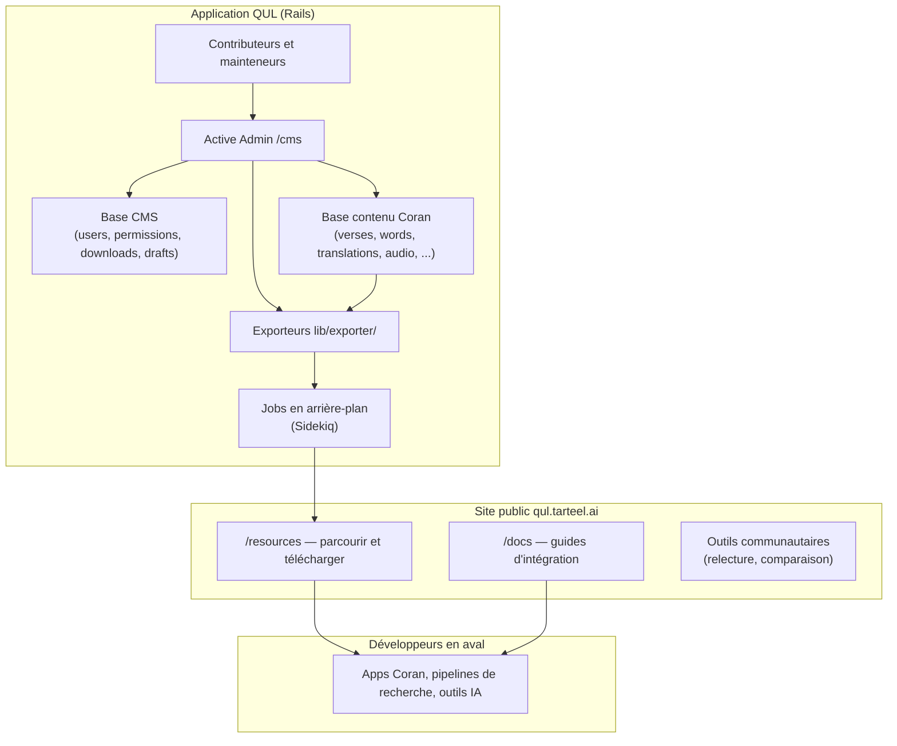

# Phase 1 — Qu'est-ce que QUL ?

> **Série d'onboarding :** tu apprends QUL étape par étape pour contribuer.  
> **Ce fichier :** Phase 1 seulement — qu'est-ce que QUL et comment sont organisées les données. Pas encore Rails.

---

## Avant d'ouvrir des fichiers Ruby

QUL n'est pas surtout une *app pour lire* le Coran. C'est un outil pour **créer, organiser, vérifier, versionner et partager** des données coraniques structurées.

Il y a deux couches. On les confond souvent :

| Couche | C'est quoi | Qui l'utilise |
|---|---|---|
| **QUL l'application** | Un CMS (outil pour gérer le contenu) Ruby on Rails + site public sur [qul.tarteel.ai](https://qul.tarteel.ai) | Mainteneurs, éditeurs, relecteurs, contributeurs avec accès CMS |
| **QUL les ressources** | Données à télécharger (JSON, SQLite, URLs audio, polices, etc.) | Développeurs d'apps, chercheurs — souvent **sans cloner le dépôt** |

**On sait :** La doc de démarrage dit que la plupart des utilisateurs n'ont **pas** besoin de cloner le dépôt. Ils téléchargent depuis `/resources`.  
**On sait :** Le README décrit QUL comme un « Content Management System complet pour gérer les données coraniques ».  
**On pense :** Tu peux contribuer en **code** (améliorer le site) ou en **données** (améliorer les données via le CMS). Les deux sont valides. Les risques sont différents.

---

## Ce que QUL fournit vraiment

### Modèle mental simple (vérifié)

> **QUL = CMS de ressources coraniques + système de vérification/version + export et partage.**

C'est exact. Voici les parties :

1. **CMS** — Les admins et contributeurs autorisés gèrent traductions, tafsirs, audio, morphologie, layouts mushaf, etc. via Active Admin sur `/cms`. **On sait :** `config/initializers/active_admin.rb` définit `config.default_namespace = :cms`. Les anciennes URLs `/admin` redirigent vers `/cms`.

2. **Vérification / versioning** — Les changements de contenu sont tracés (PaperTrail est utilisé sur des modèles comme `Verse` et `Word`). Il y a des workflows de relecture, des modèles draft, des flags d'approbation et des outils d'intégrité dans la zone admin. (On verra ça dans les phases suivantes.)

3. **Export / partage** — Le contenu est publié comme enregistrements `DownloadableResource` sur `/resources`. Souvent en fichiers JSON ou SQLite générés par les exporteurs dans `lib/exporter/`.

4. **Site web public** — Pas seulement des téléchargements. Le site a la documentation (`/docs`), des aperçus de ressources, des outils communautaires et des workflows pour contributeurs (relecture, comparaison, etc.).

### Ce que QUL **n'est pas** (pour la plupart des utilisateurs)

- **Pas un service API public principal.** **On sait :** `app/views/docs/markdown/api.md` dit qu'une API REST complète est « Coming soon » et recommande de télécharger les données. **Dans le code actuel :** Un namespace partiel `api/v1` existe déjà dans `config/routes.rb` (chapters, verses, translations, tafsirs, recitations, segments). Pour l'instant, les téléchargements sont le chemin stable.
- **Pas une app de lecture du Coran.** QUL produit des données. Les apps de lecture les utilisent. Tarteel (l'entreprise derrière QUL) fait d'autres produits.
- **Pas un seul gros fichier de données.** QUL gère **beaucoup de packages** — chaque traduction, chaque récitation, chaque variante de script est sa propre ressource avec ses métadonnées et ses fichiers d'export.

---

## Qui utilise QUL ?

### Consommateurs de ressources (développeurs en aval)

**On sait** (depuis `getting-started.md` et `datasets.md`) :

- Développeurs d'apps de lecture du Coran (arabe + traduction)
- Outils de recherche et découverte
- Outils d'étude du tafsir
- Apps d'apprentissage mot par mot (racine, lemme, POS)
- Pipelines NLP / IA avec données coraniques structurées

Ces utilisateurs font souvent :

1. Parcourir [qul.tarteel.ai/resources](https://qul.tarteel.ai/resources)
2. Télécharger du JSON (rapide) ou SQLite (pour beaucoup de requêtes)
3. Joindre les données via des identifiants partagés
4. Héberger les données chez eux

Ils n'ont **pas** besoin de Rails, PostgreSQL ou Redis.

### Contributeurs de contenu et mainteneurs

**On sait** (depuis `contribute-data.md`) :

- Relire et corriger traductions, tafsirs, translittérations
- Segmenter et vérifier l'audio de récitation
- Affiner la morphologie (racines, lemmes, POS)
- Tagger les ayahs par sujet, thème, similarité, mutashabihat

La plupart du travail sur les données se fait via le **CMS QUL**, avec relecture avant publication.

### Contributeurs code (toi, peut-être)

**On sait** (depuis `contribute-code.md`) :

- Améliorer l'app Rails, les exporteurs, les outils et le site
- Suivre le workflow fork → branche → PR
- Lancer l'app en local avec le jeu de données de développement

---

## Pourquoi ce projet existe

**On pense** (appuyé par le README, Tarteel et la portée du projet) :

L'écosystème coranique a beaucoup de traductions, tafsirs, récitations, variantes de script et annotations — mais tout est dispersé. Les formats sont incohérents. Il est difficile de joindre les sources de façon fiable. QUL centralise l'**organisation** et le **partage**. Les développeurs peuvent s'appuyer sur des données stables et joignables. Ils n'ont pas besoin de re-scraper les sources.

Le pari technique : **identifiants stables + provenance + pipelines d'export** comptent autant que le texte.

---

## Principales catégories de ressources

**On sait :** `DownloadableResource::RESOURCE_TYPES` dans `app/models/downloadable_resource.rb` définit ces catégories :

| Slug de catégorie | Ce que ça couvre |
|---|---|
| `quran-script` | Texte coranique arabe en plusieurs scripts (Uthmani, Indopak, QPC, etc.) |
| `translation` | Traductions au niveau ayah et mot |
| `tafsir` | Données de commentaire |
| `recitation` | Récitations audio et timing des segments |
| `morphology` | Grammaire au niveau mot : racines, lemmes, POS |
| `transliteration` | Représentations phonétiques / romanisées |
| `surah-info` | Métadonnées sur les sourates |
| `quran-metadata` | Navigation : juz, hizb, rub, manzil |
| `mushaf-layout` | Données de layout mushaf par page |
| `ayah-topics` | Tags par sujet pour les ayahs |
| `ayah-theme` | Regroupements thématiques |
| `similar-ayah` | Relations d'ayahs similaires |
| `mutashabihat` | Données mutashabihat (formulations similaires) |
| `font` | Polices orientées Coran |

**On sait :** `ResourceContent` (métadonnées CMS pour une ressource logique) a des sous-types en plus — media, contenu uloom, détails de racines, etc. Tout ce qui est dans le CMS ne devient pas un téléchargement public.

### Ressources au niveau ayah vs mot

**On sait :** Les scopes `ResourceContent` incluent `one_verse`, `one_word` et `one_chapter`. Cela dit comment une ressource s'attache à la hiérarchie :

- **Niveau ayah :** traductions, tafsirs, translittérations (ayah), sujets/thèmes, info sourate (niveau chapitre)
- **Niveau mot :** morphologie, traductions de mots, scripts de mots
- **Audio :** récitations avec audio par ayah ou gapless (niveau sourate) plus timings de segments

---

## QUL en tant qu'application vs QUL en tant que ressources



**En résumé :**

- Les éditeurs travaillent dans le CMS (`/cms`). Ils créent et corrigent le contenu dans la base Coran.
- La base CMS a l'état de l'app : utilisateurs, permissions, packaging des téléchargements, tags, etc.
- Les exporteurs lisent le contenu Coran et produisent des fichiers JSON/SQLite.
- Les pages `/resources` montrent les téléchargements aux développeurs qui n'utilisent pas Rails.
- Les outils communautaires sur le site public supportent la relecture et la comparaison audio. Ils écrivent dans le CMS.

On expliquera la séparation des deux bases dans la **Phase 5**. Pour l'instant : **l'application et le contenu sacré sont séparés.**

---

## Le modèle d'identité coranique

C'est le concept le plus important du dépôt. Presque toute ressource se joint via cette hiérarchie.

### Hiérarchie conceptuelle

```text
Quran
 └── Surah (114 chapters)
      └── Ayah (verses within a surah)
           └── Word (tokens within an ayah)
```

### Noms de modèles Rails vs noms courants

Les modèles Rails de QUL utilisent des noms différents de l'anglais courant :

| Terme courant | Modèle Rails | Champs clés |
|---|---|---|
| Surah | `Chapter` | `chapter_number` (1–114) |
| Ayah | `Verse` | `verse_number`, `chapter_id`, `verse_key` |
| Word | `Word` | `position`, `verse_id`, `location`, `word_index` |

**On sait :** `Chapter` a `chapter_number`. `Verse` appartient à `chapter` et a `verse_number`. `Word` appartient à `verse` et a `position` (position du mot dans l'ayah).

Ne sois pas surpris quand tu vois `chapter_id` dans la base — ça veut dire sourate.

### Les identifiants partagés

La documentation (`data-model.md`) dit aux développeurs de joindre sur :

| Identifiant | Signification | Exemple |
|---|---|---|
| `surah_id` / `surah` | Quelle sourate (1–114) | `2` (Al-Baqarah) |
| `ayah_number` / `ayah` | Numéro de verset dans la sourate | `255` |
| `word_position` / `word` / `position` | Index du mot dans l'ayah | `5` |

**On sait :** Le code d'export utilise plusieurs conventions. Par exemple, `lib/exporter/export_quran_word_script.rb` exporte :

```ruby
{
  surah: s,
  ayah: a,
  word: w,
  location: word.location,  # e.g. "2:255:5"
  text: word.send(text_attribute)
}
```

**On sait :** Le `verse_key` sur `Verse` est une chaîne comme `"2:255"` (sourate:ayah). **On sait :** Le `location` sur `Word` est une chaîne comme `"2:255:5"` (sourate:ayah:mot). Confirmé par `word.location.split(':')` dans le code.

### Identifiants séquentiels globaux

En plus des clés lisibles, QUL utilise des indices globaux :

| Champ | Modèle | Rôle |
|---|---|---|
| `verse_index` | `Verse` | Numéro d'ayah global dans tout le Coran (1–6236) |
| `word_index` | `Word` | Numéro de mot global ; **index unique** dans le schéma |
| `sequence_number` | `Word` | Également unique — autre identifiant global de mot |

**Utile plus tard :** Ces indices permettent une navigation séquentielle (`next_ayah`, `next_word`) et des exports compacts. Pour joindre les ressources, préfère `surah + ayah + position du mot` — c'est ce que la doc promet aux développeurs.

### Exemple : une ayah avec ressources attachées

Avec **Ayat al-Kursi** (Sourate 2, Ayah 255) :

```text
Surah 2 (Al-Baqarah)                    ← Chapter, chapter_number: 2
  └── Ayah 255                            ← Verse, verse_key: "2:255"
       ├── Arabic script (text_uthmani, text_indopak, text_qpc_hafs, ...)
       ├── Translation A (English)        ← joins on surah=2, ayah=255
       ├── Translation B (Urdu)           ← joins on surah=2, ayah=255
       ├── Tafsir (Ibn Kathir)             ← joins on surah=2, ayah=255
       ├── Transliteration                 ← joins on surah=2, ayah=255
       ├── Topic tags                      ← joins on surah=2, ayah=255
       └── Words
            ├── Word 1 (position: 1)       ← location: "2:255:1"
            │    └── morphology: root, lemma, POS
            ├── Word 2 (position: 2)       ← location: "2:255:2"
            │    └── morphology: root, lemma, POS
            └── ... (this ayah has many words)
```

**On sait :** Un seul enregistrement `Verse` stocke plusieurs scripts en colonnes séparées (`text_uthmani`, `text_indopak`, `text_qpc_hafs`, etc.). Ce sont des variantes, pas des ressources séparées. Les packages exportés choisissent quelle colonne exporter via `ResourceContent`.

### Comment les différentes ressources s'attachent

| Type de ressource | Niveau de jointure | Clés de jointure |
|---|---|---|
| Script Coran (ayah) | Ayah | `surah + ayah` |
| Traduction | Ayah | `surah + ayah` |
| Tafsir | Ayah (parfois plages) | `surah + ayah` |
| Translittération | Ayah ou mot | `surah + ayah` ou `surah + ayah + word` |
| Morphologie | Mot | `surah + ayah + word_position` |
| Traduction de mot | Mot | `surah + ayah + word_position` |
| Sujets / thèmes | Ayah | `surah + ayah` |
| Audio de récitation | Ayah ou sourate | `surah + ayah` (+ ID récitateur) |
| Segments audio | Ayah (timestamps) | `surah + ayah` (+ ID récitateur) |
| Layout mushaf | Mot (position page/ligne) | `surah + ayah + word` mappé à page/ligne |
| Info sourate | Sourate | `surah` uniquement |

**On pense :** Si tu te trompes de clés — attacher une traduction à l'ayah 256 au lieu de 255, ou la morphologie à la position 4 au lieu de 5 — l'erreur se propage silencieusement dans les exports. Chaque app en aval affichera des données erronées. C'est pourquoi la stabilité des identifiants est très importante.

---

## Pourquoi les identifiants stables sont fondamentaux

Trois propriétés font fonctionner le modèle de QUL :

### 1. Composabilité

Un développeur télécharge trois packages — script arabe, traduction anglaise, morphologie — et les joint via `surah + ayah (+ word)`. Aucune API centrale requise. **On sait :** C'est le chemin d'intégration principal documenté.

### 2. Attribution

Chaque package est lié à un `ResourceContent` avec auteur, langue, source, statut d'approbation et historique. Quand tu utilises « traduction Sahih International de QUL », les métadonnées d'export indiquent exactement quel jeu de données tu as. (La Phase 3 trace les champs de provenance.)

### 3. Intégrité à travers les modifications

Quand un éditeur corrige une traduction dans le CMS, l'identité de l'ayah (`verse_key: "2:255"`) ne change pas — seul le contenu change. Les exporteurs régénèrent les fichiers. Les consommateurs re-téléchargent. Les clés de jointure restent stables.

**Important maintenant :** Les identifiants sont le contrat entre QUL et chaque app en aval. Le code qui modifie l'assignation des identifiants est à haut risque. Le code qui modifie le contenu *à* un identifiant stable est un travail éditorial normal.

---

## Comment QUL diffère d'une app de lecture

| Préoccupation | App de lecture | QUL |
|---|---|---|
| Sortie principale | Expérience de lecture | Données structurées à télécharger |
| Utilisateur | Lecteur final | Développeur, chercheur ou éditeur |
| Propriété des données | Consomme les données | Crée, organise et publie les données |
| Texte arabe | Affiche un script | Gère de nombreuses variantes de script |
| Audio | Lit la récitation | Gère fichiers + timings de segments |
| Traductions | Affiche une à la fois | Gère de nombreuses traductions séparées |
| Mises à jour | Release d'app | Re-export et re-téléchargement |

**On pense :** Si tu as fait des apps Coran React/Firebase avant, tu étais probablement un **consommateur** de données comme celles que QUL produit. Contribuer à QUL = travailler sur l'**usine**, pas sur le **produit**.

---

## Note de documentation : source de vérité

**DOCUMENTATION POSSIBLEMENT OBSOLÈTE :**

`contributing.md` dit : *« Edit files in `docs/` first (source of truth). »*

**Dans le code actuel :** Il n'y a pas de dossier `docs/` à la racine. Les fichiers de documentation sont dans :

```text
app/views/docs/markdown/
```

Ils sont rendus sur le site à `/docs/:key`. Pour contribuer à la doc, édite les fichiers dans `app/views/docs/markdown/`, pas un dossier `docs/`.

---

## Classification pour cette phase

### Important maintenant

1. QUL est un **CMS + export/partage**, pas une app de lecture.
2. La plupart des consommateurs **téléchargent** les ressources. Ils n'exécutent pas Rails.
3. La hiérarchie **Surah → Ayah → Word** avec clés stables est le fondement de tout.
4. Rails utilise `Chapter` / `Verse` / `Word` — apprends la correspondance.
5. `verse_key` (`"2:255"`) et `location` (`"2:255:5"`) sont les identifiants chaîne dans le code.
6. Les noms de champs exportés varient (`surah_id`, `surah`, `ayah_number`, `ayah`) — normalise mentalement.
7. L'édition de contenu et l'édition de code sont des **chemins différents** avec des risques différents.

### Utile plus tard

- Endpoints partiels `api/v1` (chapters, translations, tafsirs, audio).
- `verse_index` et `word_index` globaux pour la navigation.
- Les 14 slugs `RESOURCE_TYPES` pour parcourir `/resources`.
- Outils communautaires (relecture, comparaison audio) sur le site public.
- Sous-types `ResourceContent` et cardinalité (`one_verse`, `one_word`, `one_chapter`).

### Pas besoin maintenant

- Détails de configuration Active Admin.
- Implémentations individuelles des exporteurs.
- Mécaniques de rendu des layouts mushaf.
- Algorithmes de segmentation audio.
- Structures de graphes de morphologie.
- Modèle de permissions (CanCanCan).
- Définitions de jobs Sidekiq.
- Répartition frontend Vue vs Stimulus vs jQuery.

---

## Incertitudes

| Élément | Statut |
|---|---|
| Calendrier d'une API REST publique complète | **On ne sait pas** — la doc dit « coming soon » ; API partielle dans le code |
| Workflow d'approbation par type de ressource | **On ne sait pas** — à tracer en Phase 3 et Phase 8 |
| Quelles ressources nécessitent login CMS vs outils publics | **On pense** — la plupart de l'édition est CMS ; certains outils de relecture sont publics avec auth |
| Conditions de licence par jeu de données | **On ne sait pas** — la FAQ dit de vérifier la licence ; à inspecter par ressource |

---

## Ce qu'on verra ensuite

**Phase 2 — Modèle de données coranique**

On approfondira les tables et les associations — toujours sur les *données*, pas Rails :

- Comment `Chapter`, `Verse` et `Word` se relient dans le schéma
- Ce que représente `ResourceContent` comme « ressource logique »
- Comment traductions, tafsirs et morphologie s'attachent aux versets et mots
- La différence entre colonnes sur `Verse`/`Word` et tables de ressources séparées

**Phase 3 — Données sacrées, provenance et intégrité**

Puis on verra le versioning (PaperTrail), les drafts, les approbations, et ce qui est éditable vs canonique.

---

## Résumé Phase 1 — cinq choses à retenir

1. **QUL = CMS + vérification + export.** Il construit et partage des données ; ce n'est pas une app de lecture.
2. **Deux audiences :** développeurs qui téléchargent, et contributeurs qui éditent via le CMS.
3. **Surah → Ayah → Word** avec identifiants stables (`verse_key`, `location`, `surah + ayah + word`) est le contrat de jointure.
4. **Les noms Rails diffèrent :** `Chapter` = Surah, `Verse` = Ayah. Les noms d'export varient aussi. Normalise mentalement.
5. **De mauvais identifiants se propagent silencieusement.** La stabilité des identifiants est la chose la plus risquée à casser.

---

*Version A2 — français simple. Généré pendant l'onboarding contributeur QUL.*
