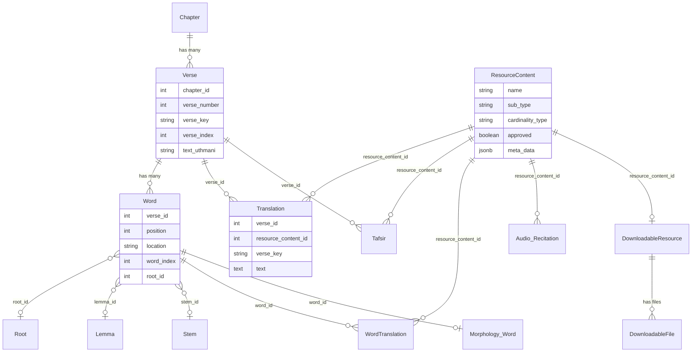

# Phase 2 — Le modèle de données coranique

> **Série d'onboarding :** tu apprends QUL étape par étape pour contribuer.  
> **Prérequis :** [Phase 1 — Qu'est-ce que QUL ?](phase-01-what-is-qul.md)  
> **Ce fichier :** les données — hiérarchie, identifiants et comment les ressources s'attachent. Pas encore Rails.

---

## Pourquoi commencer par les données

Avant que `belongs_to` et `has_many` aient du sens, tu dois savoir **ce qui est joint**.

Le problème central de QUL est :

> Beaucoup de packages indépendants (traductions, morphologie, audio, …) doivent tous pointer vers les **mêmes ayahs et mots** de façon fiable.

Tout le reste — formulaires CMS, exporteurs, jobs — existe pour créer, protéger et publier ces données joignables.

---

## La hiérarchie (conceptuelle)

```text
Quran
 └── Surah (114 chapters)
      └── Ayah (verses within a surah)
           └── Word (tokens within an ayah)
```

Ce n'est pas juste une taxonomie. C'est le **schéma d'adressage** que chaque jeu de données utilise.

---

## Noms Rails vs noms courants

Le code de QUL utilise des noms différents selon les couches. Apprends ce tableau tôt :

| Concept | Docs / export | Modèle Rails | Table | Champs clés |
|---|---|---|---|---|
| Surah | `surah`, `surah_id` | `Chapter` | `chapters` | `chapter_number` (1–114), `id` |
| Ayah | `ayah`, `ayah_number` | `Verse` | `verses` | `verse_number`, `chapter_id`, `verse_key` |
| Word | `word`, `word_position` | `Word` | `words` | `position`, `verse_id`, `location` |

**On sait :** `Chapter#name` est aliasé à `id` — donc `chapter.name` retourne le numéro de sourate, pas un nom d'affichage. Les noms d'affichage utilisent `name_simple`, `name_arabic`, etc.

**On sait :** `Verse#to_s` retourne `verse_key` (ex. `"2:255"`).

**On sait :** `Word#to_s` retourne `location` (ex. `"2:255:13"`).

---

## Aide-mémoire des identifiants

Il y a trois couches d'identifiants. Elles servent des objectifs différents.

### 1. Clés composites lisibles (préférées pour les jointures)

| Clé | Format | Exemple | Utilisé pour |
|---|---|---|---|
| `verse_key` | `surah:ayah` | `"2:255"` | Ressources au niveau ayah |
| `location` | `surah:ayah:word` | `"2:255:13"` | Ressources au niveau mot |

**On sait :** `Utils::Quran.get_ayah_key(surah, ayah)` retourne `"#{surah}:#{ayah}"`.

**On sait :** Le code d'export découpe `word.location` en `surah`, `ayah`, `word` (`lib/exporter/export_quran_word_script.rb`).

### 2. Clés étrangères (dans la base de données)

| Champ | Pointe vers | Exemple |
|---|---|---|
| `chapter_id` | `chapters.id` | Sourate 2 → `chapter_id: 2` |
| `verse_id` | `verses.id` | FK vers la ligne ayah |
| `word_id` | `words.id` | FK vers la ligne mot |
| `verse_number` | ayah dans la sourate | `255` (avec `chapter_id: 2`) |
| `position` | mot dans l'ayah | `13` (avec `verse_id`) |

**On sait :** La plupart des tables (`translations`, `tafsirs`, `word_translations`) stockent **à la fois** des FK (`verse_id`, `chapter_id`) **et** des clés dénormalisées (`verse_key`, `verse_number`) pour des requêtes et exports efficaces.

### 3. Indices séquentiels globaux (navigation et exports compacts)

| Champ | Modèle | Plage | Rôle |
|---|---|---|---|
| `verse_index` | `Verse` | 1–6236 | Séquence d'ayah globale |
| `word_index` | `Word` | 1–~77k | Séquence de mots globale ; **index unique** |
| `sequence_number` | `Word` | — | ID global de mot aussi unique |

**On sait :** `Verse#next_ayah` navigue via `verse_index + 1`, pas `id + 1`.

**Utile plus tard :** Du code mushaf/layout stocke des `verse_index` dans des colonnes nommées `first_verse_id` / `last_verse_id` sur `MushafPage`. **On pense :** C'est un nom trompeur — ces champs se comportent comme `verse_index`, pas `verses.id`. Quand tu vois `*_verse_id` dans le code layout, vérifie quel espace d'ID est visé.

### Variantes de noms d'export

La documentation (`data-model.md`) dit aux développeurs :

```text
surah_id + ayah_number           → ayah-level joins
surah_id + ayah_number + word_position → word-level joins
```

Les exports utilisent des noms variés :

| Nom docs | Également vu comme |
|---|---|
| `surah_id` | `surah`, `chapter_id`, `chapter_number` |
| `ayah_number` | `ayah`, `verse_number` |
| `word_position` | `word`, `position` |

**Important maintenant :** Normalise ces variantes mentalement. Elles parlent de la même hiérarchie.

---

## Exemple : Ayat al-Kursi (2:255)

```text
Chapter (Surah 2 — Al-Baqarah)
  chapter_number: 2
  id: 2
  │
  └── Verse (Ayah 255)
        verse_key: "2:255"
        verse_number: 255
        chapter_id: 2
        verse_index: 262  (global position in Quran — illustrative; verify against dump)
        │
        ├── text_uthmani: "اللَّهُ لَا إِلَٰهَ إِلَّا هُوَ ..."
        ├── text_qpc_hafs: (another script column)
        ├── text_indopak: (another script column)
        │     ... many script columns on one row
        │
        ├── Translation (resource_content_id: 131, e.g. Sahih International)
        │     verse_key: "2:255"
        │     text: "Allah - there is no deity except Him..."
        │
        ├── Tafsir (resource_content_id: X)
        │     verse_key: "2:255"
        │     start_verse_id..end_verse_id (may span multiple ayahs)
        │
        └── Words
              ├── Word position 1
              │     location: "2:255:1"
              │     text_uthmani: "اللَّهُ"
              │     root_id → Root
              │     lemma_id → Lemma
              │     └── Morphology::Word (grammar analysis)
              │
              ├── Word position 2
              │     location: "2:255:2"
              │     ...
              └── ... (this ayah has many words; not all positions are "words")
```

**On sait :** Une seule ligne `Verse` contient **plusieurs scripts arabes** en colonnes séparées (`text_uthmani`, `text_indopak`, `text_qpc_hafs`, `text_imlaei`, …). Ce sont des variantes sur l'ayah canonique, pas des identités séparées.

**On sait :** Une seule ligne `Word` contient aussi plusieurs colonnes de script. Quelle colonne un export utilise dépend des métadonnées `ResourceContent` (`text_type`).

---

## L'épine dorsale : Chapter → Verse → Word

### Chapter (table `chapters`, modèle `Chapter`)

**On sait** — champs clés :

| Champ | Signification |
|---|---|
| `chapter_number` | Numéro de sourate 1–114 |
| `name_simple` | Nom anglais (« Al-Baqarah ») |
| `name_arabic` | Nom arabe |
| `revelation_place` | `"makkah"` ou `"madinah"` |
| `verses_count` | Nombre d'ayahs dans cette sourate |

**Associations :** `has_many :verses`, `has_many :chapter_infos`

### Verse (table `verses`, modèle `Verse`)

**On sait** — champs clés :

| Champ | Signification |
|---|---|
| `chapter_id` | Sourate parente |
| `verse_number` | Numéro d'ayah dans la sourate |
| `verse_key` | Chaîne `"surah:ayah"` |
| `verse_index` | Index d'ayah global (1–6236) |
| `words_count` | Nombre de tokens mot dans cette ayah |
| `juz_number`, `hizb_number`, `page_number`, … | Métadonnées structurelles |
| Colonnes `text_*` | Texte arabe en divers scripts |

**Associations (sélection) :**

```ruby
belongs_to :chapter
has_many :words
has_many :translations
has_many :tafsirs
has_many :morphology_words, class_name: 'Morphology::Word'
has_many :actual_words, -> { where char_type_id: 1 }, class_name: 'Word'
```

**On sait :** `actual_words` filtre sur `char_type_id: 1` — toutes les lignes dans `words` ne sont pas des « mots » linguistiques. Certaines positions sont des marqueurs (waqf, sajdah, etc.). Le scope `Word.words` applique le même filtre.

### Word (table `words`, modèle `Word`)

**On sait** — champs clés :

| Champ | Signification |
|---|---|
| `verse_id` | Ayah parente |
| `chapter_id` | Référence sourate dénormalisée |
| `position` | Position du mot dans l'ayah (base 1) |
| `location` | Chaîne `"surah:ayah:position"` |
| `word_index` | Index de mot global |
| `char_type_id` | Mot vs marqueur vs autres types |
| `root_id`, `lemma_id`, `stem_id` | Références linguistiques |
| Colonnes `text_*` | Texte arabe en divers scripts |

**Associations (sélection) :**

```ruby
belongs_to :verse
belongs_to :root, :lemma, :stem  # optional
has_many :word_translations
has_one :morphology_word, class_name: 'Morphology::Word'
has_many :mushaf_words
```

**On pense :** `root_id`/`lemma_id`/`stem_id` sur `Word` sont des liens linguistiques rapides. L'analyse morphologique plus profonde est dans `Morphology::Word` et les tables associées.

---

## ResourceContent : le « package logique »

C'est le deuxième modèle le plus important après la hiérarchie.

Une **ressource** dans QUL n'est pas une seule ligne. C'est un **package logique** identifié par `ResourceContent` :

```text
ResourceContent (id: 131, name: "Sahih International", sub_type: "translation")
  ├── metadata: author, language, data_source, approved, cardinality_type
  ├── many Translation rows (one per ayah), each with resource_content_id: 131
  ├── FootNote rows (attached to translations)
  ├── ChangeLog entries (CMS DB — see Phase 5)
  └── DownloadableResource (public listing) + DownloadableFiles (exported JSON/SQLite)
```

**On sait :** `ResourceContent` vit dans la base contenu Coran (`QuranApiRecord`).

**On sait :** Champs de métadonnées clés :

| Champ | Rôle |
|---|---|
| `name` | Nom d'affichage (« Sahih International ») |
| `sub_type` | Type : `translation`, `tafsir`, `recitation`, `morphology`, `quran-script`, … |
| `cardinality_type` | Granularité : `1_ayah`, `1_word`, `1_chapter`, `quran`, … |
| `language_id` | Langue de la ressource |
| `author_id` | Attribution traducteur/érudit |
| `data_source_id` | Origine des données |
| `approved` | Si la ressource est approuvée |
| `meta_data` (jsonb) | Config flexible : `text-type`, `has-footnote`, `has-segments`, clés source, etc. |

**On sait :** `ResourceContent` définit des constantes de cardinalité :

```ruby
CardinalityType::OneVerse  = '1_ayah'    # one row per ayah
CardinalityType::OneWord   = '1_word'     # one row per word
CardinalityType::OneChapter = '1_chapter' # one row per surah
CardinalityType::Quran     = 'quran'      # whole-quran resource
```

**On sait :** `ResourceContent` définit des sous-types : `translation`, `tafsir`, `transliteration`, `recitation`, `morphology`, `quran-script`, `layout`, `topic`, `theme`, `mutashabihat`, `font`, `meta`.

### La concern Resourceable

La plupart des lignes de contenu incluent `Resourceable` :

```ruby
belongs_to :resource_content, optional: true
```

Donc une `Translation`, `Tafsir`, `WordTranslation`, `Audio::Recitation`, etc. pointent vers leur package parent via `resource_content_id`.

**Important maintenant :** Quand tu vois 6 236 lignes `Translation`, ce ne sont pas 6 236 « ressources » séparées. Ce sont des lignes d'**un seul** `ResourceContent` (une édition de traduction).

---

## Comment chaque type de ressource s'attache

### Ressources au niveau ayah

#### Traductions (table `translations`)

**On sait :**

```ruby
class Translation < QuranApiRecord
  belongs_to :verse, optional: true
  belongs_to :resource_content  # which translation edition
  has_many :foot_notes
  # verse_key, chapter_id, verse_number denormalized on each row
end
```

| Jointure | Clés |
|---|---|
| Vers ayah | `verse_id` OU `verse_key` OU `chapter_id + verse_number` |
| Vers package | `resource_content_id` |

Un `ResourceContent` → ~6 236 lignes `Translation` (une par ayah).

#### Tafsirs (table `tafsirs`)

**On sait :** Similaire aux traductions, mais peut couvrir des **plages d'ayahs** :

| Champ | Rôle |
|---|---|
| `verse_id` | Ayah principale |
| `start_verse_id`, `end_verse_id` | Plage couverte |
| `group_verse_key_from`, `group_verse_key_to` | Plage lisible |
| `group_tafsir_id` | Lie les entrées groupées |

**On sait :** `Tafsir.for_verse(verse, resource)` trouve le tafsir où `verse.id` est entre `start_verse_id` et `end_verse_id`.

**On pense :** La jointure tafsir est plus complexe que la traduction — on ne peut pas supposer un mapping 1:1 strict.

#### Translittérations (table `transliterations`)

**On sait :**

```ruby
belongs_to :resource, polymorphic: true  # can attach to Verse or Word
belongs_to :resource_content
```

Polymorphe — peut être au niveau ayah ou mot.

#### Translittérations arabes (table `arabic_transliterations`)

**On sait :** Modèle séparé de `Transliteration`. S'attache à `verse` et `word`. Utilisé pour les overlays visuels style indopak.

#### Packages script Coran (`quran_script_by_verses`, `quran_script_by_words`)

**On sait :** Les exports de script peuvent être par ayah (`QuranScript::ByVerse`) ou par mot (`QuranScript::ByWord`). Chaque ligne a un `resource_content_id` et choisit quelle colonne `text_*` exporter.

#### Sujets et thèmes

| Modèle | Niveau | Mécanisme |
|---|---|---|
| `VerseTopic` | Ayah | `verse_id` + `topic_id` |
| `AyahTheme` | Plage d'ayahs | `verse_id_from..verse_id_to` |

#### Info chapitre (table `chapter_infos`)

**On sait :** Jointure au niveau sourate : `chapter_id` + `resource_content_id` + `language_id`.

#### Audio (`audio_recitations`, `audio_files`, `audio_segments`)

```text
Audio::Recitation (one reciter's package, resource_content_id)
  └── Audio::ChapterAudioFile (one surah's audio file)
        └── Audio::Segment (per-ayah timing data)
              verse_id, verse_key, timestamp_from, timestamp_to, segments (jsonb)
```

**On sait :** `Audio::Segment` stocke `verse_key`, `verse_id` et des timestamps en millisecondes. Le JSON de segments mappe les positions de mots aux timings.

### Ressources au niveau mot

#### Traductions de mots (table `word_translations`)

**On sait :**

```ruby
belongs_to :word
belongs_to :resource_content
# text = translated gloss for this word
# group_word_id, group_text = multi-word phrase translations
```

Jointure : `word_id` (→ `word.location` → `surah:ayah:position`).

**On sait :** Supporte les **traductions groupées** où une glose couvre plusieurs mots (`word_range_from..word_range_to`).

#### Morphologie (`morphology_words` et tables associées)

```text
Word (canonical Arabic token)
  ├── root_id → Root (مادة)
  ├── lemma_id → Lemma (مدخل)
  ├── stem_id → Stem
  └── Morphology::Word (deeper grammatical analysis)
        ├── grammar_pattern
        ├── word_segments (morphological segments)
        ├── word_tokens
        ├── derived_words
        └── grammar_concepts (through word_grammar_concepts)
```

**On sait :** `Morphology::Word` lie `word_id` et `verse_id`, et porte `location` (dénormalisé).

**On sait :** Tables de dictionnaire linguistique :

| Modèle | Table | Rôle |
|---|---|---|
| `Root` | `roots` | Racine trilitère (`text_uthmani`, `value`) |
| `Lemma` | `lemmas` | Forme d'entrée de dictionnaire |
| `Stem` | `stems` | Forme de racine |
| `Token` | `tokens` | Tokenisation supplémentaire |

Ce sont des **données de référence partagées** — beaucoup de mots pointent vers la même racine/lemme.

#### Layout mushaf (`mushafs`, `mushaf_pages`, `mushaf_words`)

**On sait :** C'est là que le **contenu rencontre le layout** :

| Modèle | Rôle |
|---|---|
| `Mushaf` | Une édition de layout (ex. Madani 15 lignes) |
| `MushafPage` | Une page : quels versets/mots apparaissent |
| `MushafWord` | Position d'un mot sur une page : `page_number`, `line_number`, `position_in_line`, `text` |

**On sait :** `MushafWord` appartient à `word` (contenu canonique) et `mushaf` (édition de layout). Le même `Word` peut apparaître dans plusieurs layouts avec des positions différentes.

**Utile plus tard :** Le mushaf est séparé de la hiérarchie centrale. La Phase 13 ira plus loin. Pour l'instant : le **contenu** est sur `Word` ; le **layout** est sur `MushafWord`.

---

## Contenu sur l'épine dorsale vs tables séparées

Cette distinction aide à comprendre ce qui est « le Coran » vs ce qui est « une ressource attachée ».

### Contenu SUR l'épine dorsale (colonnes sur Verse/Word)

| Emplacement | Quoi |
|---|---|
| `verses.text_*` | Texte arabe ayah en plusieurs scripts |
| `words.text_*` | Texte arabe mot en plusieurs scripts |
| `words.root_id`, `lemma_id`, `stem_id` | Liens linguistiques centraux |

**On pense :** Ce sont les données les plus sensibles. Les modifier affecte toute ressource qui référence cette ayah ou ce mot.

### Contenu ATTACHÉ via tables de ressources

| Table | Attaché à | Scopé par |
|---|---|---|
| `translations` | ayah | `resource_content_id` |
| `tafsirs` | ayah (ou plage) | `resource_content_id` |
| `word_translations` | mot | `resource_content_id` |
| `morphology_words` | mot | `resource_content_id` optionnel |
| `transliterations` | ayah ou mot (polymorphe) | `resource_content_id` |
| `audio_segments` | ayah | `audio_recitation_id` |

**Important maintenant :** L'épine dorsale (`Chapter` → `Verse` → `Word`) est relativement stable. Les tables de ressources se multiplient — beaucoup de traductions, récitations, analyses morphologiques, toutes accrochées aux mêmes adresses.

---

## Chaîne de publication : de la ligne au téléchargement

```text
Content rows (Translation, etc.)
  └── ResourceContent (logical package, metadata, approval)
        └── DownloadableResource (public catalog entry, published: true)
              └── DownloadableFile (actual JSON/SQLite file attachment)
```

**On sait :**

- `DownloadableResource` est dans la **base CMS** (`ApplicationRecord`).
- Il référence `resource_content_id` qui pointe dans la **base Coran**.
- `DownloadableFile` a une pièce jointe Active Storage (`file`) avec le fichier exporté.

**On pense :** La publication a deux étapes : le contenu doit exister dans la base Coran **et** un `DownloadableResource` doit être `published: true` avec des fichiers générés.

(On verra ce workflow en Phases 8–11.)

---

## Données draft et relecture (base CMS)

Toutes les modifications ne vont pas directement aux tables de contenu. La base CMS contient l'état draft/relecture :

| Table CMS | Rôle |
|---|---|
| `draft_translations` | Modifications de traduction suggérées |
| `draft_tafsirs` | Modifications de tafsir suggérées |
| `draft_word_translations` | Modifications de traduction de mot suggérées |
| `draft_contents` | Contenu draft générique |
| `draft_foot_notes` | Modifications de notes de bas de page draft |

**On sait :** `Translation#save_suggestions` crée un `Draft::Translation` avec `need_review: true` au lieu d'écraser le texte publié.

**On pense :** Le pattern est : **suggérer → relire → approuver → écrire dans la base Coran**. Cela protège les données publiées.

(La Phase 3 trace provenance et versioning en détail.)

---

## Frontière inter-bases (aperçu)

**On sait :** La plupart des modèles de contenu Coran héritent de `QuranApiRecord` → connexion à `quran_dev` / `quran_api_db`.

**On sait :** Les modèles CMS (`User`, `DownloadableResource`, `Draft::Translation`, `Morphology::Phrase`, …) héritent de `ApplicationRecord` → connexion à `quran_community_tarteel`.

**On sait :** `db/schema.rb` ne contient que le schéma de la **base CMS**. Les tables Coran ne sont **pas** dans ce fichier — elles viennent du dump SQL (`mini_quran_dev.sql`).

**On sait :** Certains modèles CMS stockent des références entières vers des lignes Coran (ex. `Morphology::Phrase#source_verse_id`, tables draft avec `verse_id`). Ce sont des **clés étrangères logiques** — Rails ne peut pas imposer des associations inter-bases.

**Important maintenant :** Tu verras `verse_id` sur des tables dans les deux bases. Elles parlent de la même ayah, mais seul `Verse` dans la base Coran est la ligne autoritaire.

(La Phase 5 couvre cette architecture.)

---

## Diagramme entité-relation



---

## Pièges de nommage

| Piège | Réalité |
|---|---|
| `chapter_id` signifie sourate | Oui, toujours |
| `verse_id` signifie toujours `verses.id` | Généralement, mais certains champs layout nommés `*_verse_id` stockent `verse_index` |
| `resource_content_id` vs `resource_id` | `resource_content_id` est le package ; `resource_id` sur `ResourceContent` est un lien polymorphe (ex. un Mushaf) |
| `Word` signifie mot linguistique | Pas toujours — vérifie `char_type_id`. Utilise le scope `Word.words` ou `actual_words` |
| `db/schema.rb` est le schéma complet | Base CMS uniquement. Les tables Coran viennent du dump SQL |
| L'export utilise `surah_id` | Le code peut utiliser `surah`, `chapter_id` ou `chapter_number` — même concept |

---

## Classification pour cette phase

### Important maintenant

1. **Chapter → Verse → Word** est l'épine dorsale. Tout s'y attache.
2. **`verse_key`** (`"2:255"`) et **`location`** (`"2:255:13"`) sont les adresses lisibles.
3. **`ResourceContent`** est le package logique — une édition de traduction, une récitation, etc.
4. Les lignes de contenu sont scopées par **`resource_content_id`**.
5. Les scripts arabes sont des **colonnes** sur `Verse`/`Word`, pas des identités séparées.
6. L'attachement ayah vs mot dépend de `cardinality_type` et du modèle.
7. `db/schema.rb` ≠ base complète. Le contenu Coran est dans une base séparée chargée depuis le dump.

### Utile plus tard

- Regroupement tafsir par plage (`start_verse_id..end_verse_id`)
- Regroupement traduction de mots (`group_word_id`, `group_text`)
- Tables de grammaire `Morphology::Word` (segments, tokens, mots dérivés)
- Famille mushaf (`Mushaf` → `MushafPage` → `MushafWord`)
- Filtrage `char_type_id` pour mots réels vs marqueurs
- Navigation globale `verse_index` / `word_index`
- Tables draft dans la base CMS pour relecture

### Pas besoin maintenant

- Tables individuelles de concepts grammaticaux morphologiques
- `Morphology::Phrase` / correspondance mutashabihat (vit dans la base CMS)
- Variantes récitation gapless vs ayah par ayah
- Modèles de staging d'import `RawData::*`
- Détails des tables de métadonnées de navigation (juz, hizb, ruku, manzil)
- Encodage police/glyphe (`code_v1`, `code_v2`)

---

## Incertitudes

| Élément | Statut |
|---|---|
| Si `verses.id` égale toujours `verse_index` en production | **On ne sait pas** — le code utilise les deux ; vérifier en Phase 17 |
| Valeurs exactes de `char_type_id` pour mot vs marqueur | **On ne sait pas** — interroger `char_types` localement |
| Quelles analyses morphologiques sont scopées ressource vs globales | **Partiellement connu** — `Morphology::Word` a un `resource_content_id` optionnel ; racines/lemmes semblent partagés |
| Liste complète des clés `meta_data` par type | **On ne sait pas** — inspecter les enregistrements par sub_type |

---

## Ce qu'on verra ensuite

**Phase 3 — Données sacrées, provenance et intégrité**

Maintenant que tu sais *ce que* sont les données, on trace :

- Quels champs sont l'identité canonique (immuable) vs le contenu éditable
- Flags `approved`, workflows draft, versioning PaperTrail
- `Author`, `DataSource`, `ChangeLog`, métadonnées de provenance
- Quelles vérifications protègent contre la corruption
- Comment une mauvaise modification se propage aux exports

---

## Résumé Phase 2 — cinq choses à retenir

1. **Chapter → Verse → Word** est l'épine dorsale. `verse_key` et `location` sont les adresses.
2. **`ResourceContent`** enveloppe un package logique — une édition de traduction, une récitation, etc.
3. Les lignes de contenu s'attachent via `verse_id` ou `word_id`, scopées par `resource_content_id`.
4. Les scripts arabes sont des **colonnes** sur l'épine dorsale, pas des identités séparées. Les tables de ressources pendent vers l'extérieur.
5. Deux bases existent — contenu Coran vs CMS. `db/schema.rb` ne montre que le CMS. Drafts et téléchargements sont dans le CMS ; versets et traductions dans la base Coran.

---

*Version A2 — français simple. Généré pendant l'onboarding contributeur QUL.*
