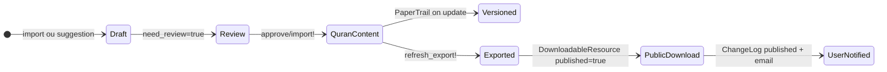

# Phase 3 — Provenance et intégrité des données

> **Série d'onboarding :** tu apprends QUL étape par étape pour contribuer.  
> **Prérequis :** [Phase 1](phase-01-what-is-qul.md), [Phase 2](phase-02-quranic-data-model.md)  
> **Ce fichier :** comment QUL garde les ressources coraniques attribuables, joignables et cohérentes.

---

## La question technique

QUL gère des données coraniques. La question n'est pas théologique — elle est pratique :

> **Comment QUL garde les ressources attribuables, joignables et cohérentes — et comment on sait qu'une modification n'a pas cassé quelque chose en aval ?**

Cette phase sépare trois préoccupations :

1. **Identité canonique** — ce qui ne doit pas changer (adresses ayah, positions de mots)
2. **Contenu éditable** — ce que traducteurs, relecteurs et importeurs modifient
3. **Couches de gouvernance** — drafts, approbations, versioning, permissions, contrôles d'intégrité

---

## Identité canonique vs contenu éditable

### Identité canonique (à traiter avec soin)

Ces champs définissent **où** le contenu vit. Les modifier est à haut risque.

| Champ | Modèle | Rôle |
|---|---|---|
| `chapter_number` / `chapter_id` | `Chapter`, `Verse`, `Word` | Quelle sourate |
| `verse_number` | `Verse` | Quelle ayah dans la sourate |
| `verse_key` | `Verse`, `Translation`, `Tafsir`, … | Adresse `"surah:ayah"` |
| `position` | `Word` | Index du mot dans l'ayah |
| `location` | `Word`, `Morphology::Word` | Adresse `"surah:ayah:word"` |
| `verse_index` | `Verse` | Séquence d'ayah globale (1–6236) |
| `word_index` / `sequence_number` | `Word` | Séquence de mots globale (unique) |

**On sait :** Les exporteurs indexent la sortie par `verse_key` ou `location`. Les apps en aval joignent sur ceux-ci.

**On pense :** Si tu changes `verse_key` sur une traduction de `"2:255"` à `"2:256"`, le texte se déplace vers la mauvaise ayah dans chaque export — sans erreur.

### Contenu éditable (travail éditorial normal)

Ces champs définissent **ce qui est dit** à une adresse stable :

| Champ | Modèle | Exemples |
|---|---|---|
| `text` | `Translation`, `Tafsir`, `WordTranslation` | Texte traduit / commentaire |
| Colonnes `text_*` | `Verse`, `Word` | Variantes de script arabe |
| `footnotes` / `FootNote.text` | `FootNote` | Notes savantes |
| `segments` (jsonb) | `Audio::Segment` | Données de timing |
| `root_id`, `lemma_id`, `stem_id` | `Word` | Assignations linguistiques |
| Champs d'analyse morphologique | `Morphology::Word`, segments, tokens | Métadonnées grammaticales |

**On sait :** PaperTrail versionne beaucoup de ces champs à la mise à jour (voir ci-dessous).

### Métadonnées semi-stables (modifier avec prudence)

| Champ | Modèle | Notes |
|---|---|---|
| `resource_content_id` | Toutes les lignes de ressource | À quel package une ligne appartient — déplacer casse l'attribution |
| `approved` | `ResourceContent`, `Audio::Recitation`, `Morphology::Phrase` | Porte de publication |
| `start_verse_id` / `end_verse_id` | `Tafsir` | Couverture de plage — mauvaise plage = mauvais mapping |
| `meta_data` (jsonb) | `ResourceContent` | Clés source, text-type, flags footnote, timestamps d'import |

---

## Provenance : qui, où, quand

QUL trace la provenance au niveau du **package** (`ResourceContent`), pas par ligne ayah.

### Attribution auteur et traducteur

**On sait :** `ResourceContent` appartient à :

```ruby
belongs_to :author, optional: true      # translators, scholars
belongs_to :language, optional: true
belongs_to :data_source, optional: true # where data was obtained
```

| Modèle | Table | Rôle |
|---|---|---|
| `Author` | `authors` (Quran DB) | Érudit/traducteur nommé |
| `DataSource` | `data_sources` (Quran DB) | Origine externe (ex. QuranEnc, TafsirApp) |
| `Language` | `languages` (Quran DB) | Langue de la ressource |

**On sait :** Les lignes `Translation` copient `language_name` et `language_id` depuis la ressource parente à l'import/approbation.

### Suivi de source dans les métadonnées

**On sait :** `ResourceContent` stocke la provenance dans `meta_data` jsonb. Exemples dans le code :

| Clé meta | Définie par | Signification |
|---|---|---|
| `source` | Importeurs | ex. `'quranenc'` |
| `quranenc-key` | Importeur QuranEnc | Identifiant source externe |
| `tafsirapp-key` | Importeur TafsirApp | Identifiant source externe |
| `draft-quranenc-import-version` | Import | Version source à l'import |
| `draft-quranenc-import-timestamp` | Import | Timestamp source |
| `quranenc-imported-version` | Post-approbation | Promu en meta canonique |
| `last-import-at` | `run_after_import_hooks` | Dernier import |
| `has-footnote` | Import | Si des footnotes existent |
| `text-type` | Config admin | Quelle colonne `text_*` exporter |
| `copyright` | Admin | Téléchargement restreint sur `DownloadableResource` |

**On sait :** Après approbation draft, `run_after_import_hooks` promeut les métadonnées :

```ruby
set_meta_value('quranenc-imported-version', delete_meta_value('draft-quranenc-import-version'))
set_meta_value('last-import-at', Time.zone.now.strftime(...))
```

### Copyright et permissions d'hébergement

**On sait :** `ResourcePermission` (base CMS) trace le statut légal par `ResourceContent` :

```ruby
enum :permission_to_host   # unknown, requested, granted, rejected
enum :permission_to_share  # unknown, requested, granted, rejected
# copyright_notice, source_info, contact_info
```

**On sait :** `DownloadableResource#restrict_download?` vérifie `meta_value('copyright')`. Quand défini, la page ressource affiche `copyright_notice` au lieu des liens de téléchargement (`app/views/resources/detail.html.erb`).

**On pense :** La provenance pour les utilisateurs est en partie dans les fichiers d'export et en partie sur la page détail ressource. Les exports sont indexés par `verse_key` — le nom d'auteur n'est pas dans chaque ligne JSON par défaut.

---

## Machine à états de publication

Le contenu passe par plusieurs couches de « publishedness » :



### Couche 1 : Draft (base CMS)

Les tables draft contiennent des modifications **proposées** avant le contenu publié :

| Table | Modèle | Créé par |
|---|---|---|
| `draft_translations` | `Draft::Translation` | UI relecture, importeurs |
| `draft_tafsirs` | `Draft::Tafsir` | UI relecture, importeurs |
| `draft_word_translations` | `Draft::WordTranslation` | UI traduction de mots |
| `draft_contents` | `Draft::Content` | Pipeline draft générique |
| `draft_foot_notes` | `Draft::FootNote` | Modifications footnotes |

**On sait :** Les lignes draft tracent l'état de relecture :

| Champ | Signification |
|---|---|
| `current_text` | Ce qui est publié maintenant |
| `draft_text` | Modification proposée |
| `text_matched` | Si le draft égale le courant (`true` = pas de vraie modification) |
| `need_review` | Nécessite relecture humaine avant import |
| `imported` | Si le draft a été appliqué au contenu Coran |
| `user_id` | Qui a suggéré la modification |

**On sait :** La relecture communautaire (`TranslationProofreadingsController`) **n'écrase pas** le texte publié directement. Elle appelle `Translation#save_suggestions`, qui crée un `Draft::Translation` avec `need_review: true`.

### Couche 2 : Approbation → contenu Coran

**On sait :** `Draft::Translation#import!` écrit dans la table `translations` de la base Coran :

1. Trouve ou initialise `Translation` pour `verse_id` + `resource_content_id`
2. Copie `draft_text` → `text`
3. **Re-synchronise les champs d'identité** depuis le verset : `verse_key`, `chapter_id`, `verse_number`, métadonnées juz/hizb/page
4. Attribue le changement PaperTrail à l'utilisateur
5. Marque le draft `imported: true`

**On sait :** L'import utilise `save(validate: false)` — il n'y a **pas de validations ActiveRecord** qui bloquent l'écriture.

**On sait :** L'approbation en masse passe par des jobs Sidekiq (`DraftContent::ApproveDraftTranslationJob`, etc.). Pendant l'import en masse, `PaperTrail.enabled = false` pour éviter des milliers de lignes de version.

### Couche 3 : Approbation ressource

**On sait :** Le booléen `ResourceContent#approved` contrôle si une ressource est approuvée. Scope : `ResourceContent.approved`.

**On sait :** `Audio::Recitation` a son propre flag `approved`. Les récitations clonées démarrent `approved: false`.

**On sait :** `Morphology::Phrase` a `approved` et `review_status` — seules les phrases approuvées apparaissent dans les aperçus mutashabihat publics.

### Couche 4 : Publication téléchargement public

**On sait :** `DownloadableResource#published` contrôle la visibilité sur `/resources`. Scope : `DownloadableResource.published`.

**On sait :** `ResourcesController#detail` n'affiche que les ressources `.published`.

**On sait :** `refresh_export!` régénère les pièces jointes `DownloadableFile`, puis envoie éventuellement des emails aux utilisateurs ayant téléchargé la ressource.

### Couche 5 : Annonces de changement

**On sait :** `ChangeLog` (base CMS) est un **changelog curaté** — pas PaperTrail automatique :

```ruby
class ChangeLog < ApplicationRecord
  belongs_to :user
  belongs_to :resource_content
  validates :title, :text, :excerpt, presence: true
  scope :published, -> { where published: true }
end
```

Les mainteneurs les rédigent manuellement dans Active Admin. Quand une ressource est re-exportée, `notify_users` attache le `ChangeLog` publié le plus récent à l'email de mise à jour.

---

## Versioning : PaperTrail

**On sait :** QUL utilise la gem [PaperTrail](https://github.com/paper-trail-gem/paper_trail). Les versions sont dans la table `versions` de la base CMS :

```ruby
# db/schema.rb
create_table "versions" do |t|
  t.string "item_type"    # e.g. "Translation"
  t.integer "item_id"
  t.string "event"        # "update", "destroy"
  t.string "whodunnit"   # GlobalID of user
  t.text "object"        # YAML snapshot of previous state
  t.boolean "reviewed", default: false
  t.integer "reviewed_by_id"
  t.integer "user_id"
end
```

**On sait :** Modèles avec PaperTrail (sélection) :

| Modèle | Événements tracés |
|---|---|
| `Verse` | update, destroy |
| `Word` | update, destroy |
| `Translation` | update |
| `Tafsir` | update |
| `WordTranslation` | update |
| `FootNote` | update |
| `Chapter` | update |
| `ChapterInfo` | update |
| `Transliteration` | update |
| `ArabicTransliteration` | update |
| `MushafWord` | update |

**On sait :** Active Admin enregistre les versions comme **« Content Changes »** à `/cms/content_changes` avec :
- Voir version précédente/suivante
- **Revert** vers une version antérieure (`resource.reify` + `save`)
- Marquer version comme relue/non relue

**On sait :** La concern `PaperTrailAttribution` encapsule les écritures pour définir `whodunnit` :

```ruby
PaperTrail.request(whodunnit: user.to_gid.to_s, controller_info: { user_id: user.id }) do
  yield
end
```

**On pense :** PaperTrail trace les **modifications de contenu** sur des lignes individuelles. Il ne remplace pas le workflow draft/relecture — les drafts vivent dans des tables séparées jusqu'à import explicite.

**On ne sait pas :** Si les versions PaperTrail pour les modèles Quran DB sont dans la table CMS `versions` ou un store séparé — la table `versions` est dans `db/schema.rb` (base CMS), mais les modèles versionnés utilisent `QuranApiRecord`. Vérifier en Phase 17 en local.

---

## Contrôle d'accès : qui peut modifier quoi

**On sait :** CanCanCan (modèle `Ability`) définit les rôles :

| Rôle | Capacités d'édition |
|---|---|
| `super_admin` | `can :manage, :all` |
| `admin` | Gérer traductions, tafsirs, drafts, récitations, contenu ressource |
| `moderator` | Créer/mettre à jour drafts (pas destroy) ; gérer phrases morphologie |
| `contributor` | Limité (hérite des restrictions normal_user) |
| `normal_user` | Lire la plupart des choses ; pas d'accès admin |
| `audio_annotator` | Accès spécial aux ressources récitation |

**On sait :** Les outils d'édition communautaire utilisent un **accès par projet** via `UserProject` :

```ruby
# application_controller.rb
access = current_user.user_projects.find_by(resource_content_id: resource.id)
access if access&.approved?
```

Les contributeurs demandent l'accès à un `ResourceContent` spécifique. Ils doivent être approuvés (`user_projects.approved = true`) avant édition.

**On sait :** `TranslationProofreadingsController` exige authentification pour edit/update et vérifie l'accès ressource.

**Important maintenant :** Les utilisateurs non autorisés peuvent parcourir et télécharger (avec login pour certains fichiers). Éditer le contenu sacré exige un accès projet approuvé ou un rôle admin.

---

## Intégrité du pipeline d'import

Les données externes entrent via des importeurs dans `lib/importer/`. Ils créent généralement des **drafts d'abord**, pas des écrasements directs.

### Correspondance d'identité pendant l'import

**On sait :** L'importeur QuranEnc (`lib/importer/quran_enc.rb`) fait correspondre les données externes par clé :

```ruby
def verses_by_key
  @verses_by_key ||= Verse.all.index_by(&:verse_key)
end

# For each imported row:
verse = verses_by_key["#{data['sura']}:#{data['aya']}"]
```

**On sait :** Si `verse` est nil (clé non trouvée), l'import échouerait à `verse.verse_key` — pas de repli silencieux vers une autre ayah.

**On sait :** Les importeurs journalisent les problèmes :

```ruby
log_issue({ tag: 'missing-footnote-mapping', text: verse.verse_key })
log_issue({ tag: 'wrong-footnote-mapping', text: verse.verse_key })
```

**On sait :** Les problèmes d'import créent des enregistrements `AdminTodo` pour suivi mainteneur.

**On sait :** `Importer::Base#create_draft_tafsir` définit `text_matched` en comparant le draft au texte publié — les écrasements involontaires sont visibles dans les files de relecture.

### Import en masse désactive le versioning

**On sait :** `DraftContent::ApproveDraftContentJob` définit `PaperTrail.enabled = false` pendant l'import en masse, puis exécute `run_after_import_hooks` qui vérifie les enregistrements manquants.

### Hooks de vérification post-import

**On sait :** `ResourceContent#run_after_import_hooks` après approbation :

```ruby
update_records_count
set_meta_value('last-import-at', ...)
check_for_missing_translation  # expects exactly 6236 rows
check_for_missing_tafsirs      # expects coverage for every verse
```

**On sait :** `check_for_missing_translation` :

```ruby
if !(6236 - translations.size).zero?
  issues.push("#{6236 - translations.size} missing translation record...")
end
if (missing_text = translations.where(text: [nil, ''])).any?
  issues.push "#{missing_text.size} translation with missing text..."
end
```

Ceux-ci retournent des tableaux de problèmes — ils ne bloquent pas l'import, mais les problèmes sont rapportés via `AdminTodo`.

---

## Outils d'intégrité des données

Au-delà des hooks d'import, QUL a des outils explicites de contrôle d'intégrité.

### Page Admin Data Integrity Check

**On sait :** `Tools::DataIntegrityChecks` (`app/models/tools/data_integrity_checks.rb`) fournit ~25 contrôles depuis Active Admin :

| Contrôle | Ce qu'il détecte |
|---|---|
| `words_without_root` | Mots sans racine |
| `words_without_lemma` | Mots sans lemme |
| `words_without_stem` | Mots sans stem |
| `words_with_missing_arabic_text` | Colonnes script vides |
| `ayah_with_missing_translations` | Lacunes traduction |
| `words_with_missing_translations` | Lacunes traduction mot |
| `ayah_with_missing_tafsirs` | Lacunes tafsir |
| `compare_translations` | Écarts entre éditions |
| `duplicate_mushaf_words` | Entrées layout dupliquées |
| `mushaf_words_with_incorrect_position` | Erreurs position layout |
| `ayah_with_different_mushaf_page` | Même ayah sur pages différentes |
| `ayah_without_matching_ayahs` | Lacunes ayahs similaires |

**On sait :** Ce sont des **requêtes diagnostiques**, pas des gates CI. Ils aident les mainteneurs ; ils ne bloquent pas automatiquement les exports.

### Préservation des clés d'export

**On sait :** Les exports de traduction utilisent `verse_key` comme clé JSON :

```ruby
json_data[translation.verse_key] = translation_text_without_footnotes(translation)
```

**On sait :** Les exports script mot utilisent `location` comme clé et incluent `surah`, `ayah`, `word`.

**On pense :** Tant que `verse_key` et `location` sont corrects au moment de l'export, l'intégrité en aval est préservée. L'export lit les champs chaîne dénormalisés, pas les FK.

---

## Comment la corruption se propage en aval

Comprendre les modes de défaillance aide à savoir quoi vérifier :

### Mauvais `ayah_number` ou `verse_key`

```text
Editor sets translation.verse_key = "2:256" (should be "2:255")
  → Export keys JSON as "2:256"
  → Downstream app joins translation to ayah 256
  → User sees wrong translation at wrong ayah
  → No error thrown; data looks structurally valid
```

**Atténuation :** Les champs d'identité sont re-synchronisés depuis `verse` pendant `Draft::Translation#import!`. Les modifications admin directes de `verse_key` sans import sont le chemin de risque.

### Mauvais `word_position` ou `location`

```text
Morphology attached to word position 5 instead of 4
  → Export includes root/POS at wrong word
  → Word-by-word app shows wrong grammar for that token
```

**Atténuation :** `location` est dérivé de `word.location` pendant les exports ; les contrôles détectent racines/lemmes manquants.

### Mauvais `resource_content_id`

```text
Translation row assigned to wrong ResourceContent
  → Export for "Sahih International" includes another translator's text
  → Attribution broken; content may be correct but wrong source
```

**Atténuation :** L'UI admin scope par ressource ; les exporteurs filtrent `where(resource_content_id: id)`.

### Lignes manquantes (couverture incomplète)

```text
Translation resource has 6200 rows instead of 6236
  → run_after_import_hooks reports "36 missing translation record"
  → Downstream app gets nil for missing ayahs
```

**Atténuation :** `check_for_missing_translation` attend exactement 6236 lignes.

### Fichiers d'export obsolètes

```text
Content updated in Quran DB but export not refreshed
  → Public download serves old JSON
  → Downstream users see outdated text despite CMS showing new content
```

**Atténuation :** `DownloadableResource#refresh_export!` doit être exécuté après modifications. Re-export est une étape manuelle/déclenchée admin.

---

## Contributions code vs contributions données

QUL supporte les deux chemins. Ils diffèrent en risque et relecture.

| Aspect | Contribution code | Contribution données |
|---|---|---|
| **Mécanisme** | Fork → branche → PR sur GitHub | Édition CMS, UI relecture, jobs import/approve |
| **Ce qui change** | App Rails, exporteurs, outillage, docs | Traductions, tafsirs, segments audio, morphologie |
| **Relecture** | Code review PR par mainteneurs | Relecture draft, approbation admin, accès projet |
| **Preuve nécessaire** | Tests, lint, diff ciblé | Mapping ayah/mot correct, UTF-8, comptages |
| **Risque** | Bugs app, ruptures format export | Mauvais attachement ayah, texte corrompu |
| **Versioning** | Historique Git | PaperTrail + tables draft + ChangeLog |
| **Rollback** | `git revert` | Revert PaperTrail dans admin, ou re-import depuis draft |

**On sait :** `contribute-data.md` dit que la plupart de la contribution de données se fait via le CMS avec relecture avant publication sur `/resources`.

**On sait :** Les contributions de données ne passent typiquement pas par des PR GitHub pour les lignes de contenu — elles passent par le pipeline draft → approve → export.

**On pense :** En tant que contributeur code, tu peux construire/corriger les pipelines. En tant que contributeur données, tu travailles à l'intérieur. Ne commite pas de modifications de texte coranique en fichiers plats sauf si c'est partie d'un workflow documenté.

---

## Ce qui N'EST PAS vérifié (lacunes à connaître)

**On sait :** Les modèles centraux (`Translation`, `Tafsir`, `Verse`, `Word`) n'ont **pas de validations ActiveRecord** sur le contenu texte ou les champs d'identité.

**On sait :** Imports et approbations utilisent souvent `save(validate: false)`.

**On sait :** Les contrôles d'intégrité existent mais sont des **diagnostics opt-in**, pas des gates CI automatisées.

**On sait :** Il n'y a pas de test automatique affirmant que chaque ligne d'export mappe à la bonne ayah — cela devrait faire partie de ta vérification en modifiant les exporteurs.

| Dans le code actuel | Bonne pratique pour tes modifications |
|---|---|
| Comptages hooks post-import (6236 ayahs) | Ajouter tests ciblés en modifiant la logique export |
| Outils contrôle intégrité admin | Exécuter contrôles pertinents après modifications |
| PaperTrail pour revert manuel | Documenter ce que tu as vérifié dans la description PR |
| Draft/relecture pour éditions communautaires | Ne jamais contourner la relecture pour modifications de contenu |

---

## Checklist de vérification d'intégrité (pour plus tard)

Quand tu modifies quoi que ce soit touchant les données coraniques, demande :

### Contrôles d'identité
- [ ] Chaque ligne a-t-elle toujours le bon `verse_key` ou `location` ?
- [ ] Pour traductions : exactement 6236 lignes par ressource complète ?
- [ ] Pour ressources mot : `word_id` résout-il vers la `position` attendue ?

### Contrôles de contenu
- [ ] UTF-8 préservé ? Texte arabe non corrompu ?
- [ ] Échantillon 5–10 ayahs comparé manuellement avant/après ?
- [ ] Footnotes toujours liées aux bons IDs ?

### Contrôles d'export
- [ ] `refresh_export!` exécuté après modification de contenu ?
- [ ] Les clés JSON exportées correspondent-elles à `verse_key` / `location` ?
- [ ] Comptages lignes SQLite conformes aux attentes ?

### Contrôles de provenance
- [ ] `resource_content_id` inchangé pour ressources non affectées ?
- [ ] Version source `meta_data` mise à jour si re-importé ?
- [ ] `ChangeLog` rédigé si les utilisateurs doivent connaître la mise à jour ?

---

## Classification pour cette phase

### Important maintenant

1. **Champs d'identité** (`verse_key`, `location`, `position`) sont infrastructure. **Champs de contenu** (`text`, `text_*`) sont éditoriaux.
2. **Draft → approve → import** est le chemin normal. Les éditions communautaires n'écrasent pas directement le texte publié.
3. **PaperTrail** versionne les modifications et supporte revert dans admin. Les imports en masse le désactivent temporairement.
4. **`ResourceContent`** porte la provenance : auteur, source, `meta_data`, `approved`.
5. **`DownloadableResource.published`** contrôle les téléchargements publics. Le contenu peut exister en base sans être exporté.
6. **Les imports correspondent par `verse_key`** — externe `sura:aya` → `Verse.verse_key`. Pas de validations sur modèles centraux ; contrôles d'intégrité sont des outils séparés.
7. **De mauvais identifiants se propagent silencieusement** dans les exports. Une réponse HTTP réussie ne prouve pas l'intégrité.

### Utile plus tard

- Enums copyright/hébergement `ResourcePermission`
- `ChangeLog` comme annonces de mise à jour
- `AdminTodo` pour suivi problèmes d'import
- Workflow `Morphology::Phrase#approved`
- Flux demande accès `UserProject`
- `Audio::ChangeLog` pour historique récitation
- `Tools::TajweedRulesCheck` (séparé des contrôles intégrité données)

### Pas besoin maintenant

- `LogEntry` (analytics, pas gouvernance contenu)
- `ProofReadComment` (commentaires sur ressources)
- Modèle `Contributor` (page crédits site)
- Modèles staging `RawData::*`
- Implémentations parseur importeur individuelles (Phase 10)

---

## Incertitudes

| Élément | Statut |
|---|---|
| Quelle base PaperTrail stocke versions pour QuranApiRecord | **On ne sait pas** — vérifier en Phase 17 |
| Si `approved` sur `ResourceContent` bloque export ou filtre seulement scopes | **Partiellement connu** — `ExportDbForSemanticSearchJob` filtre `approved` |
| Liste complète clés `meta_data` par type | **On ne sait pas** — inspecter par sub_type |
| Si suggestions relecture notifient auto les relecteurs | **On ne sait pas** — probablement relecture manuelle dans admin |
| Gates CI intégrité données | **On sait : aucun trouvé** — contrôles sont outils admin uniquement |

---

## Ce qu'on verra ensuite

**Phase 4 — Rails pour un ingénieur React/Node**

Maintenant que tu comprends les données et leur gouvernance, on mappe Rails vers des concepts que tu connais : routes, controllers, Active Record, Active Admin, Sidekiq, etc.

---

## Résumé Phase 3 — cinq choses à retenir

1. **L'identité est infrastructure ; le contenu est éditorial.** Protège `verse_key`, `location` et `position` avant tout.
2. **Les modifications suivent draft → relecture → import → export → publication.** Les suggestions communautaires n'écrasent pas directement le contenu publié.
3. **La provenance vit sur `ResourceContent`** — auteur, source, `meta_data`, permissions — pas sur chaque ligne ayah.
4. **PaperTrail + outils contrôle intégrité** sont le filet de sécurité — pas les validations ActiveRecord (largement absentes).
5. **De mauvaises jointures se propagent silencieusement aux exports.** Vérifie identifiants et échantillonne données ; ne fais pas confiance à un save réussi seul.

---

*Version A2 — français simple. Généré pendant l'onboarding contributeur QUL.*
