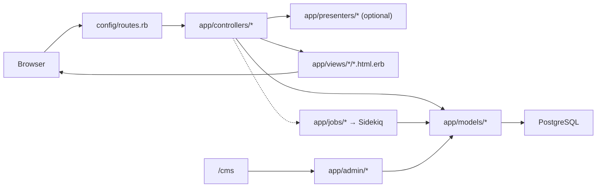

# Phase 4 — Rails pour un ingénieur React/Node

> **Série d'onboarding :** tu apprends QUL étape par étape pour contribuer.  
> **Prérequis :** [Phase 1](phase-01-what-is-qul.md), [Phase 2](phase-02-quranic-data-model.md), [Phase 3](phase-03-provenance-and-integrity.md)  
> **Ce fichier :** vocabulaire Rails minimum pour lire QUL — seulement ce qui est dans ce codebase.

---

## Ce que tu apprends

Tu n'as pas besoin d'être expert Rails. Tu as besoin de vocabulaire pour :

1. Ouvrir une URL et trouver l'action controller
2. Suivre un chemin controller → presenter/model → view
3. Reconnaître où vit la logique métier (`lib/` vs `app/services/` vs models)
4. Comprendre Active Admin comme couche UI admin parallèle
5. Savoir quand le travail s'exécute dans Sidekiq au lieu du cycle requête

Cette phase mappe Rails vers Express, React et Firebase.

---

## Stack Rails de QUL (vérifiée)

| Pièce | Version / gem | Rôle dans QUL |
|---|---|---|
| Ruby | `>= 3.3.3` (`.ruby-version`) | Runtime |
| Rails | `~> 8.0` | Framework web |
| PostgreSQL | gem `pg` | Deux bases de données (CMS + contenu Coran) |
| Redis | gem `redis` | Backend file Sidekiq |
| Puma | serveur app | Comme le processus HTTP de Node |
| Devise | `4.9.4` | Authentification utilisateur |
| CanCanCan | `cancancan` | Règles d'autorisation |
| Active Admin | `~> 3.2` | UI CMS auto-générée sur `/cms` |
| PaperTrail | `>= 15.0` | Versioning modifications contenu |
| Sidekiq | `~> 7.2` | Jobs en arrière-plan |
| Turbo | `@hotwired/turbo-rails` | Mises à jour partielles de page |
| Stimulus | `@hotwired/stimulus` | Controllers JS légers |
| Vue 3 | `vue` + plugin esbuild | Deux apps isolées (segments, outils SVG) |
| jQuery | `3.7.1` | Interactions legacy, Active Admin |
| esbuild | bundler JS | Remplace Webpack pour ce projet |
| Tailwind + Sass | CSS | Style |
| Pagy | pagination | Comme helpers pagination cursor/limit |
| Sentry | suivi erreurs | Monitoring production |

**NON présents comme patterns principaux :** React, Next.js, GraphQL, ActionCable (temps réel), bcrypt (Devise gère les mots de passe en interne).

---

## Flux de requête : le diagramme à retenir



**Analogie Node :**

```text
Express route          →  Rails route (config/routes.rb)
Route handler          →  Controller action
Mongoose/Firestore model →  Active Record model
DTO/serializer layer   →  Presenter (QUL les utilise beaucoup)
EJS/Handlebars template →  ERB view (.html.erb)
Bull/BullMQ worker     →  Sidekiq job
Admin dashboard gem    →  Active Admin (pas d'équivalent React — CRUD server-rendered)
```

---

## Routes (`config/routes.rb`)

**On sait :** Tous les points d'entrée HTTP sont dans un fichier. QUL a ~260 lignes de routes :

| Groupe de routes | Exemple | Rôle |
|---|---|---|
| Site public | `root`, `/docs`, `/resources` | Accueil, docs, téléchargements |
| Pages ayah | `/ayah/:key`, `/ayah/:key/translations` | Vues ressources par ayah |
| Outils contributeurs | `/translation_proofreadings`, `/mushaf_layouts` | UIs édition contenu |
| API v1 | `/api/v1/chapters`, `/api/v1/translations/for_ayah/:ayah_key` | API JSON partielle |
| Auth | `devise_for :users` | Login, inscription, reset mot de passe |
| Admin | `ActiveAdmin.routes(self)` | Tout sous `/cms` |
| Ops arrière-plan | `mount Sidekiq::Web => '/sidekiq'` | Moniteur jobs (admin uniquement) |

**Convention Rails :** `resources :translation_proofreadings` génère des routes RESTful (`index`, `show`, `edit`, `update`, …). Tu verras `resources` RESTful et routes explicites `get`/`post`.

**Exemple — sous-ressources ayah :**

```ruby
get '/ayah/:key', to: 'ayah#show'
get '/ayah/:key/translations', to: 'ayah#translations'
```

C'est comme :

```javascript
// Express equivalent (conceptual)
app.get('/ayah/:key/translations', ayahController.translations)
```

`:key` devient `params[:key]` dans le controller (ex. `"2:255"`).

**On sait :** Les anciennes URLs `/admin` redirigent vers `/cms` (301).

---

## Controllers (`app/controllers/`)

Les controllers sont des gestionnaires de requêtes. QUL a plusieurs familles :

| Famille controller | Classe de base | Exemples |
|---|---|---|
| HTML public | `ApplicationController` | `AyahController`, `ResourcesController`, `CommunityController` |
| API JSON | `ActionController::API` | `Api::V1::ApiController` et enfants |
| Overrides Devise | `Devise::*` | `Users::SessionsController`, `Users::RegistrationsController` |
| Active Admin | Généré par la gem | Un par enregistrement `app/admin/*.rb` |

### ApplicationController — ce que chaque controller HTML hérite

**On sait** — comportements clés depuis `app/controllers/application_controller.rb` :

```ruby
class ApplicationController < ActionController::Base
  include Pagy::Backend                    # pagination
  protect_from_forgery with: :exception    # CSRF tokens (like session-based CSRF middleware)
  before_action :set_paper_trail_whodunnit  # audit who made changes
  before_action :init_presenter            # sets @presenter

  rescue_from ActiveRecord::RecordNotFound, with: ->(e) { render_error 404, e }

  def can_manage?(resource)  # project-based edit access check
end
```

**Comparaison Node :** `ApplicationController` est ton middleware Express global + classe router de base. `before_action` est un middleware avant la méthode action. `protect_from_forgery` est protection CSRF — les formulaires incluent un token caché.

### Pattern controller mince

Les controllers QUL sont souvent minces — ils délèguent aux presenters :

```ruby
# app/controllers/ayah_controller.rb
class AyahController < ApplicationController
  def translations
    render partial: 'ayah/translations', layout: false
  end

  protected
  def init_presenter
    @presenter = AyahPresenter.new(self)
    @ayah = @presenter.ayah
    head :not_found unless @presenter.found?
  end
end
```

**Algorithme :**
1. `init_presenter` s'exécute (via `before_action` dans le parent)
2. `AyahPresenter` recherche `Verse.find_by(verse_key: params[:key])`
3. L'action rend un template ERB partiel avec `@presenter` disponible

**On sait :** Beaucoup d'actions ayah rendent des **partials** avec `layout: false` — conçus pour injection Turbo Frame (swap d'un panneau sans recharger la page).

### Controllers API

**On sait :** `Api::V1::ApiController` hérite de `ActionController::API` (pas de CSRF, pas de views) :

```ruby
module Api::V1
  class ApiController < ActionController::API
    before_action :init_presenter
    before_action :set_cache_headers  # Cache-Control in production

    rescue_from ActiveRecord::RecordNotFound, with: :record_not_found
  end
end
```

**Comparaison Node :** C'est un router Express JSON — pas de HTML, pas de CSRF, retourne `render json:`.

---

## Presenters (`app/presenters/`) — pattern spécifique QUL

**On sait :** QUL utilise **44 classes presenter**. Ce n'est pas Rails universel — c'est une convention QUL.

Les presenters se placent entre controllers et views :

```ruby
class AyahPresenter < ApplicationPresenter
  def ayah
    @ayah ||= Verse.find_by(verse_key: params[:key])
  end

  def translation_ids
    ids = params[:translation_ids]
    ids = [131] if ids.blank?  # default translation
    Array(ids).map(&:to_i).uniq
  end
end
```

**Comparaison Node :** Un presenter est un **view model par requête** — comme les résultats d'un hook de fetch d'un container React, ou un serializer qui connaît aussi `params` et pagination. Il garde les templates ERB simples et les controllers minces.

**Quand tu vois `@presenter` dans une view**, cherche dans `app/presenters/` la logique de requête et formatage.

---

## Models et Active Record (`app/models/`)

### Ce qu'est Active Record

Un modèle Active Record n'est **pas** juste une définition de type. Chaque classe modèle combine :

| Capacité | Analogie Node/Firestore |
|---|---|
| Mapping table | Schéma Mongoose / chemin collection Firestore |
| Query builder | Requête SQL chaînable (`Translation.where(...)`) |
| Associations | Jointures SQL déclarées comme méthodes (`has_many :foot_notes`) |
| Callbacks | Triggers `onWrite` (before_save, after_update, …) |
| Validations | Vérification schéma entrée (sparse dans modèles contenu QUL) |
| Scopes | Fragments requête réutilisables (`scope :approved, -> { where approved: true }`) |

### Deux classes de base — convention QUL critique

```ruby
# CMS database (users, drafts, downloads, versions)
class ApplicationRecord < ActiveRecord::Base
  self.abstract_class = true
end

# Quran content database (verses, words, translations, …)
class QuranApiRecord < ApplicationRecord
  self.abstract_class = true
  self.establish_connection Rails.env.development? ? :quran_api_db_dev : :quran_api_db
end
```

**On sait :** `Chapter`, `Verse`, `Word`, `Translation` → `QuranApiRecord`  
**On sait :** `User`, `DownloadableResource`, `Draft::Translation`, `ChangeLog` → `ApplicationRecord`

**Comparaison Node :** Comme avoir deux bases Firestore ou deux clients Prisma — les modèles se connectent à différentes bases PostgreSQL. Tu ne peux pas supposer que `belongs_to` fonctionne entre bases.

### Concerns (`app/models/concerns/`) — mixins modèle partagés

**On sait :** 8 concerns, incluant :

| Concern | Ce qu'elle ajoute |
|---|---|
| `Resourceable` | `belongs_to :resource_content` + méthodes helper |
| `HasMetaData` | `meta_value('key')`, `set_meta_value` sur jsonb |
| `PaperTrailAttribution` | Encapsule écritures pour définir utilisateur audit |
| `StripWhitespaces` | Normalise champs texte avant save |
| `Slugable` | Génération slug URL |
| `NavigationSearchable` | Hooks index recherche |

**Comparaison Node :** Mixins TypeScript ou modules utilitaires composables inclus dans classes modèle.

```ruby
module Resourceable
  extend ActiveSupport::Concern
  included do
    belongs_to :resource_content, optional: true
  end
end
```

---

## Où vit la logique métier : `lib/` vs `app/services/`

C'est important pour QUL. La logique est répartie :

| Emplacement | Taille | Ce qui vit ici |
|---|---|---|
| `lib/` | ~122 fichiers Ruby | **Gros de la logique domaine :** importeurs, exporteurs, traitement audio, utilitaires morphologie, sanitizers texte |
| `app/services/` | ~26 fichiers | **Services ciblés :** recherche, rendu docs, édition graphe morphologie, validation audio |
| `app/models/` | ~147 fichiers | Accès données, associations, quelques méthodes domaine |
| `app/jobs/` | ~30 fichiers | Wrappers async appelant `lib/` ou `app/services/` |

**On sait :** Les exporteurs vivent dans `lib/exporter/` (pas `app/services/`).  
**On sait :** Les importeurs vivent dans `lib/importer/`.  
**On sait :** Jobs comme `DraftContent::ApproveDraftTranslationJob` orchestrent imports mais délèguent au code model/service.

**Règle empirique en exploration :**

```text
Need to understand export format?     → lib/exporter/
Need to understand external import?   → lib/importer/
Need to understand search?            → app/services/search/
Need to understand HTTP response shape? → app/presenters/
Need to understand admin CRUD?        → app/admin/
```

**Comparaison Node :** `lib/` est comme un dossier `src/lib/` de modules Ruby. `app/services/` est plus proche de ta couche service dans une app NestJS/Express.

---

## Views et helpers

### Views ERB (`app/views/`)

**On sait :** QUL rend HTML côté serveur avec templates ERB (Ruby embedded) :

```erb
<!-- app/views/ayah/_translations.html.erb (conceptual) -->
<% @presenter.translations.each do |t| %>
  <div><%= t.text %></div>
<% end %>
```

Les partials commencent par `_` et sont rendus via `render partial: 'ayah/translations'`.

**Comparaison Node :** ERB est comme EJS — Ruby embedded dans HTML. Pas de JSX. Le serveur envoie HTML ; Turbo peut swapper des fragments.

### Turbo Frames et Streams

**On sait :** Beaucoup de views utilisent `turbo_frame_tag` et templates `.turbo_stream.erb` pour mises à jour partielles.

**Comparaison Node :** Comme fetcher un fragment HTML et swapper un `div` — sauf que Turbo le gère avec des conventions (`data-turbo-frame`, réponses `turbo_stream`) au lieu d'écrire `fetch` + `innerHTML`.

Exemple de flux :
1. Utilisateur clique onglet ayah
2. Turbo requête `/ayah/2:255/translations`
3. Controller rend partial
4. Turbo remplace le contenu du frame — pas de rechargement page complet

### Helpers (`app/helpers/`)

19 modules helper avec utilitaires formatage view (`seo_helper`, `quran_script_helper`, `tajweed_helper`, …).

**Comparaison Node :** Fonctions pures importées dans templates — comme formatters dans un dossier `utils/` appelés depuis EJS.

---

## Active Admin (`app/admin/`) — la couche CMS

**On sait :** Active Admin est une gem qui **génère une UI admin CRUD complète** depuis fichiers configuration Ruby. QUL a **113 fichiers d'enregistrement admin**.

**On sait :** Monté sur `/cms` (namespace `:cms`).

**On sait :** Utilise CanCanCan pour autorisation (`config.authorization_adapter = ActiveAdmin::CanCanAdapter`).

### Ce qu'Active Admin génère vs ce que QUL personnalise

| Active Admin fournit | QUL personnalise |
|---|---|
| Tables index avec filtres | Colonnes custom, selects searchable, scopes |
| Pages show/détail | Diffs version, modals aperçu export |
| Formulaires edit | Footnotes imbriquées, actions custom |
| Batch actions | Import, export, triggers approve |
| Structure menu | Groupements `menu parent: 'Content'` |

**Exemple d'enregistrement :**

```ruby
# app/admin/content/translation.rb
ActiveAdmin.register Translation do
  menu parent: 'Content'
  actions :all, except: [:destroy, :new, :create]

  filter :text
  filter :resource_content, as: :searchable_select, ajax: { resource: ResourceContent }

  index do
    column :verse_id do |r|
      link_to r.verse_key, cms_verse_path(r.verse_id)
    end
    column :text do |r|
      r.text.first(100)
    end
  end
end
```

**Comparaison Node :** Imagine écrire zéro page admin React, et déclarer `admin.resource('Translation', { filters: [...], columns: [...] })` et obtenir une UI CRUD complète. C'est Active Admin. Ce n'est **pas** une app frontend séparée — c'est du HTML server-rendered avec jQuery (`app/javascript/active_admin.js`).

**Quand tu édites du contenu en tant qu'admin**, tu es généralement dans Active Admin, pas les outils contributeurs publics.

---

## Authentification : Devise

**On sait :** `devise_for :users` avec controllers custom pour inscription et sessions.

**On sait :** Le modèle `User` inclut :

```ruby
devise :database_authenticatable, :registerable, :lockable,
       :rememberable, :trackable, :validatable, :recoverable, :confirmable
```

**Comparaison Node :** Devise est comme NextAuth + modèle user + confirmation email + reset mot de passe, empaqueté en gem. Il fournit :

- `current_user` dans controllers (comme `req.user` après middleware auth)
- `authenticate_user!` before_action (comme middleware `requireAuth`)
- helper `user_signed_in?` dans views

**On sait :** Les utilisateurs ont des rôles via enum : `normal_user`, `admin`, `super_admin`, `moderator`, `contributor`, `audio_annotator`.

---

## Autorisation : CanCanCan

**On sait :** La classe `Ability` dans `app/models/ability.rb` définit permissions :

```ruby
class Ability
  include CanCan::Ability
  def initialize(user)
    can :read, :all
    if user.is_admin?
      can :manage, Translation
      can :manage, Draft::Translation
      # ...
    end
    can :manage, :all if user.super_admin?
  end
end
```

**Comparaison Node :** Comme un fichier policy RBAC centralisé. Les controllers appellent `authorize! :update, @resource`. Active Admin l'appelle automatiquement.

**On sait :** L'édition communautaire utilise une **deuxième couche d'accès** — `UserProject` (assignation projet approuvée par `ResourceContent`), vérifiée via `can_manage?(resource)` dans `ApplicationController`.

---

## Jobs en arrière-plan : Sidekiq

**On sait :** L'adaptateur `ActiveJob` est Sidekiq. Redis supporte la file.

**On sait :** Sidekiq Web UI sur `/sidekiq` — uniquement pour super_admin et admin.

**On sait :** Jobs planifiés dans `config/sidekiq_scheduler.yml` :

```yaml
daily_backup:
  class: BackupJob
  cron: "0 10 * * *"

quran_enc_update_checker:
  class: DraftContent::CheckContentChangesJob
  cron: "0 6 * * 0"
```

**Comparaison Node :**

| Sidekiq | Équivalent Node |
|---|---|
| `SomeJob.perform_later(args)` | `queue.add('jobName', payload)` |
| `SomeJob.perform_now(args)` | Exécuter synchrone (comme await inline Cloud Function) |
| Process worker Sidekiq | Worker Bull/BullMQ ou consommateur Firebase task queue |
| Redis | Backend Redis / Cloud Tasks |
| `sidekiq_options retry: 1` | Config retry job |

**On sait :** Catégories de jobs QUL :

| Catégorie | Exemples |
|---|---|
| Approbation draft | `DraftContent::ApproveDraftTranslationJob` |
| Export | `Export::TranslationJob`, `ExportMiniDumpJob` |
| Audio | `Audio::SplitGaplessRecitationJob`, `Audio::ExportAudioSegmentsJob` |
| Import | `DraftContent::ImportDraftContentJob` |
| Maintenance | `BackupJob`, `Recurring::UpdateApiStatsJob` |

Les jobs sont des orchestrateurs minces — le travail lourd est dans les classes `lib/`.

---

## Migrations et schéma

**On sait :** `db/migrate/` a ~105 migrations — toutes pour la **base CMS**.

**On sait :** `db/schema.rb` reflète uniquement la base CMS.

**On sait :** Les tables contenu Coran ne sont **pas** gérées par migrations Rails dans ce dépôt. Elles viennent du dump `mini_quran_dev.sql` (voir `project-setup.md`).

**Comparaison Node :** Comme avoir une base gérée par migrations Prisma et une autre restaurée depuis snapshot production. Exécuter `bin/rails db:migrate` ne crée pas les tables `verses` ou `words`.

**Quand tu ajoutes une feature CMS** (nouveau champ draft, nouvelles métadonnées download) : écrire une migration.  
**Quand le schéma contenu Coran change :** c'est un processus séparé à haut risque hors travail contributeur normal.

---

## Frontend dans cette app Rails

QUL n'est **pas** une architecture frontend unique. Elle est stratifiée par époque :

| Couche | Technologie | Où |
|---|---|---|
| HTML serveur | ERB + Tailwind | Plupart pages publiques, outils contributeurs |
| Mises à jour partielles | Turbo Frames/Streams | Viewer ayah, éditeur mushaf, recherche ressources |
| Micro-interactions | Stimulus (~70 controllers) | `app/javascript/controllers/` |
| DOM legacy | jQuery + jQuery UI | Active Admin, certains outils anciens |
| SPAs isolées | Vue 3 (2 apps) | `app/javascript/segments/`, `app/javascript/svg/` |
| Rich text | Trix + ActionText | Édition contenu admin |

### Stimulus

**On sait :** Les controllers Stimulus s'enregistrent auto depuis `app/javascript/controllers/index.js` :

```javascript
import controllers from "./**/*_controller.js"
controllers.forEach((controller) => {
  application.register(controller.name, controller.module.default)
})
```

**Comparaison Node :** Stimulus est comme de petits hooks React attachés aux éléments DOM via `data-controller="ayah-jump"` — pas de virtual DOM, pas d'arbre composants build-time. Bon pour toggles, modals, chargements AJAX.

### Vue

**On sait :** Seulement deux points d'entrée Vue dans `esbuild.config.js` :

```javascript
const entryPoints = [
  "application.js",
  "active_admin.js",
  "segments/index.js",  // Vue app
  "svg/index.js"        // Vue app
]
```

**Ne suppose pas que Vue est le défaut.** La plupart de QUL est ERB + Stimulus.

### Pipeline assets

**On sait :** `bin/dev` exécute Foreman avec `Procfile.dev` :

```text
web:      bin/rails server -p 3000
js:       yarn build --reload
tailwind: bin/rails tailwindcss:watch
```

**On sait :** JS bundlé par esbuild → `app/assets/builds/`. CSS par Sass + Tailwind.

**Comparaison Node :** Comme exécuter `next dev` + watcher CSS en parallèle — Foreman orchestre plusieurs processus.

---

## PaperTrail (versioning)

Déjà couvert en Phase 3, mais du point de vue Rails :

```ruby
# On model
has_paper_trail on: :update, ignore: [:created_at, :updated_at]

# In controller
before_action :set_paper_trail_whodunnit  # sets current_user as whodunnit

# Admin UI
ActiveAdmin.register PaperTrail::Version, as: 'ContentChanges'
```

**Comparaison Node :** Comme un middleware audit log automatique qui snapshot la ligne précédente avant chaque update — stocké dans table `versions`, visible/revertible dans admin.

---

## Comment lire une feature inconnue (algorithme)

Quand tu rencontres une URL ou un problème :

```text
1. config/routes.rb
   → find route → controller#action

2. app/controllers/<controller>.rb
   → read action method
   → note before_actions (auth, presenter init)

3. app/presenters/<presenter>.rb (if @presenter is used)
   → find queries and data shaping

4. app/models/<model>.rb OR lib/<relevant>.rb
   → follow Active Record queries or service calls

5. app/views/<controller>/<action>.html.erb
   → see what HTML is rendered
   → check for turbo_frame_tag, data-controller (Stimulus)

6. If async: app/jobs/ → lib/ or app/services/
7. If admin: app/admin/ → model directly
```

**Exemple :** `/ayah/2:255/translations`

```text
routes.rb        → ayah#translations
AyahController   → render partial (no layout)
AyahPresenter    → Verse.find_by(verse_key: "2:255"), load translations
Verse model      → has_many :translations (Quran DB)
_ translations.html.erb → renders translation list, maybe turbo frame
```

---

## Référence rapide syntaxe Ruby (seulement ce qui bloque la lecture)

| Ruby | Signification | Équivalent JS |
|---|---|---|
| `def foo; end` | Définition méthode | `function foo() {}` |
| `params[:key]` | Paramètres requête | `req.params.key` |
| `@ivar` | Variable d'instance | `this.ivar` |
| `Model.where(x: 1)` | Requête | `db.collection.where('x', '==', 1)` |
| `Model.find(id)` | Find par PK (raise si absent) | `doc(id).get()` |
| `Model.find_by(key: val)` | Find ou nil | `where().limit(1)` |
| `&.` | Navigation sûre | `?.` optional chaining |
| `\|\|` | Or / défaut | `\|\|` |
| `-> { }` | Lambda | `() => {}` |
| `include MyConcern` | Mixin | Mixin / `Object.assign` |
| `:symbol` | Symbole immuable | string literal (but interned) |
| `%i[update destroy]` | Tableau symboles | `['update', 'destroy']` |
| `unless` | If négatif | `if (!x)` |
| `render partial:` | Retourner fragment HTML | `res.render('partial')` |
| `before_action` | Hook pre-handler | Express middleware |

Tu n'as pas besoin d'écrire du Ruby idiomatique encore. Tu dois le lire.

---

## Classification pour cette phase

### Important maintenant

1. **Route → controller → presenter → model → view** est le chemin de lecture par défaut.
2. **Deux classes de base modèle** (`ApplicationRecord` vs `QuranApiRecord`) = deux bases de données.
3. **Active Admin sur `/cms`** est une UI admin parallèle — pas React, pas le site public.
4. **La logique métier est surtout dans `lib/`** — importeurs, exporteurs, audio, utilitaires morphologie.
5. **Sidekiq** exécute exports, imports, backups — pas la requête web.
6. **Presenters** sont la couche view-model de QUL — vérifie-les quand `@presenter` apparaît.
7. **Frontend mixte** — ERB + Turbo + Stimulus par défaut ; Vue seulement dans outils segments/SVG.

### Utile plus tard

- Règles `Ability` CanCanCan par rôle
- Personnalisation Devise (`Users::SessionsController`)
- Actions custom et opérations batch Active Admin
- Format réponse Turbo Stream
- `app/helpers/` pour formatage view
- Points d'entrée esbuild et live refresh `--reload`
- Namespace presenter API (`app/presenters/v1/`)
- Concerns (`Resourceable`, `HasMetaData`)

### Pas besoin maintenant

- Internes ActionText/Trix
- Analytics Chartkick/Groupdate
- Configuration Sentry
- Classes input ActiveAdmin custom (`lib/active_admin/`)
- Internes recherche Ransack (utilisé par filtres Active Admin)
- Configuration pagination Pagy
- Features changelog Rails 8 sans lien avec QUL

---

## Incertitudes

| Élément | Statut |
|---|---|
| Si tous les jobs utilisent Sidekiq ou certains s'exécutent inline | **Partiellement connu** — adaptateur Sidekiq ; certains jobs appellent `perform_now` synchrone |
| Comment Turbo est configuré globalement | **On ne sait pas** — utilisé par view ; pas de config globale inspectée |
| Si API v1 est considérée stable | **On ne sait pas** — docs disent « coming soon » mais routes existent (Phase 1) |

---

## Ce qu'on verra ensuite

**Phase 5 — L'architecture à deux bases de données**

On approfondira :
- Exactement quelles tables vivent dans quelle base
- Comment fonctionne `establish_connection`
- Patterns de référence inter-bases et leurs contraintes
- Diagramme de frontière Mermaid
- Ce que cela signifie pour associations, transactions et tests

---

## Résumé Phase 4 — cinq choses à retenir

1. **Route → controller → presenter → model → view** — commence chaque investigation là.
2. **`lib/` contient la plupart de la logique domaine** (importeurs, exporteurs) — pas seulement models.
3. **Active Admin est le CMS** sur `/cms` — séparé des pages ERB publiques.
4. **Deux bases de données** via `ApplicationRecord` vs `QuranApiRecord` — vérifie toujours quelle classe de base.
5. **Frontend multi-génération** — ERB + Turbo + Stimulus d'abord ; Vue seulement dans deux outils.

---

*Version A2 — français simple. Généré pendant l'onboarding contributeur QUL.*
