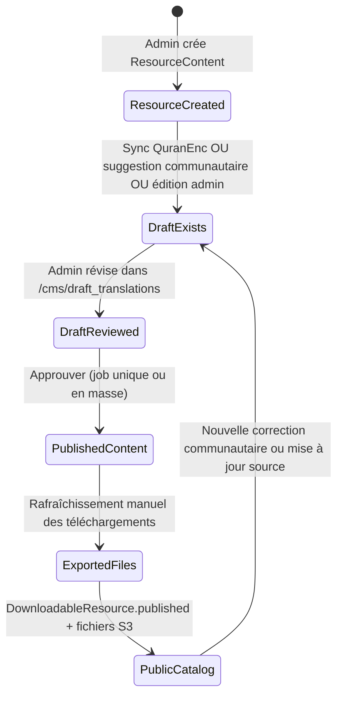
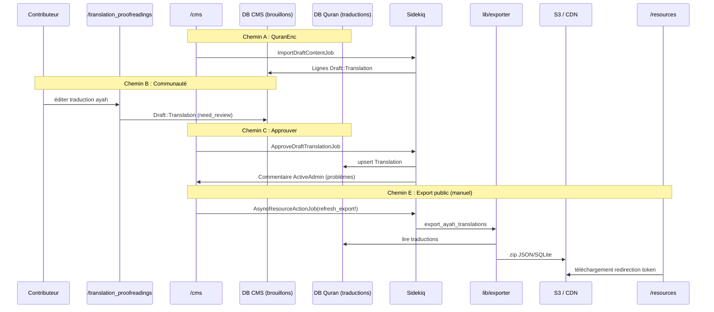

# Phase 8 — Flux Active Admin / CMS

> **Série d'onboarding :** tu apprends QUL étape par étape.  
> **Prérequis :** [Phases 1–7](phase-01-what-is-qul.md)  
> **Ce fichier :** on suit une ressource dans le CMS. Du brouillon au téléchargement public.

---

## Ce qu'on trace

**Exemple :** une **traduction ayah par ayah** (`ResourceContent` avec `sub_type: translation`, `cardinality_type: 1_ayah`).

C'est la boucle éditoriale la plus courante. Elle combine :

- Sync source externe (QuranEnc)
- Relecture communautaire (`/translation_proofreadings`)
- Revue brouillon CMS (`/cms/draft_translations`)
- Jobs d'approbation en masse
- Rafraîchissement export public (`DownloadableResource`)

Les autres types (tafsir, mushaf, audio) suivent la **même forme**. Les modèles et exports changent — on le note à la fin.

---

## Point d'entrée CMS

| Élément | Détail |
|---|---|
| URL | `/cms` (redirection 301 depuis l'ancien `/admin`) |
| Framework | Active Admin 3.x, namespace `:cms` |
| Auth | Devise `authenticate_user!` + CanCanCan `Ability` |
| Config | `config/initializers/active_admin.rb` |

**On sait :** `config.default_namespace = :cms`. Chaque fichier `ActiveAdmin.register X` devient `/cms/x`.

**On sait :** Rôles dans `app/models/ability.rb` :

| Rôle | Pouvoir CMS |
|---|---|
| `normal_user` | Navigation lecture surtout ; beaucoup de ressources masquées |
| `moderator` | CRUD brouillon (pas destroy) ; phrases morphologie |
| `admin` | `ResourceContent` complet, traductions, brouillons, `refresh_downloads` |
| `super_admin` | `can :manage, :all` |

Les contributeurs **ne touchent pas `/cms`** en général. Ils utilisent `/translation_proofreadings`. Les admins fusionnent leur travail.

---

## Le hub : `ResourceContent`

`ResourceContent` est le **paquet logique** pour tout jeu de données Quran téléchargeable. Il vit dans la **DB Quran** (`QuranApiRecord`). Il est lié au catalogue CMS.

```text
ResourceContent (DB Quran)
  ├── Lignes Translation / Tafsir / Recitation / … (contenu, scopé par resource_content_id)
  ├── DownloadableResource(s) (DB CMS — entrées catalogue public)
  ├── Lignes Draft::* (DB CMS — modifications en attente)
  ├── ResourcePermission (CMS — copyright/hébergement)
  └── UserProject (CMS — qui peut contribuer)
```

**Fichier admin :** `app/admin/content/resource_content.rb` (~560 lignes) — le centre de commande éditorial.

### Disposition page show (ce que voient les admins)

| Section | Rôle |
|---|---|
| **Table attributs** | Nom, slug, `approved`, langue, cardinalité, `meta_data`, comptages d'enregistrements |
| **Panneau ressources téléchargeables** | Liens vers lignes catalogue CMS + statut `published?` |
| **Panneau journaux de modifications** | Entrées changelog utilisateur pour cette ressource |
| **Sidebar : Données pour cette ressource** | Lien filtré vers `/cms/translations` (ou tafsirs, pages mushaf, etc.) |
| **Sidebar : Export données** | Formats export ad-hoc (SQLite, variantes JSON) → email |
| **Sidebar : Traductions brouillon** | Import/export JSON brouillon transfert en masse |
| **Sidebar : Accès contribution** | Liste `UserProject` |
| **Sidebar : Tags** | Tags ressource pour filtrage catalogue |
| **Éléments d'action** | Approuver, Importer brouillon (sync QuranEnc) |

---

## Machine à états (cycle de vie traduction)



**Important maintenant — ne pas confondre :**

| Étape | Ce qui change | Automatique ? |
|---|---|---|
| **Approuver brouillon** | `Draft::Translation` → `Translation` (DB Quran) | Job ou `import!` unique |
| **Rafraîchir téléchargements** | Lignes Quran → zip JSON/SQLite → S3 → `DownloadableFile` | **Manuel** via `/cms/downloadable_resources/:id` |
| **Approuver ResourceContent** | Bascule booléenne `approved` | Séparé de la publication du contenu |

**On sait :** `ApproveDraftTranslationJob` **n'appelle pas** `refresh_export!`. Les admins doivent rafraîchir les téléchargements séparément.

---

## Chemin A — Sync QuranEnc (source externe → brouillons)

On l'utilise quand `ResourceContent` a `meta_data['source'] == 'quranenc'` ou une `quranenc-key`.

### Déclencheur

1. Admin ouvre `/cms/resource_contents/:id`
2. Clique **« Import Draft translation »** (visible quand `resource.syncable?`)
3. L'action membre `import_draft` enqueue `DraftContent::ImportDraftContentJob`

```ruby
# app/jobs/draft_content/import_draft_content_job.rb
Importer::QuranEnc.new.import(resource.quran_enc_key)
# ou QuranEncTafsir / TafsirApp pour d'autres sources
```

### Ce que fait l'importeur

**On sait :** `lib/importer/quran_enc.rb` :

- Récupère depuis `https://quranenc.com/api/translations/`
- Fait correspondre les ayahs par `verse_key`
- Écrit des lignes **`Draft::Translation`** (DB CMS) via `insert_all` / `upsert_all` — **pas** directement des lignes `Translation` publiées

### Après la sync

L'admin est redirigé vers la liste brouillon filtrée :

```text
/cms/draft_translations?q[resource_content_id_eq]=<id>
```

Les brouillons affichent les flags : `text_matched`, `need_review`, `imported`, comptages de notes de bas de page.

### Sync planifiée

**On sait :** `DraftContent::CheckContentChangesJob` s'exécute chaque semaine (dimanche 06:00, `config/sidekiq_scheduler.yml`). Il détecte les changements QuranEnc et enqueue les imports.

---

## Chemin B — Relecture communautaire (contributeur → brouillon)

### Déclencheur

1. Le contributeur visite `/translation_proofreadings?resource_id=<id>` (nécessite approbation `UserProject`)
2. Édite un ayah → `TranslationProofreadingsController#update`
3. `Translation#save_suggestions` crée un nouveau `Draft::Translation` :

```ruby
# app/models/translation.rb
draft_translation.need_review = true
draft_translation.text_matched = draft_text == current_published_text
draft_translation.user = user
draft_translation.save(validate: false)
```

**On sait :** Le `Translation.text` publié **n'est pas** modifié. Seule une ligne brouillon est créée.

### Porte de permission

```ruby
# TranslationProofreadingsController
before_action :authenticate_user!, only: %i[edit update]
before_action :authorize_access!, only: %i[edit update]
# @access = can_manage?(find_resource)  → UserProject + Ability
```

---

## Chemin C — Revue brouillon admin → publication

Trois niveaux de granularité :

### C1 — Brouillon unique (un ayah)

`/cms/draft_translations/:id` → **« Approve and update »**

```ruby
# app/admin/draft/translation.rb
Draft::Translation#import!  # synchrone, ligne unique
```

`Draft::Translation#import!` copie `draft_text` → `Translation.text`. Il gère les notes de bas de page. Il définit `imported: true`. Il touche `ResourceContent`.

**On sait :** Utilise `PaperTrailAttribution` (`attribute_versions_to(user)`) pour le suivi de version sur la ligne publiée.

### C2 — Approbation en masse (ressource entière)

Depuis le show `ResourceContent` → import_draft avec `params[:approved]` :

```ruby
DraftContent::ApproveDraftTranslationJob.perform_later(resource.id)
```

Flux du job (`app/jobs/draft_content/approve_draft_content_job.rb`) :

1. **`PaperTrail.enabled = false`** pendant l'import en masse (performance)
2. `insert_all` / `upsert_all` dans `Translation` par lots de 1000
3. `run_after_import_hooks` sur `ResourceContent` (comptages, vérifications ayahs manquants, timestamps meta)
4. Publie un commentaire ActiveAdmin si problèmes trouvés
5. Marque `AdminTodo` terminé

### C3 — Table brouillon générique (`Draft::Content`)

Modèle brouillon unifié plus récent pour certains types de ressources. L'action membre `import_draft_content` utilise le flag `use_draft_content: true` sur les jobs d'approbation.

---

## Chemin D — Export admin ad-hoc (sidebar, pas catalogue public)

Séparé des téléchargements publics `/resources`. Sur le show `ResourceContent` → sidebar **Export data** :

| Format | Job |
|---|---|
| `sqlite` | `ExportTranslationJob` |
| `json_nested_array` / `json_text_chunks` | `Export::TranslationJob` |
| `tafsir_json` | `Export::TafsirJob` |
| `raw_files` | `Export::RawTrafsirJob` |

**On pense :** Ce sont des **exports opérateur** (email à l'admin, fichiers sous `public/exported_translations` en dev). Utiles pour le débogage, pas le catalogue public.

---

## Chemin E — Rafraîchissement catalogue public (ce que voient les consommateurs)

C'est l'étape qui met à jour `/resources`.

### Prérequis

1. `ResourceContent` a des lignes `DownloadableResource` liées (créées au premier export ou manuellement)
2. Le contenu publié existe dans la DB Quran (lignes `Translation`)
3. L'admin a `can :refresh_downloads, DownloadableResource`

### Déclencheur

`/cms/downloadable_resources/:id` → **« Refresh downloads »** → modale de confirmation →

```ruby
AsyncResourceActionJob.perform_later(resource, :refresh_export!, send_update_email: notify)
```

### Ce que fait `refresh_export!`

```ruby
# app/models/downloadable_resource.rb
Exporter::DownloadableResources.new.export_ayah_translations(resource_content: resource_content)
```

Puis (`lib/exporter/downloadable_resources.rb`) :

1. Requête lignes `Translation` pour ce `resource_content_id`
2. Écrit JSON + SQLite dans `tmp/export/`
3. Zip → `DownloadableFile.file.attach` (S3 `:qul_exports` en prod)
4. `DownloadableResource#run_export_action` met à jour `files_count`
5. Optionnel : `notify_users` → `DownloadableResourceMailer`

### Consommation publique

```text
GET /resources/translation/:slug
  → DownloadableResource.published
  → GET /resources/:id/download/:token
  → redirection vers URL S3 Active Storage
```

---

## Diagramme de séquence bout en bout



---

## Écrans CMS clés (workflow traduction)

| Écran | Motif URL | Quand l'utiliser |
|---|---|---|
| Hub ressource | `/cms/resource_contents/:id` | Vue d'ensemble, sync, approbation en masse, sidebar export |
| Traductions publiées | `/cms/translations?q[resource_content_id_eq]=:id` | Inspecter le texte live DB Quran |
| File brouillon | `/cms/draft_translations?q[resource_content_id_eq]=:id` | Réviser les modifications en attente |
| Brouillon unique | `/cms/draft_translations/:id` | Approuver un ayah, ajouter notes de bas de page |
| Catalogue téléchargements | `/cms/downloadable_resources/:id` | Rafraîchir fichiers publics, notifier abonnés |
| Modifications contenu | `/cms/content_changes` | Historique versions PaperTrail (Phase 3) |
| Sidekiq | `/sidekiq` | Suivre progression jobs (admin uniquement) |

### Filtres utiles sur l'index brouillon

| Filtre | Signification |
|---|---|
| `text_matched: false` | Le contributeur a modifié le texte par rapport au publié |
| `need_review: true` | Signalé pour attention admin |
| `imported: false` | Pas encore fusionné vers publié |
| `with_mismatch_footnote` | Dérive du comptage de notes de bas de page |

---

## Champs `meta_data` que tu verras (traduction)

| Clé | Rôle |
|---|---|
| `source` | ex. `'quranenc'` |
| `quranenc-key` | Clé API pour sync |
| `has-footnote` | Variantes export avec notes de bas de page |
| `last-import-at` | Défini par `run_after_import_hooks` |
| `quranenc-imported-version` | Provenance après approbation |
| `draft-quranenc-import-version` | Version en attente avant approbation |

**On sait :** `ResourceContent` inclut le concern `HasMetaData` pour les helpers `meta_value` / `set_meta_value`.

---

## Autres types de ressources — même modèle, endpoints différents

| Type ressource | Modèle contenu | Modèle brouillon | Méthode export | Lien sidebar admin |
|---|---|---|---|---|
| Tafsir | `Tafsir` | `Draft::Tafsir` | `export_tafsirs` | `/cms/tafsirs` |
| Traduction mot | `WordTranslation` | `Draft::WordTranslation` | `export_word_translations` | `/cms/word_translations` |
| Layout mushaf | `MushafPage`, `MushafWord` | (édition inline) | `export_mushaf_layouts` | `/cms/mushaf_pages` |
| Récitation | `Audio::*` | — | `export_*_recitation` | `/cms/audio_*` |
| Morphologie | `Morphology::Word` | — | `export_quranic_morphology_data` | admin morphologie |

**On pense :** La traduction est le meilleur modèle. Elle a la boucle brouillon → approbation → export la plus complète. Audio et mushaf sautent ou raccourcissent l'étape brouillon.

---

## Pièges courants (lis avant ta première session CMS)

1. **Approuver ≠ exporter.** Le texte Quran publié peut être à jour. Les fichiers `/resources` restent obsolètes jusqu'à **Refresh downloads**.

2. **`approved` sur ResourceContent ≠ traductions publiées.** Le booléen est un flag catalogue, pas un état de sync du contenu.

3. **L'import en masse désactive PaperTrail temporairement.** Pas de lignes de version pour chaque ligne dans une approbation de 6000 ayahs.

4. **`save(validate: false)` est normal.** Les modèles de contenu core sautent souvent les validations ActiveRecord (Phase 3).

5. **Deux systèmes d'export.** Export sidebar (email admin) vs `refresh_export!` (catalogue public). Jobs différents, emplacements différents.

6. **Les brouillons vivent dans la DB CMS ; les traductions dans la DB Quran.** Cross-database — pas d'application FK.

7. **Les éditions communautaires créent toujours de nouvelles lignes brouillon** avec `need_review: true`. Elles n'écrasent jamais silencieusement le texte publié.

---

## Référence rapide permissions

```ruby
# app/models/ability.rb (abrégé)
admin:
  can :manage, ResourceContent
  can :manage, Draft::Translation
  can :refresh_downloads, DownloadableResource

moderator:
  can [:read, :update, :create], Draft::Translation
  cannot :destroy, Draft::Translation
  # pas refresh_downloads, pas manage ResourceContent
```

**On pense :** Les modérateurs peuvent trier les brouillons. Ils ont probablement besoin d'un admin pour l'approbation en masse et le rafraîchissement export.

---

## Incertitudes

| # | Question | Label |
|---|---|---|
| 1 | Y a-t-il un `refresh_export!` automatisé après approbation en masse en production ? | **On ne sait pas** — non trouvé dans le code |
| 2 | Critères exacts pour créer la ligne `DownloadableResource` initiale | **On pense** — premier run `Exporter::DownloadableResources` ou création admin manuelle |
| 3 | Si les exports sidebar `ExportTranslationJob` alimentent jamais le catalogue public | **On pense :** Non — chemin séparé de `refresh_export!` |
| 4 | Workflow permissions modérateur complet en pratique | **On ne sait pas** — attribution des rôles est opérationnelle |

---

## Résumé Phase 8

La boucle CMS pour les traductions :

```text
ResourceContent (métadonnées paquet)
  → brouillons (CMS : communauté, QuranEnc, ou admin)
  → approbation (job ou import! unique → DB Quran)
  → rafraîchir téléchargements (manuel → exporteur → S3)
  → catalogue public (/resources)
```

`app/admin/content/resource_content.rb` est le hub. `app/admin/draft/translation.rb` est la file de revue. `app/admin/downloads/downloadable_resource.rb` est le bouton de publication publique.

---

## Arrêt ici — questions avant la Phase 9

La Phase 9 trace le **flux runtime** d'édition (clics navigateur → contrôleur → modèle → sauvegarde).

1. Pourquoi les brouillons sont dans la DB CMS mais les traductions dans la DB Quran — qu'est-ce qui casse si tu oublies ça ?
2. Après approbation en masse de 500 brouillons, quelles deux URLs vérifier pour confirmer le succès ?
3. Un utilisateur signale du JSON obsolète sur qul.tarteel.ai — la correction est dans `draft_translations` ou `downloadable_resources` ?

Réponds avec tes questions, ou dis **« proceed »** pour la **Phase 9 — Flux runtime core (édition d'une ressource)**.

---

*Version A2 — français simple. Généré pendant l'onboarding contributeur QUL.*
