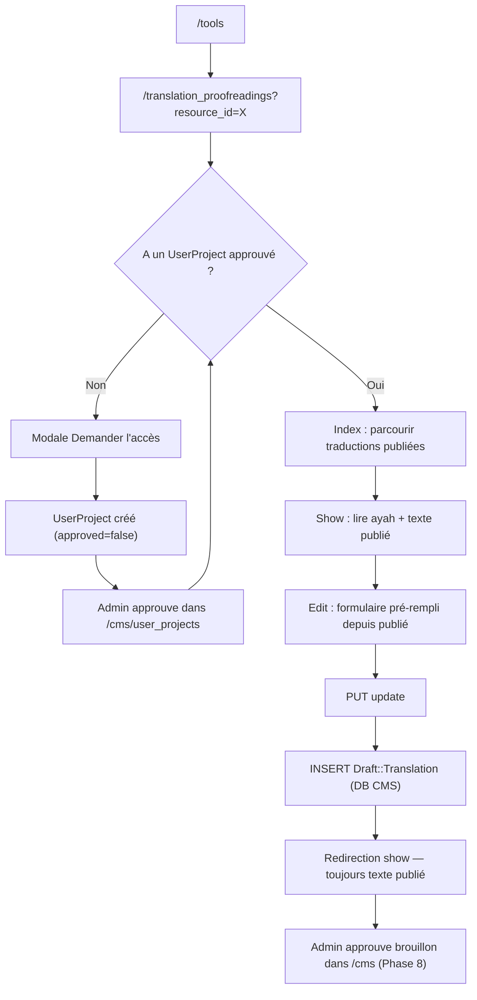

# Phase 9 — Flux runtime core (édition d'une ressource)

> **Série d'onboarding :** tu apprends QUL étape par étape.  
> **Prérequis :** [Phases 1–8](phase-01-what-is-qul.md)  
> **Ce fichier :** ce qui se passe au runtime quand un contributeur édite une ressource. Du clic navigateur à l'écriture en base.

---

## Périmètre

On trace la **relecture de traduction ayah**. C'est l'exemple le plus clair du modèle contributeur QUL :

- **Lire** le contenu publié depuis la DB Quran
- **Écrire** les suggestions dans la DB CMS comme brouillons
- **Ne jamais** changer le texte publié dans la session contributeur

Ensuite on compare **l'édition layout mushaf**. Ce modèle écrit directement dans la DB Quran. Pas de brouillon.

---

## URLs et routes

**On sait :** `config/routes.rb` :

```ruby
resources :translation_proofreadings, except: :destroy
```

| Action | URL | `params[:id]` signifie |
|---|---|---|
| `index` | `/translation_proofreadings?resource_id=131` | — |
| `show` | `/translation_proofreadings/:id?resource_id=131` | **`verse_id`** (pas l'id translation) |
| `edit` | `/translation_proofreadings/:id/edit?resource_id=131` | `verse_id` |
| `update` | `PUT /translation_proofreadings/:id?resource_id=131` | `verse_id` |

**Piège :** `:id` dans le chemin est la **clé primaire du verset**, pas `Translation#id`. Le contrôleur scope toujours par `resource_content_id` + `verse_id`.

**On sait :** Repli `resource_id` par défaut si absent :

```ruby
params[:resource_id] ||= 131  # hard-coded default translation
```

---

## Vue d'ensemble du cycle de vie



---

## Phase 0 — Découvrir l'outil

| Étape | Ce qui se passe |
|---|---|
| L'utilisateur visite `/tools` | `CommunityController#tools` → `ToolsHelper#developer_tools` |
| Clique « Ayah translation… » | Va vers `translation_proofreadings_path` (ressource par défaut) |
| Page charge | `TranslationProofreadingsController#index` |

### Pile contrôleur

```text
TranslationProofreadingsController < CommunityController < ApplicationController
```

**Hérité de `CommunityController` :**

- `init_presenter` (surchargé vers `TranslationPresenter`)
- `load_resource_access` (surchargé)
- `authorize_access!` pour actions protégées

**Hérité de `ApplicationController` :**

- Session Devise (`current_user`)
- `set_paper_trail_whodunnit` (définit whodunnit pour PaperTrail sur le chemin publication — pas utilisé à la création brouillon)
- Pagy pour pagination index
- Protection CSRF

---

## Phase 1 — Index (parcours, pas d'auth requise)

### Requête

```http
GET /translation_proofreadings?resource_id=131&filter_chapter=2&query=merciful
```

### Contrôleur (`#index`)

```ruby
@ayah_translations = ResourceContent.translations.one_verse  # options dropdown
translations = Translation.includes(:verse, :foot_notes)
                  .where(resource_content_id: @resource.id)
# + filtre chapitre, filtre verset, text_search, pagy
```

### Ce qui est lu

| Modèle | DB | Table |
|---|---|---|
| `ResourceContent` | Quran | `resource_contents` |
| `Translation` | Quran | `translations` |
| `Verse` | Quran | `verses` |

### Vue (`index.html.erb`)

- Sélecteur ressource (contrôleur Stimulus `select2`)
- Filtres chapitre/verset (`shared/filters`)
- Table de `translation.text` **publié** avec liens Edit/Show
- Le lien Edit fonctionne seulement après auth + accès (bouton toujours visible ; protégé sur l'action edit)

### Rôle du presenter ici

`TranslationPresenter#page_title` → `"Ayah Translation Proofreading"`  
`meta_title`, `meta_description` pour SEO via `SeoHelper`.

**On pense :** Les presenters sont légers pour cet outil — surtout titres/SEO. Le chargement des données est dans le contrôleur (il y a même un `# TODO: use presenter to load the translation` sur `#show`).

---

## Phase 2 — Porte d'accès

### Sans accès

`tools/header_alert/_ayah_translation.html.erb` s'affiche quand `@access` est falsy :

- Explique l'outil
- **« Request Access »** → modale AJAX → `new_user_project_path(resource_id: @resource.id)`

### Flux demande d'accès

```text
GET  /user_projects/new?resource_id=X&modal=true  (layout: false, modal)
POST /user_projects
  → UserProjectsController#create
  → UserProject (DB CMS, approved: false)
  → Admin approuve dans /cms/user_projects
```

**On sait :** Validations `UserProject` : raison, maîtrise de la langue, motivation, reconnaissance de relecture.

### Vérification d'accès (`ApplicationController#can_manage?`)

```ruby
if current_user.is_super_admin?
  AdminProjectAccess.new          # always truthy, no admin_notes
elsif current_user.is_audio_annotator? && resource.recitation?
  AdminProjectAccess.new
else
  current_user.user_projects.find_by(resource_content_id: resource.id)
  # must be approved?
end
```

Stocké dans `@access` via `load_resource_access`.

### Actions protégées

```ruby
before_action :authenticate_user!, only: %i[edit update]
before_action :authorize_access!, only: %i[edit update]
```

`authorize_access!` redirige vers la racine avec notice si `@access` est nil.

**On sait :** `show` et `index` sont **publics** (lecture traductions publiées). Seuls edit/update nécessitent connexion + approbation projet.

---

## Phase 3 — Show (lire un ayah)

### Requête

```http
GET /translation_proofreadings/255?resource_id=131
```

(`255` = `verse_id` pour 2:255)

### Contrôleur (`#show`)

```ruby
@translation = Translation
  .includes(:verse, :foot_notes)
  .where(resource_content_id: @resource.id)
  .find_by_verse_id(params[:id])
```

### Couches vue

| Partial | Contenu |
|---|---|
| `tools/header` | Titre, fil d'Ariane, bouton Edit (si `@access`), sélecteur de vue |
| `shared/access_message` | Notes admin du `UserProject` approuvé |
| `_ayah_view` | Arabe `verse.text_qpc_hafs` + HTML traduction publiée |
| `_page_view`, etc. | Dispositions relecture alternatives (page, PDF) |

### Stimulus sur show

`_ayah_view.html.erb` :

```html
data-controller="translation-footnote"
```

`translation_footnote_controller.js` décore les marqueurs `<sup foot_note="N">` inline.

**Ce que voit l'utilisateur :** `Translation.text` publié — inchangé depuis la dernière approbation/export admin.

---

## Phase 4 — Edit (préparation formulaire)

### Requête

```http
GET /translation_proofreadings/255/edit?resource_id=131
```

Nécessite connexion + `@access`.

### Contrôleur (`#edit`)

```ruby
@translation = Translation...find_by_verse_id(params[:id])
@draft_translation = @translation.build_draft
```

### `build_draft` — en mémoire uniquement, pas d'écriture DB encore

```ruby
# app/models/translation.rb
draft = draft_translations.build
draft.current_text = text          # snapshot of published
draft.draft_text = text            # editable starting point
draft.verse = verse
# + draft foot_notes imbriqués depuis lignes FootNote publiées
```

### Vue (`edit.html.erb`)

```erb
form_with model: @draft_translation,
          url: translation_proofreading_path(@translation.verse.id, resource_id: @resource.id),
          method: :put,
          data: { controller: 'remote-form' }
```

Champs :

- `draft_translation[draft_text]` — textarea principal
- `draft_translation[foot_notes_attributes][][draft_text]` — éditions par note de bas de page
- `foot_note_id` caché pour lier aux notes de bas de page publiées

Classe CSS langue sur textarea : `class="w-full #{lang}"` pour typographie RTL/LTR.

---

## Phase 5 — Soumission (l'écriture critique)

### Requête

```http
PUT /translation_proofreadings/255?resource_id=131

draft_translation[draft_text]=...
draft_translation[foot_notes_attributes][0][draft_text]=...
draft_translation[foot_notes_attributes][0][foot_note_id]=42
```

Formulaire Rails standard + token CSRF. Turbo peut intercepter via le contrôleur `remote-form` (validation HTML5 côté client, désactivation champs pendant soumission).

### Contrôleur (`#update`)

```ruby
@translation = Translation.where(resource_content_id: @resource.id)
                         .find_by_verse_id(params[:id])

if @translation.save_suggestions(translation_params, current_user)
  redirect_to translation_proofreading_path(...), notice: 'Your suggestions are saved successfully'
end
```

### `save_suggestions` — ce qui est réellement écrit

```ruby
# app/models/translation.rb
draft_translation = Draft::Translation.new(params)   # NEW row every submit
draft_translation.resource_content_id = resource_content_id
draft_translation.current_text = text                # published snapshot
draft_translation.text_matched = draft_text == text
draft_translation.verse = verse
draft_translation.need_review = true
draft_translation.user = user
draft_translation.save(validate: false)
```

| Champ | Valeur | Signification |
|---|---|---|
| `draft_text` | Édition utilisateur | Texte proposé |
| `current_text` | `translation.text` publié au moment de la soumission | Baseline de diff |
| `text_matched` | `draft_text == current_text` | Détection no-op |
| `need_review` | `true` | En file pour admin |
| `imported` | `false` (défaut) | Pas encore fusionné |
| `user_id` | `current_user.id` | Attribution |
| `verse_id` | Depuis la route | Identité ayah |

**Base de données :** table `draft_translations` dans **PostgreSQL CMS** (`ApplicationRecord`).

### Normalisation texte

`Draft::Translation#draft_text=` exécute `Utils::TextFormatter` — supprime les espaces superflus autour des balises `<sup` de notes de bas de page.

### Ce qui ne se passe PAS à la soumission

| Attendu par les nouveaux | Réalité |
|---|---|
| `Translation.text` mis à jour | **Non** — DB Quran intacte |
| `DownloadableResource` rafraîchi | **Non** |
| Version PaperTrail sur `Translation` | **Non** — le brouillon n'a pas `has_paper_trail` |
| Job Sidekiq enqueue | **Non** |
| Email aux admins | **Non** (sauf monitoring séparé existant) |

Après redirection, **la page show affiche toujours le texte publié** depuis `Translation`, pas le brouillon.

---

## Phase 6 — Après soumission (passation admin)

Le travail du contributeur se termine. La Phase 8 couvre la fusion admin :

```text
/cms/draft_translations?q[resource_content_id_eq]=131
  → revoir flags need_review, text_matched
  → Approve and update (unique) OU ApproveDraftTranslationJob en masse
  → Ligne Translation mise à jour dans DB Quran
  → (séparément) Rafraîchir téléchargements sur DownloadableResource
```

---

## Diagramme pile runtime

```text
Browser
  │
  ├─ layout: application.html.erb (Turbo, Tailwind, bundle Stimulus)
  ├─ tools/_header.html.erb (fil d'Ariane, modale aide, alerte accès)
  │
  ├─ GET index/show ──► TranslationProofreadingsController
  │                      ├─ find_resource → ResourceContent (DB Quran)
  │                      ├─ Requête Translation (DB Quran)
  │                      └─ TranslationPresenter (titres SEO)
  │
  └─ PUT update ──────► TranslationProofreadingsController#update
                           └─ Translation#save_suggestions
                                └─ Draft::Translation#create (DB CMS)
                                     └─ Draft::FootNote#create (imbriqué)
```

---

## Mécaniques frontend (traduction pour ingénieur React)

| Concept Rails | Cet outil |
|---|---|
| État SPA | Aucun — chargements page complets + Turbo |
| Lib formulaire | `form_with` → Rails UJS/Turbo |
| Validation client | Stimulus `remote-form` (HTML5 `checkValidity`) |
| Texte riche | `<textarea>` simple — notes de bas de page utilisent HTML `<sup foot_note="id">` |
| Bibliothèque composants | Partials ERB, pas React |
| Modale | Stimulus `ajax-modal` pour demande d'accès + aide |
| Dropdown select | Stimulus `select2` sur sélecteur ressource |

**On sait :** jQuery est encore utilisé dans certains contrôleurs Stimulus (`remote_form_controller.js` utilise `$()`).

---

## Contraste : layout mushaf (modèle écriture directe)

Tous les outils n'utilisent pas les brouillons.

```ruby
# MushafLayoutsController#save_page_mapping
@mushaf_page.attributes = params_for_page_mapping
@mushaf_page.save(validate: false)   # writes MushafPage directly (Quran DB)
```

| Aspect | Relecture traduction | Layouts mushaf |
|---|---|---|
| Auth | `UserProject` par ressource | Même modèle |
| Cible d'écriture | `Draft::Translation` (CMS) | `MushafPage` (Quran) |
| Publié immédiatement | Non | **Oui** (mapping page) |
| Réponse | Redirection | `turbo_stream` ou redirection |
| Risque si bug | Brouillon faux ; publié sûr | Données publiées fausses |

**On pense :** Modèle brouillon = texte haut volume avec revue éditoriale. Écriture directe = données structurelles/layout avec effet immédiat.

---

## Checklist débogage

Lors du traçage d'un bug contributeur, parcourez cette liste :

### 1. Onglet Network

| Requête | Attendu |
|---|---|
| `PUT .../translation_proofreadings/:verse_id` | Redirection 302 en cas de succès |
| 422 / 500 | Vérifier logs serveur ; `save(validate: false)` échoue rarement en validation |
| 302 vers `/` | `authorize_access!` a échoué — pas de projet approuvé |

### 2. Session

- `current_user` est présent ?
- `user_projects` a `approved: true` pour ce `resource_content_id` ?

### 3. Base de données (après soumission)

```sql
-- CMS DB
SELECT id, verse_id, text_matched, need_review, imported, user_id, created_at
FROM draft_translations
WHERE resource_content_id = 131 AND verse_id = 255
ORDER BY created_at DESC;

-- Quran DB (doit être INCHANGÉE après soumission contributeur)
SELECT text FROM translations
WHERE resource_content_id = 131 AND verse_id = 255;
```

### 4. Points de confusion courants

| Symptôme | Cause probable |
|---|---|
| « Mon édition n'a pas été sauvegardée » | Regard de la page show — elle affiche le texte **publié**, pas le brouillon |
| Bouton Edit manquant | Pas de `@access` — besoin d'un `UserProject` approuvé |
| Plusieurs lignes brouillon par ayah | **On sait :** pas d'index unique sur `(resource_content_id, verse_id)` ; chaque soumission crée une **nouvelle** ligne |
| Marqueurs notes de bas de page cassés | Format HTML `<sup foot_note="id">` requis ; voir constantes regex `Draft::Translation` |

---

## Liste permit params (frontière sécurité)

```ruby
params.require(:draft_translation).permit(
  :draft_text,
  foot_notes_attributes: %i[id _destroy draft_text foot_note_id]
)
```

**On pense :** Les strong params empêchent l'assignation en masse de `imported`, `need_review`, etc. — ceux-ci sont définis côté serveur dans `save_suggestions`.

---

## PaperTrail et attribution

| Modèle | Versioning |
|---|---|
| `Translation` | `has_paper_trail on: :update` — se déclenche à l'**approbation admin**, pas au brouillon contributeur |
| `Draft::Translation` | Pas de PaperTrail ; inclut `PaperTrailAttribution` pour `import!` uniquement |
| Soumission contributeur | Aucune ligne d'audit créée |

**On sait :** `ApplicationController#set_paper_trail_whodunnit` définit `whodunnit` à `current_user.to_gid` pour les requêtes qui déclenchent PaperTrail.

---

## Incertitudes

| # | Question | Label |
|---|---|---|
| 1 | Comment les admins choisissent parmi plusieurs lignes brouillon pour le même `verse_id` | **On pense** — le job en masse importe tous les `imported: false` ; la dernière écriture par lot gagne par verset |
| 2 | Si les contributeurs sont notifiés quand les brouillons sont approuvés | **On ne sait pas** — aucun mailer trouvé sur ce chemin |
| 3 | Pourquoi `resource_id` par défaut est codé en dur `131` | **On ne sait pas** — probablement une traduction anglaise bien connue pour démo |
| 4 | Si `save_suggestions` devrait upsert au lieu d'insérer toujours | **On pense** — le comportement actuel permet l'historique d'édition via plusieurs lignes brouillon |

---

## Résumé Phase 9

Runtime édition contributeur en une ligne :

```text
Read Translation (DB Quran) → form → save_suggestions → INSERT Draft::Translation (DB CMS) → redirect → affiche toujours texte publié
```

L'écart entre **suggestion** et **publication** est le design central. Ton travail en tant que développeur d'outils contributeur : ne jamais appeler `translation.update` depuis les contrôleurs contributeur sauf si tu changes délibérément l'architecture.

---

## Arrêt ici — questions avant la Phase 10

La Phase 10 approfondit le **pipeline d'import** (`lib/importer/`, QuranEnc, correspondance par `verse_key`).

1. Après soumission d'un contributeur, quelle table interroger pour vérifier l'écriture — `translations` ou `draft_translations` ?
2. Pourquoi `show` est public mais `edit` protégé ?
3. En quoi la sauvegarde page mushaf différerait de la relecture traduction en termes de ce que voient immédiatement les consommateurs ?

Réponds avec tes questions, ou dis **« proceed »** pour la **Phase 10 — Pipeline d'import**.

---

*Version A2 — français simple. Généré pendant l'onboarding contributeur QUL.*
