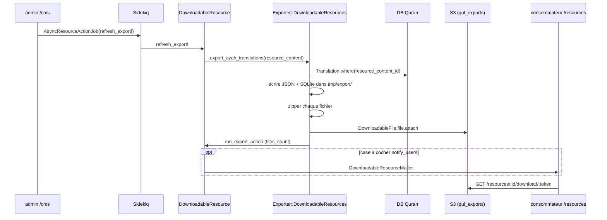

# Phase 11 — Pipeline d'export

> **Série d'onboarding :** tu apprends QUL étape par étape.  
> **Prérequis :** [Phases 1–10](phase-01-what-is-qul.md)  
> **Ce fichier :** comment le contenu Quran publié devient les fichiers JSON/SQLite téléchargeables depuis `/resources`.

---

## Principe central

**On sait :** Le produit public est des **artefacts d'export versionnés**, pas l'accès base de données live. L'export lit les lignes **publiées** depuis la DB Quran. Il les sérialise en fichiers. Il les zippe. Il les upload sur S3 via Active Storage. Il les enregistre sur `DownloadableResource` dans la DB CMS.

```text
Translation / Tafsir / … (DB Quran, publié)
    → lib/exporter/* (sérialiser)
    → tmp/export/*.{json,sqlite}
    → zip
    → DownloadableFile → Active Storage (:qul_exports → S3)
    → GET /resources → redirection token → URL S3
```

L'import écrit des brouillons. L'export lit le contenu publié. Ils se rejoignent seulement après approbation admin (Phases 8–10).

---

## Deux systèmes d'export (ne pas les confondre)

| Système | Déclencheur | Emplacement sortie | Audience |
|---|---|---|---|
| **Catalogue public** (`refresh_export!`) | `/cms/downloadable_resources` → Refresh downloads | S3 via `DownloadableFile` | Tous sur `/resources` |
| **Admin ad-hoc** (`ExportTranslationJob`, `Export::TranslationJob`) | Export sidebar `ResourceContent` | `tmp/exported_databases`, pièce jointe email, `ResourceContent#sqlite_database` | Débogage opérateur / dumps mobile legacy |

**On pense :** En tant que contributeur, tu te soucies de **`refresh_export!`** — pas des jobs export sidebar.

---

## Orchestrateur : `Exporter::DownloadableResources`

Fichier : `lib/exporter/downloadable_resources.rb` (~920 lignes)

### Points d'entrée

```ruby
# Console (ré-export complet de tout — lourd)
s = Exporter::DownloadableResources.new
s.export_all

# Ressource unique (chemin production)
DownloadableResource#refresh_export!
  → s.export_ayah_translations(resource_content: ...)
  # (ou export_tafsirs, export_mushaf_layouts, etc. selon resource_type)
```

### Catégories `export_all`

Appelle, dans l'ordre : infos sourate, tafsirs, traductions ayah, translittérations, traductions mot, topics, thèmes ayah, récitations (surah/ayah/wbw), scripts quran, scripts qirat, métadonnées, layouts mushaf, ayah similaire, mutashabihat, morphologie, polices.

**On sait :** `export_all` est documenté en haut du fichier pour usage console. **On pense :** Les rafraîchissements production sont par ressource via Sidekiq, pas `export_all` nocturne.

---

## Flux rafraîchissement public



### Code déclencheur

```ruby
# app/admin/downloads/downloadable_resource.rb
AsyncResourceActionJob.perform_later(resource, :refresh_export!, send_update_email: notify)

# app/models/downloadable_resource.rb
def refresh_export!(send_update_email = true)
  s = Exporter::DownloadableResources.new
  case resource_type
  when 'translation'
    s.export_ayah_translations(resource_content: resource_content)  # if one_ayah?
  # … 14 resource types
  end
  notify_users if send_update_email
end
```

---

## Approfondissement : export traduction

### Préconditions (`export_ayah_translations`)

```ruby
list = ResourceContent.translations.one_verse.approved

list.each do |content|
  next if !content.allow_publish_sharing?
  next if content.is_transliteration?
  # …
end
```

| Porte | Signification |
|---|---|
| `approved` | Flag éditorial ResourceContent |
| `allow_publish_sharing?` | `ResourcePermission` autorise partage public (ou pas de ligne permission) |
| cardinalité `one_verse` | Traductions ayah par ayah uniquement dans cet exporteur |
| Pas translittération | Routé vers `export_ayah_transliteration` à la place |

### Étapes par ressource

1. `Exporter::ExportTranslation.new(resource_content:, base_path: "tmp/export/translations")`
2. Trouver ou créer `DownloadableResource` (`resource_type: 'translation'`, `cardinality_type: '1_ayah'`)
3. Définir nom, langue, tags (`language_name`, `With Footnotes` si applicable)
4. Générer fichiers → `create_download_file` pour chaque variante

### Variantes de fichiers (traductions avec notes de bas de page)

| `file_type` sur `DownloadableFile` | Format | Description |
|---|---|---|
| `simple.json` / `simple.sqlite` | Texte brut par ayah | Notes de bas de page retirées |
| `translation-with-footnote-tags.json` | HTML avec `<sup>` préservé | Balises conservées |
| `translation-with-inline-footnote.json` | Notes de bas de page inline comme `[[text]]` | |
| `translation-text-chunk.json` | Chunks structurés `{t: [...], f: {...}}` | Formatage riche |
| Variantes `.sqlite` correspondantes | Mêmes formes en tables SQLite | |

Les ressources **sans** notes de bas de page obtiennent seulement `simple.json` + `simple.sqlite`.

### Forme JSON (simple)

```json
{
  "2:255": "Allah - there is no deity except Him...",
  "2:256": "There shall be no compulsion in religion..."
}
```

**On sait :** Les clés sont des chaînes `verse_key` (`"surah:ayah"`), indexées depuis `Translation.verse_key`.

### Forme JSON (chunks — utilisée par certaines apps)

```json
{
  "2:255": {
    "t": ["chunk1", {"type": "b", "text": "bold part"}, "chunk2"],
    "f": {"1": "footnote text"}
  }
}
```

Produit par `Exporter::AyahTranslation#export_chunks` via parsing HTML Nokogiri.

### Schéma SQLite (simple)

```sql
CREATE TABLE translation (
  sura INTEGER,
  ayah INTEGER,
  ayah_key TEXT,
  text TEXT
);
```

Avec notes de bas de page : colonne supplémentaire `footnotes TEXT` (objet JSON).

**On sait :** Les noms de colonnes utilisent `sura`/`ayah` dans les exports SQLite (la doc consommateur référence `surah_id`/`ayah_number` — mêmes entiers, noms différents).

### Requête source de données

```ruby
# lib/exporter/export_translation.rb
Translation
  .where(resource_content_id: resource_content.id)
  .order('verse_id ASC')
  .in_batches(of: 1000)
```

Lit **uniquement** les lignes DB Quran publiées. Les ayahs manquants sont simplement omis de l'export.

---

## `create_download_file` — attacher au catalogue

```ruby
def create_download_file(downloadable_resource, file_path, file_type, file_name = nil)
  file = DownloadableFile.where(
    downloadable_resource_id: resource.id,
    file_type: file_type,
  ).first_or_initialize

  zipped = zip(file_path)                    # always zip before upload

  file.file.attach(
    io: File.open(zipped),
    filename: File.basename(zipped),
    key: QulExportedFileKeyGenerator.generate_key(zipped, resource)
  )

  file.save(validate: false)
  resource.run_export_action                 # updates files_count
end
```

### Format clé objet S3

```ruby
# lib/qul_exported_file_key_generator.rb
"qul-exports/#{resource_type}/#{timestamp}-#{random}-#{basename}.#{ext}"
# e.g. qul-exports/translation/1694567890-abc12-en-sahih-simple.json.zip
```

### Service Active Storage

```ruby
# app/models/downloadable_file.rb
has_one_attached :file, service: Rails.env.development? ? :local : :qul_exports
```

**On sait :** `config/storage.yml` `qul_exports` utilise les variables env `QUL_STORAGE_*` avec `public: true` et cache control 1 an.

### Identité `DownloadableFile`

- Une ligne par `(downloadable_resource_id, file_type)` — le rafraîchissement **remplace** la pièce jointe sur la même ligne
- `token` généré à la création — utilisé dans l'URL de téléchargement public
- `download_count` suivi par utilisateur

---

## Chemin téléchargement consommateur

```ruby
# app/controllers/resources_controller.rb
def download
  file = DownloadableFile.find_by(token: params[:token])
  file.track_download(current_user)
  redirect_to file.file.url, allow_other_host: true   # → S3 presigned/public URL
end
```

Le catalogue public affiche seulement les ressources `DownloadableResource.published`.

---

## Carte des classes exporteur

| Classe | Types ressource | Sortie |
|---|---|---|
| `ExportTranslation` | traduction ayah | Variantes JSON + SQLite |
| `ExportTafsir` | tafsir | JSON + SQLite avec groupement ayah |
| `ExportTransliteration` | translittération | JSON + SQLite |
| `ExportWordTranslation` | traduction mot par mot | JSON + SQLite |
| `ExportSurahRecitation` / `ExportAyahRecitation` / `ExportWordRecitation` | manifestes audio | JSON |
| `ExportQuranAyahScript` / `ExportQuranWordScript` | scripts arabes | JSON + SQLite |
| `ExportMushafLayout` | layouts mushaf | JSON/SQLite + assets layout |
| `ExportQuranicMorphology` | morphologie | JSON + SQLite |
| `ExportFont` | polices | ttf/otf/woff/svg |
| `ExportSurahInfo` | infos sourate | CSV + JSON + SQLite |
| `ExportMutashabihat` / `ExportMatchingAyah` | ayah similaire | JSON + SQLite |
| `ExportQuranMetaData` | métadonnées | JSON + SQLite |
| `BaseExporter` | partagé | Helpers SQLite, `write_json`, `fix_file_name` |

Tous orchestrés depuis les méthodes `DownloadableResources` correspondant à `DownloadableResource::RESOURCE_TYPES`.

---

## Export tafsir (différence de groupement)

`ExportTafsir` itère **chaque verset** mais résout les blocs tafsir groupés :

```ruby
tafsir = Tafsir.for_verse(verse, resource_content)
# JSON keyed by verse_key, value includes group range + text
```

**On pense :** Une entrée tafsir peut couvrir plusieurs ayahs. L'export duplique la référence de groupe par clé verset pour commodité de lookup.

---

## Portes permission & publication

| Vérification | Où | Effet |
|---|---|---|
| `ResourceContent.approved` | scope exporteur | Ressources non approuvées ignorées |
| `allow_publish_sharing?` | `export_ayah_translations` | Ressources bloquées copyright ignorées |
| `DownloadableResource.published` | `ResourcesController` | Masqué du catalogue public |
| `can :refresh_downloads` | ability admin | Seuls les admins déclenchent l'export |

```ruby
# ResourceContent#allow_publish_sharing?
permission.blank? || permission.share_permission_is_granted? || permission.share_permission_is_unknown?
```

---

## Notifier les abonnés

Quand le rafraîchissement s'exécute avec `notify_users: true` :

```ruby
UserDownload.where(downloadable_file_id: downloadable_files.pluck(:id))
  → DownloadableResourceMailer.new_update(resource, user, change_log)
```

**On sait :** Seuls les utilisateurs qui ont précédemment téléchargé **un fichier** sur cette ressource reçoivent un email.

---

## Exports admin ad-hoc (chemin secondaire)

### `ExportTranslationJob`

- Construit SQLite FTS3 (`verses` virtual table) — schéma mobile legacy
- Compresse Bzip2 → `UploadTranslationDbJob` attache à `ResourceContent#sqlite_database` (service `:database_backups`)
- Email opérateur via `DeveloperMailer`

### `Export::TranslationJob`

- Écrit dans `public/exported_translations/`
- Formats : nested array (tableaux par sourate) ou JSON text-chunks
- Email opérateur en production

**On pense :** Ces chemins supportent Tarteel mobile / outillage interne — pas le catalogue zip `/resources`.

---

## Détail encodage JSON

Les exports utilisent `JsonNoEscapeHtmlState` lors de la génération JSON :

```ruby
JSON.generate(data, { state: JsonNoEscapeHtmlState.new })
```

**On pense :** Préserve les entités HTML et Unicode dans le texte de traduction sans sur-échappement — important pour le balisage arabe/HTML notes de bas de page dans les consommateurs JSON.

---

## Nommage fichiers

```ruby
# ResourceContent#sqlite_file_name
slug || english translated name || name
  → parameterize → "en-sahih", "ur-junagarhi", etc.
```

`ExportService::TRANSLATION_NAME_MAPPING` fournit des surcharges slug canoniques pour les IDs traduction bien connus (utilisé par les jobs export ad-hoc).

---

## Cycle de vie `tmp/export/`

```text
tmp/export/translations/en-sahih-simple.json
tmp/export/translations/en-sahih-simple.json.zip   ← uploaded
# source .json may remain on disk until cleaned
```

**On pense :** `export_all` commence par `FileUtils.rmdir("tmp/export")` — l'export complet efface d'abord le répertoire temp.

---

## Checklist bout en bout (opérateur)

Après publication de nouveau contenu traduction :

1. Vérifier lignes `Translation` dans DB Quran (`/cms/translations?resource_content_id_eq=X`)
2. Confirmer `ResourceContent.approved` et `allow_publish_sharing?`
3. `/cms/downloadable_resources/:id` → **Refresh downloads**
4. Attendre job Sidekiq (`AsyncResourceActionJob`)
5. Vérifier lignes `DownloadableFile` ont des pièces jointes mises à jour
6. Visiter `/resources/translation/:slug` → télécharger `simple.json.zip`
7. Optionnellement notifier abonnés

**On sait :** L'approbation brouillons (Phase 8) **ne déclenche pas** automatiquement l'étape 3.

---

## Relation aux autres phases

| Phase | Connexion |
|---|---|
| **8 — CMS** | Emplacement bouton `refresh_export!` |
| **9 — Runtime** | Les éditions contributeur ne touchent pas l'export jusqu'à approbation + rafraîchissement |
| **10 — Import** | Import → brouillons ; export → publié uniquement |
| **12+ — Domaine** | Morphologie/mushaf/audio ont des classes exporteur dédiées |

---

## Incertitudes

| # | Question | Label |
|---|---|---|
| 1 | `export_all` est-il exécuté selon un planning en production ? | **On ne sait pas** — pas dans le scheduler du dépôt ; rafraîchissement par ressource uniquement |
| 2 | Upload CDN direct (`UploadToCdn`) vs Active Storage pour traductions | **On pense** — le catalogue utilise Active Storage ; `UploadToCdn` utilisé pour segments audio/manifestes |
| 3 | Si le flag `published` sur `DownloadableResource` bascule auto à l'export | **On pense** — `run_export_action` définit `published` à true si nil |
| 4 | Stabilité exacte URL S3 entre rafraîchissements | **On pense** — nouvelle clé objet à chaque rafraîchissement (timestamp dans clé) ; URL token sur QUL reste stable |

---

## Résumé Phase 11

```text
Lignes Quran publiées
  → Exporter::* (par resource_type)
  → tmp/export → zip
  → DownloadableFile (CMS) → S3
  → token téléchargement /resources
```

La couche export est le **contrat public**. Si le JSON est faux, trace : contenu DB Quran → classe exporteur → variante `file_type` → pas les tables brouillon import.

---

## Arrêt ici — questions avant la Phase 12

La Phase 12 couvre **morphologie / données linguistiques arabes** — une catégorie de ressource spécialisée avec ses propres modèles et exporteur.

1. Si `/resources` affiche du JSON obsolète mais `/cms/translations` montre le texte correct, quelle action admin unique corrige cela ?
2. Quelle est la différence entre `simple.json` et `translation-text-chunk.json` ?
3. Pourquoi les exports sont zippés avant upload S3 ?

Réponds avec tes questions, ou dis **« proceed »** pour la **Phase 12 — Morphologie / données linguistiques arabes**.

---

*Version A2 — français simple. Généré pendant l'onboarding contributeur QUL.*
