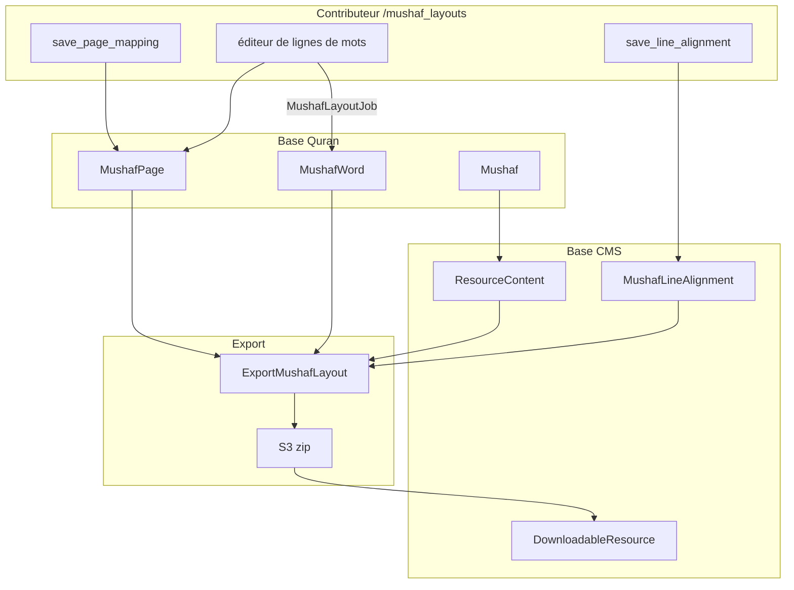

# Phase 13 — Mises en page mushaf

> **Série d'intégration :** tu apprends QUL étape par étape.  
> **Prérequis :** [Phases 1–12](phase-01-what-is-qul.md)  
> **Ce fichier :** comment QUL modèle les pages imprimées du mushaf (Coran en livre).

---

## Qu'est-ce qu'une mise en page mushaf ?

La plupart des ressources QUL répondent à **« quel est le contenu ? »**  
Exemples : texte de traduction, URL audio, racine d'un mot.

Les mises en page mushaf répondent à **« comment cette page est imprimée ? »**

| Champ | Signification |
|---|---|
| `page_number` | Numéro de page (souvent 1–604) |
| `line_number` | Numéro de ligne sur la page |
| `line_type` | `ayah`, `surah_name`, ou `basmallah` |
| `is_centered` | Ligne centrée ou justifiée |
| `first_word_id` / `last_word_id` | Plage de mots sur cette ligne |
| `surah_number` | Pour les lignes `surah_name` |

**On sait :** Tutoriel officiel : `app/views/docs/markdown/tutorial-mushaf-layout-end-to-end.md`

Les apps combinent **mushaf-layout** + **quran-script** (mot par mot) + **font** (police).  
Elles affichent une page fidèle au livre imprimé.

---

## Entités principales

```text
ResourceContent (sub_type: layout, cardinality: 1_page)
  └── Mushaf (lines_per_page, pages_count, default_font_name)
        ├── MushafPage (page_number, first/last word & verse, verse_mapping JSON)
        ├── MushafWord (per-word line/page position in THIS layout)
        └── MushafLineAlignment (surah_name / bismillah / center lines)  [CMS DB — see below]
```

| Modèle | Classe de base | Table | Rôle |
|---|---|---|---|
| `Mushaf` | `QuranApiRecord` | `mushafs` | Édition (Indopak 15 lignes, QPC v2, etc.) |
| `MushafPage` | `QuranApiRecord` | `mushaf_pages` | Limites de page + cartographie des ayahs |
| `MushafWord` | `QuranApiRecord` | `mushaf_words` | Position de chaque mot sur la page |
| `MushafLineAlignment` | `ApplicationRecord` | `mushaf_line_alignments` | Lignes spéciales (titre sourate, basmallah) |
| `Word` | `QuranApiRecord` | `words` | Identité du mot (`location`, `word_index`) |

**Important maintenant :** `MushafLineAlignment` est dans la **base CMS** (`db/schema.rb`).  
`Mushaf`, `MushafPage` et `MushafWord` sont dans la **base Quran**.  
Le code les joint par `mushaf_id` + `page_number`. Il n'y a pas de clé étrangère entre les deux bases.

---

## Lier Mushaf ↔ ResourceContent

```ruby
# ResourceContent
scope :mushaf_layout, -> { where(sub_type: SubType::Layout) }

def get_mushaf_id
  meta_value('mushaf') || resource_id || Mushaf.where(resource_content_id: id).first&.id
end
```

**On sait :** `Mushaf` crée et lie l'enveloppe catalogue après création (`after_create :attach_resource_content`).

**On sait :** L'exportateur trouve le mushaf ainsi :

```ruby
Mushaf.find_by(resource_content_id: resource_content.id) || resource_content.resource
```

Catalogue public : `/resources/mushaf-layout` → `resource_type: 'mushaf-layout'`, `cardinality_type: '1_page'`.

---

## Clés pour le rendu

| Clé | Exemple | Utilisé pour |
|---|---|---|
| `page_number` | `604` | Navigation page par page |
| `word.location` | `"2:255:1"` | Jointure avec Quran Script |
| `word.word_index` | global 1..77429 | **Export `first_word_id`/`last_word_id`** |
| `words.id` | PK interne | `MushafWord.word_id`, éditeur |

**Détail important pour l'export :**

```ruby
# lib/exporter/export_mushaf_layout.rb
range_start = words.first.word_index   # NOT words.id
range_end = words.last.word_index
```

**On pense :** Dans le SQLite téléchargé, `first_word_id`/`last_word_id` pointent vers **`words.word_index`**.  
Le nom de colonne est trompeur. Vérifie ton dump en Phase 17.

**On pense :** `MushafPage.first_verse_id` vient de `word.verse_id` dans `MushafLayoutJob`.  
Certaines requêtes utilisent `verse_index`. On suppose `verse_id == verse_index` en production (Phase 5).

---

## Outil contributeur : `/mushaf_layouts`

Listé sur `/tools` sous **« Mushaf layouts »**.  
Tu peux relire et corriger les mises en page.

### Routes

```ruby
resources :mushaf_layouts, except: [:destroy, :new] do
  member do
    put :save_page_mapping      # set first/last ayah on page
    put :save_line_alignment    # mark surah name / bismillah / center
  end
end
```

| URL | Action |
|---|---|
| `/mushaf_layouts` | Index — tous les mushafs |
| `/mushaf_layouts/:id?page_number=N` | Afficher une page (ou `?compare=` pour comparer) |
| `/mushaf_layouts/:id/edit?page_number=N` | Éditeur glisser-déposer (auth requise) |
| `PUT .../save_page_mapping` | Mettre à jour les limites d'ayah |
| `PUT .../save_line_alignment` | Changer l'alignement de ligne |

### Accès

Même règle que la relecture de traduction :

- `UserProject` approuvé pour le `ResourceContent`
- `can_manage?(@resource)` — les super admins passent toujours
- **Écriture directe** — pas de brouillon (contrairement à Phase 9)

---

## Flux : édition d'une page

### 1. Cartographie de page (`save_page_mapping`)

```ruby
@mushaf_page.attributes = params_for_page_mapping  # first_verse_id, last_verse_id
@mushaf_page.save(validate: false)
```

Les paramètres convertissent les clés d'ayah via `Utils::Quran.get_ayah_id_from_key`.  
On enregistre la plage de versets pour la page.

Répond avec `turbo_stream` ou redirection.

### 2. Alignement de ligne (`save_line_alignment`)

```ruby
MushafLineAlignment.first_or_initialize(mushaf_id, page_number, line_number)
# alignment: center | bismillah | surah_name
# toggle off = clear! (destroy row)
```

Les lignes spéciales n'ont pas de mots d'ayah.  
L'export les marque comme `line_type: surah_name` ou `basmallah`.

### 3. Mise en page des mots (`update` → `MushafLayoutJob`)

Le contributeur assigne chaque mot à une ligne :

```ruby
MushafLayoutJob.perform_now(mushaf_id, page_number, layout_params.to_json)
```

Logique du job (`app/jobs/mushaf_layout_job.rb`) :

```text
For each word_id → line_number in mapping:
  upsert MushafWord (line_number, position_in_line, position_in_page, text from mushaf.text_type_method)
Remove MushafWords on page not in mapping
Recompute MushafPage:
  first_word_id, last_word_id
  first_verse_id, last_verse_id  (from word.verse_id)
  verse_mapping JSON (per-surah ayah ranges on page)
```

**On sait :** `MushafWord` a PaperTrail sur update. Les modifications sont versionnées.

**On sait :** En cas d'échec, le contrôleur écrit un fichier de récupération dans `data/mapping-{mushaf_id}-{page}.json`.

### Colonne texte par mushaf

```ruby
# Mushaf#text_type_method — picks Word column by edition name
'code_v2'           # QPC v2
'code_v1'           # QPC v1
'text_indopak_nastaleeq'  # Indopak editions
'text_uthmani'      # Uthmani
'text_qpc_hafs'     # default
```

Les mushafs à glyphes (`using_glyphs?` pour les ids 1, 2) stockent des codes de police.  
Pas d'arabe en clair.

---

## Mode comparaison

```ruby
# ?compare=<other_mushaf_id>
@compare_mushaf_words = MushafWord.where(mushaf_id: @compared_mushaf.id, page_number: ...)
```

**On pense :** On compare côte à côte avec une mise en page de référence.  
Exemple : nouveau Indopak vs QPC établi.

---

## Pipeline d'export (catalogue public)

### Déclenchement

```ruby
DownloadableResource#refresh_export!
  → Exporter::DownloadableResources#export_mushaf_layouts(resource_content:)
```

Ou admin : `Export::MushafLayoutExportJob` (email en masse — chemin séparé, utilise `lib/export_mushaf_layout.rb`).

### Export par ressource (`Exporter::ExportMushafLayout`)

Trois formats :

| Format | Méthode | Contenu |
|---|---|---|
| **SQLite** | `export_sqlite` | table `info` + table `pages` |
| **JSON** | `export_json` | `info.json` + un JSON par page (`issue #257`) |
| **DOCX** | `export_docs` | Word par page (pas pour les layouts image) |

```ruby
create_download_file(downloadable_resource, json, 'json')    # zips json/ directory
create_download_file(downloadable_resource, sqlite, 'sqlite')
create_download_file(downloadable_resource, docx, 'docx')   # unless name includes 'image'
```

### Schéma SQLite `pages`

```sql
CREATE TABLE pages (
  page_number INTEGER,
  line_number INTEGER,
  line_type TEXT,        -- 'ayah' | 'surah_name' | 'basmallah'
  is_centered INTEGER,
  first_word_id INTEGER, -- word_index range start (ayah lines)
  last_word_id INTEGER,  -- word_index range end
  surah_number INTEGER   -- surah_name lines
);

CREATE TABLE info (
  name TEXT,
  number_of_pages INTEGER,
  lines_per_page INTEGER,
  font_name TEXT
);
```

### Forme du fichier JSON de page

```json
{
  "page": 1,
  "lines": {
    "1": {
      "type": "surah_name",
      "alignment": "centered",
      "surah_number": 1
    },
    "2": {
      "type": "ayah",
      "alignment": "justified",
      "first_word_id": 1,
      "last_word_id": 4,
      "data": ["بِسْمِ", "ٱللَّهِ", "ٱلرَّحْمَٰنِ", "ٱلرَّحِيمِ"]
    }
  }
}
```

Le tableau `data` utilise `mushaf.text_type_method`.  
Codes de glyphes ou texte arabe selon l'édition.

---

## Export en masse : `lib/export_mushaf_layout.rb`

Séparé de l'export catalogue.  
Il construit un SQLite **combiné** pour mobile/Tarteel :

```ruby
ExportMushafLayout.new.export(ids: MUSHAF_IDS, db_name: 'quran-data.sqlite')
# Exports ALL words (multiple script columns) + layouts for listed mushaf IDs
```

**On sait :** `MUSHAF_IDS` liste ~12 mises en page de production (QPC v1/v2/v4, Indopak, Digital Khatt, etc.).

Déclenché par `Export::MushafLayoutExportJob` depuis le CMS admin.  
Envoie un bzip2 par email à l'opérateur.

**On pense :** C'est la base d'intégration de l'app Tarteel.  
Les zips par mise en page sur `/resources` sont le chemin OSS.

---

## `lib/layout_exporter/`

Utilitaires pour les calculs de mise en page :

| Classe | Rôle |
|---|---|
| `LayoutExporter::Base` | Mapping ID mushaf → nom de fichier |
| `LayoutExporter::PageLookup` | Recherche d'index de page |
| `LayoutExporter::AyahMetadata` | Métadonnées d'ayah sur les pages |

Utilisé par les scripts de maintenance et l'export en masse.  
Pas le chemin HTTP principal.

---

## CMS admin (`app/admin/quran/mushaf*.rb`)

| Fichier admin | Gère |
|---|---|
| `mushaf.rb` | Paramètres d'édition, export |
| `mushaf_page.rb` | Enregistrements de page |
| `mushaf_word.rb` | Lignes de mots |
| `mushaf_line_alignment.rb` | Marqueurs de lignes spéciales |
| `mushaf_page_preview.rb` | Prévisualisation |

Surcharges éditoriales et diagnostics.  
En parallèle de l'outil `/mushaf_layouts`.

---

## Recette de rendu (développeur d'app)

D'après le tutoriel officiel :

```text
1. Download mushaf-layout SQLite (pages table)
2. Download quran-script word-by-word SQLite/JSON
3. For each page:
     For each line in pages:
       if line_type == 'surah_name' → render surah heading
       if line_type == 'basmallah'  → render basmallah
       if line_type == 'ayah'       → words where word_index in first..last
4. Apply font resource for glyph rendering (code_v1/code_v2 columns)
```

**On sait :** Les mushafs image/SVG (`use_images?`, `use_svg?`) utilisent des URL CDN :

```ruby
MushafWord#image_url → "#{CDN_HOST}/qul/images/#{text}"
```

---

## Diagramme de flux de données



---

## Éditions mushaf connues (exemples)

**On sait :** Les enregistrements `Mushaf` incluent des IDs connus :

| ID | Édition (d'après le code) |
|---|---|
| 1 | QPC v2 (1421H) — glyphes |
| 2 | QPC v1 (1405H) — glyphes |
| 5 | Texte KFQPC Hafs |
| 6–8, 17–18, 23, 29 | Variantes Indopak (9–17 lignes) |
| 19 | QPC v4 (1441H) |
| 20, 22 | Digital Khatt v2/v1 |

**On pense :** Chaque mushaf approuvé avec un `ResourceContent` apparaît sur `/resources/mushaf-layout`.

---

## Pièges courants

1. **Les modifications sont immédiates** — pas de brouillon. Teste sur une page avant de continuer.

2. **`first_word_id` dans les exports = `word_index`** — pas `words.id`. Fais attention aux jointures.

3. **Trois systèmes d'export** — catalogue (`Exporter::ExportMushafLayout`), mobile en masse (`ExportMushafLayout`), job email admin. Fichiers différents.

4. **Alignements de ligne dans la base CMS** — la config locale doit inclure les tables CMS pour les noms de sourate.

5. **Mushafs glyphes vs texte** — `text_type_method` décide si l'export contient des codes de police ou de l'arabe Unicode.

6. **Actualisation requise** — modifier les données ne met pas à jour les zips `/resources` automatiquement (Phase 11).

7. **`verse_mapping` sur MushafPage** — carte JSON `chapter_id → "start_ayah-end_ayah"` pour l'UI. Utile pour déboguer.

---

## Incertitudes

| # | Question | Label |
|---|---|---|
| 1 | Si `first_verse_id` égale toujours `verse.id` ou parfois `verse_index` | **On pense** — le code mélange les deux |
| 2 | Pourquoi `MushafLineAlignment` est CMS et les autres tables Quran | **On ne sait pas** — séparation historique |
| 3 | Format d'export mushaf image sur `/resources` | **On pense** — DOCX ignoré ; images sur CDN |
| 4 | Liste complète des IDs mushaf dans le mini dump dev | **On ne sait pas** — voir Phase 17 |

---

## Résumé de la Phase 13

Les mises en page mushaf sont des **données de géométrie de page** :

```text
Mushaf (edition) → MushafPage (boundaries) + MushafWord (word→line) + MushafLineAlignment (special lines)
  → export SQLite/JSON/DOCX
  → consumer joins pages.first_word_id..last_word_id to script words by word_index
```

L'outil contributeur écrit **directement dans les tables Quran** via `MushafLayoutJob`.  
C'est la surface d'édition la plus sensible dans QUL.

---

## Arrêt ici — questions avant la Phase 14

La Phase 14 couvre le **sous-système audio** (récitations, découpage gapless, segments).

1. Quelles trois tables définissent la structure des lignes d'une page mushaf ?
2. Pourquoi l'export utilise `word_index` mais nomme les colonnes `first_word_id` ?
3. En quoi l'édition mushaf diffère de la relecture de traduction pour les brouillons ?

Réponds avec tes questions, ou dis **« proceed »** pour la **Phase 14 — Sous-système audio**.

---

*Version A2 — français simple. Généré pendant l'onboarding contributeur QUL.*
