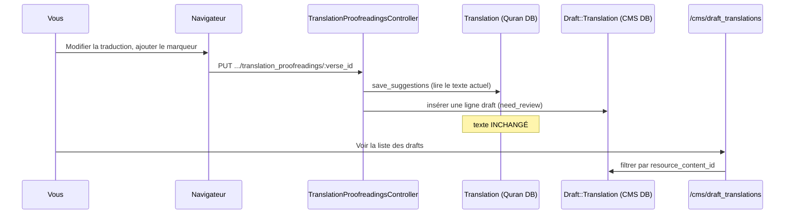

# Phase 19 — Une expérience d'apprentissage

> **Série d'intégration :** on apprend QUL étape par étape.  
> **Avant :** [Phases 1–18](phase-01-what-is-qul.md), surtout [Phase 17 (setup local)](phase-17-local-setup.md)  
> **Ce fichier :** un exercice pratique. On relie navigateur → contrôleur → deux bases → CMS. On a des critères de succès et un rollback.

---

## Objectif

Lire la doc n'est pas la même chose que **voir le système**. Cette phase propose une expérience sûre. Elle valide :

- L'architecture à deux bases de données (Phase 5)
- L'édition draft-first des contributeurs (Phases 9, 18)
- La frontière CMS vs contenu publié (Phases 3, 8)
- Les conventions d'URL/paramètres (Phase 18)

**On fait ça en local.** Ce document ne modifie pas le dépôt. N'ouvre pas de PR sauf si tu transformes une découverte en vrai fix.

---

## Avant de commencer

Confirme ces points :

| Vérification | Commande / action |
|---|---|
| Dump Quran chargé | `bin/rails runner 'puts Verse.count'` → **> 0** |
| App en cours | `bin/dev` → http://localhost:3000 |
| Admin CMS existant | `bin/rails db:seed` → `admin@cms.com` / `cms-password` |
| Connecté en admin | `/users/sign_in` ou utilisateur seed |
| Log serveur visible | Terminal avec `bin/dev` ou `tail -f log/development.log` |

**On pense :** L'utilisateur seed est `super_admin`. Il contourne les vérifications `UserProject` pour `can_manage?`.

---

## Expérience recommandée

### Titre : **Proposer une correction de traduction**

**Risque :** Faible. On écrit seulement dans `draft_translations` du CMS. Pas dans `translations` publiées.  
**Durée :** ~20–30 minutes la première fois.  
**Phases exercées :** 5, 8, 9, 15 (pas de job), 17, 18.

---

### Étape 0 — Choisir les constantes

Utilise les valeurs dev par défaut :

| Symbole | Valeur dev typique | Signification |
|---|---|---|
| `RESOURCE_ID` | `131` | `ResourceContent` pour un package de traduction |
| `VERSE_KEY` | `1:1` | Premier ayah facile à trouver |
| `MARKER` | `[onboarding-test]` | Chaîne unique pour chercher |

Trouve `VERSE_ID` dans la console :

```bash
bin/rails runner "v = Verse.find_by(verse_key: '1:1'); puts v.id"
```

Tu auras besoin de `VERSE_ID` pour les URLs. `:id` dans les routes de relecture = **verse id**, pas translation id.

---

### Étape 1 — Référence : traduction publiée inchangée

**Navigateur :** Ouvre  
`http://localhost:3000/translation_proofreadings/#{VERSE_ID}?resource_id=#{RESOURCE_ID}`

Note le texte de traduction actuel à l'écran.

**Console :**

```ruby
rc = ResourceContent.find(131)
t  = Translation.find_by(resource_content_id: rc.id, verse_key: '1:1')
puts t.text
puts t.updated_at
```

**Enregistre :** `ORIGINAL_TEXT`, `ORIGINAL_UPDATED_AT`.

**Critère de succès :** Le texte de la page correspond à `t.text`.

---

### Étape 2 — Compter les drafts avant

**Console :**

```ruby
Draft::Translation.where(resource_content_id: 131, verse_id: Verse.find_by(verse_key: '1:1').id).count
```

**Enregistre :** `DRAFT_COUNT_BEFORE`.

**On sait :** `Draft::Translation` est `ApplicationRecord` → base **CMS**. Table `draft_translations` dans `db/schema.rb`.

---

### Étape 3 — Soumettre une suggestion dans le navigateur

1. Sur la page show, clique sur **Edit** (connexion requise).
2. Ajoute ton marqueur, par ex. `... [onboarding-test]`.
3. Clique sur submit. Le bouton dit **"Purpose changes"** — probable typo pour "Propose". **On sait :** depuis `edit.html.erb`.
4. Attends la redirection avec : *"Your suggestions are saved successfully"*.

**Si Edit est absent ou erreur de permission :**

- Confirme que tu es connecté en `admin@cms.com` (super_admin), ou
- Aie un `UserProject` approuvé pour `resource_content_id: 131`.

---

### Étape 4 — Observer la requête dans les logs

Dans le log serveur, trouve :

```text
Processing by TranslationProofreadingsController#update
Parameters: { ... "draft_translation" => { "draft_text" => "...[onboarding-test]..." }, "resource_id" => "131", "id" => "<VERSE_ID>" }
```

**Correspondance avec le code (Phase 18) :**

```text
PUT /translation_proofreadings/:id
  → TranslationProofreadingsController#update
  → Translation#save_suggestions
  → Draft::Translation.create (need_review: true)
```

---

### Étape 5 — Vérifier la ligne draft (base CMS)

**Console :**

```ruby
verse = Verse.find_by(verse_key: '1:1')
draft = Draft::Translation.where(resource_content_id: 131, verse_id: verse.id).order(id: :desc).first

puts draft.draft_text.include?('[onboarding-test]')  # => true
puts draft.need_review                                  # => true
puts draft.user&.email                                  # => your logged-in user
```

**Critères de succès :**

| Vérification | Attendu |
|---|---|
| `DRAFT_COUNT_AFTER` | `DRAFT_COUNT_BEFORE + 1` (ou nouvelle ligne) |
| `draft.draft_text` | Contient `[onboarding-test]` |
| `t.text` publiée | **Toujours égale à `ORIGINAL_TEXT`** |
| `t.updated_at` | **Toujours égale à `ORIGINAL_UPDATED_AT`** |

Cela prouve le **flux draft-first**. C'est le modèle de sécurité central de QUL.

---

### Étape 6 — Le voir dans le CMS (optionnel)

1. Connecte-toi sur http://localhost:3000/cms
2. Ouvre **Resource contents** → trouve l'id `131`
3. Clique **View draft translations**, ou va à :  
   `http://localhost:3000/cms/draft_translations?q[resource_content_id_eq]=131`
4. Trouve ta ligne avec `[onboarding-test]`

**On pense :** Tu as corrélé trois surfaces pour la même modification :

```text
/translation_proofreadings  →  draft_translations (CMS)  →  /cms/draft_translations
                                      ↓ (pas encore)
                                 translations (Quran DB)
```

---

### Étape 7 — Rollback (nettoyage)

Supprime uniquement ton draft de test :

```ruby
Draft::Translation.where(resource_content_id: 131)
  .where("draft_text LIKE ?", "%[onboarding-test]%")
  .delete_all
```

Relance la vérification console de l'Étape 1. Le texte publié doit rester inchangé.

**Ne** clique pas sur "Approve" dans le CMS. Sauf si tu veux muter les données Quran publiées.

---

## Schéma de l'expérience



---

## Alternative A — Lecture seule

Si tu ne peux pas ou ne veux pas créer de drafts :

1. Ouvre http://localhost:3000/ayah/2:255
2. Ouvre DevTools → onglet Network
3. Observe les requêtes Turbo Frame lazy : `/ayah/2:255/text`, `/translations`, etc.
4. Dans les logs, fais correspondre chaque requête à `AyahController#text`, `#translations`, …

**Critère de succès :** Tu peux nommer quel partial chaque frame charge (`ayah/_ayah_text`, etc.) sans modifier les données.

**Phases exercées :** 16, 18.

---

## Alternative B — Preuve deux-DB en console

Pas de modifications dans le navigateur :

```ruby
# Quran DB connection
Verse.connection_db_config.database_name   # => "quran_dev"
Verse.count

# CMS DB connection
User.connection_db_config.database_name    # => "quran_community_tarteel"
Draft::Translation.count

# Cross-DB logical join (no FK)
v = Verse.find_by(verse_key: '2:255')
Translation.find_by(verse_id: v.id, resource_content_id: 131)
```

**Critère de succès :** Tu peux expliquer pourquoi `Verse` et `Draft::Translation` sont joints sur `verse_id` mais vivent dans des bases Postgres différentes.

**Phases exercées :** 5, 2.

---

## Ce qu'il ne faut PAS faire

| Action | Pourquoi éviter |
|---|---|
| Approuver le draft dans le CMS | Mute `translations` publiées — réserver pour Phase 8 |
| `refresh_export!` sur une ressource réelle | Nécessite Sidekiq + S3 ; hors périmètre |
| Modifier la disposition mushaf | Écritures directes Quran DB — pattern différent (Phase 13) |
| Exécuter `ExportMiniDumpJob` | Destructif pour la Quran DB locale |
| Commiter du texte marqueur de test | Pollue le dépôt ; base locale uniquement |

---

## Objectifs optionnels (après l'expérience principale)

Uniquement si l'expérience principale a réussi :

1. **Chemin d'approbation (supervisé) :** Dans le CMS, approuve le draft pour cet ayah. Observe `DraftContent::ApproveDraftTranslationJob` dans les logs Sidekiq. Vérifie que `translations.text` est mis à jour. **Reviens en arrière** si nécessaire.

2. **Tracer la confusion de paramètres :** Visite `/translation_proofreadings/2:255?resource_id=131` (verse_key dans le slot id). Observe 404 ou mauvais enregistrement. Compare avec `/translation_proofreadings/#{VERSE_ID}?resource_id=131`.

3. **Chasse aux typos UI :** Le bouton submit dit "Purpose changes" dans `app/views/translation_proofreadings/edit.html.erb`. Une vraie contribution : corriger en "Propose changes" avec capture d'écran dans la PR.

---

## Grille d'auto-évaluation

| Question | Réussi si tu peux répondre sans regarder |
|---|---|
| Quelle DB contient `draft_translations` ? | CMS (`quran_community_tarteel`) |
| Quelle DB contient `translations` ? | Quran (`quran_dev`) |
| Que signifie `:id` dans `/translation_proofreadings/:id` ? | `verses.id` |
| Que signifie le paramètre `resource_id` ? | `resource_contents.id` |
| Le texte publié a-t-il changé après la suggestion ? | **Non** |
| Quelle méthode crée le draft ? | `Translation#save_suggestions` |
| Où les admins examinent la ligne ? | `/cms/draft_translations` |

---

## Incertitudes

| # | Question | Label |
|---|---|---|
| 1 | Si `resource_id=131` existe dans chaque mini dump | **On pense :** valeur courante ; vérifie `ResourceContent.find(131)` |
| 2 | Si les non-admin peuvent compléter l'Étape 3 sans `UserProject` | **On sait :** `authorize_access!` bloque l'édition |
| 3 | Si l'approbation d'un draft d'un seul ayah est dans l'UI CMS | **On ne sait pas :** objectif étendu ; peut nécessiter écrans admin |

---

## Résumé de la Phase 19

```text
Modifier la traduction dans le navigateur
  → Ligne Draft::Translation dans le CMS (need_review)
  → Translation publiée inchangée
  → visible dans /cms/draft_translations
  → supprimer le draft pour rollback
```

Si cette expérience te semble claire, tu comprends la frontière de sécurité la plus importante de QUL. Si quelque chose ne correspondait pas, **c'est précieux** — note où la réalité diverge avant de contribuer.

---

## Arrête-toi ici — avant la Phase 20

La Phase 20 couvre **les tests et l'intégrité des données**. Comment QUL contrôle la qualité (RuboCop, specs, outils d'intégrité admin).

1. Après ton expérience, `translations.text` publiées a-t-il changé avant l'approbation CMS ?
2. Quelle table a reçu une nouvelle ligne — `draft_translations` ou `translations` ?
3. Quelle URL pour trouver le draft dans Active Admin ?

Réponds avec ce que tu as observé, ou dis **"proceed"** pour la **Phase 20 — Tests et intégrité des données**.

---

*Version A2 — français simple. Généré pendant l'onboarding contributeur QUL.*
