# Phase 1 — Qu'est-ce que Quranic Universal Library ?

> **Série d'onboarding :** plongée progressive pour devenir un contributeur QUL légitime.  
> **Ce fichier :** Phase 1 uniquement — modèle d'identité produit et données. Pas encore d'architecture Rails.

---

## Avant d'ouvrir des fichiers Ruby

QUL n'est pas principalement une *application de lecture* du Coran. C'est une infrastructure pour **créer, curatorier, valider, versionner et distribuer** des jeux de données coraniques structurés.

Pensez à deux couches faciles à confondre :

| Couche | Ce que c'est | Qui la touche |
|---|---|---|
| **QUL l'application** | Un CMS Ruby on Rails + site public sur [qul.tarteel.ai](https://qul.tarteel.ai) | Mainteneurs, éditeurs, relecteurs, contributeurs avec accès CMS |
| **QUL les ressources** | Jeux de données téléchargeables (JSON, SQLite, URLs audio, polices, etc.) | Développeurs d'apps, chercheurs, créateurs d'apps coraniques — souvent **sans jamais cloner le dépôt** |

**FAIT :** La documentation de démarrage indique explicitement que la plupart des utilisateurs n'ont **pas** besoin de cloner le dépôt. Ils téléchargent depuis `/resources`.  
**FAIT :** Le README décrit QUL comme un « Content Management System complet conçu pour gérer les données coraniques ».  
**INFÉRENCE :** Votre parcours de contribution peut être **code** (améliorer la plateforme) ou **données** (améliorer les jeux de données via les workflows CMS). Les deux sont légitimes ; ils ont des profils de risque différents.

---

## Ce que QUL fournit réellement

### Modèle mental compact (vérifié et affiné)

> **QUL est un CMS de ressources coraniques structurées + système de validation/versioning + couche d'export/distribution.**

C'est exact. Décomposons :

1. **CMS** — Les administrateurs et contributeurs autorisés gèrent traductions, tafsirs, audio, morphologie, layouts mushaf, et plus encore via une interface Active Admin montée sur `/cms`. **FAIT :** `config/initializers/active_admin.rb` définit `config.default_namespace = :cms`. Les anciennes URLs `/admin` redirigent vers `/cms`.

2. **Validation / versioning** — Les modifications de contenu sont tracées (PaperTrail est utilisé sur les modèles centraux comme `Verse` et `Word`). Il existe des workflows de relecture, des modèles draft, des flags d'approbation et des outils d'intégrité des données dans la zone admin. (Nous les tracerons dans les phases ultérieures.)

3. **Export / distribution** — Le contenu curaté est publié sous forme d'enregistrements `DownloadableResource` et exposé sur le site public à `/resources`, typiquement en fichiers JSON ou SQLite générés par les exporteurs dans `lib/exporter/`.

4. **Site web public** — Pas seulement des téléchargements. Le site inclut la documentation (`/docs`), des aperçus de ressources, des outils communautaires et des workflows orientés contributeurs (interfaces de relecture, outils de comparaison, etc.).

### Ce que QUL **n'est pas** (pour la plupart des consommateurs)

- **Pas un service API public hébergé (chemin principal).** **FAIT :** `app/views/docs/markdown/api.md` indique qu'une API REST complète est « Coming soon » et recommande de télécharger les jeux de données. **RÉALITÉ DU CODE ACTUEL :** Un namespace partiel `api/v1` existe déjà dans `config/routes.rb` (chapters, verses, translations, tafsirs, recitations, segments). Considérez les téléchargements comme le chemin d'intégration stable jusqu'à ce que la doc API rattrape le code.
- **Pas une application de lecture du Coran.** QUL produit des données que les apps de lecture consomment. Tarteel (l'entreprise derrière QUL) construit des produits grand public séparés.
- **Pas un jeu de données monolithique unique.** QUL gère **de nombreux packages de ressources** — chaque traduction, chaque récitation, chaque variante de script est sa propre ressource publiable avec ses propres métadonnées et fichiers d'export.

---

## Qui utilise QUL ?

### Consommateurs de ressources (développeurs en aval)

**FAIT** (depuis `getting-started.md` et `datasets.md`) :

- Développeurs d'apps de lecture du Coran (arabe + traduction)
- Expériences de recherche et de découverte
- Outils d'étude du tafsir
- Apps d'apprentissage mot par mot (racine, lemme, POS)
- Pipelines NLP / IA utilisant des données coraniques structurées

Ces utilisateurs typiquement :

1. Parcourent [qul.tarteel.ai/resources](https://qul.tarteel.ai/resources)
2. Téléchargent du JSON (intégration rapide) ou SQLite (charges de travail à requêtes intensives)
3. Joignent les jeux de données via des identifiants partagés
4. Hébergent les données dans leur propre infrastructure

Ils n'ont **pas** besoin de Rails, PostgreSQL ou Redis.

### Contributeurs de contenu et mainteneurs

**FAIT** (depuis `contribute-data.md`) :

- Relire et corriger traductions, tafsirs, translittérations
- Segmenter et vérifier l'audio de récitation
- Affiner la morphologie (racines, lemmes, POS)
- Tagger les ayahs par sujet, thème, similarité, mutashabihat

La plupart de la contribution de données se fait via le **CMS QUL**, avec relecture avant publication.

### Contributeurs code (vous, éventuellement)

**FAIT** (depuis `contribute-code.md`) :

- Améliorer l'app Rails, les exporteurs, l'outillage et le site web
- Suivre le workflow fork → branche → PR
- Exécuter l'app localement avec le jeu de données de développement Coran

---

## Pourquoi ce projet existe

**INFÉRENCE** (appuyée par le README, le branding Tarteel et la portée du projet) :

L'écosystème coranique compte de nombreuses traductions, tafsirs, récitations, variantes de script et annotations linguistiques — mais elles sont dispersées, formatées de façon incohérente et difficiles à joindre de manière fiable. QUL centralise la **curation** et la **distribution** pour que les développeurs en aval puissent s'appuyer sur des jeux de données stables, attribuables et joignables plutôt que de re-scraper ou re-normaliser les sources.

Le pari technique est : **identifiants stables + provenance + pipelines d'export** comptent autant que le texte lui-même.

---

## Principales catégories de ressources

**FAIT :** `DownloadableResource::RESOURCE_TYPES` dans `app/models/downloadable_resource.rb` définit ces catégories publiées :

| Slug de catégorie | Ce que cela couvre |
|---|---|
| `quran-script` | Texte coranique arabe en plusieurs scripts (Uthmani, Indopak, QPC, etc.) |
| `translation` | Traductions au niveau ayah et mot |
| `tafsir` | Jeux de données de commentaire |
| `recitation` | Récitations audio et timing des segments |
| `morphology` | Grammaire au niveau mot : racines, lemmes, POS |
| `transliteration` | Représentations phonétiques / romanisées |
| `surah-info` | Métadonnées descriptives sur les sourates |
| `quran-metadata` | Navigation structurelle : juz, hizb, rub, manzil |
| `mushaf-layout` | Données de layout mushaf orientées page |
| `ayah-topics` | Tagging par sujet pour les ayahs |
| `ayah-theme` | Regroupements thématiques |
| `similar-ayah` | Relations d'ayahs similaires |
| `mutashabihat` | Données mutashabihat (formulations similaires) |
| `font` | Polices orientées Coran |

**FAIT :** `ResourceContent` (l'enregistrement de métadonnées côté CMS pour une ressource logique) a des sous-types supplémentaires au-delà de ce qui est exporté — incluant media, contenu uloom, détails de racines, etc. Tout ce qui est dans le CMS ne devient pas un téléchargement public.

### Ressources au niveau ayah vs mot

**FAIT :** Les scopes `ResourceContent` incluent les types de cardinalité `one_verse`, `one_word` et `one_chapter`. Cela détermine comment une ressource s'attache à la hiérarchie coranique :

- **Niveau ayah :** traductions, tafsirs, translittérations (ayah), sujets/thèmes, info sourate (niveau chapitre)
- **Niveau mot :** morphologie, traductions de mots, scripts de mots
- **Audio :** récitations avec audio par ayah ou gapless (niveau sourate) plus timings de segments

---

## QUL en tant qu'application vs QUL en tant que ressources

```mermaid
flowchart TB
    subgraph CMS["Application QUL (Rails)"]
        AA["Active Admin /cms"]
        Editors["Contributeurs et mainteneurs"]
        DB_CMS["Base CMS\n(users, permissions, downloads, drafts)"]
        DB_Quran["Base contenu Coran\n(verses, words, translations, audio, ...)"]
        Exporters["Exporteurs lib/exporter/"]
        Jobs["Jobs en arrière-plan\n(Sidekiq)"]
    end

    subgraph Public["Site public qul.tarteel.ai"]
        Resources["/resources — parcourir et télécharger"]
        Docs["/docs — guides d'intégration"]
        Tools["Outils communautaires\n(relecture, comparaison)"]
    end

    subgraph Downstream["Développeurs en aval"]
        Apps["Apps Coran, pipelines de recherche, outils IA"]
    end

    Editors --> AA
    AA --> DB_CMS
    AA --> DB_Quran
    AA --> Exporters
    Exporters --> Jobs
    Jobs --> Resources
    DB_Quran --> Exporters
    Resources --> Apps
    Docs --> Apps
```



**Narration :**

- Les éditeurs travaillent dans le CMS (`/cms`) pour créer et corriger le contenu stocké principalement dans la base de contenu Coran.
- La base CMS contient l'état de l'application : utilisateurs, permissions, packaging des ressources téléchargeables, tags, etc.
- Les exporteurs lisent le contenu Coran et produisent des fichiers JSON/SQLite.
- Les pages publiques `/resources` exposent les téléchargements publiés aux développeurs qui ne touchent jamais Rails.
- Les outils communautaires sur le site public supportent les workflows contributeurs (relecture, comparaison audio) qui écrivent en retour dans le CMS.

Nous disséquerons la séparation des deux bases de données dans la **Phase 5**. Pour l'instant, retenez simplement : **l'application et le contenu sacré sont architecturalement séparés.**

---

## Le modèle d'identité coranique

C'est le concept le plus important de tout le dépôt. Presque toute ressource se joint via cette hiérarchie.

### Hiérarchie conceptuelle

```text
Quran
 └── Surah (114 chapters)
      └── Ayah (verses within a surah)
           └── Word (tokens within an ayah)
```

### Noms de modèles Rails vs noms courants

Les modèles Rails de QUL utilisent une terminologie qui diffère de l'anglais courant et des noms de champs d'export :

| Terme courant | Modèle Rails | Champs clés |
|---|---|---|
| Surah | `Chapter` | `chapter_number` (1–114) |
| Ayah | `Verse` | `verse_number`, `chapter_id`, `verse_key` |
| Word | `Word` | `position`, `verse_id`, `location`, `word_index` |

**FAIT :** `Chapter` a `chapter_number`. `Verse` appartient à `chapter` et a `verse_number`. `Word` appartient à `verse` et a `position` (la position du mot dans l'ayah).

Ne soyez pas décontenancé quand vous voyez `chapter_id` dans la base — cela signifie sourate.

### Les identifiants partagés

La documentation (`data-model.md`) indique aux développeurs en aval de joindre sur :

| Identifiant | Signification | Exemple |
|---|---|---|
| `surah_id` / `surah` | Quelle sourate (1–114) | `2` (Al-Baqarah) |
| `ayah_number` / `ayah` | Numéro de verset dans la sourate | `255` |
| `word_position` / `word` / `position` | Index du mot dans l'ayah | `5` |

**FAIT :** Le code d'export utilise plusieurs conventions de nommage. Par exemple, `lib/exporter/export_quran_word_script.rb` exporte :

```ruby
{
  surah: s,
  ayah: a,
  word: w,
  location: word.location,  # e.g. "2:255:5"
  text: word.send(text_attribute)
}
```

**FAIT :** Le `verse_key` sur `Verse` est une chaîne comme `"2:255"` (sourate:ayah). **FAIT :** Le `location` sur `Word` est une chaîne comme `"2:255:5"` (sourate:ayah:mot), confirmé par l'usage de `word.location.split(':')` dans tout le codebase.

### Identifiants séquentiels globaux

En plus des clés lisibles par l'humain, QUL utilise des indices séquentiels globaux :

| Champ | Modèle | Rôle |
|---|---|---|
| `verse_index` | `Verse` | Numéro d'ayah global dans tout le Coran (1–6236) |
| `word_index` | `Word` | Numéro de mot global dans tout le Coran ; **index unique** dans le schéma |
| `sequence_number` | `Word` | Également unique — un autre identifiant global de mot |

**UTILE PLUS TARD :** Ces indices globaux permettent une navigation séquentielle efficace (`next_ayah`, `next_word`) et des exports compacts. Pour joindre les ressources, préférez `surah + ayah + position du mot` — c'est ce que la documentation promet aux développeurs en aval.

### Exemple : une ayah avec ressources attachées

En utilisant **Ayat al-Kursi** comme exemple concret (Sourate 2, Ayah 255) :

```text
Surah 2 (Al-Baqarah)                    ← Chapter, chapter_number: 2
  └── Ayah 255                            ← Verse, verse_key: "2:255"
       ├── Arabic script (text_uthmani, text_indopak, text_qpc_hafs, ...)
       ├── Translation A (English)        ← joins on surah=2, ayah=255
       ├── Translation B (Urdu)           ← joins on surah=2, ayah=255
       ├── Tafsir (Ibn Kathir)             ← joins on surah=2, ayah=255
       ├── Transliteration                 ← joins on surah=2, ayah=255
       ├── Topic tags                      ← joins on surah=2, ayah=255
       └── Words
            ├── Word 1 (position: 1)       ← location: "2:255:1"
            │    └── morphology: root, lemma, POS
            ├── Word 2 (position: 2)       ← location: "2:255:2"
            │    └── morphology: root, lemma, POS
            └── ... (this ayah has many words)
```

**FAIT :** Un seul enregistrement `Verse` stocke plusieurs représentations de script en colonnes séparées (`text_uthmani`, `text_indopak`, `text_qpc_hafs`, etc.) — ce sont des variantes de contenu, pas des ressources séparées. Les packages de script exportés sélectionnent quelle colonne exporter via les métadonnées `ResourceContent`.

### Comment les différentes ressources s'attachent

| Type de ressource | Niveau de jointure | Clés de jointure |
|---|---|---|
| Script Coran (ayah) | Ayah | `surah + ayah` |
| Traduction | Ayah | `surah + ayah` |
| Tafsir | Ayah (parfois plages d'ayahs) | `surah + ayah` |
| Translittération | Ayah ou mot | `surah + ayah` ou `surah + ayah + word` |
| Morphologie | Mot | `surah + ayah + word_position` |
| Traduction de mot | Mot | `surah + ayah + word_position` |
| Sujets / thèmes | Ayah | `surah + ayah` |
| Audio de récitation | Ayah ou sourate | `surah + ayah` (+ ID récitateur) |
| Segments audio | Ayah (timestamps) | `surah + ayah` (+ ID récitateur) |
| Layout mushaf | Mot (position page/ligne) | `surah + ayah + word` mappé à page/ligne |
| Info sourate | Sourate | `surah` uniquement |

**INFÉRENCE :** Si vous vous trompez de clés de jointure — attacher une traduction à l'ayah 256 au lieu de 255, ou la morphologie à la position 4 au lieu de 5 — l'erreur se propage silencieusement dans les exports. Chaque app en aval qui joint sur les identifiants affichera des données erronées. C'est pourquoi la stabilité des identifiants est traitée comme une infrastructure technique sacrée.

---

## Pourquoi les identifiants stables sont fondamentaux

Trois propriétés font fonctionner le modèle d'identité de QUL :

### 1. Composabilité

Un développeur télécharge trois packages indépendants — script arabe, traduction anglaise, morphologie — et les joint dans sa propre base via `surah + ayah (+ word)`. Aucune API centrale requise. **FAIT :** C'est le chemin d'intégration principal documenté.

### 2. Attribution

Chaque package de ressource est lié à un enregistrement `ResourceContent` avec auteur, langue, source de données, statut d'approbation et historique de version. Quand vous utilisez « traduction Sahih International de QUL », les métadonnées d'export indiquent exactement quel jeu de données vous avez. (La Phase 3 tracera les champs de provenance.)

### 3. Intégrité à travers les modifications

Quand un éditeur corrige une traduction dans le CMS, l'identité de l'ayah (`verse_key: "2:255"`) ne change pas — seul le contenu attaché à cette identité change. Les exporteurs régénèrent les fichiers ; les consommateurs en aval re-téléchargent. Les clés de jointure restent stables.

**À COMPRENDRE MAINTENANT :** Les identifiants sont le contrat entre QUL et chaque application en aval. Le code qui modifie l'assignation des identifiants est à haut risque. Le code qui modifie le contenu *à* un identifiant stable est un travail éditorial normal.

---

## Comment QUL diffère d'une app de lecture du Coran

| Préoccupation | App de lecture du Coran | QUL |
|---|---|---|
| Sortie principale | Expérience de lecture rendue | Jeux de données structurés et téléchargeables |
| Utilisateur | Utilisateur final lisant le Coran | Développeur, chercheur ou éditeur de contenu |
| Propriété des données | Consomme les données | Crée, curate et publie les données |
| Texte arabe | Affiche un script choisi | Gère de nombreuses variantes de script en tant que ressources |
| Audio | Lit la récitation | Gère fichiers de récitation + données de timing des segments |
| Traductions | Affiche une à la fois | Gère de nombreuses traductions en ressources publiables séparées |
| Mises à jour | Release d'app | Re-export et re-téléchargement |

**INFÉRENCE :** Si vous avez construit des apps Coran React/Firebase auparavant, vous étiez probablement un **consommateur** de données comme celles que QUL produit. Contribuer à QUL signifie travailler sur l'**usine**, pas sur le **produit**.

---

## Note de documentation : chemin source de vérité

**DOCUMENTATION POSSIBLEMENT OBSOLÈTE :**

`contributing.md` dit : *« Edit files in `docs/` first (source of truth). »*

**RÉALITÉ DU CODE ACTUEL :** Il n'y a pas de répertoire `docs/` au niveau racine. Les fichiers sources de documentation vivent à :

```text
app/views/docs/markdown/
```

Ils sont rendus sur le site web à `/docs/:key`. Lors d'une contribution à la documentation, éditez les fichiers dans `app/views/docs/markdown/`, pas un dossier `docs/`.

---

## Classification pour cette phase

### À COMPRENDRE MAINTENANT

1. QUL est une **plateforme CMS + export/distribution**, pas une app de lecture.
2. La plupart des consommateurs de données **téléchargent** les ressources ; ils n'exécutent pas Rails.
3. La hiérarchie **Surah → Ayah → Word** avec des clés de jointure stables est le fondement de tout.
4. Rails utilise `Chapter` / `Verse` / `Word` — apprenez la correspondance.
5. `verse_key` (`"2:255"`) et `location` (`"2:255:5"`) sont les identifiants chaîne canoniques dans le codebase.
6. Les noms de champs exportés varient (`surah_id`, `surah`, `ayah_number`, `ayah`) — normalisez mentalement vers la hiérarchie.
7. L'édition de contenu et l'édition de code sont des **chemins de contribution différents** avec des risques différents.

### UTILE PLUS TARD

- Endpoints partiels `api/v1` (chapters, translations, tafsirs, audio) — pas encore le chemin d'intégration principal.
- `verse_index` et `word_index` globaux pour la navigation séquentielle.
- La taxonomie des 14 slugs `RESOURCE_TYPES` pour parcourir `/resources`.
- Outils communautaires (relecture, comparaison audio) sur le site public.
- Sous-types `ResourceContent` et cardinalité (`one_verse`, `one_word`, `one_chapter`).

### IGNORER POUR L'INSTANT

- Détails de configuration Active Admin.
- Implémentations individuelles des exporteurs.
- Mécaniques de rendu des layouts mushaf.
- Algorithmes de segmentation audio.
- Structures de graphes de morphologie.
- Modèle de permissions (CanCanCan).
- Définitions de jobs Sidekiq.
- Répartition frontend Vue vs Stimulus vs jQuery.

---

## Incertitudes

| Élément | Statut |
|---|---|
| Calendrier d'une API REST publique complète | **INCONNU** — la doc dit « coming soon » ; API partielle existante dans le code |
| Workflow d'approbation exact par type de ressource | **INCONNU** — à tracer en Phase 3 et Phase 8 |
| Quelles ressources nécessitent login CMS vs outils de contribution publics | **INFÉRENCE** — la plupart de l'édition est CMS ; certains outils de relecture sont publics avec auth |
| Conditions de licence par jeu de données | **INCONNU** — la FAQ mentionne de vérifier la licence ; à inspecter dans les métadonnées par ressource |

---

## Ce que nous investiguerons ensuite

**Phase 2 — Modèle de données coranique d'abord**

Nous approfondirons les tables de base de données réelles et les associations de modèles — toujours focalisés sur les *données*, pas l'architecture Rails. Spécifiquement :

- Comment `Chapter`, `Verse` et `Word` se relient dans le schéma
- Ce que représente `ResourceContent` en tant qu'enveloppe de « ressource logique »
- Comment traductions, tafsirs et modèles de morphologie s'attachent aux versets et mots
- La différence entre colonnes de contenu sur `Verse`/`Word` et tables de ressources séparées

**Phase 3 — Données sacrées, provenance et intégrité**

Puis nous tracerons le versioning (PaperTrail), les drafts, les approbations, et ce qui est éditable vs canonique.

---

## Résumé Phase 1 — cinq choses à retenir

1. **QUL = CMS + validation + export.** Il construit et distribue des jeux de données ; ce n'est pas une app de lecture.
2. **Deux audiences :** développeurs en aval qui téléchargent, et contributeurs qui éditent via le CMS.
3. **Surah → Ayah → Word** avec identifiants stables (`verse_key`, `location`, `surah + ayah + word`) est le contrat de jointure pour tout l'écosystème.
4. **Les noms Rails diffèrent :** `Chapter` = Surah, `Verse` = Ayah. Les noms de champs d'export varient aussi. Normalisez mentalement.
5. **De mauvais identifiants se propagent silencieusement.** La stabilité des identifiants est la chose la plus risquée à casser.

---

*Généré pendant l'onboarding contributeur QUL. Phase 1 sur ~24. Investigation en lecture seule — aucun code modifié.*
