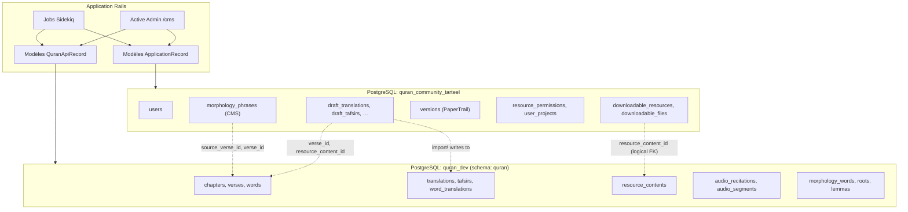

# Phase 5 — L'architecture à deux bases de données

> **Série d'onboarding :** plongée progressive pour devenir un contributeur QUL légitime.  
> **Prérequis :** [Phases 1–4](phase-01-what-is-qul.md)  
> **Ce fichier :** comment QUL sépare l'état CMS du contenu Coran, et ce que cela contraint.

---

## Le modèle mental central

QUL est **une application Rails** parlant à **deux bases PostgreSQL** (plus un troisième store SQLite optionnel pour l'outillage segments).

```text
┌─────────────────────────────────────────────────────────────────┐
│                     Application Rails (QUL)                        │
├────────────────────────────┬────────────────────────────────────┤
│   ApplicationRecord        │   QuranApiRecord                    │
│   (default connection)     │   (establish_connection override)   │
├────────────────────────────┼────────────────────────────────────┤
│  Base CMS                  │  Base contenu Coran                 │
│  quran_community_tarteel   │  quran_dev (development)            │
│  (production: CMS_DB_*)    │  (production: QURAN_API_DB_*)       │
├────────────────────────────┼────────────────────────────────────┤
│  Users, drafts, downloads  │  Verses, words, translations        │
│  versions, permissions     │  tafsirs, audio, morphology, …      │
│  Géré par migrations       │  Chargé depuis dump SQL (dev)         │
│  schéma dans db/schema.rb  │  PAS dans db/schema.rb                │
└────────────────────────────┴────────────────────────────────────┘
```

**À COMPRENDRE MAINTENANT :** Un modèle Active Record n'est **pas** automatiquement « la base de données ». Dans QUL, la classe de base détermine quelle base PostgreSQL (et parfois quel schéma) vous touchez.

---

## Configuration (`config/database.yml`)

**FAIT** — quatre connexions nommées :

| Clé config | Nom base (dev) | Utilisé par |
|---|---|---|
| `development` | `quran_community_tarteel` | Défaut — `ApplicationRecord` |
| `test` | `quran_community_cms_test` | Tables CMS suite de tests |
| `quran_api_db_dev` | `quran_dev` | `QuranApiRecord` en development/test |
| `quran_api_db` | `ENV['QURAN_API_DB_NAME']` | `QuranApiRecord` en production |

**FAIT** — la connexion Coran définit le search path schéma PostgreSQL :

```yaml
quran_api_db_dev:
  database: quran_dev
  schema_search_path: quran,"$user",public
```

**INFÉRENCE :** Les tables Coran vivent principalement dans le schéma PostgreSQL **`quran`** à l'intérieur de la base `quran_dev` — pas dans `public`. Des références code comme `quran.text`, `quran.image` (vues dans `ExportMiniDumpJob`) confirment l'existence d'objets qualifiés par schéma.

**FAIT** — L'init Docker crée les deux bases et le schéma `quran` :

```bash
# docker/dev/init-db.sh
CREATE DATABASE quran_dev;
CREATE SCHEMA IF NOT EXISTS quran;  -- inside quran_dev
```

**FAIT** — `bin/setup` exécute :

```bash
bin/rails db:create:all   # creates BOTH databases
bin/rails db:prepare      # migrates CMS only (schema.rb)
```

La base Coran est créée vide. Vous devez charger le dump séparément (Phase 17).

---

## Comment Rails choisit une connexion

### Défaut : `ApplicationRecord`

```ruby
# app/models/application_record.rb
class ApplicationRecord < ActiveRecord::Base
  self.abstract_class = true
end
```

Tout modèle héritant directement de `ApplicationRecord` utilise la **base CMS** (config `development` / `production`).

### Override : `QuranApiRecord`

```ruby
# app/models/quran_api_record.rb
class QuranApiRecord < ApplicationRecord
  self.abstract_class = true
  self.establish_connection Rails.env.development? ? :quran_api_db_dev : :quran_api_db
end
```

**Comparaison Node :** Comme avoir deux clients Prisma ou deux apps Firestore dans un codebase. Les enfants `QuranApiRecord` interrogent toujours le pool de connexion base Coran.

**FAIT :** `QuranApiRecord` hérite encore de `ApplicationRecord` (qui hérite `ActiveRecord::Base`) — mais `establish_connection` sur la classe redirige toutes les requêtes pour cette hiérarchie.

---

## Ce qui vit dans chaque base

### Base CMS (`quran_community_tarteel`)

**FAIT :** Toutes les tables dans `db/schema.rb` (~40 tables). Groupées par rôle :

| Catégorie | Tables | Rôle |
|---|---|---|
| **Auth & users** | `users`, `admin_users` | Comptes Devise, rôles |
| **Couche publication** | `downloadable_resources`, `downloadable_files`, `downloadable_resource_tags`, `downloadable_related_resources`, `user_downloads` | Catalogue public `/resources` et pièces jointes fichiers |
| **Draft / relecture** | `draft_translations`, `draft_tafsirs`, `draft_word_translations`, `draft_foot_notes`, `draft_contents` | Modifications proposées avant import vers base Coran |
| **Versioning** | `versions` | Snapshots audit PaperTrail |
| **Permissions** | `resource_permissions`, `user_projects` | Droits hébergement, accès projet contributeur |
| **Communication changements** | `change_logs`, `admin_todos`, `proof_read_comments` | Notes mise à jour curatées, todos mainteneur |
| **Morphologie CMS uniquement** | `morphology_phrases`, `morphology_phrase_verses`, `morphology_matching_verses` | Travail phrases mutashabihat/ayahs similaires (stocke refs `verse_id`) |
| **Outillage layout (CMS)** | `mushaf_line_alignments`, `pause_marks` | Métadonnées édition lignes mushaf |
| **État pipeline** | `segment_pipeline_runs`, `segments_databases` | Suivi jobs pipeline segments audio |
| **Staging** | `raw_data_resources`, `raw_data_ayah_records` | Staging import |
| **Communauté** | `contributors`, `faqs`, `feedbacks`, `contact_messages`, `synonyms`, `word_synonyms` | Contenu site web |
| **Contenu cross-ref (hébergé CMS)** | `uloom_contents`, `important_notes`, `word_tajweed_positions` | Stockent entiers `verse_id`/`word_id` pointant vers base Coran |
| **Infra Rails** | `active_storage_*`, `action_text_rich_texts`, `active_admin_comments` | Uploads fichiers, rich text, commentaires admin |
| **Divers** | `database_backups`, `quran_table_details`, `qr_sync_histories`, `log_entries` | Ops et métadonnées |

**FAIT :** Migrations CMS dans `db/migrate/` (~105 fichiers). `db:prepare` / `db:migrate` n'affecte que cette base.

### Base contenu Coran (`quran_dev`)

**FAIT :** Non représentée dans `db/schema.rb`. Peuplée via dump `mini_quran_dev.sql` en développement.

**FAIT :** Modèles utilisant `QuranApiRecord` (~90+ classes modèle). Familles de tables majeures (depuis annotations schéma modèle) :

| Famille | Exemples modèles | Contenu |
|---|---|---|
| **Épine dorsale** | `Chapter`, `Verse`, `Word` | Hiérarchie sourate/ayah/mot |
| **Ressources** | `ResourceContent`, `Translation`, `Tafsir`, `WordTranslation`, `Transliteration`, `ChapterInfo` | Tous packages contenu publiables |
| **Script arabe** | `QuranScript::ByVerse`, `QuranScript::ByWord` | Exports script par ressource |
| **Linguistique** | `Root`, `Lemma`, `Stem`, `Morphology::Word`, `Morphology::WordSegment`, `Token` | Grammaire et morphologie |
| **Audio** | `Audio::Recitation`, `Audio::ChapterAudioFile`, `Audio::Segment`, `Recitation`, `Reciter` | Récitations et timings |
| **Layout (contenu)** | `Mushaf`, `MushafPage`, `MushafWord` | Layout page/mot lié aux mots canoniques |
| **Sujets/thèmes** | `Topic`, `VerseTopic`, `AyahTheme`, `RelatedTopic` | Tagging thématique |
| **Données référence** | `Language`, `Author`, `DataSource`, `CharType`, `Juz`, `Hizb`, `Ruku`, `Manzil` | Métadonnées et navigation |
| **Provenance** | `FootNote`, `Book`, `MediaContent` | Métadonnées savantes |
| **Graphes** | `Morphology::DependencyGraph::Graph`, `GraphNode`, `GraphNodeEdge` | Graphes syntaxe/dépendance |
| **Recherche** | `NavigationSearchRecord`, `Slug` | Recherche/navigation interne |
| **API** | `ApiClient`, `ApiClientRequestStat` | Suivi clients API |

**WORKFLOW DOCUMENTÉ** (`project-setup.md`) : `quran_dev` démarre vide après `bin/setup` ; charger dump avec :

```bash
curl -L -o mini_quran_dev.sql.zip https://static-cdn.tarteel.ai/qul/mini-dumps/mini_quran_dev.sql.zip
unzip mini_quran_dev.sql.zip
psql -d quran_dev -f mini_quran_dev.sql
```

**Schéma existe vs données existent :**

| État | Base CMS | Base Coran |
|---|---|---|
| Après `bin/setup` | Tables créées, vide | Base créée, **vide** (schéma `quran` uniquement) |
| Après chargement dump | (inchangé) | ~90 tables peuplées avec versets, traductions, etc. |
| Comportement app | Login fonctionne, métadonnées downloads fonctionnent | Pages ayah, traductions, exports **échouent** sans dump |

---

## Diagramme de frontière



Flèches pleines = requêtes même base. Flèches pointillées = **clés étrangères logiques** inter-bases (IDs entiers uniquement — pas de contrainte imposée par la DB).

---

## Références inter-bases

Rails `belongs_to` **peut être déclaré** entre bases. PostgreSQL **ne peut pas imposer** ces clés étrangères. QUL utilise des colonnes ID entier comme pointeurs logiques.

### Pattern 1 : CMS → Coran (le plus courant)

| Modèle CMS | Colonne | Pointe vers (base Coran) |
|---|---|---|
| `DownloadableResource` | `resource_content_id` | `resource_contents.id` |
| `Draft::Translation` | `verse_id`, `resource_content_id` | `verses.id`, `resource_contents.id` |
| `UserProject` | `resource_content_id` | `resource_contents.id` |
| `ChangeLog` | `resource_content_id` | `resource_contents.id` |
| `ResourcePermission` | `resource_content_id` | `resource_contents.id` |
| `Morphology::Phrase` | `source_verse_id` | `verses.id` |
| `Morphology::PhraseVerse` | `verse_id` | `verses.id` |
| `ImportantNote` | `verse_id`, `word_id`, `resource_content_id` | Lignes Coran |
| `UloomContent` | `chapter_id`, `verse_id`, `word_id`, `resource_content_id` | Lignes Coran |

**FAIT :** `DownloadableResource` (CMS) déclare :

```ruby
belongs_to :resource_content, optional: true  # ResourceContent is QuranApiRecord
```

Rails interrogera la connexion Coran quand vous accédez à `downloadable_resource.resource_content`. Cela fonctionne à runtime mais :

- Pas d'intégrité référentielle si un `resource_content` est supprimé
- Pas de transaction single-database couvrant les deux
- Eager loading inter-connexions exige de la prudence

### Pattern 2 : Pont import draft

Le workflow cross-boundary critique :

```text
Draft::Translation (CMS DB)
  draft_text, verse_id, resource_content_id
        │
        │  Draft::Translation#import!  OR  ApproveDraftTranslationJob
        ▼
Translation (Quran DB)
  text, verse_id, verse_key, resource_content_id
```

**FAIT :** L'import copie le contenu et re-synchronise les champs d'identité depuis `Verse` dans la base Coran, puis marque le draft `imported: true` dans la base CMS. Ces deux écritures ne sont **pas** une transaction atomique unique entre bases.

### Pattern 3 : Modèles CMS avec `belongs_to :verse`

**FAIT :** `Morphology::Phrase` (CMS) fait :

```ruby
belongs_to :source_verse, class_name: 'Verse', optional: true
# ...
Verse.joins(...).where(id: phrase_verses.pluck(:verse_id))
```

Les métadonnées phrase vivent dans le CMS ; le contenu verset/mot est lu depuis la base Coran au moment de la requête.

---

## Ce que vous ne pouvez pas faire (contraintes)

### 1. Pas d'associations inter-bases avec intégrité

```ruby
# This declaration exists in code:
class DownloadableResource < ApplicationRecord
  belongs_to :resource_content  # QuranApiRecord
end
```

**Vous ne pouvez pas :**
- Ajouter une vraie FK PostgreSQL de `downloadable_resources.resource_content_id` → `resource_contents.id`
- Utiliser `dependent: :destroy` de façon fiable à travers la frontière
- Supposer que les IDs orphelins sont impossibles

### 2. Pas de transactions inter-bases

**FAIT :** `ActiveRecord::Base.transaction` encapsule **une connexion** (typiquement CMS par défaut).

**INFÉRENCE :** Si l'import échoue à mi-chemin (draft marqué imported mais traduction non sauvegardée), vous comptez sur l'idempotence du job et le nettoyage manuel — pas une transaction ACID unique.

### 3. Pas de fichier schéma unique pour la base Coran

**FAIT :** `db/schema.rb` = CMS uniquement.

**INFÉRENCE :** Les changements schéma Coran sont gérés hors workflow migration Rails normal pour contributeurs (restore dump, processus DBA production). Ne vous attendez pas à ce que `rails db:migrate` mette à jour `verses`.

### 4. Tests simulent surtout les modèles Coran

**FAIT :** `test/test_helper.rb` stub `Chapter`, `Verse`, `ResourceContent` avec fausses classes pour tests unitaires — il ne charge pas le dump Coran complet dans `quran_community_cms_test`.

**INFÉRENCE :** Couverture test pour comportement données Coran limitée. Vérification manuelle compte pour modifications données.

### 5. Table versions PaperTrail est dans le CMS

**FAIT :** Table `versions` dans `db/schema.rb` (base CMS), mais modèles versionnés comme `Translation` et `Verse` sont `QuranApiRecord`.

**INCONNU :** Comportement exact stockage PaperTrail pour modèles cross-connection — vérifier en Phase 17. Probablement versions écrites dans CMS `versions` avec `item_type`/`item_id` pointant vers IDs lignes Coran.

---

## Modèles qui surprennent (exceptions de frontière)

Certains modèles sont du « mauvais » côté ou répartis entre bases :

| Modèle | Classe de base | Note |
|---|---|---|
| `Morphology::Phrase`, `Morphology::PhraseVerse`, `Morphology::MatchingVerse` | `ApplicationRecord` | Workflow **correspondance phrases** dans CMS ; référence `verse_id`s Coran |
| `Morphology::Word`, `Morphology::GrammarTerm`, graphes | `QuranApiRecord` | **Contenu** morphologie publié dans base Coran |
| `UloomContent`, `ImportantNote` | `ApplicationRecord` | Tables CMS avec refs logiques `verse_id`/`word_id` |
| `MushafLineAlignment`, `PauseMark` | `ApplicationRecord` | État **édition** layout dans CMS |
| `Mushaf`, `MushafWord`, `MushafPage` | `QuranApiRecord` | **Contenu** layout publié dans base Coran |
| `Feedback` | `QuranApiRecord` | **ANOMALIE :** table `feedbacks` apparaît aussi dans migrations CMS `schema.rb` — vérifier quelle base est autoritaire en local |

**DOCUMENTATION POSSIBLEMENT OBSOLÈTE / VÉRIFIER LOCALEMENT :** `Feedback < QuranApiRecord` vs `feedbacks` dans migrations CMS. Si feedback admin casse sur setup frais, ce mismatch peut en être la cause.

---

## Troisième base : SQLite Segments (bonus)

**UTILE PLUS TARD** — pas le modèle deux-DB principal, mais vous pouvez le rencontrer :

```ruby
# app/models/segments/base.rb
class Segments::Base < ActiveRecord::Base
  self.establish_connection adapter: 'sqlite3', database: "tmp/segments_database.db"
end
```

**FAIT :** `Segments::Database` (CMS) stocke un fichier SQLite via Active Storage. Quand chargé, les modèles analyse segments (`Segments::Position`, `Segments::Failure`, etc.) se connectent dynamiquement à ce fichier SQLite.

**Comparaison Node :** Comme swapper un fichier SQLite temporaire pour analytics batch — séparé des deux bases Postgres.

---

## Production vs nommage développement

**FAIT** — depuis `lib/utils/db_backup.rb` :

```ruby
{
  api_staging: { database: ENV['QURAN_API_DB_NAME'] || 'quran_dev', ... },
  cms:         { database: ENV['CMS_DB_NAME'] || 'quran_community_tarteel', ... }
}
```

Production utilise variables d'environnement pointant vers instances Postgres gérées. Développement utilise local `quran_dev` + `quran_community_tarteel`.

---

## Narration : pourquoi deux bases ?

**INFÉRENCE** (appuyée par preuves architecture) :

1. **Séparation échelle et cycle de vie** — Le contenu Coran est volumineux, relativement stable, et partagé avec d'autres systèmes Tarteel. L'état CMS (users, drafts, packaging download) change plus vite et est spécifique à l'application.

2. **Onboarding développeur basé dump** — Nouveaux contributeurs chargent un mini-dump curaté au lieu d'exécuter 10 ans de migrations contenu.

3. **Rayon d'explosion** — Une mauvaise migration CMS corrompt moins probablement le schéma contenu sacré.

4. **Source de vérité export** — Exporteurs lisent contenu base Coran, packagent en fichiers, métadonnées atterrissent dans CMS `downloadable_files`.

Le coût est **clés étrangères logiques**, pas de transactions cross-DB, et charge mentale — d'où cette phase.

---

## Comment savoir quelle base un modèle utilise

**Algorithme :**

```text
1. Open app/models/<model>.rb
2. Check inheritance:
     < QuranApiRecord     → quran_dev / QURAN_API_DB_*
     < ApplicationRecord  → quran_community_tarteel / CMS_DB_*
     < Segments::Base     → temporary SQLite
3. If unsure, check db/schema.rb:
     Table listed there   → CMS (for sure)
     Table NOT listed     → almost certainly Quran DB
4. Grep model file for "Schema Information" annotate comment — table name
```

**Règle rapide :** Si c'est `Verse`, `Word`, `Translation`, `ResourceContent`, ou contenu audio/morphologie → **base Coran**. Si c'est `User`, `Draft::*`, `DownloadableResource`, `versions` → **base CMS**.

---

## Classification pour cette phase

### À COMPRENDRE MAINTENANT

1. **Deux bases PostgreSQL** — CMS (`ApplicationRecord`) et Coran (`QuranApiRecord`).
2. **`db/schema.rb` est CMS uniquement** — tables Coran viennent du dump SQL.
3. **`resource_content_id` fait le pont publication** — CMS `DownloadableResource` → Coran `ResourceContent`.
4. **Refs cross-DB sont IDs entiers** — pas d'imposition FK, pas de transaction unique.
5. **Draft → import → contenu Coran** est le principal chemin d'écriture cross-boundary.
6. **Après `bin/setup`, base Coran vide** jusqu'à chargement de `mini_quran_dev.sql`.

### UTILE PLUS TARD

- Namespace schéma PostgreSQL `quran` dans `quran_dev`
- Troisième connexion SQLite Segments
- `ExportMiniDumpJob` pour générer dumps dev depuis base Coran locale
- Docker `init-db.sh` crée les deux bases
- Variables env production : `CMS_DB_*` vs `QURAN_API_DB_*`
- Phrases morphologie hébergées CMS vs mots morphologie hébergés Coran

### IGNORER POUR L'INSTANT

- Rôle table `qr_sync_histories`
- Métadonnées CMS `quran_table_details`
- Options restore dump binaire vs SQL (Phase 17)
- Mécanique exacte stockage PaperTrail cross-connection

---

## Incertitudes

| Élément | Statut |
|---|---|
| Connexion modèle `Feedback` vs `feedbacks` dans schéma CMS | **ANOMALIE — vérifier localement** |
| Si `uloom_contents` devrait être CMS ou Coran long terme | **INCONNU** — actuellement CMS avec cross-refs |
| Liste complète tables/vues schéma Coran | **INCONNU sans dump chargé** — inspecter `quran_dev` en Phase 17 |
| Si production utilise même nom schéma PostgreSQL `quran` | **INFÉRENCE oui** — `schema_search_path` défini dans tous environnements |

---

## Ce que nous investiguerons ensuite

**Phase 6 — Modèle mental d'architecture**

Diagramme système complet : site public, CMS, exporteurs, Sidekiq, Redis, stockage/CDN, APIs, couches frontend — avec responsabilités et frontières de confiance.

---

## Résumé Phase 5 — cinq choses à retenir

1. **`ApplicationRecord` = base CMS**, **`QuranApiRecord` = base Coran** — vérifiez la classe de base de chaque modèle.
2. **`db/schema.rb` et migrations = CMS uniquement.** Contenu Coran = dump SQL.
3. **`DownloadableResource` (CMS) publie `ResourceContent` (Coran)** via `resource_content_id`.
4. **`belongs_to` cross-database fonctionne à runtime mais sans intégrité FK** — IDs peuvent orpheliner.
5. **`bin/setup` crée `quran_dev` vide** — vous devez charger le dump avant que pages Coran fonctionnent.

---

*Généré pendant l'onboarding contributeur QUL. Phase 5 sur ~24. Investigation en lecture seule — aucun code modifié.*
