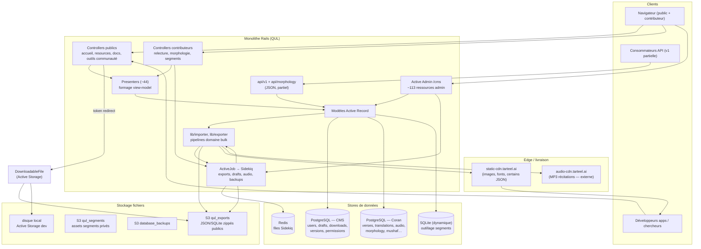

# Phase 6 — Modèle mental d'architecture

> **Série d'onboarding :** plongée progressive pour devenir un contributeur QUL légitime.  
> **Prérequis :** [Phases 1–5](phase-01-what-is-qul.md)  
> **Ce fichier :** comment l'ensemble du système s'articule — couches, frontières et chemins que les données empruntent de l'édition au téléchargement.

---

## Le modèle en une phrase

QUL est un **monolithe Rails** qui **curate le contenu Coran dans PostgreSQL**, **publie des fichiers d'export versionnés vers object storage**, et **sert un catalogue public + outils contributeurs + API JSON partielle** — avec travail lourd différé à **Sidekiq** et logique longue vivant dans **`lib/`**, pas des controllers minces.

Si vous ne retenez qu'une chose : **éditer dans base Coran → cataloguer dans base CMS → exporter vers S3/CDN → consommateur télécharge JSON/SQLite.**

---

## Diagramme vue d'ensemble



**INFÉRENCE :** Production s'exécute comme **image Docker** déployée sur **Kubernetes** au push sur `main` (`.github/workflows/deploy.yml`). Dev local utilise `bin/dev` (Rails + esbuild + Tailwind via Foreman).

---

## Carte des couches — responsabilités, E/S, état, confiance

Chaque ligne est une **frontière** que vous traverserez répétitivement en tant que contributeur.

| Couche | Responsabilité | Entrées principales | Sorties principales | Stateful ? | Frontière de confiance |
|---|---|---|---|---|---|
| **Site web public** | Marketing, catalogue ressources, rendu docs, recherche | HTTP, `DownloadableResource.published` | HTML (ERB + Turbo), redirections vers fichiers | Session/cookies via Devise | **Lecture non fiable** — catalogue publié + docs uniquement |
| **Outils communauté / contributeurs** | Relecture, édition morphologie, constructeur segments, comparaisons | Utilisateur authentifié + CanCanCan + `UserProject` | Lignes draft (CMS), modifications lignes Coran (autorisées) | Drafts par user, permissions projet | **Écriture semi-fiable** — ne peut pas contourner approbation pour contenu publié |
| **Active Admin (`/cms`)** | Curation staff : triggers import, approve drafts, refresh export, diagnostics | Session admin/super-admin | Mutations base Coran, métadonnées CMS, enqueue jobs | Versions PaperTrail, flags `need_review` | **Écriture fiable** — plein pouvoir éditorial |
| **Controllers** | Routage HTTP, gates auth, gestion params | `config/routes.rb` | Réponses HTML/JSON, enqueue jobs | Minimal — déléguer vite | Le check auth est la porte |
| **Presenters** | Former lignes Coran pour views (clés, URLs, groupement) | Objets AR, params | Hashes Ruby / locals view | Aucun | Transformation lecture seule |
| **Models (`ApplicationRecord`)** | Identité CMS : users, downloads, drafts, permissions | PostgreSQL CMS | Lignes CMS, refs ID cross-DB | **Source de vérité catalogue & workflow** | IDs ici référencent lignes Coran logiquement, pas via FK |
| **Models (`QuranApiRecord`)** | Contenu Coran canonique | PostgreSQL Coran (schéma `quran`) | Lignes contenu scopées par `resource_content_id` | **Source de vérité données Coran publiées** | Mutations exigent chemin éditorial |
| **`lib/importer`** | Tirer sources externes (ex. QuranEnc), matcher `verse_key`, upsert | Fichiers, APIs, actions admin | Lignes base Coran, provenance `meta_data` | Version import dans `ResourceContent.meta_data` | Traiter imports comme **entrée non fiable** jusqu'à relecture |
| **`lib/exporter`** | Sérialiser lignes Coran → JSON/SQLite/ZIP, attacher à `DownloadableFile` | Requêtes base Coran, `ResourceContent` | Fichiers dans `tmp/export`, S3 via Active Storage | Artefacts export = **snapshots immuables** | Exports publiés = **surface confiance publique** |
| **ActiveJob / Sidekiq** | Exports longs, approbation draft, traitement audio, backups | File Redis, args job | Mises à jour DB, uploads S3, emails | Statut job via Sidekiq::Status (certains jobs) | Échecs retry sélectif (`sidekiq_options`) |
| **Active Storage + S3** | Persister zips téléchargeables, assets segments, backups | Fichiers temp locaux depuis exporteur | Objets S3 publics ou privés | `DownloadableFile.token` pour indirection | Dev utilise `:local` ; prod `:qul_exports` |
| **CDN (`static-cdn.tarteel.ai`)** | Livraison rapide images, fonts, certains JSON uploadés directement | `UploadToCdn`, uploads exporteur | URLs cacheables (`CDN_HOST` env) | Longs en-têtes cache sur exports | Consommateurs traitent URLs CDN comme **distribution stable** |
| **`api/v1`** | Accès machine-readable (chapters, translations, tafsir, métadonnées audio) | Clés API / endpoints publics | JSON | **INFÉRENCE :** plus léger que catalogue download ; docs disent encore API « coming soon » pour surface complète | Rate/stats via `ApiClient` + `UpdateApiStatsJob` |
| **Mailers** | Notifier mises à jour export, fin segments, événements dev | Fin job, action admin | Email (file `mailers`) | Aucun | Opérationnel, pas data plane |

---

## Les trois autoroutes de flux de données

Ce sont les chemins que vous devriez pouvoir dessiner de mémoire.

### Autoroute 1 — Téléchargement consommateur (produit principal)

```text
Quran DB content
    → lib/exporter (serialize by resource_type)
    → tmp/export/*.json|.sqlite
    → zip
    → DownloadableFile.file.attach (S3 :qul_exports in prod)
    → DownloadableResource.published (CMS)
    → GET /resources → GET /resources/:id/download/:token
    → redirect to S3 URL
    → developer's app
```

**FAIT** — `ResourcesController#download` recherche `DownloadableFile` par token, trace le téléchargement, puis redirige vers `file.file.url` (Active Storage).

**FAIT** — `DownloadableFile` utilise `service: :local` en développement, `:qul_exports` sinon (`app/models/downloadable_file.rb`).

**FAIT** — `DownloadableResource#refresh_export!` dispatch vers la bonne méthode `Exporter::DownloadableResources` selon `resource_type` et `cardinality_type` (ayah vs word vs chapter).

### Autoroute 2 — Publication éditoriale (humain ou import)

```text
External source OR contributor draft OR admin inline edit
    → Quran DB rows (often save(validate: false))
    → ResourceContent approval / import!
    → PaperTrail version (CMS versions table)
    → refresh_export! (sync or AsyncResourceActionJob)
    → Highway 1
```

**FAIT** — Relecture communautaire (`translation_proofreadings`, `tafsir_proofreadings`) écrit des lignes **`Draft::*` dans le CMS**, pas le texte Coran publié directement (Phase 3).

**FAIT** — Actions admin `ResourceContent` enqueue `DraftContent::ApproveDraft*Job` et `DraftContent::ImportDraftContentJob` (`app/admin/content/resource_content.rb`).

**FAIT** — `DraftContent::CheckContentChangesJob` planifié hebdomadaire (dimanche 06:00) selon `config/sidekiq_scheduler.yml` — vérifie sources traduction/tafsir externes.

### Autoroute 3 — Boucle outil contributeur (export non requis)

```text
Authenticated contributor
    → /translation_proofreadings, /morphology_phrases, /segments/*, etc.
    → Presenter + Stimulus/Turbo (Vue in segments/svg only)
    → Draft or direct Quran edit (permission-gated)
    → awaits admin approval → Highway 2
```

**INFÉRENCE :** Ce chemin est comment la plupart des **contributeurs communautaires** vivent QUL — pas Active Admin.

---

## Niveaux de stockage (où l'état vit réellement)

| Niveau | Technologie | Ce qui vit ici | Cycle de vie |
|---|---|---|---|
| **PostgreSQL CMS** | `ApplicationRecord` | Users, Devise, drafts, `downloadable_*`, `versions` PaperTrail, permissions, overlays phrases morphologie CMS | Migrations dans `db/schema.rb` |
| **PostgreSQL Coran** | `QuranApiRecord` | Versets, mots, traductions, tafsirs, métadonnées audio, morphologie, layouts mushaf | Dump SQL en dev ; **pas de migrations Rails** |
| **SQLite Segments** | `Segments::Base` | Sessions édition segments par récitateur | **INFÉRENCE :** éphémère/outillage ; exporté retour Coran/S3 |
| **Redis** | Sidekiq | Files jobs, scheduler, middleware status | Éphémère |
| **S3 `qul_exports`** | Active Storage | Téléchargements publics zippés | Long `cache_control` ; versionné par clé export |
| **S3 `qul_segments`** | Active Storage | Uploads segments privés | `public: false` |
| **S3 `database_backups`** | `BackupJob` → `Utils::DbBackup` | Backups DB (prod uniquement) | Cron quotidien 10:00 |
| **CDN** | Cloudflare + `UploadToCdn` | Images (`WORDS_CDN`, `AYAH_CDN`), fonts, certains JSON, mini dumps | `CloudflareCacheClearer` à l'upload |
| **CDN audio externe** | `audio-cdn.tarteel.ai` / quranicaudio.com | Fichiers MP3 récitation | Référencés dans `ResourceContent.meta_data` ; pas hébergés QUL |

**FAIT** — `QuranApiRecord::CDN_HOST = 'https://static-cdn.tarteel.ai'` pour images mot/ayah.

**FAIT** — URL dump données Coran dev : `https://static-cdn.tarteel.ai/qul/mini-dumps/mini_quran_dev.sql.zip`.

---

## Réalité frontend dans le monolithe

QUL n'est **pas** une SPA. Pensez **app Rails multi-surface** :

| Surface | Tech | Entrée |
|---|---|---|
| Pages publiques + docs | ERB, Turbo, Stimulus, Tailwind | `app/views/`, `app/javascript/controllers/` |
| Catalogue ressources | ERB + presenters | `ResourcesController` |
| Outils communauté | ERB + Stimulus (formulaires lourds) | `community#*`, controllers relecture |
| CMS | Active Admin (ère jQuery) | `app/admin/` |
| Constructeur segments | **Vue 3** | `app/javascript/segments/` |
| Optimiseur SVG | **Vue 3** | `app/javascript/svg/` |

**FAIT** — `bin/dev` exécute trois processus : serveur Rails, `yarn build --reload` (esbuild), `tailwindcss:watch`.

**INFÉRENCE :** En tant qu'ingénieur React, vous vous sentirez le plus à l'aise dans `segments/` et `svg/` — partout ailleurs c'est server-rendered avec des touches de JS.

---

## Travail en arrière-plan — ce que fait Sidekiq

**FAIT** — `config/initializers/sidekiq.rb` définit l'adaptateur ActiveJob sur Sidekiq globalement ; Sidekiq Web UI monté sur `/sidekiq` pour admins.

**Familles de jobs représentatives :**

| Famille | Exemples | Déclenché depuis |
|---|---|---|
| **Export** | `ExportTranslationJob`, `Export::TafsirJob`, `Export::MushafLayoutExportJob` | Actions ressource admin, `refresh_export!` |
| **Workflow draft** | `ApproveDraftTranslationJob`, `ImportDraftContentJob`, `CheckContentChangesJob` | Approve admin, cron hebdo |
| **Audio** | `GenerateAudioFilesJob`, `SplitGaplessRecitationJob`, `ExportAudioSegmentsJob` | Ressources audio admin |
| **Segments** | `Segments::ExportReciterSegmentsJob` | Dashboard segments |
| **Ops** | `BackupJob` (quotidien), `ExportMiniDumpJob`, `Recurring::UpdateApiStatsJob` | Cron, admin |

**FAIT** — `AsyncResourceActionJob` est un dispatcher générique : `perform(resource, :refresh_export!, ...)` — pattern utile à connaître en traçant boutons admin.

**FAIT** — Cache production utilise Memcached (`config.cache_store = :mem_cache_store`), pas Redis — Redis est pour jobs.

---

## Surface API vs catalogue téléchargement

Deux « APIs » différentes existent dans l'esprit des contributeurs ; QUL brouille la ligne.

| Mécanisme | Statut | Meilleur pour |
|---|---|---|
| **Téléchargements `/resources`** | **FAIT** — principal, documenté, stable | JSON/SQLite bulk pour apps |
| **`/api/v1/*`** | **FAIT** — routes existent (chapters, translations, tafsir, métadonnées audio) | Requêtes live, payloads plus petits |
| **Docs affirment** | **OBSOLÈTE ?** — `app/views/docs/markdown/api.md` dit API « coming soon » alors que routes v1 sont live | Traiter docs comme en retard sur code |

**INFÉRENCE :** Pour contribution OSS, **exports sont le contrat** sur lequel les consommateurs comptent ; `api/v1` est une surface secondaire en évolution.

---

## Déploiement et environnements

```text
git push main
  → GitHub Actions build Docker image (tarteel/quranic-universal-library:SHA)
  → kubectl set image deployment/quranic-universal-library
  → K8s rollout (namespace: tarteel-deployments)
```

**FAIT** — depuis `.github/workflows/deploy.yml`.

**FAIT** — Variables env DB production séparées : `CMS_DB_*` vs `QURAN_API_DB_*` (Phase 5).

**INCONNU** — topologie exacte pods (réplica unique vs workers séparés) — non définie dans le workflow de ce dépôt ; **INFÉRENCE :** web + Sidekiq probablement conteneurs séparés dans K8s.

---

## Cinq faits d'architecture à retenir

1. **Deux bases, une app.** État workflow CMS et contenu canonique Coran sont intentionnellement séparés. Refs cross-DB sont IDs logiques, pas clés étrangères. (Phase 5)

2. **Le produit ce sont les fichiers exportés, pas l'accès DB live.** `lib/exporter` → S3 → téléchargement `/resources` est comment le monde consomme QUL. API v1 est supplémentaire.

3. **Logique lourde vit dans `lib/`, pas controllers.** Importeurs, exporteurs, générateurs audio, contrôles intégrité — controllers et actions admin sont triggers minces.

4. **Publication est un pipeline, pas un save.** Draft → relecture → approve/import → PaperTrail → `refresh_export!` → `DownloadableResource.published`. Sauter une étape laisse consommateurs sur fichiers obsolètes.

5. **Niveaux confiance : catalogue public < outils contributeurs < CMS admin.** Éditions communauté créent drafts ; seul le chemin admin (ou jobs approuvés) mute contenu Coran publié et déclenche exports.

---

## Comment cela se connecte aux phases à venir

| Phase | Construit sur ce modèle mental en… |
|---|---|
| **7 — Visite du dépôt** | Cartographiant dossiers vers couches ci-dessus |
| **8 — Flux CMS** | Parcourant un `ResourceContent` via Active Admin |
| **9 — Flux runtime édition** | Traçant une édition ayah unique de bout en bout |
| **10–11 — Import/export** | Plongée profonde dans les deux autoroutes `lib/` |
| **15 — Sidekiq** | Graphe jobs et modes d'échec |
| **17 — Setup local** | Rendre ce diagramme exécutable sur votre machine |

---

## Incertitudes reportées

| # | Question | Label |
|---|---|---|
| 1 | Web et Sidekiq sont-ils déploiements K8s séparés ? | **INCONNU** — pas dans workflow dépôt |
| 2 | Modèle auth complet `api/v1` et rate limits | **INCONNU** — lire `ApiClient` + controllers phase ultérieure |
| 3 | Cycle de vie SQLite Segments — quand créé/détruit ? | **INCONNU** — plongée Phase 14/segments |
| 4 | Connexion DB modèle `Feedback` vs table CMS `feedbacks` | **INCONNU** — depuis Phase 5 |
| 5 | Tous exports production passent-ils par Active Storage ou certains contournent via `UploadToCdn` directement | **INFÉRENCE :** les deux chemins existent ; répartition exacte par resource_type TBD Phase 11 |

---

## Résumé Phase 6

Vous avez maintenant une **carte en couches** : navigateurs frappent surfaces Rails (public, contributeur, CMS, API) ; Rails lit/écrit deux bases PostgreSQL ; Sidekiq exécute pipelines `lib/` ; exports atterrissent S3/CDN ; consommateurs téléchargent artefacts versionnés.

L'invariant architectural : **Base Coran = source de vérité éditoriale pour contenu ; base CMS = workflow + catalogue ; S3/CDN = vérité distribution pour le monde extérieur.**

---

## Arrêtez-vous ici — questions avant Phase 7

Avant la visite du dépôt, il aide de vérifier votre modèle mental :

1. Pouvez-vous expliquer pourquoi `DownloadableResource` vit dans la base CMS mais pointe vers `resource_content_id` dans la base Coran ?
2. Quel chemin traceriez-vous pour trouver pourquoi un JSON traduction sur `/resources` est obsolète ?
3. Où regarderiez-vous d'abord pour logique import bulk vs handler bouton admin ponctuel ?

Répondez avec des questions, ou dites **« proceed »** pour **Phase 7 — Visite du dépôt** (carte dossier par dossier liée à ces couches).

---

*Généré pendant l'onboarding contributeur QUL. Phase 6 sur ~24. Investigation en lecture seule — aucun code modifié.*
