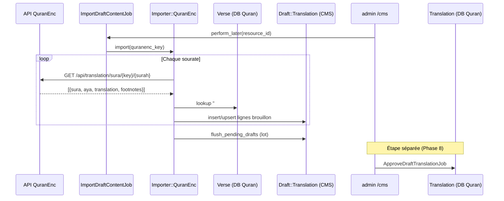

# Phase 10 — Pipeline d'import

> **Série d'onboarding :** plongée progressive pour devenir un contributeur QUL légitime.  
> **Prérequis :** [Phases 1–9](phase-01-what-is-qul.md)  
> **Ce fichier :** comment les données Quran externes entrent dans QUL — sources, correspondance, brouillons, et ce que l'import délibérément *ne fait pas*.

---

## Principe central

**FAIT** — QUL importe presque jamais directement dans les tables de contenu publié. Le pipeline standard est :

```text
Source externe (API, fichier, scrape)
    → lib/importer/*
    → Lignes Draft::* (DB CMS)
    → Revue admin + ApproveDraft*Job (Phase 8)
    → Translation / Tafsir / … (DB Quran)
    → refresh_export! (Phase 11)
```

Traitez les importeurs comme des **parseurs d'entrée non fiables**. Ils normalisent, font correspondre les ayahs, signalent les problèmes et mettent en file les brouillons.

**Exception :** Certains scripts ponctuels `lib/tasks/*.rake` écrivent directement dans les tables Quran (variantes de script, lemmas, boundaries) — ce sont des ops mainteneur, pas le chemin import éditorial.

---

## Catalogue des importeurs

Toutes les classes vivent dans `lib/importer/` (9 fichiers) :

| Classe | Source principale | Type brouillon sortie | Déclencheur typique |
|---|---|---|---|
| `Importer::QuranEnc` | API [quranenc.com](https://quranenc.com) | `Draft::Translation` (+ `Draft::FootNote`) | Bouton admin, job hebdomadaire, console |
| `Importer::QuranEncTafsir` | AJAX/API tafsir QuranEnc | `Draft::Tafsir` | `ImportDraftContentJob` |
| `Importer::TafsirApp` | API Tafsir.app | `Draft::Tafsir` | `ImportDraftContentJob` |
| `Importer::IslamEnc` | IslamEnc | brouillons | Console / rake (legacy) |
| `Importer::QuranAcademy` | Quran Academy | brouillons | Console |
| `Importer::QuranKsuEduTafsir` | Pages tafsir KSU | brouillons | Console |
| `Importer::QuranTafsirNet` | tafsir.net | brouillons | Console |
| `Importer::EQuranLibrary` | bibliothèque e-quran | brouillons | Console |
| `Importer::Base` | Utilitaires partagés | — | Classe parente |

**INFÉRENCE :** `QuranEnc` + `QuranEncTafsir` sont le **chemin production** branché à Sidekiq. Les autres sont spécialisés ou historiques.

---

## Points d'entrée — comment les imports démarrent

### 1. UI Admin (manuel)

`app/admin/content/resource_content.rb` :

| Bouton | Condition | Job |
|---|---|---|
| **Import Draft translation/tafsir** | `resource.syncable?` (QuranEnc ou TafsirApp) | `DraftContent::ImportDraftContentJob` |

```ruby
# app/jobs/draft_content/import_draft_content_job.rb
if resource.sourced_from_quranenc?
  resource.tafsir? ? QuranEncTafsir.new.import(key) : QuranEnc.new.import(key)
elsif resource.sourced_from_tafsir_app?
  TafsirApp.new.import(key)
end
```

### 2. Vérificateur planifié (automatique)

`config/sidekiq_scheduler.yml` — chaque dimanche 06:00 :

```yaml
DraftContent::CheckContentChangesJob
```

Flux (`app/jobs/draft_content/check_content_changes_job.rb`) :

1. Scrape le journal des modifications QuranEnc via `Importer::QuranEnc#get_change_log`
2. Compare les timestamps `meta_data` par `quranenc-key`
3. Crée `AdminTodo` + commentaire ActiveAdmin sur les mises à jour
4. Auto-enqueue `ImportDraftContentJob` **seulement si** la ressource n'a **pas de brouillons existants** (`!resource.has_draft_translation?`)

**INFÉRENCE :** L'auto-import est conservateur — n'écrase pas une file brouillon en cours.

### 3. Upload fichier JSON (admin)

Sidebar `ResourceContent` → import JSON traductions brouillon :

```ruby
resource.import_draft_translations(file.read)  # parses verse_key per row
```

Utile pour lots préparés hors ligne ou exports tiers (pas API QuranEnc).

### 4. Tâches Rake (mainteneur)

`lib/tasks/` — ops données directes, souvent en contournant `lib/importer/` :

| Tâche | Rôle |
|---|---|
| `bridges:import` | JSON traduction Bridges → brouillons |
| `import:import_qaloon_ayah` | Variante script Qaloun |
| `import:import_warsh_ayah` | Variante script Warsh |
| `one_time:import_draft_translation` | Chargeur brouillon en masse legacy |
| `one_time:import_phrases` | Phrases mutashabihat |

**FAIT** — Les tâches Rake sont exécutées manuellement ; pas partie du workflow contributeur normal.

### 5. Console Rails (développeur)

```ruby
Importer::QuranEnc.new.import('english_saheeh')
Importer::QuranEncTafsir.new.import(:tabary)
Importer::TafsirApp.import_tafsirs(['alaloosi'])
```

---

## Approfondissement : `Importer::QuranEnc` (traductions)

Fichier : `lib/importer/quran_enc.rb` (~760 lignes)

### Algorithme haut niveau

```text
1. Résoudre quran_enc_key → ResourceContent (find or create)
2. Optionnellement créer ResourceContent sibling footnote
3. Pour chaque Chapter (sourate 1..114) :
     GET https://quranenc.com/en/api/translation/sura/{key}/{chapter_id}
4. Pour chaque ayah dans la réponse :
     Faire correspondre verset via "#{sura}:#{aya}" → lookup Verse.verse_key
     Parser traduction + notes de bas de page → Draft::Translation
5. flush_pending_drafts (insert_all / upsert_all par lot)
6. Définir timestamps version meta_data
7. run_after_import_hooks → AdminTodo sur problèmes
```

### Correspondance d'identité — l'étape critique

```ruby
# Preload all verses once
@verses_by_key ||= Verse.all.index_by(&:verse_key)

# Per API row
verse = verses_by_key["#{data['sura']}:#{data['aya']}"]
```

| Champ externe | Identité QUL | Notes |
|---|---|---|
| `data['sura']` + `data['aya']` | `verse.verse_key` (`"2:255"`) | **Clé de correspondance principale** |
| — | `verse.id` | Stocké sur brouillon comme `verse_id` |
| — | `verse.verse_index` | Non utilisé pour correspondance import |

**FAIT** — La correspondance suppose que les numéros sourate/ayah QuranEnc s'alignent avec la table canonique `verses` de QUL. Si le dump est faux ou un ayah manque, `verse` est `nil` → crash dans `import_verse` sauf si protégé.

**INFÉRENCE :** `verse.id` est utilisé en aval mais **verse_key** (ou paire sura+aya) est l'identité import déboguable humainement.

### Résolution ResourceContent

```ruby
TRANSLATIONS_MAPPING = {
  english_saheeh: { id: 20 },
  urdu_junagarhi: { id: 54 },
  dutch_center: { language: 118, name: '...', id: 942 },
  # … 50+ known keys
}
```

Ordre de recherche :

1. `TRANSLATIONS_MAPPING[key][:id]` codé en dur → `ResourceContent.find`
2. Sinon `meta_data ->> 'quranenc-key' = key`
3. Sinon créer nouvelle ressource (langue depuis code ISO API, `approved: false`)

### Construction ligne brouillon

```ruby
translation = existing_drafts(resource)[verse.id] ||
              Draft::Translation.new(verse: verse, resource_content: resource)

translation.draft_text = cleaned_external_text
translation.current_text = published Translation.text (if exists)
translation.text_matched = current_text == draft_text
translation.imported = false
translation.translation_id = current_translation&.id
translation.set_meta_value('source_data', data)  # raw API payload
```

**Écriture par lot** (performance) :

```ruby
BATCH_SIZE = 500
# accumulates in @pending_drafts, then:
Draft::Translation.insert_all(new_rows)
Draft::Translation.upsert_all(existing_rows, unique_by: :id)
```

Les traductions riches en notes de bas de page sont sauvegardées immédiatement (par ayah) car les IDs de notes doivent être intégrés dans le HTML avant le batching.

### Pipeline notes de bas de page

Quand `TRANSLATIONS_WITH_FOOTNOTES` ou `REGEXP_FOOTNOTES` inclut la clé :

1. Créer ResourceContent sibling avec `sub_type: footnote`
2. Parser marqueurs notes depuis texte API avec regex par traduction
3. Créer lignes `Draft::FootNote`
4. Réécrire marqueurs au format QUL : `<sup foot_note=#{id}>1</sup>`
5. Signaler `need_review: true` sur échecs de mapping → `log_issue` → `AdminTodo`

**FAIT** — Le mapping des notes de bas de page est la partie la plus complexe de l'import traduction. Beaucoup de méthodes privées `parse_*` existent pour traductions cas limites (ex. `parse_pashto_zakaria`).

### Hooks post-import

```ruby
# Importer::Base#run_after_import_hooks
resource.run_draft_import_hooks   # sets synced-at; tafsir-only digest logic
# + create AdminTodo per issue tag if @issues present
```

Pour les traductions, `run_draft_import_hooks` sur `ResourceContent` est léger (surtout `synced-at`). Les imports tafsir exécutent une logique groupement/dédup plus lourde.

---

## Approfondissement : `Importer::QuranEncTafsir`

Étend `QuranEnc`, fichier : `lib/importer/quran_enc_tafsir.rb`

### Différences avec l'import traduction

| Aspect | Traduction | Tafsir |
|---|---|---|
| Modèle brouillon | `Draft::Translation` | `Draft::Tafsir` |
| Cardinalité | `1_ayah` | `n_ayah` (plages groupées) |
| Pré-import | Upsert brouillons par verset | **`delete_all` brouillons existants** pour la ressource |
| API | `/en/api/translation/sura/...` | `/ar/ajax/tafsir/{key}/{chapter}/{ayah}` ou API mokhtasar |
| HTML | Nettoyage léger | `TafsirSanitizer` + mapping couleur→classe CSS par ID tafsir |
| Post-hooks | Léger | `generate_text_digest`, `check_duplicate_tafsir_draft_text`, `create_draft_tafsir_groups` |

### Récupération par verset

```ruby
url = "https://quranenc.com/ar/ajax/tafsir/#{key}/#{verse.chapter_id}/#{verse.verse_number}"
# mokhtasar variant uses /api/v1/translation/aya/{key}/{chapter}/{ayah}
```

La correspondance utilise `verse.chapter_id` + `verse.verse_number` (équivalent à `verse_key`).

### Ligne brouillon tafsir

```ruby
draft_tafsir.verse_key = verse.verse_key
draft_tafsir.start_verse_id = verse.id   # initial 1:1 grouping
draft_tafsir.end_verse_id = verse.id
draft_tafsir.draft_text = sanitize_text(api_html)
draft_tafsir.current_text = existing published Tafsir.text
```

**INFÉRENCE :** Le groupement de plusieurs ayahs en un bloc tafsir se fait dans `run_draft_import_hooks` → `create_draft_tafsir_groups`, pas pendant la récupération initiale par ayah.

---

## Approfondissement : `Importer::TafsirApp`

Source tafsir alternative pour ressources avec `tafsir_app_key` dans meta_data.

```ruby
TAFISR_MAPPING = { 'tabari' => 15, 'ibn-katheer' => 14, ... }

def import(key)
  resource_content = ResourceContent.find(TAFISR_MAPPING[key])
  Draft::Tafsir.where(resource_content_id: resource_content.id).delete_all
  Verse.find_each { |verse| ... fetch from Tafsir.app ... }
end
```

Même modèle draft-first ; API et map ID ressource codée en dur différentes.

---

## `Importer::Base` — boîte à outils partagée

| Méthode | Rôle |
|---|---|
| `get_json(url)` | RestClient + retry sur timeout/404 |
| `get_html(url)` | Scrape Mechanize (journal modifications) |
| `sanitize` / `fix_encoding` | HTML → texte brut |
| `simple_format` | Enveloppement paragraphes |
| `create_draft_tafsir` | Construire brouillon tafsir groupé avec plage versets |
| `run_after_import_hooks` | Création `AdminTodo` depuis `@issues` |
| `log_issue({ tag:, text: })` | Collecter problèmes de parsing |

**FAIT** — Les problèmes deviennent des lignes `AdminTodo` taguées par type de problème (`missing-footnote-mapping`, etc.).

---

## Identité & provenance après import

Champs `ResourceContent.meta_data` définis pendant l'import :

| Clé | Quand |
|---|---|
| `source` | `'quranenc'` |
| `quranenc-key` | Clé API externe |
| `draft-quranenc-import-version` | Version en attente (avant approbation admin) |
| `draft-quranenc-import-timestamp` | Timestamp en attente |
| `synced-at` | `run_draft_import_hooks` |
| `has-footnotes` | Ressource footnote créée |

Après **approbation** admin (pas import), `run_after_import_hooks` promeut :

```ruby
quranenc-imported-version  ← draft-quranenc-import-version
quranenc-imported-timestamp ← draft-quranenc-import-timestamp
last-import-at             ← Time.now
```

**FAIT** — Chaîne de provenance : version externe → meta brouillon → meta publié (Phase 3).

---

## Séquence bout en bout



---

## Ce que l'import ne fait PAS

| Attente | Réalité |
|---|---|
| Mettre à jour `Translation.text` publié | **Non** — brouillons uniquement |
| Rafraîchir téléchargements `/resources` | **Non** |
| Définir `ResourceContent.approved = true` | **Non** (nouvelles ressources démarrent `approved: false`) |
| Créer `DownloadableResource` | **Non** (pipeline export) |
| Exécuter validations ActiveRecord | **Non** — `save(validate: false)` partout |
| Garantir exactitude notes de bas de page | **Non** — signale `need_review` + `AdminTodo` |

---

## Gestion erreurs & observabilité

| Mécanisme | Rôle |
|---|---|
| Tableau `@issues` dans importeur | Collecter problèmes parsing par ayah |
| `AdminTodo` | File actionnable dans tableau de bord CMS |
| `ActiveAdmin::Comment` | Piste d'audit sur ressource (depuis job vérificateur) |
| `log_message` | stdout pendant runs console/rake |
| `sidekiq_options retry: 1` | Une retry sur échec job |

**Débogage import échoué :**

1. Sidekiq Web `/sidekiq` — backtrace exception job
2. `/cms/admin_todos` — filtrer par `resource_content_id`
3. `/cms/draft_translations?need_review=true` — flags par ayah
4. `draft.meta_data['source_data']` — payload API brut préservé

---

## Rake vs `lib/importer` — quand utiliser lequel

| Utiliser `lib/importer` quand… | Utiliser `lib/tasks` quand… |
|---|---|
| Tirer depuis une API externe récurrente | Migration historique ponctuelle |
| La sortie doit passer par brouillon → approbation | Écrire script/audio/morphologie directement |
| Besoin suivi problèmes `AdminTodo` | Le mainteneur sait que les données sont fiables |
| Branché aux jobs Sidekiq | Invocation console ad-hoc |

---

## Ajouter une nouvelle traduction QuranEnc (modèle mental contributeur)

**INFÉRENCE** — étapes mainteneur typiques :

1. Trouver la clé QuranEnc (ex. `english_saheeh`)
2. Ajouter à `TRANSLATIONS_MAPPING` si nouvelle (avec `id` ou `language` + `name`)
3. Si notes de bas de page : ajouter regex à `REGEXP_FOOTNOTES` ou `TRANSLATIONS_WITH_FOOTNOTES`
4. Créer/lier `ResourceContent` avec `quranenc-key` dans meta_data
5. Exécuter `Importer::QuranEnc.new.import('key')` en console ou cliquer Import Draft dans CMS
6. Réviser brouillons dans `/cms/draft_translations`
7. Approbation en masse → rafraîchir téléchargements

---

## Incertitudes

| # | Question | Label |
|---|---|---|
| 1 | Liste complète des ressources production en sync hebdomadaire auto | **INFÉRENCE** — seulement celles avec `quranenc-key` dans meta_data |
| 2 | Si `verse.id` égale toujours la position dans l'ordre mushaf | **INCONNU** — l'import utilise `verse_key` pas `verse_index` |
| 3 | Comportement quand QuranEnc ajoute une variante sourate/ayah | **INCONNU** — se manifesterait comme lookup verset nil |
| 4 | Quels importeurs hors QuranEnc/TafsirApp sont encore activement utilisés | **INFÉRENCE** — les autres semblent console uniquement |

---

## Résumé Phase 10

```text
API/fichier externe
  → lib/importer (parse + match verse_key)
  → Draft::* (DB CMS, imported: false)
  → job approbation admin
  → contenu publié (DB Quran)
  → exporteur (Phase 11)
```

Le rôle de la couche import est **ingestion fidèle avec provenance** — pas publication. Ne supposez jamais qu'un import a rendu quelque chose public.

---

## Arrêt ici — questions avant la Phase 11

La Phase 11 couvre le **pipeline d'export** (`lib/exporter/`, génération JSON/SQLite, attache S3).

1. Pourquoi les importeurs écrivent des brouillons au lieu de mettre à jour `Translation` directement ?
2. Quelle chaîne chercheriez-vous dans les logs si l'ayah `2:255` a échoué à l'import ?
3. Après complétion de `ImportDraftContentJob`, quelles trois URLs CMS vérifieriez-vous ?

Répondez avec vos questions, ou dites **« proceed »** pour la **Phase 11 — Pipeline d'export**.

---

*Généré pendant l'onboarding contributeur QUL. Phase 10 sur ~24. Investigation en lecture seule — aucun code modifié.*
