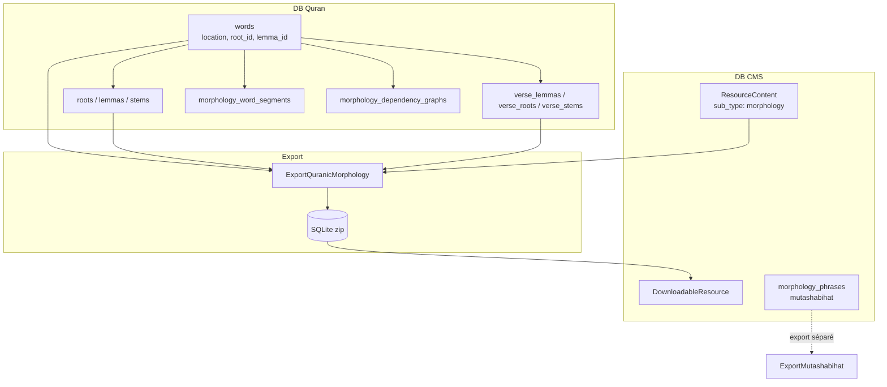

# Phase 12 — Morphologie / données linguistiques arabes

> **Série d'onboarding :** plongée progressive pour devenir un contributeur QUL légitime.  
> **Prérequis :** [Phases 1–11](phase-01-what-is-qul.md)  
> **Ce fichier :** comment QUL modélise les données linguistiques arabes — racines, lemmas, stems, tags grammaticaux, graphes de dépendance — et en quoi cela diffère des outils mutashabihat.

---

## Première clarification : « morphologie » signifie plusieurs choses dans QUL

Le mot **morphologie** apparaît à plusieurs endroits. Ils se chevauchent mais ne sont pas interchangeables :

| Sous-système | Ce que c'est | DB principale | Téléchargement public ? |
|---|---|---|---|
| **Ressources morphologie** (`/resources/morphology`) | Racines, lemmas, stems (niveau mot + ayah) | Quran | **Oui** — SQLite |
| **Colonnes linguistiques mot** | `words.root_id`, `lemma_id`, `stem_id` | Quran | Via exports morphologie |
| **`Morphology::WordSegment`** | Features POS/grammaire riches par segment de mot | Quran | **INFÉRENCE :** pas encore entièrement exporté |
| **Graphes dépendance / treebank** | Graphes syntaxiques style Iʿrāb par ayah | Quran | **INCONNU** — outillage, pas JSON catalogue |
| **`Morphology::Phrase`** | Correspondance phrases mutashabihat | **CMS** | Via export `mutashabihat` (catégorie différente) |
| **`lib/corpus/morphology/`** | Définitions types tags POS (45 tags) | Code uniquement | N/A |

**À COMPRENDRE MAINTENANT :** `/resources/morphology` n'est **pas** l'outil contributeur mutashabihat (`/morphology_phrases`). Même domaine d'équipe, produits différents.

---

## Modèle mental consommateur

La morphologie répond : **« Quelles sont les parties linguistiques de ce mot arabe ? »**

```text
Word at location "2:255:13"
  ├── text (from words.text_qpc_hafs — join Quran Script resource)
  ├── root   (ج ذ ر)
  ├── lemma  (ذِكْر)
  ├── stem   (ذكر)
  └── (optionally) POS tags, grammar segments, dependency edges
```

**FAIT** — Tutoriel officiel : `app/views/docs/markdown/tutorial-morphology-end-to-end.md`

Clé de jointure pour les apps : **`location`** / `word_location` (`"surah:ayah:word_position"`), ex. `"1:1:1"`.

---

## Hiérarchie d'identité (spécifique morphologie)

En s'appuyant sur la Phase 2 :

```text
Chapter (surah)
  └── Verse (ayah)          verse_key: "2:255"
        └── Word            location: "2:255:13"
              ├── root_id → Root
              ├── lemma_id → Lemma
              ├── stem_id → Stem
              └── Morphology::Word / WordSegment (analyse étendue)
```

| Identifiant | Exemple | Utilisé pour |
|---|---|---|
| `verse_key` | `"2:255"` | Agrégats lemma/stem/root niveau ayah |
| `location` | `"2:255:13"` | Jointures morphologie niveau mot |
| `word.position` | `13` | Troisième mot dans l'ayah (avec contexte sourate+ayah) |
| `sequence_number` | unique global | **FAIT** — index unique sur `words` ; ordre interne |

**INFÉRENCE :** Toujours joindre la morphologie aux données mot Quran Script sur `location`, pas sur le texte arabe seul (homographes existent).

---

## Packages morphologie téléchargeables

### Câblage ResourceContent

```ruby
ResourceContent.morphology  # sub_type: 'morphology'
# meta_data['morphology-resource-type'] → 'root' | 'lemma' | 'stem' | 'morphology'
# cardinality: '1_word' (niveau mot) ou '1_ayah' (niveau ayah)
```

Sélection partial aperçu (`app/views/resources/previews/_morphology.html.erb`) :

```ruby
partial_name = "#{one_word? ? 'word' : 'ayah'}_#{resource_type}"
# e.g. word_root_preview, ayah_lemma_preview
```

### Pipeline export

```ruby
# lib/exporter/downloadable_resources.rb
Exporter::ExportQuranicMorphology.new(...).export_sqlite
```

`ExportQuranicMorphology` branche sur `morphology-resource-type` :

| Type | Cardinalité | Tables SQLite | Statut |
|---|---|---|---|
| `root` | mot | `roots`, `root_words` | **FAIT** — implémenté |
| `lemma` | mot | `lemmas`, `lemma_words` | **FAIT** — implémenté |
| `stem` | mot | `stems`, `stem_words` | **FAIT** — implémenté |
| `root` | ayah | `roots` (verse_key, text) | **FAIT** — via `verse_root` |
| `lemma` | ayah | `lemmas` (verse_key, text) | **FAIT** — via `verse_lemma` |
| `stem` | ayah | `stems` (verse_key, text) | **FAIT** — via `verse_stem` |
| `morphology` | any | — | **FAIT** — `export_morphology` retourne `todo` ("pending.json") |

**DOCUMENTATION POSSIBLEMENT OBSOLÈTE / LACUNE :** L'export morphologie grammaticale complet **n'est pas implémenté** dans l'exporteur — seules les variantes root/lemma/stem sont livrées aujourd'hui.

### Forme SQLite niveau mot (exemple root)

```sql
-- roots table
id, arabic_trilateral, english_trilateral, words_count, uniq_words_count

-- root_words table
root_id, word_location   -- e.g. "2:255:1"
```

### Forme SQLite niveau ayah

```sql
-- roots table (ayah variant)
verse_key TEXT, text TEXT   -- aggregated root string for whole ayah
```

---

## Modèles core DB Quran

### `Word` — le hub de jointure

```ruby
# app/models/word.rb (QuranApiRecord)
belongs_to :root, :lemma, :stem  # linguistic FKs
# location, verse_key, position, text_qpc_hafs, many script columns
```

Chaque téléchargement morphologie remonte finalement à `words` + tables associées.

### `Root`, `Lemma`, `Stem`

| Modèle | Table | Champs clés |
|---|---|---|
| `Root` | `roots` | `arabic_trilateral`, `english_trilateral`, `value` |
| `Lemma` | `lemmas` | `text_madani`, `text_clean`, `en_translations` (jsonb) |
| `Stem` | `stems` | `text_madani`, `text_clean` |

**FAIT** — Les gloses anglaises Lemma peuvent être importées en masse via `lib/tasks/import_lemmas.rake` depuis CDN `lemmas.txt`.

### Agrégats ayah

| Modèle | Table | Rôle |
|---|---|---|
| `VerseLemma` | `verse_lemmas` | Texte lemma concaténé par ayah |
| `VerseRoot` | `verse_roots` | Chaîne racine concaténée par ayah |
| `VerseStem` | `verse_stems` | Texte stem concaténé par ayah |

Liés depuis le modèle `Verse` — utilisés dans aperçus et exports morphologie niveau ayah.

---

## Analyse étendue : `Morphology::Word` + `WordSegment`

### `Morphology::Word` (table `morphology_words`)

```ruby
class Morphology::Word < QuranApiRecord
  belongs_to :word, :verse
  belongs_to :grammar_pattern, :grammar_base_pattern
  has_many :word_segments, :word_tokens, :derived_words, :verb_forms
  # location field mirrors word.location
```

Ligne morphologie haut niveau par mot Quran — lie aux patterns grammaticaux et segments.

### `Morphology::WordSegment` (`morphology_word_segments`)

Analyse sub-mot granulaire avec ~20 colonnes dimension linguistique :

| Famille colonne | Exemples |
|---|---|
| POS | `part_of_speech_key`, `pos_tags` |
| Rôles grammaticaux | `grammar_term_id`, `grammar_concept_id`, `grammar_role_id` |
| Features morphologie | `person_type`, `gender_type`, `number_type`, `aspect_type`, `mood_type`, `case_type`, `voice_type` |
| Réfs lexicales | `root_id`, `lemma_id`, `root_name`, `lemma_name` |
| Affichage | `text_qpc_hafs`, `segment_type` |

**FAIT** — Couleurs tags POS définies dans le modèle (`POS_TAG_COLORS`) pour rendu UI.

**INFÉRENCE :** Ce sont les données qu'on voudrait dans un export `morphology` complet — actuellement non exposées via `ExportQuranicMorphology`.

---

## Système de types grammaticaux (`lib/corpus/morphology/`)

Classes Ruby définissant le vocabulaire de tags — pas tables base de données :

| Fichier | Définit |
|---|---|
| `part_of_speech.rb` | 45 tags POS (N, V, P, CONJ, …) avec descriptions arabes |
| `case_type.rb`, `mood_type.rb`, `gender_type.rb`, … | Dimensions de features |
| `part_of_speech_category.rb` | Groupements |

Utilisé par UIs treebank/graphe et validateurs. **FAIT** — testé dans `test/lib/corpus/morphology_types_test.rb`.

---

## Graphes de dépendance & treebank (morphologie syntaxique)

### Modèles (DB Quran)

```text
Morphology::DependencyGraph::Graph     # one graph per ayah (or multiple graph_number)
  ├── GraphNode                          # tokens in syntactic tree
  └── GraphNodeEdge                      # relation labels (subject, object, …)
```

**FAIT** — Enum `review_status` : `draft`, `approved`, `need_correction`.

### Routes publiques / contributeur

```text
/morphology/dependency-graphs           # index, show, edit
/morphology/dependency-graphs/:id/nodes # CRUD nodes
/morphology/treebank                    # visualiseur treebank lecture seule
/morphology/treebank/:chapter/:verse    # affichage par ayah
```

Contrôleurs : `Morphology::DependencyGraphsController` (édition protégée), `Morphology::TreebankController`.

**FAIT** — Labels relation arête internationalisés via `I18n.t("morphology.edge_relations.#{label}")`.

**FAIT** — Route API existe : `GET /api/morphology/edge_relations` (listée dans `config/routes.rb`).

### Import Noor Bayan

`app/services/morphology/noor_bayan/importer.rb` — import CSV pour données treebank :

- Crée phrases, tokens, formes de surface
- Réinitialise tables, vérifie comptages contre constantes `EXPECTED`
- Crée un `ResourceContent` pour "NoorBayan Quranic Treebank"

**INFÉRENCE :** Pipeline mainteneur spécialisé — pas le flux brouillon QuranEnc standard.

---

## Phrases mutashabihat (PAS téléchargements morphologie)

### `Morphology::Phrase` (DB CMS)

```ruby
class Morphology::Phrase < ApplicationRecord  # NOT QuranApiRecord
  has_many :phrase_verses
  # phrase_type, source_verse_id, word_position_from/to, approved
end
```

Outil contributeur : `/morphology_phrases` (listé comme « Mutashabihat ul Quran » sur `/tools`).

| Aspect | Téléchargement morphologie | Phrases mutashabihat |
|---|---|---|
| DB | Quran | CMS (`morphology_phrases` dans `db/schema.rb`) |
| Type export | `morphology` | `mutashabihat` |
| Objectif | Lookup root/lemma/stem | Correspondance phrases similaires entre ayahs |
| Service | `Exporter::ExportQuranicMorphology` | `Exporter::ExportMutashabihat` |

**FAIT** — `Morphology::MatchingVerse` (CMS) stocke ayahs correspondantes suggérées avec scores — utilisé dans UI relecture phrases.

---

## Pages parcours public

Pages référence légères (sans auth) :

```text
/morphology/roots/:arabic_trilateral    # Modale détail racine
/morphology/lemmas/:id
/morphology/stems/:id
/morphology/word                        # recherche mot
/morphology/grammar/:category/:term     # doc terme grammatical
```

Les contrôleurs sont légers — `Root.find_by!(arabic_trilateral: params[:id])`.

Les aperçus catalogue ressource (`word_root_preview.html.erb`) rendent des tuiles mot liant vers ces pages.

---

## CMS Admin (`app/admin/morphology/`)

18 fichiers admin couvrant :

| Ressource admin | Modèle |
|---|---|
| `word.rb`, `word_segment.rb`, `word_token.rb` | Lignes analyse morphologie |
| `grammar_term.rb`, `grammar_concept.rb`, `grammar_pattern.rb` | Référence grammaire |
| `graph.rb`, `graph_node.rb`, `graph_node_edge.rb` | Graphes de dépendance |
| `phrase.rb`, `phrase_verse.rb`, `matching_verse.rb` | Mutashabihat (CMS) |
| `sentence.rb`, `derived_word.rb`, `word_verb_form.rb` | Support treebank |

Le travail éditorial sur les données linguistiques se fait ici — analogue à `/cms/translations` pour les ressources texte.

---

## Diagramme flux de données



---

## Recette d'intégration (développeur app)

Depuis le tutoriel officiel — le modèle de jointure :

```javascript
// 1. Load morphology SQLite → index by word_location
const morphologyIndex = buildMorphologyIndex(rows);

// 2. Load Quran Script word-by-word JSON (separate resource)
const enriched = wordRows.map(word => ({
  ...word,
  morphology: morphologyIndex[word.location] || null
}));

// 3. Tap word → show root/lemma/stem panel
```

**FAIT** — Les données script mot et morphologie sont des **ressources téléchargeables séparées** — vous devez joindre côté client.

---

## Tâches mainteneur (import non standard)

| Tâche | Rôle |
|---|---|
| `import:import_lemma_translations` | Gloses anglaises sur `Lemma.en_translations` |
| `migrate_word_roots.rake` | Remplissage ID racine |
| `Morphology::NoorBayan::Importer` | Ingestion CSV treebank |
| `lib/internal/corpus.rake` | Maintenance corpus |

Ces écritures vont **directement dans les tables Quran** — pas le pipeline brouillon → approbation utilisé pour les traductions.

---

## Permissions & accès contributeur

| Outil | Modèle d'accès |
|---|---|
| Édition graphe dépendance | `UserProject` + `authorize_access!` sur edit/split |
| Phrases morphologie (mutashabihat) | Idem — modérateur peut gérer `Morphology::Phrase` selon `Ability` |
| Téléchargements morphologie | Lecture publique — pas d'auth |

---

## Pièges courants

1. **`location` est la clé de jointure** — pas `word.id` dans la doc consommateur (bien que les FK internes utilisent les IDs).

2. **Les ressources ayah vs mot sont des téléchargements séparés** — `cardinality_type` sur `ResourceContent` détermine la forme d'export.

3. **`export_morphology` est un stub** — ne vous attendez pas à un SQLite POS/grammaire complet dans `/resources` pour l'instant.

4. **`Morphology::Phrase` est CMS** — ne le requêtez pas via connexions `QuranApiRecord`.

5. **Graphes de dépendance ≠ SQLite morphologie** — les données graphe sont éditées/visualisées dans les outils web ; chemin export flou.

6. **Les colonnes texte arabe se multiplient** — la morphologie utilise `text_qpc_hafs` ; associez toujours la ressource script avec laquelle vous pair.

---

## Incertitudes

| # | Question | Label |
|---|---|---|
| 1 | Calendrier/plan pour export SQLite `morphology` complet (données WordSegment) | **INCONNU** |
| 2 | Si les graphes de dépendance deviendront un type de ressource téléchargeable | **INCONNU** |
| 3 | Quelles tables morphologie existent seulement dans le dump prod complet vs mini dump | **INCONNU** jusqu'à la Phase 17 |
| 4 | Relation entre `Morphology::Word` et `Morphology::WordSegment` dans l'UI | **INFÉRENCE** — Word est la ligne parent ; segments sont les morceaux sub-mot |

---

## Résumé Phase 12

La morphologie QUL est une **pile linguistique en couches** :

```text
words (canonique) + FKs root/lemma/stem
  → packages SQLite téléchargeables (root/lemma/stem)
  → WordSegment / graphes dépendance (analyse riche, surtout in-app)
  → Morphology::Phrase (mutashabihat — CMS + export séparé)
```

En tant que contributeur : sachez quelle couche vous touchez avant de choisir un dossier.

---

## Arrêt ici — questions avant la Phase 13

La Phase 13 couvre **les layouts mushaf** — mapping page, alignement lignes, et export.

1. Quelle clé joint les lignes SQLite morphologie aux données mot Quran Script ?
2. Quelle est la différence entre `/resources/morphology` et `/morphology_phrases` ?
3. Pourquoi `export_morphology` retourne « pending » ?

Répondez avec vos questions, ou dites **« proceed »** pour la **Phase 13 — Layouts mushaf**.

---

*Généré pendant l'onboarding contributeur QUL. Phase 12 sur ~24. Investigation en lecture seule — aucun code modifié.*
