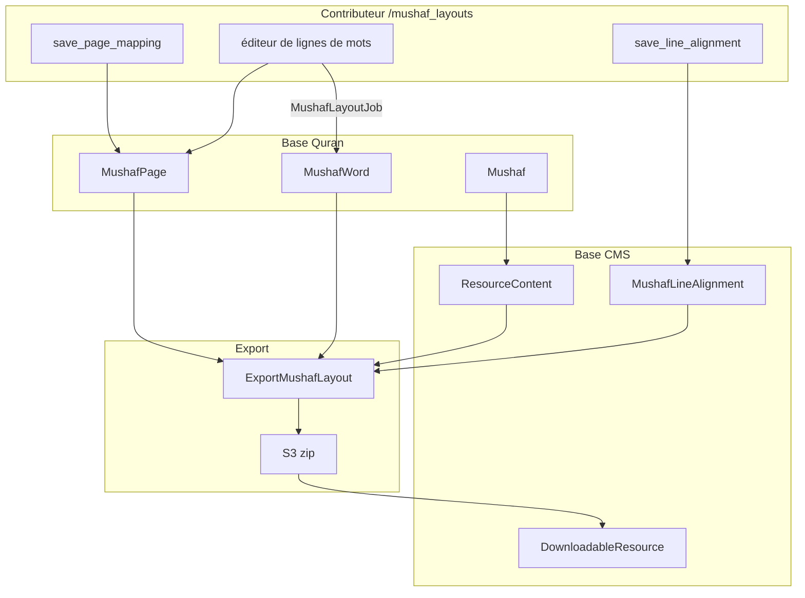

# Phase 13 — Mises en page mushaf

> **Série d'intégration :** plongée progressive pour devenir un contributeur QUL légitime.  
> **Prérequis :** [Phases 1–12](phase-01-what-is-qul.md)  
> **Ce fichier :** comment QUL modélise la structure des pages imprimées du mushaf — cartographie des pages, alignement des lignes, placement des mots et export.

---

## Qu'est-ce qu'une mise en page mushaf (par rapport aux autres ressources)

La plupart des ressources QUL répondent à **« quel est le contenu ? »** (texte de traduction, URL audio, chaîne de racine).

Les mises en page mushaf répondent à **« comment cette page est imprimée ? »** :

| Champ | Signification |
|---|---|
| `page_number` | Page physique du mushaf (1–604 typique) |
| `line_number` | Index de ligne dans la page |
| `line_type` | `ayah`, `surah_name`, ou `basmallah` |
| `is_centered` | Ligne centrée ou justifiée |
| `first_word_id` / `last_word_id` | Plage de mots sur cette ligne |
| `surah_number` | Pour les lignes `surah_name` |

**FAIT** — Tutoriel officiel : `app/views/docs/markdown/tutorial-mushaf-layout-end-to-end.md`

Les consommateurs combinent les ressources **mushaf-layout** + **quran-script** (mot par mot) + **font** pour afficher des vues fidèles à la page.

---

## Entités principales

```text
ResourceContent (sub_type: layout, cardinality: 1_page)
  └── Mushaf (lines_per_page, pages_count, default_font_name)
        ├── MushafPage (page_number, first/last word & verse, verse_mapping JSON)
        ├── MushafWord (per-word line/page position in THIS layout)
        └── MushafLineAlignment (surah_name / bismillah / center lines)  [CMS DB — see below]
```

| Modèle | Classe de base | Table | Rôle |
|---|---|---|---|
| `Mushaf` | `QuranApiRecord` | `mushafs` | Édition de mise en page (Indopak 15 lignes, QPC v2, etc.) |
| `MushafPage` | `QuranApiRecord` | `mushaf_pages` | Limites de page + cartographie des ayahs |
| `MushafWord` | `QuranApiRecord` | `mushaf_words` | Placement des mots sur une page/ligne spécifique |
| `MushafLineAlignment` | `ApplicationRecord` | `mushaf_line_alignments` | Lignes spéciales (titre de sourate, basmallah, centre) |
| `Word` | `QuranApiRecord` | `words` | Identité canonique du mot (`location`, `word_index`) |

**ANOMALIE (à garder en tête) :** `MushafLineAlignment` vit dans **CMS** `db/schema.rb` alors que `Mushaf`/`MushafPage`/`MushafWord` sont dans la **base Quran**. Le code les joint par `mushaf_id` + `page_number` — pas de contrainte FK entre les bases.

---

## Lier Mushaf ↔ ResourceContent

```ruby
# ResourceContent
scope :mushaf_layout, -> { where(sub_type: SubType::Layout) }

def get_mushaf_id
  meta_value('mushaf') || resource_id || Mushaf.where(resource_content_id: id).first&.id
end
```

**FAIT** — `Mushaf` `after_create :attach_resource_content` crée/lie l'enveloppe catalogue.

**FAIT** — L'exportateur résout le mushaf :

```ruby
Mushaf.find_by(resource_content_id: resource_content.id) || resource_content.resource
```

Catalogue public : `/resources/mushaf-layout` → `resource_type: 'mushaf-layout'`, `cardinality_type: '1_page'`.

---

## Clés d'identité pour le rendu

| Clé | Exemple | Utilisé pour |
|---|---|---|
| `page_number` | `604` | Navigation page par page |
| `word.location` | `"2:255:1"` | Jointure avec Quran Script |
| `word.word_index` | global 1..77429 | **Export `first_word_id`/`last_word_id`** |
| `words.id` | PK interne | `MushafWord.word_id`, éditeur de mise en page |

**DÉTAIL CRITIQUE D'EXPORT :**

```ruby
# lib/exporter/export_mushaf_layout.rb
range_start = words.first.word_index   # NOT words.id
range_end = words.last.word_index
```

**INFÉRENCE :** Dans le SQLite téléchargé, `first_word_id`/`last_word_id` font référence à **`words.word_index`**, malgré le nom de colonne. La documentation du tutoriel décrit la jointure aux tables de mots du script via cette plage — vérifiez contre votre dump en Phase 17.

**INCERTITUDE :** `MushafPage.first_verse_id` est défini depuis `word.verse_id` dans `MushafLayoutJob`, alors que certaines requêtes utilisent parfois `verse_index` — suppose que `verse_id == verse_index` dans les données de production (Phase 5).

---

## Outil contributeur : `/mushaf_layouts`

Listé sur `/tools` sous **« Mushaf layouts »** — relecture et correction des mises en page.

### Routes

```ruby
resources :mushaf_layouts, except: [:destroy, :new] do
  member do
    put :save_page_mapping      # set first/last ayah on page
    put :save_line_alignment    # mark surah name / bismillah / center
  end
end
```

| URL | Action |
|---|---|
| `/mushaf_layouts` | Index — tous les mushafs |
| `/mushaf_layouts/:id?page_number=N` | Afficher une page (ou mode comparaison avec `?compare=`) |
| `/mushaf_layouts/:id/edit?page_number=N` | Éditeur glisser-déposer mot→ligne (auth requise) |
| `PUT .../save_page_mapping` | Mettre à jour les limites d'ayah de `MushafPage` |
| `PUT .../save_line_alignment` | Basculer les métadonnées d'alignement de ligne |

### Accès

Même schéma que la relecture de traduction :

- `UserProject` approuvé pour le `ResourceContent`
- `can_manage?(@resource)` — les super admins passent toujours
- **Écritures directes** — pas de table de brouillon (contraste Phase 9)

---

## Flux d'exécution : édition d'une page

### 1. Cartographie de page (`save_page_mapping`)

```ruby
@mushaf_page.attributes = params_for_page_mapping  # first_verse_id, last_verse_id
@mushaf_page.save(validate: false)
```

Les paramètres convertissent les clés d'ayah via `Utils::Quran.get_ayah_id_from_key` — stocke la plage de versets pour la page.

Répond avec `turbo_stream` ou redirection.

### 2. Alignement de ligne (`save_line_alignment`)

```ruby
MushafLineAlignment.first_or_initialize(mushaf_id, page_number, line_number)
# alignment: center | bismillah | surah_name
# toggle off = clear! (destroy row)
```

Les lignes spéciales ne contiennent pas de mots d'ayah ordinaires — l'export les marque comme `line_type: surah_name` ou `basmallah`.

### 3. Mise en page des mots (`update` → `MushafLayoutJob`)

Le contributeur assigne chaque mot à un numéro de ligne dans l'éditeur visuel :

```ruby
MushafLayoutJob.perform_now(mushaf_id, page_number, layout_params.to_json)
```

Logique du job (`app/jobs/mushaf_layout_job.rb`) :

```text
For each word_id → line_number in mapping:
  upsert MushafWord (line_number, position_in_line, position_in_page, text from mushaf.text_type_method)
Remove MushafWords on page not in mapping
Recompute MushafPage:
  first_word_id, last_word_id
  first_verse_id, last_verse_id  (from word.verse_id)
  verse_mapping JSON (per-surah ayah ranges on page)
```

**FAIT** — `MushafWord` a PaperTrail sur update — les modifications de mise en page sont versionnées.

**FAIT** — En cas d'échec, le contrôleur écrit un script de récupération dans `data/mapping-{mushaf_id}-{page}.json`.

### Sélection de la colonne texte par mushaf

```ruby
# Mushaf#text_type_method — picks Word column by edition name
'code_v2'           # QPC v2
'code_v1'           # QPC v1
'text_indopak_nastaleeq'  # Indopak editions
'text_uthmani'      # Uthmani
'text_qpc_hafs'     # default
```

Les mushafs à glyphes (`using_glyphs?` pour les ids 1, 2) stockent des codes de police, pas de l'arabe en clair.

---

## Mode comparaison

```ruby
# ?compare=<other_mushaf_id>
@compare_mushaf_words = MushafWord.where(mushaf_id: @compared_mushaf.id, page_number: ...)
```

**INFÉRENCE :** Relecture côte à côte contre une mise en page de référence (ex. nouveau Indopak vs QPC établi).

---

## Pipeline d'export (catalogue public)

### Déclenchement

```ruby
DownloadableResource#refresh_export!
  → Exporter::DownloadableResources#export_mushaf_layouts(resource_content:)
```

Ou admin : `Export::MushafLayoutExportJob` (email en masse — chemin séparé, utilise `lib/export_mushaf_layout.rb`).

### Export par ressource (`Exporter::ExportMushafLayout`)

Produit trois formats :

| Format | Méthode | Contenu |
|---|---|---|
| **SQLite** | `export_sqlite` | table `info` + table `pages` (géométrie des lignes) |
| **JSON** | `export_json` | `info.json` + un fichier JSON par page (`issue #257`) |
| **DOCX** | `export_docs` | Documents Word par page (ignoré pour les mises en page basées sur des images) |

```ruby
create_download_file(downloadable_resource, json, 'json')    # zips json/ directory
create_download_file(downloadable_resource, sqlite, 'sqlite')
create_download_file(downloadable_resource, docx, 'docx')   # unless name includes 'image'
```

### Schéma SQLite `pages`

```sql
CREATE TABLE pages (
  page_number INTEGER,
  line_number INTEGER,
  line_type TEXT,        -- 'ayah' | 'surah_name' | 'basmallah'
  is_centered INTEGER,
  first_word_id INTEGER, -- word_index range start (ayah lines)
  last_word_id INTEGER,  -- word_index range end
  surah_number INTEGER   -- surah_name lines
);

CREATE TABLE info (
  name TEXT,
  number_of_pages INTEGER,
  lines_per_page INTEGER,
  font_name TEXT
);
```

### Forme du fichier JSON de page

```json
{
  "page": 1,
  "lines": {
    "1": {
      "type": "surah_name",
      "alignment": "centered",
      "surah_number": 1
    },
    "2": {
      "type": "ayah",
      "alignment": "justified",
      "first_word_id": 1,
      "last_word_id": 4,
      "data": ["بِسْمِ", "ٱللَّهِ", "ٱلرَّحْمَٰنِ", "ٱلرَّحِيمِ"]
    }
  }
}
```

Le tableau `data` utilise `mushaf.text_type_method` — codes de glyphes ou texte arabe selon l'édition.

---

## Export en masse : `lib/export_mushaf_layout.rb`

Séparé de l'export catalogue par ressource — construit un SQLite **combiné** pour mobile/Tarteel :

```ruby
ExportMushafLayout.new.export(ids: MUSHAF_IDS, db_name: 'quran-data.sqlite')
# Exports ALL words (multiple script columns) + layouts for listed mushaf IDs
```

**FAIT** — `MUSHAF_IDS` code en dur ~12 mises en page de production (QPC v1/v2/v4, Indopak 13–17 lignes, Digital Khatt, etc.).

Déclenché par `Export::MushafLayoutExportJob` depuis le tableau de bord admin — envoie un bzip2 par email à l'opérateur.

**INFÉRENCE :** C'est la base d'intégration de l'app Tarteel ; les zips par mise en page sur `/resources` sont le chemin consommateur OSS.

---

## `lib/layout_exporter/`

Utilitaires de support pour les calculs de mise en page :

| Classe | Rôle |
|---|---|
| `LayoutExporter::Base` | Mapping ID mushaf → nom de fichier (`qpc_v2`, `indopak_15_lines`, …) |
| `LayoutExporter::PageLookup` | Recherches d'index de page |
| `LayoutExporter::AyahMetadata` | Métadonnées d'ayah sur les pages |

Utilisé par les scripts de maintenance et l'export en masse — pas le chemin HTTP principal.

---

## CMS admin (`app/admin/quran/mushaf*.rb`)

| Fichier admin | Gère |
|---|---|
| `mushaf.rb` | Paramètres d'édition, déclenchement du job d'export |
| `mushaf_page.rb` | Enregistrements de page |
| `mushaf_word.rb` | Lignes de mots par mise en page |
| `mushaf_line_alignment.rb` | Marqueurs de lignes spéciales |
| `mushaf_page_preview.rb` | Outil de prévisualisation |

Surcharges éditoriales et diagnostics — en parallèle de l'outil contributeur `/mushaf_layouts`.

---

## Recette de rendu (développeur d'application)

D'après le tutoriel officiel :

```text
1. Download mushaf-layout SQLite (pages table)
2. Download quran-script word-by-word SQLite/JSON
3. For each page:
     For each line in pages:
       if line_type == 'surah_name' → render surah heading
       if line_type == 'basmallah'  → render basmallah
       if line_type == 'ayah'       → words where word_index in first..last
4. Apply font resource for glyph rendering (code_v1/code_v2 columns)
```

**FAIT** — Les mushafs image/SVG (`use_images?`, `use_svg?`) utilisent des URL CDN :

```ruby
MushafWord#image_url → "#{CDN_HOST}/qul/images/#{text}"
```

---

## Diagramme de flux de données



---

## Éditions mushaf connues (exemples)

**FAIT** — Les enregistrements `Mushaf` incluent des IDs bien connus référencés dans le code :

| ID | Édition (d'après les commentaires du code) |
|---|---|
| 1 | QPC v2 (1421H) — glyphes |
| 2 | QPC v1 (1405H) — glyphes |
| 5 | Texte KFQPC Hafs |
| 6–8, 17–18, 23, 29 | Variantes Indopak (9–17 lignes) |
| 19 | QPC v4 (1441H) |
| 20, 22 | Digital Khatt v2/v1 |

**INFÉRENCE :** Chaque mushaf activé avec un `ResourceContent` approuvé apparaît sur `/resources/mushaf-layout`.

---

## Pièges courants

1. **Les modifications de mise en page sont immédiates** — contrairement aux traductions, pas de file de brouillons. Testez sur une page avant de continuer.

2. **`first_word_id` dans les exports = `word_index`** — pas `words.id`. Joignez avec précaution.

3. **Trois systèmes d'export** — catalogue par ressource (`Exporter::ExportMushafLayout`), base mobile en masse (`ExportMushafLayout`), job email admin. Fichiers différents.

4. **Alignements de ligne dans la base CMS** — sauvegarde/restauration et configuration locale doivent inclure les tables CMS pour les lignes de nom de sourate.

5. **Mushafs glyphes vs texte** — `text_type_method` détermine si les exports contiennent des codes de police ou de l'arabe Unicode.

6. **Actualisation requise** — modifier les données de mise en page ne met pas à jour automatiquement les zips `/resources` (comme en Phase 11).

7. **`verse_mapping` sur MushafPage** — carte JSON de `chapter_id → "start_ayah-end_ayah"` pour l'UI ; utile pour déboguer les limites de page.

---

## Incertitudes

| # | Question | Label |
|---|---|---|
| 1 | Si `first_verse_id` égale toujours `verse.id` ou parfois `verse_index` | **INFÉRENCE** — le code mélange les deux ; vérifiez sur le dump chargé |
| 2 | Pourquoi `MushafLineAlignment` est CMS alors que les autres tables mushaf sont Quran DB | **INCONNU** — séparation historique |
| 3 | Format d'export mushaf image sur `/resources` | **INFÉRENCE** — DOCX ignoré ; les images peuvent être des assets CDN séparés |
| 4 | Liste complète des IDs mushaf dans le mini dump dev | **INCONNU** jusqu'à la Phase 17 |

---

## Résumé de la Phase 13

Les mises en page mushaf sont des **données de géométrie de page** :

```text
Mushaf (edition) → MushafPage (boundaries) + MushafWord (word→line) + MushafLineAlignment (special lines)
  → export SQLite/JSON/DOCX
  → consumer joins pages.first_word_id..last_word_id to script words by word_index
```

L'outil contributeur écrit **directement dans les tables Quran** via `MushafLayoutJob` — la surface d'édition à plus fort impact dans QUL.

---

## Arrêt ici — questions avant la Phase 14

La Phase 14 couvre le **sous-système audio** (récitations, découpage gapless, segments).

1. Quelles trois tables définissent la structure des lignes d'une page mushaf ?
2. Pourquoi l'export utilise `word_index` mais nomme les colonnes `first_word_id` ?
3. En quoi l'édition mushaf diffère de la relecture de traduction en termes de brouillons ?

Répondez avec vos questions, ou dites **« proceed »** pour la **Phase 14 — Sous-système audio**.
