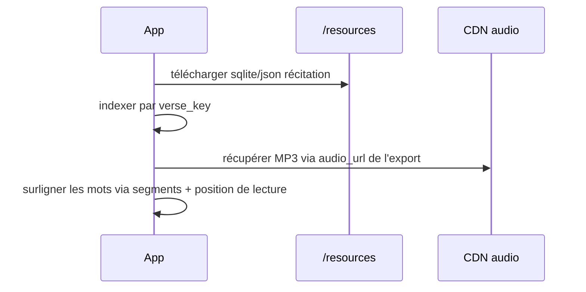
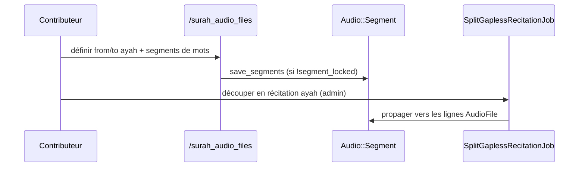

# Phase 14 — Sous-système audio

> **Série d'intégration :** plongée progressive pour devenir un contributeur QUL légitime.  
> **Prérequis :** [Phases 1–13](phase-01-what-is-qul.md)  
> **Ce fichier :** comment QUL stocke, segmente, exporte et diffuse l'audio de récitation du Coran.

---

## Ce que livre le sous-système audio

L'audio QUL n'est pas seulement des URL MP3. C'est un **système en couches** :

| Couche | Ce que reçoivent les consommateurs |
|---|---|
| **Fichiers audio** | Pointeurs vers MP3 (ou autre format) par sourate ou par ayah |
| **Timing ayah** | `timestamp_from` / `timestamp_to` (ms) dans un fichier sourate gapless |
| **Timing mot** | JSON `segments` — début/fin ms par mot dans chaque ayah |
| **Timing lettre** | `letter_segments` — granularité sous-mot (avancé) |
| **Métadonnées** | Durée, débit binaire, taille de fichier, type MIME |

**FAIT** — Tutoriel officiel : `app/views/docs/markdown/tutorial-recitation-end-to-end.md`

Catalogue public : `/resources/recitation`

---

## Deux modèles de récitation parallèles (important)

QUL utilise **deux classes Active Record différentes** pour les récitations :

| Modèle | Table | Cardinalité | Lignes audio | Usage typique |
|---|---|---|---|---|
| `Audio::Recitation` | `audio_recitations` | **Sourate par sourate** (`1_chapter`) | `Audio::ChapterAudioFile` (114 fichiers) | MP3 sourate gapless + segments |
| `Recitation` | `recitations` | **Ayah par ayah** (`1_ayah`) | `AudioFile` (~6236 lignes) | Un MP3 par ayah |
| `ResourceContent` (wbw) | — | **Mot par mot** (`1_word`) | export récitation mot par mot | Rare / spécialisé |

```ruby
# Link between gapless and gapped editions
Audio::Recitation has_one :gapped_recitation, class_name: 'Recitation', foreign_key: :gapless_recitation_id
Recitation belongs_to :gapless_recitation, class_name: 'Audio::Recitation'
```

**INFÉRENCE :** Workflow courant : annoter les segments sur **l'audio sourate gapless**, puis **découper** en fichiers ayah par ayah via `SplitGaplessRecitationJob`.

Les deux dépendent de `ResourceContent` avec `sub_type: 'recitation'` et le `cardinality_type` approprié.

---

## Diagramme d'entités (chemin sourate par sourate)

```text
ResourceContent (recitation, 1_chapter)
  └── Audio::Recitation
        ├── Audio::ChapterAudioFile  (one per surah, 1..114)
        │     └── audio_url → CDN MP3
        └── Audio::Segment  (one per ayah in that surah)
              ├── timestamp_from / timestamp_to  (ayah bounds in surah file)
              ├── segments  (word-level JSON)
              └── letter_segments  (optional)
```

## Diagramme d'entités (chemin ayah par ayah)

```text
ResourceContent (recitation, 1_ayah)
  └── Recitation
        └── AudioFile  (one per verse)
              ├── url / audio_url
              └── segments  (text column — word timing for ayah file)
```

---

## Où vivent les fichiers audio (CDN)

**FAIT** — Les URL ne sont **pas** stockées dans le bucket S3 d'export de QUL. Elles pointent vers des CDN externes :

```ruby
# lib/audio/generate_audio_file.rb
@base_url = resource_content.meta_value("audio-cdn-url") || "https://download.quranicaudio.com"
# Surah: #{base_url}/#{relative_path}/001.mp3
# Ayah:  #{base_url}/#{relative_path}/001001.mp3
```

Les packages publiés peuvent référencer `audio-cdn.tarteel.ai` — le tutoriel dit explicitement d'**auto-héberger pour la production**, ne pas faire de hotlink.

**INFÉRENCE :** QUL organise les **métadonnées + timing** ; les octets audio vivent sur l'infrastructure CDN.

---

## Formats de données de segments

### Timing au niveau ayah (dans une sourate gapless)

Sur `Audio::Segment` :

| Champ | Unité | Signification |
|---|---|---|
| `timestamp_from` | millisecondes | Début de l'ayah dans le MP3 sourate |
| `timestamp_to` | millisecondes | Fin de l'ayah dans le MP3 sourate |
| `duration_ms` | ms | Durée calculée |

### Timing au niveau mot

Tableau JSON `segments` sur `Audio::Segment` (chemin sourate) ou `AudioFile` (chemin ayah) :

```ruby
# Each element: [word_position, start_ms, end_ms, optional_metadata]
[1, 0, 450]
[2, 450, 890, { "waqaf" => true }]
```

```ruby
# app/models/audio/segment.rb
def set_segments(segments_list, user = nil)
  # validates word_number <= verse.words_count
  self.segments = list
  self.segments_count = list.size
end
```

**Clé de jointure :** `verse_key` (`"2:255"`) sur les lignes de segment ; la position du mot indexe dans `verse.words`.

### Timing au niveau lettre

`letter_segments` — tableaux `[word_number, letter_text, start_ms, end_ms]` pour les outils Tajweed fins.

---

## Outils contributeur

### Segments audio sourate — `/surah_audio_files`

| Route | Objectif |
|---|---|
| `index` | Choisir récitation + sourate |
| `segment_builder` | UI d'éditeur de segments visuel |
| `segments` | Charger la liste des ayahs du chapitre |
| `POST save_segments` | Enregistrer le timing pour un `verse_key` |
| `validate_segments` | Validation côté serveur |

**FAIT** — Écrit directement dans `Audio::Segment` quand `!segment_locked?`.

```ruby
# save_segments
segment.update_time_and_offset_segments(params[:from], params[:to], key)
# or
segment.set_segments!(params['segments'], current_user)
```

### Segments audio ayah — `/ayah_audio_files`

Outil parallèle pour les lignes `Recitation` + `AudioFile` ayah par ayah.

### Comparer l'audio — `/compare-audio`

`CommunityController#compare_audio` — comparaison de récitations côte à côte (layout: false).

### Pipeline de segments — `/segment_pipeline/*`

Outil basé sur Vue pour génération/import de segments assistés par ML (Phase 5 troisième store : `Segments::Base` → SQLite).

Les routes incluent `reciters/:recitation_id`, exécutions de chapitre, `import`, `generate_all`.

**INFÉRENCE :** Chemin d'automatisation plus lourd vs `segment_builder` manuel.

---

## Flag `segment_locked`

| Modèle | Défaut | Effet |
|---|---|---|
| `Audio::Recitation` | `false` | Les contributeurs peuvent modifier les segments |
| `Recitation` | `true` | Segments de récitation ayah verrouillés par défaut |

Quand verrouillé, `save_segments` ignore les mutations — protège les données de timing publiées.

---

## Jobs en arrière-plan

| Job | Rôle |
|---|---|
| `Audio::GenerateAudioFilesJob` | Remplir les URL `ChapterAudioFile` ou `AudioFile` depuis le motif CDN |
| `Audio::UpdateMetaDataJob` | Récupérer durée, débit binaire, taille depuis les fichiers distants |
| `Audio::SplitGaplessRecitationJob` | Dériver les segments ayah + optionnellement découper les MP3 avec ffmpeg |
| `Audio::ExportAudioSegmentsJob` | Export des données de segments |
| `Segments::ExportReciterSegmentsJob` | Export du pipeline de segments |

### Pipeline de découpage gapless

```text
Audio::Recitation (gapless surah MP3s)
  → contributor annotates Audio::Segment timestamps
  → SplitGaplessRecitationJob
       → create/link Recitation (ayah-by-ayah)
       → copy ayah timing to AudioFile rows
       → optional ffmpeg split (divide_audio: true)
  → Audio::SplitGaplessAudio uses segment timestamps + ffmpeg
```

```ruby
# lib/audio/split_gapless_audio.rb
`ffmpeg -i #{input} -ss #{from} -to #{to} -c copy #{output}`
```

**FAIT** — Le job peut auto-créer `ResourceContent` ayah + `Recitation` s'ils ne sont pas fournis.

---

## Pipelines d'import (`lib/audio_segment/`)

| Classe | Cible | Entrée |
|---|---|---|
| `AudioSegment::SurahBySurah` | `Audio::Segment` | Base de timing SQLite/CSV/JSON |
| `AudioSegment::AyahByAyah` | `AudioFile` | Timings par ayah SQLite/CSV |
| `AudioSegment::Tarteel` | Format spécifique Tarteel | **INFÉRENCE** — intégration interne |

```ruby
AudioSegment::SurahBySurah.import(recitation_id:, file_path:, remove_existing:)
# Reads SQLite timings table (sura, ayah columns) → creates/updates segments
```

---

## Pipeline d'export (catalogue public)

```ruby
# lib/exporter/downloadable_resources.rb

export_surah_recitation  # Audio::Recitation → JSON dir + SQLite
export_ayah_recitation   # Recitation → JSON + SQLite
export_wbw_recitation    # word-level (specialized)
```

### Export récitation sourate (`Exporter::ExportSurahRecitation`)

Le répertoire de sortie contient :

| Fichier | Contenu |
|---|---|
| `surah.json` | Métadonnées audio par chapitre (URL, durée, …) |
| `segments.json` | Segments de mots par ayah + timestamps |
| `.sqlite` | tables `surah_list` + `segments` |

```ruby
segments_data[verse_key] = {
  segments: segment.get_segments(drop_metadata: true),
  duration_sec: ...,
  timestamp_from: ...,
  timestamp_to: ...
}
```

Ignoré de l'export si `chapter_audio_files.size < 114` (récitation incomplète).

---

## Endpoints API v1

```text
GET /api/v1/audio/surah_recitations
GET /api/v1/audio/surah_recitations/:id
GET /api/v1/audio/surah_recitations/:id/wav_manifest
GET /api/v1/audio/ayah_recitations
GET /api/v1/audio/ayah_recitations/:id
GET /api/v1/audio/surah_segments/:recitation_id
GET /api/v1/audio/ayah_segments/:recitation_id
```

**INFÉRENCE :** API live pour les apps ; les zips `/resources` sont le chemin hors ligne en masse.

`wav_manifest` — généré par `lib/audio/generate_audio_wav_manifest.rb` pour les apps audio non compressées.

---

## CMS admin (`app/admin/audio/`)

| Ressource | Gère |
|---|---|
| `audio_recitation.rb` | Récitations sourate, génération de fichiers, découpage gapless |
| `recitation.rb` | Récitations ayah |
| `chapter_audio_file.rb` | Métadonnées de fichier par sourate |
| `related_recitation.rb` | Lier éditions gapless ↔ gapped |

Les actions admin mettent en file les mêmes jobs qu'au-dessus (`GenerateAudioFilesJob`, `SplitGaplessRecitationJob`, etc.).

---

## Métadonnées ResourceContent (spécifiques audio)

| Clé `meta_data` | Rôle |
|---|---|
| `audio-cdn-url` | Surcharger la base CDN pour la génération d'URL |
| `tarteel_key` | Identifiant d'intégration app Tarteel |
| `has-segments` | Tag catalogue / indication d'export |

Identité du récitateur : `reciter_id`, `recitation_style_id`, `qirat_type_id` sur les lignes de récitation.

---

## Flux de bout en bout

### Flux A — Application consommatrice (chemin téléchargement)



### Flux B — Le contributeur segmente une sourate gapless



---

## Validation

`Audio::SegmentValidator` — vérifie la continuité des segments, le nombre de mots, les bornes de durée.

`Recitation#validate_segments_data` — signale les segments manquants par chapitre.

L'UI contributeur appelle `validate_segments` avant l'enregistrement en masse.

---

## Comparaison avec les autres sous-systèmes

| Aspect | Relecture de traduction | Mises en page mushaf | Segments audio |
|---|---|---|---|
| Schéma d'écriture | Brouillon → approbation | Écriture directe | **Écriture directe** |
| Artefact principal | Texte | Géométrie de page | **Timestamps (JSON)** |
| Octets externes | N/A | N/A | **MP3 CDN** |
| L'export inclut les octets | Texte dans le zip | Mise en page seulement | **URL + timing, pas MP3** |
| Flag de verrouillage | N/A | N/A | `segment_locked` |

---

## Pièges courants

1. **Deux classes de récitation** — `Audio::Recitation` ≠ `Recitation`. Vérifiez la cardinalité avant d'interroger.

2. **Millisecondes partout** dans le timing des segments — pas des secondes (l'export peut aussi exposer `duration_sec`).

3. **Les URL CDN dans les exports sont des pointeurs** — auto-hébergez l'audio pour les apps de production.

4. **`segments` sur `AudioFile` est une colonne text/JSON** — stockage différent de `Audio::Segment.segments` jsonb ; même format conceptuel.

5. **Complétude 114 vs 6236** — les exportateurs ignorent les récitations incomplètes.

6. **Gapless vs gapped** — les fichiers sourate ont besoin de timestamps ayah avant que la surbrillance de mots fonctionne aux limites d'ayah.

7. **SQLite du pipeline de segments** (`Segments::Base`) est un **troisième datastore** pour les outils ML — pas la base Quran.

---

## Incertitudes

| # | Question | Label |
|---|---|---|
| 1 | Si l'export de récitation mot par mot est activement maintenu | **INFÉRENCE** — `export_wbw_recitation` existe mais utilise `.first` ressource approuvée |
| 2 | Chemin d'import complet pipeline de segments → base Quran | **INCONNU** — routes existent ; approfondissement en configuration locale |
| 3 | Répartition de propriété CDN production (Tarteel vs quranicaudio.com) | **INFÉRENCE** — surcharge `audio-cdn-url` par ressource |
| 4 | Si la colonne `audio_url` vs `url` est canonique sur `AudioFile` | **INFÉRENCE** — les deux existent ; le générateur définit `url` |

---

## Résumé de la Phase 14

```text
ResourceContent (recitation)
  → Audio::Recitation (surah) OR Recitation (ayah)
  → ChapterAudioFile / AudioFile (CDN URLs)
  → Audio::Segment / segments JSON (timing)
  → export surah.json + segments.json + sqlite
  → consumer self-hosts MP3 + uses timing for sync
```

L'audio dans QUL est un **système de curation de métadonnées et de timing** autour de fichiers sonores hébergés en externe.

---

## Arrêt ici — questions avant la Phase 15

La Phase 15 couvre les **jobs en arrière-plan (Sidekiq)** en profondeur — files d'attente, planificateur, modes d'échec.

1. Quelle est la différence entre `Audio::Recitation` et `Recitation` ?
2. Quels trois niveaux de timing existent (ayah, mot, lettre) ?
3. Pourquoi QUL n'exporte pas les octets MP3 réels dans les zips `/resources` ?

Répondez avec vos questions, ou dites **« proceed »** pour la **Phase 15 — Jobs en arrière-plan (Sidekiq)**.
