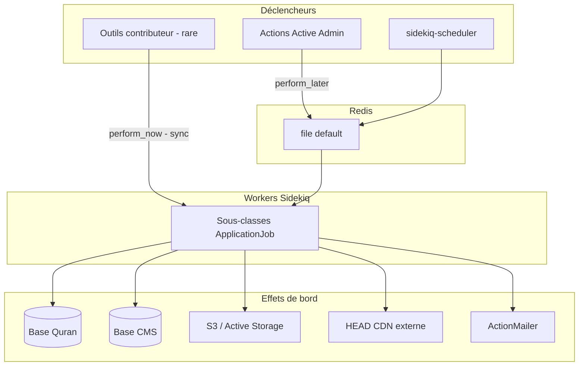

# Phase 15 — Jobs en arrière-plan (Sidekiq)

> **Série d'intégration :** plongée progressive pour devenir un contributeur QUL légitime.  
> **Prérequis :** [Phases 1–14](phase-01-what-is-qul.md)  
> **Ce fichier :** comment QUL exécute le travail long hors du thread de requête — configuration Sidekiq, familles de jobs, schémas sync vs async et comportement en cas d'échec.

---

## Pourquoi les jobs existent dans QUL

De nombreuses opérations sont trop lentes ou trop lourdes pour une requête web :

| Opération | Pourquoi async |
|---|---|
| `refresh_export!` | Construit des zips JSON/SQLite, upload vers S3 |
| Approbation de brouillon (en masse) | `insert_all` / `upsert_all` sur des milliers de versets |
| Import QuranEnc | Récupération HTTP + parsing + lignes de brouillon |
| Métadonnées audio | Requêtes HEAD vers le CDN pour chaque fichier sourate/ayah |
| Découpage audio gapless | Sous-processus ffmpeg par ayah |
| Génération mini dump | `pg_dump` + élagage de tables (dev uniquement) |

**FAIT** — `ActiveJob::Base.queue_adapter = :sidekiq` dans `config/initializers/sidekiq.rb` et `config/initializers/active_job.rb`.

Pour un ingénieur React/Node : **Sidekiq ≈ Bull/BullMQ + Redis**. Les jobs sont des classes Ruby avec une méthode `perform`.

---

## Pile d'infrastructure

| Composant | Gem / config | Rôle |
|---|---|---|
| Backend de file | `sidekiq` ~> 7.2 | Worker basé sur Redis |
| Planificateur | `sidekiq-scheduler` | Jobs récurrents style cron |
| UI de progression | `sidekiq-status` | Progression des jobs (utilisé avec parcimonie) |
| Suivi d'erreurs | `sentry-sidekiq` | Rapporte les échecs après épuisement des tentatives |
| Redis | service `redis:7` dans `docker-compose.yml` | Broker dev local |

### Lancer les workers en local

```bash
# Start Redis (if using docker-compose)
docker compose up redis -d

# Start Sidekiq
bundle exec sidekiq -e development -C config/sidekiq.yml
# or
bin/start-sidekiq   # defaults RAILS_ENV=production
```

**FAIT** — `bin/setup` prépare les bases de données mais **ne démarre pas** Redis ni Sidekiq. Vous les lancez séparément.

**INFÉRENCE** — La production utilise `docker/sidekiq.run` → `bin/start-sidekiq` comme processus dédié (pas dans `docker-compose.yml` à côté de l'app web).

---

## Configuration des files

```yaml
# config/sidekiq.yml
:concurrency: 4          # dev default; production: 3, staging: 1
:queues:
  - [default, 5]         # weighted priority
  - [mailers, 1]
  - [active_storage_purge, 1]
```

Les mailers et le purge Active Storage ont leurs propres files avec un poids inférieur.

### Décalage de file à surveiller

```ruby
# config/initializers/sidekiq.rb
config.active_storage.queues.purge = 'low'
config.active_storage.queues.mirror = 'low'
```

**FAIT** — L'initializer référence une file `low`, mais `config/sidekiq.yml` ne **liste pas** `low`.

**INFÉRENCE** — Les jobs purge/mirror Active Storage peuvent rester non traités sauf si la config Sidekiq production diffère du dépôt, ou si un worker catch-all existe ailleurs.

La plupart des jobs QUL utilisent explicitement `queue_as :default` ou héritent du défaut.

---

## Interface web Sidekiq

```ruby
# config/routes.rb
authenticated :user, ->(user) { user.is_super_admin? || user.is_admin? } do
  mount Sidekiq::Web => '/sidekiq'
end
```

**FAIT** — `/sidekiq` est réservé aux admins. Utilisez-le pour inspecter les tentatives, jobs morts et statut du planificateur.

---

## Jobs planifiés (cron)

```yaml
# config/sidekiq_scheduler.yml
daily_backup:
  class: BackupJob
  cron: "0 10 * * *"           # daily 10:00 UTC

quran_enc_update_checker:
  class: DraftContent::CheckContentChangesJob
  cron: "0 6 * * 0"            # weekly Sunday 06:00 UTC
```

| Job | Ce qu'il fait |
|---|---|
| `BackupJob` | Appelle `Utils::DbBackup.run` — **production uniquement** |
| `DraftContent::CheckContentChangesJob` | Interroge le changelog QuranEnc → crée `AdminTodo` → met en file `ImportDraftContentJob` |

**INFÉRENCE** — Seulement deux jobs récurrents sont définis. La plupart du travail est **piloté par événements** (clic bouton admin, action contributeur).

L'admin peut aussi déclencher `BackupJob` et `CheckContentChangesJob` manuellement depuis `app/admin/database_backup.rb`.

---

## Inventaire des jobs par domaine

QUL a ~30 classes de jobs sous `app/jobs/`. Regroupées par responsabilité :

### Pipeline de contenu brouillon

| Job | Déclencheur | Écrit dans |
|---|---|---|
| `DraftContent::ImportDraftContentJob` | Admin « import », vérificateur hebdomadaire | Tables brouillon (QuranEnc / TafsirApp) |
| `DraftContent::ApproveDraftTranslationJob` | Approbation en masse admin | `translations` (base Quran) |
| `DraftContent::ApproveDraftTafsirJob` | Approbation en masse admin | `tafsirs` |
| `DraftContent::ApproveDraftWordTranslationJob` | Approbation en masse admin | `word_translations` |
| `DraftContent::ApproveDraftUloomContentJob` | Approbation en masse admin | tables uloom |
| `DraftContent::RemoveDraftContentJob` | Nettoyage admin | Tables brouillon |
| `DraftContent::CheckContentChangesJob` | Cron / manuel | todos CMS + chaîne import |

Classe de base `ApproveDraftContentJob` :

```ruby
def perform(resource_content_id, draft_id = nil, use_draft_content: false)
  PaperTrail.enabled = false
  import_data
  run_post_import_tasks   # hooks, AdminTodo finish, ActiveAdmin::Comment on issues
ensure
  PaperTrail.enabled = true
end
```

**FAIT** — Les jobs d'approbation désactivent PaperTrail pendant les écritures en masse, puis exécutent `resource.run_after_import_hooks`.

### Export / publication

| Job | Rôle |
|---|---|
| `AsyncResourceActionJob` | Générique : `resource.send(action, *args)` — utilisé pour `refresh_export!` |
| `ExportTranslationJob` | Export SQLite ad hoc admin → enchaîne `UploadTranslationDbJob` |
| `Export::TranslationJob` | Export JSON vers `public/exported_translations/` |
| `Export::TafsirJob` | Export tafsir |
| `Export::MushafLayoutExportJob` | Zip SQLite mise en page mushaf + email |
| `ExportMiniDumpJob` | **Développement uniquement** — élagage base Quran + `pg_dump` |
| `ExportWordsJob` | Export données de mots |
| `ExportIndopakAyah` / `ExportIndopakWbwJob` | Exports spécifiques au script |
| `ExportDbForSemanticSearchJob` | Construction base recherche sémantique |
| `UploadTranslationDbJob` | Attache le `.bz2` exporté à `ResourceContent` via Active Storage |

**Chemin de publication clé (Phase 11) :**

```text
Admin clicks "Refresh downloads"
  → AsyncResourceActionJob.perform_later(resource, :refresh_export!, send_update_email: notify)
  → DownloadableResource#refresh_export!
  → lib/exporter/downloadable_resources.rb
  → S3 upload
```

L'admin voit : *« Les données seront exportées en arrière-plan. Revenez plus tard. »*

### Audio

| Job | Retry | Rôle |
|---|---|---|
| `Audio::GenerateAudioFilesJob` | default | Remplir les URL CDN sur `ChapterAudioFile` / `AudioFile` |
| `Audio::UpdateMetaDataJob` | default | Récupérer durée/débit depuis les fichiers distants |
| `Audio::SplitGaplessRecitationJob` | **0** | Découpage ffmpeg + propagation segments ayah |
| `Audio::ExportAudioSegmentsJob` | default | Export données de segments |

**FAIT** — `SplitGaplessRecitationJob` définit `retry: 0` — les échecs ffmpeg ne sont pas auto-retentés (risque de fichier partiel).

### Mushaf

| Job | Sync ? | Rôle |
|---|---|---|
| `MushafLayoutJob` | **perform_now** depuis le contrôleur | Enregistrer le mapping mots→page dans la base Quran |
| `Export::MushafLayoutExportJob` | async | Export SQLite déclenché par admin |

### Segments / divers

| Job | Rôle |
|---|---|
| `Segments::ExportReciterSegmentsJob` | Export pipeline de segments |
| `LokaliseJob` | Sync clés i18n (actions `import` / `export`) |
| `Recurring::UpdateApiStatsJob` | Actualiser les stats d'utilisation des clients API |
| `BackupJob` | Sauvegarde base production |

---

## `perform_later` vs `perform_now` — séparation critique

Tout n'est pas mis en file. QUL utilise l'exécution **synchrone** des jobs dans les chemins orientés contributeur :

| Chemin | Méthode | Pourquoi |
|---|---|---|
| Sauvegarde mise en page mushaf (`MushafLayoutsController`) | `MushafLayoutJob.perform_now` | Le contributeur attend une mise à jour immédiate de la page |
| Import brouillon unique (`Draft::Content#import!`) | `ApproveDraft*Job.perform_now` | Approbation inline après soumission d'un ayah par le contributeur |
| Approbation en masse admin | `perform_later` | Trop volumineux pour le timeout de requête |
| Actualisation export admin | `perform_later` | L'upload S3 prend des minutes |
| Import admin depuis QuranEnc | `perform_later` | Réseau + parsing |

```ruby
# app/controllers/mushaf_layouts_controller.rb
MushafLayoutJob.perform_now(@resource.resource_id, page_number, layout_params.to_json)

# app/models/draft/content.rb
DraftContent::ApproveDraftTranslationJob.perform_now(resource_content_id, id, use_draft_content: true)
```

**INFÉRENCE** — `perform_now` passe toujours par ActiveJob mais **bloque la requête HTTP** dans le même processus. En développement sans Sidekiq en cours, les jobs `perform_later` s'accumulent dans Redis ; `perform_now` fonctionne toujours.

---

## Le schéma `AsyncResourceActionJob`

```ruby
class AsyncResourceActionJob < ApplicationJob
  queue_as :default

  def perform(resource, action, *args)
    resource.send(action, *args)
  end
end
```

Utilisé quand l'UI admin doit appeler une méthode de modèle existante de façon asynchrone sans créer un job dédié par action :

```ruby
AsyncResourceActionJob.perform_later(resource, :refresh_export!, send_update_email: notify)
```

**INFÉRENCE** — Pratique mais opaque dans l'UI Sidekiq (le nom du job ne révèle pas l'action). Consultez les args dans la vue détail du job.

---

## Chaînage de jobs

Les jobs mettent d'autres jobs en file :

```text
CheckContentChangesJob
  └── ImportDraftContentJob.perform_later(resource.id)

ExportTranslationJob
  └── UploadTranslationDbJob.perform_later(resource_content, "#{file_name}.bz2")
```

Pas de moteur de workflow explicite (pas de gem batches / unique jobs Sidekiq). Les chaînes sont des appels ad hoc `perform_later` dans `perform`.

---

## Comportement de retry et d'échec

| Job | `sidekiq_options retry` |
|---|---|
| La plupart des jobs brouillon | `1` |
| `Export::TafsirJob` | `2` |
| `Export::MushafLayoutExportJob` | `3` |
| `Audio::SplitGaplessRecitationJob` | `0` |
| Jobs sans options explicites | Défaut Sidekiq (25) |

```ruby
# config/initializers/sentry.rb (production)
config.sidekiq.report_after_job_retries = true
```

**FAIT** — Sentry capture les exceptions de job seulement après épuisement des tentatives.

### Gestion d'erreurs dans le job

```ruby
# Recurring::UpdateApiStatsJob
active_clients.find_each do |api_client|
  begin
    api_client.update_api_stats
  rescue Exception => e
    Sentry.capture_exception(e)   # per-client failure doesn't abort batch
  end
end
```

### Rapport de problèmes post-import

Les jobs d'approbation ne lèvent pas sur les problèmes de qualité des données — ils loguent dans Active Admin :

```ruby
def report_issues(issues)
  ActiveAdmin::Comment.create(namespace: 'cms', resource: @resource, body: ...)
end
```

**INFÉRENCE** — Un job « réussi » peut quand même laisser des problèmes de données visibles comme commentaires CMS.

---

## Suivi de progression (`sidekiq-status`)

Configuré globalement dans `config/initializers/sidekiq.rb`, mais un seul job l'utilise :

```ruby
class Recurring::UpdateApiStatsJob < ApplicationJob
  include Sidekiq::Status::Worker

  def perform(id: nil)
    total active_clients.size
    at counter, api_client.name   # updates progress in Redis
  end
end
```

**INFÉRENCE** — La plupart des jobs n'ont pas de barre de progression. Les exports longs sont fire-and-forget + email à la fin (quand `user_id` est passé).

---

## Garde-fous d'environnement

Certains jobs refusent de s'exécuter hors des environnements attendus :

```ruby
# BackupJob — production only
# ExportMiniDumpJob — development only, raises in other envs
# Export::TranslationJob — emails only in production
```

**FAIT** — `ExportMiniDumpJob` supprime de larges portions de tables de la base Quran avant `pg_dump`. Ne jamais exécuter en production.

---

## Modèle mental : où se situent les jobs dans le système



---

## Liste de contrôle de débogage (contributeur)

1. **Redis tourne ?** `docker compose up redis -d` ou `redis-server` local.
2. **Sidekiq tourne ?** `bundle exec sidekiq -C config/sidekiq.yml`.
3. **Le job est en file ou sync ?** Les chemins mushaf/brouillon contributeur utilisent `perform_now` ; les chemins admin utilisent `perform_later`.
4. **Consultez `/sidekiq`** (connexion admin) pour retries/jobs morts.
5. **Consultez Sentry** (production) pour les échecs après épuisement des tentatives.
6. **Consultez les commentaires CMS** sur `ResourceContent` pour les problèmes post-import.
7. **Consultez `AdminTodo`** pour les notifications de mise à jour QuranEnc en attente.

---

## Signaux de code obsolète / manquant

| Signal | Label |
|---|---|
| `DraftContent::ApproveDraftRootDetailJob` référencé dans admin + `Draft::Content#import!` mais **aucun fichier job** dans `app/jobs/` | **FAIT** — référence cassée sauf si autoload ailleurs |
| `Importer::TafsirApp.delay.import_tafsirs` commenté dans la source | **FAIT** — syntaxe Delayed Job legacy, inactive |
| `active_storage` → file `low` absente de `sidekiq.yml` | **FAIT** — possible mauvaise configuration |

---

## Comparaison avec les phases précédentes

| Phase | Sujet | Lien avec les jobs |
|---|---|---|
| 8 | Flux CMS | Admin approve/import → jobs `DraftContent::*` |
| 10 | Pipeline d'import | `ImportDraftContentJob` encapsule `lib/importer/` |
| 11 | Pipeline d'export | `AsyncResourceActionJob` → `refresh_export!` |
| 13 | Mises en page mushaf | `MushafLayoutJob` (sync), `MushafLayoutExportJob` (async) |
| 14 | Audio | `GenerateAudioFilesJob`, `SplitGaplessRecitationJob` |

---

## Incertitudes

| # | Question | Label |
|---|---|---|
| 1 | Si la config Sidekiq production ajoute une file `low` | **INCONNU** |
| 2 | Où `ApproveDraftRootDetailJob` est défini (si quelque part) | **INCONNU** — références existent, fichier manquant |
| 3 | Si plusieurs processus Sidekiq tournent en production (workers export dédiés) | **INFÉRENCE** — un seul `sidekiq.yml` suggère un pool unique |
| 4 | URL Redis pour Sidekiq en production (`REDIS_URL` vs défaut) | **INFÉRENCE** — convention env Sidekiq standard |

---

## Résumé de la Phase 15

```text
ActiveJob + Sidekiq + Redis
  → default queue (weighted)
  → cron: backup + QuranEnc checker
  → admin: perform_later for heavy work
  → contributor: perform_now for interactive edits
  → AsyncResourceActionJob for generic model actions
  → Sentry after retry exhaustion
```

Les jobs sont le **liant entre les clics UI et les opérations de données de plusieurs minutes**. Comprendre sync vs async enqueue est essentiel avant de modifier les flux contributeur ou CMS.

---

## Arrêt ici — questions avant la Phase 16

La Phase 16 couvre la **réalité frontend** — Webpacker, îlots Vue, Stimulus, et comment les vues Rails hébergent le JS.

1. Que doit-on avoir en cours d'exécution en local pour que les jobs `perform_later` s'exécutent ?
2. Quels deux jobs s'exécutent selon un planning, et que font-ils ?
3. Pourquoi la sauvegarde de mise en page mushaf utilise `perform_now` alors que l'actualisation d'export utilise `perform_later` ?

Répondez avec vos questions, ou dites **« proceed »** pour la **Phase 16 — Réalité frontend**.
