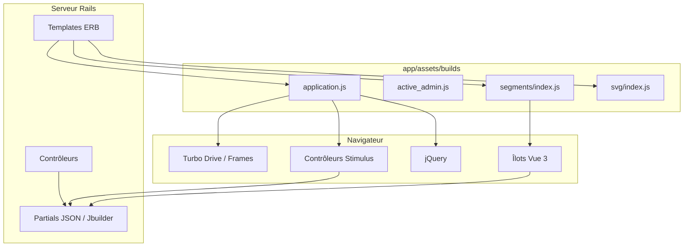

# Phase 16 — Réalité frontend

> **Série d'intégration :** plongée progressive pour devenir un contributeur QUL légitime.  
> **Prérequis :** [Phases 1–15](phase-01-what-is-qul.md)  
> **Ce fichier :** ce qu'est réellement le frontend QUL — pas une SPA React, mais une UI Rails-first en couches avec Stimulus, Turbo, jQuery et deux îlots Vue.

---

## La vérité en une phrase

QUL n'est **pas** une application frontend unique. C'est un **site rendu par serveur Rails** avec amélioration progressive :

```text
ERB templates (HTML)
  + Tailwind + Sass (CSS)
  + Turbo (partial navigation / frames)
  + Stimulus (~86 controllers)
  + jQuery (legacy + Active Admin + some tools)
  + Vue 3 (2 isolated pages only)
```

**INFÉRENCE :** Si vous venez de React/Next.js, attendez-vous à **pas d'arbre de composants**, **pas de store d'état global**, et **pas de routeur côté client**. La plupart des pages sont des allers-retours HTML complets ou des échanges Turbo Frame.

La Phase 4 a brièvement introduit cette pile. Cette phase approfondit **où vit le code**, **comment les pages bootent le JS**, et **quel schéma utiliser pour du nouveau travail**.

---

## Chaîne d'outils de build

| Pièce | Technologie | Sortie |
|---|---|---|
| Bundler JS | **esbuild** (`esbuild.config.js`) | `app/assets/builds/*.js` |
| CSS (app) | **Sass** (`yarn build:css`) | `app/assets/builds/application.css`, etc. |
| CSS (utilitaire) | **Tailwind** (`bin/rails tailwindcss:watch`) | `app/assets/builds/tailwind.css` |
| Service des assets | **Sprockets** (`sprockets-rails`) | Sert `app/assets/builds/` |

**FAIT** — Il n'y a **pas de Webpacker, Vite ou importmap** dans ce dépôt. Les scripts `package.json` utilisent `esbuild` + `esbuild-rails` + `esbuild-plugin-vue3`.

### Quatre points d'entrée JS

```javascript
// esbuild.config.js
const entryPoints = [
  "application.js",      // public site + contributor tools
  "active_admin.js",     // CMS (/cms)
  "segments/index.js",   // Vue — audio segment builder
  "svg/index.js"         // Vue — SVG optimizer tool
]
```

Tout le reste est importé transitivement depuis ces racines.

### Workflow dev

```text
bin/dev
  ├── web:      bin/rails server -p 3000
  ├── js:       yarn build --reload    # esbuild + live reload via SSE
  └── tailwind: bin/rails tailwindcss:watch
```

**FAIT** — `Procfile.dev` ne démarre pas Redis ni Sidekiq (Phase 15).

`yarn build --reload` injecte un petit listener EventSource qui recharge le navigateur quand JS, Vue, ERB ou CSS change.

---

## Layout et chargement des assets

### Pages publiques / contributeur

```erb
<!-- app/views/layouts/application.html.erb -->
<%= stylesheet_link_tag "tailwind", "inter-font", ... %>
<%= stylesheet_link_tag "application", ... %>
<%= javascript_include_tag "application", defer: true %>
```

`application.js` boot :

```javascript
import "./libs/jquery";       // global $ and jQuery
import "@hotwired/turbo-rails"
import "trix"
import "@rails/actiontext"
import "./controllers"        // all Stimulus controllers
import "./utils/ayah-player"
```

### Active Admin (CMS)

Bundle séparé : `active_admin.js` → jQuery UI, initialiseurs Active Admin, Turbo, et un **sous-ensemble** de Stimulus via `controllers/for_admin.js`.

**FAIT** — Le CMS enregistre Tailwind + Font Awesome comme feuilles de style dans `config/initializers/active_admin.rb`. Il n'appelle **pas** `register_javascript` — le layout AA charge `active_admin.js` via la liste de précompilation Sprockets.

### Pages îlot Vue

Seulement deux vues chargent un second bundle JS :

| Page | Vue | Point de montage |
|---|---|---|
| Constructeur de segments sourate/ayah | `surah_audio_files/segment_builder.html.erb` | `#app` |
| Optimiseur SVG | `community/svg_optimizer.html.erb` | `#app` |

```erb
<%= javascript_include_tag "segments/index", defer: true %>
<%= stylesheet_link_tag "segments/index", defer: true %>

<div id="app"
     data-recitation="..."
     data-chapter="..."
     data-segment-locked="...">
  <p>Loading</p>
</div>
```

Vue lit la config depuis les **attributs `data-*`** sur l'élément parent du point de montage — pas depuis un endpoint bootstrap JSON API.

---

## Stimulus — la couche d'interaction par défaut

~**86** contrôleurs dans `app/javascript/controllers/`.

### Auto-enregistrement

```javascript
// app/javascript/controllers/index.js
import controllers from "./**/*_controller.js"
controllers.forEach((controller) => {
  application.register(controller.name, controller.module.default)
})
```

`esbuild-rails` importe en glob chaque `*_controller.js`. La convention de nommage mappe chemin de fichier → nom de contrôleur :

| Fichier | Attribut HTML |
|---|---|
| `mushaf_page_controller.js` | `data-controller="mushaf-page"` |
| `segments/failure_player_controller.js` | `data-controller="segments--failure-player"` |
| `translation_footnote_controller.js` | `data-controller="translation-footnote"` |

Les dossiers imbriqués utilisent `--` (convention Stimulus).

### Schémas Stimulus typiques dans QUL

**1. Amélioration DOM au connect**

```erb
<div data-controller="translation-footnote">
```

**2. Values et targets depuis le HTML**

```erb
<div data-controller="syntax-graph"
     data-syntax-graph-url-value="/morphology/.../graph.json">
```

**3. Actions**

```erb
<button data-action="click->dropdown#toggle">
```

**4. jQuery dans Stimulus** — courant dans les contrôleurs plus anciens :

```javascript
// mushaf_page_builder_controller.js
this.el = $(this.element);
this.el.find("#decrement").on("click", ...);
```

**INFÉRENCE :** Le nouveau code devrait préférer le DOM vanilla ou les API Stimulus, mais suivre le style jQuery existant dans un fichier est acceptable pour la cohérence.

### Contrôleurs Stimulus lourds (à connaître avant d'éditer)

| Contrôleur | ~Lignes | Domaine |
|---|---|---|
| `treebank_controller.js` | 1300+ | SVG morphologie constituency/dependency |
| `syntax_graph_controller.js` | 1300+ | Prévisualisation graphe syntaxique |
| `segments/store/index.js` (Vuex, pas Stimulus) | 1400+ | État du constructeur de segments |

Ce sont des **mini-apps dans un contrôleur** — lisez attentivement avant de modifier.

---

## Turbo — mises à jour partielles de page

Turbo Drive est activé globalement via `@hotwired/turbo-rails`.

### Turbo Frames (le plus courant)

Le visualiseur d'ayah charge le contenu des onglets en lazy :

```erb
<%= turbo_frame_tag :ayah_text, src: ayah_text_path(@ayah.verse_key) %>
<%= turbo_frame_tag :ayah_translations, src: ayah_translations_path(...) %>
```

Cliquer prev/next ayah remplace le frame `:ayah_info` sans rechargement complet.

L'éditeur de mise en page mushaf utilise des frames pour la prévisualisation de page :

```erb
<%= turbo_frame_tag "mushaf-page" do %>
  ...
<% end %>
```

### Turbo Streams

La sauvegarde mushaf répond avec des mises à jour stream :

```erb
<!-- mushaf_layouts/save_page_mapping.turbo_stream.erb -->
<%= turbo_frame_tag "page-preview-#{@mushaf_page.page_number}" do %>
```

### Désactivation

Certains outils désactivent Turbo pour ne pas casser les widgets jQuery ou les montages Vue :

```erb
<div data-turbo="false">   <!-- segments dashboard header -->
```

Les formulaires Devise utilisent aussi `data-turbo="false"` sur les formulaires d'auth.

---

## Îlots Vue (seulement deux)

### Constructeur de segments (`app/javascript/segments/`)

**Objectif :** Éditeur de segments audio au niveau mot (Phase 14).

```text
App.vue
  ├── SelectAudioSrc.vue
  ├── ActionBar.vue
  ├── Verse.vue
  └── Alert.vue
store/index.js (Vuex)
  ├── LOAD_SEGMENTS → GET /surah_audio_files/:id/segments.json
  ├── SAVE_SEGMENTS → POST .../save_segments.json
  └── letter segment batching, compare mode, localStorage draft
```

**Schéma pont :** Rails passe l'état serveur via `data-*` sur `#app` ; Vue `mounted()` lit `this.$el.parentElement.dataset` et commit dans Vuex.

**Style API :** Mélange de `fetch()` et `$.get()` / `$.post()` avec en-têtes token CSRF Rails.

### Optimiseur SVG (`app/javascript/svg/`)

Outil communautaire sur `/community/svg_optimizer` — Vue + Vuex pour l'édition de points SVG (outillage police/tajweed).

**FAIT** — Pas de Vue Router. Une page, un montage, pas de routes côté client.

---

## jQuery — toujours présent

| Zone | Usage |
|---|---|
| `application.js` | `$` global via `libs/jquery.js` |
| Active Admin | jQuery UI (datepicker, dialog, tabs) |
| Contrôleurs Stimulus | Requêtes DOM, AJAX dans les outils plus anciens |
| Store Vuex segments | `$.get`, `$.param` pour les endpoints legacy |
| Notes de bas de page traduction | `$(dom).append(...)` |

**INFÉRENCE :** jQuery est **legacy mais actif**. Ne le retirez pas à la légère — beaucoup d'outils en dépendent.

---

## Comment les outils contributeur parlent au serveur

Trois schémas coexistent :

### 1. Formulaires Rails standard + Turbo

```erb
<%= form_with ..., data: { controller: 'remote-form' } do |form| %>
```

`remote_form_controller.js` gère la validation, `turbo:submit-start/end`, fermeture auto optionnelle.

### 2. `fetch` / jQuery AJAX depuis Stimulus ou Vue

```javascript
// treebank_controller.js
const res = await fetch(this.urlValue, { headers: { Accept: "application/json" } });

// segments/store — save
fetch(`/${segmentsUrl}/${recitation}/save_segments.json`, requestOptions)
```

Les endpoints JSON renvoient du JSON rendu par Rails ou des payloads Jbuilder. Le token CSRF est lu depuis `<meta name="csrf-token">`.

### 3. POST page complète (mushaf)

`MushafLayoutsController` accepte un POST formulaire → `MushafLayoutJob.perform_now` → réponse Turbo Stream.

Pas de couche BFF ou GraphQL séparée.

---

## Architecture CSS

| Feuille de style | Portée |
|---|---|
| `tailwind.css` | Classes utilitaires (système de layout principal) |
| `application.scss` | SCSS composants (mushaf, tajweed, proofreading, select2, toastr) |
| `landing.scss` | Pages marketing / auth |
| `active_admin.scss` | Skin CMS |
| `export.scss` / `pdf.scss` | Layouts export et PDF |
| `tinymce_custom.scss` | Éditeur de texte riche |

Les outils contributeur mélangent **classes utilitaires Tailwind dans l'ERB** avec **classes composants SCSS legacy** (ex. `.mushaf`, `.qpc-hafs`).

Polices arabes chargées via `@font-face` dans `app/assets/stylesheets/shared/` — critiques pour le rendu mushaf et tajweed.

---

## Carte outil → schéma frontend

| Outil / page | Techno UI principale | Fichiers clés |
|---|---|---|
| `/resources`, `/docs` | ERB + Tailwind + onglets Stimulus | `resources/`, `controllers/tabs_controller.js` |
| `/ayah/:key` | Turbo Frames + Stimulus | `ayah/show.html.erb`, `turbo-frame-loading` |
| `/translation_proofreadings` | ERB + `remote-form` + `translation-footnote` | `translation_proofreadings/` |
| `/mushaf_layouts` | ERB + Stimulus (`mushaf-page-builder`) + Turbo | `mushaf_layouts_controller.rb` |
| `/surah_audio_files/.../segment_builder` | **Îlot Vue 3** | `segments/` |
| `/segments/dashboard` | ERB + lecteurs Stimulus | `segments/dashboard/`, `data-turbo="false"` |
| Treebank morphologie | Rendu SVG Stimulus | `treebank_controller.js` |
| Graphes de dépendance | Stimulus + fetch | `syntax_graph_controller.js` |
| `/cms` | Active Admin + jQuery + JS AA | `active_admin.js`, `app/admin/` |
| Comparer audio communauté | partial `layout: false` | `community_controller.rb` |

---

## Bibliothèques audio / lecture

| Bibliothèque | Où |
|---|---|
| **Howler.js** | `segment_player_controller`, `ayah_segment_player_controller` |
| **HTML5 `<audio>`** | Store Vue constructeur de segments, utilitaire lecteur ayah |
| **hotkeys-js** | Raccourcis clavier dans les éditeurs |

---

## Texte riche

- **Trix** + **ActionText** chargés dans `application.js`
- Utilisés dans le CMS et certains champs de contenu
- `tinymce_controller.js` existe pour les instances TinyMCE (admin)

---

## Tests frontend

**FAIT** — `package.json` inclut **Cypress** et **Puppeteer** comme devDependencies.

**INFÉRENCE** — Des tests E2E existent mais ne sont pas le workflow contributeur principal. Linting : ESLint sur `app/javascript/**/*.{js,vue}`.

---

## Diagramme modèle mental



---

## Où ajouter du code frontend (guide de décision)

| Vous construisez… | Utilisez |
|---|---|
| Toggle, modal, petit AJAX sur une page ERB | **Contrôleur Stimulus** |
| Onglet ou partial chargé en lazy | **Turbo Frame** + Stimulus optionnel |
| Nouvel outil contributeur avec état complexe + UI timeline | Considérez un **îlot Vue** (nouveau point d'entrée esbuild) — rare ; discutez d'abord |
| Comportement de champ CMS | JS **Active Admin** ou Stimulus dans `for_admin` |
| Page catalogue public | **ERB + Tailwind** |

**Réponse par défaut :** Stimulus + ERB. Vue seulement quand le constructeur de segments prouve le schéma (grand état interactif, UI forme d'onde audio).

---

## Signaux de code obsolète / manquant

| Signal | Label |
|---|---|
| Routes `segment_pipeline` dans `config/routes.rb` mais **aucun** contrôleur `SegmentPipeline::*` dans le dépôt | **FAIT** — routes peuvent 404 en local ; table DB `segment_pipeline_runs` existe |
| `segment_tool.js` dans `assets.precompile` mais **aucun fichier source** | **FAIT** — référence asset obsolète |
| `segments/index.css` / `svg/index.css` référencés dans les vues mais absents de `app/assets/stylesheets/` | **INFÉRENCE** — générés dans `app/assets/builds/` par esbuild/plugin Vue sur `yarn build` |
| `Importer::TafsirApp.delay` commenté (syntaxe Delayed Job) | **FAIT** — legacy mort |

---

## Pièges courants pour les ingénieurs React

1. **Pas de routeur client** — Les URL sont des routes Rails. `link_to` et `form_with` génèrent les chemins.

2. **`data-controller` n'est pas un composant** — pas de props, pas de composition d'enfants. L'état vit dans le DOM ou est chargé au connect.

3. **Turbo peut casser les widgets jQuery** — utilisez `data-turbo="false"` ou des listeners `turbo:load` (voir le schéma tooltip de `active_admin.js`).

4. **Vue n'est pas partagé** — constructeur de segments et optimiseur SVG ne s'importent pas mutuellement ni depuis Stimulus.

5. **`$` global** — attendez jQuery sur la plupart des pages ; évitez les collisions de noms.

6. **CSRF requis** — POST/PUT/DELETE ont besoin de `authenticity_token` (les formulaires Rails gèrent ; `fetch` doit définir l'en-tête manuellement).

7. **Deux systèmes CSS** — utilitaires Tailwind + composants SCSS coexistent ; vérifiez les deux pour le style.

---

## Incertitudes

| # | Question | Label |
|---|---|---|
| 1 | Si l'UI `segment_pipeline` vit dans un gem privé ou une branche inachevée | **INCONNU** — routes + schéma existent, contrôleurs absents |
| 2 | Pipeline d'assets production (CDN vs builds auto-hébergés) | **INFÉRENCE** — précompilation Sprockets standard au déploiement |
| 3 | Étendue de la couverture tests Cypress | **INCONNU** — dépendance présente, non inventoriée |
| 4 | Plan de migrer plus d'outils vers Vue vs garder Stimulus | **INCONNU** — préférence organisationnelle |

---

## Résumé de la Phase 16

```text
Rails ERB (source of truth for HTML)
  → esbuild bundles: application | active_admin | segments | svg
  → Stimulus for 95% of interactivity
  → Turbo Frames for ayah/mushaf partial updates
  → Vue only for segment builder + SVG optimizer
  → jQuery legacy still active in admin + older tools
```

Le frontend est **volontairement sobre** sur la plupart des pages — la complexité est localisée aux segments audio et au rendu de graphes morphologiques.

---

## Arrêt ici — questions avant la Phase 17

La Phase 17 couvre la **configuration locale** — exécuter `bin/setup`, charger le dump Quran, et vérifier la pile de bout en bout.

1. Combien de points d'entrée Vue existent, et quelles pages les utilisent ?
2. Quelle est la façon par défaut d'ajouter de l'interactivité à une page ERB ?
3. Pourquoi les pages dashboard segments définissent `data-turbo="false"` ?

Répondez avec vos questions, ou dites **« proceed »** pour la **Phase 17 — Configuration locale**.
