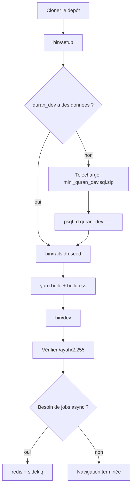

# Phase 17 — Configuration locale

> **Série d'intégration :** plongée progressive pour devenir un contributeur QUL légitime.  
> **Prérequis :** [Phases 1–16](phase-01-what-is-qul.md)  
> **Ce fichier :** faire tourner QUL sur votre machine, charger les données Quran, et vérifier que la pile fonctionne.

---

## Ce que signifie « fonctionner en local »

Environnement de développement minimum viable :

| Service | Requis pour… |
|---|---|
| **PostgreSQL** | Base CMS + base Quran |
| **Ruby 3.3.3** + Bundler | App Rails |
| **Node 20** + Yarn | esbuild + Tailwind |
| **Mini dump Quran** | Toute page touchant versets/traductions/audio |
| **Redis** | Jobs `perform_later`, Sidekiq, Action Cable (optionnel pour une première navigation) |

**FAIT** — Doc officielle : `app/views/docs/markdown/project-setup.md` (servie sur `/docs/project-setup`).

**INFÉRENCE :** Vous pouvez démarrer l'app et parcourir `/docs` sans le dump, mais `/ayah/2:255`, les prévisualisations `/resources` et la plupart des outils contributeur échoueront tant que `quran_dev` n'est pas peuplé.

---

## Versions épinglées

| Outil | Version | Fichier |
|---|---|---|
| Ruby | **3.3.3** | `.ruby-version` |
| Node | **20.20.2** | `.node-version` |
| PostgreSQL | 14+ (16 testé) | docs / copilot-instructions |
| Redis | 7+ | `docker-compose.yml` |

**FAIT** — Le Gemfile autorise `ruby ">= 3.3.3", "<= 3.3.10"`. Restez sur 3.3.3 sauf raison documentée de monter.

---

## Deux bases de données (ne pas sauter cette étape)

```text
quran_community_tarteel   ← CMS (users, drafts, downloads metadata)
quran_dev                 ← Quran content (verses, translations, audio, …)
```

| Après l'étape | Base CMS | Base Quran |
|---|---|---|
| `bin/setup` | Tables migrées, données vides | Base existe, **vide** (schéma `quran` seulement) |
| Charger `mini_quran_dev.sql` | inchangé | ~90 tables avec données réelles |
| `rails db:seed` | Un utilisateur admin | inchangé |

**FAIT** — `db/schema.rb` est **CMS uniquement**. Le schéma Quran vient du dump SQL, pas des migrations.

---

## Chemin A — Postgres natif (recommandé)

### 1. Cloner et installer

```bash
git clone https://github.com/TarteelAI/quranic-universal-library.git
cd quranic-universal-library

# Ruby (rbenv/asdf/rvm — your choice)
ruby -v   # must be 3.3.3

bin/setup
```

**Ce que fait `bin/setup`** (`bin/setup`) :

```text
bundle install
yarn install
bin/rails db:create:all    # both databases
bin/rails db:prepare       # CMS migrations
log/tmp clear
```

**Ce qu'il ne fait PAS :**

- Charger le dump Quran
- Exécuter `db:seed` (utilisateur admin)
- Démarrer Redis, Sidekiq ou le build d'assets
- Copier `.env.sample` → `.env`

### 2. Variables d'environnement de connexion base de données

`config/database.yml` lit :

```yaml
host:     <%= ENV['DB_HOST'] %>
username: <%= ENV['DB_USERNAME'] %>
password: <%= ENV['DB_PASSWORD'] %>
```

**INFÉRENCE** — Avec les trois non définies, Rails utilise les défauts PostgreSQL (souvent auth peer sur macOS/Linux avec socket local). Si la connexion échoue, définissez explicitement :

```bash
export DB_HOST=localhost
export DB_USERNAME=postgres
export DB_PASSWORD=your_password
```

Ou créez `.env` depuis `.env.sample` (vars S3 seulement dans l'exemple — ajoutez les vars DB vous-même).

**FAIT** — Le gem `dotenv` est dans le groupe `:development` mais il n'y a pas de `Dotenv.load` évident dans `config/`. **INFÉRENCE** — exportez les vars dans votre shell ou utilisez un outil qui charge `.env` avant `bin/dev`.

### 3. Charger le mini dump Quran (critique)

```bash
curl -L -o mini_quran_dev.sql.zip \
  https://static-cdn.tarteel.ai/qul/mini-dumps/mini_quran_dev.sql.zip
unzip mini_quran_dev.sql.zip
psql -d quran_dev -f mini_quran_dev.sql
```

Alternative (restauration plus rapide, format binaire) :

```bash
curl -L -o mini_quran_dev.dump.zip \
  https://static-cdn.tarteel.ai/qul/mini-dumps/mini_quran_dev.dump.zip
unzip mini_quran_dev.dump.zip
pg_restore --no-owner --no-privileges --no-tablespaces --no-acl \
  --dbname quran_dev -v mini_quran_dev.dump
```

**Vérifier dans psql :**

```sql
\c quran_dev
\dt quran.*
SELECT count(*) FROM verses;   -- expect thousands, not 0
```

**INFÉRENCE** — Si `\dt quran.*` ne montre aucune table, le dump n'a pas été chargé dans la bonne base ou le bon schéma.

### 4. Seed utilisateur admin CMS (optionnel mais utile)

`bin/setup` n'exécute **pas** les seeds. Créez le super-admin par défaut manuellement :

```bash
bin/rails db:seed
```

**FAIT** — `db/seed.rb` crée :

| Champ | Valeur |
|---|---|
| Email | `admin@cms.com` |
| Password | `cms-password` |
| Role | `super_admin` |

Utilisez ceci pour `/cms` et `/sidekiq` (admin uniquement).

Vous pouvez aussi enregistrer un utilisateur normal via Devise sur `/users/sign_up` — un workflow d'approbation peut s'appliquer pour les rôles non-admin.

### 5. Builder les assets et lancer

```bash
# One-time or after JS/CSS changes
yarn build
yarn build:css

# Recommended: Rails + esbuild reload + Tailwind watch
bin/dev
```

**FAIT** — `Procfile.dev` :

```text
web:      bin/rails server -p 3000
js:       yarn build --reload
tailwind: bin/rails tailwindcss:watch
```

App : [http://localhost:3000](http://localhost:3000)  
CMS : [http://localhost:3000/cms](http://localhost:3000/cms) (pas `/admin` — redirige)

### 6. Redis + Sidekiq (quand vous avez besoin des jobs en arrière-plan)

```bash
# Option A: docker
docker compose up redis -d

# Option B: local redis-server
redis-server

# Separate terminal
bundle exec sidekiq -e development -C config/sidekiq.yml
```

Sans Sidekiq, les jobs `perform_later` s'accumulent dans Redis mais ne s'exécutent jamais. Les chemins `perform_now` (sauvegarde mushaf, approbation brouillon unique) fonctionnent toujours.

---

## Chemin B — Docker pour Postgres uniquement

`docker-compose.yml` fournit **Postgres + Redis**, pas l'app Rails.

```bash
docker compose up -d db redis
```

Postgres est exposé sur `localhost:5432` avec :

| Var | Valeur |
|---|---|
| `POSTGRES_USER` | `postgres` |
| `POSTGRES_PASSWORD` | `password` |
| `POSTGRES_DB` | `quran_community_tarteel` |

`docker/dev/init-db.sh` crée aussi `quran_dev` et le schéma `quran` au premier boot.

Puis définissez l'env et lancez Rails sur l'hôte :

```bash
export DB_HOST=localhost
export DB_USERNAME=postgres
export DB_PASSWORD=password

bin/setup
# load mini dump (same as path A)
bin/dev
```

**FAIT** — `docker/README.md` documente un build d'image **production** (`docker build`), pas une stack compose dev tout-en-un.

---

## Aide-mémoire variables d'environnement

| Variable | Nécessaire quand | Défaut / repli |
|---|---|---|
| `DB_HOST`, `DB_USERNAME`, `DB_PASSWORD` | Problèmes auth Postgres | non défini → socket/peer |
| `QUL_STORAGE_*` | Upload export S3 (`refresh_export!`) | `.env.sample` → `missing` / `https://fix.me` |
| `RAILS_MASTER_KEY` | Image Docker production | **Non requis** pour dev (`secrets.yml` a `secret_key_base` dev) |
| `REDIS_URL` | Action Cable prod | dev cable.yml défaut `redis://localhost:6379/1` |

**INFÉRENCE** — Vous pouvez développer et naviguer en local **sans** credentials S3 réels. Les actions admin export-vers-S3 échoueront tant que les credentials ne sont pas configurés.

---

## Liste de vérification

Exécutez ceci après la configuration. Traitez comme un smoke test, pas la suite de tests complète.

### 1. Rails démarre

```bash
bin/rails runner 'puts Rails.version'
# expect 8.0.x
```

### 2. Les deux bases se connectent

```bash
bin/rails runner 'puts "CMS users: #{User.count}"; puts "Verses: #{Verse.count}"'
```

| Résultat | Signification |
|---|---|
| `Verses: 0` | Dump non chargé — retour à l'étape 3 |
| `PG::UndefinedTable` sur `verses` | Dump non chargé ou mauvaise base |
| `CMS users: 0` | Exécutez `bin/rails db:seed` si vous avez besoin de connexion admin |

### 3. Smoke HTTP

| URL | Attendu |
|---|---|
| `http://localhost:3000` | Page d'accueil charge |
| `http://localhost:3000/docs` | Index docs |
| `http://localhost:3000/ayah/2:255` | Page ayah avec texte (nécessite dump) |
| `http://localhost:3000/resources` | Cartes catalogue ressources |
| `http://localhost:3000/cms` | Connexion Active Admin |

### 4. Assets présents

```bash
ls app/assets/builds/application.js
ls app/assets/builds/tailwind.css
```

Si manquants : `yarn build && yarn build:css`.

### 5. Hot reload JS (optionnel)

Le processus js de `bin/dev` devrait logger `[reload] listing on port 3005`. Éditer un fichier Stimulus devrait déclencher un rafraîchissement navigateur.

---

## Diagramme de configuration de bout en bout



---

## Ce qui fonctionne sans configuration supplémentaire

| Fonctionnalité | Fonctionne sans dump ? | Fonctionne sans Redis ? |
|---|---|---|
| `/docs` | Oui | Oui |
| Connexion `/cms` (après seed) | Oui | Oui |
| `/ayah/:key` | **Non** | Oui |
| Relecture de traduction | **Non** | Surtout (approbation en masse nécessite Sidekiq) |
| Sauvegarde mise en page mushaf | **Non** | Oui (`perform_now`) |
| Constructeur de segments (Vue) | **Non** | Oui |
| `refresh_export!` | **Non** | Non (nécessite Sidekiq + S3) |

---

## Échecs courants et correctifs

| Symptôme | Cause probable | Correctif |
|---|---|---|
| `relation "verses" does not exist` | `quran_dev` vide | Charger le mini dump |
| `PG::ConnectionBad` | Mauvais host/user/password | Définir les vars `DB_*` |
| `Your Ruby version is X, but Gemfile specified 3.3.3` | Mauvaise version Ruby | `rbenv install 3.3.3` |
| Page blanche / pas de styles | Assets non buildés | `yarn build:css` + `yarn build` |
| `could not connect to server: redis` | Redis ne tourne pas | `docker compose up redis -d` |
| Export admin bloqué indéfiniment | Sidekiq ne tourne pas | Démarrer le worker sidekiq |
| Échec install Cypress/Puppeteer | Réseau/sandbox | `CYPRESS_INSTALL_BINARY=0 PUPPETEER_SKIP_DOWNLOAD=true yarn install` |
| Jobs bloqués en file | Sidekiq ne tourne pas | `bundle exec sidekiq -C config/sidekiq.yml` |

### Recharger le dump

Si vous corrompez les données Quran locales :

```bash
dropdb quran_dev
createdb quran_dev
psql -d quran_dev -c 'CREATE SCHEMA IF NOT EXISTS quran;'
psql -d quran_dev -f mini_quran_dev.sql
```

**AVERTISSEMENT** — `ExportMiniDumpJob` supprime de larges portions de `quran_dev` avant `pg_dump`. Ne jamais l'exécuter hors développement.

---

## Signaux de documentation obsolète

| La doc dit | RÉALITÉ DU CODE ACTUEL | Label |
|---|---|---|
| `contributing.md` : « Éditez les fichiers dans `docs/` d'abord » | Les docs vivent dans `app/views/docs/markdown/` + `config/docs.yml` | **FAIT** — chemin obsolète |
| `.github/copilot-instructions.md` : admin sur `/admin` | Les routes redirigent vers `/cms` | **FAIT** — URL obsolète |
| `copilot-instructions.md` : `rails db:create` seulement | `bin/setup` utilise `db:create:all` pour les deux bases | **FAIT** — incomplet |
| `project-setup.md` implique que le dump est optionnel pour « faire tourner » | L'app démarre mais les pages Quran échouent | **INFÉRENCE** — la doc sous-estime l'importance du dump |

Préférez **`app/views/docs/markdown/project-setup.md`** et cette série d'intégration à `contributing.md` à la racine pour la configuration.

---

## Notes rapides macOS

**INFÉRENCE** — Combinaison courante qui fonctionne :

- Postgres.app ou Homebrew `postgresql@16`
- `rbenv` + `nodenv` pour les versions épinglées
- `brew install redis` ou Docker pour Redis seulement

Pas de formule Homebrew spécifique QUL — pile Rails standard.

---

## Incertitudes

| # | Question | Label |
|---|---|---|
| 1 | Si `dotenv` charge auto `.env` sans config supplémentaire | **INCONNU** — gem présent, aucun loader explicite trouvé |
| 2 | Chemin dev officiel béni : Postgres natif vs Docker | **INFÉRENCE** — `bin/setup` + Rails sur l'hôte est principal |
| 3 | Si `config/master.key` est obtenable pour les contributeurs | **INCONNU** — pas dans le dépôt ; dev peut ne pas en avoir besoin |
| 4 | Fraîcheur / cadence de mise à jour du mini dump | **INCONNU** — l'URL CDN est un chemin statique |

---

## Résumé de la Phase 17

```text
bin/setup          → gems, yarn, CMS migrate, create quran_dev (empty)
load mini dump     → quran_dev populated (required for real work)
db:seed            → admin@cms.com / cms-password
yarn build + bin/dev → http://localhost:3000
redis + sidekiq    → when testing exports / async admin actions
```

La configuration locale est une **base de données en deux étapes** : migrations pour CMS, dump pour Quran. Tout le reste est Rails 8 + esbuild standard.

---

## Arrêt ici — questions avant la Phase 18

La Phase 18 corrèle **les URL du navigateur au code** — mapper ce que vous voyez sur `/ayah/2:255` ou `/translation_proofreadings` aux contrôleurs, vues et modèles.

1. Quelle base de données contient `verses`, et comment la peupler en local ?
2. Que ne fait pas `bin/setup` que vous devez encore faire manuellement ?
3. Quelle URL utilisez-vous pour le CMS, et quelles sont les credentials seed par défaut ?

Répondez avec vos questions, ou dites **« proceed »** pour la **Phase 18 — Corrélation navigateur ↔ code**.
