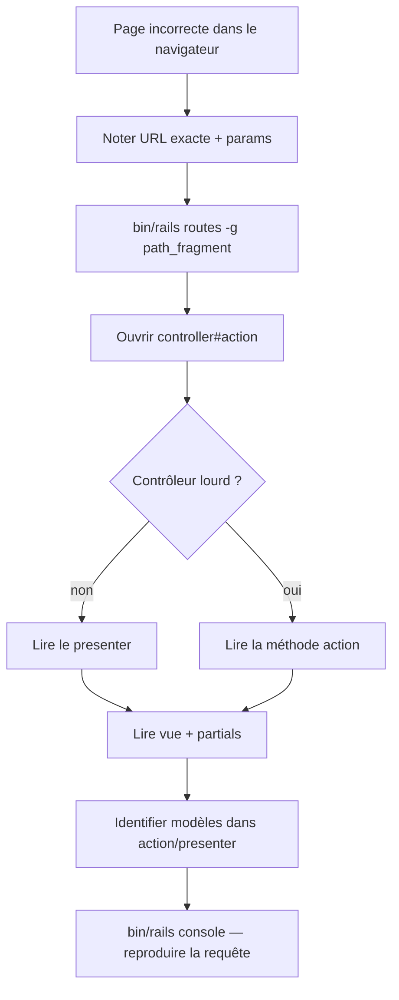

# Phase 18 — Corrélation navigateur ↔ code

> **Série d'intégration :** plongée progressive pour devenir un contributeur QUL légitime.  
> **Prérequis :** [Phases 1–17](phase-01-what-is-qul.md)  
> **Ce fichier :** remonter ce que vous voyez dans le navigateur vers les routes, contrôleurs, vues, presenters et modèles.

---

## Comment tracer n'importe quelle URL (méthode)

Chaque requête navigateur suit la même chaîne de recherche :

```text
Browser URL
  → config/routes.rb          (which controller#action?)
  → app/controllers/*.rb      (what loads? what renders?)
  → app/presenters/*.rb       (view-model logic — very common in QUL)
  → app/views/**              (ERB templates, partials, Turbo frames)
  → app/models/**             (Active Record reads/writes)
  → lib/**                    (heavy import/export logic — usually not in controller)
```

**Raccourcis CLI :**

```bash
bin/rails routes | grep ayah          # find route for a path fragment
bin/rails routes -c AyahController    # all routes for one controller
bin/rails routes -g translation_proof   # grep routes
```

**Raccourci logs :** En développement, chaque requête log `Processing by SomeController#action`. Commencez là quand l'URL est ambiguë.

---

## Héritage des contrôleurs (qui exécute votre requête)

```text
ActionController::Base
  └── ApplicationController          ← most public pages
        ├── CommunityController      ← contributor tools + resources + docs
        │     ├── TranslationProofreadingsController
        │     ├── MushafLayoutsController
        │     ├── SurahAudioFilesController
        │     └── ResourcesController
        ├── AyahController           ← ayah viewer (not under Community)
        ├── LandingController
        └── AdminsController         ← super_admin only tools
              └── WordMistakesController, TranslationDiffsController

ActionController::API
  └── Api::V1::ApiController         ← JSON only (/api/v1/*)

ActiveAdmin                          ← /cms/* (generated from app/admin/*.rb)
```

**FAIT** — `CommunityController` définit `@presenter = CommunityPresenter` et fournit `load_language`, `authorize_access!`, et les helpers docs. La plupart des outils contributeur en héritent.

**FAIT** — `ApplicationController#init_presenter` s'exécute sur chaque requête HTML sauf si un enfant le surcharge.

---

## Familles d'URL en un coup d'œil

| Motif URL | Contrôleur | Modèles principaux |
|---|---|---|
| `/` | `LandingController#home` | — |
| `/ayah/:key` | `AyahController` | `Verse`, `Translation`, `Tafsir` |
| `/resources` | `ResourcesController#index` | `DownloadableResource` |
| `/resources/:type` | `ResourcesController#show` | `DownloadableResource` (par slug de type) |
| `/resources/:type/:id` | `ResourcesController#detail` | `DownloadableResource`, `ResourceContent` |
| `/docs/:key` | `CommunityController#docs` | `DocsPageService` → fichiers markdown |
| `/cms/*` | Active Admin | Modèles CMS + hub `ResourceContent` |
| `/translation_proofreadings` | `TranslationProofreadingsController` | `Translation`, `Draft::Translation` |
| `/mushaf_layouts/:id` | `MushafLayoutsController` | `Mushaf`, `MushafWord`, `MushafPage` |
| `/surah_audio_files/...` | `SurahAudioFilesController` | `Audio::Recitation`, `Audio::Segment` |
| `/api/v1/*` | `Api::V1::*` | Mêmes modèles Quran, réponse JSON |

---

## Trace 1 — `/ayah/2:255`

### Route

```ruby
get '/ayah/:key', to: 'ayah#show', as: :ayah
get '/ayah/:key/text', to: 'ayah#text', as: :ayah_text
# … translations, tafsirs, words, theme, recitation, etc.
```

`:key` est la chaîne **verse_key** (`"2:255"`), pas `verses.id`.

### Flux contrôleur

```ruby
# AyahController — every action calls init_presenter via ApplicationController
def init_presenter
  @presenter = AyahPresenter.new(self)
  @ayah = @presenter.ayah          # Verse.find_by(verse_key: params[:key])
  head :not_found unless @presenter.found?
end
```

| Action | Rend | Turbo ? |
|---|---|---|
| `show` | `app/views/ayah/show.html.erb` | Frame parent `:ayah_info` |
| `text` | partial `ayah/_ayah_text` | Frame chargé en lazy |
| `translations` | partial `ayah/_translations` | Frame chargé en lazy |
| `words` | partial `ayah/_words` | Frame chargé en lazy |

### Structure de vue

```text
ayah/show.html.erb
  └── turbo_frame_tag :ayah_info
        ├── ayah/_title.html.erb        (prev/next nav)
        └── ayah/_info.html.erb
              ├── turbo_frame :ayah_text      → GET /ayah/2:255/text
              ├── turbo_frame :ayah_translations
              ├── turbo_frame :ayah_tafsirs
              └── … more tabs
```

**INFÉRENCE :** Les changements d'onglet sont des **requêtes HTTP séparées** vers Turbo Frames, pas un état d'onglet côté client.

### Modèles touchés

| Modèle | Rôle |
|---|---|
| `Verse` | Charger l'ayah par `verse_key` |
| `Translation` | Contenu onglet, filtré par param `translation_ids` |
| `Word` | Onglet mot par mot |
| `Tafsir` | Onglet tafsir |

### Stimulus

`data-controller="turbo-frame-loading"` sur la section — affiche un spinner pendant le chargement des frames.

---

## Trace 2 — `/resources` et `/resources/translation/131`

### Index catalogue

```
GET /resources  →  ResourcesController#index
```

| Couche | Fichier / classe |
|---|---|
| Vue | `app/views/resources/index.html.erb` |
| Helper | `ResourcesHelper#downloadable_resource_cards` |
| Modèle | `DownloadableResource.published` |

### Liste par type

```
GET /resources/translation  →  ResourcesController#show
```

`params[:id]` = **`translation`** (slug de type de ressource, pas ID numérique).

Presenter sélectionné par type :

```ruby
presenter_mapper = {
  mushaf_layout: MushafLayoutResourcesPresenter,
  translation: TranslationResourcePresenter,
  tafsir: TafsirResourcePresenter,
  # …
}
@presenter = presenter_class.new(self)
```

### Détail ressource + téléchargement

```
GET /resources/translation/131  →  ResourcesController#detail
```

| Param | Signification |
|---|---|
| `type` | `translation` (segment URL) |
| `id` | slug ou id numérique de `DownloadableResource` |

```ruby
@resource = DownloadableResource.published.find_by_slug_or_id!(params[:id])
@presenter.set_resource(@resource)
```

Vue : `app/views/resources/detail.html.erb` → rend un partial de prévisualisation spécifique au type sous `app/views/resources/previews/`.

### Clic téléchargement

```
GET /resources/:resource_id/:token/download  →  ResourcesController#download
```

Nécessite `authenticate_user!` → redirige vers l'URL S3/fichier via `DownloadableFile`.

**Chaîne de données :**

```text
DownloadableResource
  └── resource_content_id → ResourceContent
  └── downloadable_files → DownloadableFile (token, S3 attachment)
```

Les octets d'export ont été construits par `refresh_export!` (Phase 11) — pas générés sur cette requête.

---

## Trace 3 — `/translation_proofreadings?resource_id=131`

### Route

```ruby
resources :translation_proofreadings, except: :destroy
# GET  /translation_proofreadings           → index
# GET  /translation_proofreadings/:id       → show  (:id = verse_id!)
# GET  /translation_proofreadings/:id/edit  → edit
# PUT  /translation_proofreadings/:id       → update
```

**Piège :** `:id` dans l'URL est **`verses.id`** (entier), pas `verse_key`. Le paramètre de requête `resource_id` sélectionne quel package de traduction.

### Contrôleur

```ruby
class TranslationProofreadingsController < CommunityController
  before_action :load_resource_access
  before_action :authenticate_user!, only: %i[edit update]
  before_action :authorize_access!, only: %i[edit update]

  def find_resource
    params[:resource_id] ||= 131   # default translation in dev
    @resource = ResourceContent.find(params[:resource_id])
  end
```

| Action | Vue | Modèles |
|---|---|---|
| `index` | `translation_proofreadings/index.html.erb` | Liste `Translation`, paginée |
| `show` | `translation_proofreadings/show.html.erb` | `Translation` + `Verse` |
| `edit` | `translation_proofreadings/edit.html.erb` | construit `Draft::Translation` |
| `update` | redirect | `Translation#save_suggestions` |

### Chemin de sauvegarde (édition contributeur)

```text
PUT /translation_proofreadings/:verse_id
  → TranslationProofreadingsController#update
  → Translation#save_suggestions(params, current_user)
  → Draft::Translation.create (need_review: true)
  → NOT direct write to translations table
```

**FAIT** — La relecture contributeur crée des **lignes de brouillon** (Phase 9). Le job d'approbation CMS promeut vers `translations`.

### Permission

```ruby
@access = can_manage?(@resource)
# super_admin → always
# else → UserProject approved for resource_content_id
```

Edit/update nécessitent `@access` truthy.

### Stimulus

- `chapter-verses-filter` sur le formulaire de filtre index
- `remote-form` sur le formulaire d'édition
- `translation-footnote` sur la vue show

---

## Trace 4 — `/cms/resource_contents/131`

### Route

```ruby
ActiveAdmin.routes(self)   # namespace :cms
# → /cms/resource_contents/:id
```

### Emplacement du code

| Pièce | Chemin |
|---|---|
| Enregistrement admin | `app/admin/content/resource_content.rb` |
| Modèle | `ResourceContent` (`QuranApiRecord`) |
| Actions | boutons approve, import, export → jobs `perform_later` |

C'est le **hub éditorial** (Phase 8). Le navigateur affiche du HTML Active Admin ; les actions mettent des jobs Sidekiq en file.

**Corréler la ligne CMS au catalogue public :**

```text
ResourceContent (id: 131)
  ↔ DownloadableResource (via resource_content_id or slug)
  ↔ /resources/translation/131
```

**INFÉRENCE :** Tout `ResourceContent` n'a pas un `DownloadableResource` — vérifiez le scope `with_downloadable_resources` dans l'admin.

---

## Trace 5 — `/mushaf_layouts/7?page_number=42`

### Route

```ruby
resources :mushaf_layouts, except: [:destroy, :new] do
  member do
    put :save_page_mapping
    put :save_line_alignment
  end
end
```

`:id` = **`Mushaf.id`** (base Quran), résolu vers `ResourceContent` via `mushaf.resource_content`.

### Points saillants du contrôleur

| Action | Ce qui se passe |
|---|---|
| `show` | Liste des pages ou `show_page` quand `page_number` est défini |
| `edit` | Formulaire de mapping mots→lignes |
| `update` | `MushafLayoutJob.perform_now` — écriture **sync** |
| `save_page_mapping` | Réponse Turbo Stream |
| `save_line_alignment` | Écrit `MushafLineAlignment` (base CMS) |

### Modèles

| Modèle | Base | Rôle |
|---|---|---|
| `Mushaf` | Quran | Édition de mise en page |
| `MushafPage` | Quran | Stats de page |
| `MushafWord` | Quran | Position ligne par mot |
| `MushafLineAlignment` | CMS | Lignes nom de sourate / basmallah |
| `Word` | Quran | Identité canonique du mot |

### Vues

```text
mushaf_layouts/show.html.erb        (all pages grid)
mushaf_layouts/show_page.html.erb   (single page editor)
mushaf_layouts/_page_mapping.html.erb
shared/_mushaf_page.html.erb        (rendered mushaf preview)
```

### Stimulus

`mushaf-page-builder`, `mushaf-page`, `page-search`, `turbo-frame-loading`

---

## Trace 6 — `/surah_audio_files/1/segment_builder?recitation_id=7`

### Route

```ruby
resources :surah_audio_files do
  member do
    get :segment_builder
    get :segments          # JSON for Vue
    post :save_segments
  end
end
```

`:id` = **chapter_id** (numéro de sourate 1–114), pas l'id du fichier audio.

### Boot de page

```erb
<!-- segment_builder.html.erb -->
<%= javascript_include_tag "segments/index" %>
<div id="app" data-recitation="..." data-chapter="..." ...>
```

App Vue : `app/javascript/segments/` (Phase 16).

### API JSON (même contrôleur, pas `/api/v1`)

| Requête | Action | Retourne |
|---|---|---|
| `GET .../segments.json?chapter_id=1` | `segments` | liste ayahs + données segments |
| `POST .../save_segments.json` | `save_segments` | met à jour `Audio::Segment` |

### Modèles

`Audio::Recitation` → `Audio::ChapterAudioFile` → `Audio::Segment` (JSON timing mots)

---

## Trace 7 — `/docs/getting-started`

### Route

```ruby
get 'docs/:key', to: 'community#docs', as: :docs
```

### Chaîne de résolution

```ruby
DocsPageService.new.find(params[:key])
  → reads app/views/docs/markdown/getting-started.md
  → Redcarpet markdown → HTML
```

Métadonnées de navigation : `config/docs.yml` (pas `docs/` à la racine du dépôt).

| Pièce | Chemin |
|---|---|
| Source markdown | `app/views/docs/markdown/<slug>.md` |
| Manifeste nav | `config/docs.yml` |
| Layout | vue `community/docs` (layout false pour xhr) |

**Signal d'obsolescence :** `contributing.md` dit encore d'éditer `docs/` — **faux**. Éditez `app/views/docs/markdown/` + `config/docs.yml`.

---

## Trace 8 — `/tools`

```ruby
get 'tools', to: 'community#tools', as: :tools
```

`ToolsHelper#developer_tools` retourne un tableau codé en dur d'objets `ToolCard` avec URL → mappe 1:1 aux contrôleurs contributeur listés en Phase 7.

**INFÉRENCE :** Ajouter un nouvel outil public nécessite : contrôleur + routes + une entrée `ToolCard` dans `tools_helper.rb`.

---

## Aide-mémoire paramètres (confusions courantes)

| Nom de param | Signifie souvent | Exemple URL |
|---|---|---|
| `:key` | `verse_key` (`"2:255"`) | `/ayah/2:255` |
| `:id` (proofreadings) | `verses.id` (entier) | `/translation_proofreadings/1234` |
| `resource_id` (query) | `resource_contents.id` | `?resource_id=131` |
| `:id` (resources#show) | slug de **type** de ressource | `/resources/translation` |
| `:id` (resources#detail) | id/slug `DownloadableResource` | `/resources/translation/131` |
| `:id` (mushaf_layouts) | `mushafs.id` | `/mushaf_layouts/7` |
| `:id` (surah_audio_files member) | `chapter_id` (sourate 1–114) | `/surah_audio_files/1/segment_builder` |
| `recitation_id` (query) | `audio_recitations.id` | `?recitation_id=7` |

Quand une page 404, vérifiez **quel espace de noms d'id** la route attend.

---

## Presenters — où se cache la logique

QUL déplace la logique de vue hors de l'ERB vers les presenters :

| Presenter | Utilisé par |
|---|---|
| `AyahPresenter` | `AyahController` |
| `CommunityPresenter` | Enfants de `CommunityController` |
| `TranslationPresenter` | Relecture de traduction |
| `ResourcePresenter` | Prévisualisations ressources génériques |
| `TranslationResourcePresenter` | Catalogue/détail traduction |

**Schéma :**

```ruby
def init_presenter
  @presenter = SomePresenter.new(self)  # self = controller, params available
end
```

Les vues appellent `@presenter.some_method` plutôt que des helpers lourds.

**En débogage :** Si les données semblent fausses dans le navigateur mais le contrôleur est mince, lisez le presenter.

---

## Table de corrélation CMS ↔ site public

| CMS (Active Admin) | Catalogue public | Outil contributeur |
|---|---|---|
| `/cms/resource_contents/:id` | `/resources/:type/:id` | varie selon sub_type |
| `/cms/draft_translations` | — | `/translation_proofreadings` |
| `/cms/audio_recitations/:id` | `/resources/recitation/:id` | `/surah_audio_files` |
| `/cms/downloadable_resources/:id` | bouton téléchargement sur page détail | — |
| `/cms/mushafs/:id` | `/resources/mushaf-layout/:id` | `/mushaf_layouts/:id` |

---

## API JSON vs navigateur (mêmes données, chemin différent)

Les pages navigateur rendent surtout du HTML. Les clients mobile/JS peuvent toucher du JSON parallèle :

| Navigateur | Équivalent JSON |
|---|---|
| `/ayah/2:255/translations` | `GET /api/v1/translations/for_ayah/2:255` |
| Catalogue ressources (pas de miroir JSON complet) | `GET /api/v1/resources/translations` |
| `segments.json` du constructeur de segments | `GET /api/v1/audio/surah_segments/:id` |

**FAIT** — Toute fonctionnalité navigateur n'a pas un équivalent API. Les téléchargements restent le chemin d'intégration stable.

---

## Workflow de débogage (pratique)



**Exemples console :**

```ruby
Verse.find_by(verse_key: '2:255')
ResourceContent.find(131)
DownloadableResource.find_by_slug_or_id('131')
Translation.where(resource_content_id: 131).count
```

---

## segment_pipeline — routes sans contrôleur

**FAIT** — `config/routes.rb` définit `/segment_pipeline/*` → `SegmentPipeline::RunsController`, mais **aucun fichier contrôleur** n'existe dans ce dépôt (signal Phase 16).

Si vous visitez ces URL en local, attendez des erreurs de routage/chargement tant que le code manquant n'est pas ajouté ou les routes protégées.

---

## Résumé de la Phase 18

```text
URL → routes.rb → controller#action
  → presenter (usually)
  → views/partials (+ Turbo frames)
  → models (ApplicationRecord vs QuranApiRecord)
  → lib/ for import/export (not on every request)
```

Apprenez les **espaces de noms des paramètres** (`verse_key` vs `verse_id` vs `resource_content_id`) et le **triangle CMS ↔ catalogue ↔ outil** — cela résout la plupart des questions « où est ce code ? ».

---

## Arrêt ici — questions avant la Phase 19

La Phase 19 propose **une expérience d'apprentissage contrôlée** (un petit changement sûr que vous pouvez faire en local pour vérifier la compréhension).

1. Pour `/translation_proofreadings/1234?resource_id=131`, à quoi `1234` fait référence vs `131` ?
2. Quel fichier ouvririez-vous en premier pour tracer `/ayah/2:255` ?
3. Où vit réellement sur disque le contenu de `/docs/getting-started` ?

Répondez avec vos questions, ou dites **« proceed »** pour la **Phase 19 — Une expérience d'apprentissage contrôlée**.
