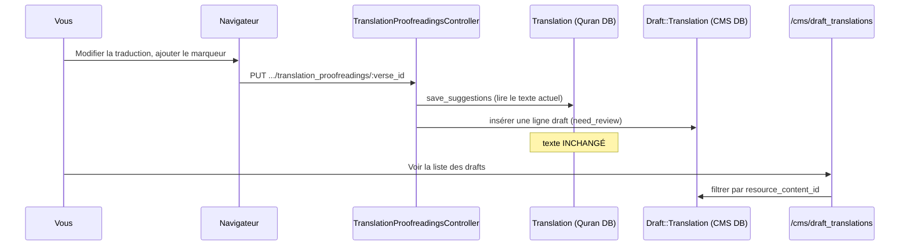

# Phase 19 — Une expérience d'apprentissage contrôlée

> **Série d'intégration :** plongée progressive pour devenir un contributeur légitime de QUL.  
> **Prérequis :** [Phases 1–18](phase-01-what-is-qul.md), en particulier [Phase 17 (configuration locale)](phase-17-local-setup.md)  
> **Ce fichier :** un exercice pratique qui relie navigateur → contrôleur → deux bases de données → CMS — avec des critères de succès clairs et un rollback.

---

## Objectif

Lire la documentation d'intégration n'est pas la même chose que **voir le système se comporter**. Cette phase vous propose une expérience sûre et réversible qui valide :

- L'architecture à deux bases de données (Phase 5)
- L'édition draft-first des contributeurs (Phases 9, 18)
- La frontière CMS vs contenu publié (Phases 3, 8)
- Les conventions d'URL/paramètres (Phase 18)

**Vous exécutez ceci en local.** Ce document ne modifie pas le dépôt. N'ouvrez pas de PR à partir de cet exercice, sauf si vous transformez intentionnellement une découverte en correction réelle.

---

## Liste de contrôle des prérequis

Avant de commencer, confirmez :

| Vérification | Commande / action |
|---|---|
| Dump Quran chargé | `bin/rails runner 'puts Verse.count'` → **> 0** |
| App en cours d'exécution | `bin/dev` → http://localhost:3000 |
| Admin CMS existant | `bin/rails db:seed` → `admin@cms.com` / `cms-password` |
| Connecté en tant qu'admin | `/users/sign_in` ou utilisateur seed |
| Log serveur visible | Terminal exécutant `bin/dev` ou `tail -f log/development.log` |

**INFÉRENCE** — L'utilisateur seed est `super_admin`, ce qui contourne les vérifications `UserProject` pour `can_manage?`.

---

## Expérience recommandée

### Titre : **Proposer une correction de traduction et tracer la ligne draft**

**Niveau de risque :** Faible — écrit uniquement dans `draft_translations` du CMS, pas dans `translations` publiées.  
**Durée :** ~20–30 minutes la première fois.  
**Phases exercées :** 5, 8, 9, 15 (pas de job nécessaire), 17, 18.

---

### Étape 0 — Choisir les constantes (notez-les)

Utilisez les valeurs par défaut de dev sauf si vous savez autrement :

| Symbole | Valeur dev typique | Signification |
|---|---|---|
| `RESOURCE_ID` | `131` | `ResourceContent` pour un package de traduction |
| `VERSE_KEY` | `1:1` | Premier ayah facile à trouver |
| `MARKER` | `[onboarding-test]` | Chaîne unique que vous rechercherez |

Trouvez `VERSE_ID` dans la console :

```bash
bin/rails runner "v = Verse.find_by(verse_key: '1:1'); puts v.id"
```

Vous aurez besoin de `VERSE_ID` pour les URLs (`:id` dans les routes de relecture = **verse id**, pas translation id).

---

### Étape 1 — Référence : traduction publiée inchangée

**Navigateur :** Ouvrez  
`http://localhost:3000/translation_proofreadings/#{VERSE_ID}?resource_id=#{RESOURCE_ID}`

Notez le texte de traduction actuel à l'écran.

**Console :**

```ruby
rc = ResourceContent.find(131)
t  = Translation.find_by(resource_content_id: rc.id, verse_key: '1:1')
puts t.text
puts t.updated_at
```

**Enregistrez :** `ORIGINAL_TEXT`, `ORIGINAL_UPDATED_AT`.

**Critère de succès :** Le texte de la page correspond à `t.text`.

---

### Étape 2 — Compter les drafts avant

**Console :**

```ruby
Draft::Translation.where(resource_content_id: 131, verse_id: Verse.find_by(verse_key: '1:1').id).count
```

**Enregistrez :** `DRAFT_COUNT_BEFORE`.

**FAIT** — `Draft::Translation` est `ApplicationRecord` → base de données **CMS** (table `draft_translations` dans `db/schema.rb`).

---

### Étape 3 — Soumettre une suggestion dans le navigateur

1. Sur la page show, cliquez sur **Edit** (nécessite une connexion).
2. Ajoutez votre marqueur à la traduction, par ex. `... [onboarding-test]`.
3. Cliquez sur submit (le libellé du bouton est **"Purpose changes"** — probable typo pour "Propose" ; **FAIT** depuis `edit.html.erb`).
4. Attendez une redirection avec le message : *"Your suggestions are saved successfully"*.

**Si Edit est absent ou redirige avec une erreur de permission :**

- Confirmez que vous êtes connecté en tant que `admin@cms.com` (super_admin), ou
- Ayez un `UserProject` approuvé pour `resource_content_id: 131`.

---

### Étape 4 — Observer la requête dans les logs

Dans le log serveur, trouvez :

```text
Processing by TranslationProofreadingsController#update
Parameters: { ... "draft_translation" => { "draft_text" => "...[onboarding-test]..." }, "resource_id" => "131", "id" => "<VERSE_ID>" }
```

**Correspondance avec le code (Phase 18) :**

```text
PUT /translation_proofreadings/:id
  → TranslationProofreadingsController#update
  → Translation#save_suggestions
  → Draft::Translation.create (need_review: true)
```

---

### Étape 5 — Vérifier la ligne draft (base CMS)

**Console :**

```ruby
verse = Verse.find_by(verse_key: '1:1')
draft = Draft::Translation.where(resource_content_id: 131, verse_id: verse.id).order(id: :desc).first

puts draft.draft_text.include?('[onboarding-test]')  # => true
puts draft.need_review                                  # => true
puts draft.user&.email                                  # => your logged-in user
```

**Critères de succès :**

| Vérification | Attendu |
|---|---|
| `DRAFT_COUNT_AFTER` | `DRAFT_COUNT_BEFORE + 1` (ou nouvelle ligne pour le même verset) |
| `draft.draft_text` | Contient `[onboarding-test]` |
| `t.text` publiée | **Toujours égale à `ORIGINAL_TEXT`** |
| `t.updated_at` | **Toujours égale à `ORIGINAL_UPDATED_AT`** |

Cela prouve le **flux contributeur draft-first** — le modèle de sécurité éditoriale central de QUL.

---

### Étape 6 — Le voir dans le CMS (optionnel mais précieux)

1. Connectez-vous sur http://localhost:3000/cms
2. Ouvrez **Resource contents** → trouvez l'id `131`
3. Suivez le lien **View draft translations** (filtre préconfiguré), ou allez à :  
   `http://localhost:3000/cms/draft_translations?q[resource_content_id_eq]=131`
4. Trouvez votre ligne avec `[onboarding-test]`

**INFÉRENCE** — Vous avez maintenant corrélé trois surfaces pour la même modification logique :

```text
/translation_proofreadings  →  draft_translations (CMS)  →  /cms/draft_translations
                                      ↓ (pas encore)
                                 translations (Quran DB)
```

---

### Étape 7 — Rollback (nettoyage)

Supprimez uniquement votre draft de test :

```ruby
Draft::Translation.where(resource_content_id: 131)
  .where("draft_text LIKE ?", "%[onboarding-test]%")
  .delete_all
```

Relancez la vérification console de l'Étape 1 — le texte publié doit rester inchangé.

**Ne** cliquez pas sur "Approve" dans le CMS pour cette expérience, sauf si vous avez l'intention de muter les données Quran publiées.

---

## Schéma de l'expérience



---

## Alternative A — Lecture seule (pas d'écriture)

Si vous ne pouvez pas ou ne voulez pas créer de drafts :

1. Ouvrez http://localhost:3000/ayah/2:255
2. Ouvrez DevTools → onglet Network
3. Observez les requêtes Turbo Frame lazy : `/ayah/2:255/text`, `/translations`, etc.
4. Dans les logs, faites correspondre chaque requête à `AyahController#text`, `#translations`, …

**Critère de succès :** Vous pouvez nommer quel partial chaque frame charge (`ayah/_ayah_text`, etc.) sans modifier les données.

**Phases exercées :** 16, 18.

---

## Alternative B — Preuve deux-DB en console seule

Pas de modifications dans le navigateur :

```ruby
# Quran DB connection
Verse.connection_db_config.database_name   # => "quran_dev"
Verse.count

# CMS DB connection
User.connection_db_config.database_name    # => "quran_community_tarteel"
Draft::Translation.count

# Cross-DB logical join (no FK)
v = Verse.find_by(verse_key: '2:255')
Translation.find_by(verse_id: v.id, resource_content_id: 131)
```

**Critère de succès :** Vous pouvez expliquer pourquoi `Verse` et `Draft::Translation` peuvent être joints sur `verse_id` mais vivent dans des bases Postgres différentes.

**Phases exercées :** 5, 2.

---

## Ce qu'il ne faut PAS faire dans cette expérience

| Action | Pourquoi éviter |
|---|---|
| Approuver le draft dans le CMS | Mute `translations` publiées — réserver pour un exercice Phase 8 délibéré |
| `refresh_export!` sur une ressource réelle | Nécessite Sidekiq + S3 ; hors périmètre |
| Modifier la disposition mushaf | Écritures directes Quran DB — pattern différent (Phase 13) |
| Exécuter `ExportMiniDumpJob` | Destructif pour la Quran DB locale |
| Commiter du texte marqueur de test | Pollue le dépôt ; base locale uniquement |

---

## Objectifs étendus optionnels (après l'expérience principale)

Uniquement si l'expérience principale a réussi :

1. **Chemin d'approbation (supervisé) :** Dans le CMS, approuvez le draft pour cet ayah → observez `DraftContent::ApproveDraftTranslationJob` dans les logs Sidekiq → vérifiez que `translations.text` est mis à jour. **Revenez en arrière** en restaurant depuis le dump ou via SQL manuel si nécessaire.

2. **Tracer la confusion de paramètres :** Visitez délibérément `/translation_proofreadings/2:255?resource_id=131` (verse_key dans le slot id) — observez 404 ou mauvais enregistrement. Comparez avec le correct `/translation_proofreadings/#{VERSE_ID}?resource_id=131`.

3. **Chasse aux typos UI :** Le bouton submit dit "Purpose changes" dans `app/views/translation_proofreadings/edit.html.erb` — une vraie contribution serait une correction d'une ligne en "Propose changes" avec une capture d'écran dans la PR.

---

## Grille d'auto-évaluation

| Question | Réussi si vous pouvez répondre sans regarder |
|---|---|
| Quelle DB contient `draft_translations` ? | CMS (`quran_community_tarteel`) |
| Quelle DB contient `translations` ? | Quran (`quran_dev`) |
| Que signifie `:id` dans `/translation_proofreadings/:id` ? | `verses.id` |
| Que signifie le paramètre de requête `resource_id` ? | `resource_contents.id` |
| Le texte publié a-t-il changé après la suggestion ? | **Non** |
| Quelle méthode de modèle crée le draft ? | `Translation#save_suggestions` |
| Où les admins examinent la ligne ? | `/cms/draft_translations` |

---

## Incertitudes

| # | Question | Label |
|---|---|---|
| 1 | Si `resource_id=131` existe dans chaque mini dump | **INFÉRENCE** — valeur par défaut courante dans le code ; vérifiez `ResourceContent.find(131)` |
| 2 | Si les utilisateurs non-admin peuvent compléter l'Étape 3 sans `UserProject` | **FAIT** — `authorize_access!` bloque l'édition sans accès |
| 3 | Si l'approbation d'un draft d'un seul ayah est exposée dans l'UI CMS sans job bulk | **INCONNU** — objectif étendu ; peut nécessiter les écrans admin draft |

---

## Résumé de la Phase 19

```text
Modifier la traduction dans le navigateur
  → Ligne Draft::Translation dans le CMS (need_review)
  → Translation publiée inchangée
  → visible dans /cms/draft_translations
  → supprimer le draft pour rollback
```

Si cette expérience vous semble claire, vous comprenez la frontière de sécurité contributeur la plus importante de QUL. Si quelque chose ne correspondait pas (pas de bouton edit, draft non créé, mauvaise DB), **c'est précieux** — notez où la réalité diverge avant de contribuer du code de production.

---

## Arrêtez-vous ici — avant la Phase 20

La Phase 20 couvre **les tests et la vérification de l'intégrité des données** — comment QUL contrôle la qualité (RuboCop, specs, outils d'intégrité admin).

1. Après votre expérience, `translations.text` publiées a-t-il changé avant l'approbation CMS ?
2. Quelle table a reçu une nouvelle ligne — `draft_translations` ou `translations` ?
3. Quelle URL utiliseriez-vous pour trouver le draft dans Active Admin ?

Répondez avec ce que vous avez observé (surtout les surprises), ou dites **"proceed"** pour la **Phase 20 — Tests et intégrité des données**.
