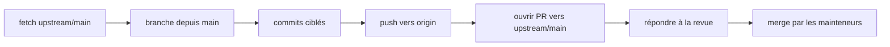

# Phase 22 — Workflow git OSS

> **Série d'intégration :** plongée progressive pour devenir un contributeur légitime de QUL.  
> **Prérequis :** [Phases 1–21](phase-01-what-is-qul.md)  
> **Ce fichier :** fork → branche → sync → mécaniques PR pour `TarteelAI/quranic-universal-library` — commandes git pratiques et hygiène.

---

## Dépôt cible

| Remote | URL | Rôle |
|---|---|---|
| **upstream** | `https://github.com/TarteelAI/quranic-universal-library.git` | Dépôt canonique — les PR mergent ici |
| **origin** | Votre fork sur GitHub | Où vous poussez les branches |

**FAIT** — La branche par défaut est **`main`**. CI (CodeQL) et workflows deploy se déclenchent sur `main`.

**INFÉRENCE :** Les PR ciblent `main`, pas `master` ni des branches develop de longue durée.

---

## Configuration fork unique

### 1. Fork sur GitHub

Cliquez sur **Fork** sur https://github.com/TarteelAI/quranic-universal-library

### 2. Cloner votre fork

```bash
git clone https://github.com/YOUR-USERNAME/quranic-universal-library.git
cd quranic-universal-library
```

### 3. Ajouter le remote upstream

```bash
git remote add upstream https://github.com/TarteelAI/quranic-universal-library.git
git remote -v
# origin    → your fork
# upstream  → TarteelAI/quranic-universal-library
```

**FAIT** — Documenté dans `app/views/docs/markdown/contributing.md`.

### 4. Environnement local

Suivez [Phase 17](phase-17-local-setup.md) : `bin/setup`, charger le mini dump, `bin/dev`.

---

## Workflow quotidien (branche feature)



### Synchroniser avant de commencer

```bash
git fetch upstream
git switch main
git merge upstream/main    # or: git rebase upstream/main
```

**Ligne directrice :** Ne jamais construire une branche feature sur un `main` obsolète — QUL évolue vite (segments, treebank, docs).

### Créer une branche

```bash
git switch -c fix/segment-validator-overlap
# or
git switch -c docs/project-setup-dump-steps
```

**Nommage des branches** (convention, pas imposée) :

| Préfixe | Usage |
|---|---|
| `fix/` | Corrections de bugs |
| `feat/` | Nouveau comportement |
| `docs/` | Documentation uniquement |
| `chore/` | Outillage, deps, CI |

Les commits upstream récents mélangent les styles (`fix:`, `docs:`, impératif simple) — **choisissez un et restez cohérent dans votre PR**.

### Commit

```bash
git add path/to/changed/files
git commit -m "fix: flag ayah overlap in segment validator"
```

**Patterns de messages de commit de l'historique upstream :**

```text
Fix typo in quran-script group description (#745)
docs: clarify that audio_url points at Tarteel's CDN (#693)
fix: paginate word mistakes by per_page instead of hardcoded 100 (#721)
Segment validation improvement (#708)
```

**Lignes directrices :**

- Présent ou impératif ("Fix", "Add", pas "Fixed")
- Référencer le numéro d'issue dans le corps ou le titre si applicable
- Le numéro PR `(#745)` est ajouté **par le mainteneur au merge** — ne le simulez pas dans les commits locaux

### Push vers votre fork

```bash
git push -u origin fix/segment-validator-overlap
```

### Ouvrir une PR

**UI GitHub :** Comparez `TarteelAI/quranic-universal-library` `main` ← `YOUR-USERNAME/quranic-universal-library` `fix/segment-validator-overlap`

**CLI (`gh`) :**

```bash
gh pr create \
  --repo TarteelAI/quranic-universal-library \
  --base main \
  --head YOUR-USERNAME:fix/segment-validator-overlap \
  --title "fix: flag ayah overlap in segment validator" \
  --body "$(cat <<'EOF'
## Description
…

## Related Issue
Fixes #___

## How Has This Been Tested?
- `bin/rails test test/services/audio/segment_validator_test.rb`
EOF
)"
```

**FAIT** — Le template PR vit dans `.github/PULL_REQUEST_TEMPLATE/pull_request_template.md`.

---

## Garder votre fork à jour (pendant la revue)

Pendant que votre PR est ouverte, `main` upstream peut avancer. Mettez à jour votre branche :

### Option A — merge (plus simple)

```bash
git fetch upstream
git switch fix/segment-validator-overlap
git merge upstream/main
git push origin fix/segment-validator-overlap
```

### Option B — rebase (historique linéaire)

```bash
git fetch upstream
git switch fix/segment-validator-overlap
git rebase upstream/main
git push --force-with-lease origin fix/segment-validator-overlap
```

**Quand rebaser :** Le mainteneur le demande, ou vous voulez une PR propre à un seul commit.  
**Quand merger :** Vous n'êtes pas à l'aise avec force-push, ou la PR a plusieurs commits logiques à préserver.

**Jamais :** `git push --force` vers `upstream` ou `main`.

---

## Ce qui appartient à git (et ce qui n'y appartient pas)

### À commiter

| Chemin | Quand |
|---|---|
| `app/`, `lib/`, `config/`, `test/` | Code/tests |
| `app/views/docs/markdown/` + `config/docs.yml` | Docs utilisateur |
| `onboarding/` | Si les mainteneurs veulent cette série upstream (demandez d'abord) |

### À NE PAS commiter

| Chemin | Pourquoi |
|---|---|
| `.env` | Secrets |
| `config/master.key` | Credentials |
| `mini_quran_dev.sql` / dumps | Énorme ; télécharger séparément |
| `app/assets/builds/` | Généré par `yarn build` |
| `node_modules/`, `log/`, `tmp/` | Gitignored |
| État DB local | Pas portable |

**FAIT** — `.env.sample` documente les vars S3 avec valeurs vides par défaut — copier vers `.env` en local, ne jamais commiter `.env`.

### Fichiers d'intégration dans votre clone

La série `onboarding/phase-*.md` peut être **non trackée** dans votre working tree (artefact d'apprentissage local). Avant de pousser :

```bash
git status
```

Décidez : inclure dans une PR `docs/onboarding`, garder local uniquement, ou publier séparément. Ne mélangez pas accidentellement 24 fichiers d'intégration dans une PR code sans lien.

---

## Liste de contrôle hygiène PR

```text
□ Branche basée sur le dernier upstream/main
□ Seuls les fichiers prévus modifiés (git diff upstream/main...HEAD)
□ Pas de puts debug, code commenté, ou formatage sans lien
□ Commits ciblés (ou squash avant merge si désordonné)
□ Titre PR décrit le résultat visible utilisateur
□ Issue liée quand requis (Phase 21)
□ "How Has This Been Tested?" rempli (Phase 20)
□ Captures d'écran attachées pour UI
□ Pas de secrets dans le diff
```

### Inspecter votre diff avant d'ouvrir

```bash
git fetch upstream
git diff upstream/main...HEAD --stat
git diff upstream/main...HEAD
```

### Commandes utiles

```bash
git log upstream/main..HEAD --oneline    # commits uniquement sur votre branche
git diff --name-only upstream/main       # fichiers changés vs upstream
gh pr status                              # état PR si vous utilisez gh CLI
gh pr checks                              # statut CodeQL
```

---

## Après le merge

```bash
git switch main
git fetch upstream
git merge upstream/main
git push origin main          # sync main de votre fork

git branch -d fix/my-branch   # supprimer branche locale
```

**INFÉRENCE :** Upstream utilise probablement le **squash merge** (un commit par PR avec `(#NNN)` dans le titre) — les hash de commits de votre branche n'apparaîtront pas sur `main` ; c'est normal.

---

## Gérer les retours de revue

| Le reviewer demande | Vous faites |
|---|---|
| "Please add a test" | Commit sur la même branche, push |
| "Rebase on main" | `git rebase upstream/main`, push force-with-lease |
| "Split this PR" | Nouvelles branches depuis `main` propre, fermer ou réduire la PR originale |
| "Fix RuboCop" | `bundle exec rubocop -a`, commit, push |
| "Wrong docs path" | Éditer `app/views/docs/markdown/`, pas `docs/` racine |

Répondez sur la PR avec ce que vous avez changé et re-exécutez les tests que vous citez.

---

## Erreurs git courantes (spécifiques QUL)

| Erreur | Conséquence | Correction |
|---|---|---|
| PR depuis `main` sur fork avec junk mergé | Diff énorme | Nouvelle branche depuis `upstream/main` propre, cherry-pick |
| Committé `onboarding/` + code ensemble | PR non reviewable | `git reset`, séparer les branches |
| Branche basée sur `main` vieux de mois | Conflits, CI obsolète | `git rebase upstream/main` |
| Push vers le mauvais remote | Head PR incorrect | `git push -u origin branch-name` |
| Édité le mauvais dossier docs | Rejet mainteneur | `app/views/docs/markdown/` |
| Inclus dump SQL dans commit | Bloat dépôt | `git rm --cached`, réécrire historique si pas poussé |

---

## Modèle mental fork vs upstream

```text
         ┌─────────────────────────────┐
         │  TarteelAI/quranic-universal-library  │  ← upstream (lecture + cible PR)
         │  main                                       │
         └──────────────▲──────────────────────────────┘
                        │ merge PR (mainteneurs)
         ┌──────────────┴──────────────────────────────┐
         │  YOUR-USERNAME/quranic-universal-library      │  ← origin (cible de vos push)
         │  main + branches feature                    │
         └──────────────▲──────────────────────────────┘
                        │ git push
                   ┌────┴────┐
                   │ laptop  │
                   └─────────┘
```

Vous n'avez **jamais** besoin d'accès en écriture à `TarteelAI/*` — fork + PR est tout le modèle.

---

## Workflow issue + branche (recommandé)

```bash
# 1. Open issue on upstream (or find existing)
# 2. Comment "I'd like to work on this"
# 3. Branch
git fetch upstream && git switch main && git merge upstream/main
git switch -c fix/123-short-description

# 4. Work, commit, push, PR with "Fixes #123"
```

**FAIT** — Le template PR encourage de lier les issues ouvertes.

---

## CI sur votre PR

**FAIT** — `.github/workflows/codeql.yml` s'exécute sur les PR vers `main`.

**FAIT** — Pas de workflow automatisé `rails test` ou `rubocop` (Phase 20).

**INFÉRENCE :** CodeQL vert ≠ barrière qualité complète. Exécutez les tests en local et dites-le dans la PR.

---

## Chemin première contribution (minimal)

Bonnes premières PR pour un ingénieur React/Node nouveau sur Rails :

| Type PR | Effort | Exemple |
|---|---|---|
| Fix doc | Faible | Corriger chemin docs `contributing.md` → `app/views/docs/markdown/` |
| Typo / copy | Faible | "Purpose changes" → "Propose changes" bouton |
| Test service | Moyen | Ajouter cas à `segment_validator_test.rb` |
| Bug Stimulus | Moyen | Fix avec capture + étapes manuelles |

```bash
git fetch upstream
git switch main && git merge upstream/main
git switch -c docs/fix-contributing-path

# edit app/views/docs/markdown/contributing.md
git add app/views/docs/markdown/contributing.md
git commit -m "docs: point contributors to app/views/docs/markdown for edits"
git push -u origin docs/fix-contributing-path
gh pr create --repo TarteelAI/quranic-universal-library --fill
```

---

## Incertitudes

| # | Question | Label |
|---|---|---|
| 1 | Stratégie squash vs merge commit | **INFÉRENCE** — squash d'après les numéros PR dans les titres de commit |
| 2 | Commits signés requis | **INCONNU** — pas documenté |
| 3 | Règles protection branche sur `main` | **INFÉRENCE** — PRs requises ; règles exactes dans paramètres GitHub |
| 4 | Si `onboarding/` sera accepté upstream | **INCONNU** — coordonner avec les mainteneurs |

---

## Résumé de la Phase 22

```text
fork → origin
TarteelAI → upstream
sync main depuis upstream avant chaque branche
petite branche feature → push origin → PR vers upstream/main
test + décrire en local (CI fine)
ne jamais commiter secrets ou dumps
```

Les mécaniques git sont OSS standard ; les pièges spécifiques QUL sont **chemin docs**, **ne pas commiter dumps**, et **garder les changements données hors des PR code opportunistes**.

---

## Arrêtez-vous ici — questions avant la Phase 23

La Phase 23 est la **carte des surfaces de contribution + évaluation de préparation** — où vous pouvez plausiblement contribuer maintenant, et une liste de contrôle honnête de ce qu'il vous reste avant de vous dire « intégré ».

1. Quel remote `git push` doit cibler — `origin` ou `upstream` ?
2. Dans quelle branche les PR mergent ?
3. Que devez-vous exécuter avant d'ouvrir une PR si la CI ne lance pas les tests ?

Répondez avec des questions, ou dites **"proceed"** pour la **Phase 23 — Carte des surfaces de contribution et préparation**.
