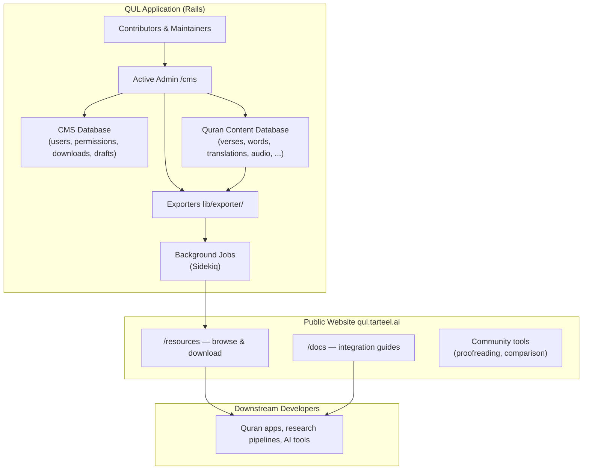

# Phase 1 — What is Quranic Universal Library?

> **Onboarding series:** progressive deep-dive for becoming a legitimate QUL contributor.  
> **This file:** Phase 1 only — product and data identity model. No Rails architecture yet.

---

## Before we open any Ruby files

QUL is not primarily a Quran *reader app*. It is infrastructure for **creating, curating, validating, versioning, and distributing** structured Quranic datasets.

Think of two layers that are easy to confuse:

| Layer | What it is | Who touches it |
|---|---|---|
| **QUL the application** | A Ruby on Rails CMS + public website at [qul.tarteel.ai](https://qul.tarteel.ai) | Maintainers, editors, proofreaders, contributors with CMS access |
| **QUL the resources** | Downloadable datasets (JSON, SQLite, audio URLs, fonts, etc.) | App developers, researchers, Quran app builders — often **without ever cloning the repo** |

**FACT:** The getting-started docs explicitly say most users do **not** need to clone the repository. They download from `/resources`.  
**FACT:** The README describes QUL as a "comprehensive Content Management System designed to manage Quranic data."  
**INFERENCE:** Your contribution path may be **code** (improving the platform) or **data** (improving datasets through CMS workflows). Both are legitimate; they have different risk profiles.

---

## What QUL actually provides

### Compact mental model (verified and refined)

> **QUL is a structured Quran-resource CMS + validation/versioning system + export/distribution layer.**

That is accurate. Breaking it down:

1. **CMS** — Administrators and authorized contributors manage translations, tafsirs, audio, morphology, mushaf layouts, and more through an Active Admin interface mounted at `/cms`. **FACT:** `config/initializers/active_admin.rb` sets `config.default_namespace = :cms`. Old `/admin` URLs redirect to `/cms`.

2. **Validation / versioning** — Content changes are tracked (PaperTrail is used on core models like `Verse` and `Word`). There are proofreading workflows, draft models, approval flags, and data-integrity tooling in the admin area. (We will trace these in later phases.)

3. **Export / distribution** — Curated content is published as `DownloadableResource` records and exposed on the public site at `/resources`, typically as JSON or SQLite files generated by exporters in `lib/exporter/`.

4. **Public website** — Not just downloads. The site includes documentation (`/docs`), resource previews, community tools, and contributor-facing workflows (proofreading UIs, comparison tools, etc.).

### What QUL is **not** (for most consumers)

- **Not a hosted public API service (primary path).** **FACT:** `app/views/docs/markdown/api.md` says a full REST API is "Coming soon" and recommends downloading datasets. **CURRENT CODE REALITY:** A partial `api/v1` namespace already exists in `config/routes.rb` (chapters, verses, translations, tafsirs, recitations, segments). Treat downloads as the stable integration path until the API docs catch up.
- **Not a Quran reader app.** QUL produces data that reader apps consume. Tarteel (the company behind QUL) builds separate consumer products.
- **Not a single monolithic dataset.** QUL manages **many resource packages** — each translation, each recitation, each script variant is its own publishable resource with its own metadata and export files.

---

## Who uses QUL?

### Resource consumers (downstream developers)

**FACT** (from `getting-started.md` and `datasets.md`):

- Quran reader app developers (Arabic + translation)
- Search and discovery experiences
- Tafsir study tools
- Word-by-word learning apps (root, lemma, POS)
- NLP / AI pipelines using structured Quran data

These users typically:

1. Browse [qul.tarteel.ai/resources](https://qul.tarteel.ai/resources)
2. Download JSON (quick integration) or SQLite (query-heavy workloads)
3. Join datasets using shared identifiers
4. Host the data in their own infrastructure

They do **not** need Rails, PostgreSQL, or Redis.

### Content contributors and maintainers

**FACT** (from `contribute-data.md`):

- Proofread and correct translations, tafsirs, transliterations
- Segment and verify recitation audio
- Refine morphology (roots, lemmas, POS)
- Tag ayahs by topic, theme, similarity, mutashabihat

Most data contribution happens through the **QUL CMS**, with review before publication.

### Code contributors (you, eventually)

**FACT** (from `contribute-code.md`):

- Improve the Rails app, exporters, tooling, and website
- Follow fork → branch → PR workflow
- Run the app locally with the Quran development dataset

---

## Why this project exists

**INFERENCE** (supported by README, Tarteel branding, and project scope):

The Quran ecosystem has many translations, tafsirs, recitations, script variants, and linguistic annotations — but they are scattered, inconsistently formatted, and hard to join reliably. QUL centralizes **curation** and **distribution** so downstream developers can build on stable, attributable, joinable datasets rather than re-scraping or re-normalizing sources.

The engineering bet is: **stable identifiers + provenance + export pipelines** matter as much as the text itself.

---

## Major resource categories

**FACT:** `DownloadableResource::RESOURCE_TYPES` in `app/models/downloadable_resource.rb` defines these published categories:

| Category slug | What it covers |
|---|---|
| `quran-script` | Arabic Quran text in multiple scripts (Uthmani, Indopak, QPC, etc.) |
| `translation` | Ayah-level and word-level translations |
| `tafsir` | Commentary datasets |
| `recitation` | Audio recitations and segment timing |
| `morphology` | Word-level grammar: roots, lemmas, POS |
| `transliteration` | Phonetic / romanized representations |
| `surah-info` | Descriptive metadata about surahs |
| `quran-metadata` | Structural navigation: juz, hizb, rub, manzil |
| `mushaf-layout` | Page-oriented mushaf layout data |
| `ayah-topics` | Topic tagging for ayahs |
| `ayah-theme` | Thematic groupings |
| `similar-ayah` | Similar-ayah relationships |
| `mutashabihat` | Mutashabihat (similar phrasing) data |
| `font` | Quran-focused fonts |

**FACT:** `ResourceContent` (the CMS-side metadata record for a logical resource) has additional sub-types beyond what is exported — including media, uloom content, root details, etc. Not everything in the CMS becomes a public download.

### Ayah-level vs word-level resources

**FACT:** `ResourceContent` scopes include `one_verse`, `one_word`, and `one_chapter` cardinality types. This determines how a resource attaches to the Quran hierarchy:

- **Ayah-level:** translations, tafsirs, transliterations (ayah), topics/themes, surah info (chapter-level)
- **Word-level:** morphology, word translations, word scripts
- **Audio:** recitations with per-ayah or gapless (surah-level) audio plus segment timings

---

## QUL as application vs QUL as resources



**Narration:**

- Editors work inside the CMS (`/cms`) to create and fix content stored primarily in the Quran content database.
- The CMS database holds application state: users, permissions, downloadable resource packaging, tags, etc.
- Exporters read Quran content and produce JSON/SQLite files.
- The public `/resources` pages expose published downloads to developers who never touch Rails.
- Community tools on the public site support contributor workflows (proofreading, audio comparison) that write back into the CMS.

We will dissect the two-database split in **Phase 5**. For now, just remember: **the application and the sacred content are architecturally separated.**

---

## The Quran identity model

This is the most important concept in the entire repository. Nearly every resource joins through this hierarchy.

### Conceptual hierarchy

```text
Quran
 └── Surah (114 chapters)
      └── Ayah (verses within a surah)
           └── Word (tokens within an ayah)
```

### Rails model names vs everyday names

QUL's Rails models use terminology that differs from common English and from export field names:

| Everyday term | Rails model | Key fields |
|---|---|---|
| Surah | `Chapter` | `chapter_number` (1–114) |
| Ayah | `Verse` | `verse_number`, `chapter_id`, `verse_key` |
| Word | `Word` | `position`, `verse_id`, `location`, `word_index` |

**FACT:** `Chapter` has `chapter_number`. `Verse` belongs to `chapter` and has `verse_number`. `Word` belongs to `verse` and has `position` (the word's position within the ayah).

Do not be thrown off when you see `chapter_id` in the database — it means surah.

### The shared identifiers

Documentation (`data-model.md`) tells downstream developers to join on:

| Identifier | Meaning | Example |
|---|---|---|
| `surah_id` / `surah` | Which surah (1–114) | `2` (Al-Baqarah) |
| `ayah_number` / `ayah` | Verse number within surah | `255` |
| `word_position` / `word` / `position` | Word index within ayah | `5` |

**FACT:** Export code uses multiple naming conventions. For example, `lib/exporter/export_quran_word_script.rb` exports:

```ruby
{
  surah: s,
  ayah: a,
  word: w,
  location: word.location,  # e.g. "2:255:5"
  text: word.send(text_attribute)
}
```

**FACT:** The `verse_key` on `Verse` is a string like `"2:255"` (surah:ayah). **FACT:** The `location` on `Word` is a string like `"2:255:5"` (surah:ayah:word), confirmed by `word.location.split(':')` usage throughout the codebase.

### Global sequential IDs

In addition to human-readable keys, QUL uses global sequential indices:

| Field | Model | Purpose |
|---|---|---|
| `verse_index` | `Verse` | Global ayah number across the entire Quran (1–6236) |
| `word_index` | `Word` | Global word number across the entire Quran; **unique index** in schema |
| `sequence_number` | `Word` | Also unique — another global word identifier |

**USEFUL LATER:** These global indices enable efficient sequential navigation (`next_ayah`, `next_word`) and compact exports. For joining resources, prefer `surah + ayah + word position` — that is what the documentation promises downstream developers.

### Example: one ayah with attached resources

Using **Ayat al-Kursi** as a concrete example (Surah 2, Ayah 255):

```text
Surah 2 (Al-Baqarah)                    ← Chapter, chapter_number: 2
  └── Ayah 255                            ← Verse, verse_key: "2:255"
       ├── Arabic script (text_uthmani, text_indopak, text_qpc_hafs, ...)
       ├── Translation A (English)        ← joins on surah=2, ayah=255
       ├── Translation B (Urdu)           ← joins on surah=2, ayah=255
       ├── Tafsir (Ibn Kathir)             ← joins on surah=2, ayah=255
       ├── Transliteration                 ← joins on surah=2, ayah=255
       ├── Topic tags                      ← joins on surah=2, ayah=255
       └── Words
            ├── Word 1 (position: 1)       ← location: "2:255:1"
            │    └── morphology: root, lemma, POS
            ├── Word 2 (position: 2)       ← location: "2:255:2"
            │    └── morphology: root, lemma, POS
            └── ... (this ayah has many words)
```

**FACT:** A single `Verse` record stores multiple script representations as separate columns (`text_uthmani`, `text_indopak`, `text_qpc_hafs`, etc.) — these are content variants, not separate resources. Exported script packages select which column to export via `ResourceContent` metadata.

### How different resources attach

| Resource type | Join level | Join keys |
|---|---|---|
| Quran script (ayah) | Ayah | `surah + ayah` |
| Translation | Ayah | `surah + ayah` |
| Tafsir | Ayah (sometimes ayah ranges) | `surah + ayah` |
| Transliteration | Ayah or word | `surah + ayah` or `surah + ayah + word` |
| Morphology | Word | `surah + ayah + word_position` |
| Word translation | Word | `surah + ayah + word_position` |
| Topics / themes | Ayah | `surah + ayah` |
| Recitation audio | Ayah or surah | `surah + ayah` (+ reciter ID) |
| Audio segments | Ayah (timestamps) | `surah + ayah` (+ reciter ID) |
| Mushaf layout | Word (page/line position) | `surah + ayah + word` mapped to page/line |
| Surah info | Surah | `surah` only |

**INFERENCE:** If you get the join keys wrong — attach a translation to ayah 256 instead of 255, or morphology to word position 4 instead of 5 — the error propagates silently into exports. Every downstream app that joins on identifiers will show wrong data. This is why identifier stability is treated as sacred engineering infrastructure.

---

## Why stable identifiers are fundamental

Three properties make QUL's identity model work:

### 1. Composability

A developer downloads three independent packages — Arabic script, English translation, morphology — and joins them in their own database using `surah + ayah (+ word)`. No central API required. **FACT:** This is the documented primary integration path.

### 2. Attribution

Each resource package is tied to a `ResourceContent` record with author, language, data source, approval status, and version history. When you use "Sahih International translation from QUL," the export metadata tells you exactly which dataset you have. (Phase 3 will trace provenance fields.)

### 3. Integrity across edits

When an editor corrects a translation in the CMS, the ayah identity (`verse_key: "2:255"`) does not change — only the content attached to that identity changes. Exporters re-generate files; downstream consumers re-download. The join keys remain stable.

**MUST UNDERSTAND NOW:** Identifiers are the contract between QUL and every downstream application. Code that changes identifier assignment is high-risk. Code that changes content *at* a stable identifier is normal editorial work.

---

## How QUL differs from a Quran reader app

| Concern | Quran reader app | QUL |
|---|---|---|
| Primary output | Rendered reading experience | Structured, downloadable datasets |
| User | End user reading Quran | Developer, researcher, or content editor |
| Data ownership | Consumes data | Creates, curates, and publishes data |
| Arabic text | Displays one chosen script | Manages many script variants as resources |
| Audio | Plays recitation | Manages recitation files + segment timing data |
| Translations | Shows one at a time | Manages many translations as separate publishable resources |
| Updates | App release | Re-export and re-download |

**INFERENCE:** If you have built React/Firebase Quran apps before, you were likely a **consumer** of data like what QUL produces. Contributing to QUL means working on the **factory**, not the **product**.

---

## Documentation note: source of truth path

**POSSIBLY STALE DOCUMENTATION:**

`contributing.md` says: *"Edit files in `docs/` first (source of truth)."*

**CURRENT CODE REALITY:** There is no top-level `docs/` directory. Documentation source files live at:

```text
app/views/docs/markdown/
```

These are rendered on the website at `/docs/:key`. When contributing documentation, edit files in `app/views/docs/markdown/`, not a `docs/` folder.

---

## Classification for this phase

### MUST UNDERSTAND NOW

1. QUL is a **CMS + export/distribution platform**, not a reader app.
2. Most data consumers **download** resources; they do not run Rails.
3. The hierarchy **Surah → Ayah → Word** with stable join keys is the foundation of everything.
4. Rails uses `Chapter` / `Verse` / `Word` — learn the mapping.
5. `verse_key` (`"2:255"`) and `location` (`"2:255:5"`) are the canonical string identifiers in the codebase.
6. Exported field names vary (`surah_id`, `surah`, `ayah_number`, `ayah`) — normalize in your head to the hierarchy.
7. Content editing and code editing are **different contribution paths** with different risk.

### USEFUL LATER

- Partial `api/v1` endpoints (chapters, translations, tafsirs, audio) — not the primary integration path yet.
- Global `verse_index` and `word_index` for sequential navigation.
- The 14 `RESOURCE_TYPES` slug taxonomy for browsing `/resources`.
- Community tools (proofreading, audio comparison) on the public site.
- `ResourceContent` sub-types and cardinality (`one_verse`, `one_word`, `one_chapter`).

### IGNORE FOR NOW

- Active Admin configuration details.
- Individual exporter implementations.
- Mushaf layout rendering mechanics.
- Audio segmentation algorithms.
- Morphology graph structures.
- Permission model (CanCanCan).
- Sidekiq job definitions.
- Vue vs Stimulus vs jQuery frontend split.

---

## Uncertainties

| Item | Status |
|---|---|
| Full public REST API timeline | **UNKNOWN** — docs say "coming soon"; partial API exists in code |
| Exact approval workflow per resource type | **UNKNOWN** — need to trace in Phase 3 and Phase 8 |
| Which resources require CMS login vs public contribution tools | **INFERENCE** — most editing is CMS; some proofreading tools are public-facing with auth |
| License terms per dataset | **UNKNOWN** — FAQ mentions checking license; need to inspect per-resource metadata |

---

## What we investigate next

**Phase 2 — Quranic Data Model First**

We will go deeper into the actual database tables and model associations — still focused on the *data*, not Rails architecture. Specifically:

- How `Chapter`, `Verse`, and `Word` relate in the schema
- What `ResourceContent` represents as the "logical resource" wrapper
- How translations, tafsirs, and morphology models attach to verses and words
- The difference between content columns on `Verse`/`Word` and separate resource tables

**Phase 3 — Sacred Data, Provenance and Integrity**

Then we trace versioning (PaperTrail), drafts, approvals, and what is editable vs canonical.

---

## Phase 1 summary — five things to remember

1. **QUL = CMS + validation + export.** It builds and distributes datasets; it is not a reader app.
2. **Two audiences:** downstream developers who download, and contributors who edit through the CMS.
3. **Surah → Ayah → Word** with stable identifiers (`verse_key`, `location`, `surah + ayah + word`) is the join contract for the entire ecosystem.
4. **Rails names differ:** `Chapter` = Surah, `Verse` = Ayah. Export field names also vary. Normalize mentally.
5. **Wrong identifiers propagate silently.** Identifier stability is the highest-risk thing to break.

---

*Generated during QUL contributor onboarding. Phase 1 of ~24. Read-only investigation — no code modified.*
