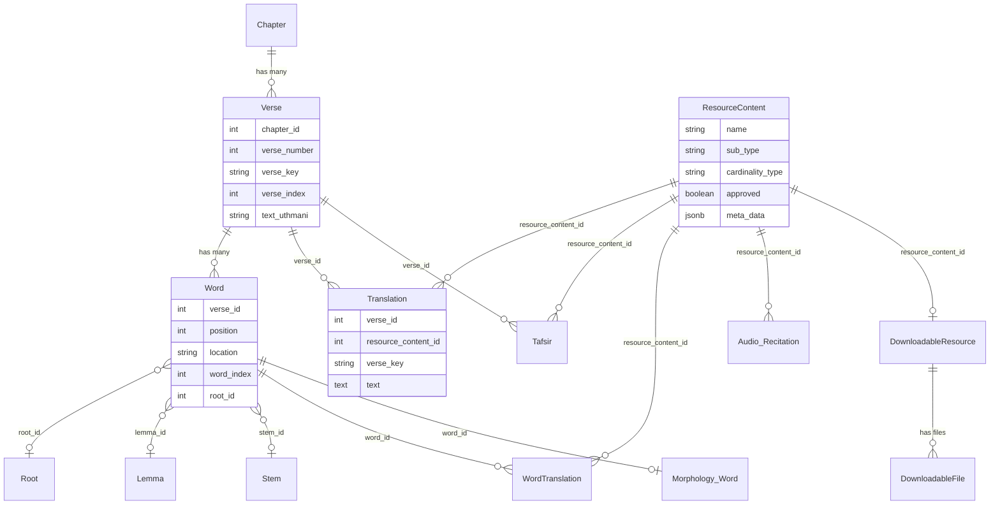

# Phase 2 — Quranic Data Model First

> **Onboarding series:** progressive deep-dive for becoming a legitimate QUL contributor.  
> **Prerequisite:** [Phase 1 — What is QUL?](phase-01-what-is-qul.md)  
> **This file:** the data itself — hierarchy, identifiers, and how resources attach. Still not a Rails architecture tour.

---

## Why we start with data, not Rails

Before `belongs_to` and `has_many` mean anything, you need to know **what is being joined**.

QUL's central engineering problem is:

> Many independent resource packages (translations, morphology, audio, …) must all refer to the **same ayahs and words** reliably.

Everything else — CMS forms, exporters, background jobs — exists to create, protect, and publish that joinable data.

---

## The hierarchy (conceptual)

```text
Quran
 └── Surah (114 chapters)
      └── Ayah (verses within a surah)
           └── Word (tokens within an ayah)
```

This is not just taxonomy. It is the **addressing scheme** every dataset uses.

---

## Rails model names vs everyday names

QUL's codebase uses Arabic/Quran terminology inconsistently across layers. Learn this table early:

| Concept | Everyday / export docs | Rails model | Primary table | Key fields |
|---|---|---|---|---|
| Surah | `surah`, `surah_id` | `Chapter` | `chapters` | `chapter_number` (1–114), `id` |
| Ayah | `ayah`, `ayah_number` | `Verse` | `verses` | `verse_number`, `chapter_id`, `verse_key` |
| Word | `word`, `word_position` | `Word` | `words` | `position`, `verse_id`, `location` |

**FACT:** `Chapter#name` is aliased to `id` — so `chapter.name` returns the surah number, not a display name. Display names use `name_simple`, `name_arabic`, etc.

**FACT:** `Verse#to_s` returns `verse_key` (e.g. `"2:255"`).

**FACT:** `Word#to_s` returns `location` (e.g. `"2:255:13"`).

---

## Identifier cheat sheet

Three layers of identifiers exist. They serve different purposes.

### 1. Human-readable composite keys (preferred for joins)

| Key | Format | Example | Used for |
|---|---|---|---|
| `verse_key` | `surah:ayah` | `"2:255"` | Ayah-level resources |
| `location` | `surah:ayah:word` | `"2:255:13"` | Word-level resources |

**FACT:** `Utils::Quran.get_ayah_key(surah, ayah)` returns `"#{surah}:#{ayah}"`.

**FACT:** Export code splits `word.location` into `surah`, `ayah`, `word` components (`lib/exporter/export_quran_word_script.rb`).

### 2. Relational foreign keys (inside the database)

| Field | Points to | Example |
|---|---|---|
| `chapter_id` | `chapters.id` | Surah 2 → `chapter_id: 2` |
| `verse_id` | `verses.id` | FK to the ayah row |
| `word_id` | `words.id` | FK to the word row |
| `verse_number` | ayah within surah | `255` (with `chapter_id: 2`) |
| `position` | word within ayah | `13` (with `verse_id`) |

**FACT:** Most content tables (`translations`, `tafsirs`, `word_translations`) store **both** FKs (`verse_id`, `chapter_id`) **and** denormalized keys (`verse_key`, `verse_number`) for efficient querying and export.

### 3. Global sequential indices (navigation and compact exports)

| Field | Model | Range | Purpose |
|---|---|---|---|
| `verse_index` | `Verse` | 1–6236 | Global ayah sequence across entire Quran |
| `word_index` | `Word` | 1–~77k | Global word sequence; **unique index** |
| `sequence_number` | `Word` | — | Also unique global word ID |

**FACT:** `Verse#next_ayah` navigates via `verse_index + 1`, not `id + 1`.

**USEFUL LATER:** Some mushaf/layout code stores `verse_index` values in columns named `first_verse_id` / `last_verse_id` on `MushafPage`. **INFERENCE:** This is a naming inconsistency — those fields behave like `verse_index`, not `verses.id`. When you see `*_verse_id` in layout code, verify which ID space is meant.

### Export field name variants

Documentation (`data-model.md`) tells downstream developers:

```text
surah_id + ayah_number           → ayah-level joins
surah_id + ayah_number + word_position → word-level joins
```

Exports use varying names:

| Docs name | Also seen as |
|---|---|
| `surah_id` | `surah`, `chapter_id`, `chapter_number` |
| `ayah_number` | `ayah`, `verse_number` |
| `word_position` | `word`, `position` |

**MUST UNDERSTAND NOW:** Normalize these mentally. They refer to the same hierarchy.

---

## Worked example: Ayat al-Kursi (2:255)

```text
Chapter (Surah 2 — Al-Baqarah)
  chapter_number: 2
  id: 2
  │
  └── Verse (Ayah 255)
        verse_key: "2:255"
        verse_number: 255
        chapter_id: 2
        verse_index: 262  (global position in Quran — illustrative; verify against dump)
        │
        ├── text_uthmani: "اللَّهُ لَا إِلَٰهَ إِلَّا هُوَ ..."
        ├── text_qpc_hafs: (another script column)
        ├── text_indopak: (another script column)
        │     ... many script columns on one row
        │
        ├── Translation (resource_content_id: 131, e.g. Sahih International)
        │     verse_key: "2:255"
        │     text: "Allah - there is no deity except Him..."
        │
        ├── Tafsir (resource_content_id: X)
        │     verse_key: "2:255"
        │     start_verse_id..end_verse_id (may span multiple ayahs)
        │
        └── Words
              ├── Word position 1
              │     location: "2:255:1"
              │     text_uthmani: "اللَّهُ"
              │     root_id → Root
              │     lemma_id → Lemma
              │     └── Morphology::Word (grammar analysis)
              │
              ├── Word position 2
              │     location: "2:255:2"
              │     ...
              └── ... (this ayah has many words; not all positions are "words")
```

**FACT:** A single `Verse` row holds **multiple Arabic script representations** as separate columns (`text_uthmani`, `text_indopak`, `text_qpc_hafs`, `text_imlaei`, …). These are content variants on the canonical ayah, not separate ayah identities.

**FACT:** A single `Word` row similarly holds multiple script columns. Which column an export uses is determined by `ResourceContent` metadata (`text_type`).

---

## The spine: Chapter → Verse → Word

### Chapter (`chapters` table, model `Chapter`)

**FACT** — key fields:

| Field | Meaning |
|---|---|
| `chapter_number` | Surah number 1–114 |
| `name_simple` | English name ("Al-Baqarah") |
| `name_arabic` | Arabic name |
| `revelation_place` | `"makkah"` or `"madinah"` |
| `verses_count` | Number of ayahs in this surah |

**Associations:** `has_many :verses`, `has_many :chapter_infos`

### Verse (`verses` table, model `Verse`)

**FACT** — key fields:

| Field | Meaning |
|---|---|
| `chapter_id` | Parent surah |
| `verse_number` | Ayah number within surah |
| `verse_key` | `"surah:ayah"` string |
| `verse_index` | Global ayah index (1–6236) |
| `words_count` | Number of word tokens in this ayah |
| `juz_number`, `hizb_number`, `page_number`, … | Structural/navigation metadata |
| `text_*` columns | Arabic text in various scripts |

**Associations (selected):**

```ruby
belongs_to :chapter
has_many :words
has_many :translations
has_many :tafsirs
has_many :morphology_words, class_name: 'Morphology::Word'
has_many :actual_words, -> { where char_type_id: 1 }, class_name: 'Word'
```

**FACT:** `actual_words` filters to `char_type_id: 1` — not every row in `words` is a "word" in the linguistic sense. Some positions are markers (waqf, sajdah, etc.). The `Word.words` scope applies the same filter.

### Word (`words` table, model `Word`)

**FACT** — key fields:

| Field | Meaning |
|---|---|
| `verse_id` | Parent ayah |
| `chapter_id` | Denormalized surah reference |
| `position` | Word position within ayah (1-based) |
| `location` | `"surah:ayah:position"` string |
| `word_index` | Global word index |
| `char_type_id` | Word vs marker vs other token types |
| `root_id`, `lemma_id`, `stem_id` | Linguistic references |
| `text_*` columns | Arabic text in various scripts |

**Associations (selected):**

```ruby
belongs_to :verse
belongs_to :root, :lemma, :stem  # optional
has_many :word_translations
has_one :morphology_word, class_name: 'Morphology::Word'
has_many :mushaf_words
```

**INFERENCE:** `root_id`/`lemma_id`/`stem_id` on `Word` are the "quick lookup" linguistic links. Deeper morphology analysis lives in `Morphology::Word` and related tables.

---

## ResourceContent: the "logical package" wrapper

This is the second most important model after the hierarchy itself.

A **resource** in QUL is not a single database row. It is a **logical package** identified by `ResourceContent`:

```text
ResourceContent (id: 131, name: "Sahih International", sub_type: "translation")
  ├── metadata: author, language, data_source, approved, cardinality_type
  ├── many Translation rows (one per ayah), each with resource_content_id: 131
  ├── FootNote rows (attached to translations)
  ├── ChangeLog entries (CMS DB — see Phase 5)
  └── DownloadableResource (public listing) + DownloadableFiles (exported JSON/SQLite)
```

**FACT:** `ResourceContent` lives in the Quran content database (`QuranApiRecord`).

**FACT:** Key metadata fields:

| Field | Purpose |
|---|---|
| `name` | Display name ("Sahih International") |
| `sub_type` | What kind: `translation`, `tafsir`, `recitation`, `morphology`, `quran-script`, … |
| `cardinality_type` | Granularity: `1_ayah`, `1_word`, `1_chapter`, `quran`, … |
| `language_id` | Language of the resource |
| `author_id` | Translator/scholar attribution |
| `data_source_id` | Where the data originated |
| `approved` | Whether the resource is approved for use |
| `meta_data` (jsonb) | Flexible config: `text-type`, `has-footnote`, `has-segments`, source keys, etc. |

**FACT:** `ResourceContent` defines cardinality constants:

```ruby
CardinalityType::OneVerse  = '1_ayah'    # one row per ayah
CardinalityType::OneWord   = '1_word'     # one row per word
CardinalityType::OneChapter = '1_chapter' # one row per surah
CardinalityType::Quran     = 'quran'      # whole-quran resource
```

**FACT:** `ResourceContent` defines sub-type constants including: `translation`, `tafsir`, `transliteration`, `recitation`, `morphology`, `quran-script`, `layout`, `topic`, `theme`, `mutashabihat`, `font`, `meta`.

### The Resourceable concern

Most content rows include `Resourceable`:

```ruby
belongs_to :resource_content, optional: true
```

This means a `Translation`, `Tafsir`, `WordTranslation`, `Audio::Recitation`, etc. all point to their parent package via `resource_content_id`.

**MUST UNDERSTAND NOW:** When you see 6,236 `Translation` rows, they are not 6,236 separate "resources." They are rows belonging to **one** `ResourceContent` (one translation edition).

---

## How each resource type attaches

### Ayah-level resources

#### Translations (`translations` table)

**FACT:**

```ruby
class Translation < QuranApiRecord
  belongs_to :verse, optional: true
  belongs_to :resource_content  # which translation edition
  has_many :foot_notes
  # verse_key, chapter_id, verse_number denormalized on each row
end
```

| Join | Keys |
|---|---|
| To ayah | `verse_id` OR `verse_key` OR `chapter_id + verse_number` |
| To resource package | `resource_content_id` |

One `ResourceContent` → ~6,236 `Translation` rows (one per ayah).

#### Tafsirs (`tafsirs` table)

**FACT:** Similar to translations, but can span **ayah ranges**:

| Field | Purpose |
|---|---|
| `verse_id` | Primary ayah |
| `start_verse_id`, `end_verse_id` | Range this tafsir entry covers |
| `group_verse_key_from`, `group_verse_key_to` | Human-readable range |
| `group_tafsir_id` | Links grouped entries |

**FACT:** `Tafsir.for_verse(verse, resource)` finds tafsir where `verse.id` falls between `start_verse_id` and `end_verse_id`.

**INFERENCE:** Tafsir join logic is more complex than translation — you cannot assume strict 1:1 ayah mapping.

#### Transliterations (`transliterations` table)

**FACT:**

```ruby
belongs_to :resource, polymorphic: true  # can attach to Verse or Word
belongs_to :resource_content
```

Polymorphic — can be ayah-level or word-level depending on what it attaches to.

#### Arabic transliterations (`arabic_transliterations` table)

**FACT:** Separate model from `Transliteration`. Attaches to both `verse` and `word`. Used for indopak-style visual transliteration overlays.

#### Quran script packages (`quran_script_by_verses`, `quran_script_by_words`)

**FACT:** Script exports can be organized per-ayah (`QuranScript::ByVerse`) or per-word (`QuranScript::ByWord`), each row tied to a `resource_content_id` and selecting which `text_*` column to export.

#### Topics and themes

| Model | Join level | Mechanism |
|---|---|---|
| `VerseTopic` | Ayah | `verse_id` + `topic_id` |
| `AyahTheme` | Ayah range | `verse_id_from..verse_id_to` |

#### Chapter info (`chapter_infos` table)

**FACT:** Joins at surah level: `chapter_id` + `resource_content_id` + `language_id`.

#### Audio (`audio_recitations`, `audio_files`, `audio_segments`)

```text
Audio::Recitation (one reciter's package, resource_content_id)
  └── Audio::ChapterAudioFile (one surah's audio file)
        └── Audio::Segment (per-ayah timing data)
              verse_id, verse_key, timestamp_from, timestamp_to, segments (jsonb)
```

**FACT:** `Audio::Segment` stores `verse_key`, `verse_id`, and millisecond timestamps. Segment JSON maps word positions to timing boundaries.

### Word-level resources

#### Word translations (`word_translations` table)

**FACT:**

```ruby
belongs_to :word
belongs_to :resource_content
# text = translated gloss for this word
# group_word_id, group_text = multi-word phrase translations
```

Join: `word_id` (→ `word.location` → `surah:ayah:position`).

**FACT:** Supports **grouped translations** where one gloss covers multiple words (`word_range_from..word_range_to`).

#### Morphology (`morphology_words` and related tables)

```text
Word (canonical Arabic token)
  ├── root_id → Root (مادة)
  ├── lemma_id → Lemma (مدخل)
  ├── stem_id → Stem
  └── Morphology::Word (deeper grammatical analysis)
        ├── grammar_pattern
        ├── word_segments (morphological segments)
        ├── word_tokens
        ├── derived_words
        └── grammar_concepts (through word_grammar_concepts)
```

**FACT:** `Morphology::Word` links to both `word_id` and `verse_id`, and carries `location` (denormalized).

**FACT:** Linguistic dictionary tables:

| Model | Table | Purpose |
|---|---|---|
| `Root` | `roots` | Triliteral root (`text_uthmani`, `value`) |
| `Lemma` | `lemmas` | Dictionary entry form |
| `Stem` | `stems` | Stem form |
| `Token` | `tokens` | Additional tokenization |

These are **shared reference data** — many words point to the same root/lemma.

#### Mushaf layout (`mushafs`, `mushaf_pages`, `mushaf_words`)

**FACT:** This is where **content meets layout**:

| Model | Role |
|---|---|
| `Mushaf` | A layout edition (e.g. 15-line Madani) |
| `MushafPage` | One page: which verses/words appear |
| `MushafWord` | One word's position on a page: `page_number`, `line_number`, `position_in_line`, `text` |

**FACT:** `MushafWord` belongs to both `word` (canonical content) and `mushaf` (layout edition). The same `Word` can appear in multiple mushaf layouts with different page/line positions.

**USEFUL LATER:** Mushaf is a separate concern from the core hierarchy. Phase 13 will go deeper. For now: **content** lives on `Word`; **layout** lives on `MushafWord`.

---

## Content on the spine vs separate resource tables

This distinction matters for understanding what is "the Quran" vs what is "a resource attached to the Quran."

### Content ON the spine (columns on Verse/Word)

| Location | What |
|---|---|
| `verses.text_*` | Arabic ayah text in multiple scripts |
| `words.text_*` | Arabic word text in multiple scripts |
| `words.root_id`, `lemma_id`, `stem_id` | Core linguistic links |

**INFERENCE:** These are the most sensitive data. Changing them affects every resource that references that ayah or word.

### Content ATTACHED via resource tables

| Table | Attached to | Scoped by |
|---|---|---|
| `translations` | ayah | `resource_content_id` |
| `tafsirs` | ayah (or range) | `resource_content_id` |
| `word_translations` | word | `resource_content_id` |
| `morphology_words` | word | optional `resource_content_id` |
| `transliterations` | ayah or word (polymorphic) | `resource_content_id` |
| `audio_segments` | ayah | `audio_recitation_id` |

**MUST UNDERSTAND NOW:** The spine (`Chapter` → `Verse` → `Word`) is relatively stable. Resource tables multiply outward — many translations, many recitations, many morphology analyses, all hanging off the same addresses.

---

## Publication chain: from content row to download

```text
Content rows (Translation, etc.)
  └── ResourceContent (logical package, metadata, approval)
        └── DownloadableResource (public catalog entry, published: true)
              └── DownloadableFile (actual JSON/SQLite file attachment)
```

**FACT:**

- `DownloadableResource` is in the **CMS database** (`ApplicationRecord`).
- It references `resource_content_id` which points into the **Quran database**.
- `DownloadableFile` has an Active Storage attachment (`file`) holding the exported artifact.

**INFERENCE:** Publishing is a two-step concept: the content must exist in the Quran DB **and** a `DownloadableResource` must be marked `published: true` with generated files attached.

(We will trace this workflow in Phases 8–11.)

---

## Draft and review data (CMS database)

Not all edits go directly to content tables. The CMS database holds draft/review state:

| CMS table | Purpose |
|---|---|
| `draft_translations` | Suggested translation edits awaiting review |
| `draft_tafsirs` | Suggested tafsir edits |
| `draft_word_translations` | Suggested word translation edits |
| `draft_contents` | Generic draft content |
| `draft_foot_notes` | Draft footnote edits |

**FACT:** `Translation#save_suggestions` creates a `Draft::Translation` with `need_review: true` rather than overwriting the published text immediately.

**INFERENCE:** The pattern is: **suggest → review → approve → write to Quran DB content table**. This protects published data.

(Phase 3 will trace provenance and versioning in detail.)

---

## Cross-database boundary (preview)

**FACT:** Most Quran content models inherit from `QuranApiRecord` → connect to `quran_dev` / `quran_api_db`.

**FACT:** CMS models (`User`, `DownloadableResource`, `Draft::Translation`, `Morphology::Phrase`, …) inherit from `ApplicationRecord` → connect to `quran_community_tarteel`.

**FACT:** `db/schema.rb` only contains the **CMS database** schema. Quran content tables are **not** in this file — they come from the SQL dump (`mini_quran_dev.sql`).

**FACT:** Some CMS models store integer references to Quran DB rows (e.g. `Morphology::Phrase#source_verse_id`, draft tables with `verse_id`). These are **logical foreign keys** — Rails cannot enforce cross-database associations.

**MUST UNDERSTAND NOW:** You will see `verse_id` on tables in both databases. They refer to the same conceptual ayah, but only `Verse` in the Quran DB is the authoritative row.

(Phase 5 covers this architecture fully.)

---

## Entity relationship diagram



---

## Naming pitfalls to protect yourself from

| Pitfall | Reality |
|---|---|
| `chapter_id` means surah | Yes, always |
| `verse_id` always means `verses.id` | Usually, but some layout fields named `*_verse_id` store `verse_index` |
| `resource_content_id` vs `resource_id` | `resource_content_id` is the package; `resource_id` on `ResourceContent` is a polymorphic link to a primary record (e.g. a Mushaf) |
| `Word` means linguistic word | Not always — check `char_type_id`. Use `Word.words` scope or `actual_words` association |
| `db/schema.rb` is the full schema | Only CMS DB. Quran tables come from the SQL dump |
| Export uses `surah_id` | Code may use `surah`, `chapter_id`, or `chapter_number` — same concept |

---

## Classification for this phase

### MUST UNDERSTAND NOW

1. **Chapter → Verse → Word** is the spine. Everything attaches here.
2. **`verse_key`** (`"2:255"`) and **`location`** (`"2:255:13"`) are the human-readable addresses.
3. **`ResourceContent`** is the logical package — one translation edition, one recitation, one morphology dataset.
4. Content rows (`Translation`, `WordTranslation`, etc.) are scoped by **`resource_content_id`**.
5. Arabic script variants are **columns** on `Verse`/`Word`, not separate ayah identities.
6. Ayah-level vs word-level attachment is determined by `cardinality_type` and the model used.
7. `db/schema.rb` ≠ full database. Quran content lives in a separate DB loaded from dump.

### USEFUL LATER

- Tafsir ayah-range grouping (`start_verse_id..end_verse_id`)
- Word translation grouping (`group_word_id`, `group_text`)
- `Morphology::Word` deep grammar tables (segments, tokens, derived words)
- Mushaf layout model family (`Mushaf` → `MushafPage` → `MushafWord`)
- `char_type_id` filtering for actual words vs markers
- `verse_index` / `word_index` global navigation
- Draft tables in CMS DB for review workflows

### IGNORE FOR NOW

- Individual morphology grammar concept tables
- `Morphology::Phrase` / mutashabihat phrase matching (lives in CMS DB)
- Audio gapless vs ayah-by-ayah recitation variants
- `RawData::*` import staging models
- Navigation metadata (juz, hizb, ruku, manzil) table details
- Font/glyph encoding (`code_v1`, `code_v2`)

---

## Uncertainties

| Item | Status |
|---|---|
| Whether `verses.id` always equals `verse_index` in production data | **UNKNOWN** — code uses both; verify against dump in Phase 17 |
| Exact `char_type_id` values for word vs marker vs end | **UNKNOWN** — need to query `char_types` table locally |
| Which morphology analyses are resource-scoped vs global | **PARTIALLY KNOWN** — `Morphology::Word` has optional `resource_content_id`; roots/lemmas appear shared |
| Full list of `meta_data` keys per resource type | **UNKNOWN** — need to inspect `ResourceContent` records per sub_type |

---

## What we investigate next

**Phase 3 — Sacred Data, Provenance and Integrity**

Now that you know *what* the data is, we trace:

- Which fields represent canonical identity (immutable) vs editable content
- `approved` flags, draft workflows, PaperTrail versioning
- `Author`, `DataSource`, `ChangeLog`, provenance metadata
- What validations protect against corruption
- How a bad edit propagates to exports

---

## Phase 2 summary — five things to remember

1. **Chapter → Verse → Word** is the spine. `verse_key` and `location` are the addresses.
2. **`ResourceContent`** wraps a logical package — one edition of a translation, one recitation, etc.
3. Content rows attach to the spine via `verse_id` or `word_id`, scoped by `resource_content_id`.
4. Arabic scripts are **columns** on spine rows, not separate identities. Resource tables hang outward.
5. Two databases exist — Quran content vs CMS. `db/schema.rb` only shows CMS. Drafts and downloads live in CMS; verses and translations live in Quran DB.

---

*Generated during QUL contributor onboarding. Phase 2 of ~24. Read-only investigation — no code modified.*
