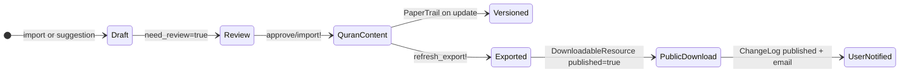

# Phase 3 — Sacred Data, Provenance and Integrity

> **Onboarding series:** progressive deep-dive for becoming a legitimate QUL contributor.  
> **Prerequisites:** [Phase 1](phase-01-what-is-qul.md), [Phase 2](phase-02-quranic-data-model.md)  
> **This file:** how QUL keeps Quranic resources attributable, joinable, and internally consistent.

---

## The engineering question

QUL manages Quranic and Quran-related data. The engineering question is not theological — it is practical:

> **How does QUL keep resources attributable, joinable, and internally consistent — and how do we know a change did not corrupt something downstream?**

This phase separates three concerns:

1. **Canonical identity** — what must not drift (ayah addresses, word positions)
2. **Editable content** — what translators, proofreaders, and importers change
3. **Governance layers** — drafts, approvals, versioning, permissions, integrity checks

---

## Canonical identity vs editable content

### Canonical identity (treat as infrastructure)

These fields define **where** content lives in the Quran hierarchy. Changing them is high-risk.

| Field | Model | Role |
|---|---|---|
| `chapter_number` / `chapter_id` | `Chapter`, `Verse`, `Word` | Which surah |
| `verse_number` | `Verse` | Which ayah within surah |
| `verse_key` | `Verse`, `Translation`, `Tafsir`, … | `"surah:ayah"` string address |
| `position` | `Word` | Word index within ayah |
| `location` | `Word`, `Morphology::Word` | `"surah:ayah:word"` string address |
| `verse_index` | `Verse` | Global ayah sequence (1–6236) |
| `word_index` / `sequence_number` | `Word` | Global word sequence (unique) |

**FACT:** Exporters key output by `verse_key` or `location`. Downstream apps join on these.

**INFERENCE:** If you change `verse_key` on a translation from `"2:255"` to `"2:256"`, the text silently moves to the wrong ayah in every export — with no runtime error.

### Editable content (normal editorial work)

These fields define **what** is said at a stable address:

| Field | Model | Examples |
|---|---|---|
| `text` | `Translation`, `Tafsir`, `WordTranslation` | Translated/commentary text |
| `text_*` columns | `Verse`, `Word` | Arabic script variants |
| `footnotes` / `FootNote.text` | `FootNote` | Scholarly notes |
| `segments` (jsonb) | `Audio::Segment` | Word/ayah timing data |
| `root_id`, `lemma_id`, `stem_id` | `Word` | Linguistic assignments |
| Morphology analysis fields | `Morphology::Word`, segments, tokens | Grammar metadata |

**FACT:** PaperTrail versions many of these content fields on update (see below).

### Semi-stable metadata (change with care)

| Field | Model | Notes |
|---|---|---|
| `resource_content_id` | All resource rows | Which package a row belongs to — moving rows between packages breaks attribution |
| `approved` | `ResourceContent`, `Audio::Recitation`, `Morphology::Phrase` | Publication gate |
| `start_verse_id` / `end_verse_id` | `Tafsir` | Defines ayah range coverage — wrong range = wrong commentary mapping |
| `meta_data` (jsonb) | `ResourceContent` | Source keys, text-type, footnote flags, import timestamps |

---

## Provenance: who, where, when

QUL tracks provenance at the **resource package** level (`ResourceContent`), not usually per ayah row.

### Author and translator attribution

**FACT:** `ResourceContent` belongs to:

```ruby
belongs_to :author, optional: true      # translators, scholars
belongs_to :language, optional: true
belongs_to :data_source, optional: true # where data was obtained
```

| Model | Table | Purpose |
|---|---|---|
| `Author` | `authors` (Quran DB) | Named scholar/translator; linked to many `ResourceContent` records |
| `DataSource` | `data_sources` (Quran DB) | External origin (e.g. QuranEnc, TafsirApp) |
| `Language` | `languages` (Quran DB) | Language of the resource |

**FACT:** `Translation` rows copy `language_name` and `language_id` from the parent resource at import/approval time.

### Source tracking in metadata

**FACT:** `ResourceContent` stores flexible provenance in `meta_data` jsonb. Examples found in code:

| Meta key | Set by | Meaning |
|---|---|---|
| `source` | Importers | e.g. `'quranenc'` |
| `quranenc-key` | QuranEnc importer | External source identifier |
| `tafsirapp-key` | TafsirApp importer | External source identifier |
| `draft-quranenc-import-version` | Import | Source version at import time |
| `draft-quranenc-import-timestamp` | Import | Source timestamp |
| `quranenc-imported-version` | Post-approval | Promoted to canonical meta after approval |
| `last-import-at` | `run_after_import_hooks` | When content was last imported |
| `has-footnote` | Import | Whether footnotes exist |
| `text-type` | Admin config | Which `text_*` column to export |
| `copyright` | Admin | Triggers restricted download on `DownloadableResource` |

**FACT:** After draft approval, `run_after_import_hooks` promotes draft import version metadata:

```ruby
set_meta_value('quranenc-imported-version', delete_meta_value('draft-quranenc-import-version'))
set_meta_value('last-import-at', Time.zone.now.strftime(...))
```

### Copyright and hosting permissions

**FACT:** `ResourcePermission` (CMS DB) tracks legal/hosting status per `ResourceContent`:

```ruby
enum :permission_to_host   # unknown, requested, granted, rejected
enum :permission_to_share  # unknown, requested, granted, rejected
# copyright_notice, source_info, contact_info
```

**FACT:** `DownloadableResource#restrict_download?` checks `meta_value('copyright')`. When set, the public resource page shows `copyright_notice` instead of download links (`app/views/resources/detail.html.erb`).

**INFERENCE:** Provenance for downstream users is partly in export files (keys, text) and partly on the resource detail page (description, copyright, change logs). Exports themselves are keyed by `verse_key` — author name is not embedded in every JSON row by default.

---

## Publication state machine

Content moves through several "publishedness" layers:



### Layer 1: Draft (CMS database)

Draft tables hold **proposed** changes before they touch published Quran content:

| Table | Model | Created by |
|---|---|---|
| `draft_translations` | `Draft::Translation` | Proofreading UI, importers |
| `draft_tafsirs` | `Draft::Tafsir` | Proofreading UI, importers |
| `draft_word_translations` | `Draft::WordTranslation` | Word translation UI |
| `draft_contents` | `Draft::Content` | Generic draft pipeline |
| `draft_foot_notes` | `Draft::FootNote` | Footnote edits |

**FACT:** Draft rows track review state:

| Field | Meaning |
|---|---|
| `current_text` | What is published now |
| `draft_text` | Proposed change |
| `text_matched` | Whether draft equals current (`true` = no real change) |
| `need_review` | Requires human review before import |
| `imported` | Whether draft has been applied to Quran content |
| `user_id` | Who suggested the change (proofreading flow) |

**FACT:** Community proofreading (`TranslationProofreadingsController`) does **not** overwrite published text directly. It calls `Translation#save_suggestions`, which creates a `Draft::Translation` with `need_review: true`.

### Layer 2: Approval → Quran content

**FACT:** `Draft::Translation#import!` writes to the Quran DB `translations` table:

1. Finds or initializes `Translation` for `verse_id` + `resource_content_id`
2. Copies `draft_text` → `text`
3. **Re-syncs identity fields** from the verse: `verse_key`, `chapter_id`, `verse_number`, juz/hizb/page metadata
4. Attributes the PaperTrail change to the submitting user
5. Marks draft `imported: true`

**FACT:** Import uses `save(validate: false)` — there are **no ActiveRecord validations** blocking the write on core content models.

**FACT:** Bulk approval runs via Sidekiq jobs (`DraftContent::ApproveDraftTranslationJob`, etc.). During bulk import, `PaperTrail.enabled = false` to avoid thousands of version rows.

### Layer 3: Resource approval

**FACT:** `ResourceContent#approved` boolean gates whether a resource is considered approved. Scope: `ResourceContent.approved`.

**FACT:** `Audio::Recitation` has its own `approved` flag. Cloned recitations start `approved: false`.

**FACT:** `Morphology::Phrase` has `approved` and `review_status` — only approved phrases appear in public mutashabihat previews.

### Layer 4: Public download publication

**FACT:** `DownloadableResource#published` controls visibility on `/resources`. Scope: `DownloadableResource.published`.

**FACT:** `ResourcesController#detail` only shows `.published` resources.

**FACT:** `refresh_export!` regenerates `DownloadableFile` attachments, then optionally emails users who previously downloaded the resource.

### Layer 5: Human-readable change announcements

**FACT:** `ChangeLog` (CMS DB) is a **curated changelog** for resource updates — not automatic PaperTrail:

```ruby
class ChangeLog < ApplicationRecord
  belongs_to :user
  belongs_to :resource_content
  validates :title, :text, :excerpt, presence: true
  scope :published, -> { where published: true }
end
```

Maintainers write these manually in Active Admin. When a resource is re-exported, `notify_users` attaches the most recent published `ChangeLog` to the update email.

---

## Versioning: PaperTrail

**FACT:** QUL uses the [PaperTrail](https://github.com/paper-trail-gem/paper_trail) gem. Versions are stored in the CMS database `versions` table:

```ruby
# db/schema.rb
create_table "versions" do |t|
  t.string "item_type"    # e.g. "Translation"
  t.integer "item_id"
  t.string "event"        # "update", "destroy"
  t.string "whodunnit"   # GlobalID of user
  t.text "object"        # YAML snapshot of previous state
  t.boolean "reviewed", default: false
  t.integer "reviewed_by_id"
  t.integer "user_id"
end
```

**FACT:** Models with PaperTrail (selected):

| Model | Events tracked |
|---|---|
| `Verse` | update, destroy |
| `Word` | update, destroy |
| `Translation` | update |
| `Tafsir` | update |
| `WordTranslation` | update |
| `FootNote` | update |
| `Chapter` | update |
| `ChapterInfo` | update |
| `Transliteration` | update |
| `ArabicTransliteration` | update |
| `MushafWord` | update |

**FACT:** Active Admin registers versions as **"Content Changes"** at `/cms/content_changes` with:
- View previous/next version
- **Revert** to a prior version (`resource.reify` + `save`)
- Mark version as reviewed/unreviewed

**FACT:** `PaperTrailAttribution` concern wraps writes to set `whodunnit`:

```ruby
PaperTrail.request(whodunnit: user.to_gid.to_s, controller_info: { user_id: user.id }) do
  yield
end
```

**INFERENCE:** PaperTrail tracks **content field changes** on individual rows. It does not replace the draft/review workflow — drafts live in separate tables until explicitly imported.

**UNKNOWN:** Whether PaperTrail versions for Quran DB models are stored in CMS `versions` table or a separate store — the `versions` table is in `db/schema.rb` (CMS DB), but versioned models use `QuranApiRecord`. This likely works because PaperTrail defaults to the application's primary database connection for the versions table. Verify in Phase 17 when running locally.

---

## Access control: who can change what

**FACT:** CanCanCan (`Ability` model) defines roles:

| Role | Data editing capabilities |
|---|---|
| `super_admin` | `can :manage, :all` |
| `admin` | Manage translations, tafsirs, drafts, recitations, resource content |
| `moderator` | Create/update drafts (not destroy); manage morphology phrases |
| `contributor` | Limited (inherits normal_user restrictions) |
| `normal_user` | Read most things; cannot access admin resources |
| `audio_annotator` | Special access to recitation resources |

**FACT:** Community editing tools use **project-based access** via `UserProject`:

```ruby
# application_controller.rb
access = current_user.user_projects.find_by(resource_content_id: resource.id)
access if access&.approved?
```

Contributors request access to a specific `ResourceContent`, provide motivation/language proficiency, and must be approved (`user_projects.approved = true`) before editing.

**FACT:** `TranslationProofreadingsController` requires authentication for edit/update and checks resource access.

**MUST UNDERSTAND NOW:** Unauthorized users can browse and download (with login for some files). Editing sacred content requires approved project access or admin role.

---

## Import pipeline integrity

External data enters through importers in `lib/importer/`, usually creating **drafts first**, not direct overwrites.

### Identity matching during import

**FACT:** QuranEnc translation importer (`lib/importer/quran_enc.rb`) matches external data to QUL verses by key:

```ruby
def verses_by_key
  @verses_by_key ||= Verse.all.index_by(&:verse_key)
end

# For each imported row:
verse = verses_by_key["#{data['sura']}:#{data['aya']}"]
```

**FACT:** If `verse` is nil (key not found), the import would fail at `verse.verse_key` — there is no silent fallback to a different ayah.

**FACT:** Importers log issues rather than silently continuing for some error classes:

```ruby
log_issue({ tag: 'missing-footnote-mapping', text: verse.verse_key })
log_issue({ tag: 'wrong-footnote-mapping', text: verse.verse_key })
```

**FACT:** Import issues create `AdminTodo` records for maintainer follow-up.

**FACT:** `Importer::Base#create_draft_tafsir` sets `text_matched` by comparing draft to existing published text — making unintended overwrites visible in review queues.

### Bulk import disables versioning

**FACT:** `DraftContent::ApproveDraftContentJob` sets `PaperTrail.enabled = false` during bulk import, then runs `run_after_import_hooks` which checks for missing records.

### Post-import validation hooks

**FACT:** `ResourceContent#run_after_import_hooks` after approval:

```ruby
update_records_count
set_meta_value('last-import-at', ...)
check_for_missing_translation  # expects exactly 6236 rows
check_for_missing_tafsirs      # expects coverage for every verse
```

**FACT:** `check_for_missing_translation`:

```ruby
if !(6236 - translations.size).zero?
  issues.push("#{6236 - translations.size} missing translation record...")
end
if (missing_text = translations.where(text: [nil, ''])).any?
  issues.push "#{missing_text.size} translation with missing text..."
end
```

These return issue arrays — they do not block the import, but issues are reported via `AdminTodo` comments.

---

## Data integrity tooling

Beyond import hooks, QUL has explicit integrity check tools.

### Admin Data Integrity Check page

**FACT:** `Tools::DataIntegrityChecks` (`app/models/tools/data_integrity_checks.rb`) provides ~25 checks runnable from Active Admin, including:

| Check | What it catches |
|---|---|
| `words_without_root` | Words missing root assignment |
| `words_without_lemma` | Words missing lemma |
| `words_without_stem` | Words missing stem |
| `words_with_missing_arabic_text` | Empty script columns |
| `ayah_with_missing_translations` | Gaps in translation coverage |
| `words_with_missing_translations` | Word-level translation gaps |
| `ayah_with_missing_tafsirs` | Tafsir coverage gaps |
| `compare_translations` | Discrepancies between translation editions |
| `duplicate_mushaf_words` | Duplicate layout entries |
| `mushaf_words_with_incorrect_position` | Layout position errors |
| `ayah_with_different_mushaf_page` | Same ayah on different pages across mushafs |
| `ayah_without_matching_ayahs` | Similar-ayah reference gaps |

**FACT:** These are **diagnostic queries**, not CI gates. They help maintainers find problems; they do not automatically block exports.

### Export key preservation

**FACT:** Translation exports use `verse_key` as the JSON object key:

```ruby
json_data[translation.verse_key] = translation_text_without_footnotes(translation)
```

**FACT:** Word script exports use `location` as key and include explicit `surah`, `ayah`, `word` fields.

**INFERENCE:** As long as `verse_key` and `location` are correct at export time, downstream join integrity is preserved. Export does not re-derive keys from foreign keys — it reads the denormalized string fields.

---

## How corruption propagates downstream

Understanding failure modes helps you know what to verify:

### Wrong `ayah_number` or `verse_key`

```text
Editor sets translation.verse_key = "2:256" (should be "2:255")
  → Export keys JSON as "2:256"
  → Downstream app joins translation to ayah 256
  → User sees wrong translation at wrong ayah
  → No error thrown; data looks structurally valid
```

**Mitigation:** Identity fields are re-synced from `verse` during `Draft::Translation#import!`. Direct admin edits to `verse_key` without going through import are the risk path.

### Wrong `word_position` or `location`

```text
Morphology attached to word position 5 instead of 4
  → Export includes root/POS at wrong word
  → Word-by-word app shows wrong grammar for that token
```

**Mitigation:** `location` is derived from `word.location` during exports; integrity checks catch missing roots/lemmas.

### Wrong `resource_content_id`

```text
Translation row assigned to wrong ResourceContent
  → Export for "Sahih International" includes another translator's text
  → Attribution broken; content may be correct Arabic/English but wrong source
```

**Mitigation:** Admin UI scopes by resource; exporters filter `where(resource_content_id: id)`.

### Missing rows (incomplete coverage)

```text
Translation resource has 6200 rows instead of 6236
  → run_after_import_hooks reports "36 missing translation record"
  → Downstream app gets nil for missing ayahs
```

**Mitigation:** `check_for_missing_translation` expects exactly 6236 rows.

### Stale export files

```text
Content updated in Quran DB but export not refreshed
  → Public download serves old JSON
  → Downstream users see outdated text despite CMS showing new content
```

**Mitigation:** `DownloadableResource#refresh_export!` must be run after content changes. Re-export is a manual/admin-triggered step (often via background job).

---

## Code contributions vs data contributions

QUL explicitly supports both paths. They differ in risk and review expectations.

| Aspect | Code contribution | Data contribution |
|---|---|---|
| **Mechanism** | Fork → branch → PR on GitHub | CMS editing, proofreading UI, import/approve jobs |
| **What changes** | Rails app, exporters, tooling, docs | Translations, tafsirs, audio segments, morphology |
| **Review** | PR code review by maintainers | Draft review, admin approval, project access gate |
| **Evidence needed** | Tests, lint, focused diff | Correct ayah/word mapping, UTF-8, coverage counts |
| **Risk** | App bugs, export format breaks | Wrong ayah attachment, corrupted sacred text |
| **Versioning** | Git history | PaperTrail + draft tables + ChangeLog |
| **Rollback** | `git revert` | PaperTrail revert in admin, or re-import from draft |

**FACT:** `contribute-data.md` says most data contribution happens through the CMS with review before publication to `/resources`.

**FACT:** Data contributions do not typically go through GitHub PRs for content rows — they go through the application's draft → approve → export pipeline.

**INFERENCE:** As a code contributor, you might build/fix the pipelines. As a data contributor, you work inside them. Do not commit Quran text changes as flat files in the repository unless explicitly part of an importer fixture or documented data contribution workflow.

---

## What is NOT validated (gaps to know)

**FACT:** Core content models (`Translation`, `Tafsir`, `Verse`, `Word`) have **no ActiveRecord validations** on text content or identity fields.

**FACT:** Imports and approvals frequently use `save(validate: false)`.

**FACT:** Integrity checks exist but are **opt-in diagnostics**, not automated CI gates on every change.

**FACT:** There is no automatic test that asserts every export row maps to the correct ayah — this would need to be part of your verification when changing exporters.

| CURRENT PROJECT REALITY | GOOD PRACTICE FOR YOUR CHANGES |
|---|---|
| Post-import hook counts (6236 ayahs) | Add targeted tests when changing export join logic |
| Admin integrity check tools | Run relevant checks after data changes |
| PaperTrail for manual revert | Document what you verified in PR description |
| Draft/review for community edits | Never bypass review for content changes |

---

## Integrity verification checklist (for future you)

When you change anything touching Quranic data, ask:

### Identity checks
- [ ] Does every row still have the correct `verse_key` or `location`?
- [ ] For translations: exactly 6236 rows per complete resource?
- [ ] For word resources: does `word_id` resolve to the expected `position`?

### Content checks
- [ ] UTF-8 preserved? Arabic text not corrupted?
- [ ] Sample 5–10 ayahs manually compared before/after?
- [ ] Footnotes still linked to correct IDs?

### Export checks
- [ ] Was `refresh_export!` run after content change?
- [ ] Do exported JSON keys match `verse_key` / `location`?
- [ ] SQLite row counts match expectations?

### Provenance checks
- [ ] `resource_content_id` unchanged for unaffected resources?
- [ ] `meta_data` source version updated if re-imported?
- [ ] `ChangeLog` written if users should know about the update?

---

## Classification for this phase

### MUST UNDERSTAND NOW

1. **Identity fields** (`verse_key`, `location`, `position`) are infrastructure. **Content fields** (`text`, `text_*`) are editorial.
2. **Draft → approve → import** is the normal content change path. Community edits do not overwrite published text directly.
3. **PaperTrail** versions content changes and supports revert in admin. Bulk imports disable it temporarily.
4. **`ResourceContent`** carries provenance: author, data source, `meta_data`, `approved`.
5. **`DownloadableResource.published`** gates public downloads. Content can exist in DB without being publicly exported.
6. **Imports match by `verse_key`** — external `sura:aya` → `Verse.verse_key`. No validations on core models; integrity checks are separate tools.
7. **Wrong identifiers propagate silently** into exports. A passing HTTP response is not enough to prove data integrity.

### USEFUL LATER

- `ResourcePermission` copyright/hosting enums
- `ChangeLog` as user-facing update announcements
- `AdminTodo` for import issue tracking
- `Morphology::Phrase#approved` workflow
- `UserProject` contributor access request flow
- `Audio::ChangeLog` for recitation update history
- `Tools::TajweedRulesCheck` (separate from data integrity checks)

### IGNORE FOR NOW

- `LogEntry` (analytics, not content governance)
- `ProofReadComment` (comments on resources, secondary to draft workflow)
- `Contributor` model (website credits page, not per-resource attribution)
- `RawData::*` staging models
- Individual importer parser implementations (Phase 10)

---

## Uncertainties

| Item | Status |
|---|---|
| Which PaperTrail DB stores versions for QuranApiRecord models | **UNKNOWN** — verify locally in Phase 17 |
| Whether `approved` on `ResourceContent` blocks export or only filters scopes | **PARTIALLY KNOWN** — `ExportDbForSemanticSearchJob` filters `approved`; not all exporters may |
| Full list of `meta_data` keys per resource type | **UNKNOWN** — inspect records per sub_type |
| Whether community proofreading suggestions auto-notify reviewers | **UNKNOWN** — likely manual review in admin |
| CI data integrity gates | **FACT: none found** — checks are admin tools only |

---

## What we investigate next

**Phase 4 — Rails for a React/Node Engineer**

Now that you understand the data and its governance, we map QUL's Rails usage to concepts you already know: routes, controllers, Active Record, Active Admin, Sidekiq, etc. — only what is actually present in this codebase.

---

## Phase 3 summary — five things to remember

1. **Identity is infrastructure; content is editorial.** Protect `verse_key`, `location`, and `position` above all.
2. **Changes flow draft → review → import → export → publish.** Community suggestions do not directly overwrite published Quran content.
3. **Provenance lives on `ResourceContent`** — author, data source, `meta_data`, permissions — not on every ayah row.
4. **PaperTrail + integrity check tools** are the safety net — not ActiveRecord validations (those are largely absent on content models).
5. **Wrong joins propagate silently to exports.** Verify identifiers and sample data; do not trust a successful save alone.

---

*Generated during QUL contributor onboarding. Phase 3 of ~24. Read-only investigation — no code modified.*
