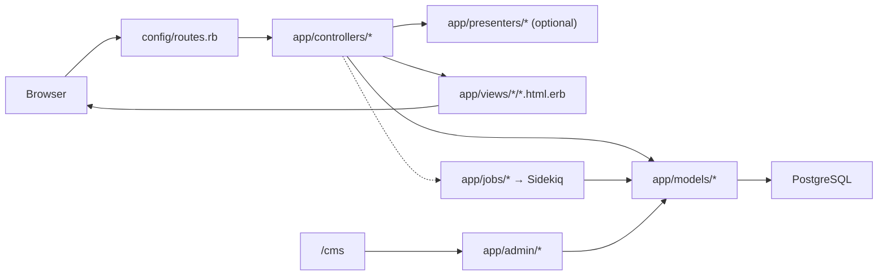

# Phase 4 — Rails for a React/Node Engineer

> **Onboarding series:** progressive deep-dive for becoming a legitimate QUL contributor.  
> **Prerequisites:** [Phase 1](phase-01-what-is-qul.md), [Phase 2](phase-02-quranic-data-model.md), [Phase 3](phase-03-provenance-and-integrity.md)  
> **This file:** minimum Rails vocabulary to read QUL — only concepts actually present in this codebase.

---

## What you are learning

You do not need to become a Rails expert. You need enough vocabulary to:

1. Open a URL and find the controller action
2. Follow a controller → presenter/model → view path
3. Recognize where business logic lives (`lib/` vs `app/services/` vs models)
4. Understand Active Admin as a parallel admin UI layer
5. Know when work runs in Sidekiq instead of the request cycle

This phase maps unfamiliar Rails pieces to things you already know from Express, React, and Firebase.

---

## QUL's Rails stack (verified)

| Piece | Version / gem | Role in QUL |
|---|---|---|
| Ruby | `>= 3.3.3` (`.ruby-version`) | Runtime |
| Rails | `~> 8.0` | Web framework |
| PostgreSQL | `pg` gem | Two databases (CMS + Quran content) |
| Redis | `redis` gem | Sidekiq queue backend |
| Puma | app server | Like Node's HTTP process |
| Devise | `4.9.4` | User authentication |
| CanCanCan | `cancancan` | Authorization rules |
| Active Admin | `~> 3.2` | Auto-generated CMS UI at `/cms` |
| PaperTrail | `>= 15.0` | Content change versioning |
| Sidekiq | `~> 7.2` | Background jobs |
| Turbo | `@hotwired/turbo-rails` | Partial page updates without full reload |
| Stimulus | `@hotwired/stimulus` | Lightweight JS controllers |
| Vue 3 | `vue` + esbuild plugin | Two isolated apps (segments, SVG tools) |
| jQuery | `3.7.1` | Legacy interactions, Active Admin |
| esbuild | JS bundler | Replaces Webpack for this project |
| Tailwind + Sass | CSS | Styling |
| Pagy | pagination | Like cursor/limit pagination helpers |
| Sentry | error tracking | Production monitoring |

**NOT present as primary patterns:** React, Next.js, GraphQL, ActionCable (real-time), bcrypt (Devise handles passwords internally).

---

## Request flow: the one diagram to remember



**Node analogy:**

```text
Express route          →  Rails route (config/routes.rb)
Route handler          →  Controller action
Mongoose/Firestore model →  Active Record model
DTO/serializer layer   →  Presenter (QUL uses these heavily)
EJS/Handlebars template →  ERB view (.html.erb)
Bull/BullMQ worker     →  Sidekiq job
Admin dashboard gem    →  Active Admin (no React equivalent — it's server-rendered CRUD)
```

---

## Routes (`config/routes.rb`)

**FACT:** All HTTP entry points are declared in one file. QUL has ~260 lines of routes covering:

| Route group | Example | Purpose |
|---|---|---|
| Public site | `root`, `/docs`, `/resources` | Landing, docs, downloads |
| Ayah pages | `/ayah/:key`, `/ayah/:key/translations` | Per-ayah resource views |
| Contributor tools | `/translation_proofreadings`, `/mushaf_layouts` | Content editing UIs |
| API v1 | `/api/v1/chapters`, `/api/v1/translations/for_ayah/:ayah_key` | Partial JSON API |
| Auth | `devise_for :users` | Login, registration, password reset |
| Admin | `ActiveAdmin.routes(self)` | Everything under `/cms` |
| Background ops | `mount Sidekiq::Web => '/sidekiq'` | Job monitor (admin only) |

**Rails convention:** `resources :translation_proofreadings` generates RESTful routes (`index`, `show`, `edit`, `update`, …). You will see both RESTful `resources` and explicit `get`/`post` routes.

**Example — ayah sub-resources:**

```ruby
get '/ayah/:key', to: 'ayah#show'
get '/ayah/:key/translations', to: 'ayah#translations'
```

This is like:

```javascript
// Express equivalent (conceptual)
app.get('/ayah/:key/translations', ayahController.translations)
```

`:key` becomes `params[:key]` in the controller (e.g. `"2:255"`).

**FACT:** Old `/admin` URLs redirect to `/cms` (301).

---

## Controllers (`app/controllers/`)

Controllers are request handlers. QUL has several families:

| Controller family | Base class | Examples |
|---|---|---|
| Public HTML | `ApplicationController` | `AyahController`, `ResourcesController`, `CommunityController` |
| JSON API | `ActionController::API` | `Api::V1::ApiController` and children |
| Devise overrides | `Devise::*` | `Users::SessionsController`, `Users::RegistrationsController` |
| Active Admin | Generated by gem | One per `app/admin/*.rb` registration |

### ApplicationController — what every HTML controller inherits

**FACT** — key behaviors from `app/controllers/application_controller.rb`:

```ruby
class ApplicationController < ActionController::Base
  include Pagy::Backend                    # pagination
  protect_from_forgery with: :exception    # CSRF tokens (like session-based CSRF middleware)
  before_action :set_paper_trail_whodunnit  # audit who made changes
  before_action :init_presenter            # sets @presenter

  rescue_from ActiveRecord::RecordNotFound, with: ->(e) { render_error 404, e }

  def can_manage?(resource)  # project-based edit access check
end
```

**Node comparison:** `ApplicationController` is your global Express middleware + base router class. `before_action` is middleware that runs before the action method. `protect_from_forgery` is CSRF protection — forms include a hidden token.

### Thin controller pattern

QUL controllers are often thin — they delegate to presenters:

```ruby
# app/controllers/ayah_controller.rb
class AyahController < ApplicationController
  def translations
    render partial: 'ayah/translations', layout: false
  end

  protected
  def init_presenter
    @presenter = AyahPresenter.new(self)
    @ayah = @presenter.ayah
    head :not_found unless @presenter.found?
  end
end
```

**Algorithm:**
1. `init_presenter` runs (via `before_action` in parent)
2. `AyahPresenter` looks up `Verse.find_by(verse_key: params[:key])`
3. Action renders a partial ERB template with `@presenter` available

**FACT:** Many ayah actions render **partials** with `layout: false` — designed for Turbo Frame injection (swap one panel without reloading the page).

### API controllers

**FACT:** `Api::V1::ApiController` inherits `ActionController::API` (no CSRF, no views):

```ruby
module Api::V1
  class ApiController < ActionController::API
    before_action :init_presenter
    before_action :set_cache_headers  # Cache-Control in production

    rescue_from ActiveRecord::RecordNotFound, with: :record_not_found
  end
end
```

**Node comparison:** This is a plain JSON Express router — no HTML, no CSRF, returns `render json:`.

---

## Presenters (`app/presenters/`) — QUL-specific pattern

**FACT:** QUL uses **44 presenter classes**. This is not universal Rails — it is a QUL convention.

Presenters sit between controllers and views:

```ruby
class AyahPresenter < ApplicationPresenter
  def ayah
    @ayah ||= Verse.find_by(verse_key: params[:key])
  end

  def translation_ids
    ids = params[:translation_ids]
    ids = [131] if ids.blank?  # default translation
    Array(ids).map(&:to_i).uniq
  end
end
```

**Node comparison:** Think of a presenter as a **per-request view model** — like a React container's data-fetching hook results, or a serializer that also knows about `params` and pagination. It keeps ERB templates dumb and controllers thin.

**When you see `@presenter` in a view**, look in `app/presenters/` for the query and formatting logic.

---

## Models and Active Record (`app/models/`)

### What Active Record is (beyond a TypeScript interface)

An Active Record model is **not** just a type definition. Each model class combines:

| Capability | Node/Firestore analogy |
|---|---|
| Table mapping | Mongoose schema / Firestore collection path |
| Query builder | Chainable SQL query (`Translation.where(...)`) |
| Associations | SQL joins declared as methods (`has_many :foot_notes`) |
| Callbacks | `onWrite` triggers (before_save, after_update, …) |
| Validations | Input schema validation (sparse in QUL content models) |
| Scopes | Reusable query fragments (`scope :approved, -> { where approved: true }`) |

### Two base classes — critical QUL convention

```ruby
# CMS database (users, drafts, downloads, versions)
class ApplicationRecord < ActiveRecord::Base
  self.abstract_class = true
end

# Quran content database (verses, words, translations, …)
class QuranApiRecord < ApplicationRecord
  self.abstract_class = true
  self.establish_connection Rails.env.development? ? :quran_api_db_dev : :quran_api_db
end
```

**FACT:** `Chapter`, `Verse`, `Word`, `Translation` → `QuranApiRecord`  
**FACT:** `User`, `DownloadableResource`, `Draft::Translation`, `ChangeLog` → `ApplicationRecord`

**Node comparison:** Like having two Firestore databases or two Prisma clients — models silently connect to different PostgreSQL databases. You cannot assume `belongs_to` works across databases.

### Concerns (`app/models/concerns/`) — shared model mixins

**FACT:** 8 concerns, including:

| Concern | What it adds |
|---|---|
| `Resourceable` | `belongs_to :resource_content` + helper methods |
| `HasMetaData` | `meta_value('key')`, `set_meta_value` on jsonb |
| `PaperTrailAttribution` | Wraps writes to set audit user |
| `StripWhitespaces` | Normalizes text fields before save |
| `Slugable` | URL slug generation |
| `NavigationSearchable` | Search index hooks |

**Node comparison:** TypeScript mixins or composable utility modules included into model classes.

```ruby
module Resourceable
  extend ActiveSupport::Concern
  included do
    belongs_to :resource_content, optional: true
  end
end
```

---

## Where business logic lives: `lib/` vs `app/services/`

This is important for QUL. Logic is split across two locations:

| Location | Size | What lives here |
|---|---|---|
| `lib/` | ~122 Ruby files | **Bulk of domain logic:** importers, exporters, audio processing, morphology utilities, text sanitizers |
| `app/services/` | ~26 files | **Newer focused services:** search, docs rendering, morphology graph editing, audio validation |
| `app/models/` | ~147 files | Data access, associations, some domain methods |
| `app/jobs/` | ~30 files | Async wrappers that call `lib/` or `app/services/` |

**FACT:** Exporters live in `lib/exporter/` (not `app/services/`).  
**FACT:** Importers live in `lib/importer/`.  
**FACT:** Jobs like `DraftContent::ApproveDraftTranslationJob` orchestrate imports but delegate to model/service code.

**Rule of thumb when exploring:**

```text
Need to understand export format?     → lib/exporter/
Need to understand external import?   → lib/importer/
Need to understand search?            → app/services/search/
Need to understand HTTP response shape? → app/presenters/
Need to understand admin CRUD?        → app/admin/
```

**Node comparison:** `lib/` is like a `src/lib/` or `packages/core/` folder of plain Ruby modules. `app/services/` is closer to your service layer in a NestJS/Express app.

---

## Views and helpers

### ERB views (`app/views/`)

**FACT:** QUL renders HTML server-side using ERB templates (embedded Ruby):

```erb
<!-- app/views/ayah/_translations.html.erb (conceptual) -->
<% @presenter.translations.each do |t| %>
  <div><%= t.text %></div>
<% end %>
```

Partials start with `_` and are rendered via `render partial: 'ayah/translations'`.

**Node comparison:** ERB is like EJS — Ruby embedded in HTML. No JSX. The server sends HTML; Turbo may swap fragments.

### Turbo Frames and Streams

**FACT:** Many views use `turbo_frame_tag` and `.turbo_stream.erb` templates for partial updates.

**Node comparison:** Like fetching an HTML fragment from an API and swapping a `div` — except Turbo handles it with conventions (`data-turbo-frame`, `turbo_stream` responses) instead of you writing `fetch` + `innerHTML`.

Example flow:
1. User clicks ayah tab
2. Turbo requests `/ayah/2:255/translations`
3. Controller renders partial
4. Turbo replaces the frame content — no full page reload

### Helpers (`app/helpers/`)

19 helper modules with view formatting utilities (`seo_helper`, `quran_script_helper`, `tajweed_helper`, …).

**Node comparison:** Pure functions imported into templates — like formatters you would put in a `utils/` folder and call from EJS.

---

## Active Admin (`app/admin/`) — the CMS layer

**FACT:** Active Admin is a gem that **generates a full admin CRUD UI** from Ruby configuration files. QUL has **113 admin registration files**.

**FACT:** Mounted at `/cms` (namespace `:cms`).

**FACT:** Uses CanCanCan for authorization (`config.authorization_adapter = ActiveAdmin::CanCanAdapter`).

### What Active Admin generates vs what QUL writes

| Active Admin provides | QUL customizes |
|---|---|
| Index tables with filters | Custom columns, searchable selects, scopes |
| Show/detail pages | Version diffs, export preview modals |
| Edit forms | Nested footnotes, custom actions |
| Batch actions | Import, export, approve triggers |
| Menu structure | `menu parent: 'Content'` groupings |

**Example registration:**

```ruby
# app/admin/content/translation.rb
ActiveAdmin.register Translation do
  menu parent: 'Content'
  actions :all, except: [:destroy, :new, :create]

  filter :text
  filter :resource_content, as: :searchable_select, ajax: { resource: ResourceContent }

  index do
    column :verse_id do |r|
      link_to r.verse_key, cms_verse_path(r.verse_id)
    end
    column :text do |r|
      r.text.first(100)
    end
  end
end
```

**Node comparison:** Imagine if you wrote zero React admin pages, and instead declared `admin.resource('Translation', { filters: [...], columns: [...] })` and got a full CRUD UI. That is Active Admin. It is **not** a separate frontend app — it is server-rendered HTML with its own jQuery-based JS (`app/javascript/active_admin.js`).

**When editing content as an admin**, you are usually in Active Admin, not the public contributor tools.

---

## Authentication: Devise

**FACT:** `devise_for :users` with custom controllers for registration and sessions.

**FACT:** `User` model includes:

```ruby
devise :database_authenticatable, :registerable, :lockable,
       :rememberable, :trackable, :validatable, :recoverable, :confirmable
```

**Node comparison:** Devise is like NextAuth + user model + email confirmation + password reset, packaged as a gem. It provides:

- `current_user` in controllers (like `req.user` after auth middleware)
- `authenticate_user!` before_action (like `requireAuth` middleware)
- `user_signed_in?` helper in views

**FACT:** Users have roles via enum: `normal_user`, `admin`, `super_admin`, `moderator`, `contributor`, `audio_annotator`.

---

## Authorization: CanCanCan

**FACT:** `Ability` class in `app/models/ability.rb` defines permissions:

```ruby
class Ability
  include CanCan::Ability
  def initialize(user)
    can :read, :all
    if user.is_admin?
      can :manage, Translation
      can :manage, Draft::Translation
      # ...
    end
    can :manage, :all if user.super_admin?
  end
end
```

**Node comparison:** Like a centralized RBAC policy file. Controllers call `authorize! :update, @resource`. Active Admin calls it automatically.

**FACT:** Community editing uses a **second access layer** — `UserProject` (approved project assignment per `ResourceContent`), checked via `can_manage?(resource)` in `ApplicationController`.

---

## Background jobs: Sidekiq

**FACT:** `ActiveJob` adapter is Sidekiq. Redis backs the queue.

**FACT:** Sidekiq Web UI at `/sidekiq` — only for super_admin and admin users.

**FACT:** Scheduled jobs in `config/sidekiq_scheduler.yml`:

```yaml
daily_backup:
  class: BackupJob
  cron: "0 10 * * *"

quran_enc_update_checker:
  class: DraftContent::CheckContentChangesJob
  cron: "0 6 * * 0"
```

**Node comparison:**

| Sidekiq | Node equivalent |
|---|---|
| `SomeJob.perform_later(args)` | `queue.add('jobName', payload)` |
| `SomeJob.perform_now(args)` | Run synchronously (like awaiting a Cloud Function inline) |
| Sidekiq worker process | Bull/BullMQ worker or Firebase task queue consumer |
| Redis | Redis / Cloud Tasks backend |
| `sidekiq_options retry: 1` | Job retry config |

**FACT:** QUL job categories:

| Category | Examples |
|---|---|
| Draft approval | `DraftContent::ApproveDraftTranslationJob` |
| Export | `Export::TranslationJob`, `ExportMiniDumpJob` |
| Audio | `Audio::SplitGaplessRecitationJob`, `Audio::ExportAudioSegmentsJob` |
| Import | `DraftContent::ImportDraftContentJob` |
| Maintenance | `BackupJob`, `Recurring::UpdateApiStatsJob` |

Jobs are thin orchestrators — heavy work is in `lib/` classes.

---

## Migrations and schema

**FACT:** `db/migrate/` has ~105 migrations — all for the **CMS database**.

**FACT:** `db/schema.rb` reflects only the CMS database.

**FACT:** Quran content tables are **not** managed by Rails migrations in this repo. They come from the `mini_quran_dev.sql` dump (see `project-setup.md`).

**Node comparison:** Like having one database managed by Prisma migrations and another restored from a production snapshot. Running `bin/rails db:migrate` does not create `verses` or `words` tables.

**When you add a CMS feature** (new draft field, new download metadata): write a migration.  
**When Quran content schema changes:** that is a separate, high-risk process outside normal contributor work.

---

## Frontend in this Rails app

QUL is **not** a single frontend architecture. It is layered by era:

| Layer | Technology | Where |
|---|---|---|
| Server HTML | ERB + Tailwind | Most public pages, contributor tools |
| Partial updates | Turbo Frames/Streams | Ayah viewer, mushaf editor, resource search |
| Micro-interactions | Stimulus (~70 controllers) | `app/javascript/controllers/` |
| Legacy DOM | jQuery + jQuery UI | Active Admin, some older tools |
| Isolated SPAs | Vue 3 (2 apps) | `app/javascript/segments/`, `app/javascript/svg/` |
| Rich text | Trix + ActionText | Admin content editing |

### Stimulus

**FACT:** Stimulus controllers auto-register from `app/javascript/controllers/index.js`:

```javascript
import controllers from "./**/*_controller.js"
controllers.forEach((controller) => {
  application.register(controller.name, controller.module.default)
})
```

**Node comparison:** Stimulus is like small React hooks attached to DOM elements via `data-controller="ayah-jump"` attributes — no virtual DOM, no build-time component tree. Good for toggles, modals, AJAX loads.

### Vue

**FACT:** Only two Vue entry points in `esbuild.config.js`:

```javascript
const entryPoints = [
  "application.js",
  "active_admin.js",
  "segments/index.js",  // Vue app
  "svg/index.js"        // Vue app
]
```

**Do not assume Vue is the default.** Most of QUL is ERB + Stimulus.

### Asset pipeline

**FACT:** `bin/dev` runs Foreman with `Procfile.dev`:

```text
web:      bin/rails server -p 3000
js:       yarn build --reload
tailwind: bin/rails tailwindcss:watch
```

**FACT:** JS bundled by esbuild → `app/assets/builds/`. CSS by Sass + Tailwind.

**Node comparison:** Like running `next dev` + a CSS watcher concurrently — Foreman orchestrates multiple processes.

---

## PaperTrail (versioning)

Already covered in Phase 3, but from a Rails perspective:

```ruby
# On model
has_paper_trail on: :update, ignore: [:created_at, :updated_at]

# In controller
before_action :set_paper_trail_whodunnit  # sets current_user as whodunnit

# Admin UI
ActiveAdmin.register PaperTrail::Version, as: 'ContentChanges'
```

**Node comparison:** Like an automatic audit log middleware that snapshots the previous row before each update — stored in `versions` table, viewable/revertible in admin.

---

## How to read an unfamiliar feature (algorithm)

When you encounter a URL or issue:

```text
1. config/routes.rb
   → find route → controller#action

2. app/controllers/<controller>.rb
   → read action method
   → note before_actions (auth, presenter init)

3. app/presenters/<presenter>.rb (if @presenter is used)
   → find queries and data shaping

4. app/models/<model>.rb OR lib/<relevant>.rb
   → follow Active Record queries or service calls

5. app/views/<controller>/<action>.html.erb
   → see what HTML is rendered
   → check for turbo_frame_tag, data-controller (Stimulus)

6. If async: app/jobs/ → lib/ or app/services/
7. If admin: app/admin/ → model directly
```

**Example:** `/ayah/2:255/translations`

```text
routes.rb        → ayah#translations
AyahController   → render partial (no layout)
AyahPresenter    → Verse.find_by(verse_key: "2:255"), load translations
Verse model      → has_many :translations (Quran DB)
_ translations.html.erb → renders translation list, maybe turbo frame
```

---

## Ruby syntax quick reference (only what blocks reading)

| Ruby | Meaning | JS equivalent |
|---|---|---|
| `def foo; end` | Method definition | `function foo() {}` |
| `params[:key]` | Request parameters | `req.params.key` |
| `@ivar` | Instance variable | `this.ivar` |
| `Model.where(x: 1)` | Query | `db.collection.where('x', '==', 1)` |
| `Model.find(id)` | Find by PK (raises if missing) | `doc(id).get()` |
| `Model.find_by(key: val)` | Find or nil | `where().limit(1)` |
| `&.` | Safe navigation | `?.` optional chaining |
| `\|\|` | Or / default | `\|\|` |
| `-> { }` | Lambda | `() => {}` |
| `include MyConcern` | Mixin | Mixin / `Object.assign` |
| `:symbol` | Immutable symbol | string literal (but interned) |
| `%i[update destroy]` | Symbol array | `['update', 'destroy']` |
| `unless` | Negative if | `if (!x)` |
| `render partial:` | Return HTML fragment | `res.render('partial')` |
| `before_action` | Pre-handler hook | Express middleware |

You do not need to write idiomatic Ruby yet. You need to read it.

---

## Classification for this phase

### MUST UNDERSTAND NOW

1. **Route → controller → presenter → model → view** is the default read path.
2. **Two model base classes** (`ApplicationRecord` vs `QuranApiRecord`) = two databases.
3. **Active Admin at `/cms`** is a parallel admin UI — not React, not the public site.
4. **Business logic is mostly in `lib/`** — importers, exporters, audio, morphology utilities.
5. **Sidekiq** runs exports, imports, backups — not the web request.
6. **Presenters** are QUL's view-model layer — check them when `@presenter` appears.
7. **Frontend is mixed** — ERB + Turbo + Stimulus default; Vue only in segments/SVG tools.

### USEFUL LATER

- CanCanCan `Ability` rules per role
- Devise customization (`Users::SessionsController`)
- Active Admin custom actions and batch operations
- Turbo Stream response format
- `app/helpers/` for view formatting
- esbuild entry points and `--reload` live refresh
- API presenter namespace (`app/presenters/v1/`)
- Concerns (`Resourceable`, `HasMetaData`)

### IGNORE FOR NOW

- ActionText/Trix internals
- Chartkick/Groupdate analytics
- Sentry configuration
- Custom ActiveAdmin input classes (`lib/active_admin/`)
- Ransack search internals (used by Active Admin filters)
- Pagy pagination configuration
- Rails 8 framework changelog features unrelated to QUL

---

## Uncertainties

| Item | Status |
|---|---|
| Whether all jobs use Sidekiq or some run inline | **PARTIALLY KNOWN** — adapter is Sidekiq; some jobs call `perform_now` synchronously |
| How Turbo is configured globally | **UNKNOWN** — used per-view; no global config inspected |
| Whether API v1 is considered stable | **UNKNOWN** — docs say "coming soon" but routes exist (Phase 1) |

---

## What we investigate next

**Phase 5 — The Two-Database Architecture**

We go deep on:
- Exactly which tables live in which database
- How `establish_connection` works
- Cross-database reference patterns and their constraints
- Mermaid boundary diagram
- What this means for associations, transactions, and testing

---

## Phase 4 summary — five things to remember

1. **Route → controller → presenter → model → view** — start every investigation there.
2. **`lib/` holds most domain logic** (importers, exporters) — not just models.
3. **Active Admin is the CMS** at `/cms` — separate from public ERB pages.
4. **Two databases** via `ApplicationRecord` vs `QuranApiRecord` — always check which base class.
5. **Frontend is multi-generation** — ERB + Turbo + Stimulus first; Vue only in two tools.

---

*Generated during QUL contributor onboarding. Phase 4 of ~24. Read-only investigation — no code modified.*
