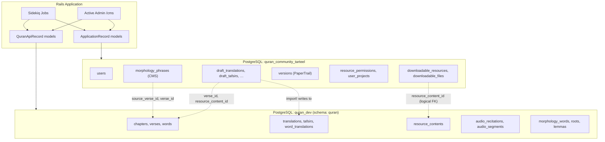

# Phase 5 — The Two-Database Architecture

> **Onboarding series:** progressive deep-dive for becoming a legitimate QUL contributor.  
> **Prerequisites:** [Phases 1–4](phase-01-what-is-qul.md)  
> **This file:** how QUL splits CMS state from Quran content, and what that constrains.

---

## The core mental model

QUL is **one Rails application** talking to **two PostgreSQL databases** (plus an optional third SQLite store for segment tooling).

```text
┌─────────────────────────────────────────────────────────────────┐
│                     Rails application (QUL)                        │
├────────────────────────────┬────────────────────────────────────┤
│   ApplicationRecord        │   QuranApiRecord                    │
│   (default connection)     │   (establish_connection override)   │
├────────────────────────────┼────────────────────────────────────┤
│  CMS database              │  Quran content database             │
│  quran_community_tarteel   │  quran_dev (development)            │
│  (production: CMS_DB_*)    │  (production: QURAN_API_DB_*)       │
├────────────────────────────┼────────────────────────────────────┤
│  Users, drafts, downloads  │  Verses, words, translations        │
│  versions, permissions     │  tafsirs, audio, morphology, …      │
│  Managed by migrations     │  Loaded from SQL dump (dev)         │
│  schema in db/schema.rb    │  NOT in db/schema.rb                │
└────────────────────────────┴────────────────────────────────────┘
```

**MUST UNDERSTAND NOW:** An Active Record model is **not** automatically “the database.” In QUL, the base class determines which PostgreSQL database (and sometimes which schema) you hit.

---

## Configuration (`config/database.yml`)

**FACT** — four named connections:

| Config key | Database name (dev) | Used by |
|---|---|---|
| `development` | `quran_community_tarteel` | Default — `ApplicationRecord` |
| `test` | `quran_community_cms_test` | Test suite CMS tables |
| `quran_api_db_dev` | `quran_dev` | `QuranApiRecord` in development/test |
| `quran_api_db` | `ENV['QURAN_API_DB_NAME']` | `QuranApiRecord` in production |

**FACT** — Quran connection sets PostgreSQL schema search path:

```yaml
quran_api_db_dev:
  database: quran_dev
  schema_search_path: quran,"$user",public
```

**INFERENCE:** Quran tables live primarily in the PostgreSQL **`quran` schema** inside the `quran_dev` database — not in `public`. Code references like `quran.text`, `quran.image` (seen in `ExportMiniDumpJob`) confirm schema-qualified objects exist.

**FACT** — Docker init creates both databases and the `quran` schema:

```bash
# docker/dev/init-db.sh
CREATE DATABASE quran_dev;
CREATE SCHEMA IF NOT EXISTS quran;  -- inside quran_dev
```

**FACT** — `bin/setup` runs:

```bash
bin/rails db:create:all   # creates BOTH databases
bin/rails db:prepare      # migrates CMS only (schema.rb)
```

The Quran database is created empty. You must load the dump separately (Phase 17).

---

## How Rails chooses a connection

### Default: `ApplicationRecord`

```ruby
# app/models/application_record.rb
class ApplicationRecord < ActiveRecord::Base
  self.abstract_class = true
end
```

Any model inheriting directly from `ApplicationRecord` uses the **CMS database** (`development` / `production` config).

### Override: `QuranApiRecord`

```ruby
# app/models/quran_api_record.rb
class QuranApiRecord < ApplicationRecord
  self.abstract_class = true
  self.establish_connection Rails.env.development? ? :quran_api_db_dev : :quran_api_db
end
```

**Node comparison:** Like having two Prisma clients or two Firestore apps in one codebase. `QuranApiRecord` children always query the Quran DB connection pool.

**FACT:** `QuranApiRecord` still inherits from `ApplicationRecord` (which inherits `ActiveRecord::Base`) — but `establish_connection` on the class redirects all queries for that hierarchy.

---

## What lives in each database

### CMS database (`quran_community_tarteel`)

**FACT:** All tables in `db/schema.rb` (~40 tables). Grouped by purpose:

| Category | Tables | Purpose |
|---|---|---|
| **Auth & users** | `users`, `admin_users` | Devise accounts, roles |
| **Publication layer** | `downloadable_resources`, `downloadable_files`, `downloadable_resource_tags`, `downloadable_related_resources`, `user_downloads` | Public `/resources` catalog and file attachments |
| **Draft / review** | `draft_translations`, `draft_tafsirs`, `draft_word_translations`, `draft_foot_notes`, `draft_contents` | Proposed edits before import to Quran DB |
| **Versioning** | `versions` | PaperTrail audit snapshots |
| **Permissions** | `resource_permissions`, `user_projects` | Hosting rights, contributor project access |
| **Change communication** | `change_logs`, `admin_todos`, `proof_read_comments` | Curated update notes, maintainer todos |
| **CMS-only morphology** | `morphology_phrases`, `morphology_phrase_verses`, `morphology_matching_verses` | Mutashabihat/similar-ayah phrase work (stores `verse_id` references) |
| **Layout tooling (CMS)** | `mushaf_line_alignments`, `pause_marks` | Mushaf line editing metadata |
| **Pipeline state** | `segment_pipeline_runs`, `segments_databases` | Audio segment pipeline job tracking |
| **Staging** | `raw_data_resources`, `raw_data_ayah_records` | Import staging |
| **Community** | `contributors`, `faqs`, `feedbacks`, `contact_messages`, `synonyms`, `word_synonyms` | Website content |
| **Cross-ref content (CMS-hosted)** | `uloom_contents`, `important_notes`, `word_tajweed_positions` | Store `verse_id`/`word_id` integers pointing into Quran DB |
| **Rails infra** | `active_storage_*`, `action_text_rich_texts`, `active_admin_comments` | File uploads, rich text, admin comments |
| **Misc** | `database_backups`, `quran_table_details`, `qr_sync_histories`, `log_entries` | Ops and metadata |

**FACT:** CMS migrations live in `db/migrate/` (~105 files). `db:prepare` / `db:migrate` only affects this database.

### Quran content database (`quran_dev`)

**FACT:** Not represented in `db/schema.rb`. Populated via `mini_quran_dev.sql` dump in development.

**FACT:** Models using `QuranApiRecord` (~90+ model classes). Major table families (from model schema annotations):

| Family | Example models | Content |
|---|---|---|
| **Spine** | `Chapter`, `Verse`, `Word` | Surah/ayah/word hierarchy |
| **Resources** | `ResourceContent`, `Translation`, `Tafsir`, `WordTranslation`, `Transliteration`, `ChapterInfo` | All publishable content packages |
| **Arabic script** | `QuranScript::ByVerse`, `QuranScript::ByWord` | Per-resource script exports |
| **Linguistics** | `Root`, `Lemma`, `Stem`, `Morphology::Word`, `Morphology::WordSegment`, `Token` | Grammar and morphology |
| **Audio** | `Audio::Recitation`, `Audio::ChapterAudioFile`, `Audio::Segment`, `Recitation`, `Reciter` | Recitations and timings |
| **Layout (content)** | `Mushaf`, `MushafPage`, `MushafWord` | Page/word layout tied to canonical words |
| **Topics/themes** | `Topic`, `VerseTopic`, `AyahTheme`, `RelatedTopic` | Thematic tagging |
| **Reference data** | `Language`, `Author`, `DataSource`, `CharType`, `Juz`, `Hizb`, `Ruku`, `Manzil` | Metadata and navigation |
| **Provenance** | `FootNote`, `Book`, `MediaContent` | Scholarly metadata |
| **Graphs** | `Morphology::DependencyGraph::Graph`, `GraphNode`, `GraphNodeEdge` | Syntax/dependency graphs |
| **Search** | `NavigationSearchRecord`, `Slug` | Internal search/navigation |
| **API** | `ApiClient`, `ApiClientRequestStat` | API client tracking |

**DOCUMENTED WORKFLOW** (`project-setup.md`): `quran_dev` starts empty after `bin/setup`; load dump with:

```bash
curl -L -o mini_quran_dev.sql.zip https://static-cdn.tarteel.ai/qul/mini-dumps/mini_quran_dev.sql.zip
unzip mini_quran_dev.sql.zip
psql -d quran_dev -f mini_quran_dev.sql
```

**Schema exists vs data exists:**

| State | CMS DB | Quran DB |
|---|---|---|
| After `bin/setup` | Tables created, empty | Database created, **empty** (only `quran` schema) |
| After dump load | (unchanged) | ~90 tables populated with verses, translations, etc. |
| App behavior | Login works, downloads metadata works | Ayah pages, translations, exports **fail** without dump |

---

## Boundary diagram



Solid arrows = same-database queries. Dotted arrows = **logical foreign keys** across databases (integer IDs only — no DB-enforced constraint).

---

## Cross-database references

Rails `belongs_to` **can be declared** across databases. PostgreSQL **cannot enforce** those foreign keys. QUL uses integer ID columns as logical pointers.

### Pattern 1: CMS → Quran (most common)

| CMS model | Column | Points to (Quran DB) |
|---|---|---|
| `DownloadableResource` | `resource_content_id` | `resource_contents.id` |
| `Draft::Translation` | `verse_id`, `resource_content_id` | `verses.id`, `resource_contents.id` |
| `UserProject` | `resource_content_id` | `resource_contents.id` |
| `ChangeLog` | `resource_content_id` | `resource_contents.id` |
| `ResourcePermission` | `resource_content_id` | `resource_contents.id` |
| `Morphology::Phrase` | `source_verse_id` | `verses.id` |
| `Morphology::PhraseVerse` | `verse_id` | `verses.id` |
| `ImportantNote` | `verse_id`, `word_id`, `resource_content_id` | Quran rows |
| `UloomContent` | `chapter_id`, `verse_id`, `word_id`, `resource_content_id` | Quran rows |

**FACT:** `DownloadableResource` (CMS) declares:

```ruby
belongs_to :resource_content, optional: true  # ResourceContent is QuranApiRecord
```

Rails will query the Quran connection when you access `downloadable_resource.resource_content`. This works at runtime but:

- No referential integrity if a `resource_content` is deleted
- No single-database transaction spanning both
- Eager loading across connections requires care

### Pattern 2: Draft import bridge

The critical cross-boundary workflow:

```text
Draft::Translation (CMS DB)
  draft_text, verse_id, resource_content_id
        │
        │  Draft::Translation#import!  OR  ApproveDraftTranslationJob
        ▼
Translation (Quran DB)
  text, verse_id, verse_key, resource_content_id
```

**FACT:** Import copies content and re-syncs identity fields from `Verse` in the Quran DB, then marks draft `imported: true` in CMS DB. These two writes are **not** one atomic transaction across databases.

### Pattern 3: CMS models with `belongs_to :verse`

**FACT:** `Morphology::Phrase` (CMS) does:

```ruby
belongs_to :source_verse, class_name: 'Verse', optional: true
# ...
Verse.joins(...).where(id: phrase_verses.pluck(:verse_id))
```

The phrase metadata lives in CMS; verse/word content is read from Quran DB at query time.

---

## What you cannot do (constraints)

### 1. No cross-database associations with integrity

```ruby
# This declaration exists in code:
class DownloadableResource < ApplicationRecord
  belongs_to :resource_content  # QuranApiRecord
end
```

**You cannot:**
- Add a real PostgreSQL FK from `downloadable_resources.resource_content_id` → `resource_contents.id`
- Use `dependent: :destroy` across the boundary reliably
- Assume orphaned IDs are impossible

### 2. No cross-database transactions

**FACT:** `ActiveRecord::Base.transaction` wraps **one connection** (typically CMS default).

**INFERENCE:** If import fails halfway (draft marked imported but translation not saved), you rely on job idempotency and manual cleanup — not a single ACID transaction.

### 3. No single schema file for Quran DB

**FACT:** `db/schema.rb` = CMS only.

**INFERENCE:** Quran schema changes are managed outside normal Rails migration workflow for contributors (dump restore, production DBA processes). Do not expect `rails db:migrate` to update `verses`.

### 4. Tests mostly fake Quran models

**FACT:** `test/test_helper.rb` stubs `Chapter`, `Verse`, `ResourceContent` with fake classes for unit tests — it does not load the full Quran dump into `quran_community_cms_test`.

**INFERENCE:** Test coverage for Quran data behavior is limited. Manual verification matters for data changes.

### 5. PaperTrail versions table is in CMS

**FACT:** `versions` table is in `db/schema.rb` (CMS DB), but versioned models like `Translation` and `Verse` are `QuranApiRecord`.

**UNKNOWN:** Exact PaperTrail storage behavior for cross-connection models — verify in Phase 17. Likely versions are written to CMS `versions` with `item_type`/`item_id` pointing to Quran row IDs.

---

## Models that surprise people (boundary exceptions)

Some models sit on the “wrong” side or split across databases:

| Model | Base class | Note |
|---|---|---|
| `Morphology::Phrase`, `Morphology::PhraseVerse`, `Morphology::MatchingVerse` | `ApplicationRecord` | Phrase **matching workflow** in CMS; references Quran `verse_id`s |
| `Morphology::Word`, `Morphology::GrammarTerm`, graphs | `QuranApiRecord` | Published morphology **content** in Quran DB |
| `UloomContent`, `ImportantNote` | `ApplicationRecord` | CMS tables with `verse_id`/`word_id` logical refs |
| `MushafLineAlignment`, `PauseMark` | `ApplicationRecord` | Layout **editing** state in CMS |
| `Mushaf`, `MushafWord`, `MushafPage` | `QuranApiRecord` | Published layout **content** in Quran DB |
| `Feedback` | `QuranApiRecord` | **ANOMALY:** `feedbacks` table also appears in CMS `schema.rb` — verify which DB is authoritative when running locally |

**POSSIBLY STALE / VERIFY LOCALLY:** `Feedback < QuranApiRecord` vs `feedbacks` in CMS migrations. If admin feedback breaks on fresh setup, this mismatch may be the cause.

---

## Third database: Segments SQLite (bonus)

**USEFUL LATER** — not the main two-DB model, but you may encounter it:

```ruby
# app/models/segments/base.rb
class Segments::Base < ActiveRecord::Base
  self.establish_connection adapter: 'sqlite3', database: "tmp/segments_database.db"
end
```

**FACT:** `Segments::Database` (CMS) stores a SQLite file via Active Storage. When loaded, segment analysis models (`Segments::Position`, `Segments::Failure`, etc.) connect to that SQLite file dynamically.

**Node comparison:** Like swapping in a temporary SQLite file for batch analytics — separate from both Postgres databases.

---

## Production vs development naming

**FACT** — from `lib/utils/db_backup.rb`:

```ruby
{
  api_staging: { database: ENV['QURAN_API_DB_NAME'] || 'quran_dev', ... },
  cms:         { database: ENV['CMS_DB_NAME'] || 'quran_community_tarteel', ... }
}
```

Production uses environment variables to point at managed Postgres instances. Development uses local `quran_dev` + `quran_community_tarteel`.

---

## Narrative: why two databases?

**INFERENCE** (supported by architecture evidence):

1. **Scale and lifecycle separation** — Quran content is large, relatively stable, and shared with other Tarteel systems. CMS state (users, drafts, download packaging) changes faster and is application-specific.

2. **Dump-based developer onboarding** — New contributors load a curated mini-dump instead of running 10 years of content migrations.

3. **Blast radius** — A bad CMS migration is less likely to corrupt the sacred content schema.

4. **Export source of truth** — Exporters read Quran DB content, package into files, metadata lands in CMS `downloadable_files`.

The cost is **logical foreign keys**, no cross-DB transactions, and mental overhead — which is why this phase exists.

---

## How to tell which database a model uses

**Algorithm:**

```text
1. Open app/models/<model>.rb
2. Check inheritance:
     < QuranApiRecord     → quran_dev / QURAN_API_DB_*
     < ApplicationRecord  → quran_community_tarteel / CMS_DB_*
     < Segments::Base     → temporary SQLite
3. If unsure, check db/schema.rb:
     Table listed there   → CMS (for sure)
     Table NOT listed     → almost certainly Quran DB
4. Grep model file for "Schema Information" annotate comment — table name
```

**Quick rule:** If it is `Verse`, `Word`, `Translation`, `ResourceContent`, or audio/morphology content → **Quran DB**. If it is `User`, `Draft::*`, `DownloadableResource`, `versions` → **CMS DB**.

---

## Classification for this phase

### MUST UNDERSTAND NOW

1. **Two PostgreSQL databases** — CMS (`ApplicationRecord`) and Quran (`QuranApiRecord`).
2. **`db/schema.rb` is CMS only** — Quran tables come from SQL dump.
3. **`resource_content_id` bridges publication** — CMS `DownloadableResource` → Quran `ResourceContent`.
4. **Cross-DB refs are integer IDs** — no FK enforcement, no single transaction.
5. **Draft → import → Quran content** is the main cross-boundary write path.
6. **After `bin/setup`, Quran DB is empty** until you load `mini_quran_dev.sql`.

### USEFUL LATER

- PostgreSQL `quran` schema namespace inside `quran_dev`
- Segments SQLite third connection
- `ExportMiniDumpJob` for generating dev dumps from local Quran DB
- Docker `init-db.sh` creates both databases
- Production env vars: `CMS_DB_*` vs `QURAN_API_DB_*`
- CMS-hosted morphology phrases vs Quran-hosted morphology words

### IGNORE FOR NOW

- `qr_sync_histories` table purpose
- `quran_table_details` CMS metadata
- Binary vs SQL dump restore options (Phase 17)
- Exact PaperTrail cross-connection storage mechanics

---

## Uncertainties

| Item | Status |
|---|---|
| `Feedback` model connection vs `feedbacks` in CMS schema | **ANOMALY — verify locally** |
| Whether `uloom_contents` should be CMS or Quran long-term | **UNKNOWN** — currently CMS with cross-refs |
| Full list of Quran schema tables/views | **UNKNOWN without loaded dump** — inspect `quran_dev` in Phase 17 |
| Whether production uses same `quran` PostgreSQL schema name | **INFERENCE yes** — `schema_search_path` set in all environments |

---

## What we investigate next

**Phase 6 — Architecture Mental Model**

Full system diagram: public site, CMS, exporters, Sidekiq, Redis, storage/CDN, APIs, frontend layers — with responsibilities and trust boundaries.

---

## Phase 5 summary — five things to remember

1. **`ApplicationRecord` = CMS DB**, **`QuranApiRecord` = Quran DB** — check every model's base class.
2. **`db/schema.rb` and migrations = CMS only.** Quran content = SQL dump.
3. **`DownloadableResource` (CMS) publishes `ResourceContent` (Quran)** via `resource_content_id`.
4. **Cross-database `belongs_to` works at runtime but has no FK integrity** — IDs can orphan.
5. **`bin/setup` creates empty `quran_dev`** — you must load the dump before Quran pages work.

---

*Generated during QUL contributor onboarding. Phase 5 of ~24. Read-only investigation — no code modified.*
