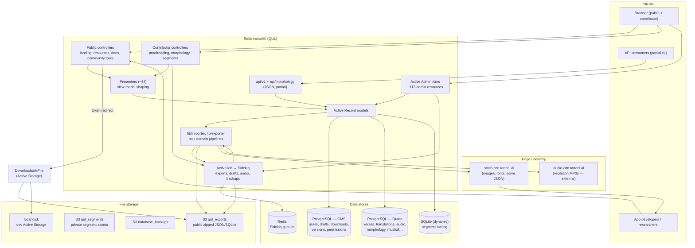

# Phase 6 — Architecture Mental Model

> **Onboarding series:** progressive deep-dive for becoming a legitimate QUL contributor.  
> **Prerequisites:** [Phases 1–5](phase-01-what-is-qul.md)  
> **This file:** how the whole system fits together — layers, boundaries, and the paths data takes from edit to download.

---

## The one-sentence model

QUL is a **Rails monolith** that **curates Quran content in PostgreSQL**, **publishes versioned export files to object storage**, and **serves a public catalog + contributor tools + partial JSON API** — with heavy work deferred to **Sidekiq** and long-running logic living in **`lib/`**, not thin controllers.

If you remember nothing else: **edit in Quran DB → catalog in CMS DB → export to S3/CDN → consumer downloads JSON/SQLite.**

---

## Bird's-eye diagram



**INFERENCE:** Production runs as a **Docker image** deployed to **Kubernetes** on push to `main` (`.github/workflows/deploy.yml`). Local dev uses `bin/dev` (Rails + esbuild + Tailwind via Foreman).

---

## Layer map — responsibilities, I/O, state, trust

Each row is a **boundary** you will cross repeatedly as a contributor.

| Layer | Responsibility | Primary inputs | Primary outputs | Stateful? | Trust boundary |
|---|---|---|---|---|---|
| **Public website** | Marketing, resource catalog, docs rendering, search | HTTP, `DownloadableResource.published` | HTML (ERB + Turbo), redirects to files | Session/cookies via Devise | **Untrusted read** — only published catalog + docs |
| **Community / contributor tools** | Proofreading, morphology editing, segment builder, comparisons | Authenticated user + CanCanCan + `UserProject` | Draft rows (CMS), Quran row edits (authorized) | Per-user drafts, project permissions | **Semi-trusted write** — cannot bypass approval for published content |
| **Active Admin (`/cms`)** | Staff curation: import triggers, approve drafts, export refresh, diagnostics | Admin/super-admin session | Quran DB mutations, CMS metadata, job enqueue | PaperTrail versions, `need_review` flags | **Trusted write** — full editorial power |
| **Controllers** | HTTP routing, auth gates, param handling | `config/routes.rb` | HTML/JSON responses, job enqueue | Minimal — delegate fast | Auth check is the gate |
| **Presenters** | Shape Quran rows for views (keys, URLs, grouping) | AR objects, params | Ruby hashes / view locals | None | Read-only transformation |
| **Models (`ApplicationRecord`)** | CMS identity: users, downloads, drafts, permissions | CMS PostgreSQL | CMS rows, cross-DB ID references | **Source of truth for catalog & workflow** | IDs here reference Quran rows logically, not via FK |
| **Models (`QuranApiRecord`)** | Canonical Quran content | Quran PostgreSQL (`quran` schema) | Content rows scoped by `resource_content_id` | **Source of truth for published Quran data** | Mutations require editorial path |
| **`lib/importer`** | Pull external sources (e.g. QuranEnc), match `verse_key`, upsert | Files, APIs, admin actions | Quran DB rows, `meta_data` provenance | Import version in `ResourceContent.meta_data` | Treat imports as **untrusted input** until reviewed |
| **`lib/exporter`** | Serialize Quran rows → JSON/SQLite/ZIP, attach to `DownloadableFile` | Quran DB queries, `ResourceContent` | Files in `tmp/export`, S3 via Active Storage | Export artifacts are **immutable snapshots** | Published exports are **public trust surface** |
| **ActiveJob / Sidekiq** | Long exports, draft approval, audio processing, backups | Redis queue, job args | DB updates, S3 uploads, emails | Job status via Sidekiq::Status (some jobs) | Failures retry selectively (`sidekiq_options`) |
| **Active Storage + S3** | Persist downloadable zips, segment assets, backups | Local temp files from exporter | Public or private S3 objects | `DownloadableFile.token` for indirection | Dev uses `:local`; prod uses `:qul_exports` |
| **CDN (`static-cdn.tarteel.ai`)** | Fast delivery of images, fonts, some direct JSON uploads | `UploadToCdn`, exporter uploads | Cacheable URLs (`CDN_HOST` env) | Long cache headers on exports | Consumers treat CDN URLs as **stable distribution** |
| **`api/v1`** | Machine-readable access (chapters, translations, tafsir, audio metadata) | API keys / public endpoints | JSON | **INFERENCE:** lighter than download catalog; docs still say API "coming soon" for full surface | Rate/stats via `ApiClient` + `UpdateApiStatsJob` |
| **Mailers** | Notify on export updates, segment completion, developer events | Job completion, admin action | Email (`mailers` queue) | None | Operational, not data plane |

---

## The three data-flow highways

These are the paths you should be able to draw from memory.

### Highway 1 — Consumer download (the main product)

```text
Quran DB content
    → lib/exporter (serialize by resource_type)
    → tmp/export/*.json|.sqlite
    → zip
    → DownloadableFile.file.attach (S3 :qul_exports in prod)
    → DownloadableResource.published (CMS)
    → GET /resources → GET /resources/:id/download/:token
    → redirect to S3 URL
    → developer's app
```

**FACT** — `ResourcesController#download` looks up `DownloadableFile` by token, tracks the download, then redirects to `file.file.url` (Active Storage).

**FACT** — `DownloadableFile` uses `service: :local` in development, `:qul_exports` otherwise (`app/models/downloadable_file.rb`).

**FACT** — `DownloadableResource#refresh_export!` dispatches to the correct `Exporter::DownloadableResources` method based on `resource_type` and `cardinality_type` (ayah vs word vs chapter).

### Highway 2 — Editorial publish (human or import)

```text
External source OR contributor draft OR admin inline edit
    → Quran DB rows (often save(validate: false))
    → ResourceContent approval / import!
    → PaperTrail version (CMS versions table)
    → refresh_export! (sync or AsyncResourceActionJob)
    → Highway 1
```

**FACT** — Community proofreading (`translation_proofreadings`, `tafsir_proofreadings`) writes **`Draft::*` rows in CMS**, not published Quran text directly (Phase 3).

**FACT** — Admin `ResourceContent` actions enqueue `DraftContent::ApproveDraft*Job` and `DraftContent::ImportDraftContentJob` (`app/admin/content/resource_content.rb`).

**FACT** — Scheduled `DraftContent::CheckContentChangesJob` runs weekly (Sunday 06:00) per `config/sidekiq_scheduler.yml` — checks external translation/tafsir sources.

### Highway 3 — Contributor tool loop (no export required)

```text
Authenticated contributor
    → /translation_proofreadings, /morphology_phrases, /segments/*, etc.
    → Presenter + Stimulus/Turbo (Vue in segments/svg only)
    → Draft or direct Quran edit (permission-gated)
    → awaits admin approval → Highway 2
```

**INFERENCE:** This path is how most **community contributors** experience QUL — not Active Admin.

---

## Storage tiers (where state actually lives)

| Tier | Technology | What lives here | Lifecycle |
|---|---|---|---|
| **CMS PostgreSQL** | `ApplicationRecord` | Users, Devise, drafts, `downloadable_*`, PaperTrail `versions`, permissions, morphology phrase CMS overlays | Migrations in `db/schema.rb` |
| **Quran PostgreSQL** | `QuranApiRecord` | Verses, words, translations, tafsirs, audio metadata, morphology, mushaf layouts | SQL dump in dev; **no Rails migrations** |
| **Segment SQLite** | `Segments::Base` | Per-reciter segment editing sessions | **INFERENCE:** ephemeral/tooling; exported back to Quran/S3 |
| **Redis** | Sidekiq | Job queues, scheduler, status middleware | Ephemeral |
| **S3 `qul_exports`** | Active Storage | Zipped public downloads | Long `cache_control`; versioned by export key |
| **S3 `qul_segments`** | Active Storage | Private segment uploads | `public: false` |
| **S3 `database_backups`** | `BackupJob` → `Utils::DbBackup` | DB backups (prod only) | Daily cron 10:00 |
| **CDN** | Cloudflare + `UploadToCdn` | Images (`WORDS_CDN`, `AYAH_CDN`), fonts, some JSON, mini dumps | `CloudflareCacheClearer` on upload |
| **External audio CDN** | `audio-cdn.tarteel.ai` / quranicaudio.com | MP3 recitation files | Referenced in `ResourceContent.meta_data`; not QUL-hosted |

**FACT** — `QuranApiRecord::CDN_HOST = 'https://static-cdn.tarteel.ai'` for word/ayah images.

**FACT** — Dev Quran data dump URL: `https://static-cdn.tarteel.ai/qul/mini-dumps/mini_quran_dev.sql.zip`.

---

## Frontend reality inside the monolith

QUL is **not** a SPA. Think **multi-surface Rails app**:

| Surface | Tech | Entry |
|---|---|---|
| Public pages + docs | ERB, Turbo, Stimulus, Tailwind | `app/views/`, `app/javascript/controllers/` |
| Resource catalog | ERB + presenters | `ResourcesController` |
| Community tools | ERB + Stimulus (heavy forms) | `community#*`, proofreading controllers |
| CMS | Active Admin (jQuery era) | `app/admin/` |
| Segment builder | **Vue 3** | `app/javascript/segments/` |
| SVG optimizer | **Vue 3** | `app/javascript/svg/` |

**FACT** — `bin/dev` runs three processes: Rails server, `yarn build --reload` (esbuild), `tailwindcss:watch`.

**INFERENCE:** As a React engineer, you will feel most at home in `segments/` and `svg/` — everywhere else is server-rendered with sprinkles of JS.

---

## Background work — what Sidekiq is doing

**FACT** — `config/initializers/sidekiq.rb` sets ActiveJob adapter to Sidekiq globally; Sidekiq Web UI mounts at `/sidekiq` for admins.

**Representative job families:**

| Family | Examples | Triggered from |
|---|---|---|
| **Export** | `ExportTranslationJob`, `Export::TafsirJob`, `Export::MushafLayoutExportJob` | Admin resource actions, `refresh_export!` |
| **Draft workflow** | `ApproveDraftTranslationJob`, `ImportDraftContentJob`, `CheckContentChangesJob` | Admin approve, weekly cron |
| **Audio** | `GenerateAudioFilesJob`, `SplitGaplessRecitationJob`, `ExportAudioSegmentsJob` | Admin audio resources |
| **Segments** | `Segments::ExportReciterSegmentsJob` | Segment dashboard |
| **Ops** | `BackupJob` (daily), `ExportMiniDumpJob`, `Recurring::UpdateApiStatsJob` | Cron, admin |

**FACT** — `AsyncResourceActionJob` is a generic dispatcher: `perform(resource, :refresh_export!, ...)` — useful pattern to know when tracing admin buttons.

**FACT** — Production cache uses Memcached (`config.cache_store = :mem_cache_store`), not Redis — Redis is for jobs.

---

## API surface vs download catalog

Two different "APIs" exist in contributors' minds; QUL blurs the line.

| Mechanism | Status | Best for |
|---|---|---|
| **`/resources` downloads** | **FACT** — primary, documented, stable | Bulk JSON/SQLite for apps |
| **`/api/v1/*`** | **FACT** — routes exist (chapters, translations, tafsir, audio metadata) | Live queries, smaller payloads |
| **Docs claim** | **STALE?** — `app/views/docs/markdown/api.md` says API "coming soon" while v1 routes are live | Treat docs as lagging code |

**INFERENCE:** For OSS contribution, **exports are the contract** consumers rely on; `api/v1` is a secondary, evolving surface.

---

## Deployment and environments

```text
git push main
  → GitHub Actions build Docker image (tarteel/quranic-universal-library:SHA)
  → kubectl set image deployment/quranic-universal-library
  → K8s rollout (namespace: tarteel-deployments)
```

**FACT** — from `.github/workflows/deploy.yml`.

**FACT** — Production DB env vars split: `CMS_DB_*` vs `QURAN_API_DB_*` (Phase 5).

**UNKNOWN** — exact pod topology (single replica vs workers separated) — not defined in this repo's workflow file; **INFERENCE:** web + Sidekiq likely separate containers in K8s.

---

## Five architecture facts to remember

1. **Two databases, one app.** CMS workflow state and Quran canonical content are intentionally split. Cross-DB references are logical IDs, not foreign keys. (Phase 5)

2. **The product is exported files, not live DB access.** `lib/exporter` → S3 → `/resources` download is how the world consumes QUL. API v1 is supplementary.

3. **Heavy logic lives in `lib/`, not controllers.** Importers, exporters, audio generators, integrity checks — controllers and admin actions are thin triggers.

4. **Publication is a pipeline, not a save.** Draft → review → approve/import → PaperTrail → `refresh_export!` → `DownloadableResource.published`. Skipping a step leaves consumers on stale files.

5. **Trust tiers: public catalog < contributor tools < admin CMS.** Community edits create drafts; only the admin path (or approved jobs) mutates published Quran content and triggers exports.

---

## How this connects to upcoming phases

| Phase | Builds on this mental model by… |
|---|---|
| **7 — Repo tour** | Mapping folders to the layers above |
| **8 — CMS flow** | Walking one `ResourceContent` through Active Admin |
| **9 — Runtime edit flow** | Tracing a single ayah edit end-to-end |
| **10–11 — Import/export** | Deep-diving the two `lib/` highways |
| **15 — Sidekiq** | Job graph and failure modes |
| **17 — Local setup** | Making this diagram runnable on your machine |

---

## Uncertainties carried forward

| # | Question | Label |
|---|---|---|
| 1 | Are web and Sidekiq separate K8s deployments? | **UNKNOWN** — not in repo workflow |
| 2 | Full `api/v1` auth model and rate limits | **UNKNOWN** — need to read `ApiClient` + controllers in a later phase |
| 3 | Segment SQLite lifecycle — when is it created/destroyed? | **UNKNOWN** — Phase 14/segments deep-dive |
| 4 | `Feedback` model DB connection vs CMS `feedbacks` table | **UNKNOWN** — from Phase 5 |
| 5 | Whether all production exports go through Active Storage or some bypass via `UploadToCdn` directly | **INFERENCE:** both paths exist; exact per-resource-type split TBD in Phase 11 |

---

## Phase 6 summary

You now have a **layered map**: browsers hit Rails surfaces (public, contributor, CMS, API); Rails reads/writes two PostgreSQL databases; Sidekiq runs `lib/` pipelines; exports land in S3/CDN; consumers download versioned artifacts.

The architectural invariant: **Quran DB = editorial source of truth for content; CMS DB = workflow + catalog; S3/CDN = distribution truth for the outside world.**

---

## Stop here — questions before Phase 7

Before the repository tour, it helps to sanity-check your mental model:

1. Can you explain why `DownloadableResource` lives in CMS DB but points at `resource_content_id` in Quran DB?
2. Which path would you trace to find why a translation JSON on `/resources` is stale?
3. Where would you look first for bulk import logic vs a one-off admin button handler?

Reply with questions, or say **"proceed"** for **Phase 7 — Repository Tour** (folder-by-folder map tied to these layers).
