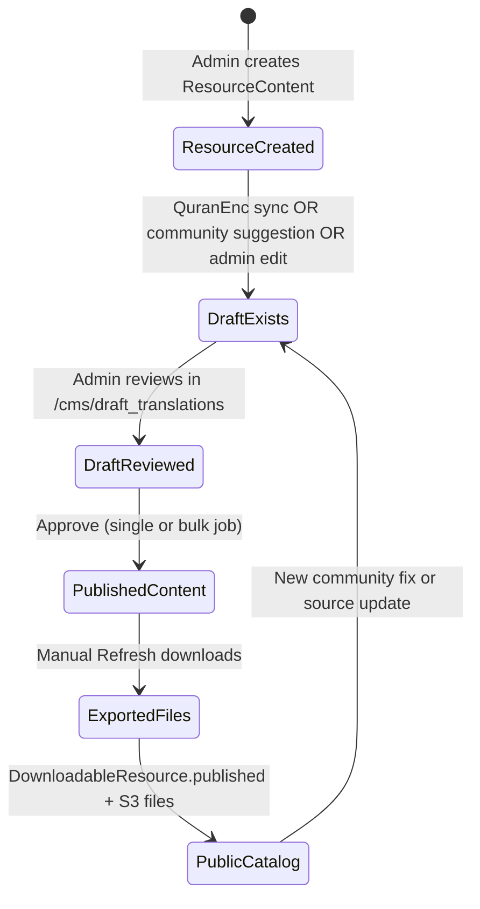
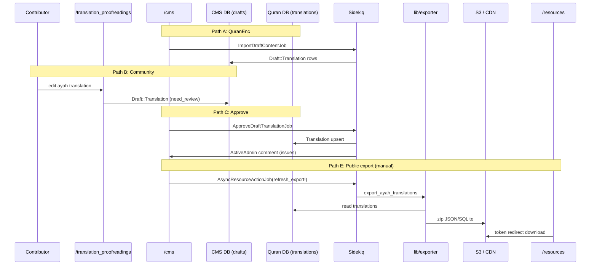

# Phase 8 — Active Admin / CMS Flow

> **Onboarding series:** progressive deep-dive for becoming a legitimate QUL contributor.  
> **Prerequisites:** [Phases 1–7](phase-01-what-is-qul.md)  
> **This file:** walk one representative resource through the CMS — from draft to published Quran row to public download.

---

## What we're tracing

**Representative example:** an **ayah-by-ayah translation** (`ResourceContent` with `sub_type: translation`, `cardinality_type: 1_ayah`).

This is the most common editorial loop because it combines:

- External source sync (QuranEnc)
- Community proofreading (`/translation_proofreadings`)
- CMS draft review (`/cms/draft_translations`)
- Bulk approve jobs
- Public export refresh (`DownloadableResource`)

Other resource types (tafsir, mushaf, audio) reuse the same **shape** with different models and export methods — noted at the end.

---

## CMS entry point

| Item | Detail |
|---|---|
| URL | `/cms` (301 redirect from legacy `/admin`) |
| Framework | Active Admin 3.x, namespace `:cms` |
| Auth | Devise `authenticate_user!` + CanCanCan `Ability` |
| Config | `config/initializers/active_admin.rb` |

**FACT** — `config.default_namespace = :cms`, so every `ActiveAdmin.register X` file becomes `/cms/x`.

**FACT** — Roles in `app/models/ability.rb`:

| Role | CMS power |
|---|---|
| `normal_user` | Read-mostly browse; many resources hidden |
| `moderator` | Draft CRUD (no destroy); morphology phrases |
| `admin` | Full `ResourceContent`, translations, drafts, `refresh_downloads` |
| `super_admin` | `can :manage, :all` |

Community contributors typically **never touch `/cms`** — they use `/translation_proofreadings` and admins merge their work.

---

## The hub: `ResourceContent`

`ResourceContent` is the **logical package** for any downloadable Quran dataset. It lives in the **Quran DB** (`QuranApiRecord`) but links to CMS catalog rows.

```text
ResourceContent (Quran DB)
  ├── Translation / Tafsir / Recitation / … rows (content, scoped by resource_content_id)
  ├── DownloadableResource(s) (CMS DB — public catalog entries)
  ├── Draft::* rows (CMS DB — pending edits)
  ├── ResourcePermission (CMS — copyright/hosting)
  └── UserProject (CMS — who may contribute)
```

**Admin file:** `app/admin/content/resource_content.rb` (~560 lines) — the editorial command center.

### Show page layout (what admins see)

| Section | Purpose |
|---|---|
| **Attributes table** | Name, slug, `approved`, language, cardinality, `meta_data`, record counts |
| **Downloadable resources panel** | Links to CMS catalog rows + `published?` status |
| **Change logs panel** | User-facing changelog entries for this resource |
| **Sidebar: Data for this resource** | Jump link to filtered `/cms/translations` (or tafsirs, mushaf pages, etc.) |
| **Sidebar: Export data** | Ad-hoc export formats (SQLite, JSON variants) → email |
| **Sidebar: Draft translations** | Import/export draft JSON bulk transfer |
| **Sidebar: Contribution access** | `UserProject` list |
| **Sidebar: Tags** | Resource tags for catalog filtering |
| **Action items** | Approve, Import Draft (QuranEnc sync) |

---

## State machine (translation lifecycle)



**Critical distinction (easy to miss):**

| Step | What changes | Automatic? |
|---|---|---|
| **Approve draft** | `Draft::Translation` → `Translation` (Quran DB) | Job or single `import!` |
| **Refresh downloads** | Quran rows → JSON/SQLite zip → S3 → `DownloadableFile` | **Manual** via `/cms/downloadable_resources/:id` |
| **Approve ResourceContent** | `approved` boolean toggle | Separate from content publish |

**FACT** — `ApproveDraftTranslationJob` does **not** call `refresh_export!`. Admins must refresh downloads separately (or run a full export pipeline elsewhere).

---

## Path A — QuranEnc sync (external source → drafts)

Used when `ResourceContent` has `meta_data['source'] == 'quranenc'` or a `quranenc-key`.

### Trigger

1. Admin opens `/cms/resource_contents/:id`
2. Clicks **"Import Draft translation"** (visible when `resource.syncable?`)
3. `import_draft` member action enqueues `DraftContent::ImportDraftContentJob`

```ruby
# app/jobs/draft_content/import_draft_content_job.rb
Importer::QuranEnc.new.import(resource.quran_enc_key)
# or QuranEncTafsir / TafsirApp for other sources
```

### What the importer does

**FACT** — `lib/importer/quran_enc.rb`:

- Fetches from `https://quranenc.com/api/translations/`
- Matches ayahs by `verse_key`
- Writes **`Draft::Translation` rows** (CMS DB) via `insert_all` / `upsert_all` — **not** published `Translation` rows directly

### After sync

Admin is redirected to filtered draft list:

```text
/cms/draft_translations?q[resource_content_id_eq]=<id>
```

Drafts show flags: `text_matched`, `need_review`, `imported`, footnote counts.

### Scheduled sync

**FACT** — `DraftContent::CheckContentChangesJob` runs weekly (Sunday 06:00, `config/sidekiq_scheduler.yml`) to detect QuranEnc version changes and enqueue imports.

---

## Path B — Community proofreading (contributor → draft)

### Trigger

1. Contributor visits `/translation_proofreadings?resource_id=<id>` (needs `UserProject` approval)
2. Edits one ayah → `TranslationProofreadingsController#update`
3. `Translation#save_suggestions` creates a new `Draft::Translation`:

```ruby
# app/models/translation.rb
draft_translation.need_review = true
draft_translation.text_matched = draft_text == current_published_text
draft_translation.user = user
draft_translation.save(validate: false)
```

**FACT** — Published `Translation.text` is **not** changed. Only a draft row is created.

### Permission gate

```ruby
# TranslationProofreadingsController
before_action :authenticate_user!, only: %i[edit update]
before_action :authorize_access!, only: %i[edit update]
# @access = can_manage?(find_resource)  → UserProject + Ability
```

---

## Path C — Admin draft review → publish

Three granularity levels:

### C1 — Single draft (one ayah)

`/cms/draft_translations/:id` → **"Approve and update"**

```ruby
# app/admin/draft/translation.rb
Draft::Translation#import!  # synchronous, single row
```

`Draft::Translation#import!` copies `draft_text` → `Translation.text`, handles footnotes, sets `imported: true`, touches `ResourceContent`.

**FACT** — Uses `PaperTrailAttribution` (`attribute_versions_to(user)`) for version tracking on the published row.

### C2 — Bulk approve (whole resource)

From `ResourceContent` show → import_draft with `params[:approved]`:

```ruby
DraftContent::ApproveDraftTranslationJob.perform_later(resource.id)
```

Job flow (`app/jobs/draft_content/approve_draft_content_job.rb`):

1. **`PaperTrail.enabled = false`** during bulk import (performance)
2. `insert_all` / `upsert_all` into `Translation` in batches of 1000
3. `run_after_import_hooks` on `ResourceContent` (record counts, missing-ayah checks, meta timestamps)
4. Posts ActiveAdmin comment if issues found
5. Marks `AdminTodo` finished

### C3 — Generic draft table (`Draft::Content`)

Newer unified draft model for some resource types. `import_draft_content` member action uses `use_draft_content: true` flag on approve jobs.

---

## Path D — Ad-hoc admin export (sidebar, not public catalog)

Separate from public `/resources` downloads. On `ResourceContent` show → **Export data** sidebar:

| Format | Job |
|---|---|
| `sqlite` | `ExportTranslationJob` |
| `json_nested_array` / `json_text_chunks` | `Export::TranslationJob` |
| `tafsir_json` | `Export::TafsirJob` |
| `raw_files` | `Export::RawTrafsirJob` |

**INFERENCE:** These are **operator exports** (email to admin, files under `public/exported_translations` in dev). Useful for debugging, not the consumer-facing catalog path.

---

## Path E — Public catalog refresh (what consumers see)

This is the step that updates `/resources`.

### Prerequisites

1. `ResourceContent` has linked `DownloadableResource` row(s) (created during first export or manually)
2. Published content exists in Quran DB (`Translation` rows)
3. Admin has `can :refresh_downloads, DownloadableResource`

### Trigger

`/cms/downloadable_resources/:id` → **"Refresh downloads"** → confirm modal →

```ruby
AsyncResourceActionJob.perform_later(resource, :refresh_export!, send_update_email: notify)
```

### What `refresh_export!` does

```ruby
# app/models/downloadable_resource.rb
Exporter::DownloadableResources.new.export_ayah_translations(resource_content: resource_content)
```

Then (`lib/exporter/downloadable_resources.rb`):

1. Query `Translation` rows for this `resource_content_id`
2. Write JSON + SQLite to `tmp/export/`
3. Zip → `DownloadableFile.file.attach` (S3 `:qul_exports` in prod)
4. `DownloadableResource#run_export_action` updates `files_count`
5. Optional: `notify_users` → `DownloadableResourceMailer`

### Public consumption

```text
GET /resources/translation/:slug
  → DownloadableResource.published
  → GET /resources/:id/download/:token
  → redirect to Active Storage S3 URL
```

---

## End-to-end sequence diagram



---

## Key CMS screens (translation workflow)

| Screen | URL pattern | When to use |
|---|---|---|
| Resource hub | `/cms/resource_contents/:id` | Overview, sync, bulk approve, export sidebar |
| Published translations | `/cms/translations?q[resource_content_id_eq]=:id` | Inspect live Quran DB text |
| Draft queue | `/cms/draft_translations?q[resource_content_id_eq]=:id` | Review pending edits |
| Single draft | `/cms/draft_translations/:id` | Approve one ayah, add footnotes |
| Download catalog | `/cms/downloadable_resources/:id` | Refresh public files, notify subscribers |
| Content changes | `/cms/content_changes` | PaperTrail version history (Phase 3) |
| Sidekiq | `/sidekiq` | Watch job progress (admin only) |

### Useful filters on draft index

| Filter | Meaning |
|---|---|
| `text_matched: false` | Contributor changed text from published |
| `need_review: true` | Flagged for admin attention |
| `imported: false` | Not yet merged to published |
| `with_mismatch_footnote` | Footnote count drift |

---

## `meta_data` fields you'll see (translation)

| Key | Role |
|---|---|
| `source` | e.g. `'quranenc'` |
| `quranenc-key` | API key for sync |
| `has-footnote` | Export variants with footnotes |
| `last-import-at` | Set by `run_after_import_hooks` |
| `quranenc-imported-version` | Provenance after approve |
| `draft-quranenc-import-version` | Pending version before approve |

**FACT** — `ResourceContent` includes `HasMetaData` concern for `meta_value` / `set_meta_value` helpers.

---

## Other resource types — same pattern, different endpoints

| Resource type | Content model | Draft model | Export method | Admin sidebar link |
|---|---|---|---|---|
| Tafsir | `Tafsir` | `Draft::Tafsir` | `export_tafsirs` | `/cms/tafsirs` |
| Word translation | `WordTranslation` | `Draft::WordTranslation` | `export_word_translations` | `/cms/word_translations` |
| Mushaf layout | `MushafPage`, `MushafWord` | (inline edit) | `export_mushaf_layouts` | `/cms/mushaf_pages` |
| Recitation | `Audio::*` | — | `export_*_recitation` | `/cms/audio_*` |
| Morphology | `Morphology::Word` | — | `export_quranic_morphology_data` | morphology admin |

**INFERENCE:** Translation is the best template because it has the fullest draft → approve → export loop. Audio and mushaf skip or shorten the draft step.

---

## Common gotchas (read before your first CMS session)

1. **Approve ≠ export.** Published Quran text can be fresh while `/resources` files are stale until someone clicks **Refresh downloads**.

2. **`approved` on ResourceContent ≠ published translations.** The boolean is a catalog/visibility flag, not a content sync state.

3. **Bulk import disables PaperTrail temporarily.** Don't expect version rows for every row in a 6000-ayah bulk approve.

4. **`save(validate: false)` is normal.** Core content models often skip ActiveRecord validations (Phase 3).

5. **Two export systems.** Sidebar export (email to admin) vs `refresh_export!` (public catalog). Different jobs, different output locations.

6. **Drafts live in CMS DB; translations live in Quran DB.** Cross-database — no FK enforcement.

7. **Community edits always create new draft rows** with `need_review: true` — they never silently overwrite published text.

---

## Permissions quick reference

```ruby
# app/models/ability.rb (abbreviated)
admin:
  can :manage, ResourceContent
  can :manage, Draft::Translation
  can :refresh_downloads, DownloadableResource

moderator:
  can [:read, :update, :create], Draft::Translation
  cannot :destroy, Draft::Translation
  # no refresh_downloads, no ResourceContent manage
```

**INFERENCE:** Moderators can triage drafts but likely need an admin for bulk approve and export refresh.

---

## Uncertainties

| # | Question | Label |
|---|---|---|
| 1 | Is there an automated `refresh_export!` after bulk approve in production (cron/hook not in repo)? | **UNKNOWN** — not found in codebase |
| 2 | Exact criteria for creating initial `DownloadableResource` row | **INFERENCE** — first `Exporter::DownloadableResources` run or manual admin create |
| 3 | Whether `ExportTranslationJob` sidebar exports ever feed the public catalog | **INFERENCE:** No — separate path from `refresh_export!` |
| 4 | Full moderator workflow permissions in practice | **UNKNOWN** — role assignment is operational |

---

## Phase 8 summary

The CMS loop for translations:

```text
ResourceContent (package metadata)
  → drafts (CMS: community, QuranEnc, or admin)
  → approve (job or single import! → Quran DB)
  → refresh downloads (manual → exporter → S3)
  → public catalog (/resources)
```

`app/admin/content/resource_content.rb` is the hub. `app/admin/draft/translation.rb` is the review queue. `app/admin/downloads/downloadable_resource.rb` is the public release button.

---

## Stop here — questions before Phase 9

Phase 9 traces the **runtime flow** of editing a single resource from the contributor's perspective (browser clicks → controller → model → what gets saved).

1. Why are drafts in CMS DB but translations in Quran DB — what breaks if you forget that?
2. After bulk-approving 500 drafts, what two URLs would you check to verify success?
3. A user reports stale JSON on qul.tarteel.ai — is the fix in `draft_translations` or `downloadable_resources`?

Reply with questions, or say **"proceed"** for **Phase 9 — Core Runtime Flow (Editing a Resource)**.
