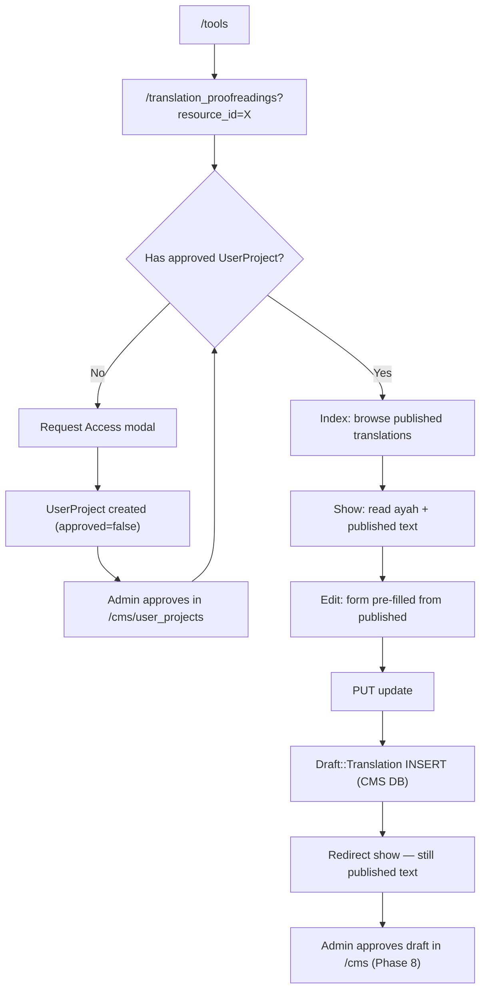

# Phase 9 — Core Runtime Flow (Editing a Resource)

> **Onboarding series:** progressive deep-dive for becoming a legitimate QUL contributor.  
> **Prerequisites:** [Phases 1–8](phase-01-what-is-qul.md)  
> **This file:** what actually happens at runtime when a contributor edits a resource — browser click through to database write.

---

## Scope

We trace **ayah translation proofreading** end-to-end because it is the cleanest example of QUL's contributor pattern:

- **Read** published content from the Quran DB
- **Write** suggestions to the CMS DB as drafts
- **Never** mutate published text in the contributor session

Then we contrast **mushaf layout editing**, which breaks the draft pattern and writes directly to the Quran DB.

---

## URLs and routes

**FACT** — `config/routes.rb`:

```ruby
resources :translation_proofreadings, except: :destroy
```

| Action | URL | `params[:id]` means |
|---|---|---|
| `index` | `/translation_proofreadings?resource_id=131` | — |
| `show` | `/translation_proofreadings/:id?resource_id=131` | **`verse_id`** (not translation id) |
| `edit` | `/translation_proofreadings/:id/edit?resource_id=131` | `verse_id` |
| `update` | `PUT /translation_proofreadings/:id?resource_id=131` | `verse_id` |

**Gotcha:** `:id` in the path is the **verse's primary key**, not `Translation#id`. The controller always scopes by `resource_content_id` + `verse_id`.

**FACT** — Default `resource_id` fallback if missing:

```ruby
params[:resource_id] ||= 131  # hard-coded default translation
```

---

## Lifecycle overview



---

## Phase 0 — Discover the tool

| Step | What happens |
|---|---|
| User visits `/tools` | `CommunityController#tools` → `ToolsHelper#developer_tools` |
| Clicks "Ayah translation…" | Goes to `translation_proofreadings_path` (default resource) |
| Page loads | `TranslationProofreadingsController#index` |

### Controller stack

```text
TranslationProofreadingsController < CommunityController < ApplicationController
```

**Inherited from `CommunityController`:**

- `init_presenter` (overridden to `TranslationPresenter`)
- `load_resource_access` (overridden)
- `authorize_access!` for gated actions

**Inherited from `ApplicationController`:**

- Devise session (`current_user`)
- `set_paper_trail_whodunnit` (sets whodunnit for PaperTrail on publish path — not used on draft create)
- Pagy for index pagination
- CSRF protection

---

## Phase 1 — Index (browse, no auth required)

### Request

```http
GET /translation_proofreadings?resource_id=131&filter_chapter=2&query=merciful
```

### Controller (`#index`)

```ruby
@ayah_translations = ResourceContent.translations.one_verse  # dropdown options
translations = Translation.includes(:verse, :foot_notes)
                  .where(resource_content_id: @resource.id)
# + chapter filter, verse filter, text_search, pagy
```

### What gets read

| Model | DB | Table |
|---|---|---|
| `ResourceContent` | Quran | `resource_contents` |
| `Translation` | Quran | `translations` |
| `Verse` | Quran | `verses` |

### View (`index.html.erb`)

- Resource selector (`select2` Stimulus controller)
- Chapter/verse filters (`shared/filters`)
- Table of **published** `translation.text` with Edit/Show links
- Edit link only works after auth + access (button always visible; gated on edit action)

### Presenter role here

`TranslationPresenter#page_title` → `"Ayah Translation Proofreading"`  
`meta_title`, `meta_description` for SEO via `SeoHelper`.

**INFERENCE:** Presenters are thin for this tool — mostly titles/SEO. Data loading is in the controller (there is even a `# TODO: use presenter to load the translation` on `#show`).

---

## Phase 2 — Access gate

### Without access

`tools/header_alert/_ayah_translation.html.erb` renders when `@access` is falsy:

- Explains the tool
- **"Request Access"** → AJAX modal → `new_user_project_path(resource_id: @resource.id)`

### Request access flow

```text
GET  /user_projects/new?resource_id=X&modal=true  (layout: false, modal)
POST /user_projects
  → UserProjectsController#create
  → UserProject (CMS DB, approved: false)
  → Admin approves in /cms/user_projects
```

**FACT** — `UserProject` validations: reason, language proficiency, motivation, review acknowledgment.

### Access check (`ApplicationController#can_manage?`)

```ruby
if current_user.is_super_admin?
  AdminProjectAccess.new          # always truthy, no admin_notes
elsif current_user.is_audio_annotator? && resource.recitation?
  AdminProjectAccess.new
else
  current_user.user_projects.find_by(resource_content_id: resource.id)
  # must be approved?
end
```

Stored in `@access` via `load_resource_access`.

### Gated actions

```ruby
before_action :authenticate_user!, only: %i[edit update]
before_action :authorize_access!, only: %i[edit update]
```

`authorize_access!` redirects to root with notice if `@access` is nil.

**FACT** — `show` and `index` are **public** (read published translations). Only edit/update require login + project approval.

---

## Phase 3 — Show (read one ayah)

### Request

```http
GET /translation_proofreadings/255?resource_id=131
```

(`255` = `verse_id` for 2:255)

### Controller (`#show`)

```ruby
@translation = Translation
  .includes(:verse, :foot_notes)
  .where(resource_content_id: @resource.id)
  .find_by_verse_id(params[:id])
```

### View layers

| Partial | Content |
|---|---|
| `tools/header` | Title, breadcrumbs, Edit button (if `@access`), view switcher |
| `shared/access_message` | Admin notes from approved `UserProject` |
| `_ayah_view` | Arabic `verse.text_qpc_hafs` + published translation HTML |
| `_page_view`, etc. | Alternate proofreading layouts (page, PDF) |

### Stimulus on show

`_ayah_view.html.erb`:

```html
data-controller="translation-footnote"
```

`translation_footnote_controller.js` decorates `<sup foot_note="N">` markers inline.

**What the user sees:** published `Translation.text` — unchanged since last admin approve/export.

---

## Phase 4 — Edit (form prep)

### Request

```http
GET /translation_proofreadings/255/edit?resource_id=131
```

Requires login + `@access`.

### Controller (`#edit`)

```ruby
@translation = Translation...find_by_verse_id(params[:id])
@draft_translation = @translation.build_draft
```

### `build_draft` — in-memory only, no DB write yet

```ruby
# app/models/translation.rb
draft = draft_translations.build
draft.current_text = text          # snapshot of published
draft.draft_text = text            # editable starting point
draft.verse = verse
# + nested draft foot_notes from published FootNote rows
```

### View (`edit.html.erb`)

```erb
form_with model: @draft_translation,
          url: translation_proofreading_path(@translation.verse.id, resource_id: @resource.id),
          method: :put,
          data: { controller: 'remote-form' }
```

Fields:

- `draft_translation[draft_text]` — main textarea
- `draft_translation[foot_notes_attributes][][draft_text]` — per-footnote edits
- Hidden `foot_note_id` to link back to published footnotes

Language CSS class on textarea: `class="w-full #{lang}"` for RTL/LTR typography.

---

## Phase 5 — Submit (the critical write)

### Request

```http
PUT /translation_proofreadings/255?resource_id=131

draft_translation[draft_text]=...
draft_translation[foot_notes_attributes][0][draft_text]=...
draft_translation[foot_notes_attributes][0][foot_note_id]=42
```

Standard Rails form + CSRF token. Turbo may intercept via `remote-form` controller (client-side HTML5 validation, disable fields during submit).

### Controller (`#update`)

```ruby
@translation = Translation.where(resource_content_id: @resource.id)
                         .find_by_verse_id(params[:id])

if @translation.save_suggestions(translation_params, current_user)
  redirect_to translation_proofreading_path(...), notice: 'Your suggestions are saved successfully'
end
```

### `save_suggestions` — what actually gets written

```ruby
# app/models/translation.rb
draft_translation = Draft::Translation.new(params)   # NEW row every submit
draft_translation.resource_content_id = resource_content_id
draft_translation.current_text = text                # published snapshot
draft_translation.text_matched = draft_text == text
draft_translation.verse = verse
draft_translation.need_review = true
draft_translation.user = user
draft_translation.save(validate: false)
```

| Field | Value | Meaning |
|---|---|---|
| `draft_text` | User's edit | Proposed text |
| `current_text` | Published `translation.text` at submit time | Diff baseline |
| `text_matched` | `draft_text == current_text` | No-op detection |
| `need_review` | `true` | Queued for admin |
| `imported` | `false` (default) | Not yet merged |
| `user_id` | `current_user.id` | Attribution |
| `verse_id` | From route | Ayah identity |

**Database:** `draft_translations` table in **CMS PostgreSQL** (`ApplicationRecord`).

### Text normalization

`Draft::Translation#draft_text=` runs `Utils::TextFormatter` — strips extra whitespace around `<sup` footnote tags.

### What does NOT happen on submit

| Expected by newcomers | Reality |
|---|---|
| `Translation.text` updated | **No** — Quran DB untouched |
| `DownloadableResource` refreshed | **No** |
| PaperTrail version on `Translation` | **No** — draft has no `has_paper_trail` |
| Sidekiq job enqueued | **No** |
| Email to admins | **No** (unless separate monitoring exists) |

After redirect, **show page still displays published text** from `Translation`, not the draft.

---

## Phase 6 — After submit (admin handoff)

Contributor's job ends. Phase 8 covers admin merge:

```text
/cms/draft_translations?q[resource_content_id_eq]=131
  → review need_review, text_matched flags
  → Approve and update (single) OR bulk ApproveDraftTranslationJob
  → Translation row updated in Quran DB
  → (separately) Refresh downloads on DownloadableResource
```

---

## Runtime stack diagram

```text
Browser
  │
  ├─ layout: application.html.erb (Turbo, Tailwind, Stimulus bundle)
  ├─ tools/_header.html.erb (breadcrumb, help modal, access alert)
  │
  ├─ GET index/show ──► TranslationProofreadingsController
  │                      ├─ find_resource → ResourceContent (Quran DB)
  │                      ├─ Translation query (Quran DB)
  │                      └─ TranslationPresenter (SEO titles)
  │
  └─ PUT update ──────► TranslationProofreadingsController#update
                           └─ Translation#save_suggestions
                                └─ Draft::Translation#create (CMS DB)
                                     └─ Draft::FootNote#create (nested)
```

---

## Frontend mechanics (React engineer translation)

| Rails concept | This tool |
|---|---|
| SPA state | None — full page loads + Turbo |
| Form lib | `form_with` → Rails UJS/Turbo |
| Client validation | `remote-form` Stimulus (HTML5 `checkValidity`) |
| Rich text | Plain `<textarea>` — footnotes use `<sup foot_note="id">` HTML |
| Component library | ERB partials, not React |
| Modal | `ajax-modal` Stimulus for access request + help |
| Select dropdown | `select2` Stimulus on resource picker |

**FACT** — jQuery is still used inside some Stimulus controllers (`remote_form_controller.js` uses `$()`).

---

## Contrast: mushaf layout (direct write pattern)

Not all tools use drafts.

```ruby
# MushafLayoutsController#save_page_mapping
@mushaf_page.attributes = params_for_page_mapping
@mushaf_page.save(validate: false)   # writes MushafPage directly (Quran DB)
```

| Aspect | Translation proofreading | Mushaf layouts |
|---|---|---|
| Auth | `UserProject` per resource | Same pattern |
| Write target | `Draft::Translation` (CMS) | `MushafPage` (Quran) |
| Published immediately | No | **Yes** (page mapping) |
| Response | Redirect | `turbo_stream` or redirect |
| Risk if bug | Draft wrong; published safe | Published data wrong |

**INFERENCE:** Draft pattern = high-volume text with editorial review. Direct write = structural/layout data with immediate effect.

---

## Debugging checklist

When tracing a contributor bug, walk this list:

### 1. Network tab

| Request | Expect |
|---|---|
| `PUT .../translation_proofreadings/:verse_id` | 302 redirect on success |
| 422 / 500 | Check server logs; `save(validate: false)` rarely fails validation |
| 302 to `/` | `authorize_access!` failed — no approved project |

### 2. Session

- Is `current_user` present?
- Does `user_projects` have `approved: true` for this `resource_content_id`?

### 3. Database (after submit)

```sql
-- CMS DB
SELECT id, verse_id, text_matched, need_review, imported, user_id, created_at
FROM draft_translations
WHERE resource_content_id = 131 AND verse_id = 255
ORDER BY created_at DESC;

-- Quran DB (should be UNCHANGED after contributor submit)
SELECT text FROM translations
WHERE resource_content_id = 131 AND verse_id = 255;
```

### 4. Common confusion points

| Symptom | Likely cause |
|---|---|
| "My edit didn't save" | Looking at show page — it shows **published** text, not draft |
| Edit button missing | No `@access` — need approved `UserProject` |
| Multiple draft rows per ayah | **FACT** — no unique index on `(resource_content_id, verse_id)`; each submit creates a **new** row |
| Footnote markers broken | HTML `<sup foot_note="id">` format required; see `Draft::Translation` regex constants |

---

## Params permit list (security boundary)

```ruby
params.require(:draft_translation).permit(
  :draft_text,
  foot_notes_attributes: %i[id _destroy draft_text foot_note_id]
)
```

**INFERENCE:** Strong params prevent mass-assignment of `imported`, `need_review`, etc. — those are set server-side in `save_suggestions`.

---

## PaperTrail and attribution

| Model | Versioning |
|---|---|
| `Translation` | `has_paper_trail on: :update` — fires on **admin approve**, not contributor draft |
| `Draft::Translation` | No PaperTrail; includes `PaperTrailAttribution` for `import!` only |
| Contributor submit | No audit trail row created |

**FACT** — `ApplicationController#set_paper_trail_whodunnit` sets `whodunnit` to `current_user.to_gid` for requests that do trigger PaperTrail.

---

## Uncertainties

| # | Question | Label |
|---|---|---|
| 1 | How admins pick among multiple draft rows for same `verse_id` | **INFERENCE** — bulk job imports all `imported: false`; last batch write wins per verse |
| 2 | Whether contributors get notified when drafts are approved | **UNKNOWN** — no mailer found in this path |
| 3 | Why default `resource_id` is hard-coded `131` | **UNKNOWN** — likely a well-known English translation for demo |
| 4 | Whether `save_suggestions` should upsert instead of always insert | **INFERENCE** — current behavior allows edit history via multiple draft rows |

---

## Phase 9 summary

Contributor edit runtime in one line:

```text
Read Translation (Quran DB) → form → save_suggestions → INSERT Draft::Translation (CMS DB) → redirect → still shows published text
```

The intentional gap between **suggestion** and **publication** is the core design. Your job as a contributor-tool developer: never call `translation.update` from contributor controllers unless you are deliberately changing the architecture.

---

## Stop here — questions before Phase 10

Phase 10 deep-dives the **import pipeline** (`lib/importer/`, QuranEnc, matching by `verse_key`).

1. After a contributor submits, which table would you query to verify the write — `translations` or `draft_translations`?
2. Why is `show` public but `edit` gated?
3. How would mushaf page save differ from translation proofreading in terms of what consumers see immediately?

Reply with questions, or say **"proceed"** for **Phase 10 — Import Pipeline**.
