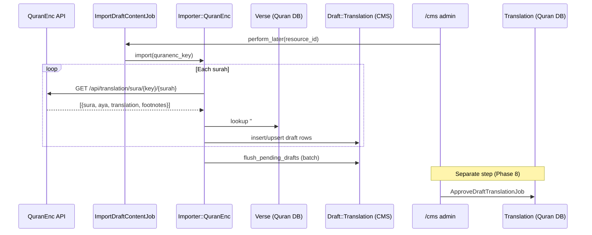

# Phase 10 — Import Pipeline

> **Onboarding series:** progressive deep-dive for becoming a legitimate QUL contributor.  
> **Prerequisites:** [Phases 1–9](phase-01-what-is-qul.md)  
> **This file:** how external Quran data enters QUL — sources, matching, drafts, and what import deliberately does *not* do.

---

## Core principle

**FACT** — QUL imports almost never write directly to published content tables. The standard pipeline is:

```text
External source (API, file, scrape)
    → lib/importer/*
    → Draft::* rows (CMS DB)
    → Admin review + ApproveDraft*Job (Phase 8)
    → Translation / Tafsir / … (Quran DB)
    → refresh_export! (Phase 11)
```

Treat importers as **untrusted input parsers**. They normalize, match ayahs, flag issues, and queue drafts.

**Exception:** Some `lib/tasks/*.rake` one-off scripts write directly to Quran tables (script variants, lemmas, boundaries) — those are maintainer ops, not the editorial import path.

---

## Importer catalog

All classes live in `lib/importer/` (9 files):

| Class | Primary source | Output draft type | Typical trigger |
|---|---|---|---|
| `Importer::QuranEnc` | [quranenc.com](https://quranenc.com) API | `Draft::Translation` (+ `Draft::FootNote`) | Admin button, weekly job, console |
| `Importer::QuranEncTafsir` | QuranEnc tafsir AJAX/API | `Draft::Tafsir` | `ImportDraftContentJob` |
| `Importer::TafsirApp` | Tafsir.app API | `Draft::Tafsir` | `ImportDraftContentJob` |
| `Importer::IslamEnc` | IslamEnc | drafts | Console / rake (legacy) |
| `Importer::QuranAcademy` | Quran Academy | drafts | Console |
| `Importer::QuranKsuEduTafsir` | KSU tafsir pages | drafts | Console |
| `Importer::QuranTafsirNet` | tafsir.net | drafts | Console |
| `Importer::EQuranLibrary` | e-quran library | drafts | Console |
| `Importer::Base` | Shared utilities | — | Parent class |

**INFERENCE:** `QuranEnc` + `QuranEncTafsir` are the **production path** wired to Sidekiq. Others are specialized or historical.

---

## Entry points — how imports get started

### 1. Admin UI (manual)

`app/admin/content/resource_content.rb`:

| Button | Condition | Job |
|---|---|---|
| **Import Draft translation/tafsir** | `resource.syncable?` (QuranEnc or TafsirApp) | `DraftContent::ImportDraftContentJob` |

```ruby
# app/jobs/draft_content/import_draft_content_job.rb
if resource.sourced_from_quranenc?
  resource.tafsir? ? QuranEncTafsir.new.import(key) : QuranEnc.new.import(key)
elsif resource.sourced_from_tafsir_app?
  TafsirApp.new.import(key)
end
```

### 2. Scheduled checker (automatic)

`config/sidekiq_scheduler.yml` — weekly Sunday 06:00:

```yaml
DraftContent::CheckContentChangesJob
```

Flow (`app/jobs/draft_content/check_content_changes_job.rb`):

1. Scrape QuranEnc change log via `Importer::QuranEnc#get_change_log`
2. Compare `meta_data` timestamps per `quranenc-key`
3. Create `AdminTodo` + ActiveAdmin comment on updates
4. Auto-enqueue `ImportDraftContentJob` **only if** resource has **no existing drafts** (`!resource.has_draft_translation?`)

**INFERENCE:** Auto-import is conservative — won't overwrite an in-progress draft queue.

### 3. JSON file upload (admin)

`ResourceContent` sidebar → import draft translations JSON:

```ruby
resource.import_draft_translations(file.read)  # parses verse_key per row
```

Useful for offline-prepared batches or third-party exports (not QuranEnc API).

### 4. Rake tasks (maintainer)

`lib/tasks/` — direct data ops, often bypassing `lib/importer/`:

| Task | Purpose |
|---|---|
| `bridges:import` | Bridges translation JSON → drafts |
| `import:import_qaloon_ayah` | Qaloun script variant |
| `import:import_warsh_ayah` | Warsh script variant |
| `one_time:import_draft_translation` | Legacy bulk draft loader |
| `one_time:import_phrases` | Mutashabihat phrases |

**FACT** — Rake tasks are run manually; not part of normal contributor workflow.

### 5. Rails console (developer)

```ruby
Importer::QuranEnc.new.import('english_saheeh')
Importer::QuranEncTafsir.new.import(:tabary)
Importer::TafsirApp.import_tafsirs(['alaloosi'])
```

---

## Deep dive: `Importer::QuranEnc` (translations)

File: `lib/importer/quran_enc.rb` (~760 lines)

### High-level algorithm

```text
1. Resolve quran_enc_key → ResourceContent (find or create)
2. Optionally create footnote ResourceContent sibling
3. For each Chapter (surah 1..114):
     GET https://quranenc.com/en/api/translation/sura/{key}/{chapter_id}
4. For each ayah in response:
     Match verse via "#{sura}:#{aya}" → Verse.verse_key lookup
     Parse translation + footnotes → Draft::Translation
5. flush_pending_drafts (batch insert_all / upsert_all)
6. Set meta_data version timestamps
7. run_after_import_hooks → AdminTodo on issues
```

### Identity matching — the critical step

```ruby
# Preload all verses once
@verses_by_key ||= Verse.all.index_by(&:verse_key)

# Per API row
verse = verses_by_key["#{data['sura']}:#{data['aya']}"]
```

| External field | QUL identity | Notes |
|---|---|---|
| `data['sura']` + `data['aya']` | `verse.verse_key` (`"2:255"`) | **Primary match key** |
| — | `verse.id` | Stored on draft as `verse_id` |
| — | `verse.verse_index` | Not used for import matching |

**FACT** — Matching assumes QuranEnc surah/ayah numbers align with QUL's canonical `verses` table. If the dump is wrong or an ayah is missing, `verse` is `nil` → crash in `import_verse` unless guarded.

**INFERENCE:** `verse.id` is used downstream but **verse_key** (or sura+aya pair) is the human-debuggable import identity.

### ResourceContent resolution

```ruby
TRANSLATIONS_MAPPING = {
  english_saheeh: { id: 20 },
  urdu_junagarhi: { id: 54 },
  dutch_center: { language: 118, name: '...', id: 942 },
  # … 50+ known keys
}
```

Lookup order:

1. Hard-coded `TRANSLATIONS_MAPPING[key][:id]` → `ResourceContent.find`
2. Else `meta_data ->> 'quranenc-key' = key`
3. Else create new resource (language from API ISO code, `approved: false`)

### Draft row construction

```ruby
translation = existing_drafts(resource)[verse.id] ||
              Draft::Translation.new(verse: verse, resource_content: resource)

translation.draft_text = cleaned_external_text
translation.current_text = published Translation.text (if exists)
translation.text_matched = current_text == draft_text
translation.imported = false
translation.translation_id = current_translation&.id
translation.set_meta_value('source_data', data)  # raw API payload
```

**Batch write** (performance):

```ruby
BATCH_SIZE = 500
# accumulates in @pending_drafts, then:
Draft::Translation.insert_all(new_rows)
Draft::Translation.upsert_all(existing_rows, unique_by: :id)
```

Footnote-heavy translations save immediately (per-ayah) because footnote IDs must be embedded in HTML before batching.

### Footnote pipeline

When `TRANSLATIONS_WITH_FOOTNOTES` or `REGEXP_FOOTNOTES` includes the key:

1. Create sibling `ResourceContent` with `sub_type: footnote`
2. Parse footnote markers from API text using per-translation regexes
3. Create `Draft::FootNote` rows
4. Rewrite markers to QUL format: `<sup foot_note=#{id}>1</sup>`
5. Flag `need_review: true` on mapping failures → `log_issue` → `AdminTodo`

**FACT** — Footnote mapping is the highest-complexity part of translation import. Many `parse_*` private methods exist for edge-case translations (e.g. `parse_pashto_zakaria`).

### Post-import hooks

```ruby
# Importer::Base#run_after_import_hooks
resource.run_draft_import_hooks   # sets synced-at; tafsir-only digest logic
# + create AdminTodo per issue tag if @issues present
```

For translations, `run_draft_import_hooks` on `ResourceContent` is light (mostly `synced-at`). Tafsir imports run heavier grouping/dedup logic.

---

## Deep dive: `Importer::QuranEncTafsir`

Extends `QuranEnc`, file: `lib/importer/quran_enc_tafsir.rb`

### Differences from translation import

| Aspect | Translation | Tafsir |
|---|---|---|
| Draft model | `Draft::Translation` | `Draft::Tafsir` |
| Cardinality | `1_ayah` | `n_ayah` (grouped ranges) |
| Pre-import | Upsert drafts per verse | **`delete_all` existing drafts** for resource |
| API | `/en/api/translation/sura/...` | `/ar/ajax/tafsir/{key}/{chapter}/{ayah}` or mokhtasar API |
| HTML | Light cleanup | `TafsirSanitizer` + color→CSS class mapping per tafsir ID |
| Post-hooks | Light | `generate_text_digest`, `check_duplicate_tafsir_draft_text`, `create_draft_tafsir_groups` |

### Per-verse fetch

```ruby
url = "https://quranenc.com/ar/ajax/tafsir/#{key}/#{verse.chapter_id}/#{verse.verse_number}"
# mokhtasar variant uses /api/v1/translation/aya/{key}/{chapter}/{ayah}
```

Matching uses `verse.chapter_id` + `verse.verse_number` (equivalent to `verse_key`).

### Draft tafsir row

```ruby
draft_tafsir.verse_key = verse.verse_key
draft_tafsir.start_verse_id = verse.id   # initial 1:1 grouping
draft_tafsir.end_verse_id = verse.id
draft_tafsir.draft_text = sanitize_text(api_html)
draft_tafsir.current_text = existing published Tafsir.text
```

**INFERENCE:** Grouping multiple ayahs into one tafsir block happens in `run_draft_import_hooks` → `create_draft_tafsir_groups`, not during initial per-ayah fetch.

---

## Deep dive: `Importer::TafsirApp`

Alternative tafsir source for resources with `tafsir_app_key` in meta_data.

```ruby
TAFISR_MAPPING = { 'tabari' => 15, 'ibn-katheer' => 14, ... }

def import(key)
  resource_content = ResourceContent.find(TAFISR_MAPPING[key])
  Draft::Tafsir.where(resource_content_id: resource_content.id).delete_all
  Verse.find_each { |verse| ... fetch from Tafsir.app ... }
end
```

Same draft-first pattern; different API and hard-coded resource ID map.

---

## `Importer::Base` — shared toolkit

| Method | Role |
|---|---|
| `get_json(url)` | RestClient + retry on timeout/404 |
| `get_html(url)` | Mechanize scrape (change log) |
| `sanitize` / `fix_encoding` | HTML → plain text |
| `simple_format` | Paragraph wrapping |
| `create_draft_tafsir` | Build grouped tafsir draft with verse range |
| `run_after_import_hooks` | `AdminTodo` creation from `@issues` |
| `log_issue({ tag:, text: })` | Collect parse problems |

**FACT** — Issues become `AdminTodo` rows tagged by issue type (`missing-footnote-mapping`, etc.).

---

## Identity & provenance after import

`ResourceContent.meta_data` fields set during import:

| Key | When |
|---|---|
| `source` | `'quranenc'` |
| `quranenc-key` | External API key |
| `draft-quranenc-import-version` | Pending version (before admin approve) |
| `draft-quranenc-import-timestamp` | Pending timestamp |
| `synced-at` | `run_draft_import_hooks` |
| `has-footnotes` | Footnote resource created |

After admin **approve** (not import), `run_after_import_hooks` promotes:

```ruby
quranenc-imported-version  ← draft-quranenc-import-version
quranenc-imported-timestamp ← draft-quranenc-import-timestamp
last-import-at             ← Time.now
```

**FACT** — Provenance chain: external version → draft meta → published meta (Phase 3).

---

## End-to-end sequence



---

## What import does NOT do

| Expectation | Reality |
|---|---|
| Update published `Translation.text` | **No** — drafts only |
| Refresh `/resources` downloads | **No** |
| Set `ResourceContent.approved = true` | **No** (new resources start `approved: false`) |
| Create `DownloadableResource` | **No** (export pipeline) |
| Run ActiveRecord validations | **No** — `save(validate: false)` throughout |
| Guarantee footnote correctness | **No** — flags `need_review` + `AdminTodo` |

---

## Error handling & observability

| Mechanism | Purpose |
|---|---|
| `@issues` array in importer | Collect per-ayah parse problems |
| `AdminTodo` | Actionable queue in CMS dashboard |
| `ActiveAdmin::Comment` | Audit trail on resource (from checker job) |
| `log_message` | stdout during console/rake runs |
| `sidekiq_options retry: 1` | One retry on job failure |

**Debugging failed import:**

1. Sidekiq Web `/sidekiq` — job exception backtrace
2. `/cms/admin_todos` — filter by `resource_content_id`
3. `/cms/draft_translations?need_review=true` — per-ayah flags
4. `draft.meta_data['source_data']` — raw API payload preserved

---

## Rake vs `lib/importer` — when to use which

| Use `lib/importer` when… | Use `lib/tasks` when… |
|---|---|
| Pulling from a recurring external API | One-time historical migration |
| Output should go through draft → approve | Writing script/audio/morphology directly |
| Need `AdminTodo` issue tracking | Maintainer knows the data is trusted |
| Wired to Sidekiq jobs | Ad-hoc console invocation |

---

## Adding a new QuranEnc translation (contributor mental model)

**INFERENCE** — typical maintainer steps:

1. Find QuranEnc key (e.g. `english_saheeh`)
2. Add to `TRANSLATIONS_MAPPING` if new (with `id` or `language` + `name`)
3. If footnotes: add regex to `REGEXP_FOOTNOTES` or `TRANSLATIONS_WITH_FOOTNOTES`
4. Create/link `ResourceContent` with `quranenc-key` in meta_data
5. Run `Importer::QuranEnc.new.import('key')` in console or click Import Draft in CMS
6. Review drafts in `/cms/draft_translations`
7. Bulk approve → refresh downloads

---

## Uncertainties

| # | Question | Label |
|---|---|---|
| 1 | Full list of production resources on auto weekly sync | **INFERENCE** — only those with `quranenc-key` in meta_data |
| 2 | Whether `verse.id` always equals position in mushaf order | **UNKNOWN** — import uses `verse_key` not `verse_index` |
| 3 | Behavior when QuranEnc adds a new surah/ayah variant | **UNKNOWN** — would surface as nil verse lookup |
| 4 | Which importers besides QuranEnc/TafsirApp are still actively used | **INFERENCE** — others appear console-only |

---

## Phase 10 summary

```text
External API/file
  → lib/importer (parse + match verse_key)
  → Draft::* (CMS DB, imported: false)
  → admin approve job
  → published content (Quran DB)
  → exporter (Phase 11)
```

The import layer's job is **faithful ingestion with provenance** — not publication. Never assume an import made anything public.

---

## Stop here — questions before Phase 11

Phase 11 covers the **export pipeline** (`lib/exporter/`, JSON/SQLite generation, S3 attach).

1. Why do importers write drafts instead of updating `Translation` directly?
2. What string would you search for in logs if ayah `2:255` failed to import?
3. After `ImportDraftContentJob` completes, what three CMS URLs would you check?

Reply with questions, or say **"proceed"** for **Phase 11 — Export Pipeline**.
