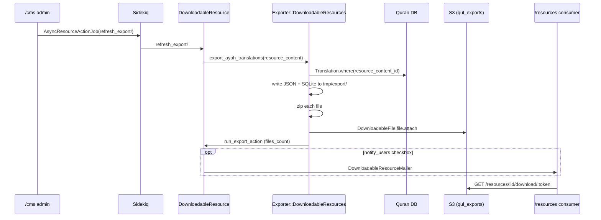

# Phase 11 — Export Pipeline

> **Onboarding series:** progressive deep-dive for becoming a legitimate QUL contributor.  
> **Prerequisites:** [Phases 1–10](phase-01-what-is-qul.md)  
> **This file:** how published Quran content becomes the JSON/SQLite files consumers download from `/resources`.

---

## Core principle

**FACT** — The public product is **versioned export artifacts**, not live database access. Export reads **published** rows from the Quran DB, serializes them to files, zips them, uploads to S3 via Active Storage, and registers them on `DownloadableResource` in the CMS DB.

```text
Translation / Tafsir / … (Quran DB, published)
    → lib/exporter/* (serialize)
    → tmp/export/*.{json,sqlite}
    → zip
    → DownloadableFile → Active Storage (:qul_exports → S3)
    → GET /resources → token redirect → S3 URL
```

Import writes drafts; export reads published content. They meet only after admin approve (Phases 8–10).

---

## Two export systems (do not confuse them)

| System | Trigger | Output location | Audience |
|---|---|---|---|
| **Public catalog** (`refresh_export!`) | `/cms/downloadable_resources` → Refresh downloads | S3 via `DownloadableFile` | Everyone at `/resources` |
| **Admin ad-hoc** (`ExportTranslationJob`, `Export::TranslationJob`) | `ResourceContent` sidebar Export | `tmp/exported_databases`, email attachment, `ResourceContent#sqlite_database` | Operator debugging / legacy mobile dumps |

**INFERENCE:** As a contributor fixing consumer-facing data, you care about **`refresh_export!`** — not the sidebar export jobs.

---

## Orchestrator: `Exporter::DownloadableResources`

File: `lib/exporter/downloadable_resources.rb` (~920 lines)

### Entry points

```ruby
# Console (full re-export of everything — heavy)
s = Exporter::DownloadableResources.new
s.export_all

# Single resource (production path)
DownloadableResource#refresh_export!
  → s.export_ayah_translations(resource_content: ...)
  # (or export_tafsirs, export_mushaf_layouts, etc. based on resource_type)
```

### `export_all` categories

Calls, in order: surah info, tafsirs, ayah translations, transliterations, word translations, topics, ayah themes, recitations (surah/ayah/wbw), quran scripts, qirat scripts, metadata, mushaf layouts, similar ayah, mutashabihat, morphology, fonts.

**FACT** — `export_all` is documented at the top of the file for console use. **INFERENCE:** Production refreshes are per-resource via Sidekiq, not nightly `export_all`.

---

## Public refresh flow



### Trigger code

```ruby
# app/admin/downloads/downloadable_resource.rb
AsyncResourceActionJob.perform_later(resource, :refresh_export!, send_update_email: notify)

# app/models/downloadable_resource.rb
def refresh_export!(send_update_email = true)
  s = Exporter::DownloadableResources.new
  case resource_type
  when 'translation'
    s.export_ayah_translations(resource_content: resource_content)  # if one_ayah?
  # … 14 resource types
  end
  notify_users if send_update_email
end
```

---

## Deep dive: translation export

### Preconditions (`export_ayah_translations`)

```ruby
list = ResourceContent.translations.one_verse.approved

list.each do |content|
  next if !content.allow_publish_sharing?
  next if content.is_transliteration?
  # …
end
```

| Gate | Meaning |
|---|---|
| `approved` | ResourceContent editorial flag |
| `allow_publish_sharing?` | `ResourcePermission` allows public share (or no permission row) |
| `one_verse` cardinality | Ayah-by-ayah translations only in this exporter |
| Not transliteration | Routed to `export_ayah_transliteration` instead |

### Per-resource steps

1. `Exporter::ExportTranslation.new(resource_content:, base_path: "tmp/export/translations")`
2. Find or create `DownloadableResource` (`resource_type: 'translation'`, `cardinality_type: '1_ayah'`)
3. Set name, language, tags (`language_name`, `With Footnotes` if applicable)
4. Generate files → `create_download_file` for each variant

### File variants (translations with footnotes)

| `file_type` on `DownloadableFile` | Format | Description |
|---|---|---|
| `simple.json` / `simple.sqlite` | Plain text per ayah | Footnotes stripped |
| `translation-with-footnote-tags.json` | HTML with `<sup>` preserved | Tags kept |
| `translation-with-inline-footnote.json` | Footnotes inlined as `[[text]]` | |
| `translation-text-chunk.json` | Structured chunks `{t: [...], f: {...}}` | Rich formatting |
| Matching `.sqlite` variants | Same shapes in SQLite tables | |

Resources **without** footnotes get only `simple.json` + `simple.sqlite`.

### JSON shape (simple)

```json
{
  "2:255": "Allah - there is no deity except Him...",
  "2:256": "There shall be no compulsion in religion..."
}
```

**FACT** — Keys are `verse_key` strings (`"surah:ayah"`), keyed from `Translation.verse_key`.

### JSON shape (chunks — used by some apps)

```json
{
  "2:255": {
    "t": ["chunk1", {"type": "b", "text": "bold part"}, "chunk2"],
    "f": {"1": "footnote text"}
  }
}
```

Produced by `Exporter::AyahTranslation#export_chunks` via Nokogiri HTML parsing.

### SQLite schema (simple)

```sql
CREATE TABLE translation (
  sura INTEGER,
  ayah INTEGER,
  ayah_key TEXT,
  text TEXT
);
```

With footnotes: additional `footnotes TEXT` column (JSON object).

**FACT** — Column names use `sura`/`ayah` in SQLite exports (consumer docs refer to `surah_id`/`ayah_number` — same integers, different names).

### Data source query

```ruby
# lib/exporter/export_translation.rb
Translation
  .where(resource_content_id: resource_content.id)
  .order('verse_id ASC')
  .in_batches(of: 1000)
```

Reads **published** Quran DB rows only. Missing ayahs simply omit from export.

---

## `create_download_file` — attach to catalog

```ruby
def create_download_file(downloadable_resource, file_path, file_type, file_name = nil)
  file = DownloadableFile.where(
    downloadable_resource_id: resource.id,
    file_type: file_type,
  ).first_or_initialize

  zipped = zip(file_path)                    # always zip before upload

  file.file.attach(
    io: File.open(zipped),
    filename: File.basename(zipped),
    key: QulExportedFileKeyGenerator.generate_key(zipped, resource)
  )

  file.save(validate: false)
  resource.run_export_action                 # updates files_count
end
```

### S3 object key format

```ruby
# lib/qul_exported_file_key_generator.rb
"qul-exports/#{resource_type}/#{timestamp}-#{random}-#{basename}.#{ext}"
# e.g. qul-exports/translation/1694567890-abc12-en-sahih-simple.json.zip
```

### Active Storage service

```ruby
# app/models/downloadable_file.rb
has_one_attached :file, service: Rails.env.development? ? :local : :qul_exports
```

**FACT** — `config/storage.yml` `qul_exports` uses `QUL_STORAGE_*` env vars with `public: true` and 1-year cache control.

### `DownloadableFile` identity

- One row per `(downloadable_resource_id, file_type)` — refresh **replaces** the attachment on the same row
- `token` generated on create — used in public download URL
- `download_count` tracked per user

---

## Consumer download path

```ruby
# app/controllers/resources_controller.rb
def download
  file = DownloadableFile.find_by(token: params[:token])
  file.track_download(current_user)
  redirect_to file.file.url, allow_other_host: true   # → S3 presigned/public URL
end
```

Public catalog only shows `DownloadableResource.published` resources.

---

## Exporter class map

| Class | Resource types | Output |
|---|---|---|
| `ExportTranslation` | ayah translation | JSON + SQLite variants |
| `ExportTafsir` | tafsir | JSON + SQLite with ayah grouping |
| `ExportTransliteration` | transliteration | JSON + SQLite |
| `ExportWordTranslation` | word-by-word translation | JSON + SQLite |
| `ExportSurahRecitation` / `ExportAyahRecitation` / `ExportWordRecitation` | audio manifests | JSON |
| `ExportQuranAyahScript` / `ExportQuranWordScript` | arabic scripts | JSON + SQLite |
| `ExportMushafLayout` | mushaf layouts | JSON/SQLite + layout assets |
| `ExportQuranicMorphology` | morphology | JSON + SQLite |
| `ExportFont` | fonts | ttf/otf/woff/svg |
| `ExportSurahInfo` | surah info | CSV + JSON + SQLite |
| `ExportMutashabihat` / `ExportMatchingAyah` | similar ayah | JSON + SQLite |
| `ExportQuranMetaData` | metadata | JSON + SQLite |
| `BaseExporter` | shared | SQLite helpers, `write_json`, `fix_file_name` |

All orchestrated from `DownloadableResources` methods matching `DownloadableResource::RESOURCE_TYPES`.

---

## Tafsir export (grouping difference)

`ExportTafsir` iterates **every verse** but resolves grouped tafsir blocks:

```ruby
tafsir = Tafsir.for_verse(verse, resource_content)
# JSON keyed by verse_key, value includes group range + text
```

**INFERENCE:** One tafsir entry may cover multiple ayahs; export duplicates the group reference per verse key for lookup convenience.

---

## Permission & publication gates

| Check | Where | Effect |
|---|---|---|
| `ResourceContent.approved` | exporter scope | Unapproved resources skipped |
| `allow_publish_sharing?` | `export_ayah_translations` | Copyright-blocked resources skipped |
| `DownloadableResource.published` | `ResourcesController` | Hidden from public catalog |
| `can :refresh_downloads` | admin ability | Only admins trigger export |

```ruby
# ResourceContent#allow_publish_sharing?
permission.blank? || permission.share_permission_is_granted? || permission.share_permission_is_unknown?
```

---

## Notify subscribers

When refresh runs with `notify_users: true`:

```ruby
UserDownload.where(downloadable_file_id: downloadable_files.pluck(:id))
  → DownloadableResourceMailer.new_update(resource, user, change_log)
```

**FACT** — Only users who previously downloaded **any file** on this resource get emailed.

---

## Admin ad-hoc exports (secondary path)

### `ExportTranslationJob`

- Builds FTS3 SQLite (`verses` virtual table) — legacy mobile schema
- Bzip2 compresses → `UploadTranslationDbJob` attaches to `ResourceContent#sqlite_database` (`:database_backups` service)
- Emails operator via `DeveloperMailer`

### `Export::TranslationJob`

- Writes to `public/exported_translations/`
- Formats: nested array (per-surah arrays) or text-chunks JSON
- Emails operator in production

**INFERENCE:** These paths support Tarteel mobile / internal tooling — not the `/resources` zip catalog.

---

## JSON encoding detail

Exports use `JsonNoEscapeHtmlState` when generating JSON:

```ruby
JSON.generate(data, { state: JsonNoEscapeHtmlState.new })
```

**INFERENCE:** Preserves HTML entities and Unicode in translation text without over-escaping — important for Arabic/HTML footnote markup in JSON consumers.

---

## File naming

```ruby
# ResourceContent#sqlite_file_name
slug || english translated name || name
  → parameterize → "en-sahih", "ur-junagarhi", etc.
```

`ExportService::TRANSLATION_NAME_MAPPING` provides canonical slug overrides for well-known translation IDs (used by ad-hoc export jobs).

---

## `tmp/export/` lifecycle

```text
tmp/export/translations/en-sahih-simple.json
tmp/export/translations/en-sahih-simple.json.zip   ← uploaded
# source .json may remain on disk until cleaned
```

**INFERENCE:** `export_all` starts with `FileUtils.rmdir("tmp/export")` — full export wipes temp dir first.

---

## End-to-end checklist (operator)

After publishing new translation content:

1. Verify `Translation` rows in Quran DB (`/cms/translations?resource_content_id_eq=X`)
2. Confirm `ResourceContent.approved` and `allow_publish_sharing?`
3. `/cms/downloadable_resources/:id` → **Refresh downloads**
4. Wait for Sidekiq job (`AsyncResourceActionJob`)
5. Check `DownloadableFile` rows have updated attachments
6. Hit `/resources/translation/:slug` → download `simple.json.zip`
7. Optionally notify subscribers

**FACT** — Approve drafts (Phase 8) does **not** auto-trigger step 3.

---

## Relationship to other phases

| Phase | Connection |
|---|---|
| **8 — CMS** | `refresh_export!` button location |
| **9 — Runtime** | Contributor edits don't touch export until approve + refresh |
| **10 — Import** | Import → drafts; export → published only |
| **12+ — Domain** | Morphology/mushaf/audio have dedicated exporter classes |

---

## Uncertainties

| # | Question | Label |
|---|---|---|
| 1 | Is `export_all` run on a schedule in production? | **UNKNOWN** — not in repo scheduler; per-resource refresh only |
| 2 | CDN direct upload (`UploadToCdn`) vs Active Storage for translations | **INFERENCE** — catalog uses Active Storage; `UploadToCdn` used for audio segments/manifests |
| 3 | Whether `published` flag on `DownloadableResource` auto-flips on export | **INFERENCE** — `run_export_action` sets `published` to true if nil |
| 4 | Exact S3 URL stability across refreshes | **INFERENCE** — new object key each refresh (timestamp in key); token URL on QUL stays stable |

---

## Phase 11 summary

```text
Published Quran rows
  → Exporter::* (per resource_type)
  → tmp/export → zip
  → DownloadableFile (CMS) → S3
  → /resources download token
```

The export layer is the **public contract**. If the JSON is wrong, trace: Quran DB content → exporter class → `file_type` variant → not the import draft tables.

---

## Stop here — questions before Phase 12

Phase 12 covers **morphology / Arabic linguistic data** — a specialized resource category with its own models and exporter.

1. If `/resources` shows stale JSON but `/cms/translations` shows correct text, what single admin action fixes it?
2. What's the difference between `simple.json` and `translation-text-chunk.json`?
3. Why are exports zipped before S3 upload?

Reply with questions, or say **"proceed"** for **Phase 12 — Morphology / Arabic Linguistic Data**.
