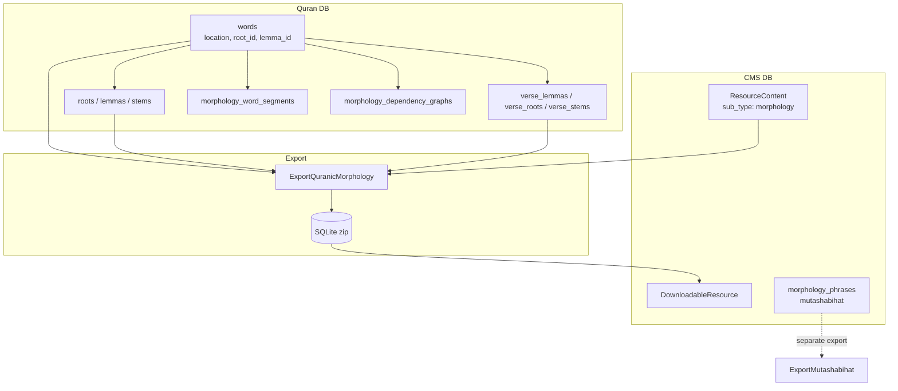

# Phase 12 — Morphology / Arabic Linguistic Data

> **Onboarding series:** progressive deep-dive for becoming a legitimate QUL contributor.  
> **Prerequisites:** [Phases 1–11](phase-01-what-is-qul.md)  
> **This file:** how QUL models Arabic linguistic data — roots, lemmas, stems, grammar tags, dependency graphs — and how it differs from mutashabihat tooling.

---

## First clarification: "morphology" means several things in QUL

The word **morphology** appears in multiple places. They overlap but are not interchangeable:

| Subsystem | What it is | Primary DB | Public download? |
|---|---|---|---|
| **Morphology resources** (`/resources/morphology`) | Roots, lemmas, stems (word + ayah level) | Quran | **Yes** — SQLite |
| **Word linguistic columns** | `words.root_id`, `lemma_id`, `stem_id` | Quran | Via morphology exports |
| **`Morphology::WordSegment`** | Rich POS/grammar features per word segment | Quran | **INFERENCE:** not fully exported yet |
| **Dependency graphs / treebank** | Iʿrāb-style syntactic graphs per ayah | Quran | **UNKNOWN** — tooling, not catalog JSON |
| **`Morphology::Phrase`** | Mutashabihat phrase matching | **CMS** | Via `mutashabihat` export (different category) |
| **`lib/corpus/morphology/`** | POS tag type definitions (45 tags) | Code only | N/A |

**MUST UNDERSTAND:** `/resources/morphology` is **not** the mutashabihat contributor tool (`/morphology_phrases`). Same team domain, different products.

---

## Consumer mental model

Morphology answers: **"What are the linguistic parts of this Arabic word?"**

```text
Word at location "2:255:13"
  ├── text (from words.text_qpc_hafs — join Quran Script resource)
  ├── root   (ج ذ ر)
  ├── lemma  (ذِكْر)
  ├── stem   (ذكر)
  └── (optionally) POS tags, grammar segments, dependency edges
```

**FACT** — Official tutorial: `app/views/docs/markdown/tutorial-morphology-end-to-end.md`

Join key for apps: **`location`** / `word_location` (`"surah:ayah:word_position"`), e.g. `"1:1:1"`.

---

## Identity hierarchy (morphology-specific)

Building on Phase 2:

```text
Chapter (surah)
  └── Verse (ayah)          verse_key: "2:255"
        └── Word            location: "2:255:13"
              ├── root_id → Root
              ├── lemma_id → Lemma
              ├── stem_id → Stem
              └── Morphology::Word / WordSegment (extended analysis)
```

| Identifier | Example | Used for |
|---|---|---|
| `verse_key` | `"2:255"` | Ayah-level lemma/stem/root aggregates |
| `location` | `"2:255:13"` | Word-level morphology joins |
| `word.position` | `13` | Third word in ayah (with surah+ayah context) |
| `sequence_number` | global unique | **FACT** — unique index on `words`; internal ordering |

**INFERENCE:** Always join morphology to Quran Script word data on `location`, not on Arabic text alone (homographs exist).

---

## Downloadable morphology packages

### ResourceContent wiring

```ruby
ResourceContent.morphology  # sub_type: 'morphology'
# meta_data['morphology-resource-type'] → 'root' | 'lemma' | 'stem' | 'morphology'
# cardinality: '1_word' (word-level) or '1_ayah' (ayah-level)
```

Preview partial selection (`app/views/resources/previews/_morphology.html.erb`):

```ruby
partial_name = "#{one_word? ? 'word' : 'ayah'}_#{resource_type}"
# e.g. word_root_preview, ayah_lemma_preview
```

### Export pipeline

```ruby
# lib/exporter/downloadable_resources.rb
Exporter::ExportQuranicMorphology.new(...).export_sqlite
```

`ExportQuranicMorphology` branches on `morphology-resource-type`:

| Type | Cardinality | SQLite tables | Status |
|---|---|---|---|
| `root` | word | `roots`, `root_words` | **FACT** — implemented |
| `lemma` | word | `lemmas`, `lemma_words` | **FACT** — implemented |
| `stem` | word | `stems`, `stem_words` | **FACT** — implemented |
| `root` | ayah | `roots` (verse_key, text) | **FACT** — via `verse_root` |
| `lemma` | ayah | `lemmas` (verse_key, text) | **FACT** — via `verse_lemma` |
| `stem` | ayah | `stems` (verse_key, text) | **FACT** — via `verse_stem` |
| `morphology` | any | — | **FACT** — `export_morphology` returns `todo` ("pending.json") |

**STALE/GAP FLAG:** Full grammatical morphology export is **not implemented** in the exporter — only root/lemma/stem variants ship today.

### Word-level SQLite shape (root example)

```sql
-- roots table
id, arabic_trilateral, english_trilateral, words_count, uniq_words_count

-- root_words table
root_id, word_location   -- e.g. "2:255:1"
```

### Ayah-level SQLite shape

```sql
-- roots table (ayah variant)
verse_key TEXT, text TEXT   -- aggregated root string for whole ayah
```

---

## Core Quran DB models

### `Word` — the join hub

```ruby
# app/models/word.rb (QuranApiRecord)
belongs_to :root, :lemma, :stem  # linguistic FKs
# location, verse_key, position, text_qpc_hafs, many script columns
```

Every morphology download ultimately traces back to `words` + related tables.

### `Root`, `Lemma`, `Stem`

| Model | Table | Key fields |
|---|---|---|
| `Root` | `roots` | `arabic_trilateral`, `english_trilateral`, `value` |
| `Lemma` | `lemmas` | `text_madani`, `text_clean`, `en_translations` (jsonb) |
| `Stem` | `stems` | `text_madani`, `text_clean` |

**FACT** — Lemma English glosses can be bulk-imported via `lib/tasks/import_lemmas.rake` from CDN `lemmas.txt`.

### Ayah aggregates

| Model | Table | Role |
|---|---|---|
| `VerseLemma` | `verse_lemmas` | Concatenated lemma text per ayah |
| `VerseRoot` | `verse_roots` | Concatenated root string per ayah |
| `VerseStem` | `verse_stems` | Concatenated stem text per ayah |

Linked from `Verse` model — used in ayah-level morphology previews and exports.

---

## Extended analysis: `Morphology::Word` + `WordSegment`

### `Morphology::Word` (`morphology_words` table)

```ruby
class Morphology::Word < QuranApiRecord
  belongs_to :word, :verse
  belongs_to :grammar_pattern, :grammar_base_pattern
  has_many :word_segments, :word_tokens, :derived_words, :verb_forms
  # location field mirrors word.location
```

Higher-level morphology row per Quran word — links to grammar patterns and segments.

### `Morphology::WordSegment` (`morphology_word_segments`)

Granular sub-word analysis with ~20 linguistic dimension columns:

| Column family | Examples |
|---|---|
| POS | `part_of_speech_key`, `pos_tags` |
| Grammar roles | `grammar_term_id`, `grammar_concept_id`, `grammar_role_id` |
| Morphology features | `person_type`, `gender_type`, `number_type`, `aspect_type`, `mood_type`, `case_type`, `voice_type` |
| Lexical refs | `root_id`, `lemma_id`, `root_name`, `lemma_name` |
| Display | `text_qpc_hafs`, `segment_type` |

**FACT** — POS tag colors defined in model (`POS_TAG_COLORS`) for UI rendering.

**INFERENCE:** This is the data you'd want in a full `morphology` export — currently not exposed via `ExportQuranicMorphology`.

---

## Grammar type system (`lib/corpus/morphology/`)

Ruby classes defining the tag vocabulary — not database tables:

| File | Defines |
|---|---|
| `part_of_speech.rb` | 45 POS tags (N, V, P, CONJ, …) with Arabic descriptions |
| `case_type.rb`, `mood_type.rb`, `gender_type.rb`, … | Feature dimensions |
| `part_of_speech_category.rb` | Groupings |

Used by treebank/graph UIs and validators. **FACT** — tested in `test/lib/corpus/morphology_types_test.rb`.

---

## Dependency graphs & treebank (syntactic morphology)

### Models (Quran DB)

```text
Morphology::DependencyGraph::Graph     # one graph per ayah (or multiple graph_number)
  ├── GraphNode                          # tokens in syntactic tree
  └── GraphNodeEdge                      # relation labels (subject, object, …)
```

**FACT** — `review_status` enum: `draft`, `approved`, `need_correction`.

### Public / contributor routes

```text
/morphology/dependency-graphs           # index, show, edit
/morphology/dependency-graphs/:id/nodes # CRUD nodes
/morphology/treebank                    # read-only treebank viewer
/morphology/treebank/:chapter/:verse    # per-ayah display
```

Controllers: `Morphology::DependencyGraphsController` (gated edit), `Morphology::TreebankController`.

**FACT** — Edge relation labels internationalized via `I18n.t("morphology.edge_relations.#{label}")`.

**FACT** — API route exists: `GET /api/morphology/edge_relations` (listed in `config/routes.rb`).

### Noor Bayan import

`app/services/morphology/noor_bayan/importer.rb` — CSV import for treebank data:

- Creates sentences, tokens, surface forms
- Resets tables, verifies counts against `EXPECTED` constants
- Creates a `ResourceContent` for "NoorBayan Quranic Treebank"

**INFERENCE:** Specialized maintainer pipeline — not the standard QuranEnc draft flow.

---

## Mutashabihat phrases (NOT morphology downloads)

### `Morphology::Phrase` (CMS DB)

```ruby
class Morphology::Phrase < ApplicationRecord  # NOT QuranApiRecord
  has_many :phrase_verses
  # phrase_type, source_verse_id, word_position_from/to, approved
end
```

Contributor tool: `/morphology_phrases` (listed as "Mutashabihat ul Quran" on `/tools`).

| Aspect | Morphology download | Mutashabihat phrases |
|---|---|---|
| DB | Quran | CMS (`morphology_phrases` in `db/schema.rb`) |
| Export type | `morphology` | `mutashabihat` |
| Purpose | Root/lemma/stem lookup | Similar phrase matching across ayahs |
| Service | `Exporter::ExportQuranicMorphology` | `Exporter::ExportMutashabihat` |

**FACT** — `Morphology::MatchingVerse` (CMS) stores suggested ayah matches with scores — used in phrase proofreading UI.

---

## Public browse pages

Lightweight reference pages (no auth):

```text
/morphology/roots/:arabic_trilateral    # Root detail modal
/morphology/lemmas/:id
/morphology/stems/:id
/morphology/word                        # word lookup
/morphology/grammar/:category/:term     # grammar term docs
```

Controllers are thin — `Root.find_by!(arabic_trilateral: params[:id])`.

Resource catalog previews (`word_root_preview.html.erb`) render word tiles linking to these pages.

---

## Admin CMS (`app/admin/morphology/`)

18 admin files covering:

| Admin resource | Model |
|---|---|
| `word.rb`, `word_segment.rb`, `word_token.rb` | Morphology analysis rows |
| `grammar_term.rb`, `grammar_concept.rb`, `grammar_pattern.rb` | Grammar reference |
| `graph.rb`, `graph_node.rb`, `graph_node_edge.rb` | Dependency graphs |
| `phrase.rb`, `phrase_verse.rb`, `matching_verse.rb` | Mutashabihat (CMS) |
| `sentence.rb`, `derived_word.rb`, `word_verb_form.rb` | Treebank support |

Editorial work on linguistic data happens here — analogous to `/cms/translations` for text resources.

---

## Data flow diagram



---

## Integration recipe (app developer)

From the official tutorial — the join pattern:

```javascript
// 1. Load morphology SQLite → index by word_location
const morphologyIndex = buildMorphologyIndex(rows);

// 2. Load Quran Script word-by-word JSON (separate resource)
const enriched = wordRows.map(word => ({
  ...word,
  morphology: morphologyIndex[word.location] || null
}));

// 3. Tap word → show root/lemma/stem panel
```

**FACT** — Word script data and morphology data are **separate downloadable resources** — you must join client-side.

---

## Maintainer tasks (non-standard import)

| Task | Purpose |
|---|---|
| `import:import_lemma_translations` | English glosses on `Lemma.en_translations` |
| `migrate_word_roots.rake` | Root ID backfill |
| `Morphology::NoorBayan::Importer` | Treebank CSV ingest |
| `lib/internal/corpus.rake` | Corpus maintenance |

These write **directly to Quran tables** — not the draft → approve pipeline used for translations.

---

## Permissions & contributor access

| Tool | Access pattern |
|---|---|
| Dependency graph edit | `UserProject` + `authorize_access!` on edit/split |
| Morphology phrases (mutashabihat) | Same — moderator can manage `Morphology::Phrase` per `Ability` |
| Morphology downloads | Public read — no auth |

---

## Common gotchas

1. **`location` is the join key** — not `word.id` in consumer docs (though internal FKs use IDs).

2. **Ayah vs word resources are separate downloads** — `cardinality_type` on `ResourceContent` determines export shape.

3. **`export_morphology` is a stub** — don't expect full POS/grammar SQLite in `/resources` yet.

4. **`Morphology::Phrase` is CMS** — don't query it via `QuranApiRecord` connections.

5. **Dependency graphs ≠ morphology SQLite** — graph data is edited/viewed in web tools; export path unclear.

6. **Arabic text columns multiply** — morphology uses `text_qpc_hafs`; always match the script resource you're pairing with.

---

## Uncertainties

| # | Question | Label |
|---|---|---|
| 1 | Timeline/plan for full `morphology` SQLite export (WordSegment data) | **UNKNOWN** |
| 2 | Whether dependency graphs will become a downloadable resource type | **UNKNOWN** |
| 3 | Which morphology tables exist only in full prod dump vs mini dump | **UNKNOWN** until Phase 17 |
| 4 | Relationship between `Morphology::Word` and `Morphology::WordSegment` in UI | **INFERENCE** — Word is parent row; segments are sub-word pieces |

---

## Phase 12 summary

QUL morphology is a **layered linguistic stack**:

```text
words (canonical) + root/lemma/stem FKs
  → downloadable SQLite packages (root/lemma/stem)
  → WordSegment / dependency graphs (rich analysis, mostly in-app)
  → Morphology::Phrase (mutashabihat — separate CMS + export)
```

As a contributor: know which layer you're touching before picking a folder.

---

## Stop here — questions before Phase 13

Phase 13 covers **Mushaf layouts** — page mapping, line alignment, and export.

1. What key joins morphology SQLite rows to Quran Script word data?
2. What's the difference between `/resources/morphology` and `/morphology_phrases`?
3. Why does `export_morphology` return "pending"?

Reply with questions, or say **"proceed"** for **Phase 13 — Mushaf Layouts**.
