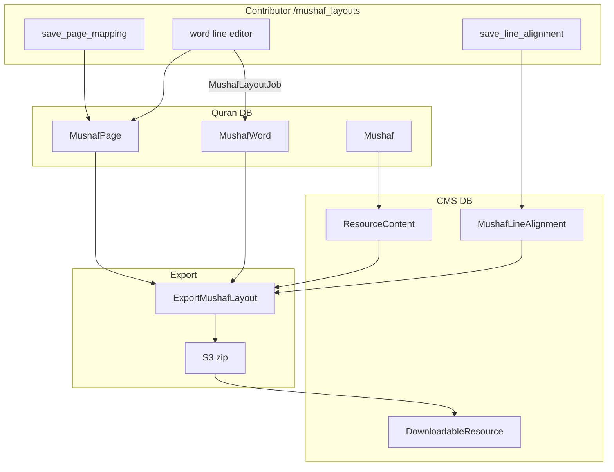

# Phase 13 — Mushaf Layouts

> **Onboarding series:** progressive deep-dive for becoming a legitimate QUL contributor.  
> **Prerequisites:** [Phases 1–12](phase-01-what-is-qul.md)  
> **This file:** how QUL models printed mushaf page structure — page mapping, line alignment, word placement, and export.

---

## What a mushaf layout is (vs other resources)

Most QUL resources answer **"what is the content?"** (translation text, audio URL, root string).

Mushaf layouts answer **"how is this page printed?"**:

| Field | Meaning |
|---|---|
| `page_number` | Physical mushaf page (1–604 typical) |
| `line_number` | Line index within the page |
| `line_type` | `ayah`, `surah_name`, or `basmallah` |
| `is_centered` | Centered vs justified line |
| `first_word_id` / `last_word_id` | Word range on this line |
| `surah_number` | For `surah_name` lines |

**FACT** — Official tutorial: `app/views/docs/markdown/tutorial-mushaf-layout-end-to-end.md`

Consumers combine **mushaf-layout** + **quran-script** (word-by-word) + **font** resources to render page-faithful views.

---

## Core entities

```text
ResourceContent (sub_type: layout, cardinality: 1_page)
  └── Mushaf (lines_per_page, pages_count, default_font_name)
        ├── MushafPage (page_number, first/last word & verse, verse_mapping JSON)
        ├── MushafWord (per-word line/page position in THIS layout)
        └── MushafLineAlignment (surah_name / bismillah / center lines)  [CMS DB — see below]
```

| Model | Base class | Table | Role |
|---|---|---|---|
| `Mushaf` | `QuranApiRecord` | `mushafs` | Layout edition (15-line Indopak, QPC v2, etc.) |
| `MushafPage` | `QuranApiRecord` | `mushaf_pages` | Page boundaries + ayah mapping |
| `MushafWord` | `QuranApiRecord` | `mushaf_words` | Word placement on a specific page/line |
| `MushafLineAlignment` | `ApplicationRecord` | `mushaf_line_alignments` | Special lines (surah title, basmallah, center) |
| `Word` | `QuranApiRecord` | `words` | Canonical word identity (`location`, `word_index`) |

**ANOMALY (carry forward):** `MushafLineAlignment` lives in **CMS** `db/schema.rb` while `Mushaf`/`MushafPage`/`MushafWord` are **Quran DB**. Code joins them by `mushaf_id` + `page_number` — no FK enforcement across databases.

---

## Linking Mushaf ↔ ResourceContent

```ruby
# ResourceContent
scope :mushaf_layout, -> { where(sub_type: SubType::Layout) }

def get_mushaf_id
  meta_value('mushaf') || resource_id || Mushaf.where(resource_content_id: id).first&.id
end
```

**FACT** — `Mushaf` `after_create :attach_resource_content` creates/links the catalog wrapper.

**FACT** — Exporter resolves mushaf:

```ruby
Mushaf.find_by(resource_content_id: resource_content.id) || resource_content.resource
```

Public catalog: `/resources/mushaf-layout` → `resource_type: 'mushaf-layout'`, `cardinality_type: '1_page'`.

---

## Identity keys for rendering

| Key | Example | Used for |
|---|---|---|
| `page_number` | `604` | Page-first navigation |
| `word.location` | `"2:255:1"` | Join to Quran Script |
| `word.word_index` | global 1..77429 | **Export `first_word_id`/`last_word_id`** |
| `words.id` | internal PK | `MushafWord.word_id`, layout editor |

**CRITICAL EXPORT DETAIL:**

```ruby
# lib/exporter/export_mushaf_layout.rb
range_start = words.first.word_index   # NOT words.id
range_end = words.last.word_index
```

**INFERENCE:** Downloaded SQLite `first_word_id`/`last_word_id` refer to **`words.word_index`**, despite the column name. Tutorial docs describe joining to script word tables via this range — verify against your dump in Phase 17.

**UNCERTAINTY:** `MushafPage.first_verse_id` is set from `word.verse_id` in `MushafLayoutJob`, while queries sometimes use `verse_index` — assumes `verse_id == verse_index` in production data (Phase 5).

---

## Contributor tool: `/mushaf_layouts`

Listed on `/tools` as **"Mushaf layouts"** — proofread and fix page layouts.

### Routes

```ruby
resources :mushaf_layouts, except: [:destroy, :new] do
  member do
    put :save_page_mapping      # set first/last ayah on page
    put :save_line_alignment    # mark surah name / bismillah / center
  end
end
```

| URL | Action |
|---|---|
| `/mushaf_layouts` | Index — all mushafs |
| `/mushaf_layouts/:id?page_number=N` | Show page (or compare mode with `?compare=`) |
| `/mushaf_layouts/:id/edit?page_number=N` | Word drag-to-line editor (auth required) |
| `PUT .../save_page_mapping` | Update `MushafPage` ayah boundaries |
| `PUT .../save_line_alignment` | Toggle line alignment metadata |

### Access

Same pattern as translation proofreading:

- `UserProject` approved for the `ResourceContent`
- `can_manage?(@resource)` — super admins always pass
- **Direct writes** — no draft table (Phase 9 contrast)

---

## Runtime flow: editing a page

### 1. Page mapping (`save_page_mapping`)

```ruby
@mushaf_page.attributes = params_for_page_mapping  # first_verse_id, last_verse_id
@mushaf_page.save(validate: false)
```

Params convert ayah keys via `Utils::Quran.get_ayah_id_from_key` — stores verse range for the page.

Responds with `turbo_stream` or redirect.

### 2. Line alignment (`save_line_alignment`)

```ruby
MushafLineAlignment.first_or_initialize(mushaf_id, page_number, line_number)
# alignment: center | bismillah | surah_name
# toggle off = clear! (destroy row)
```

Special lines don't contain regular ayah words — export marks them as `line_type: surah_name` or `basmallah`.

### 3. Word layout (`update` → `MushafLayoutJob`)

Contributor assigns each word to a line number in the visual editor:

```ruby
MushafLayoutJob.perform_now(mushaf_id, page_number, layout_params.to_json)
```

Job logic (`app/jobs/mushaf_layout_job.rb`):

```text
For each word_id → line_number in mapping:
  upsert MushafWord (line_number, position_in_line, position_in_page, text from mushaf.text_type_method)
Remove MushafWords on page not in mapping
Recompute MushafPage:
  first_word_id, last_word_id
  first_verse_id, last_verse_id  (from word.verse_id)
  verse_mapping JSON (per-surah ayah ranges on page)
```

**FACT** — `MushafWord` has PaperTrail on update — layout edits are versioned.

**FACT** — On failure, controller writes recovery script to `data/mapping-{mushaf_id}-{page}.json`.

### Text column selection per mushaf

```ruby
# Mushaf#text_type_method — picks Word column by edition name
'code_v2'           # QPC v2
'code_v1'           # QPC v1
'text_indopak_nastaleeq'  # Indopak editions
'text_uthmani'      # Uthmani
'text_qpc_hafs'     # default
```

Glyph mushafs (`using_glyphs?` for ids 1, 2) store font codes, not plain Arabic.

---

## Compare mode

```ruby
# ?compare=<other_mushaf_id>
@compare_mushaf_words = MushafWord.where(mushaf_id: @compared_mushaf.id, page_number: ...)
```

**INFERENCE:** Side-by-side proofreading against a reference layout (e.g. new Indopak vs established QPC).

---

## Export pipeline (public catalog)

### Trigger

```ruby
DownloadableResource#refresh_export!
  → Exporter::DownloadableResources#export_mushaf_layouts(resource_content:)
```

Or admin: `Export::MushafLayoutExportJob` (bulk email — separate path, uses `lib/export_mushaf_layout.rb`).

### Per-resource export (`Exporter::ExportMushafLayout`)

Produces three formats:

| Format | Method | Contents |
|---|---|---|
| **SQLite** | `export_sqlite` | `info` table + `pages` table (line geometry) |
| **JSON** | `export_json` | `info.json` + one JSON file per page (`issue #257`) |
| **DOCX** | `export_docs` | Per-page Word docs (skipped for image-based layouts) |

```ruby
create_download_file(downloadable_resource, json, 'json')    # zips json/ directory
create_download_file(downloadable_resource, sqlite, 'sqlite')
create_download_file(downloadable_resource, docx, 'docx')   # unless name includes 'image'
```

### SQLite `pages` schema

```sql
CREATE TABLE pages (
  page_number INTEGER,
  line_number INTEGER,
  line_type TEXT,        -- 'ayah' | 'surah_name' | 'basmallah'
  is_centered INTEGER,
  first_word_id INTEGER, -- word_index range start (ayah lines)
  last_word_id INTEGER,  -- word_index range end
  surah_number INTEGER   -- surah_name lines
);

CREATE TABLE info (
  name TEXT,
  number_of_pages INTEGER,
  lines_per_page INTEGER,
  font_name TEXT
);
```

### JSON page file shape

```json
{
  "page": 1,
  "lines": {
    "1": {
      "type": "surah_name",
      "alignment": "centered",
      "surah_number": 1
    },
    "2": {
      "type": "ayah",
      "alignment": "justified",
      "first_word_id": 1,
      "last_word_id": 4,
      "data": ["بِسْمِ", "ٱللَّهِ", "ٱلرَّحْمَٰنِ", "ٱلرَّحِيمِ"]
    }
  }
}
```

`data` array uses `mushaf.text_type_method` — glyph codes or Arabic text depending on edition.

---

## Bulk export: `lib/export_mushaf_layout.rb`

Separate from per-resource catalog export — builds a **combined** SQLite for mobile/Tarteel:

```ruby
ExportMushafLayout.new.export(ids: MUSHAF_IDS, db_name: 'quran-data.sqlite')
# Exports ALL words (multiple script columns) + layouts for listed mushaf IDs
```

**FACT** — `MUSHAF_IDS` hard-codes ~12 production layouts (QPC v1/v2/v4, Indopak 13–17 lines, Digital Khatt, etc.).

Triggered by `Export::MushafLayoutExportJob` from admin dashboard — emails bzip2 to operator.

**INFERENCE:** This is the Tarteel app integration DB; `/resources` per-layout zips are the OSS consumer path.

---

## `lib/layout_exporter/`

Supporting utilities for layout math:

| Class | Role |
|---|---|
| `LayoutExporter::Base` | Mushaf ID → filename mapping (`qpc_v2`, `indopak_15_lines`, …) |
| `LayoutExporter::PageLookup` | Page index lookups |
| `LayoutExporter::AyahMetadata` | Ayah metadata on pages |

Used by maintenance scripts and bulk export — not the main HTTP path.

---

## Admin CMS (`app/admin/quran/mushaf*.rb`)

| Admin file | Manages |
|---|---|
| `mushaf.rb` | Edition settings, export job trigger |
| `mushaf_page.rb` | Page records |
| `mushaf_word.rb` | Per-layout word rows |
| `mushaf_line_alignment.rb` | Special line markers |
| `mushaf_page_preview.rb` | Preview tooling |

Editorial overrides and diagnostics — parallel to contributor `/mushaf_layouts` tool.

---

## Rendering recipe (app developer)

From the official tutorial:

```text
1. Download mushaf-layout SQLite (pages table)
2. Download quran-script word-by-word SQLite/JSON
3. For each page:
     For each line in pages:
       if line_type == 'surah_name' → render surah heading
       if line_type == 'basmallah'  → render basmallah
       if line_type == 'ayah'       → words where word_index in first..last
4. Apply font resource for glyph rendering (code_v1/code_v2 columns)
```

**FACT** — Image/SVG mushafs (`use_images?`, `use_svg?`) use CDN URLs:

```ruby
MushafWord#image_url → "#{CDN_HOST}/qul/images/#{text}"
```

---

## Data flow diagram



---

## Known mushaf editions (examples)

**FACT** — `Mushaf` records include well-known IDs referenced in code:

| ID | Edition (from code comments) |
|---|---|
| 1 | QPC v2 (1421H) — glyphs |
| 2 | QPC v1 (1405H) — glyphs |
| 5 | KFQPC Hafs text |
| 6–8, 17–18, 23, 29 | Indopak variants (9–17 lines) |
| 19 | QPC v4 (1441H) |
| 20, 22 | Digital Khatt v2/v1 |

**INFERENCE:** Each enabled mushaf with `ResourceContent` approved appears on `/resources/mushaf-layout`.

---

## Common gotchas

1. **Layout edits are immediate** — unlike translations, no draft queue. Test on a page before moving on.

2. **`first_word_id` in exports = `word_index`** — not `words.id`. Join carefully.

3. **Three export systems** — per-resource catalog (`Exporter::ExportMushafLayout`), bulk mobile DB (`ExportMushafLayout`), admin email job. Different files.

4. **Line alignments in CMS DB** — backup/restore and local setup must include CMS tables for surah-name lines.

5. **Glyph vs text mushafs** — `text_type_method` determines whether exports contain font codes or Unicode Arabic.

6. **Refresh required** — editing layout data does not auto-update `/resources` zips (same as Phase 11).

7. **`verse_mapping` on MushafPage** — JSON map of `chapter_id → "start_ayah-end_ayah"` strings for UI; useful for debugging page boundaries.

---

## Uncertainties

| # | Question | Label |
|---|---|---|
| 1 | Whether `first_verse_id` always equals `verse.id` or sometimes `verse_index` | **INFERENCE** — code mixes both; verify on loaded dump |
| 2 | Why `MushafLineAlignment` is CMS while other mushaf tables are Quran DB | **UNKNOWN** — historical split |
| 3 | Image mushaf export format on `/resources` | **INFERENCE** — DOCX skipped; images may be separate CDN assets |
| 4 | Full list of mushaf IDs in mini dev dump | **UNKNOWN** until Phase 17 |

---

## Phase 13 summary

Mushaf layouts are **page geometry data**:

```text
Mushaf (edition) → MushafPage (boundaries) + MushafWord (word→line) + MushafLineAlignment (special lines)
  → export SQLite/JSON/DOCX
  → consumer joins pages.first_word_id..last_word_id to script words by word_index
```

Contributor tool writes **directly to Quran tables** via `MushafLayoutJob` — the highest-impact editing surface in QUL.

---

## Stop here — questions before Phase 14

Phase 14 covers the **audio subsystem** (recitations, gapless split, segments).

1. What three tables define a mushaf page's line structure?
2. Why does export use `word_index` but name the columns `first_word_id`?
3. How does mushaf editing differ from translation proofreading in terms of drafts?

Reply with questions, or say **"proceed"** for **Phase 14 — Audio Subsystem**.
