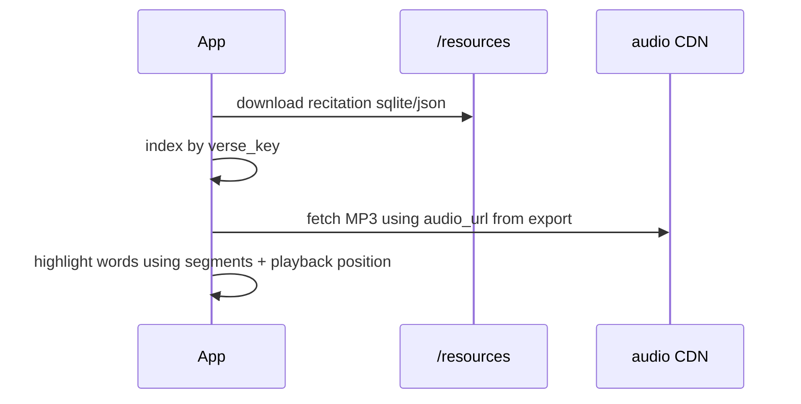
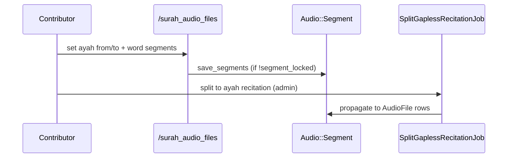

# Phase 14 — Audio Subsystem

> **Onboarding series:** progressive deep-dive for becoming a legitimate QUL contributor.  
> **Prerequisites:** [Phases 1–13](phase-01-what-is-qul.md)  
> **This file:** how QUL stores, segments, exports, and serves Quran recitation audio.

---

## What the audio subsystem delivers

QUL audio is not just MP3 URLs. It is a **layered system**:

| Layer | What consumers get |
|---|---|
| **Audio files** | Pointers to MP3 (or other format) per surah or per ayah |
| **Ayah timing** | `timestamp_from` / `timestamp_to` (ms) within a gapless surah file |
| **Word timing** | `segments` JSON — per-word start/end ms within each ayah |
| **Letter timing** | `letter_segments` — sub-word granularity (advanced) |
| **Metadata** | Duration, bit rate, file size, mime type |

**FACT** — Official tutorial: `app/views/docs/markdown/tutorial-recitation-end-to-end.md`

Public catalog: `/resources/recitation`

---

## Two parallel recitation models (important)

QUL uses **two different Active Record classes** for recitations:

| Model | Table | Cardinality | Audio rows | Typical use |
|---|---|---|---|---|
| `Audio::Recitation` | `audio_recitations` | **Surah-by-surah** (`1_chapter`) | `Audio::ChapterAudioFile` (114 files) | Gapless surah MP3s + segments |
| `Recitation` | `recitations` | **Ayah-by-ayah** (`1_ayah`) | `AudioFile` (~6236 rows) | One MP3 per ayah |
| `ResourceContent` (wbw) | — | **Word-by-word** (`1_word`) | word recitation export | Rare / specialized |

```ruby
# Link between gapless and gapped editions
Audio::Recitation has_one :gapped_recitation, class_name: 'Recitation', foreign_key: :gapless_recitation_id
Recitation belongs_to :gapless_recitation, class_name: 'Audio::Recitation'
```

**INFERENCE:** A common workflow: annotate segments on **gapless surah audio**, then **split** into ayah-by-ayah files via `SplitGaplessRecitationJob`.

Both hang off `ResourceContent` with `sub_type: 'recitation'` and appropriate `cardinality_type`.

---

## Entity diagram (surah-by-surah path)

```text
ResourceContent (recitation, 1_chapter)
  └── Audio::Recitation
        ├── Audio::ChapterAudioFile  (one per surah, 1..114)
        │     └── audio_url → CDN MP3
        └── Audio::Segment  (one per ayah in that surah)
              ├── timestamp_from / timestamp_to  (ayah bounds in surah file)
              ├── segments  (word-level JSON)
              └── letter_segments  (optional)
```

## Entity diagram (ayah-by-ayah path)

```text
ResourceContent (recitation, 1_ayah)
  └── Recitation
        └── AudioFile  (one per verse)
              ├── url / audio_url
              └── segments  (text column — word timing for ayah file)
```

---

## Where audio files live (CDN)

**FACT** — URLs are **not** stored in QUL's S3 export bucket. They point to external CDNs:

```ruby
# lib/audio/generate_audio_file.rb
@base_url = resource_content.meta_value("audio-cdn-url") || "https://download.quranicaudio.com"
# Surah: #{base_url}/#{relative_path}/001.mp3
# Ayah:  #{base_url}/#{relative_path}/001001.mp3
```

Published packages may reference `audio-cdn.tarteel.ai` — tutorial explicitly says **self-host for production**, do not hotlink.

**INFERENCE:** QUL curates **metadata + timing**; audio bytes live on CDN infrastructure.

---

## Segment data formats

### Ayah-level timing (within gapless surah)

On `Audio::Segment`:

| Field | Unit | Meaning |
|---|---|---|
| `timestamp_from` | milliseconds | Ayah start in surah MP3 |
| `timestamp_to` | milliseconds | Ayah end in surah MP3 |
| `duration_ms` | ms | Computed span |

### Word-level timing

`segments` JSON array on `Audio::Segment` (surah path) or `AudioFile` (ayah path):

```ruby
# Each element: [word_position, start_ms, end_ms, optional_metadata]
[1, 0, 450]
[2, 450, 890, { "waqaf" => true }]
```

```ruby
# app/models/audio/segment.rb
def set_segments(segments_list, user = nil)
  # validates word_number <= verse.words_count
  self.segments = list
  self.segments_count = list.size
end
```

**Join key:** `verse_key` (`"2:255"`) on segment rows; word position indexes into `verse.words`.

### Letter-level timing

`letter_segments` — `[word_number, letter_text, start_ms, end_ms]` arrays for fine-grained Tajweed tooling.

---

## Contributor tools

### Surah audio segments — `/surah_audio_files`

| Route | Purpose |
|---|---|
| `index` | Pick recitation + surah |
| `segment_builder` | Visual segment editor UI |
| `segments` | Load ayah list for chapter |
| `POST save_segments` | Save timing for one `verse_key` |
| `validate_segments` | Server-side validation |

**FACT** — Writes directly to `Audio::Segment` when `!segment_locked?`.

```ruby
# save_segments
segment.update_time_and_offset_segments(params[:from], params[:to], key)
# or
segment.set_segments!(params['segments'], current_user)
```

### Ayah audio segments — `/ayah_audio_files`

Parallel tool for ayah-by-ayah `Recitation` + `AudioFile` rows.

### Compare audio — `/compare-audio`

`CommunityController#compare_audio` — side-by-side recitation comparison (layout: false).

### Segment pipeline — `/segment_pipeline/*`

Vue-based tooling for ML-assisted segment generation/import (Phase 5 third store: `Segments::Base` → SQLite).

Routes include `reciters/:recitation_id`, chapter runs, `import`, `generate_all`.

**INFERENCE:** Heavier automation path vs manual `segment_builder`.

---

## `segment_locked` flag

| Model | Default | Effect |
|---|---|---|
| `Audio::Recitation` | `false` | Contributors can edit segments |
| `Recitation` | `true` | Ayah recitation segments locked by default |

When locked, `save_segments` skips mutations — protects published timing data.

---

## Background jobs

| Job | Role |
|---|---|
| `Audio::GenerateAudioFilesJob` | Populate `ChapterAudioFile` or `AudioFile` URLs from CDN pattern |
| `Audio::UpdateMetaDataJob` | Fetch duration, bit rate, file size from remote files |
| `Audio::SplitGaplessRecitationJob` | Derive ayah segments + optionally split MP3s with ffmpeg |
| `Audio::ExportAudioSegmentsJob` | Export segment data |
| `Segments::ExportReciterSegmentsJob` | Segment pipeline export |

### Gapless split pipeline

```text
Audio::Recitation (gapless surah MP3s)
  → contributor annotates Audio::Segment timestamps
  → SplitGaplessRecitationJob
       → create/link Recitation (ayah-by-ayah)
       → copy ayah timing to AudioFile rows
       → optional ffmpeg split (divide_audio: true)
  → Audio::SplitGaplessAudio uses segment timestamps + ffmpeg
```

```ruby
# lib/audio/split_gapless_audio.rb
`ffmpeg -i #{input} -ss #{from} -to #{to} -c copy #{output}`
```

**FACT** — Job can auto-create ayah `ResourceContent` + `Recitation` if not provided.

---

## Import pipelines (`lib/audio_segment/`)

| Class | Target | Input |
|---|---|---|
| `AudioSegment::SurahBySurah` | `Audio::Segment` | SQLite/CSV/JSON timing DB |
| `AudioSegment::AyahByAyah` | `AudioFile` | SQLite/CSV per-ayah timings |
| `AudioSegment::Tarteel` | Tarteel-specific format | **INFERENCE** — internal integration |

```ruby
AudioSegment::SurahBySurah.import(recitation_id:, file_path:, remove_existing:)
# Reads SQLite timings table (sura, ayah columns) → creates/updates segments
```

---

## Export pipeline (public catalog)

```ruby
# lib/exporter/downloadable_resources.rb

export_surah_recitation  # Audio::Recitation → JSON dir + SQLite
export_ayah_recitation   # Recitation → JSON + SQLite
export_wbw_recitation    # word-level (specialized)
```

### Surah recitation export (`Exporter::ExportSurahRecitation`)

Output directory contains:

| File | Contents |
|---|---|
| `surah.json` | Per-chapter audio metadata (URL, duration, …) |
| `segments.json` | Per-ayah word segments + timestamps |
| `.sqlite` | `surah_list` + `segments` tables |

```ruby
segments_data[verse_key] = {
  segments: segment.get_segments(drop_metadata: true),
  duration_sec: ...,
  timestamp_from: ...,
  timestamp_to: ...
}
```

Skipped from export if `chapter_audio_files.size < 114` (incomplete recitation).

---

## API v1 endpoints

```text
GET /api/v1/audio/surah_recitations
GET /api/v1/audio/surah_recitations/:id
GET /api/v1/audio/surah_recitations/:id/wav_manifest
GET /api/v1/audio/ayah_recitations
GET /api/v1/audio/ayah_recitations/:id
GET /api/v1/audio/surah_segments/:recitation_id
GET /api/v1/audio/ayah_segments/:recitation_id
```

**INFERENCE:** Live API for apps; `/resources` zips are bulk offline path.

`wav_manifest` — generated by `lib/audio/generate_audio_wav_manifest.rb` for uncompressed audio apps.

---

## Admin CMS (`app/admin/audio/`)

| Resource | Manages |
|---|---|
| `audio_recitation.rb` | Surah recitations, generate files, split gapless |
| `recitation.rb` | Ayah recitations |
| `chapter_audio_file.rb` | Per-surah file metadata |
| `related_recitation.rb` | Link gapless ↔ gapped editions |

Admin actions enqueue the same jobs as above (`GenerateAudioFilesJob`, `SplitGaplessRecitationJob`, etc.).

---

## ResourceContent metadata (audio-specific)

| `meta_data` key | Role |
|---|---|
| `audio-cdn-url` | Override CDN base for URL generation |
| `tarteel_key` | Tarteel app integration identifier |
| `has-segments` | Catalog tag / export hint |

Reciter identity: `reciter_id`, `recitation_style_id`, `qirat_type_id` on recitation rows.

---

## End-to-end flows

### Flow A — Consumer app (download path)



### Flow B — Contributor segments gapless surah



---

## Validation

`Audio::SegmentValidator` — checks segment continuity, word counts, duration bounds.

`Recitation#validate_segments_data` — reports missing segments per chapter.

Contributor UI calls `validate_segments` before bulk save.

---

## Comparison to other subsystems

| Aspect | Translation proofreading | Mushaf layouts | Audio segments |
|---|---|---|---|
| Write pattern | Draft → approve | Direct write | **Direct write** |
| Primary artifact | Text | Page geometry | **Timestamps (JSON)** |
| External bytes | N/A | N/A | **CDN MP3s** |
| Export includes bytes | Text in zip | Layout only | **URLs + timing, not MP3** |
| Lock flag | N/A | N/A | `segment_locked` |

---

## Common gotchas

1. **Two recitation classes** — `Audio::Recitation` ≠ `Recitation`. Check cardinality before querying.

2. **Milliseconds everywhere** in segment timing — not seconds (export may also expose `duration_sec`).

3. **CDN URLs in exports are pointers** — self-host audio for production apps.

4. **`segments` on `AudioFile` is text/JSON column** — different storage than `Audio::Segment.segments` jsonb; same conceptual format.

5. **114 vs 6236 completeness** — exporters skip incomplete recitations.

6. **Gapless vs gapped** — surah files need ayah timestamps before word highlighting works across ayah boundaries.

7. **Segment pipeline SQLite** (`Segments::Base`) is a **third datastore** for ML tooling — not the Quran DB.

---

## Uncertainties

| # | Question | Label |
|---|---|---|
| 1 | Whether word-by-word recitation export is actively maintained | **INFERENCE** — `export_wbw_recitation` exists but uses `.first` approved resource |
| 2 | Full segment_pipeline → Quran DB import path | **UNKNOWN** — routes exist; deep dive in local setup |
| 3 | Production CDN ownership split (Tarteel vs quranicaudio.com) | **INFERENCE** — per-resource `audio-cdn-url` override |
| 4 | Whether `audio_url` vs `url` column is canonical on `AudioFile` | **INFERENCE** — both exist; generator sets `url` |

---

## Phase 14 summary

```text
ResourceContent (recitation)
  → Audio::Recitation (surah) OR Recitation (ayah)
  → ChapterAudioFile / AudioFile (CDN URLs)
  → Audio::Segment / segments JSON (timing)
  → export surah.json + segments.json + sqlite
  → consumer self-hosts MP3 + uses timing for sync
```

Audio in QUL is a **metadata and timing curation system** wrapped around externally hosted sound files.

---

## Stop here — questions before Phase 15

Phase 15 covers **background jobs (Sidekiq)** in depth — queues, scheduler, failure modes.

1. What's the difference between `Audio::Recitation` and `Recitation`?
2. What three levels of timing exist (ayah, word, letter)?
3. Why doesn't QUL export the actual MP3 bytes in `/resources` zips?

Reply with questions, or say **"proceed"** for **Phase 15 — Background Jobs (Sidekiq)**.
