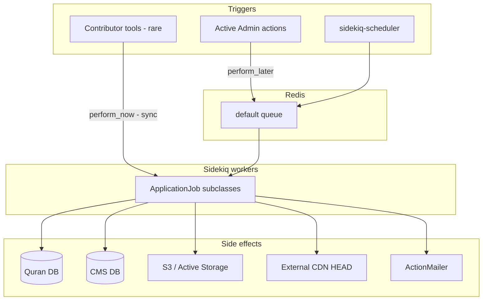

# Phase 15 — Background Jobs (Sidekiq)

> **Onboarding series:** progressive deep-dive for becoming a legitimate QUL contributor.  
> **Prerequisites:** [Phases 1–14](phase-01-what-is-qul.md)  
> **This file:** how QUL runs long work off the request thread — Sidekiq setup, job families, sync vs async patterns, and failure behavior.

---

## Why jobs exist in QUL

Many operations are too slow or too heavy for a web request:

| Operation | Why async |
|---|---|
| `refresh_export!` | Builds JSON/SQLite zips, uploads to S3 |
| Draft approve (bulk) | `insert_all` / `upsert_all` across thousands of verses |
| QuranEnc import | HTTP fetch + parse + draft rows |
| Audio metadata | HEAD requests to CDN for every surah/ayah file |
| Gapless audio split | ffmpeg subprocess per ayah |
| Mini dump generation | `pg_dump` + table pruning (dev only) |

**FACT** — `ActiveJob::Base.queue_adapter = :sidekiq` in `config/initializers/sidekiq.rb` and `config/initializers/active_job.rb`.

For a React/Node engineer: **Sidekiq ≈ Bull/BullMQ + Redis**. Jobs are Ruby classes with a `perform` method.

---

## Infrastructure stack

| Component | Gem / config | Role |
|---|---|---|
| Queue backend | `sidekiq` ~> 7.2 | Redis-backed worker |
| Scheduler | `sidekiq-scheduler` | Cron-style recurring jobs |
| Progress UI | `sidekiq-status` | Job progress (used sparingly) |
| Error tracking | `sentry-sidekiq` | Reports failures after retries exhausted |
| Redis | `docker-compose.yml` service `redis:7` | Local dev broker |

### Running workers locally

```bash
# Start Redis (if using docker-compose)
docker compose up redis -d

# Start Sidekiq
bundle exec sidekiq -e development -C config/sidekiq.yml
# or
bin/start-sidekiq   # defaults RAILS_ENV=production
```

**FACT** — `bin/setup` prepares databases but does **not** start Redis or Sidekiq. You run those separately.

**INFERENCE** — Production uses `docker/sidekiq.run` → `bin/start-sidekiq` as a dedicated process (not in `docker-compose.yml` alongside the web app).

---

## Queue configuration

```yaml
# config/sidekiq.yml
:concurrency: 4          # dev default; production: 3, staging: 1
:queues:
  - [default, 5]         # weighted priority
  - [mailers, 1]
  - [active_storage_purge, 1]
```

Mailers and Active Storage purge get their own queues with lower weight.

### Queue mismatch to watch

```ruby
# config/initializers/sidekiq.rb
config.active_storage.queues.purge = 'low'
config.active_storage.queues.mirror = 'low'
```

**FACT** — Initializer references a `low` queue, but `config/sidekiq.yml` does **not** list `low`.

**INFERENCE** — Active Storage purge/mirror jobs may sit unprocessed unless production Sidekiq config differs from repo, or a catch-all worker exists elsewhere.

Most QUL jobs explicitly use `queue_as :default` or inherit the default.

---

## Sidekiq Web UI

```ruby
# config/routes.rb
authenticated :user, ->(user) { user.is_super_admin? || user.is_admin? } do
  mount Sidekiq::Web => '/sidekiq'
end
```

**FACT** — `/sidekiq` is admin-only. Use it to inspect retries, dead jobs, and scheduler status.

---

## Scheduled (cron) jobs

```yaml
# config/sidekiq_scheduler.yml
daily_backup:
  class: BackupJob
  cron: "0 10 * * *"           # daily 10:00 UTC

quran_enc_update_checker:
  class: DraftContent::CheckContentChangesJob
  cron: "0 6 * * 0"            # weekly Sunday 06:00 UTC
```

| Job | What it does |
|---|---|
| `BackupJob` | Calls `Utils::DbBackup.run` — **production only** |
| `DraftContent::CheckContentChangesJob` | Polls QuranEnc changelog → creates `AdminTodo` → enqueues `ImportDraftContentJob` |

**INFERENCE** — Only two recurring jobs are defined. Most work is **event-driven** (admin button click, contributor action).

Admin can also trigger `BackupJob` and `CheckContentChangesJob` manually from `app/admin/database_backup.rb`.

---

## Job inventory by domain

QUL has ~30 job classes under `app/jobs/`. Grouped by responsibility:

### Draft content pipeline

| Job | Trigger | Writes to |
|---|---|---|
| `DraftContent::ImportDraftContentJob` | Admin "import", weekly checker | Draft tables (QuranEnc / TafsirApp) |
| `DraftContent::ApproveDraftTranslationJob` | Admin bulk approve | `translations` (Quran DB) |
| `DraftContent::ApproveDraftTafsirJob` | Admin bulk approve | `tafsirs` |
| `DraftContent::ApproveDraftWordTranslationJob` | Admin bulk approve | `word_translations` |
| `DraftContent::ApproveDraftUloomContentJob` | Admin bulk approve | uloom tables |
| `DraftContent::RemoveDraftContentJob` | Admin cleanup | Draft tables |
| `DraftContent::CheckContentChangesJob` | Cron / manual | CMS todos + chains import |

Base class `ApproveDraftContentJob`:

```ruby
def perform(resource_content_id, draft_id = nil, use_draft_content: false)
  PaperTrail.enabled = false
  import_data
  run_post_import_tasks   # hooks, AdminTodo finish, ActiveAdmin::Comment on issues
ensure
  PaperTrail.enabled = true
end
```

**FACT** — Approve jobs disable PaperTrail during bulk writes, then run `resource.run_after_import_hooks`.

### Export / publication

| Job | Role |
|---|---|
| `AsyncResourceActionJob` | Generic: `resource.send(action, *args)` — used for `refresh_export!` |
| `ExportTranslationJob` | Admin ad-hoc SQLite export → chains `UploadTranslationDbJob` |
| `Export::TranslationJob` | JSON export to `public/exported_translations/` |
| `Export::TafsirJob` | Tafsir export |
| `Export::MushafLayoutExportJob` | SQLite mushaf layout zip + email |
| `ExportMiniDumpJob` | **Development only** — prunes Quran DB + `pg_dump` |
| `ExportWordsJob` | Word data export |
| `ExportIndopakAyah` / `ExportIndopakWbwJob` | Script-specific exports |
| `ExportDbForSemanticSearchJob` | Semantic search DB build |
| `UploadTranslationDbJob` | Attaches exported `.bz2` to `ResourceContent` via Active Storage |

**Key publication path (Phase 11):**

```text
Admin clicks "Refresh downloads"
  → AsyncResourceActionJob.perform_later(resource, :refresh_export!, send_update_email: notify)
  → DownloadableResource#refresh_export!
  → lib/exporter/downloadable_resources.rb
  → S3 upload
```

Admin sees: *"Data will be exported in the background. Please check back later."*

### Audio

| Job | Retry | Role |
|---|---|---|
| `Audio::GenerateAudioFilesJob` | default | Populate CDN URLs on `ChapterAudioFile` / `AudioFile` |
| `Audio::UpdateMetaDataJob` | default | Fetch duration/bitrate from remote files |
| `Audio::SplitGaplessRecitationJob` | **0** | ffmpeg split + ayah segment propagation |
| `Audio::ExportAudioSegmentsJob` | default | Segment data export |

**FACT** — `SplitGaplessRecitationJob` sets `retry: 0` — ffmpeg failures are not auto-retried (partial file risk).

### Mushaf

| Job | Sync? | Role |
|---|---|---|
| `MushafLayoutJob` | **perform_now** from controller | Save page word mapping to Quran DB |
| `Export::MushafLayoutExportJob` | async | Admin-triggered SQLite export |

### Segments / misc

| Job | Role |
|---|---|
| `Segments::ExportReciterSegmentsJob` | Segment pipeline export |
| `LokaliseJob` | i18n key sync (`import` / `export` actions) |
| `Recurring::UpdateApiStatsJob` | Refresh API client usage stats |
| `BackupJob` | Production DB backup |

---

## `perform_later` vs `perform_now` — critical split

Not everything is queued. QUL uses **synchronous** job execution in contributor-facing paths:

| Path | Method | Why |
|---|---|---|
| Mushaf layout save (`MushafLayoutsController`) | `MushafLayoutJob.perform_now` | Contributor expects immediate page update |
| Single draft import (`Draft::Content#import!`) | `ApproveDraft*Job.perform_now` | Inline approve after contributor submits one ayah |
| Admin bulk approve | `perform_later` | Too large for request timeout |
| Admin refresh export | `perform_later` | S3 upload takes minutes |
| Admin import from QuranEnc | `perform_later` | Network + parse |

```ruby
# app/controllers/mushaf_layouts_controller.rb
MushafLayoutJob.perform_now(@resource.resource_id, page_number, layout_params.to_json)

# app/models/draft/content.rb
DraftContent::ApproveDraftTranslationJob.perform_now(resource_content_id, id, use_draft_content: true)
```

**INFERENCE** — `perform_now` still runs through ActiveJob but **blocks the HTTP request** in the same process. In development without Sidekiq running, `perform_later` jobs pile up in Redis; `perform_now` still works.

---

## The `AsyncResourceActionJob` pattern

```ruby
class AsyncResourceActionJob < ApplicationJob
  queue_as :default

  def perform(resource, action, *args)
    resource.send(action, *args)
  end
end
```

Used when admin UI needs to call an existing model method asynchronously without creating a dedicated job per action:

```ruby
AsyncResourceActionJob.perform_later(resource, :refresh_export!, send_update_email: notify)
```

**INFERENCE** — Convenient but opaque in Sidekiq UI (job name doesn't reveal the action). Check args in the job detail view.

---

## Job chaining

Jobs enqueue other jobs:

```text
CheckContentChangesJob
  └── ImportDraftContentJob.perform_later(resource.id)

ExportTranslationJob
  └── UploadTranslationDbJob.perform_later(resource_content, "#{file_name}.bz2")
```

No explicit workflow engine (no Sidekiq batches / unique jobs gem). Chains are ad-hoc `perform_later` calls inside `perform`.

---

## Retry and failure behavior

| Job | `sidekiq_options retry` |
|---|---|
| Most draft jobs | `1` |
| `Export::TafsirJob` | `2` |
| `Export::MushafLayoutExportJob` | `3` |
| `Audio::SplitGaplessRecitationJob` | `0` |
| Jobs without explicit options | Sidekiq default (25) |

```ruby
# config/initializers/sentry.rb (production)
config.sidekiq.report_after_job_retries = true
```

**FACT** — Sentry captures job exceptions only after retries are exhausted.

### In-job error handling

```ruby
# Recurring::UpdateApiStatsJob
active_clients.find_each do |api_client|
  begin
    api_client.update_api_stats
  rescue Exception => e
    Sentry.capture_exception(e)   # per-client failure doesn't abort batch
  end
end
```

### Post-import issue reporting

Approve jobs don't raise on data quality issues — they log to Active Admin:

```ruby
def report_issues(issues)
  ActiveAdmin::Comment.create(namespace: 'cms', resource: @resource, body: ...)
end
```

**INFERENCE** — A "successful" job can still leave data problems visible as CMS comments.

---

## Progress tracking (`sidekiq-status`)

Configured globally in `config/initializers/sidekiq.rb`, but only one job uses it:

```ruby
class Recurring::UpdateApiStatsJob < ApplicationJob
  include Sidekiq::Status::Worker

  def perform(id: nil)
    total active_clients.size
    at counter, api_client.name   # updates progress in Redis
  end
end
```

**INFERENCE** — Most jobs have no progress bar. Long exports are fire-and-forget + email on completion (when `user_id` passed).

---

## Environment guards

Some jobs refuse to run outside expected environments:

```ruby
# BackupJob — production only
# ExportMiniDumpJob — development only, raises in other envs
# Export::TranslationJob — emails only in production
```

**FACT** — `ExportMiniDumpJob` deletes large swaths of Quran DB tables before `pg_dump`. Never run in production.

---

## Mental model: where jobs sit in the system



---

## Debugging checklist (contributor)

1. **Is Redis running?** `docker compose up redis -d` or local `redis-server`.
2. **Is Sidekiq running?** `bundle exec sidekiq -C config/sidekiq.yml`.
3. **Is the job queued or sync?** Contributor mushaf/draft paths use `perform_now`; admin paths use `perform_later`.
4. **Check `/sidekiq`** (admin login) for retries/dead jobs.
5. **Check Sentry** (production) for exhausted-retry failures.
6. **Check CMS comments** on `ResourceContent` for post-import issues.
7. **Check `AdminTodo`** for pending QuranEnc update notifications.

---

## Stale / missing code signals

| Signal | Label |
|---|---|
| `DraftContent::ApproveDraftRootDetailJob` referenced in admin + `Draft::Content#import!` but **no job file** in `app/jobs/` | **FACT** — broken reference unless autoloaded elsewhere |
| `Importer::TafsirApp.delay.import_tafsirs` commented in source | **FACT** — legacy Delayed Job syntax, not active |
| `active_storage` → `low` queue not in `sidekiq.yml` | **FACT** — possible misconfiguration |

---

## Comparison to prior phases

| Phase | Topic | Job connection |
|---|---|---|
| 8 | CMS flow | Admin approve/import → `DraftContent::*` jobs |
| 10 | Import pipeline | `ImportDraftContentJob` wraps `lib/importer/` |
| 11 | Export pipeline | `AsyncResourceActionJob` → `refresh_export!` |
| 13 | Mushaf layouts | `MushafLayoutJob` (sync), `MushafLayoutExportJob` (async) |
| 14 | Audio | `GenerateAudioFilesJob`, `SplitGaplessRecitationJob` |

---

## Uncertainties

| # | Question | Label |
|---|---|---|
| 1 | Whether production Sidekiq config adds a `low` queue | **UNKNOWN** |
| 2 | Where `ApproveDraftRootDetailJob` is defined (if anywhere) | **UNKNOWN** — references exist, file missing |
| 3 | Whether multiple Sidekiq processes run in production (dedicated export workers) | **INFERENCE** — single `sidekiq.yml` suggests one pool |
| 4 | Redis URL for Sidekiq in production (`REDIS_URL` vs default) | **INFERENCE** — standard Sidekiq env convention |

---

## Phase 15 summary

```text
ActiveJob + Sidekiq + Redis
  → default queue (weighted)
  → cron: backup + QuranEnc checker
  → admin: perform_later for heavy work
  → contributor: perform_now for interactive edits
  → AsyncResourceActionJob for generic model actions
  → Sentry after retry exhaustion
```

Jobs are the **glue between UI clicks and multi-minute data operations**. Understanding sync vs async enqueue is essential before changing contributor or CMS flows.

---

## Stop here — questions before Phase 16

Phase 16 covers **frontend reality** — Webpacker, Vue islands, Stimulus, and how Rails views host JS.

1. What must be running locally for `perform_later` jobs to execute?
2. Which two jobs run on a schedule, and what do they do?
3. Why does mushaf layout save use `perform_now` while export refresh uses `perform_later`?

Reply with questions, or say **"proceed"** for **Phase 16 — Frontend Reality**.
