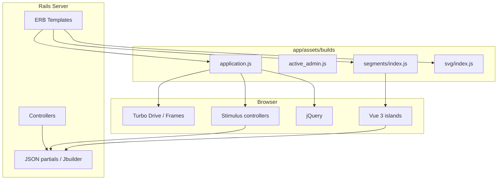

# Phase 16 — Frontend Reality

> **Onboarding series:** progressive deep-dive for becoming a legitimate QUL contributor.  
> **Prerequisites:** [Phases 1–15](phase-01-what-is-qul.md)  
> **This file:** what the QUL frontend actually is — not a React SPA, but a layered Rails-first UI with Stimulus, Turbo, jQuery, and two Vue islands.

---

## The headline truth

QUL is **not** a single frontend app. It is a **Rails server-rendered site** with progressive enhancement:

```text
ERB templates (HTML)
  + Tailwind + Sass (CSS)
  + Turbo (partial navigation / frames)
  + Stimulus (~86 controllers)
  + jQuery (legacy + Active Admin + some tools)
  + Vue 3 (2 isolated pages only)
```

**INFERENCE:** If you come from React/Next.js, expect **no component tree**, **no global state store**, and **no client-side router**. Most pages are full HTML round-trips or Turbo Frame swaps.

Phase 4 introduced this stack briefly. This phase goes deeper on **where code lives**, **how pages boot JS**, and **which pattern to use for new work**.

---

## Build toolchain

| Piece | Technology | Output |
|---|---|---|
| JS bundler | **esbuild** (`esbuild.config.js`) | `app/assets/builds/*.js` |
| CSS (app) | **Sass** (`yarn build:css`) | `app/assets/builds/application.css`, etc. |
| CSS (utility) | **Tailwind** (`bin/rails tailwindcss:watch`) | `app/assets/builds/tailwind.css` |
| Asset serving | **Sprockets** (`sprockets-rails`) | Serves `app/assets/builds/` |

**FACT** — There is **no Webpacker, Vite, or importmap** in this repo. `package.json` scripts use `esbuild` + `esbuild-rails` + `esbuild-plugin-vue3`.

### Four JS entry points

```javascript
// esbuild.config.js
const entryPoints = [
  "application.js",      // public site + contributor tools
  "active_admin.js",     // CMS (/cms)
  "segments/index.js",   // Vue — audio segment builder
  "svg/index.js"         // Vue — SVG optimizer tool
]
```

Everything else is imported transitively from these roots.

### Dev workflow

```text
bin/dev
  ├── web:      bin/rails server -p 3000
  ├── js:       yarn build --reload    # esbuild + live reload via SSE
  └── tailwind: bin/rails tailwindcss:watch
```

**FACT** — `Procfile.dev` does not start Redis or Sidekiq (Phase 15).

`yarn build --reload` injects a small EventSource listener that reloads the browser when JS, Vue, ERB, or CSS changes.

---

## Layout and asset loading

### Public / contributor pages

```erb
<!-- app/views/layouts/application.html.erb -->
<%= stylesheet_link_tag "tailwind", "inter-font", ... %>
<%= stylesheet_link_tag "application", ... %>
<%= javascript_include_tag "application", defer: true %>
```

`application.js` boots:

```javascript
import "./libs/jquery";       // global $ and jQuery
import "@hotwired/turbo-rails"
import "trix"
import "@rails/actiontext"
import "./controllers"        // all Stimulus controllers
import "./utils/ayah-player"
```

### Active Admin (CMS)

Separate bundle: `active_admin.js` → jQuery UI, Active Admin initializers, Turbo, and a **subset** of Stimulus via `controllers/for_admin.js`.

**FACT** — CMS registers Tailwind + Font Awesome as stylesheets in `config/initializers/active_admin.rb`. It does **not** call `register_javascript` — the AA layout loads `active_admin.js` through Sprockets precompile list.

### Vue island pages

Only two views load a second JS bundle:

| Page | View | Mount point |
|---|---|---|
| Surah/ayah segment builder | `surah_audio_files/segment_builder.html.erb` | `#app` |
| SVG optimizer | `community/svg_optimizer.html.erb` | `#app` |

```erb
<%= javascript_include_tag "segments/index", defer: true %>
<%= stylesheet_link_tag "segments/index", defer: true %>

<div id="app"
     data-recitation="..."
     data-chapter="..."
     data-segment-locked="...">
  <p>Loading</p>
</div>
```

Vue reads config from **`data-*` attributes** on the mount element's parent — not from a JSON API bootstrap endpoint.

---

## Stimulus — the default interaction layer

~**86** controllers in `app/javascript/controllers/`.

### Auto-registration

```javascript
// app/javascript/controllers/index.js
import controllers from "./**/*_controller.js"
controllers.forEach((controller) => {
  application.register(controller.name, controller.module.default)
})
```

`esbuild-rails` glob-imports every `*_controller.js`. Naming convention maps file path → controller name:

| File | HTML attribute |
|---|---|
| `mushaf_page_controller.js` | `data-controller="mushaf-page"` |
| `segments/failure_player_controller.js` | `data-controller="segments--failure-player"` |
| `translation_footnote_controller.js` | `data-controller="translation-footnote"` |

Nested folders use `--` (Stimulus convention).

### Typical Stimulus patterns in QUL

**1. DOM enhancement on connect**

```erb
<div data-controller="translation-footnote">
```

**2. Values and targets from HTML**

```erb
<div data-controller="syntax-graph"
     data-syntax-graph-url-value="/morphology/.../graph.json">
```

**3. Actions**

```erb
<button data-action="click->dropdown#toggle">
```

**4. jQuery inside Stimulus** — common in older controllers:

```javascript
// mushaf_page_builder_controller.js
this.el = $(this.element);
this.el.find("#decrement").on("click", ...);
```

**INFERENCE:** New code should prefer vanilla DOM or Stimulus APIs, but matching existing jQuery style in a file is acceptable for consistency.

### Heavy Stimulus controllers (know before editing)

| Controller | ~Lines | Domain |
|---|---|---|
| `treebank_controller.js` | 1300+ | Morphology constituency/dependency SVG |
| `syntax_graph_controller.js` | 1300+ | Syntax graph preview |
| `segments/store/index.js` (Vuex, not Stimulus) | 1400+ | Segment builder state |

These are **mini apps inside a controller** — read carefully before changing.

---

## Turbo — partial page updates

Turbo Drive is enabled globally via `@hotwired/turbo-rails`.

### Turbo Frames (most common)

Ayah viewer loads tab content lazily:

```erb
<%= turbo_frame_tag :ayah_text, src: ayah_text_path(@ayah.verse_key) %>
<%= turbo_frame_tag :ayah_translations, src: ayah_translations_path(...) %>
```

Clicking prev/next ayah replaces the `:ayah_info` frame without full page reload.

Mushaf layout editor uses frames for page preview:

```erb
<%= turbo_frame_tag "mushaf-page" do %>
  ...
<% end %>
```

### Turbo Streams

Mushaf save responds with stream updates:

```erb
<!-- mushaf_layouts/save_page_mapping.turbo_stream.erb -->
<%= turbo_frame_tag "page-preview-#{@mushaf_page.page_number}" do %>
```

### Opting out

Some tools disable Turbo to avoid breaking jQuery widgets or Vue mounts:

```erb
<div data-turbo="false">   <!-- segments dashboard header -->
```

Devise forms also use `data-turbo="false"` on auth forms.

---

## Vue islands (only two)

### Segment builder (`app/javascript/segments/`)

**Purpose:** Word-level audio segment editor (Phase 14).

```text
App.vue
  ├── SelectAudioSrc.vue
  ├── ActionBar.vue
  ├── Verse.vue
  └── Alert.vue
store/index.js (Vuex)
  ├── LOAD_SEGMENTS → GET /surah_audio_files/:id/segments.json
  ├── SAVE_SEGMENTS → POST .../save_segments.json
  └── letter segment batching, compare mode, localStorage draft
```

**Bridge pattern:** Rails passes server state via `data-*` on `#app`; Vue `mounted()` reads `this.$el.parentElement.dataset` and commits to Vuex.

**API style:** Mix of `fetch()` and `$.get()` / `$.post()` with Rails CSRF token headers.

### SVG optimizer (`app/javascript/svg/`)

Community tool at `/community/svg_optimizer` — Vue + Vuex for SVG point editing (font/tajweed tooling).

**FACT** — No Vue Router. One page, one mount, no client-side routes.

---

## jQuery — still present

| Area | Usage |
|---|---|
| `application.js` | Global `$` via `libs/jquery.js` |
| Active Admin | jQuery UI (datepicker, dialog, tabs) |
| Stimulus controllers | DOM queries, AJAX in older tools |
| Segment Vuex store | `$.get`, `$.param` for legacy endpoints |
| Translation footnotes | `$(dom).append(...)` |

**INFERENCE:** jQuery is **legacy but active**. Do not rip it out casually — many tools depend on it.

---

## How contributor tools talk to the server

Three patterns coexist:

### 1. Standard Rails forms + Turbo

```erb
<%= form_with ..., data: { controller: 'remote-form' } do |form| %>
```

`remote_form_controller.js` handles validation, `turbo:submit-start/end`, optional auto-close.

### 2. `fetch` / jQuery AJAX from Stimulus or Vue

```javascript
// treebank_controller.js
const res = await fetch(this.urlValue, { headers: { Accept: "application/json" } });

// segments/store — save
fetch(`/${segmentsUrl}/${recitation}/save_segments.json`, requestOptions)
```

JSON endpoints return Rails-rendered JSON or Jbuilder payloads. CSRF token read from `<meta name="csrf-token">`.

### 3. Full page POST (mushaf)

`MushafLayoutsController` accepts form POST → `MushafLayoutJob.perform_now` → Turbo Stream response.

No separate BFF or GraphQL layer.

---

## CSS architecture

| Stylesheet | Scope |
|---|---|
| `tailwind.css` | Utility classes (primary layout system) |
| `application.scss` | Component SCSS (mushaf, tajweed, proofreading, select2, toastr) |
| `landing.scss` | Marketing / auth pages |
| `active_admin.scss` | CMS skin |
| `export.scss` / `pdf.scss` | Export and PDF layouts |
| `tinymce_custom.scss` | Rich text editor |

Contributor tools mix **Tailwind utility classes in ERB** with **legacy SCSS component classes** (e.g. `.mushaf`, `.qpc-hafs`).

Arabic fonts loaded via `@font-face` in `app/assets/stylesheets/shared/` — critical for mushaf and tajweed rendering.

---

## Tool → frontend pattern map

| Tool / page | Primary UI tech | Key files |
|---|---|---|
| `/resources`, `/docs` | ERB + Tailwind + Stimulus tabs | `resources/`, `controllers/tabs_controller.js` |
| `/ayah/:key` | Turbo Frames + Stimulus | `ayah/show.html.erb`, `turbo-frame-loading` |
| `/translation_proofreadings` | ERB + `remote-form` + `translation-footnote` | `translation_proofreadings/` |
| `/mushaf_layouts` | ERB + Stimulus (`mushaf-page-builder`) + Turbo | `mushaf_layouts_controller.rb` |
| `/surah_audio_files/.../segment_builder` | **Vue 3** island | `segments/` |
| `/segments/dashboard` | ERB + Stimulus players | `segments/dashboard/`, `data-turbo="false"` |
| Morphology treebank | Stimulus SVG renderer | `treebank_controller.js` |
| Dependency graphs | Stimulus + fetch | `syntax_graph_controller.js` |
| `/cms` | Active Admin + jQuery + AA JS | `active_admin.js`, `app/admin/` |
| Community compare audio | `layout: false` partial | `community_controller.rb` |

---

## Audio / playback libraries

| Library | Where |
|---|---|
| **Howler.js** | `segment_player_controller`, `ayah_segment_player_controller` |
| **HTML5 `<audio>`** | Segment builder Vue store, ayah player util |
| **hotkeys-js** | Keyboard shortcuts in editors |

---

## Rich text

- **Trix** + **ActionText** loaded in `application.js`
- Used in CMS and some content fields
- `tinymce_controller.js` exists for TinyMCE instances (admin)

---

## Testing frontend

**FACT** — `package.json` includes **Cypress** and **Puppeteer** as devDependencies.

**INFERENCE** — E2E tests exist but are not the primary contributor workflow. Linting: ESLint on `app/javascript/**/*.{js,vue}`.

---

## Mental model diagram



---

## Where to add frontend code (decision guide)

| You are building… | Use |
|---|---|
| Toggle, modal, small AJAX on an ERB page | **Stimulus controller** |
| Lazy-loaded tab or partial | **Turbo Frame** + optional Stimulus |
| New contributor tool with complex state + timeline UI | Consider **Vue island** (new esbuild entry) — rare; discuss first |
| CMS field behavior | **Active Admin** JS or Stimulus in `for_admin` |
| Public catalog page | **ERB + Tailwind** |

**Default answer:** Stimulus + ERB. Vue only when the segment builder proves the pattern (large interactive state, audio waveform UI).

---

## Stale / missing code signals

| Signal | Label |
|---|---|
| `segment_pipeline` routes in `config/routes.rb` but **no** `SegmentPipeline::*` controller in repo | **FACT** — routes may 404 locally; DB table `segment_pipeline_runs` exists |
| `segment_tool.js` in `assets.precompile` but **no source file** | **FACT** — stale asset reference |
| `segments/index.css` / `svg/index.css` referenced in views but not in `app/assets/stylesheets/` | **INFERENCE** — generated into `app/assets/builds/` by esbuild/Vue plugin on `yarn build` |
| Commented `Importer::TafsirApp.delay` (Delayed Job syntax) | **FACT** — dead legacy |

---

## Common gotchas for React engineers

1. **No client router** — URLs are Rails routes. `link_to` and `form_with` generate paths.

2. **`data-controller` is not a component** — no props, no children composition. State lives in the DOM or fetched on connect.

3. **Turbo can break jQuery widgets** — use `data-turbo="false"` or `turbo:load` listeners (see `active_admin.js` tooltip pattern).

4. **Vue is not shared** — segment builder and SVG optimizer do not import from each other or from Stimulus.

5. **Global `$`** — expect jQuery on most pages; avoid naming collisions.

6. **CSRF required** — POST/PUT/DELETE need `authenticity_token` (Rails forms handle this; `fetch` must set header manually).

7. **Two CSS systems** — Tailwind utilities + SCSS components coexist; check both when styling.

---

## Uncertainties

| # | Question | Label |
|---|---|---|
| 1 | Whether `segment_pipeline` UI lives in a private gem or unfinished branch | **UNKNOWN** — routes + schema exist, controllers absent |
| 2 | Production asset pipeline (CDN vs self-hosted builds) | **INFERENCE** — standard Sprockets precompile at deploy |
| 3 | Cypress test coverage extent | **UNKNOWN** — dep present, not surveyed |
| 4 | Plan to migrate more tools to Vue vs keep Stimulus | **UNKNOWN** — organizational preference |

---

## Phase 16 summary

```text
Rails ERB (source of truth for HTML)
  → esbuild bundles: application | active_admin | segments | svg
  → Stimulus for 95% of interactivity
  → Turbo Frames for ayah/mushaf partial updates
  → Vue only for segment builder + SVG optimizer
  → jQuery legacy still active in admin + older tools
```

The frontend is **intentionally boring** on most pages — complexity is localized to audio segments and morphology graph rendering.

---

## Stop here — questions before Phase 17

Phase 17 covers **local setup** — running `bin/setup`, loading the Quran dump, and verifying the stack end-to-end.

1. How many Vue entry points exist, and what pages use them?
2. What is the default way to add interactivity to an ERB page?
3. Why do segment dashboard pages set `data-turbo="false"`?

Reply with questions, or say **"proceed"** for **Phase 17 — Local Setup**.
